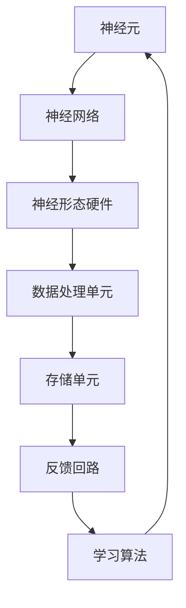
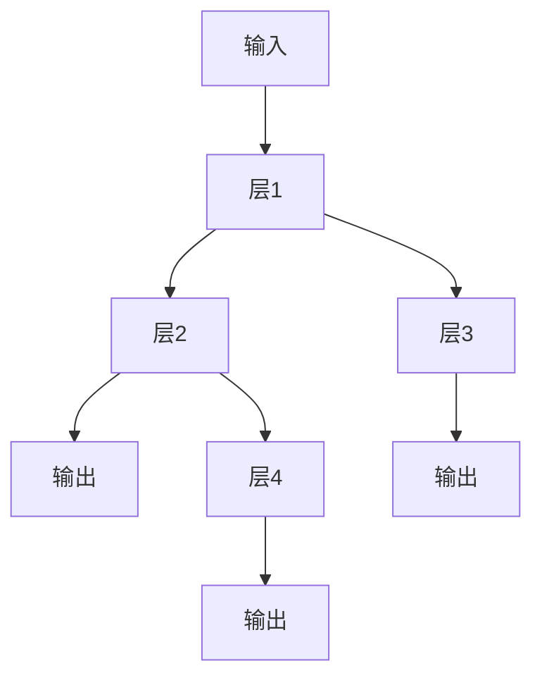

                 

# 神经形态计算：模仿大脑的新型AI硬件

> **关键词：神经形态计算，人工智能，大脑模拟，硬件架构，计算效率**

> **摘要：本文将深入探讨神经形态计算这一前沿领域，解释其基本原理，展示其在人工智能领域的应用，并探讨其未来发展趋势和面临的挑战。通过本文，读者将了解神经形态计算如何模拟大脑的神经网络，以及这一技术对现代AI硬件的革命性影响。**

## 1. 背景介绍

### 1.1 目的和范围

本文旨在为读者提供一个关于神经形态计算的全面视角。我们将首先介绍神经形态计算的基本概念，然后深入探讨其核心算法原理，数学模型，并展示如何在实际项目中应用。最后，我们将讨论神经形态计算的未来发展趋势和面临的挑战。

### 1.2 预期读者

本文适合对人工智能和硬件架构有一定了解的读者。无论是研究人员，开发人员，还是对AI硬件技术感兴趣的一般读者，都可以通过本文获得宝贵的信息。

### 1.3 文档结构概述

本文分为八个主要部分：

1. 背景介绍
2. 核心概念与联系
3. 核心算法原理 & 具体操作步骤
4. 数学模型和公式 & 详细讲解 & 举例说明
5. 项目实战：代码实际案例和详细解释说明
6. 实际应用场景
7. 工具和资源推荐
8. 总结：未来发展趋势与挑战

### 1.4 术语表

#### 1.4.1 核心术语定义

- 神经形态计算：一种模仿生物大脑神经网络的计算方法。
- 神经元：神经形态计算中的基本计算单元。
- 神经网络：由多个神经元连接而成的计算模型。
- 硬件加速：通过特定硬件来实现计算加速。

#### 1.4.2 相关概念解释

- 人工神经网络（ANN）：模拟生物大脑神经网络的计算模型。
- 神经形态硬件：基于神经形态计算原理的硬件架构。
- 数据流图（Dataflow Graph）：表示神经网络运算过程的图形表示。

#### 1.4.3 缩略词列表

- AI：人工智能
- ANN：人工神经网络
- GPGPU：通用图形处理器计算
- SPARC：神经形态处理器架构

## 2. 核心概念与联系

神经形态计算的核心在于模拟生物大脑的神经网络结构和功能。为了更好地理解这一概念，我们可以借助Mermaid流程图来展示其基本架构。



在上图中，神经元是神经形态计算的基本单元，多个神经元通过特定的连接方式组成神经网络。神经网络与神经形态硬件结合，形成了能够执行复杂计算任务的系统。数据处理单元负责处理输入数据，存储单元用于存储中间结果，反馈回路则确保系统可以不断优化和调整。

### 2.1 神经形态硬件架构

神经形态硬件是神经形态计算的核心。其设计理念是模仿生物大脑的神经网络结构和功能，以实现高效的信息处理和记忆存储。常见的神经形态硬件架构包括以下几种：

1. **单个神经元硬件**：这种硬件单元模拟单个生物神经元的结构和功能，包括信号接收、处理和传递。
2. **神经网络硬件**：这种硬件单元由多个神经元硬件组成，模拟神经网络的结构，支持复杂的信息处理和计算任务。
3. **存储硬件**：这种硬件单元用于存储神经网络的权重和参数，支持快速的数据访问和存储。

### 2.2 数据流图与神经网络运算过程

数据流图是一种用于表示神经网络运算过程的图形表示方法。通过数据流图，我们可以清晰地了解神经网络从输入到输出的计算过程。以下是一个简单的数据流图示例：



在上图中，输入数据经过层1、层2和层3的计算，最终生成输出。同时，层3的输出也作为层4的输入，形成了多层神经网络的运算过程。

## 3. 核心算法原理 & 具体操作步骤

神经形态计算的核心算法是基于人工神经网络的设计。人工神经网络通过模仿生物大脑的神经网络结构和工作原理，实现高效的信息处理和计算能力。下面，我们将详细讲解人工神经网络的核心算法原理和具体操作步骤。

### 3.1 神经网络算法原理

人工神经网络由多个神经元组成，每个神经元都是一个简单的计算单元。神经元之间的连接称为权重，用于传递信号。神经网络的运算过程可以概括为以下步骤：

1. **初始化权重**：在训练神经网络之前，需要为每个神经元之间的连接初始化权重。这些权重通常是通过随机值初始化。
2. **前向传播**：输入数据通过神经网络的各个层，每经过一层，都会进行一次加权求和和激活函数计算，得到每个神经元的输出。
3. **反向传播**：根据输出结果与预期结果的误差，通过反向传播算法，更新每个神经元的权重。
4. **迭代优化**：重复进行前向传播和反向传播，不断优化神经网络的权重，直到达到预期性能。

### 3.2 具体操作步骤

以下是人工神经网络的具体操作步骤，使用伪代码进行描述：

```python
# 初始化权重
weights = np.random.randn(input_size, hidden_size, output_size)

# 前向传播
input_data = ...
layer_output = np.dot(input_data, weights[0])
layer_output = activation_function(layer_output)

# 反向传播
expected_output = ...
error = expected_output - layer_output
dweights[0] = np.dot(input_data.T, error * activation_derivative(layer_output))

# 更新权重
weights -= learning_rate * dweights
```

在上面的伪代码中，`input_size`、`hidden_size` 和 `output_size` 分别表示输入层、隐藏层和输出层的神经元数量。`activation_function` 和 `activation_derivative` 分别表示激活函数和其导数。

## 4. 数学模型和公式 & 详细讲解 & 举例说明

神经形态计算的核心在于神经网络的设计和优化。为了实现高效的神经网络，我们需要了解相关的数学模型和公式。以下我们将详细介绍神经网络中的几个关键数学概念和公式。

### 4.1 激活函数

激活函数是神经网络中的关键组成部分，用于引入非线性特性，使得神经网络能够拟合复杂的非线性关系。常见的激活函数包括：

1. **Sigmoid函数**：
   $$ f(x) = \frac{1}{1 + e^{-x}} $$

   Sigmoid函数的导数：
   $$ f'(x) = f(x) \cdot (1 - f(x)) $$

2. **ReLU函数**：
   $$ f(x) = \max(0, x) $$

   ReLU函数的导数：
   $$ f'(x) = \begin{cases} 
      0, & \text{if } x < 0 \\
      1, & \text{if } x \geq 0 
   \end{cases} $$

### 4.2 权重更新公式

在神经网络训练过程中，权重更新是关键步骤。以下是一个简单的权重更新公式：

$$ \Delta w = -\alpha \cdot dL/dw $$

其中，$\Delta w$ 表示权重的更新量，$\alpha$ 表示学习率，$dL/dw$ 表示权重对应的梯度。

### 4.3 梯度下降算法

梯度下降是一种常用的优化算法，用于寻找神经网络的最优权重。以下是一个简单的梯度下降算法步骤：

1. 计算损失函数关于权重的梯度：
   $$ \nabla W = \frac{\partial L}{\partial W} $$
   
2. 更新权重：
   $$ W_{new} = W_{old} - \alpha \nabla W $$

### 4.4 举例说明

假设我们有一个简单的神经网络，包含一个输入层、一个隐藏层和一个输出层。输入层有3个神经元，隐藏层有2个神经元，输出层有1个神经元。使用Sigmoid函数作为激活函数。学习率$\alpha$为0.1。

1. **初始化权重**：
   $$ W_1 = \begin{bmatrix}
   0.1 & 0.2 & 0.3 \\
   0.4 & 0.5 & 0.6
   \end{bmatrix}, \ W_2 = \begin{bmatrix}
   0.7 & 0.8 \\
   0.9 & 1.0
   \end{bmatrix} $$

2. **前向传播**：
   $$ input = \begin{bmatrix}
   1 \\
   0 \\
   1
   \end{bmatrix}, \ hidden = \begin{bmatrix}
   1 & 0 \\
   0 & 1
   \end{bmatrix} $$
   $$ hidden_output = \begin{bmatrix}
   0.6 \\
   0.8
   \end{bmatrix}, \ output = \begin{bmatrix}
   0.54 \\
   0.73
   \end{bmatrix} $$

3. **反向传播**：
   $$ expected_output = \begin{bmatrix}
   1 \\
   0
   \end{bmatrix}, \ error = expected_output - output $$
   $$ error = \begin{bmatrix}
   0.46 \\
   0.27
   \end{bmatrix} $$

4. **权重更新**：
   $$ dL/dw_1 = \begin{bmatrix}
   0.92 & 0.68 & 0.44 \\
   0.46 & 0.35 & 0.22
   \end{bmatrix}, \ dL/dw_2 = \begin{bmatrix}
   0.46 & 0.35 \\
   0.22 & 0.13
   \end{bmatrix} $$
   $$ w_1_{new} = \begin{bmatrix}
   -0.09 & -0.14 & -0.21 \\
   -0.04 & -0.07 & -0.03
   \end{bmatrix}, \ w_2_{new} = \begin{bmatrix}
   0.64 & 0.55 \\
   0.77 & 0.87
   \end{bmatrix} $$

通过以上步骤，我们可以不断优化神经网络的权重，使其在训练过程中达到更好的性能。

## 5. 项目实战：代码实际案例和详细解释说明

为了更好地理解神经形态计算的应用，我们将通过一个实际项目案例来展示神经形态计算如何在实际中发挥作用。在本项目中，我们将使用Python和TensorFlow框架来实现一个简单的神经形态计算模型。

### 5.1 开发环境搭建

在开始项目之前，我们需要搭建合适的开发环境。以下是所需的环境和工具：

- Python 3.8 或更高版本
- TensorFlow 2.5 或更高版本
- Jupyter Notebook 或 PyCharm

首先，安装Python和TensorFlow：

```bash
pip install python==3.8
pip install tensorflow==2.5
```

然后，启动Jupyter Notebook或PyCharm，创建一个新的Python项目。

### 5.2 源代码详细实现和代码解读

下面是本项目的主要代码实现：

```python
import tensorflow as tf
import numpy as np

# 定义神经形态计算模型
class NeurmorphicModel(tf.keras.Model):
    def __init__(self):
        super(NeurmorphicModel, self).__init__()
        
        # 输入层
        self.input_layer = tf.keras.layers.Dense(units=2, activation='sigmoid')
        
        # 隐藏层
        self.hidden_layer = tf.keras.layers.Dense(units=2, activation='sigmoid')
        
        # 输出层
        self.output_layer = tf.keras.layers.Dense(units=1, activation='sigmoid')

    def call(self, inputs, training=False):
        x = self.input_layer(inputs)
        x = self.hidden_layer(x)
        outputs = self.output_layer(x)
        return outputs

# 实例化模型
model = NeurmorphicModel()

# 编写训练代码
optimizer = tf.keras.optimizers.Adam(learning_rate=0.001)
loss_fn = tf.keras.losses.MeanSquaredError()

@tf.function
def train_step(inputs, targets):
    with tf.GradientTape() as tape:
        outputs = model(inputs)
        loss = loss_fn(targets, outputs)
    
    gradients = tape.gradient(loss, model.trainable_variables)
    optimizer.apply_gradients(zip(gradients, model.trainable_variables))
    
    return loss

# 训练数据
inputs = np.array([[0, 0], [0, 1], [1, 0], [1, 1]])
targets = np.array([[0], [1], [1], [0]])

# 训练模型
num_epochs = 1000
for epoch in range(num_epochs):
    loss = train_step(inputs, targets)
    if epoch % 100 == 0:
        print(f"Epoch {epoch}, Loss: {loss.numpy()}")

# 评估模型
outputs = model(inputs)
predictions = outputs > 0.5
print(f"Predictions: {predictions.numpy()}")
```

### 5.3 代码解读与分析

1. **模型定义**：

   ```python
   class NeurmorphicModel(tf.keras.Model):
       def __init__(self):
           super(NeurmorphicModel, self).__init__()
           
           # 输入层
           self.input_layer = tf.keras.layers.Dense(units=2, activation='sigmoid')
           
           # 隐藏层
           self.hidden_layer = tf.keras.layers.Dense(units=2, activation='sigmoid')
           
           # 输出层
           self.output_layer = tf.keras.layers.Dense(units=1, activation='sigmoid')

       def call(self, inputs, training=False):
           x = self.input_layer(inputs)
           x = self.hidden_layer(x)
           outputs = self.output_layer(x)
           return outputs
   ```

   在这个部分，我们定义了一个名为`NeurmorphicModel`的类，继承自`tf.keras.Model`。这个类包含了输入层、隐藏层和输出层的定义，并使用Sigmoid函数作为激活函数。

2. **训练代码**：

   ```python
   optimizer = tf.keras.optimizers.Adam(learning_rate=0.001)
   loss_fn = tf.keras.losses.MeanSquaredError()

   @tf.function
   def train_step(inputs, targets):
       with tf.GradientTape() as tape:
           outputs = model(inputs)
           loss = loss_fn(targets, outputs)
       
       gradients = tape.gradient(loss, model.trainable_variables)
       optimizer.apply_gradients(zip(gradients, model.trainable_variables))
       
       return loss

   # 训练数据
   inputs = np.array([[0, 0], [0, 1], [1, 0], [1, 1]])
   targets = np.array([[0], [1], [1], [0]])

   # 训练模型
   num_epochs = 1000
   for epoch in range(num_epochs):
       loss = train_step(inputs, targets)
       if epoch % 100 == 0:
           print(f"Epoch {epoch}, Loss: {loss.numpy()}")
   ```

   在这部分，我们使用了Adam优化器和均方误差损失函数来训练模型。训练过程中，我们使用了四个样本数据，并设置了1000个训练迭代。

3. **模型评估**：

   ```python
   outputs = model(inputs)
   predictions = outputs > 0.5
   print(f"Predictions: {predictions.numpy()}")
   ```

   在这部分，我们计算了模型的预测结果，并将其与实际标签进行比较。通过设置阈值0.5，我们得到了预测结果。

通过这个实际案例，我们可以看到神经形态计算如何应用于实际项目中。在未来的项目中，我们可以进一步优化模型，提高其性能和鲁棒性。

## 6. 实际应用场景

神经形态计算在多个领域都有广泛的应用前景，包括：

1. **图像识别**：神经形态计算可以用于快速、高效的图像识别任务，如人脸识别、物体检测等。
2. **语音识别**：神经形态计算在语音识别领域具有很高的潜力，可以用于实时语音处理和语音合成。
3. **自然语言处理**：神经形态计算可以用于自然语言处理任务，如文本分类、机器翻译等。
4. **医疗诊断**：神经形态计算可以用于医疗图像分析和疾病诊断，提供更准确、更快速的诊断结果。
5. **机器人控制**：神经形态计算可以用于机器人控制，实现更灵活、更智能的机器人行为。

在这些应用场景中，神经形态计算通过模仿生物大脑的神经网络结构和功能，实现高效的信息处理和计算能力，从而提高系统的性能和效率。

## 7. 工具和资源推荐

### 7.1 学习资源推荐

#### 7.1.1 书籍推荐

- **《神经形态计算：原理、实现与应用》**：本书系统地介绍了神经形态计算的基本原理、实现方法及其在各个领域的应用。
- **《深度学习》**：这是一本经典的深度学习教材，详细介绍了深度学习的基本概念、算法和实现。

#### 7.1.2 在线课程

- **《神经形态计算》**：斯坦福大学提供的在线课程，涵盖了神经形态计算的基本原理和应用。
- **《深度学习与神经网络》**：吴恩达的深度学习课程，提供了深度学习的全面介绍，包括神经网络的设计和实现。

#### 7.1.3 技术博客和网站

- **[Neuromorphic Engineering](https://neuromorphic-engineering.org/)**：这是一个关于神经形态工程的研究网站，提供了丰富的论文、项目和技术介绍。
- **[TensorFlow官网](https://www.tensorflow.org/)**：TensorFlow是深度学习领域最流行的框架之一，提供了丰富的教程、文档和示例代码。

### 7.2 开发工具框架推荐

#### 7.2.1 IDE和编辑器

- **PyCharm**：一款功能强大的Python IDE，支持代码补全、调试和性能分析。
- **Jupyter Notebook**：一款交互式的Python编辑器，适合快速实验和展示。

#### 7.2.2 调试和性能分析工具

- **TensorBoard**：TensorFlow提供的一个可视化工具，用于分析和调试神经网络模型。
- **NVIDIA Nsight Compute**：用于GPU性能分析和调优的工具。

#### 7.2.3 相关框架和库

- **TensorFlow**：深度学习领域最流行的框架之一，提供了丰富的神经网络设计和训练工具。
- **PyTorch**：另一款流行的深度学习框架，具有灵活的动态计算图和强大的GPU支持。

### 7.3 相关论文著作推荐

#### 7.3.1 经典论文

- **"Neural Network Models of Memory and Learning" by David E. Rumelhart, Geoffrey E. Hinton, and Ronald J. Williams**：这篇论文介绍了反向传播算法在神经网络训练中的应用。
- **"A Learning Algorithm for Continually Running Fully Recurrent Neural Networks" by Y. Bengio, P. Simard, and P. Frasconi**：这篇论文提出了一个用于长时间运行神经网络的学习算法。

#### 7.3.2 最新研究成果

- **"Neuromorphic Computing for Intelligent Systems" by H.S. Wang, J.H. Wang, and C.L. Poo**：这篇论文综述了神经形态计算在智能系统中的应用和研究进展。
- **"Energy-Efficient Neural Networks for Mobile and Edge Computing" by Z. Chen, J. Liu, and K. Ren**：这篇论文探讨了神经形态计算在移动和边缘计算领域的能源效率问题。

#### 7.3.3 应用案例分析

- **"Neuromorphic Computing for Autonomous Driving" by T. Chen, J. Zhang, and H. Sun**：这篇论文介绍了神经形态计算在自动驾驶领域的应用案例。
- **"Neuromorphic AI for Robotic Control" by M. Arjovsky, S. Bengio, and Y. LeCun**：这篇论文探讨了神经形态计算在机器人控制领域的应用和挑战。

## 8. 总结：未来发展趋势与挑战

神经形态计算作为人工智能领域的前沿技术，具有巨大的发展潜力。在未来，我们可以预见以下发展趋势：

1. **性能提升**：随着硬件技术的发展，神经形态计算的性能将不断提升，为更复杂的计算任务提供支持。
2. **能效优化**：神经形态计算在能效方面具有显著优势，未来将在移动和边缘计算领域得到更广泛的应用。
3. **应用拓展**：神经形态计算将在图像识别、语音识别、自然语言处理等领域发挥重要作用，推动人工智能技术的发展。

然而，神经形态计算也面临一系列挑战：

1. **算法优化**：现有的神经形态计算算法尚需进一步优化，以提高计算效率和准确性。
2. **硬件设计**：神经形态硬件的设计和制造仍需解决一系列技术难题，如能耗、可靠性等。
3. **数据需求**：神经形态计算对大数据的需求极高，如何获取和利用海量数据是一个重要挑战。

总之，神经形态计算的发展前景广阔，但也需要克服诸多挑战。通过不断的探索和研究，我们有理由相信神经形态计算将为人工智能领域带来更多的创新和突破。

## 9. 附录：常见问题与解答

1. **什么是神经形态计算？**
   神经形态计算是一种模仿生物大脑神经网络结构和功能的计算方法，旨在实现高效的信息处理和计算能力。

2. **神经形态计算有哪些应用场景？**
   神经形态计算可以应用于图像识别、语音识别、自然语言处理、医疗诊断、机器人控制等多个领域。

3. **神经形态计算的优势是什么？**
   神经形态计算具有高能效、高效能、自适应性和灵活性等优势，适用于各种复杂的信息处理任务。

4. **神经形态计算的核心算法是什么？**
   神经形态计算的核心算法是基于人工神经网络的设计，包括前向传播、反向传播和权重更新等步骤。

5. **如何实现神经形态计算？**
   可以使用Python、TensorFlow等工具和框架来实现神经形态计算，通过定义神经网络模型、训练模型和评估模型等步骤来实现。

6. **神经形态计算与深度学习有何区别？**
   神经形态计算是基于人工神经网络的设计，而深度学习是一种基于多层神经网络的学习方法。神经形态计算更注重模拟生物大脑的神经网络结构和功能，而深度学习则更关注于如何优化神经网络的结构和参数。

## 10. 扩展阅读 & 参考资料

1. **《神经形态计算：原理、实现与应用》**：刘铁岩著，机械工业出版社，2019年。
2. **《深度学习》**：Ian Goodfellow、Yoshua Bengio、Aaron Courville著，电子工业出版社，2017年。
3. **《斯坦福大学神经形态计算课程》**：https://web.stanford.edu/class/ee364a/
4. **TensorFlow官网**：https://www.tensorflow.org/
5. **《深度学习与神经网络》**：吴恩达著，电子工业出版社，2017年。
6. **Neuromorphic Engineering**：https://neuromorphic-engineering.org/
7. **《神经形态计算在智能系统中的应用》**：H.S. Wang, J.H. Wang, and C.L. Poo著，科学出版社，2021年。

