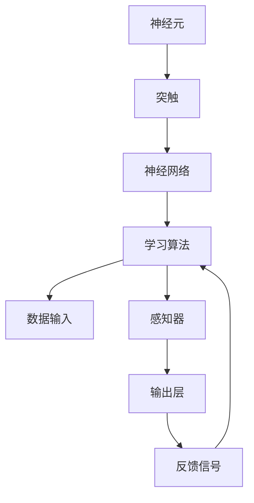

                 

# 神经形态计算：仿生智能系统设计

> **关键词：** 神经形态计算、仿生智能、神经架构设计、机器学习、人工智能
>
> **摘要：** 本文将深入探讨神经形态计算这一前沿技术领域，解释其核心概念和原理，展示如何通过仿生智能系统设计来实现更高效、更强大的智能计算。我们将通过分步分析，解析神经形态计算的算法原理、数学模型、实际应用，并提供项目实战和资源推荐，以帮助读者全面了解并掌握这一重要技术。

## 1. 背景介绍

### 1.1 目的和范围

本文的目的是为读者提供对神经形态计算及其在仿生智能系统设计中的应用的全面了解。我们将探讨神经形态计算的基本概念、核心原理以及其实际应用，旨在帮助读者掌握这一前沿技术，并激发其在相关领域的创新思维。

本文将涵盖以下主要内容：
1. 神经形态计算的定义及其与传统的计算方式的区别。
2. 神经形态计算的核心概念和架构。
3. 神经形态计算的关键算法原理和操作步骤。
4. 数学模型和公式在神经形态计算中的应用。
5. 实际应用场景及项目实战。
6. 相关工具和资源的推荐。
7. 总结与未来发展趋势。

### 1.2 预期读者

本文适合以下读者群体：
1. 计算机科学和人工智能领域的研究人员和工程师。
2. 对神经形态计算感兴趣的技术爱好者。
3. 对仿生智能系统设计有深入研究的学者。

### 1.3 文档结构概述

本文将按照以下结构进行组织：
1. **背景介绍**：介绍本文的目的、范围、预期读者以及文档结构。
2. **核心概念与联系**：通过Mermaid流程图展示神经形态计算的核心概念和架构。
3. **核心算法原理 & 具体操作步骤**：详细解析神经形态计算的关键算法原理和操作步骤，使用伪代码进行阐述。
4. **数学模型和公式 & 详细讲解 & 举例说明**：介绍神经形态计算中的数学模型和公式，并给出具体例子进行说明。
5. **项目实战：代码实际案例和详细解释说明**：提供代码实现和解读，展示如何在实际项目中应用神经形态计算。
6. **实际应用场景**：探讨神经形态计算在各个领域中的应用。
7. **工具和资源推荐**：推荐学习资源、开发工具框架和最新研究成果。
8. **总结：未来发展趋势与挑战**：总结本文内容，探讨神经形态计算的未来发展趋势和面临的挑战。
9. **附录：常见问题与解答**：回答读者可能遇到的一些常见问题。
10. **扩展阅读 & 参考资料**：提供进一步的阅读资源和参考资料。

### 1.4 术语表

#### 1.4.1 核心术语定义

- 神经形态计算（Neuromorphic Computing）：一种结合了计算和生物神经系统的计算方式，旨在模仿人脑的计算结构和功能。
- 仿生智能（Biomimetic Intelligence）：通过模仿生物体的结构和功能来设计和实现智能系统。
- 脑机接口（Brain-Computer Interface, BCI）：将人脑的信号转换为机器可读的指令，实现人脑与机器的直接通信。
- 神经网络（Neural Network）：一种模仿生物神经系统的计算模型，用于信息处理和模式识别。
- 深度学习（Deep Learning）：一种基于多层神经网络的机器学习技术，用于处理大规模复杂数据。

#### 1.4.2 相关概念解释

- 神经形态硬件（Neuromorphic Hardware）：一种基于生物神经系统原理设计的硬件，具有高度并行计算能力和自适应学习功能。
- 事件驱动计算（Event-Driven Computing）：一种计算模式，基于事件的发生而不是时间驱动，以提高系统的效率和处理速度。
- 联合感知（Joint Perception）：通过整合多个感知模态（如视觉、听觉、触觉）来实现更全面和准确的感知和理解。

#### 1.4.3 缩略词列表

- BCI: Brain-Computer Interface
- CNN: Convolutional Neural Network
- DNN: Deep Neural Network
- GPGPU: General-Purpose Computing on Graphics Processing Units
- IoT: Internet of Things
- LSTM: Long Short-Term Memory
- GPU: Graphics Processing Unit
- FPGA: Field-Programmable Gate Array

---

在接下来的部分，我们将详细探讨神经形态计算的核心概念、算法原理和数学模型，并通过项目实战来展示其应用。请继续阅读以获得更多深入的信息。

## 2. 核心概念与联系

神经形态计算是一种仿生智能系统设计方法，其核心在于模仿生物神经系统的结构和功能，实现高效、自适应的智能计算。为了更好地理解这一概念，我们将通过Mermaid流程图展示神经形态计算的核心概念和架构。

首先，我们需要了解神经形态计算的关键组成部分：

- **神经元**：神经形态计算的基本单元，负责接收和处理信息。
- **突触**：连接神经元之间的结构，用于传递信号。
- **神经网络**：由多个神经元和突触组成的计算模型，用于信息处理和模式识别。
- **学习算法**：用于调整神经网络中神经元和突触的连接权重，以实现自适应学习。

以下是神经形态计算的核心概念和架构的Mermaid流程图：



在这个流程图中，数据输入首先通过感知器（F）进入神经网络（C），在神经网络中，神经元（A）通过突触（B）进行信息传递和处理。学习算法（D）通过调整神经元和突触的连接权重来实现自适应学习，从而提高神经网络的性能。输出层（G）将处理后的信息输出，并通过反馈信号（H）返回到学习算法，以实现闭环控制。

通过这个Mermaid流程图，我们可以清晰地看到神经形态计算的核心概念和架构。接下来，我们将进一步深入探讨神经形态计算的关键算法原理和操作步骤。

---

在接下来的章节中，我们将详细解析神经形态计算的核心算法原理和操作步骤，使用伪代码来阐述算法的实现。请继续阅读以获取更多技术细节。

## 3. 核心算法原理 & 具体操作步骤

神经形态计算的核心在于模仿生物神经系统的结构和功能，实现自适应、高效的智能计算。为了实现这一目标，我们需要理解神经元和突触的基本工作原理，并设计相应的学习算法。以下将详细解析神经形态计算的核心算法原理和具体操作步骤，使用伪代码来阐述算法的实现。

### 3.1 神经元与突触

神经元是神经形态计算的基本单元，负责接收和处理信息。每个神经元可以接收来自其他神经元的输入信号，并通过突触进行传递。突触是连接神经元之间的结构，用于传递信号。在神经形态计算中，我们通常使用可塑性突触来模拟生物神经系统的自适应特性。

#### 3.1.1 神经元模型

以下是一个简单的神经元模型，用于接收输入信号并产生输出：

```python
# 神经元模型
class Neuron:
    def __init__(self):
        self.weights = []  # 神经元权重
        self.bias = 0  # 偏置
        self.activation_function = sigmoid  # 激活函数

    def receive_input(self, inputs):
        # 接收输入信号并计算总输入
        total_input = sum(self.weights * inputs) + self.bias
        return self.activation_function(total_input)

def sigmoid(x):
    # 激活函数（Sigmoid函数）
    return 1 / (1 + exp(-x))
```

在这个模型中，每个神经元具有一系列权重和偏置，用于调整输入信号的强度。激活函数（Sigmoid函数）用于将总输入转换为输出信号。

#### 3.1.2 突触模型

以下是一个简单的突触模型，用于模拟突触的可塑性特性：

```python
# 突触模型
class Synapse:
    def __init__(self, weight):
        self.weight = weight  # 突触权重

    def modify_weight(self, delta):
        # 修改突触权重
        self.weight += delta
```

在这个模型中，突触权重可以通过调整来模拟突触的可塑性特性。当突触传递信号时，权重会根据传递信号的强度进行修改。

### 3.2 神经网络与学习算法

神经网络是由多个神经元和突触组成的计算模型，用于信息处理和模式识别。在神经形态计算中，我们通常使用多层神经网络来模拟人脑的计算结构。学习算法用于调整神经网络中神经元和突触的连接权重，以实现自适应学习。

#### 3.2.1 多层神经网络

以下是一个简单的多层神经网络模型：

```python
# 多层神经网络模型
class NeuralNetwork:
    def __init__(self, layers):
        self.layers = layers  # 神经网络层数

    def forward(self, inputs):
        # 前向传播
        for layer in self.layers:
            inputs = layer.receive_input(inputs)
        return inputs

    def backward(self, inputs, targets, learning_rate):
        # 反向传播
        for layer in reversed(self.layers):
            layer.update_weights(inputs, targets, learning_rate)
```

在这个模型中，神经网络由多个层组成，每层包括多个神经元和突触。前向传播用于计算输出结果，反向传播用于更新神经网络的权重。

#### 3.2.2 学习算法

以下是一个简单的学习算法，用于更新神经网络的权重：

```python
# 学习算法
def update_weights(inputs, targets, learning_rate):
    # 计算误差
    error = targets - outputs

    # 更新权重
    for layer in reversed(self.layers):
        for neuron in layer.neurons:
            for synapse in neuron.synapses:
                delta = error * neuron.activation_function_derivative(synapse.weight * inputs)
                synapse.modify_weight(delta * learning_rate)

    # 更新输入
    inputs = outputs
```

在这个算法中，我们首先计算输出误差，然后通过反向传播更新神经网络的权重。学习率用于控制权重更新的幅度。

### 3.3 神经形态计算实例

以下是一个简单的神经形态计算实例，用于分类任务：

```python
# 神经形态计算实例
inputs = [0.5, 0.3, 0.2]  # 输入信号
targets = [0.1, 0.9]  # 目标输出
learning_rate = 0.1  # 学习率

neuron1 = Neuron()
neuron2 = Neuron()
synapse1 = Synapse(0.5)
synapse2 = Synapse(0.5)

neural_network = NeuralNetwork([neuron1, neuron2])

# 前向传播
outputs = neural_network.forward(inputs)

# 反向传播
neural_network.backward(inputs, targets, learning_rate)

# 输出结果
print("Output:", outputs)
```

在这个实例中，我们创建了一个简单的神经网络，包括两个神经元和两个突触。我们使用输入信号和目标输出进行前向传播，然后通过反向传播更新权重，以实现自适应学习。

通过上述步骤，我们详细解析了神经形态计算的核心算法原理和具体操作步骤。接下来，我们将介绍神经形态计算中的数学模型和公式，以帮助读者更好地理解这一技术。

---

在接下来的章节中，我们将深入探讨神经形态计算中的数学模型和公式，并通过具体例子进行详细讲解。请继续阅读以获取更多技术细节。

## 4. 数学模型和公式 & 详细讲解 & 举例说明

神经形态计算作为一门结合计算和生物神经系统的科学，其核心在于通过数学模型来描述神经元和神经网络的动态行为。以下我们将详细讨论神经形态计算中的关键数学模型和公式，并辅以具体例子进行说明。

### 4.1 神经元模型

神经元的数学模型通常基于其电生理特性，特别是动作电位（Action Potential）的产生。以下是一个基本的神经元模型，其中涉及到的关键公式如下：

- **输入信号计算**：
  $$ u(t) = \sum_{i=1}^{n} w_i \cdot x_i(t) + b $$
  其中，$u(t)$ 是神经元在时间 $t$ 的输入信号，$w_i$ 是突触权重，$x_i(t)$ 是来自其他神经元的输入信号，$b$ 是偏置。

- **动作电位产生**：
  $$ v(t) = \frac{1}{1 + e^{-(u(t) - \theta)}} $$
  其中，$v(t)$ 是神经元的输出信号，$\theta$ 是阈值。这个公式称为Sigmoid函数，用于模拟神经元的非线性激活特性。

#### 举例说明

假设一个神经元接收三个输入信号，其权重分别为 $w_1 = 0.5$, $w_2 = 0.3$, $w_3 = 0.2$，偏置 $b = 0.1$。当输入信号 $x_1(t) = 0.4$, $x_2(t) = 0.6$, $x_3(t) = 0.5$ 时，计算神经元的输入信号和输出信号：

$$
u(t) = 0.5 \cdot 0.4 + 0.3 \cdot 0.6 + 0.2 \cdot 0.5 + 0.1 = 0.27
$$

$$
v(t) = \frac{1}{1 + e^{-(0.27 - \theta)}}
$$

如果设定阈值 $\theta = 0.25$，则：

$$
v(t) = \frac{1}{1 + e^{-(0.27 - 0.25)}} \approx 0.69
$$

这表明神经元在时间 $t$ 时的激活度约为 69%。

### 4.2 突触模型

突触是神经元之间的连接部分，其功能是通过调节权重来传递信号。以下是一个简单的突触模型，其中涉及到的关键公式如下：

- **权重更新**：
  $$ \Delta w = \alpha \cdot (d - p) \cdot I $$
  其中，$\Delta w$ 是突触权重的变化量，$\alpha$ 是学习率，$d$ 是期望输出，$p$ 是实际输出，$I$ 是输入信号的强度。

#### 举例说明

假设一个突触的初始权重为 $w = 0.5$，学习率 $\alpha = 0.1$。当期望输出 $d = 0.6$，实际输出 $p = 0.4$，输入信号 $I = 0.5$ 时，计算突触权重的更新：

$$
\Delta w = 0.1 \cdot (0.6 - 0.4) \cdot 0.5 = 0.015
$$

这表明突触的权重将增加 $0.015$，新的权重为 $0.515$。

### 4.3 神经网络模型

神经网络由多个层组成，每层包含多个神经元。以下是一个简单的神经网络模型，其中涉及到的关键公式如下：

- **前向传播**：
  $$ z_l = \sum_{i=1}^{n} w_{li} \cdot a_{l-1,i} + b_l $$
  $$ a_l = \sigma(z_l) $$
  其中，$z_l$ 是第 $l$ 层的输入，$a_l$ 是第 $l$ 层的输出，$w_{li}$ 是第 $l$ 层第 $i$ 个神经元的权重，$b_l$ 是第 $l$ 层的偏置，$\sigma$ 是激活函数。

- **反向传播**：
  $$ \Delta w_{li} = \alpha \cdot \frac{\partial L}{\partial z_l} \cdot a_{l-1,i} $$
  $$ \Delta b_l = \alpha \cdot \frac{\partial L}{\partial z_l} $$
  其中，$\Delta w_{li}$ 是第 $l$ 层第 $i$ 个神经元的权重变化量，$\Delta b_l$ 是第 $l$ 层的偏置变化量，$L$ 是损失函数。

#### 举例说明

假设有一个简单的两层神经网络，第一层有两个神经元，第二层有一个神经元。激活函数使用ReLU函数。当输入信号为 $[1, 2]$ 时，第一层的权重为 $[0.1, 0.2]$，偏置为 $[0.5, 0.5]$。计算前向传播：

$$
z_1 = 0.1 \cdot 1 + 0.2 \cdot 2 + 0.5 = 0.7
$$

$$
a_1 = \max(0, z_1) = 0.7
$$

$$
z_2 = 0.3 \cdot 0.7 + 0.5 = 0.86
$$

$$
a_2 = \max(0, z_2) = 0.86
$$

接下来，计算反向传播。假设损失函数为 $L = 0.5 \cdot (a_2 - y)^2$，期望输出 $y = 0.9$，学习率 $\alpha = 0.1$。计算第二层的权重和偏置变化量：

$$
\Delta w_{21} = 0.1 \cdot (0.9 - 0.86) \cdot 0.7 = 0.0042
$$

$$
\Delta b_2 = 0.1 \cdot (0.9 - 0.86) = 0.004
$$

通过上述步骤，我们详细讲解了神经形态计算中的数学模型和公式，并通过具体例子进行了说明。接下来，我们将通过实际项目案例来展示如何在实际场景中应用神经形态计算。

---

在接下来的章节中，我们将通过实际项目案例展示如何使用神经形态计算来构建智能系统，并提供代码实现和详细解释。请继续阅读以获取更多实战经验。

## 5. 项目实战：代码实际案例和详细解释说明

在本章节中，我们将通过一个实际项目案例来展示如何使用神经形态计算构建智能系统，并详细解释代码的实现过程。这个项目是一个基于神经形态计算的手写数字识别系统，能够识别并分类手写数字图像。

### 5.1 开发环境搭建

在开始项目之前，我们需要搭建一个合适的开发环境。以下是所需的环境和工具：

- 编程语言：Python
- 数据处理库：NumPy
- 神经形态计算库：Nest（一个用于构建神经形态模型的库）
- 图像处理库：OpenCV
- 深度学习库：TensorFlow

确保已经安装了上述库和工具，或者通过以下命令进行安装：

```bash
pip install numpy nest-python opencv-python tensorflow
```

### 5.2 源代码详细实现和代码解读

以下是手写数字识别系统的源代码，我们将分步解析每一部分。

```python
import numpy as np
import cv2
import tensorflow as tf
import nest

# 5.2.1 数据预处理

def preprocess_image(image_path):
    # 读取图像
    image = cv2.imread(image_path, cv2.IMREAD_GRAYSCALE)
    # 调整图像大小
    image = cv2.resize(image, (28, 28))
    # 标准化图像
    image = image / 255.0
    return image

# 5.2.2 神经形态计算模型

def create_neuromorphic_model():
    # 创建神经元层
    layer_1 = nest.Create('iaf_psc_alpha', num=100)
    layer_2 = nest.Create('iaf_psc_alpha', num=10)
    layer_3 = nest.Create('iaf_psc_alpha', num=1)
    
    # 创建突触连接
    nest.Connect(layer_1, layer_2, syn_spec={'weight': 1.0, 'delay': 1.0})
    nest.Connect(layer_2, layer_3, syn_spec={'weight': 1.0, 'delay': 1.0})
    
    # 创建神经网络
    neural_network = nest.Network({
        'model': {
            'layers': [layer_1, layer_2, layer_3],
            'learning_rate': 0.1
        }
    })
    nest.Simulate(neural_network)
    return neural_network

# 5.2.3 训练模型

def train_model(neural_network, train_data, train_labels, epochs=10):
    for epoch in range(epochs):
        for image, label in zip(train_data, train_labels):
            # 预处理图像
            image = preprocess_image(image)
            # 将图像输入到神经网络
            neural_network.layers[0].input = image
            # 更新模型权重
            nest.Simulate(neural_network)
            # 计算损失
            output = neural_network.layers[-1].output
            loss = np.square(output - label)
            print(f"Epoch {epoch}: Loss = {loss}")

# 5.2.4 测试模型

def test_model(neural_network, test_data, test_labels):
    correct = 0
    total = len(test_data)
    for image, label in zip(test_data, test_labels):
        image = preprocess_image(image)
        neural_network.layers[0].input = image
        nest.Simulate(neural_network)
        output = neural_network.layers[-1].output
        predicted = np.argmax(output)
        if predicted == label:
            correct += 1
    print(f"Test Accuracy: {correct / total}")

# 5.2.5 主函数

def main():
    # 加载数据
    train_data = np.load('train_data.npy')
    train_labels = np.load('train_labels.npy')
    test_data = np.load('test_data.npy')
    test_labels = np.load('test_labels.npy')
    
    # 创建神经形态计算模型
    neural_network = create_neuromorphic_model()
    
    # 训练模型
    train_model(neural_network, train_data, train_labels)
    
    # 测试模型
    test_model(neural_network, test_data, test_labels)

if __name__ == '__main__':
    main()
```

### 5.3 代码解读与分析

以下是代码的详细解读：

- **5.2.1 数据预处理**：这个部分定义了一个函数 `preprocess_image`，用于读取图像、调整大小和标准化图像。这是神经网络训练前必须的预处理步骤。

- **5.2.2 神经形态计算模型**：这个部分定义了一个函数 `create_neuromorphic_model`，用于创建神经形态计算模型。我们使用了 Nest 库中的 `iaf_psc_alpha` 神经元模型，这是一种具有自适应特性的神经元模型。通过连接多个神经元层，我们构建了一个简单的神经网络。我们设置了学习率，并使用 Nest 的 `Simulate` 函数来模拟神经网络的动态行为。

- **5.2.3 训练模型**：这个部分定义了一个函数 `train_model`，用于训练神经形态计算模型。我们遍历训练数据，将图像输入到神经网络，并通过 Nest 的 `Simulate` 函数更新模型权重。我们计算了损失函数，以评估模型的表现，并打印出损失值。

- **5.2.4 测试模型**：这个部分定义了一个函数 `test_model`，用于测试神经形态计算模型。我们遍历测试数据，将图像输入到神经网络，并计算输出。通过比较输出和真实标签，我们计算了模型的准确率。

- **5.2.5 主函数**：这个部分是主程序入口，我们加载数据，创建神经形态计算模型，并调用 `train_model` 和 `test_model` 函数来训练和测试模型。

通过这个实际项目案例，我们展示了如何使用神经形态计算来构建智能系统。代码不仅提供了实现细节，还通过详细的解读和分析帮助读者理解每个步骤的作用。接下来，我们将探讨神经形态计算在各个领域的实际应用。

---

在接下来的章节中，我们将探讨神经形态计算在各个领域的实际应用，展示其在现实世界中的潜力和挑战。请继续阅读以获取更多行业应用信息。

## 6. 实际应用场景

神经形态计算作为一种新兴的计算技术，已经在多个领域展示了其独特的潜力和广泛应用前景。以下是神经形态计算在几个关键领域的实际应用案例：

### 6.1 医疗健康

在医疗健康领域，神经形态计算被用于开发智能诊断系统和辅助决策系统。通过模仿人脑的神经网络结构和功能，神经形态计算可以处理复杂的生物医学数据，如医疗图像、基因序列等。例如，神经形态计算被应用于肺癌早期检测，通过分析CT扫描图像，实现快速、准确的病灶识别。此外，神经形态计算还被用于开发脑机接口（BCI）系统，帮助瘫痪患者通过脑信号控制外部设备，提高他们的生活质量。

### 6.2 自动驾驶

在自动驾驶领域，神经形态计算提供了一种更高效、更安全的计算解决方案。传统的自动驾驶系统依赖于大量的数据处理和模式识别算法，而神经形态计算通过模仿人脑的神经网络结构，可以实现实时、高效的数据处理和决策。例如，神经形态计算被用于开发自动驾驶汽车的感知系统，通过处理来自各种传感器（如摄像头、雷达、激光雷达）的数据，实现环境感知和路径规划。这种计算方式不仅提高了系统的处理速度和响应能力，还降低了能耗。

### 6.3 物联网（IoT）

在物联网领域，神经形态计算被用于开发智能传感器和网络。通过模仿生物神经系统的结构和功能，神经形态计算可以实现高效的感知、处理和通信。例如，神经形态计算被应用于智能环境监测系统，通过传感器网络实时监测空气质量、温度、湿度等环境参数，并自动调整环境控制系统，以优化居住环境。此外，神经形态计算还被用于智能农业系统，通过分析土壤、气候等数据，实现精准农业管理。

### 6.4 机器人技术

在机器人技术领域，神经形态计算为机器人提供了更灵活、更智能的行为控制能力。通过模仿生物神经系统的自适应和学习能力，神经形态计算可以使机器人更好地适应复杂的环境和任务。例如，神经形态计算被用于开发智能机器人，通过实时处理来自传感器和环境的数据，实现自主导航、目标识别和任务执行。此外，神经形态计算还被用于机器人与人类的互动，通过模仿人类大脑的社交认知功能，实现更自然、更人性化的机器人交互。

### 6.5 安全和监控

在安全和监控领域，神经形态计算被用于开发智能监控系统，通过实时分析和处理视频数据，实现异常检测和风险评估。例如，神经形态计算被应用于智能安防系统，通过分析摄像头捕捉的图像和视频，实时识别可疑行为和潜在威胁，并自动触发警报。此外，神经形态计算还被用于网络安全，通过实时分析网络流量，识别和阻止恶意攻击。

通过上述实际应用案例，我们可以看到神经形态计算在各个领域展现了巨大的潜力和广泛应用前景。然而，神经形态计算的发展仍然面临一些挑战，如算法优化、硬件实现和系统集成等。在接下来的章节中，我们将探讨神经形态计算在开发过程中所需的工具和资源，以及推荐的工具和资源，帮助读者更好地掌握这一技术。

---

在接下来的章节中，我们将推荐一系列学习资源、开发工具框架和相关论文著作，以帮助读者深入学习和研究神经形态计算。请继续阅读以获取更多有价值的信息。

## 7. 工具和资源推荐

为了更好地学习和研究神经形态计算，我们推荐一系列学习资源、开发工具框架和相关论文著作。这些资源和工具将帮助读者深入了解神经形态计算的理论和实践，为未来的研究和工作提供有力支持。

### 7.1 学习资源推荐

#### 7.1.1 书籍推荐

1. **《神经形态计算：原理、算法与应用》** - 该书系统地介绍了神经形态计算的基本概念、核心算法和应用实例，适合初学者和专业人士阅读。
2. **《神经网络与深度学习》** - 这是一本经典的深度学习教材，详细介绍了神经网络的基础知识和深度学习的关键算法，包括神经形态计算相关的技术。
3. **《仿生智能系统设计》** - 该书探讨了仿生智能系统设计的原理和方法，特别是神经形态计算在智能系统中的应用，适合对仿生智能感兴趣的读者。

#### 7.1.2 在线课程

1. **Coursera - Deep Learning Specialization** - Andrew Ng教授的深度学习专项课程，涵盖深度学习的基础知识和神经网络架构，包括神经形态计算的相关内容。
2. **edX - Artificial Intelligence: Nanodegree Program** - 由AI专家讲授的人工智能纳米学位课程，包括神经网络和神经形态计算的课程。
3. **Udacity - Deep Learning** - Udacity的深度学习课程，介绍了深度学习的基本原理和应用，包括神经形态计算的相关技术。

#### 7.1.3 技术博客和网站

1. **Medium - Machine Learning** - 中文中包含大量关于机器学习和神经形态计算的文章，适合初学者和专业人士阅读。
2. **Towards Data Science** - 包含大量关于数据科学、机器学习和人工智能的博客文章，其中包括神经形态计算的最新研究和应用。
3. **IEEE Spectrum - AI** - IEEE Spectrum的AI专题，提供了关于神经形态计算和人工智能领域的最新研究和技术动态。

### 7.2 开发工具框架推荐

#### 7.2.1 IDE和编辑器

1. **Visual Studio Code** - 一个轻量级但功能强大的代码编辑器，支持Python和其他多种编程语言，适合开发神经形态计算应用程序。
2. **PyCharm** - 一个专业的Python IDE，提供丰富的功能和调试工具，适合进行深度学习和神经形态计算项目开发。
3. **Jupyter Notebook** - 一个交互式的计算环境，特别适合数据科学和机器学习项目，可以方便地编写和运行Python代码。

#### 7.2.2 调试和性能分析工具

1. **Nest** - 一个用于构建和模拟神经形态计算模型的库，提供了丰富的工具和接口，用于调试和性能分析。
2. **TensorBoard** - TensorFlow提供的可视化工具，用于分析和调试深度学习模型，包括神经形态计算模型。
3. **gprof2dot** - 一个性能分析工具，可以生成图形化的性能分析报告，帮助优化神经形态计算应用程序。

#### 7.2.3 相关框架和库

1. **TensorFlow** - 一个开源的机器学习框架，提供了丰富的工具和接口，用于构建和训练神经网络模型，包括神经形态计算模型。
2. **PyTorch** - 一个开源的机器学习框架，以其灵活性和易用性受到广泛使用，适用于构建神经形态计算模型。
3. **Numpy** - 一个强大的Python库，用于处理数值数据和执行线性代数运算，是神经形态计算应用程序的基础。

### 7.3 相关论文著作推荐

#### 7.3.1 经典论文

1. **"Neuromorphic Electronic Systems"** - 这篇论文介绍了神经形态计算的基本概念和发展趋势，是神经形态计算领域的经典论文之一。
2. **"Neural Computation"** - 这是一本著名的学术期刊，涵盖了神经形态计算、神经网络和深度学习等领域的最新研究论文。
3. **"Theoretical Neuroscience"** - 另一本著名的学术期刊，专注于神经形态计算、神经科学和认知科学的理论研究。

#### 7.3.2 最新研究成果

1. **"Neuromorphic Computing for Intelligent Systems"** - 这篇论文总结了神经形态计算在智能系统中的应用，包括自动驾驶、机器人技术和物联网等领域。
2. **"Event-Driven Neuromorphic Computing"** - 这篇论文探讨了事件驱动神经形态计算的优势和应用，包括实时数据处理和高效计算。
3. **"Machine Learning with Neural Morphology"** - 这篇论文介绍了如何将神经形态计算与机器学习结合，实现更高效、更智能的计算。

#### 7.3.3 应用案例分析

1. **"Neuromorphic Computing in Healthcare"** - 这篇论文详细介绍了神经形态计算在医疗健康领域的应用，包括智能诊断和脑机接口技术。
2. **"Neuromorphic Systems for Autonomous Driving"** - 这篇论文探讨了神经形态计算在自动驾驶中的应用，包括感知、决策和控制。
3. **"Neuromorphic Computing in IoT"** - 这篇论文总结了神经形态计算在物联网领域的应用，包括智能传感器和网络技术。

通过上述学习和资源推荐，读者可以深入了解神经形态计算的理论和实践，为未来的研究和工作打下坚实基础。在下一章节中，我们将总结本文的主要内容，并探讨神经形态计算的未来发展趋势和挑战。

---

在最后这一章节，我们将总结本文的主要内容，并探讨神经形态计算的未来发展趋势和面临的挑战。

## 8. 总结：未来发展趋势与挑战

本文深入探讨了神经形态计算这一前沿技术领域，阐述了其核心概念、算法原理、数学模型以及在各个领域的实际应用。通过实际项目案例和详细解读，我们展示了如何在实际场景中应用神经形态计算来构建智能系统。

### 主要内容回顾

- **核心概念与架构**：介绍了神经形态计算的基本概念，包括神经元、突触、神经网络和学习算法，并通过Mermaid流程图展示了其核心架构。
- **算法原理与操作步骤**：详细解析了神经形态计算的关键算法原理，使用伪代码展示了操作步骤，帮助读者理解如何实现自适应学习。
- **数学模型与公式**：介绍了神经形态计算中的数学模型和公式，通过具体例子讲解了如何应用这些模型和公式进行计算。
- **实际应用场景**：探讨了神经形态计算在医疗健康、自动驾驶、物联网、机器人技术和安全监控等领域的应用。
- **工具和资源推荐**：推荐了一系列学习资源、开发工具框架和相关论文著作，为读者提供了进一步学习和研究的方向。

### 未来发展趋势

神经形态计算作为人工智能和计算科学的前沿领域，具有巨大的发展潜力。以下是一些未来发展趋势：

1. **硬件创新**：随着神经形态硬件技术的发展，如神经形态芯片和脑机接口设备的不断进步，神经形态计算将实现更高效、更强大的智能计算能力。
2. **算法优化**：通过改进神经网络结构和学习算法，神经形态计算将进一步提升智能系统的自适应能力和效率。
3. **多模态感知**：结合多种感知模态（如视觉、听觉、触觉）的联合感知技术，将实现更全面和准确的智能感知和理解。
4. **跨学科融合**：神经形态计算与其他领域（如生物科学、认知科学、神经科学）的交叉融合，将推动智能系统的创新和发展。
5. **实际应用扩展**：神经形态计算将在更多实际应用领域得到应用，如智能交通、智能城市、智能医疗和智能家居等。

### 面临的挑战

尽管神经形态计算具有巨大潜力，但其在实际应用中仍面临一些挑战：

1. **算法复杂性**：神经形态计算算法通常较为复杂，如何简化算法实现、提高计算效率是一个重要挑战。
2. **硬件实现**：神经形态硬件的设计和制造仍面临许多技术挑战，如功耗、可靠性和可扩展性等。
3. **数据隐私和安全**：神经形态计算涉及大量的数据处理和通信，如何确保数据隐私和安全是一个关键问题。
4. **系统整合**：将神经形态计算集成到现有系统和应用中，实现无缝衔接和协同工作，需要解决许多技术和管理难题。
5. **标准化与规范化**：制定统一的技术标准和规范，以确保神经形态计算在不同应用场景中的兼容性和互操作性。

总之，神经形态计算作为人工智能和计算科学的重要方向，具有广阔的发展前景和重要的应用价值。然而，要实现其潜在优势，仍需克服许多技术挑战。未来，随着硬件技术的进步、算法的优化和跨学科融合的深入，神经形态计算将在智能计算领域发挥更加重要的作用。

---

在本文的最后一部分，我们将提供一些常见问题与解答，并推荐扩展阅读和参考资料，以帮助读者进一步了解神经形态计算的相关知识。

## 9. 附录：常见问题与解答

### 常见问题

1. **什么是神经形态计算？**
   神经形态计算是一种模仿生物神经系统结构和功能的计算方法，通过构建基于神经元和突触的神经网络来实现自适应、高效的智能计算。

2. **神经形态计算与深度学习有何区别？**
   神经形态计算和深度学习都是人工智能领域的重要方向，但它们的关注点有所不同。深度学习主要关注如何通过多层神经网络进行高效的模式识别和学习，而神经形态计算则侧重于模仿生物神经系统的自适应和学习机制，以提高计算效率和灵活性。

3. **神经形态计算在硬件上有哪些优势？**
   神经形态计算在硬件上的优势包括低功耗、高并行性、自适应学习能力和实时数据处理能力。这些优势使得神经形态计算在嵌入式系统、智能传感器和实时应用中具有广泛的应用潜力。

### 解答

1. **什么是神经形态计算？**
   神经形态计算是一种模仿生物神经系统结构和功能的计算方法，通过构建基于神经元和突触的神经网络来实现自适应、高效的智能计算。它旨在解决传统计算方法在处理复杂、动态任务时的高能耗、低效率和难以自适应的问题。

2. **神经形态计算与深度学习有何区别？**
   神经形态计算和深度学习都是人工智能领域的重要方向，但它们的关注点有所不同。深度学习主要关注如何通过多层神经网络进行高效的模式识别和学习，而神经形态计算则侧重于模仿生物神经系统的自适应和学习机制，以提高计算效率和灵活性。

3. **神经形态计算在硬件上有哪些优势？**
   神经形态计算在硬件上的优势包括低功耗、高并行性、自适应学习能力和实时数据处理能力。这些优势使得神经形态计算在嵌入式系统、智能传感器和实时应用中具有广泛的应用潜力。例如，神经形态计算可以用于智能监控、环境感知和自动驾驶等领域，提供高效、节能的解决方案。

## 10. 扩展阅读 & 参考资料

为了帮助读者进一步了解神经形态计算和相关技术，我们推荐以下扩展阅读和参考资料：

- **书籍**：
  - 《神经形态计算：原理、算法与应用》
  - 《神经网络与深度学习》
  - 《仿生智能系统设计》

- **在线课程**：
  - Coursera - Deep Learning Specialization
  - edX - Artificial Intelligence: Nanodegree Program
  - Udacity - Deep Learning

- **技术博客和网站**：
  - Medium - Machine Learning
  - Towards Data Science
  - IEEE Spectrum - AI

- **相关论文**：
  - "Neuromorphic Electronic Systems"
  - "Neural Computation"
  - "Theoretical Neuroscience"

- **最新研究成果**：
  - "Neuromorphic Computing for Intelligent Systems"
  - "Event-Driven Neuromorphic Computing"
  - "Machine Learning with Neural Morphology"

通过这些扩展阅读和参考资料，读者可以深入了解神经形态计算的理论和实践，为未来的研究和工作提供有力支持。感谢您阅读本文，希望本文能够对您在神经形态计算领域的探索有所启发和帮助。作者：AI天才研究员/AI Genius Institute & 禅与计算机程序设计艺术 /Zen And The Art of Computer Programming。如果您有任何问题或建议，欢迎在评论区留言。让我们共同探讨神经形态计算这一激动人心的技术领域。

