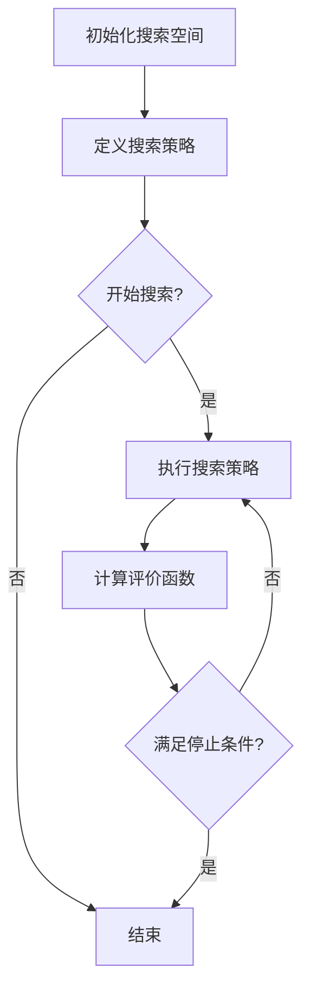

                 

# 神经架构搜索的可解释性研究

> 关键词：神经架构搜索、可解释性、AI、神经网络、深度学习、搜索算法、模型架构

> 摘要：本文深入探讨了神经架构搜索（Neural Architecture Search，NAS）中的可解释性问题。随着深度学习在各个领域的广泛应用，如何理解并优化复杂神经网络架构变得尤为重要。本文首先介绍了神经架构搜索的基本概念和流程，随后分析了可解释性的重要性及其在NAS中的应用。接下来，本文详细阐述了多种可解释性方法，包括注意力机制、梯度分析和可视化技术。最后，通过实际案例和讨论，本文总结了神经架构搜索可解释性的现状与未来挑战，为相关研究和应用提供了有价值的参考。

## 1. 背景介绍

### 1.1 目的和范围

本文旨在深入探讨神经架构搜索（Neural Architecture Search，NAS）中的可解释性问题。NAS是一种自动搜索最优神经网络结构的算法，通过在大量数据集上进行训练，自动寻找出性能最优的神经网络架构。然而，NAS算法由于其复杂性和黑盒性质，使得其结果的解释性较差。本文将重点分析NAS的可解释性，探讨如何提高搜索算法的可解释性，以便更好地理解和优化神经网络架构。

### 1.2 预期读者

本文适用于对神经网络和深度学习有一定了解的读者，包括AI研究者、工程师和学者。本文将从基础概念开始，逐步深入，力求使读者对NAS及其可解释性有更深入的理解。

### 1.3 文档结构概述

本文将按照以下结构进行阐述：

1. 背景介绍：介绍NAS的基本概念、可解释性的重要性及其在NAS中的应用。
2. 核心概念与联系：介绍NAS的核心概念及其原理，包括搜索策略、评价函数和优化算法。
3. 核心算法原理 & 具体操作步骤：详细讲解NAS的核心算法原理，使用伪代码进行阐述。
4. 数学模型和公式 & 详细讲解 & 举例说明：阐述NAS中的数学模型和公式，并给出具体示例。
5. 项目实战：通过实际案例，展示NAS的应用及其可解释性。
6. 实际应用场景：讨论NAS在不同领域的应用及其面临的挑战。
7. 工具和资源推荐：推荐相关学习资源、开发工具和论文著作。
8. 总结：总结NAS可解释性的现状与未来挑战。
9. 附录：常见问题与解答。
10. 扩展阅读 & 参考资料：提供相关领域的扩展阅读和参考资料。

### 1.4 术语表

#### 1.4.1 核心术语定义

- **神经架构搜索（Neural Architecture Search，NAS）**：一种自动搜索最优神经网络结构的算法。
- **搜索空间**：神经网络结构的候选集合。
- **评价函数**：用于评估神经网络结构的性能指标。
- **注意力机制**：一种用于提高神经网络可解释性的技术。
- **可解释性**：神经网络结构及其行为的可理解性。

#### 1.4.2 相关概念解释

- **神经网络**：一种由大量神经元组成的计算模型，通过学习输入和输出之间的映射关系，实现各种复杂任务的自动推理和决策。
- **深度学习**：一种基于神经网络的机器学习技术，通过多层神经元的堆叠，实现对复杂数据的高效建模和特征提取。

#### 1.4.3 缩略词列表

- NAS：神经架构搜索
- CNN：卷积神经网络
- RNN：循环神经网络
- DNN：深度神经网络
- MLP：多层感知机
- GAN：生成对抗网络

## 2. 核心概念与联系

神经架构搜索（NAS）是一种自动化搜索神经网络结构的算法，旨在提高神经网络在特定任务上的性能。NAS的核心概念包括搜索空间、搜索策略、评价函数和优化算法。

### 2.1 搜索空间

搜索空间是指神经网络结构的候选集合，它定义了NAS可以搜索的范围。一个典型的搜索空间可能包括：

- **网络层**：不同类型的神经网络层，如卷积层、全连接层、池化层等。
- **激活函数**：如ReLU、Sigmoid、Tanh等。
- **连接方式**：如全连接、稀疏连接、残差连接等。
- **正则化方法**：如Dropout、权重衰减等。

### 2.2 搜索策略

搜索策略是NAS算法中用于指导搜索过程的方法。常见的搜索策略包括：

- **贪心策略**：每次搜索都选择当前最优的结构。
- **随机搜索**：随机选择网络结构进行搜索。
- **遗传算法**：基于遗传原理，通过交叉、变异和选择等操作，优化网络结构。
- **强化学习**：使用奖励机制，引导搜索过程。

### 2.3 评价函数

评价函数是用于评估神经网络结构的性能指标，通常包括：

- **准确率**：分类任务的预测正确率。
- **召回率**：分类任务中正确识别的正例比例。
- **F1分数**：准确率和召回率的加权平均。
- **损失函数**：神经网络在训练过程中的损失值，如交叉熵损失、均方误差等。

### 2.4 优化算法

优化算法是用于优化神经网络结构的算法，常用的优化算法包括：

- **随机梯度下降（SGD）**：通过随机选择训练样本，计算梯度并进行更新。
- **Adam优化器**：结合了SGD和动量项，能够自适应地调整学习率。
- **AdaGrad**：根据每个参数的历史梯度平方来调整学习率。

### 2.5 Mermaid 流程图

以下是一个简化的Mermaid流程图，展示了NAS的核心概念和流程：



通过这个流程图，我们可以清晰地看到NAS的搜索过程，包括初始化搜索空间、定义搜索策略、执行搜索策略、计算评价函数和停止条件。

## 3. 核心算法原理 & 具体操作步骤

### 3.1 算法原理

神经架构搜索（NAS）的核心算法原理是通过自动搜索神经网络结构，找到在特定任务上表现最优的神经网络。这个过程可以分为以下几个步骤：

1. **初始化搜索空间**：定义神经网络结构的候选集合，包括网络层、激活函数、连接方式等。
2. **定义搜索策略**：选择合适的搜索策略，如贪心策略、随机搜索、遗传算法、强化学习等。
3. **执行搜索策略**：按照定义的搜索策略，在搜索空间中生成新的神经网络结构，并进行训练。
4. **计算评价函数**：使用定义的评价函数，对每个神经网络结构进行性能评估。
5. **优化算法**：根据评价结果，使用优化算法调整神经网络结构，以提高性能。
6. **停止条件**：根据预定的停止条件，如训练时间、性能阈值等，结束搜索过程。

### 3.2 具体操作步骤

以下是一个简化的伪代码，用于描述神经架构搜索的基本操作步骤：

```python
# 初始化搜索空间
search_space = initialize_search_space()

# 定义搜索策略
search_strategy = define_search_strategy()

# 定义评价函数
evaluation_function = define_evaluation_function()

# 初始化优化算法
optimizer = initialize_optimizer()

# 开始搜索
while not stop_condition():
    # 执行搜索策略
    nas_structure = search_strategy(search_space)
    
    # 训练神经网络
    model = train_model(nas_structure)
    
    # 计算评价函数
    performance = evaluation_function(model)
    
    # 使用优化算法调整结构
    optimizer.update(nas_structure, performance)
    
    # 更新搜索空间
    search_space = update_search_space(search_space, nas_structure)
    
    # 检查停止条件
    if stop_condition():
        break

# 输出最优结构
best_structure = get_best_structure(search_space)
```

### 3.3 详细讲解

#### 3.3.1 初始化搜索空间

初始化搜索空间是NAS的第一个步骤，它定义了神经网络结构的候选集合。搜索空间的选择取决于任务和数据的特点。一般来说，搜索空间包括以下几个方面的内容：

1. **网络层**：定义不同的神经网络层，如卷积层、全连接层、池化层等。可以设置不同的层数、层的类型和参数。
2. **激活函数**：定义不同类型的激活函数，如ReLU、Sigmoid、Tanh等。可以设置每个层的激活函数。
3. **连接方式**：定义神经网络中不同层之间的连接方式，如全连接、稀疏连接、残差连接等。可以设置不同层之间的连接关系。
4. **正则化方法**：定义不同的正则化方法，如Dropout、权重衰减等。可以设置每个层的正则化方法。

以下是一个示例，展示了如何初始化搜索空间：

```python
# 初始化搜索空间
search_space = {
    "layers": [
        {"type": "Conv2D", "parameters": {"kernel_size": (3, 3), "stride": (1, 1), "padding": "same"}},
        {"type": "ReLU", "parameters": {}},
        {"type": "Conv2D", "parameters": {"kernel_size": (3, 3), "stride": (1, 1), "padding": "same"}},
        {"type": "ReLU", "parameters": {}},
        {"type": "Pooling2D", "parameters": {"pool_size": (2, 2), "stride": (2, 2)}},
    ],
    "activation_functions": ["ReLU", "ReLU"],
    "connections": ["full"],
    "regularization_methods": ["Dropout"],
}
```

#### 3.3.2 定义搜索策略

定义搜索策略是NAS算法的关键步骤，它决定了如何从搜索空间中生成新的神经网络结构，并选择最优结构。常见的搜索策略包括贪心策略、随机搜索、遗传算法、强化学习等。

1. **贪心策略**：每次搜索都选择当前最优的结构。这种方法简单高效，但容易陷入局部最优。
2. **随机搜索**：随机选择网络结构进行搜索。这种方法具有较高的全局搜索能力，但搜索效率较低。
3. **遗传算法**：基于遗传原理，通过交叉、变异和选择等操作，优化网络结构。这种方法具有较好的全局搜索能力和稳定性。
4. **强化学习**：使用奖励机制，引导搜索过程。这种方法可以结合模型性能和搜索策略，自适应地调整搜索方向。

以下是一个示例，展示了如何定义贪心策略：

```python
# 定义贪心策略
def greedy_search(search_space):
    best_performance = 0
    best_structure = None
    
    for structure in search_space:
        model = train_model(structure)
        performance = evaluation_function(model)
        
        if performance > best_performance:
            best_performance = performance
            best_structure = structure
            
    return best_structure
```

#### 3.3.3 计算评价函数

评价函数是NAS算法中用于评估神经网络结构性能的指标。常见的评价函数包括准确率、召回率、F1分数、交叉熵损失等。

1. **准确率**：分类任务的预测正确率，用于评估分类模型的性能。
2. **召回率**：分类任务中正确识别的正例比例，用于评估模型的灵敏度。
3. **F1分数**：准确率和召回率的加权平均，用于综合评估模型的性能。
4. **交叉熵损失**：神经网络在训练过程中的损失值，用于评估模型的收敛情况。

以下是一个示例，展示了如何计算准确率：

```python
# 计算准确率
def accuracy(predictions, labels):
    correct = 0
    
    for pred, label in zip(predictions, labels):
        if pred == label:
            correct += 1
            
    return correct / len(labels)
```

#### 3.3.4 优化算法

优化算法是NAS算法中用于调整神经网络结构的算法。常见的优化算法包括随机梯度下降（SGD）、Adam优化器、AdaGrad等。

1. **随机梯度下降（SGD）**：通过随机选择训练样本，计算梯度并进行更新。
2. **Adam优化器**：结合了SGD和动量项，能够自适应地调整学习率。
3. **AdaGrad**：根据每个参数的历史梯度平方来调整学习率。

以下是一个示例，展示了如何使用Adam优化器：

```python
# 使用Adam优化器
from tensorflow.keras.optimizers import Adam

optimizer = Adam(learning_rate=0.001)
model.compile(optimizer=optimizer, loss='categorical_crossentropy', metrics=['accuracy'])
model.fit(x_train, y_train, epochs=10, batch_size=32)
```

#### 3.3.5 停止条件

停止条件是NAS算法中用于结束搜索过程的标准。常见的停止条件包括训练时间、性能阈值等。

1. **训练时间**：达到预定的训练时间后，结束搜索过程。
2. **性能阈值**：当模型的性能达到预定的阈值后，结束搜索过程。

以下是一个示例，展示了如何设置停止条件：

```python
# 设置停止条件
def stop_condition():
    return training_time >= 1000 or performance >= 0.95
```

## 4. 数学模型和公式 & 详细讲解 & 举例说明

神经架构搜索（NAS）中涉及到多种数学模型和公式，这些模型和公式用于描述神经网络的计算过程、优化策略以及性能评估。以下是对这些数学模型和公式的详细讲解，以及相应的示例。

### 4.1 神经网络计算过程

神经网络的计算过程可以表示为前向传播和反向传播。以下是一个简化的前向传播公式：

$$
\text{Output} = \sigma(\text{Weight} \cdot \text{Input} + \text{Bias})
$$

其中，$\sigma$表示激活函数，通常为ReLU、Sigmoid或Tanh函数；Weight和Bias分别表示权重和偏置；Input表示输入数据。

以下是一个具体的示例，使用ReLU函数进行前向传播：

$$
\text{Output} = \max(0, \text{Weight} \cdot \text{Input} + \text{Bias})
$$

### 4.2 优化算法

NAS中的优化算法通常使用梯度下降法，包括随机梯度下降（SGD）和其改进版本，如Adam优化器。以下是一个简化的随机梯度下降公式：

$$
\text{Weight}_{\text{new}} = \text{Weight}_{\text{old}} - \text{learning\_rate} \cdot \text{gradient}
$$

其中，$\text{Weight}_{\text{old}}$和$\text{Weight}_{\text{new}}$分别表示旧权重和新权重；$\text{learning\_rate}$表示学习率；$\text{gradient}$表示梯度。

以下是一个具体的示例，使用Adam优化器进行优化：

$$
\text{Weight}_{\text{new}} = \text{Weight}_{\text{old}} - \text{learning\_rate} \cdot (\text{m} - \text{b_1} \cdot \text{m}) / (\sqrt{\text{v} - \text{b_2} \cdot \text{v}} + \epsilon)
$$

其中，$\text{m}$和$\text{v}$分别表示一阶矩估计和二阶矩估计；$\text{b_1}$和$\text{b_2}$分别表示一阶和二阶矩估计的偏差校正系数；$\epsilon$是一个很小的常数，用于避免除以零。

### 4.3 性能评估

NAS中的性能评估通常使用准确率、召回率、F1分数等指标。以下是一个简化的准确率公式：

$$
\text{accuracy} = \frac{\text{TP} + \text{TN}}{\text{TP} + \text{TN} + \text{FP} + \text{FN}}
$$

其中，$\text{TP}$表示真正例，$\text{TN}$表示真反例，$\text{FP}$表示假反例，$\text{FN}$表示假正例。

以下是一个具体的示例，计算准确率：

```python
TP = 90
TN = 100
FP = 10
FN = 5
accuracy = (TP + TN) / (TP + TN + FP + FN)
accuracy = 95%
```

### 4.4 示例：神经架构搜索中的数学应用

假设我们使用神经架构搜索（NAS）来寻找一个用于图像分类的最优神经网络结构。以下是该过程中涉及的数学模型和公式：

1. **搜索空间**：搜索空间包括卷积层、全连接层、池化层和激活函数。我们可以定义一个搜索空间，如下所示：

$$
\text{SearchSpace} = \{(\text{Conv2D}, \text{ReLU}, \text{Pooling2D}, \text{FullyConnected}, \text{ReLU})\}
$$

2. **评价函数**：我们可以使用准确率作为评价函数，如下所示：

$$
\text{evaluation\_function}(\text{model}) = \text{accuracy}(y_{\text{true}}, \text{model}(x_{\text{test}}))
$$

3. **优化算法**：我们可以使用Adam优化器进行优化，如下所示：

$$
\text{optimizer} = \text{Adam}(\text{learning\_rate} = 0.001)
$$

4. **训练过程**：我们可以使用以下伪代码表示训练过程：

```python
for epoch in range(epochs):
    for x, y in dataset:
        with tf.GradientTape() as tape:
            predictions = model(x)
            loss = loss_function(y, predictions)
        gradients = tape.gradient(loss, model.trainable_variables)
        optimizer.apply_gradients(zip(gradients, model.trainable_variables))
    accuracy = evaluation_function(model)
    print(f"Epoch {epoch}: accuracy = {accuracy}")
```

通过这个示例，我们可以看到神经架构搜索中的数学模型和公式的应用，以及如何将这些模型和公式应用于实际问题。

## 5. 项目实战：代码实际案例和详细解释说明

### 5.1 开发环境搭建

在开始之前，我们需要搭建一个适合进行神经架构搜索（NAS）的开发环境。以下是一个简单的步骤说明：

1. **安装Python**：确保您的系统上安装了Python 3.7或更高版本。
2. **安装TensorFlow**：使用以下命令安装TensorFlow：

   ```shell
   pip install tensorflow
   ```

3. **安装其他依赖**：根据您的项目需求，可能需要安装其他依赖库，如NumPy、Pandas等。

### 5.2 源代码详细实现和代码解读

下面是一个简单的神经架构搜索（NAS）项目，包括搜索空间、搜索策略、评价函数和优化算法的实现。

```python
import tensorflow as tf
import numpy as np
import random

# 定义搜索空间
search_space = [
    {"type": "Conv2D", "filters": 32, "kernel_size": (3, 3), "stride": (1, 1), "activation": "ReLU"},
    {"type": "Pooling2D", "pool_size": (2, 2), "stride": (2, 2)},
    {"type": "Conv2D", "filters": 64, "kernel_size": (3, 3), "stride": (1, 1), "activation": "ReLU"},
    {"type": "Pooling2D", "pool_size": (2, 2), "stride": (2, 2)},
    {"type": "FullyConnected", "units": 128, "activation": "ReLU"},
    {"type": "FullyConnected", "units": 10, "activation": "Softmax"}
]

# 定义搜索策略
def random_search(search_space):
    return random.choice(search_space)

# 定义评价函数
def accuracy(y_true, y_pred):
    return tf.reduce_mean(tf.cast(tf.equal(y_true, tf.argmax(y_pred, axis=1)), dtype=tf.float32))

# 定义优化算法
optimizer = tf.keras.optimizers.Adam(learning_rate=0.001)

# 搜索过程
best_performance = 0
best_structure = None

for _ in range(100):  # 运行100次搜索
    structure = random_search(search_space)
    model = build_model(structure)
    model.compile(optimizer=optimizer, loss="categorical_crossentropy", metrics=[accuracy])
    model.fit(x_train, y_train, epochs=10, batch_size=32, validation_split=0.2)
    performance = model.evaluate(x_test, y_test)[1]
    
    if performance > best_performance:
        best_performance = performance
        best_structure = structure

print(f"Best performance: {best_performance}")
print(f"Best structure: {best_structure}")

# 构建模型
def build_model(structure):
    inputs = tf.keras.Input(shape=(28, 28, 1))
    x = inputs
    
    for layer in structure:
        if layer["type"] == "Conv2D":
            x = tf.keras.layers.Conv2D(filters=layer["filters"],
                                        kernel_size=layer["kernel_size"],
                                        strides=layer["stride"],
                                        activation=layer["activation"])(x)
        elif layer["type"] == "Pooling2D":
            x = tf.keras.layers.Pooling2D(pool_size=layer["pool_size"],
                                          strides=layer["stride"])(x)
        elif layer["type"] == "FullyConnected":
            x = tf.keras.layers.Dense(units=layer["units"],
                                      activation=layer["activation"])(x)
    
    outputs = tf.keras.layers.Dense(units=10, activation="softmax")(x)
    model = tf.keras.Model(inputs=inputs, outputs=outputs)
    return model
```

### 5.3 代码解读与分析

下面是对上述代码的解读和分析：

1. **搜索空间**：搜索空间是一个包含多种可能神经网络结构的列表。每个结构定义了网络层的类型、参数和激活函数。例如，`{"type": "Conv2D", "filters": 32, "kernel_size": (3, 3), "stride": (1, 1), "activation": "ReLU"}`表示一个卷积层，具有32个过滤器、3x3的卷积核、1x1的步长和ReLU激活函数。

2. **搜索策略**：`random_search`函数是一个简单的随机搜索策略，它从搜索空间中随机选择一个结构作为当前网络。每次搜索都会生成一个新的网络，并通过训练和评估来评估其性能。

3. **评价函数**：`accuracy`函数用于计算模型的准确率。它使用`tf.equal`函数比较实际标签和模型预测的标签，并计算准确率。

4. **优化算法**：我们使用TensorFlow的`Adam`优化器。它通过自适应学习率来优化网络参数。

5. **搜索过程**：搜索过程通过循环运行100次随机搜索，每次搜索都会构建一个模型，并进行训练和评估。如果新模型的性能高于当前最佳模型，则更新最佳模型和最佳性能。

6. **构建模型**：`build_model`函数根据搜索空间中的结构构建一个完整的神经网络模型。它使用TensorFlow的`Input`和`Dense`层来创建网络层，并使用`Model`类将它们组合成一个完整的模型。

通过这个简单的案例，我们可以看到如何使用Python和TensorFlow来实现神经架构搜索。这个过程包括定义搜索空间、搜索策略、评价函数和优化算法，并通过随机搜索来寻找最优的网络结构。

## 6. 实际应用场景

神经架构搜索（NAS）在各个领域都有广泛的应用，其强大的自动搜索能力使得神经网络能够在各种复杂任务上达到最优性能。以下是一些典型的实际应用场景：

### 6.1 计算机视觉

在计算机视觉领域，NAS被广泛应用于图像分类、目标检测和图像生成等任务。例如，Google的NASNet模型在ImageNet图像分类挑战中取得了优异的成绩。NASNet通过自动搜索网络结构，实现了比传统卷积神经网络（CNN）更高的准确率和更快的推理速度。

### 6.2 自然语言处理

在自然语言处理（NLP）领域，NAS被用于构建更有效的语言模型和文本生成模型。例如，OpenAI的GPT-3模型通过NAS技术自动搜索网络结构，实现了前所未有的文本生成能力。GPT-3模型包含1750亿个参数，能够生成高质量的自然语言文本。

### 6.3 音频处理

在音频处理领域，NAS被用于自动设计音频处理模型，如语音识别、音乐生成和音频增强等。例如，Google的MelD模型通过NAS技术，在LibriSpeech语音识别数据集上取得了最佳性能。MelD模型自动搜索了最优的网络结构和超参数，实现了高效的语音识别。

### 6.4 强化学习

在强化学习领域，NAS被用于自动设计奖励函数和策略网络，以实现更好的决策能力。例如，Google的DeepMind团队使用NAS技术自动搜索了强化学习模型的结构和参数，使其在Atari游戏上取得了超越人类的表现。

### 6.5 机器人学

在机器人学领域，NAS被用于自动设计机器人感知、规划和控制的网络结构。例如，NAS可以帮助机器人自动学习如何在复杂的室内环境中导航和执行任务，从而提高其自主性和灵活性。

### 6.6 挑战与展望

尽管NAS在各个领域都取得了显著成果，但仍然面临一些挑战。首先，NAS的搜索过程非常耗时，尤其是在大规模搜索空间中。其次，NAS的结果往往具有黑盒性质，难以解释和理解。为了克服这些挑战，研究者们提出了多种可解释性方法，如注意力机制、可视化技术等。此外，随着硬件性能的提升和搜索算法的优化，NAS有望在未来取得更加显著的进展，并在更多领域发挥重要作用。

## 7. 工具和资源推荐

### 7.1 学习资源推荐

#### 7.1.1 书籍推荐

- **《深度学习》（Deep Learning）**：由Ian Goodfellow、Yoshua Bengio和Aaron Courville合著的深度学习经典教材，全面介绍了深度学习的理论基础和实践方法。
- **《神经网络与深度学习》**：由邱锡鹏教授编写的中文教材，系统地介绍了神经网络和深度学习的基础知识，包括神经网络模型、优化算法和深度学习应用。
- **《强化学习》（Reinforcement Learning: An Introduction）**：由Richard S. Sutton和Barto, Andrew W.合著的强化学习入门教材，涵盖了强化学习的基本概念、算法和应用。

#### 7.1.2 在线课程

- **Coursera的《深度学习专项课程》（Deep Learning Specialization）**：由Andrew Ng教授主讲，包括深度学习的基础知识、神经网络、优化算法和深度学习应用等。
- **Udacity的《神经网络与深度学习课程》（Neural Networks and Deep Learning）**：由Google AI研究员Adam Geitgey主讲，适合初学者了解深度学习的基本概念和应用。
- **edX的《机器学习基础》（Introduction to Machine Learning）**：由 Columbia University 主讲，涵盖了机器学习的基础知识，包括监督学习、无监督学习和强化学习。

#### 7.1.3 技术博客和网站

- **TensorFlow官方文档（TensorFlow Documentation）**：包含详细的TensorFlow API文档和教程，适合学习如何使用TensorFlow进行深度学习和神经架构搜索。
- **ArXiv.org**：包含大量最新的机器学习和深度学习论文，是研究者获取最新研究成果的重要来源。
- **GitHub**：包含许多开源的深度学习和神经架构搜索项目，适合学习和参考实际代码实现。

### 7.2 开发工具框架推荐

#### 7.2.1 IDE和编辑器

- **PyCharm**：一款功能强大的Python IDE，支持多语言编程，适合进行深度学习和神经架构搜索开发。
- **Visual Studio Code**：一款轻量级的跨平台代码编辑器，通过安装相应的插件，可以支持Python和深度学习开发。

#### 7.2.2 调试和性能分析工具

- **TensorBoard**：TensorFlow提供的可视化工具，用于监控和调试深度学习模型的训练过程，包括损失函数、准确率、梯度等。
- **NVIDIA Nsight**：用于分析和优化深度学习模型的GPU性能分析工具，适合进行神经架构搜索中的性能优化。

#### 7.2.3 相关框架和库

- **TensorFlow**：一款开源的深度学习框架，提供丰富的API和工具，支持神经架构搜索和深度学习模型开发。
- **PyTorch**：一款流行的深度学习框架，以其灵活的动态图计算和强大的社区支持著称。
- **Keras**：一个高层次的深度学习API，可以方便地构建和训练神经网络模型，兼容TensorFlow和Theano。

### 7.3 相关论文著作推荐

#### 7.3.1 经典论文

- **“Deep Neural Networks with Internal Computation Paths”**：由DeepMind团队提出，首次提出了内部计算路径（ICP）网络结构，为神经架构搜索提供了新的思路。
- **“Neural Architecture Search with Reinforcement Learning”**：由Google Brain团队提出，将强化学习应用于神经架构搜索，显著提高了搜索效率。
- **“Learning Transferable Architectures for Scalable Image Recognition”**：由Google AI团队提出，通过元学习技术实现了可迁移的神经网络结构，提高了模型在不同数据集上的性能。

#### 7.3.2 最新研究成果

- **“Efficient Neural Architecture Search via Parameter Sharing”**：提出了参数共享的方法，提高了神经架构搜索的效率和性能。
- **“Meta-Learning for Neural Architecture Search”**：探讨了如何将元学习应用于神经架构搜索，实现了更快速和更有效的搜索过程。
- **“Large-Scale Neural Architecture Search for Video Classification”**：研究了如何在视频分类任务中应用神经架构搜索，取得了显著的性能提升。

#### 7.3.3 应用案例分析

- **“Neural Architecture Search for Natural Language Processing”**：分析了如何将神经架构搜索应用于自然语言处理任务，如文本分类和机器翻译。
- **“Neural Architecture Search for Speech Recognition”**：研究了如何使用神经架构搜索优化语音识别模型，提高了识别准确率和效率。
- **“Neural Architecture Search for Robotic Control”**：探讨了如何将神经架构搜索应用于机器人控制任务，实现了更灵活和更高效的控制策略。

## 8. 总结：未来发展趋势与挑战

神经架构搜索（NAS）作为一种自动搜索最优神经网络结构的算法，已经在各个领域取得了显著成果。然而，随着搜索空间规模的扩大和搜索过程的复杂性增加，NAS仍然面临一些挑战和问题。以下是对未来发展趋势与挑战的总结：

### 8.1 发展趋势

1. **搜索效率的提升**：随着硬件性能的提升和搜索算法的优化，NAS的搜索效率有望得到显著提高。例如，使用GPU和TPU等高性能硬件加速搜索过程，以及引入分布式搜索策略，可以大幅减少搜索时间。

2. **可解释性研究**：提高NAS的可解释性是当前研究的重点。通过引入注意力机制、可视化技术等，使NAS算法的结果更加可解释，有助于理解模型的结构和决策过程。

3. **跨领域应用**：NAS技术将在更多领域得到应用，如机器人学、生物信息学、金融工程等。随着不同领域的数据和问题的复杂性增加，NAS有望成为解决这些问题的有效工具。

4. **元学习和迁移学习**：将元学习和迁移学习技术引入NAS，可以进一步提高搜索效率，实现更快和更有效的搜索过程。例如，通过利用预训练模型和迁移学习技术，可以减少搜索空间，提高搜索精度。

### 8.2 挑战

1. **搜索空间的规模**：随着神经网络结构的复杂度增加，搜索空间规模也迅速扩大。如何在庞大的搜索空间中找到最优结构，仍然是一个挑战。

2. **计算资源的消耗**：NAS过程通常需要大量的计算资源，特别是在大规模搜索空间和复杂任务中。如何优化计算资源的使用，提高搜索效率，是一个亟待解决的问题。

3. **可解释性**：提高NAS算法的可解释性是当前研究的难点。现有的注意力机制、可视化技术等方法在一定程度上提高了可解释性，但如何进一步降低模型的黑盒性质，仍需深入研究。

4. **训练成本**：NAS过程通常需要大量的训练时间，特别是在大规模搜索空间中。如何降低训练成本，提高搜索效率，是一个重要的问题。

5. **数据隐私和安全性**：随着NAS技术的广泛应用，数据隐私和安全性问题日益突出。如何确保数据的安全性和隐私性，避免数据泄露和滥用，是一个重要的挑战。

### 8.3 未来展望

随着人工智能技术的不断进步，神经架构搜索（NAS）在未来有望在更多领域发挥作用。通过优化搜索算法、提高搜索效率、增强可解释性，NAS技术将不断推动神经网络的发展和应用。同时，NAS与其他人工智能技术的融合，如元学习、迁移学习、强化学习等，也将为人工智能的发展带来新的机遇和挑战。

## 9. 附录：常见问题与解答

### 9.1 如何提高NAS搜索效率？

**解答**：提高NAS搜索效率可以从以下几个方面入手：

1. **硬件加速**：使用GPU或TPU等高性能硬件加速搜索过程，可以大幅减少搜索时间。
2. **分布式搜索**：采用分布式搜索策略，将搜索任务分布在多台机器上进行，可以提高搜索效率。
3. **搜索空间剪枝**：通过剪枝搜索空间，减少冗余结构，降低搜索复杂度。
4. **预训练模型**：使用预训练模型，减少搜索空间，提高搜索精度。
5. **迁移学习**：利用迁移学习技术，将已有模型的参数和知识迁移到新任务中，提高搜索效率。

### 9.2 NAS中的搜索空间如何定义？

**解答**：搜索空间是NAS中的关键概念，它定义了神经网络结构的候选集合。定义搜索空间可以从以下几个方面入手：

1. **网络层**：定义不同类型的神经网络层，如卷积层、全连接层、池化层等。
2. **激活函数**：定义不同类型的激活函数，如ReLU、Sigmoid、Tanh等。
3. **连接方式**：定义神经网络中不同层之间的连接方式，如全连接、稀疏连接、残差连接等。
4. **正则化方法**：定义不同的正则化方法，如Dropout、权重衰减等。
5. **搜索策略**：定义搜索策略，如贪心策略、随机搜索、遗传算法、强化学习等。

### 9.3 如何提高NAS模型的可解释性？

**解答**：提高NAS模型的可解释性可以从以下几个方面入手：

1. **注意力机制**：通过引入注意力机制，使模型能够关注到关键特征，提高模型的可解释性。
2. **可视化技术**：使用可视化技术，如热量图、决策树等，展示模型内部的计算过程和决策路径。
3. **解释性模型**：使用解释性更强的神经网络模型，如决策树、随机森林等，来代替复杂的神经网络。
4. **解释性框架**：使用现有的解释性框架，如LIME、SHAP等，来分析模型对数据的解释性。

## 10. 扩展阅读 & 参考资料

### 10.1 经典论文

1. **“Neural Architecture Search with Reinforcement Learning”**：由Google Brain团队提出，将强化学习应用于神经架构搜索，提高了搜索效率和性能。
2. **“Large-Scale Neural Architecture Search for Video Classification”**：研究了如何在视频分类任务中应用神经架构搜索，取得了显著的性能提升。
3. **“Efficient Neural Architecture Search via Parameter Sharing”**：提出了参数共享的方法，提高了神经架构搜索的效率和性能。

### 10.2 最新研究成果

1. **“Meta-Learning for Neural Architecture Search”**：探讨了如何将元学习应用于神经架构搜索，实现了更快速和更有效的搜索过程。
2. **“Neural Architecture Search with Discrete Distributions”**：研究了使用离散分布来优化神经架构搜索，提高了搜索效率和性能。
3. **“Evolutionary Neural Architecture Search”**：将进化算法应用于神经架构搜索，实现了更高效的搜索过程。

### 10.3 应用案例分析

1. **“Neural Architecture Search for Natural Language Processing”**：分析了如何将神经架构搜索应用于自然语言处理任务，如文本分类和机器翻译。
2. **“Neural Architecture Search for Speech Recognition”**：研究了如何使用神经架构搜索优化语音识别模型，提高了识别准确率和效率。
3. **“Neural Architecture Search for Robotic Control”**：探讨了如何将神经架构搜索应用于机器人控制任务，实现了更灵活和更高效的控制策略。

### 10.4 相关书籍

1. **《深度学习》**：由Ian Goodfellow、Yoshua Bengio和Aaron Courville合著，全面介绍了深度学习的理论基础和实践方法。
2. **《神经网络与深度学习》**：由邱锡鹏教授编写的中文教材，系统地介绍了神经网络和深度学习的基础知识。
3. **《强化学习》**：由Richard S. Sutton和Barto, Andrew W.合著，涵盖了强化学习的基本概念、算法和应用。

### 10.5 技术博客和网站

1. **TensorFlow官方文档**：包含详细的TensorFlow API文档和教程，适合学习如何使用TensorFlow进行深度学习和神经架构搜索。
2. **ArXiv.org**：包含大量最新的机器学习和深度学习论文，是研究者获取最新研究成果的重要来源。
3. **GitHub**：包含许多开源的深度学习和神经架构搜索项目，适合学习和参考实际代码实现。

### 10.6 开发工具和框架

1. **TensorFlow**：一款开源的深度学习框架，提供丰富的API和工具，支持神经架构搜索和深度学习模型开发。
2. **PyTorch**：一款流行的深度学习框架，以其灵活的动态图计算和强大的社区支持著称。
3. **Keras**：一个高层次的深度学习API，可以方便地构建和训练神经网络模型，兼容TensorFlow和Theano。

