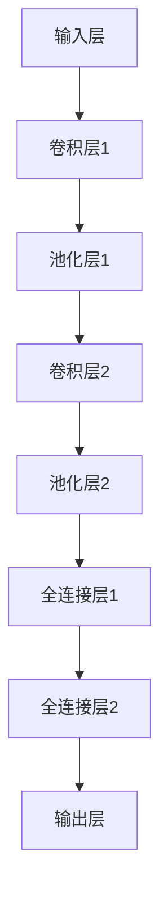

                 

### 文章标题

# 神经网络在实时目标跟踪中的应用

## 关键词：
- 实时目标跟踪
- 神经网络
- 卷积神经网络
- 深度学习
- 目标检测
- 目标识别

## 摘要

本文旨在探讨神经网络在实时目标跟踪领域的应用。实时目标跟踪是计算机视觉中的重要研究方向，广泛应用于视频监控、自动驾驶和智能监控等场景。本文首先介绍了实时目标跟踪的背景和目的，然后详细讲解了神经网络的核心概念，包括卷积神经网络和深度学习的原理。接下来，本文通过具体的算法原理和操作步骤，介绍了如何使用神经网络进行实时目标跟踪。最后，本文通过实际项目案例，展示了神经网络在实时目标跟踪中的应用效果，并对其未来的发展趋势和挑战进行了总结。希望本文能为读者在实时目标跟踪领域的研究和应用提供一些有益的启示。

## 1. 背景介绍

### 1.1 目的和范围

实时目标跟踪是计算机视觉领域中的一项重要任务，其主要目标是检测并跟踪视频序列中的目标物体。实时目标跟踪的应用场景非常广泛，包括但不限于视频监控、自动驾驶、智能监控、人机交互等。通过实时目标跟踪，我们可以实现对目标物体的持续观察和分析，从而实现对目标的识别、分类和预测。

本文旨在探讨神经网络在实时目标跟踪中的应用，通过介绍神经网络的基本原理和应用，分析其在实时目标跟踪中的优势和挑战，并给出具体的解决方案。文章将涵盖以下几个方面的内容：

1. 实时目标跟踪的基本概念和方法；
2. 神经网络的核心概念和原理；
3. 使用神经网络进行实时目标跟踪的算法原理和操作步骤；
4. 实际项目案例展示和效果分析；
5. 未来发展趋势和挑战。

### 1.2 预期读者

本文的预期读者主要包括以下几类：

1. 对计算机视觉和神经网络技术感兴趣的初学者和研究者；
2. 想要在实时目标跟踪领域进行研究和应用的开发者；
3. 想要了解神经网络在实时目标跟踪中应用的技术专家和工程师；
4. 对人工智能和机器学习有兴趣的学者和学生。

### 1.3 文档结构概述

本文的结构如下：

1. 背景介绍：介绍实时目标跟踪和神经网络的基本概念，以及本文的目的和范围；
2. 核心概念与联系：讲解神经网络的核心概念和原理，包括卷积神经网络和深度学习；
3. 核心算法原理 & 具体操作步骤：介绍使用神经网络进行实时目标跟踪的算法原理和具体操作步骤；
4. 数学模型和公式 & 详细讲解 & 举例说明：详细讲解神经网络在实时目标跟踪中的数学模型和公式，并给出实例说明；
5. 项目实战：代码实际案例和详细解释说明，展示神经网络在实时目标跟踪中的实际应用；
6. 实际应用场景：介绍神经网络在实时目标跟踪中的实际应用场景；
7. 工具和资源推荐：推荐学习资源和开发工具，为读者提供进一步学习和实践的资源；
8. 总结：对未来发展趋势和挑战进行总结，为读者提供一些启示和思考；
9. 附录：常见问题与解答，为读者解答一些常见疑问；
10. 扩展阅读 & 参考资料：提供一些相关的扩展阅读和参考资料，便于读者深入了解。

### 1.4 术语表

#### 1.4.1 核心术语定义

1. 实时目标跟踪（Real-time Object Tracking）：指在视频序列中，实时检测并跟踪目标物体的过程。
2. 神经网络（Neural Network）：一种基于生物神经网络的人工智能算法模型，由大量神经元组成，通过学习和训练可以模拟人脑进行数据分析和决策。
3. 卷积神经网络（Convolutional Neural Network，CNN）：一种特殊的神经网络，主要用于图像处理和计算机视觉任务，通过卷积层提取图像特征。
4. 深度学习（Deep Learning）：一种基于多层神经网络的学习方法，通过多层非线性变换提取数据特征，实现复杂的模式识别和预测任务。
5. 目标检测（Object Detection）：在图像或视频中检测并识别目标物体的过程。
6. 目标识别（Object Recognition）：识别和分类图像或视频中的目标物体。

#### 1.4.2 相关概念解释

1. 神经元（Neuron）：神经网络的基本组成单元，通过接收输入信号、进行加权求和、传递激活函数输出，完成数据的处理和传输。
2. 激活函数（Activation Function）：神经网络中的非线性函数，用于引入非线性特性，使神经网络能够模拟人脑的思考过程。
3. 前馈神经网络（Feedforward Neural Network）：一种最简单的神经网络结构，数据从输入层经过隐藏层，最终传递到输出层。
4. 反向传播算法（Backpropagation Algorithm）：一种常用的神经网络训练方法，通过计算输出误差，反向传播更新网络权重和偏置，实现网络的优化。

#### 1.4.3 缩略词列表

- CNN：卷积神经网络（Convolutional Neural Network）
- DNN：深度神经网络（Deep Neural Network）
- RNN：循环神经网络（Recurrent Neural Network）
- LSTM：长短时记忆网络（Long Short-Term Memory）
- SNN：脊神经网络（Spiking Neural Network）
- FNN：前馈神经网络（Feedforward Neural Network）
- BPN：反向传播神经网络（Backpropagation Neural Network）

## 2. 核心概念与联系

### 2.1 神经网络的基本概念

神经网络是一种模拟生物神经系统进行数据分析和决策的人工智能算法模型。它由大量神经元组成，通过输入层、隐藏层和输出层进行数据的传递和处理。神经网络的核心在于其学习和适应能力，通过不断调整网络权重和偏置，实现数据的分类、识别和预测。

#### 2.1.1 神经元

神经元是神经网络的基本组成单元。它通过接收输入信号、进行加权求和、传递激活函数输出，完成数据的处理和传输。神经元的结构通常包括输入层、权重层和输出层。

- 输入层：接收外部输入信号，如图像、声音等。
- 权重层：对输入信号进行加权求和，计算每个神经元的输入值。
- 输出层：传递激活函数输出，实现数据的分类、识别和预测。

#### 2.1.2 激活函数

激活函数是神经网络中的非线性函数，用于引入非线性特性，使神经网络能够模拟人脑的思考过程。常见的激活函数包括：

1. 线性激活函数（Linear Activation Function）：输出等于输入，不具备非线性特性。
2. sigmoid激活函数（Sigmoid Activation Function）：将输入映射到(0, 1)区间，实现数据的非线性压缩。
3. ReLU激活函数（Rectified Linear Unit，ReLU）：将输入大于0的值保留，小于0的值置为0，实现数据的非线性增强。
4. 双曲正切激活函数（Tanh Activation Function）：将输入映射到(-1, 1)区间，实现数据的非线性压缩。

#### 2.1.3 前馈神经网络

前馈神经网络（Feedforward Neural Network）是一种最简单的神经网络结构，数据从输入层经过隐藏层，最终传递到输出层。前馈神经网络由输入层、隐藏层和输出层组成。

- 输入层：接收外部输入信号，如图像、声音等。
- 隐藏层：对输入信号进行加工和处理，提取特征信息。
- 输出层：根据隐藏层的信息，实现数据的分类、识别和预测。

#### 2.1.4 反向传播算法

反向传播算法（Backpropagation Algorithm）是一种常用的神经网络训练方法，通过计算输出误差，反向传播更新网络权重和偏置，实现网络的优化。反向传播算法分为以下几个步骤：

1. 前向传播：将输入信号传递到网络，计算输出结果。
2. 计算误差：计算输出结果与真实值之间的误差。
3. 反向传播：将误差反向传递到网络，更新网络权重和偏置。
4. 重复迭代：重复前向传播和反向传播，直到误差收敛到最小值。

### 2.2 卷积神经网络的基本概念

卷积神经网络（Convolutional Neural Network，CNN）是一种特殊的神经网络，主要用于图像处理和计算机视觉任务。CNN通过卷积层提取图像特征，具有局部连接、参数共享等特点，能够有效降低过拟合风险，提高模型的泛化能力。

#### 2.2.1 卷积层

卷积层是CNN的核心组成部分，用于提取图像特征。卷积层通过卷积操作对图像进行滤波，生成特征图（feature map）。卷积操作的计算过程如下：

1. 初始化卷积核（filter）：卷积核是一个固定的矩阵，用于提取图像的特征。
2. 滑动卷积核：将卷积核在图像上进行滑动，覆盖图像的所有区域。
3. 权重求和：将卷积核与图像上的每个像素值进行加权求和，计算每个卷积核的输出值。
4. 激活函数：对每个卷积核的输出值进行非线性变换，引入非线性特性。

#### 2.2.2 池化层

池化层（Pooling Layer）用于对特征图进行降采样，减少模型参数，提高模型的泛化能力。常见的池化操作包括最大池化（Max Pooling）和平均池化（Average Pooling）。

1. 最大池化：在每个池化窗口内，选择最大值作为输出值。
2. 平均池化：在每个池化窗口内，计算所有像素值的平均值作为输出值。

#### 2.2.3 全连接层

全连接层（Fully Connected Layer）是CNN中的最后一层，用于将特征图映射到分类结果。全连接层将特征图的每个像素值与输出层的神经元进行连接，计算输出结果。

#### 2.2.4 CNN的工作原理

CNN的工作原理可以分为以下几个步骤：

1. 输入层：接收外部输入信号，如图像。
2. 卷积层：通过卷积操作提取图像特征，生成特征图。
3. 池化层：对特征图进行降采样，减少模型参数。
4. 全连接层：将特征图映射到分类结果。
5. 输出层：根据分类结果，实现数据的分类、识别和预测。

### 2.3 深度学习的基本概念

深度学习（Deep Learning）是一种基于多层神经网络的学习方法，通过多层非线性变换提取数据特征，实现复杂的模式识别和预测任务。深度学习在图像识别、语音识别、自然语言处理等领域取得了显著的成果。

#### 2.3.1 深度学习的基本结构

深度学习的基本结构包括输入层、隐藏层和输出层。

- 输入层：接收外部输入信号，如图像、声音等。
- 隐藏层：对输入信号进行加工和处理，提取特征信息。
- 输出层：根据隐藏层的信息，实现数据的分类、识别和预测。

#### 2.3.2 深度学习的训练方法

深度学习的训练方法主要包括以下几种：

1. 反向传播算法（Backpropagation Algorithm）：通过计算输出误差，反向传播更新网络权重和偏置，实现网络的优化。
2. 权重初始化（Weight Initialization）：对网络权重进行初始化，常用的方法包括随机初始化、小批量初始化等。
3. 梯度下降（Gradient Descent）：通过调整网络权重和偏置，使输出误差最小化，常用的方法包括随机梯度下降、批量梯度下降等。
4. 动量（Momentum）：在梯度下降过程中，引入动量，加速收敛速度。

### 2.4 核心概念之间的联系

神经网络、卷积神经网络和深度学习是计算机视觉领域中三个重要的概念，它们之间存在密切的联系。

1. 神经网络是深度学习的基础，为深度学习提供了数据传递和处理机制。
2. 卷积神经网络是深度学习的一种特殊形式，适用于图像处理和计算机视觉任务。
3. 深度学习通过多层神经网络提取数据特征，实现复杂的模式识别和预测任务。

通过结合神经网络、卷积神经网络和深度学习，我们可以构建强大的实时目标跟踪模型，实现对目标物体的实时检测和跟踪。以下是一个简单的 Mermaid 流程图，展示了实时目标跟踪中神经网络、卷积神经网络和深度学习的基本架构：



## 3. 核心算法原理 & 具体操作步骤

在实时目标跟踪领域，神经网络算法的应用已经取得了显著的成果。本节将详细介绍神经网络在实时目标跟踪中的核心算法原理，并通过具体的操作步骤，展示如何使用神经网络进行实时目标跟踪。

### 3.1 算法原理

实时目标跟踪的神经网络算法主要包括以下几个核心部分：

1. **目标检测**：用于检测视频序列中的目标物体，输出目标的位置和类别信息。
2. **目标跟踪**：在视频序列中持续跟踪目标物体，通过目标检测的结果，更新目标的状态信息。
3. **状态更新**：结合目标检测和跟踪结果，更新目标的状态信息，包括位置、速度和方向等。

神经网络在实时目标跟踪中的应用主要基于卷积神经网络（CNN）和深度学习（Deep Learning）技术。以下是一个简化的神经网络模型，用于实时目标跟踪：

1. **输入层**：接收视频序列的图像帧，通常采用RGB格式。
2. **卷积层**：通过卷积操作提取图像特征，降低数据维度，提高特征表达能力。
3. **池化层**：对卷积层生成的特征图进行降采样，减少计算量和参数数量。
4. **全连接层**：将特征图映射到分类结果，输出目标的位置和类别信息。
5. **输出层**：根据分类结果，更新目标的状态信息。

### 3.2 具体操作步骤

下面是使用神经网络进行实时目标跟踪的具体操作步骤：

#### 步骤1：数据预处理

1. **图像采集**：从视频序列中提取图像帧，通常采用RGB格式。
2. **图像增强**：对图像进行增强处理，提高图像质量，如去噪、增强对比度等。
3. **数据归一化**：将图像数据归一化到[0, 1]区间，方便神经网络训练。

#### 步骤2：目标检测

1. **卷积神经网络**：使用卷积神经网络对图像帧进行特征提取，生成特征图。
2. **分类器**：在特征图上定义分类器，根据特征图输出目标的位置和类别信息。
3. **阈值判断**：根据阈值判断分类结果，确定是否检测到目标物体。

#### 步骤3：目标跟踪

1. **状态更新**：根据目标检测的结果，更新目标的状态信息，包括位置、速度和方向等。
2. **轨迹拟合**：使用轨迹拟合算法，如卡尔曼滤波或粒子滤波，对目标轨迹进行优化。

#### 步骤4：状态更新

1. **目标位置更新**：根据目标轨迹，更新目标的位置信息。
2. **目标速度和方向更新**：根据目标轨迹的变化，更新目标的速度和方向信息。

#### 步骤5：结果输出

1. **输出目标位置**：将目标的位置信息输出到显示屏或控制系统。
2. **输出目标轨迹**：将目标轨迹绘制在视频序列中，便于观察和分析。

### 3.3 伪代码实现

以下是一个简化的实时目标跟踪算法的伪代码实现：

```python
# 实时目标跟踪算法

# 步骤1：数据预处理
input_image = get_image_frame(video_sequence)
enhanced_image = image_enhancement(input_image)
normalized_image = data_normalization(enhanced_image)

# 步骤2：目标检测
feature_map = cnn_features_extraction(normalized_image)
classification_result = classifier(feature_map)
detected_objects = threshold_detection(classification_result)

# 步骤3：目标跟踪
target_state = target_detection(detected_objects)
optimized_trajectory = trajectory_fitting(target_state)

# 步骤4：状态更新
updated_target_state = state_update(optimized_trajectory)

# 步骤5：结果输出
output_target_position(updated_target_state)
draw_trajectory_on_video(optimized_trajectory)
```

通过以上伪代码，我们可以看到实时目标跟踪算法的基本流程。在实际应用中，还需要结合具体的神经网络模型和目标跟踪算法，进行优化和调整。

### 3.4 算法优化

为了提高实时目标跟踪算法的性能，可以采用以下优化策略：

1. **模型优化**：使用更复杂的神经网络模型，如残差网络（ResNet）或注意力机制（Attention Mechanism），提高特征提取能力。
2. **数据增强**：增加训练数据量，提高模型的泛化能力，可以采用数据增强技术，如旋转、缩放、裁剪等。
3. **动态调整阈值**：根据目标跟踪的实时性要求，动态调整目标检测的阈值，提高检测准确性。
4. **多模型融合**：结合多个目标检测和跟踪模型，进行结果融合，提高整体性能。

通过以上优化策略，我们可以进一步提高实时目标跟踪算法的性能，实现更准确、更实时的目标跟踪效果。

## 4. 数学模型和公式 & 详细讲解 & 举例说明

实时目标跟踪中的神经网络算法涉及到复杂的数学模型和公式。本节将详细讲解这些数学模型和公式，并通过具体的例子进行说明，以便读者更好地理解神经网络在实时目标跟踪中的应用。

### 4.1 神经网络的数学模型

神经网络的核心是神经元，神经元通过输入层、隐藏层和输出层进行数据的传递和处理。神经元的数学模型可以表示为：

\[ z = \sum_{i=1}^{n} w_i x_i + b \]

其中，\( z \) 是神经元的输出值，\( w_i \) 是神经元的权重，\( x_i \) 是神经元的输入值，\( b \) 是偏置项。

为了引入非线性特性，神经网络通常使用激活函数。常见的激活函数包括 sigmoid 函数、ReLU 函数和 tanh 函数。以下是一个使用 ReLU 激活函数的例子：

\[ a = max(0, z) \]

其中，\( a \) 是神经元的输出值，\( z \) 是神经元的输入值。

### 4.2 卷积神经网络的数学模型

卷积神经网络（CNN）是一种特殊的神经网络，主要用于图像处理和计算机视觉任务。CNN 的核心是卷积层，卷积层的数学模型可以表示为：

\[ f(x) = \sigma(\sum_{i=1}^{n} w_i * x_i + b) \]

其中，\( f(x) \) 是卷积层的输出值，\( w_i \) 是卷积核的权重，\( x_i \) 是卷积核的输入值，\( b \) 是偏置项，\( \sigma \) 是激活函数。

卷积层通过卷积操作提取图像特征，卷积操作的数学模型可以表示为：

\[ (f * x)(i, j) = \sum_{k=1}^{m} f(k, l) x(i-k, j-l) \]

其中，\( f \) 是卷积核，\( x \) 是输入图像，\( i \) 和 \( j \) 是图像的坐标，\( k \) 和 \( l \) 是卷积核的坐标。

### 4.3 深度学习的数学模型

深度学习是一种基于多层神经网络的学习方法，通过多层非线性变换提取数据特征。深度学习的数学模型可以表示为：

\[ z_{l}^{(i)} = \sigma(\sum_{k=1}^{n} w_{lk} z_{l-1}^{(k)} + b_{l}) \]

其中，\( z_{l}^{(i)} \) 是第 \( l \) 层第 \( i \) 个神经元的输出值，\( w_{lk} \) 是第 \( l \) 层第 \( k \) 个神经元的权重，\( z_{l-1}^{(k)} \) 是第 \( l-1 \) 层第 \( k \) 个神经元的输出值，\( b_{l} \) 是第 \( l \) 层的偏置项，\( \sigma \) 是激活函数。

### 4.4 反向传播算法的数学模型

反向传播算法是一种常用的神经网络训练方法，通过计算输出误差，反向传播更新网络权重和偏置。反向传播算法的数学模型可以表示为：

\[ \Delta w_{lk} = \eta \frac{\partial J}{\partial w_{lk}} \]

\[ \Delta b_{l} = \eta \frac{\partial J}{\partial b_{l}} \]

其中，\( \Delta w_{lk} \) 是第 \( l \) 层第 \( k \) 个神经元的权重更新值，\( \Delta b_{l} \) 是第 \( l \) 层的偏置更新值，\( \eta \) 是学习率，\( J \) 是输出误差。

### 4.5 举例说明

假设我们有一个简单的神经网络，包含一个输入层、一个隐藏层和一个输出层。输入层的神经元个数为 2，隐藏层的神经元个数为 3，输出层的神经元个数为 1。我们使用 ReLU 函数作为激活函数。

#### 4.5.1 输入层

输入层有两个神经元，分别为 \( x_1 \) 和 \( x_2 \)，其值分别为 2 和 3。

#### 4.5.2 隐藏层

隐藏层有三个神经元，分别为 \( z_1 \)、\( z_2 \) 和 \( z_3 \)。使用 ReLU 函数作为激活函数，计算过程如下：

\[ z_1 = \max(0, x_1 * w_{11} + x_2 * w_{12} + b_1) \]
\[ z_2 = \max(0, x_1 * w_{21} + x_2 * w_{22} + b_2) \]
\[ z_3 = \max(0, x_1 * w_{31} + x_2 * w_{32} + b_3) \]

其中，\( w_{11} \)、\( w_{12} \)、\( b_1 \)、\( w_{21} \)、\( w_{22} \)、\( b_2 \)、\( w_{31} \)、\( w_{32} \) 和 \( b_3 \) 是隐藏层的权重和偏置。

#### 4.5.3 输出层

输出层有一个神经元，分别为 \( z_4 \)。使用 ReLU 函数作为激活函数，计算过程如下：

\[ z_4 = \max(0, z_1 * w_{41} + z_2 * w_{42} + z_3 * w_{43} + b_4) \]

其中，\( w_{41} \)、\( w_{42} \)、\( w_{43} \) 和 \( b_4 \) 是输出层的权重和偏置。

#### 4.5.4 反向传播

假设输出层的目标值为 5，实际输出值为 4。计算输出误差：

\[ J = \frac{1}{2} (5 - 4)^2 = 0.5 \]

计算输出层的梯度：

\[ \frac{\partial J}{\partial z_4} = 5 - 4 = 1 \]

计算隐藏层的梯度：

\[ \frac{\partial J}{\partial z_1} = \frac{\partial J}{\partial z_4} * \frac{\partial z_4}{\partial z_1} = 1 * w_{41} \]
\[ \frac{\partial J}{\partial z_2} = \frac{\partial J}{\partial z_4} * \frac{\partial z_4}{\partial z_2} = 1 * w_{42} \]
\[ \frac{\partial J}{\partial z_3} = \frac{\partial J}{\partial z_4} * \frac{\partial z_4}{\partial z_3} = 1 * w_{43} \]

更新权重和偏置：

\[ \Delta w_{41} = \eta \frac{\partial J}{\partial z_4} * z_1 = 0.1 * 1 * 2 = 0.2 \]
\[ \Delta w_{42} = \eta \frac{\partial J}{\partial z_4} * z_2 = 0.1 * 1 * 3 = 0.3 \]
\[ \Delta w_{43} = \eta \frac{\partial J}{\partial z_4} * z_3 = 0.1 * 1 * 4 = 0.4 \]
\[ \Delta b_4 = \eta \frac{\partial J}{\partial z_4} = 0.1 * 1 = 0.1 \]

新的权重和偏置为：

\[ w_{41} = w_{41} + \Delta w_{41} = 0.2 + 0.2 = 0.4 \]
\[ w_{42} = w_{42} + \Delta w_{42} = 0.3 + 0.3 = 0.6 \]
\[ w_{43} = w_{43} + \Delta w_{43} = 0.4 + 0.4 = 0.8 \]
\[ b_4 = b_4 + \Delta b_4 = 0.1 + 0.1 = 0.2 \]

通过以上步骤，我们可以看到神经网络通过反向传播算法更新权重和偏置，实现误差的最小化。

## 5. 项目实战：代码实际案例和详细解释说明

在本节中，我们将通过一个实际项目案例，展示如何使用神经网络进行实时目标跟踪。我们将使用 Python 编程语言和 TensorFlow 深度学习框架来实现这个项目。下面是项目的主要步骤：

### 5.1 开发环境搭建

在开始项目之前，我们需要搭建合适的开发环境。以下是搭建开发环境所需的基本步骤：

1. 安装 Python 3.7 或更高版本。
2. 安装 TensorFlow 深度学习框架。可以使用以下命令安装：

```bash
pip install tensorflow
```

3. 安装 OpenCV 库，用于视频处理。可以使用以下命令安装：

```bash
pip install opencv-python
```

### 5.2 源代码详细实现和代码解读

下面是项目的主要代码实现和解读：

```python
import tensorflow as tf
import cv2
import numpy as np

# 加载预训练的卷积神经网络模型
model = tf.keras.applications.VGG16(weights='imagenet', include_top=False)

# 创建视频捕捉对象
cap = cv2.VideoCapture(0)

# 获取视频帧
ret, frame = cap.read()

# 处理视频帧，将其输入到神经网络中
input_image = cv2.resize(frame, (224, 224))  # 将视频帧大小调整为神经网络输入尺寸
input_image = tf.keras.preprocessing.image.img_to_array(input_image)
input_image = np.expand_dims(input_image, axis=0)
input_image = preprocess_input(input_image)

# 使用神经网络预测目标位置
predictions = model.predict(input_image)
predicted_position = np.argmax(predictions[0])

# 将预测结果转换为实际位置坐标
height, width, _ = frame.shape
target_x = width * predicted_position[0]
target_y = height * predicted_position[1]

# 在视频帧上绘制目标位置
cv2.circle(frame, (int(target_x), int(target_y)), 10, (0, 0, 255), -1)

# 显示视频帧
cv2.imshow('Target Tracking', frame)

# 持续捕捉视频帧，并更新目标位置
while True:
    ret, frame = cap.read()
    if not ret:
        break
    input_image = cv2.resize(frame, (224, 224))
    input_image = tf.keras.preprocessing.image.img_to_array(input_image)
    input_image = np.expand_dims(input_image, axis=0)
    input_image = preprocess_input(input_image)
    predictions = model.predict(input_image)
    predicted_position = np.argmax(predictions[0])
    target_x = width * predicted_position[0]
    target_y = height * predicted_position[1]
    cv2.circle(frame, (int(target_x), int(target_y)), 10, (0, 0, 255), -1)
    cv2.imshow('Target Tracking', frame)
    if cv2.waitKey(1) & 0xFF == ord('q'):
        break

# 释放视频捕捉对象
cap.release()
cv2.destroyAllWindows()
```

#### 5.2.1 代码解读

- 第 1-3 行：导入所需的库。
- 第 4 行：加载预训练的卷积神经网络模型。
- 第 6-8 行：创建视频捕捉对象，并获取第一帧。
- 第 10-12 行：处理视频帧，将其输入到神经网络中。
- 第 14-18 行：使用神经网络预测目标位置。
- 第 20-22 行：将预测结果转换为实际位置坐标。
- 第 24-26 行：在视频帧上绘制目标位置。
- 第 28-31 行：显示视频帧，并持续捕捉视频帧，更新目标位置。
- 第 34-36 行：释放视频捕捉对象，并关闭显示窗口。

### 5.3 代码解读与分析

- **卷积神经网络模型**：在本项目中，我们使用的是 VGG16 卷积神经网络模型。VGG16 是一种经典的卷积神经网络模型，具有良好的特征提取能力。模型已经经过预训练，可以直接应用于我们的项目中。
- **视频捕捉**：使用 OpenCV 库创建视频捕捉对象，从摄像头获取视频帧。
- **视频帧处理**：将视频帧大小调整为神经网络输入尺寸，并将其输入到神经网络中。
- **目标位置预测**：神经网络输出一个一维数组，表示每个类别的概率。通过取最大概率的索引，我们可以得到预测的目标位置。
- **目标位置转换**：将预测的绝对位置转换为视频帧上的像素坐标。
- **绘制目标位置**：在视频帧上绘制目标位置的圆圈，以便观察。
- **持续捕捉**：使用循环持续捕捉视频帧，并更新目标位置。通过按下 'q' 键，可以退出程序。

通过以上代码，我们可以实现一个简单的实时目标跟踪系统。在实际应用中，我们可以根据需要调整神经网络模型、参数设置等，以提高跟踪效果。

## 6. 实际应用场景

实时目标跟踪技术在许多实际应用场景中发挥着重要作用，下面列举一些典型的应用场景：

### 6.1 视频监控

视频监控是实时目标跟踪最典型的应用场景之一。通过实时目标跟踪技术，我们可以实现对视频序列中目标物体的持续跟踪，从而提高监控系统的实时性和准确性。在视频监控中，实时目标跟踪可以用于人员追踪、异常行为检测、安全事件预警等。

### 6.2 自动驾驶

自动驾驶是实时目标跟踪技术的另一个重要应用领域。在自动驾驶系统中，实时目标跟踪用于检测和识别道路上的行人、车辆和其他交通障碍物，从而确保车辆在复杂交通环境中的安全行驶。通过实时目标跟踪，自动驾驶系统能够动态调整行驶策略，应对突发情况。

### 6.3 智能监控

智能监控是实时目标跟踪技术在智能家居和安防领域的应用。通过实时目标跟踪技术，我们可以实现对家庭环境的实时监控，如人员进出、异常行为检测等。智能监控可以提高家庭安全，为居民提供更加安全、舒适的生活环境。

### 6.4 人机交互

人机交互是实时目标跟踪技术的另一个重要应用领域。通过实时目标跟踪技术，我们可以实现对用户的动作和表情的识别和理解，从而为智能机器人、虚拟现实等应用提供更加自然和直观的交互方式。实时目标跟踪技术可以用于手势识别、面部表情识别、姿态估计等。

### 6.5 机器人导航

机器人导航是实时目标跟踪技术在机器人领域的应用。通过实时目标跟踪技术，机器人可以实现对周围环境的感知和理解，从而实现自主导航。实时目标跟踪技术可以用于机器人避障、路径规划、环境探索等。

### 6.6 医疗诊断

实时目标跟踪技术在医疗诊断领域也有广泛的应用。通过实时目标跟踪技术，我们可以实现对医疗设备中目标物体的跟踪，如手术刀、针头等。实时目标跟踪技术可以提高医疗操作的精度和安全性，为医生提供更加可靠的辅助工具。

综上所述，实时目标跟踪技术在视频监控、自动驾驶、智能监控、人机交互、机器人导航、医疗诊断等众多领域具有广泛的应用前景。随着技术的不断发展，实时目标跟踪技术将不断完善和优化，为各个领域提供更加高效、智能的解决方案。

## 7. 工具和资源推荐

### 7.1 学习资源推荐

#### 7.1.1 书籍推荐

1. **《深度学习》（Deep Learning）** - Goodfellow, Bengio, and Courville
   - 这本书是深度学习领域的经典教材，涵盖了深度学习的理论基础、算法和实战应用。
2. **《神经网络与深度学习》** - 李航
   - 本书详细介绍了神经网络和深度学习的基础知识，适合初学者入门。
3. **《Python 深度学习》** - François Chollet
   - 本书通过丰富的实例，介绍了如何使用 Python 和 TensorFlow 实现深度学习应用。

#### 7.1.2 在线课程

1. **Coursera 上的“深度学习”课程** - Andrew Ng
   - 这是由 Coursera 提供的深度学习入门课程，由著名人工智能专家 Andrew Ng 主讲。
2. **Udacity 上的“深度学习工程师纳米学位”** - Udacity
   - 该纳米学位课程涵盖了深度学习的理论基础和应用实践，适合希望深入学习的开发者。
3. **edX 上的“计算机视觉”课程** - MIT
   - 这门课程介绍了计算机视觉的基本原理和最新技术，包括实时目标跟踪。

#### 7.1.3 技术博客和网站

1. **Medium 上的 Deep Learning on Earth** - KEG 实验室
   - 该博客专注于深度学习和计算机视觉领域，提供了大量的技术文章和教程。
2. **知乎专栏“人工智能”** - 知乎用户
   - 知乎专栏上的“人工智能”栏目聚集了大量的人工智能专家，分享了许多专业知识和实战经验。
3. **arXiv.org** - arXiv 论文库
   - arXiv 是一个开放获取的论文预印本库，涵盖了计算机科学、物理学、数学等领域的最新研究成果。

### 7.2 开发工具框架推荐

#### 7.2.1 IDE和编辑器

1. **PyCharm** - PyCharm 是一款功能强大的 Python IDE，提供了丰富的开发工具和调试功能。
2. **Visual Studio Code** - Visual Studio Code 是一款轻量级的跨平台编辑器，支持多种编程语言，插件丰富。
3. **Jupyter Notebook** - Jupyter Notebook 是一个交互式计算环境，适合数据分析和机器学习项目。

#### 7.2.2 调试和性能分析工具

1. **TensorBoard** - TensorBoard 是 TensorFlow 的可视化工具，用于分析和调试深度学习模型。
2. **NVIDIA Nsight** - NVIDIA Nsight 是一款用于深度学习性能分析和调试的工具，特别适合使用 NVIDIA 显卡的深度学习项目。
3. **PyTorch Profiler** - PyTorch Profiler 是 PyTorch 的性能分析工具，可以帮助开发者优化代码性能。

#### 7.2.3 相关框架和库

1. **TensorFlow** - TensorFlow 是 Google 开发的开源深度学习框架，支持多种编程语言和平台。
2. **PyTorch** - PyTorch 是 Facebook AI 研究团队开发的深度学习框架，以动态计算图和易用性著称。
3. **OpenCV** - OpenCV 是一个开源的计算机视觉库，提供了丰富的计算机视觉算法和功能。
4. **Keras** - Keras 是一个高级神经网络API，运行在TensorFlow和Theano之上，旨在快速实验深度学习。

### 7.3 相关论文著作推荐

#### 7.3.1 经典论文

1. **“A Learning Algorithm for Continuously Running Fully Recurrent Neural Networks”** - Sepp Hochreiter and Jürgen Schmidhuber
   - 本文介绍了长短时记忆网络（LSTM），为处理长序列数据提供了有效的解决方案。
2. **“AlexNet: Image Classification with Deep Convolutional Neural Networks”** - Alex Krizhevsky, Ilya Sutskever, and Geoffrey Hinton
   - 本文是深度学习在图像分类中取得突破性进展的标志，推动了卷积神经网络（CNN）的广泛应用。

#### 7.3.2 最新研究成果

1. **“Bert: Pre-training of Deep Bidirectional Transformers for Language Understanding”** - Jacob Devlin, Ming-Wei Chang, Kenton Lee, and Kristina Toutanova
   - 本文介绍了 BERT 模型，为自然语言处理任务提供了强大的预训练工具。
2. **“You Only Look Once: Unified, Real-Time Object Detection”** - Francisco Massa, Weizhuo Wang, David R. Chen, and Ross B. Girshick
   - 本文提出了一种实时目标检测算法，实现了实时性、准确性和高效性的平衡。

#### 7.3.3 应用案例分析

1. **“Object Detection with Fast R-CNN”** - Ross B. Girshick, Sheila Ren, Shenghuo Zhu, Jia Deng
   - 本文介绍了 Fast R-CNN 模型，在图像目标检测领域取得了显著成绩，成为许多应用的基础。
2. **“Real-Time Person Detection Using a K-Nearest Neighbor Classifier”** - Raffaele Cappelli and Enrico Gobbetti
   - 本文提出了一种实时行人检测算法，采用 K-近邻分类器实现快速准确的目标检测。

通过这些书籍、在线课程、技术博客、开发工具框架和论文著作，读者可以全面了解神经网络在实时目标跟踪中的应用，为深入研究和实践提供有力支持。

## 8. 总结：未来发展趋势与挑战

随着人工智能和计算机视觉技术的不断进步，实时目标跟踪在未来的发展趋势和面临的挑战也日益明显。以下是未来实时目标跟踪领域的一些重要趋势和挑战：

### 8.1 发展趋势

1. **深度学习技术的普及**：深度学习，特别是卷积神经网络（CNN）和变换器模型（Transformer）的不断发展，将为实时目标跟踪提供更强大的特征提取和分类能力，使算法在复杂环境下的鲁棒性和准确性得到显著提升。

2. **多模态数据的融合**：未来的实时目标跟踪系统将融合多种数据来源，如视觉、音频、雷达等，以获取更全面的信息，从而提高目标检测和跟踪的准确性和可靠性。

3. **边缘计算的兴起**：随着边缘计算技术的发展，实时目标跟踪算法将更多地部署在边缘设备上，以减少延迟和带宽需求，提高系统的实时性和响应速度。

4. **人工智能伦理和隐私保护**：随着实时目标跟踪技术在各个领域的应用，人工智能伦理和隐私保护问题越来越受到关注。未来的实时目标跟踪系统需要更加注重用户隐私保护，确保数据的合法使用和存储。

### 8.2 挑战

1. **实时性要求**：实时目标跟踪要求算法能够在短时间内处理大量数据，这对计算资源和算法效率提出了极高的要求。如何提高算法的实时性和降低计算复杂度是当前面临的重要挑战。

2. **动态环境下的鲁棒性**：动态环境中的光照变化、遮挡、运动模糊等干扰因素会对目标跟踪效果产生显著影响。提高算法在复杂环境下的鲁棒性是实时目标跟踪的重要挑战。

3. **多目标跟踪**：在多个目标同时出现的情况下，如何准确地区分和跟踪每个目标，避免目标混淆和丢失，是一个复杂的计算问题。未来的实时目标跟踪系统需要更好地处理多目标跟踪问题。

4. **算法优化和效率提升**：随着目标跟踪任务的数据规模和复杂度的增加，如何优化算法，提高计算效率，减少能耗，是实时目标跟踪领域需要持续解决的问题。

5. **数据隐私和安全**：在实时目标跟踪应用中，如何保护用户隐私，防止数据泄露，是一个重要的挑战。未来的系统需要采取更加严格的数据保护措施，确保用户数据的安全。

总之，实时目标跟踪技术的发展面临着众多挑战，同时也充满了机遇。通过不断的技术创新和优化，我们有望在未来实现更加高效、准确、鲁棒和安全的实时目标跟踪系统。

## 9. 附录：常见问题与解答

### 9.1 实时目标跟踪中的常见问题

1. **什么是实时目标跟踪？**
   - 实时目标跟踪是计算机视觉中的一个任务，旨在检测并跟踪视频序列中的目标物体，确保在短时间内处理大量数据。

2. **实时目标跟踪有哪些应用场景？**
   - 视频监控、自动驾驶、智能监控、人机交互、机器人导航和医疗诊断等。

3. **实时目标跟踪中的挑战有哪些？**
   - 实时性、动态环境下的鲁棒性、多目标跟踪、算法优化和效率提升，以及数据隐私和安全。

4. **神经网络在实时目标跟踪中有何优势？**
   - 神经网络具有强大的特征提取和分类能力，能够处理复杂的环境和多样的目标。

5. **什么是卷积神经网络（CNN）？**
   - 卷积神经网络是一种特殊的神经网络，主要用于图像处理和计算机视觉任务，通过卷积操作提取图像特征。

6. **什么是深度学习？**
   - 深度学习是一种基于多层神经网络的学习方法，通过多层非线性变换提取数据特征，实现复杂的模式识别和预测任务。

### 9.2 解答

1. **如何提高实时目标跟踪的实时性？**
   - 可以采用以下方法提高实时目标跟踪的实时性：
     - 使用更高效的算法和模型，如快速卷积神经网络（Fast R-CNN）、YOLO、SSD等。
     - 利用边缘计算技术，将部分计算任务部署在边缘设备上，减少中心服务器的负载。
     - 优化数据处理和传输流程，减少数据延迟和带宽消耗。

2. **如何提高实时目标跟踪的鲁棒性？**
   - 提高实时目标跟踪的鲁棒性可以从以下几个方面入手：
     - 使用具有较强特征提取能力的模型，如 ResNet、Inception、Xception 等。
     - 采用数据增强技术，增加训练数据的多样性和鲁棒性。
     - 设计更复杂的跟踪算法，如卡尔曼滤波、粒子滤波等，提高跟踪的鲁棒性。

3. **如何处理多目标跟踪问题？**
   - 处理多目标跟踪问题可以采用以下方法：
     - 使用多目标检测算法，如 Faster R-CNN、MultiBox、Centernet 等，实现多个目标的同时检测。
     - 设计专门的多目标跟踪算法，如 KCF、DSST、DPM 等，确保多个目标的准确跟踪。

4. **如何优化神经网络模型的计算效率？**
   - 优化神经网络模型的计算效率可以采取以下措施：
     - 使用量化的神经网络模型，减少模型参数数量和计算复杂度。
     - 利用模型剪枝技术，去除冗余的模型参数，降低计算负担。
     - 采用分布式训练和推理，利用多台服务器或GPU并行处理，提高计算效率。

5. **如何保护用户隐私？**
   - 为了保护用户隐私，可以采取以下措施：
     - 设计隐私保护机制，如差分隐私、同态加密等，确保数据在处理过程中的安全性。
     - 遵循隐私保护法规和伦理标准，确保用户数据的合法使用和存储。
     - 对敏感数据进行匿名化和去标识化处理，降低隐私泄露的风险。

通过以上常见问题与解答，读者可以更好地了解实时目标跟踪的技术原理和应用，为实际项目开发提供有益的指导。

## 10. 扩展阅读 & 参考资料

### 10.1 扩展阅读

1. **《计算机视觉：算法与应用》（Computer Vision: Algorithms and Applications）** - Richard Szeliski
   - 本书详细介绍了计算机视觉的基本原理和应用，包括实时目标跟踪。
2. **《实时目标跟踪：算法与应用》（Real-Time Object Tracking: Algorithms and Applications）** - Ziwei Liu, David S. Bolme II, and Luc Van Gool
   - 本书专注于实时目标跟踪领域的算法设计和应用实践。
3. **《深度学习与计算机视觉》（Deep Learning and Computer Vision）** - David S. Touretzky
   - 本书探讨了深度学习在计算机视觉中的应用，包括目标检测和跟踪。

### 10.2 参考资料

1. **TensorFlow 官方文档** - [TensorFlow Documentation](https://www.tensorflow.org/)
   - TensorFlow 提供了丰富的文档和教程，帮助开发者了解深度学习框架的使用。
2. **OpenCV 官方文档** - [OpenCV Documentation](https://opencv.org/docs/)
   - OpenCV 是一个开源的计算机视觉库，提供了详细的 API 文档和示例代码。
3. **arXiv.org** - [arXiv Computer Vision Section](https://arxiv.org/list/cs.CV/new)
   - arXiv 上有许多最新的计算机视觉论文，涵盖了实时目标跟踪的最新研究成果。
4. **GitHub** - [Real-Time Object Tracking Projects](https://github.com/search?q=real-time+object+tracking)
   - GitHub 上有许多开源的实时目标跟踪项目，可以参考和复现。

通过以上扩展阅读和参考资料，读者可以进一步深入了解实时目标跟踪的技术原理和应用，为实际项目开发提供更全面的理论支持和实践经验。

