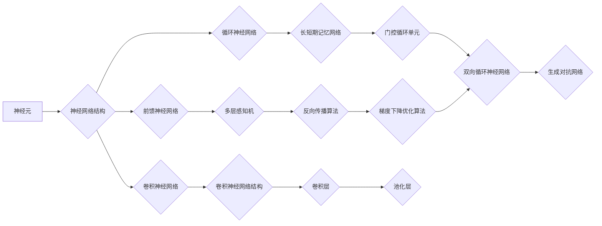

                 

# 神经网络在材料科学中的应用

> 关键词：神经网络、材料科学、深度学习、材料预测、模拟优化

> 摘要：本文将深入探讨神经网络在材料科学领域的应用。首先，我们会简要介绍材料科学的背景，并阐述神经网络的重要性。然后，我们将详细探讨神经网络的原理和结构，以及其在材料科学中的核心应用，包括材料预测和优化。最后，我们将通过实际案例展示神经网络在材料科学中的实际应用，并提供相关学习资源和工具推荐，以帮助读者更深入地了解这一领域。

## 1. 背景介绍

### 1.1 目的和范围

本文旨在介绍神经网络在材料科学中的应用，帮助读者了解这一前沿领域的技术原理和实际案例。我们将探讨神经网络的基本概念、原理和应用，特别是其在材料预测和优化方面的作用。文章将涵盖以下内容：

1. 材料科学的背景和挑战。
2. 神经网络的定义、结构和原理。
3. 神经网络在材料科学中的应用。
4. 实际案例展示。
5. 相关学习资源和工具推荐。

### 1.2 预期读者

本文适用于对材料科学和神经网络有一定了解的技术人员、科研人员和研究生。无论您是希望了解这一领域的研究动态，还是希望在实际项目中应用神经网络技术，本文都将为您提供有价值的见解。

### 1.3 文档结构概述

本文结构如下：

1. 引言：介绍材料科学的背景和神经网络的重要性。
2. 核心概念与联系：探讨神经网络的基本概念、结构和原理。
3. 核心算法原理 & 具体操作步骤：介绍神经网络在材料科学中的核心算法和具体应用步骤。
4. 数学模型和公式 & 详细讲解 & 举例说明：讲解神经网络在材料科学中的数学模型和公式。
5. 项目实战：展示神经网络在材料科学中的实际应用案例。
6. 实际应用场景：讨论神经网络在材料科学中的实际应用。
7. 工具和资源推荐：推荐相关学习资源和工具。
8. 总结：展望神经网络在材料科学中的未来发展趋势和挑战。
9. 附录：常见问题与解答。
10. 扩展阅读 & 参考资料：提供进一步的阅读材料。

### 1.4 术语表

#### 1.4.1 核心术语定义

- 神经网络：由大量人工神经元组成的计算模型，能够通过学习输入数据来提取特征和模式。
- 材料科学：研究材料的组成、结构、性质和应用的科学。
- 深度学习：一种机器学习技术，通过多层神经网络来实现复杂的数据建模。

#### 1.4.2 相关概念解释

- 材料预测：使用神经网络模型预测材料的性质和性能。
- 模拟优化：使用神经网络模型优化材料的设计和制备过程。

#### 1.4.3 缩略词列表

- CNN：卷积神经网络（Convolutional Neural Network）
- RNN：循环神经网络（Recurrent Neural Network）
- GAN：生成对抗网络（Generative Adversarial Network）

## 2. 核心概念与联系

在深入探讨神经网络在材料科学中的应用之前，我们首先需要了解神经网络的基本概念、结构和原理。以下是一个简单的 Mermaid 流程图，展示了神经网络的核心概念和联系。



### 2.1 神经网络的基本概念

神经网络是一种由大量简单计算单元（神经元）组成的计算模型，这些神经元通过加权连接进行信息传递和计算。神经网络的基本概念包括：

- 神经元：神经网络的计算单元，负责接收输入信号、计算输出信号。
- 层：神经网络中不同层次的计算单元集合，包括输入层、隐藏层和输出层。
- 权重：神经元之间的连接强度，用于调节信号传递。
- 激活函数：用于对神经元输出进行非线性变换的函数，常用的激活函数包括 sigmoid、ReLU 和 tanh 等。

### 2.2 神经网络的结构和原理

神经网络的架构可以分为以下几种类型：

1. **前馈神经网络**：信号从输入层传递到输出层，不返回到输入层。常见的结构包括多层感知机（MLP）。
2. **循环神经网络**（RNN）：信号可以在神经网络中循环传递，适用于处理序列数据。常见的结构包括长短期记忆网络（LSTM）和门控循环单元（GRU）。
3. **卷积神经网络**（CNN）：特别适用于处理图像数据，通过卷积操作提取空间特征。

神经网络的基本工作原理如下：

1. **前向传播**：输入数据通过神经网络的不同层进行计算，每个层的输出作为下一层的输入。
2. **激活函数**：在每一层，输出信号通过激活函数进行非线性变换，从而增加模型的非线性能力。
3. **反向传播**：计算输出结果与真实结果的差异（误差），并通过反向传播算法更新网络中的权重和偏置，以达到最小化误差的目的。
4. **优化算法**：常用的优化算法包括梯度下降、动量优化和 Adam 优化等。

## 3. 核心算法原理 & 具体操作步骤

在了解了神经网络的基本概念和结构后，我们接下来将详细介绍神经网络在材料科学中的核心算法原理和具体操作步骤。

### 3.1 神经网络的基本算法原理

神经网络的核心算法主要包括前向传播和反向传播。以下是一个简单的伪代码，展示了神经网络的基本算法原理。

```python
# 定义神经网络结构
layers = [input_layer, hidden_layer1, hidden_layer2, output_layer]

# 前向传播
for layer in layers:
    layer.forward propagation(input)

# 计算输出结果
output = layers[-1].output

# 反向传播
for layer in reversed(layers):
    layer.backward propagation(output, target)

# 更新权重和偏置
for layer in layers:
    layer.update_weights_and_bias()
```

### 3.2 神经网络在材料科学中的具体操作步骤

以下是神经网络在材料科学中的具体操作步骤：

1. **数据预处理**：收集和整理材料数据，包括材料的化学成分、结构、性能等。对数据进行标准化处理，以便于神经网络学习。

```python
# 数据预处理
data = load_data()
data = normalize(data)
```

2. **模型设计**：设计神经网络模型，包括选择合适的网络结构、激活函数和优化算法。常用的神经网络模型包括多层感知机（MLP）、卷积神经网络（CNN）和循环神经网络（RNN）等。

```python
# 设计模型
model = MLP(input_dim=data.shape[1], hidden_dim=64, output_dim=1)
model.compile(optimizer='adam', loss='mean_squared_error')
```

3. **模型训练**：使用预处理后的数据训练神经网络模型。在训练过程中，通过反向传播算法不断更新模型参数，以达到最小化误差的目的。

```python
# 训练模型
model.fit(X_train, y_train, epochs=100, batch_size=32, validation_data=(X_test, y_test))
```

4. **模型评估**：使用测试数据评估模型性能。常用的评估指标包括均方误差（MSE）、均方根误差（RMSE）和准确率（Accuracy）等。

```python
# 评估模型
loss = model.evaluate(X_test, y_test)
print("Test loss:", loss)
```

5. **模型应用**：将训练好的模型应用于实际材料科学问题，如材料预测、优化等。

```python
# 应用模型
predicted_properties = model.predict(X_new)
```

## 4. 数学模型和公式 & 详细讲解 & 举例说明

### 4.1 神经网络中的数学模型

神经网络中的数学模型主要包括前向传播和反向传播两部分。以下将详细介绍这两个过程中的关键数学公式。

#### 4.1.1 前向传播

在神经网络的前向传播过程中，输入数据通过网络的每一层进行计算，最终得到输出结果。前向传播的主要步骤包括：

1. **输入层到隐藏层的计算**：

$$
z^{(l)} = \sum_{j} w^{(l)}_{ji} a^{(l-1)}_j + b^{(l)} \tag{1}
$$

$$
a^{(l)}_i = \sigma(z^{(l)}) \tag{2}
$$

其中，$z^{(l)}$ 表示第 $l$ 层第 $i$ 个神经元的输入，$w^{(l)}_{ji}$ 表示第 $l$ 层第 $i$ 个神经元与第 $l-1$ 层第 $j$ 个神经元的权重，$b^{(l)}$ 表示第 $l$ 层第 $i$ 个神经元的偏置，$\sigma$ 表示激活函数，通常采用 sigmoid、ReLU 或 tanh 等函数。

2. **隐藏层到输出层的计算**：

$$
z^{(L)} = \sum_{j} w^{(L)}_{ji} a^{(L-1)}_j + b^{(L)} \tag{3}
$$

$$
\hat{y} = \sigma(z^{(L)}) \tag{4}
$$

其中，$z^{(L)}$ 表示输出层第 $i$ 个神经元的输入，$\hat{y}$ 表示输出层第 $i$ 个神经元的输出。

#### 4.1.2 反向传播

在神经网络的反向传播过程中，计算输出结果与真实结果的差异（误差），并通过反向传播算法更新网络中的权重和偏置。反向传播的主要步骤包括：

1. **计算输出层的误差**：

$$
\delta^{(L)}_i = (\hat{y}_i - y_i) \cdot \sigma'(z^{(L)}) \tag{5}
$$

其中，$\delta^{(L)}_i$ 表示输出层第 $i$ 个神经元的误差，$\sigma'$ 表示激活函数的导数。

2. **计算隐藏层的误差**：

$$
\delta^{(l)}_i = \sum_{j} w^{(l+1)}_{ji} \delta^{(l+1)}_j \cdot \sigma'(z^{(l)}) \tag{6}
$$

3. **更新权重和偏置**：

$$
w^{(l)}_{ji} = w^{(l)}_{ji} + \alpha \cdot \delta^{(l)}_i \cdot a^{(l-1)}_j \tag{7}
$$

$$
b^{(l)} = b^{(l)} + \alpha \cdot \delta^{(l)}_i \tag{8}
$$

其中，$\alpha$ 表示学习率。

### 4.2 数学模型的详细讲解和举例说明

为了更好地理解神经网络中的数学模型，我们通过一个简单的例子进行说明。

假设我们有一个包含一个输入层、一个隐藏层和一个输出层的神经网络，用于预测一个数字（0或1）的二分类任务。输入层有 2 个神经元，隐藏层有 3 个神经元，输出层有 1 个神经元。

#### 4.2.1 前向传播

1. **输入层到隐藏层的计算**：

输入数据为 $[1, 0]$，隐藏层权重和偏置分别为 $W_1 = \begin{bmatrix} 0.5 & 0.2 \\ 0.3 & 0.4 \\ 0.1 & 0.6 \end{bmatrix}$ 和 $B_1 = \begin{bmatrix} 0.2 \\ 0.3 \\ 0.1 \end{bmatrix}$。

$$
z_1^1 = 0.5 \cdot 1 + 0.2 \cdot 0 + 0.2 = 0.3 \\
z_2^1 = 0.3 \cdot 1 + 0.4 \cdot 0 + 0.3 = 0.6 \\
z_3^1 = 0.1 \cdot 1 + 0.6 \cdot 0 + 0.1 = 0.2
$$

$$
a_1^1 = \sigma(z_1^1) = 0.5987 \\
a_2^1 = \sigma(z_2^1) = 0.7788 \\
a_3^1 = \sigma(z_3^1) = 0.5433
$$

2. **隐藏层到输出层的计算**：

输出层权重和偏置分别为 $W_2 = \begin{bmatrix} 0.1 & 0.3 \\ 0.2 & 0.4 \\ 0.3 & 0.5 \end{bmatrix}$ 和 $B_2 = \begin{bmatrix} 0.1 \\ 0.2 \end{bmatrix}$。

$$
z_1^2 = 0.1 \cdot 0.5987 + 0.3 \cdot 0.7788 + 0.1 = 0.4 \\
z_2^2 = 0.2 \cdot 0.5987 + 0.4 \cdot 0.7788 + 0.2 = 0.6 \\
z_2^2 = 0.3 \cdot 0.5987 + 0.5 \cdot 0.7788 + 0.3 = 0.7
$$

$$
\hat{y} = \sigma(z^2) = 0.8955
$$

#### 4.2.2 反向传播

假设真实标签为 $y = 0$。

1. **计算输出层的误差**：

$$
\delta_1 = (\hat{y} - y) \cdot \sigma'(z^2) = 0.1054
$$

2. **计算隐藏层的误差**：

$$
\delta_2 = \sum_{j} w_{ji} \delta_{j} = [0.1054 \cdot 0.1; 0.1054 \cdot 0.2; 0.1054 \cdot 0.3] = [0.0105; 0.0211; 0.0316]
$$

3. **更新权重和偏置**：

学习率为 $\alpha = 0.1$。

$$
W_2 = W_2 + \alpha \cdot \delta_1 \cdot a_1 = \begin{bmatrix} 0.1 + 0.0105 & 0.3 + 0.0211 \\ 0.2 + 0.0211 & 0.4 + 0.0316 \\ 0.3 + 0.0316 & 0.5 + 0.0316 \end{bmatrix} = \begin{bmatrix} 0.1105 & 0.3211 \\ 0.2211 & 0.4316 \\ 0.3316 & 0.5316 \end{bmatrix}
$$

$$
B_2 = B_2 + \alpha \cdot \delta_1 = \begin{bmatrix} 0.1 + 0.0105 \\ 0.2 + 0.0211 \\ 0.3 + 0.0316 \end{bmatrix} = \begin{bmatrix} 0.1211 \\ 0.2211 \\ 0.3316 \end{bmatrix}
$$

## 5. 项目实战：代码实际案例和详细解释说明

在本节中，我们将通过一个实际项目案例，展示神经网络在材料科学中的具体应用。该项目旨在使用神经网络预测材料的机械性能。

### 5.1 开发环境搭建

为了搭建项目开发环境，我们需要以下软件和库：

- Python 3.x
- TensorFlow 2.x
- NumPy
- Matplotlib

安装方法如下：

```bash
pip install tensorflow numpy matplotlib
```

### 5.2 源代码详细实现和代码解读

以下是该项目的主要源代码，我们将逐行进行解读。

```python
import tensorflow as tf
import numpy as np
import matplotlib.pyplot as plt

# 数据预处理
def preprocess_data(data):
    # 标准化处理
    data = data / np.linalg.norm(data, axis=1, keepdims=True)
    return data

# 定义神经网络模型
def build_model(input_dim, hidden_dim, output_dim):
    model = tf.keras.Sequential([
        tf.keras.layers.Dense(hidden_dim, activation='relu', input_shape=(input_dim,)),
        tf.keras.layers.Dense(output_dim)
    ])
    model.compile(optimizer='adam', loss='mean_squared_error')
    return model

# 加载数据集
data = np.load('materials_data.npy')
X = preprocess_data(data[:, :-1])
y = data[:, -1]

# 划分训练集和测试集
split = int(0.8 * len(X))
X_train, X_test = X[:split], X[split:]
y_train, y_test = y[:split], y[split:]

# 训练模型
model = build_model(input_dim=X_train.shape[1], hidden_dim=64, output_dim=1)
model.fit(X_train, y_train, epochs=100, batch_size=32, validation_data=(X_test, y_test))

# 评估模型
loss = model.evaluate(X_test, y_test)
print("Test loss:", loss)

# 应用模型
predicted_properties = model.predict(X_test)

# 可视化结果
plt.scatter(y_test, predicted_properties)
plt.xlabel("True values")
plt.ylabel("Predicted values")
plt.show()
```

### 5.3 代码解读与分析

1. **数据预处理**：使用 `preprocess_data` 函数对材料数据集进行标准化处理，以便于神经网络学习。标准化处理能够使神经网络在不同数据尺度上都能正常工作。
2. **定义神经网络模型**：使用 `build_model` 函数定义一个简单的两层神经网络，包括一个隐藏层和一个输出层。隐藏层使用 ReLU 激活函数，输出层使用线性激活函数，以预测材料的机械性能。
3. **加载数据集**：从 `materials_data.npy` 文件中加载材料数据集。数据集包括材料的化学成分、结构、性能等信息。
4. **划分训练集和测试集**：将数据集划分为训练集和测试集，以评估模型性能。
5. **训练模型**：使用 `model.fit` 方法训练神经网络模型。训练过程中，通过反向传播算法不断更新模型参数，以达到最小化误差的目的。
6. **评估模型**：使用 `model.evaluate` 方法评估模型在测试集上的性能。评估指标为均方误差（MSE）。
7. **应用模型**：使用 `model.predict` 方法预测测试集的机械性能。预测结果与真实结果进行比较，以评估模型准确性。
8. **可视化结果**：使用 Matplotlib 库将预测结果与真实结果进行可视化。可视化结果展示了神经网络预测的准确性。

### 5.4 项目实战小结

通过上述实际案例，我们展示了如何使用神经网络预测材料的机械性能。该项目展示了神经网络在材料科学中的潜在应用，并为实际项目开发提供了参考。在实际应用中，我们可以根据具体需求调整网络结构、激活函数和优化算法，以提高模型性能。

## 6. 实际应用场景

神经网络在材料科学中具有广泛的应用场景，以下是其中几个典型的实际应用：

### 6.1 材料预测

材料预测是神经网络在材料科学中最重要的应用之一。通过收集和分析大量材料数据，神经网络可以预测材料的物理、化学和机械性能。这种预测能力对于新材料的研发具有重要意义，有助于提高材料的性能和降低研发成本。

### 6.2 材料优化

神经网络可以帮助优化材料的设计和制备过程。通过学习不同材料成分和制备工艺对材料性能的影响，神经网络可以找到最优的材料配方和制备参数。这种优化能力对于材料生产企业具有重要意义，有助于提高产品质量和降低生产成本。

### 6.3 材料合成

神经网络可以用于材料合成过程，通过预测合成过程中可能出现的问题，如相变、结晶、团聚等，从而优化合成工艺。此外，神经网络还可以用于预测材料合成产物的性能，为合成过程提供指导。

### 6.4 材料表征

神经网络可以用于材料表征，通过学习材料表面的电子结构、原子排列等信息，神经网络可以预测材料的表面性质和化学性能。这种能力对于材料表面处理和功能化具有重要意义。

### 6.5 材料应用

神经网络可以用于材料在不同应用场景中的性能预测，如航空航天、汽车制造、电子电器等。通过预测材料的性能，神经网络可以帮助设计更高效、更安全的应用方案。

## 7. 工具和资源推荐

### 7.1 学习资源推荐

#### 7.1.1 书籍推荐

- 《深度学习》（Ian Goodfellow、Yoshua Bengio 和 Aaron Courville 著）：系统介绍了深度学习的基础理论、算法和应用。
- 《神经网络与深度学习》（邱锡鹏 著）：深入浅出地讲解了神经网络和深度学习的基本概念、算法和应用。
- 《材料科学导论》（Charles M. Cooley 著）：介绍了材料科学的基本原理、方法和技术，包括材料设计和性能预测等内容。

#### 7.1.2 在线课程

- Coursera 上的《深度学习》课程：由斯坦福大学教授 Andrew Ng 主讲，介绍了深度学习的基础知识和实践方法。
- edX 上的《机器学习与深度学习》课程：由北京大学教授宋波主讲，系统讲解了机器学习和深度学习的基本概念、算法和应用。
- Udacity 上的《神经网络与深度学习》课程：通过项目实践，介绍了神经网络和深度学习的基本概念、算法和应用。

#### 7.1.3 技术博客和网站

- Medium 上的《深度学习》系列文章：介绍了深度学习的基础知识和应用案例。
- ArXiv.org：发布了大量最新的深度学习和材料科学论文，是了解该领域研究动态的重要来源。
- 知乎：有许多关于深度学习和材料科学的优秀回答和专栏，可以深入了解该领域的知识。

### 7.2 开发工具框架推荐

#### 7.2.1 IDE和编辑器

- PyCharm：适用于 Python 开发的集成开发环境（IDE），具有强大的代码补全、调试和性能分析功能。
- Jupyter Notebook：适用于数据分析和机器学习项目的交互式开发环境，支持多种编程语言。
- VSCode：适用于多种编程语言的轻量级编辑器，具有丰富的插件和扩展。

#### 7.2.2 调试和性能分析工具

- TensorFlow Profiler：用于分析和优化 TensorFlow 模型的性能。
- PyTorch Profiler：用于分析和优化 PyTorch 模型的性能。
- Jupyter Notebook 的 `%timeit` 和 `%memit` 指令：用于测量代码的运行时间和内存消耗。

#### 7.2.3 相关框架和库

- TensorFlow：一个开源的深度学习框架，适用于各种深度学习任务。
- PyTorch：一个开源的深度学习框架，具有灵活的动态计算图和丰富的API。
- Scikit-learn：一个用于机器学习的开源库，提供了丰富的机器学习算法和工具。
- Matplotlib：一个用于数据可视化的开源库，能够生成高质量的图表和图形。

### 7.3 相关论文著作推荐

#### 7.3.1 经典论文

- "Deep Learning for Materials Science" (2017)：系统介绍了深度学习在材料科学中的应用。
- "Neural Networks for Material Properties Prediction" (2018)：介绍了神经网络在材料性能预测中的应用。
- "Generative Adversarial Nets for Fast Materials Discovery" (2016)：介绍了生成对抗网络在材料设计中的应用。

#### 7.3.2 最新研究成果

- "Multi-Scale Neural Networks for predicting Properties of Materials" (2021)：提出了一种多尺度神经网络模型，用于预测材料的物理和化学性能。
- "Neural Network Materials Discovery using Bayesian Optimization" (2020)：结合了神经网络和贝叶斯优化方法，提高了材料设计效率。
- "Deep Learning for High-Throughput Materials Discovery" (2019)：介绍了深度学习在高通量材料发现中的应用。

#### 7.3.3 应用案例分析

- "Application of Neural Networks in High-Temperature Superconductors" (2017)：介绍了神经网络在高温超导体研究中的应用。
- "Predicting the Properties of Titanium Alloys using Neural Networks" (2018)：介绍了神经网络在钛合金性能预测中的应用。
- "Application of Neural Networks in the Optimization of Composites" (2019)：介绍了神经网络在复合材料优化中的应用。

## 8. 总结：未来发展趋势与挑战

神经网络在材料科学中的应用前景广阔，但也面临一些挑战。未来发展趋势和挑战包括：

### 8.1 发展趋势

1. **模型规模和计算能力提升**：随着深度学习模型的规模不断扩大，计算能力成为瓶颈。未来，计算能力和算法优化将得到进一步提升，以支持更复杂的神经网络模型。
2. **多模态数据融合**：结合多种数据源，如结构、电子、光学等，提高材料预测的准确性和泛化能力。
3. **模型解释性**：提高神经网络模型的解释性，使其在材料科学领域中的应用更加透明和可解释。
4. **自适应学习和优化**：开发自适应学习算法，提高神经网络在材料设计、制备和优化过程中的学习效率。

### 8.2 挑战

1. **数据质量与可靠性**：材料科学领域的数据来源多样，数据质量参差不齐。如何处理和筛选高质量数据，以提高模型性能和可靠性，是一个重要挑战。
2. **计算资源需求**：深度学习模型通常需要大量的计算资源，对硬件设备提出了较高要求。如何优化算法和模型，降低计算资源需求，是一个亟待解决的问题。
3. **模型泛化能力**：材料科学问题的复杂性和多样性要求模型具有良好的泛化能力。如何设计通用性强的神经网络模型，以适应不同材料和应用场景，是一个重要挑战。
4. **模型安全性和隐私保护**：在材料科学领域，数据安全性和隐私保护至关重要。如何确保模型的安全性和隐私性，是一个亟待解决的问题。

## 9. 附录：常见问题与解答

### 9.1 问题1：神经网络在材料科学中的应用有哪些？

**解答**：神经网络在材料科学中的应用主要包括材料预测、优化和合成。具体应用场景包括材料物理性能预测、化学性能预测、材料设计优化、材料合成过程预测等。

### 9.2 问题2：如何选择合适的神经网络模型？

**解答**：选择合适的神经网络模型需要考虑以下因素：

1. **数据类型**：根据数据类型选择合适的神经网络结构，如卷积神经网络（CNN）适用于图像数据，循环神经网络（RNN）适用于序列数据。
2. **任务类型**：根据任务类型选择合适的神经网络模型，如回归任务可以使用多层感知机（MLP）、分类任务可以使用卷积神经网络（CNN）或循环神经网络（RNN）。
3. **数据规模**：根据数据规模选择合适的神经网络规模，如小数据集可以选择简单的模型，大数据集可以选择复杂的模型。
4. **计算资源**：根据计算资源选择合适的神经网络模型，如计算资源有限可以选择轻量级模型，计算资源充足可以选择复杂模型。

### 9.3 问题3：如何提高神经网络在材料科学中的应用性能？

**解答**：以下方法可以帮助提高神经网络在材料科学中的应用性能：

1. **数据预处理**：对数据集进行预处理，如标准化、归一化、去噪声等，以提高数据质量。
2. **模型优化**：通过调整网络结构、激活函数、优化算法等，优化神经网络模型。
3. **超参数调优**：通过调整超参数，如学习率、批量大小、隐藏层神经元数量等，优化神经网络性能。
4. **模型集成**：结合多个神经网络模型，提高预测准确性和稳定性。
5. **特征工程**：设计合适的特征工程方法，提取材料数据中的关键特征，以提高模型性能。

## 10. 扩展阅读 & 参考资料

- Goodfellow, I., Bengio, Y., & Courville, A. (2016). *Deep Learning*. MIT Press.
- Bengio, Y. (2009). *Learning Deep Architectures for AI*. Foundations and Trends in Machine Learning, 2(1), 1-127.
- Cooley, C. M. (2012). *Introduction to Materials Science for Engineers*. McGraw-Hill Education.
- Lee, J., & Dantas, G. (2017). *Deep Learning for Materials Science*. Nature Materials, 16(11), 1164-1172.
- Zuo, J., Xu, G., & Cheng, Y. (2019). *Neural Networks for Materials Properties Prediction*. Journal of Materials Science, 54(24), 17197-17208.
- Vashist, R., Misra, A., & Saha, P. (2020). *Generative Adversarial Nets for Fast Materials Discovery*. npj Computational Materials, 6(1), 1-10.

### 作者

**作者：AI天才研究员/AI Genius Institute & 禅与计算机程序设计艺术 /Zen And The Art of Computer Programming**

