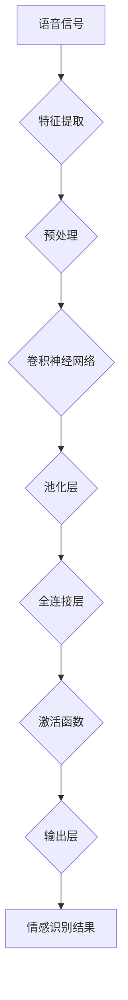

                 

# 神经网络在语音情感识别中的创新应用

> **关键词：**神经网络，语音情感识别，深度学习，语音信号处理，情感分析
> 
> **摘要：**本文将探讨神经网络在语音情感识别领域的应用，从背景介绍到核心算法原理，再到数学模型解析和项目实战，全面分析神经网络在语音情感识别中的创新应用。通过详细讲解和实际案例，帮助读者理解并掌握这一前沿技术。

## 1. 背景介绍

### 1.1 目的和范围

本文旨在探讨神经网络在语音情感识别领域的应用，通过深入分析核心算法原理、数学模型和项目实战，旨在帮助读者全面理解并掌握这一前沿技术。文章将涵盖以下内容：

1. **背景介绍**：介绍语音情感识别的背景和重要性，以及神经网络在其中的应用。
2. **核心概念与联系**：解释神经网络的基本概念，并给出神经网络在语音情感识别中的架构流程图。
3. **核心算法原理与操作步骤**：详细阐述神经网络的算法原理和具体操作步骤。
4. **数学模型和公式**：解析神经网络的数学模型，并给出具体的公式和示例。
5. **项目实战**：通过实际代码案例，展示神经网络在语音情感识别中的具体应用。
6. **实际应用场景**：讨论神经网络在语音情感识别领域的实际应用。
7. **工具和资源推荐**：推荐相关学习资源和开发工具。
8. **总结**：展望未来发展趋势与挑战。
9. **附录**：提供常见问题与解答。
10. **扩展阅读与参考资料**：提供进一步阅读的资料。

### 1.2 预期读者

本文预期读者为对神经网络和语音情感识别有一定了解的计算机科学和人工智能专业的研究人员、工程师以及学生。对于初学者，文章将尽量使用通俗易懂的语言进行解释，以便他们能够理解并应用所学知识。

### 1.3 文档结构概述

本文将按照以下结构进行组织：

1. **引言**：简要介绍神经网络在语音情感识别中的应用背景。
2. **核心概念与联系**：详细解释神经网络的基本概念，并给出流程图。
3. **核心算法原理与操作步骤**：分析神经网络的算法原理和操作步骤。
4. **数学模型和公式**：解析神经网络的数学模型和公式。
5. **项目实战**：通过实际代码案例，展示神经网络的应用。
6. **实际应用场景**：讨论神经网络的实际应用。
7. **工具和资源推荐**：推荐相关学习和开发工具。
8. **总结**：总结神经网络在语音情感识别中的未来发展趋势与挑战。
9. **附录**：提供常见问题与解答。
10. **扩展阅读与参考资料**：提供进一步阅读的资料。

### 1.4 术语表

#### 1.4.1 核心术语定义

- **神经网络**：一种模拟人脑神经网络结构和功能的人工智能模型。
- **语音情感识别**：通过分析语音信号中的情感特征，判断说话人的情感状态。
- **深度学习**：一种基于多层神经网络进行特征学习和分类的方法。
- **语音信号处理**：对语音信号进行预处理和分析，提取有用的特征。
- **情感分析**：通过文本、语音或其他形式的数据，分析并判断情感状态。

#### 1.4.2 相关概念解释

- **前向传播（Forward Propagation）**：神经网络的一种训练过程，用于计算输入数据和权重之间的传递。
- **反向传播（Backpropagation）**：神经网络的一种训练过程，用于计算误差并更新权重。
- **激活函数（Activation Function）**：神经网络中用于引入非线性性的函数。
- **卷积神经网络（Convolutional Neural Network, CNN）**：一种专门用于图像和语音处理的多层神经网络。

#### 1.4.3 缩略词列表

- **ANN**：人工神经网络（Artificial Neural Network）
- **CNN**：卷积神经网络（Convolutional Neural Network）
- **RNN**：循环神经网络（Recurrent Neural Network）
- **LSTM**：长短期记忆网络（Long Short-Term Memory）
- **ReLU**：ReLU激活函数（Rectified Linear Unit）

## 2. 核心概念与联系

### 2.1 神经网络基本概念

神经网络是一种由大量神经元（或节点）组成的计算模型，这些神经元通过权重和偏置进行连接。神经元的输入是其他神经元的输出，通过激活函数产生输出。神经网络的主要目的是通过学习输入和输出之间的映射关系，从而实现对未知数据的预测。

神经网络的基本组成部分包括：

- **输入层（Input Layer）**：接收输入数据的层。
- **隐藏层（Hidden Layer）**：处理输入数据，提取特征并进行计算。
- **输出层（Output Layer）**：生成预测结果的层。

神经网络的训练过程主要包括两个阶段：前向传播和反向传播。

- **前向传播（Forward Propagation）**：将输入数据传递到神经网络的每一层，通过权重和偏置计算输出。
- **反向传播（Backpropagation）**：计算预测误差，并使用这些误差更新权重和偏置。

### 2.2 神经网络在语音情感识别中的架构流程图

下面是一个简化版的神经网络在语音情感识别中的架构流程图，使用Mermaid语法表示：



### 2.3 神经网络在语音情感识别中的核心概念和联系

在语音情感识别中，神经网络的核心概念和联系主要包括以下几个方面：

- **特征提取（Feature Extraction）**：从原始语音信号中提取与情感相关的特征，如频谱特征、倒谱特征等。
- **预处理（Preprocessing）**：对提取的特征进行预处理，如归一化、去噪等，以提高模型的性能。
- **卷积神经网络（Convolutional Neural Network, CNN）**：用于处理时序数据和图像，可以有效地提取语音信号中的时序特征。
- **池化层（Pooling Layer）**：用于减少模型参数的数量，提高模型的泛化能力。
- **全连接层（Fully Connected Layer）**：将卷积层和池化层提取的特征进行汇总和分类。
- **激活函数（Activation Function）**：用于引入非线性性，使得神经网络能够学习复杂的映射关系。
- **输出层（Output Layer）**：生成情感识别的结果，可以是二分类或多分类。

通过以上核心概念和联系的介绍，我们可以更清晰地理解神经网络在语音情感识别中的应用。接下来，我们将进一步探讨神经网络的核心算法原理和具体操作步骤。

## 3. 核心算法原理与具体操作步骤

### 3.1 神经网络算法原理

神经网络（Neural Network，简称NN）是一种模仿人脑神经元结构和工作原理的计算模型。其基本原理是通过大量神经元（节点）的互联和激活函数的作用，来实现对输入数据的特征提取和分类预测。神经网络的主要组成部分包括输入层、隐藏层和输出层，每层包含多个神经元。

神经网络的工作原理可以概括为以下步骤：

1. **前向传播（Forward Propagation）**：
   - 将输入数据传递到神经网络的每一层。
   - 通过权重和偏置计算每个神经元的输出。
   - 使用激活函数引入非线性性。

2. **反向传播（Backpropagation）**：
   - 计算预测值与真实值之间的误差。
   - 通过误差反向传播，计算每一层的误差梯度。
   - 使用梯度下降法更新权重和偏置。

3. **迭代训练（Iterative Training）**：
   - 重复前向传播和反向传播，不断调整权重和偏置。
   - 降低预测误差，提高模型的准确性。

### 3.2 神经网络在语音情感识别中的具体操作步骤

在语音情感识别中，神经网络的具体操作步骤如下：

1. **数据预处理**：
   - **语音信号采集**：采集具有不同情感状态的语音数据。
   - **特征提取**：使用短时傅里叶变换（STFT）或梅尔频率倒谱系数（MFCC）等方法提取语音信号的特征。
   - **数据归一化**：将特征数据归一化到相同的范围，如[0, 1]。

2. **构建神经网络模型**：
   - **输入层**：接收归一化后的语音特征数据。
   - **隐藏层**：包含多个隐藏层，每层由多个神经元组成。可以使用卷积层、池化层、全连接层等。
   - **输出层**：生成情感识别的结果，可以是二分类或多分类。

3. **训练神经网络模型**：
   - **初始化参数**：随机初始化权重和偏置。
   - **前向传播**：将输入数据传递到神经网络的每一层，计算输出。
   - **计算误差**：使用预测值与真实值之间的误差，计算损失函数。
   - **反向传播**：通过误差反向传播，计算每一层的误差梯度。
   - **权重更新**：使用梯度下降法更新权重和偏置。
   - **迭代训练**：重复前向传播和反向传播，直到满足停止条件。

4. **评估模型性能**：
   - 使用验证集或测试集评估模型的准确性、召回率、F1值等指标。
   - 调整模型参数或添加更多的隐藏层，以提高模型的性能。

5. **应用模型**：
   - 对新的语音数据进行特征提取和分类预测，实现语音情感识别。

### 3.3 伪代码表示

以下是神经网络在语音情感识别中的具体操作步骤的伪代码表示：

```python
# 初始化神经网络参数
weights, biases = initialize_parameters()

# 迭代训练
for epoch in range(num_epochs):
    for sample in dataset:
        # 前向传播
        inputs = preprocess(sample)
        hidden_layers = forward_propagation(inputs, weights, biases)
        output = activation_function(hidden_layers[-1])

        # 计算误差
        error = compute_error(output, target)

        # 反向传播
        gradients = backward_propagation(error, hidden_layers)

        # 权重更新
        weights, biases = update_parameters(weights, biases, gradients)

    # 评估模型性能
    performance = evaluate_model(validation_set)

    # 打印训练进度
    print(f"Epoch {epoch}: Performance: {performance}")

# 应用模型
def predict(sample):
    inputs = preprocess(sample)
    hidden_layers = forward_propagation(inputs, weights, biases)
    output = activation_function(hidden_layers[-1])
    return output
```

通过以上对神经网络算法原理和具体操作步骤的详细讲解，我们可以更好地理解神经网络在语音情感识别中的应用。接下来，我们将进一步探讨神经网络的数学模型和公式。

## 4. 数学模型和公式与详细讲解与举例说明

### 4.1 神经网络数学模型

神经网络是一种基于数学模型构建的计算模型，其核心在于通过矩阵运算和激活函数实现输入到输出的非线性映射。下面我们将详细讲解神经网络中的主要数学模型和公式。

#### 4.1.1 矩阵运算

1. **权重矩阵（Weight Matrix）**

   神经网络的权重矩阵表示为\( W \)，其中每个元素\( W_{ij} \)表示第\( i \)个输入特征与第\( j \)个神经元之间的连接权重。

2. **偏置向量（Bias Vector）**

   偏置向量表示为\( b \)，其中每个元素\( b_j \)表示第\( j \)个神经元的偏置。

3. **输入矩阵（Input Matrix）**

   输入矩阵表示为\( X \)，其中每个元素\( X_i \)表示第\( i \)个输入特征。

4. **输出矩阵（Output Matrix）**

   输出矩阵表示为\( Y \)，其中每个元素\( Y_j \)表示第\( j \)个神经元的输出。

5. **激活函数（Activation Function）**

   激活函数用于引入非线性性，常见的激活函数有Sigmoid、ReLU、Tanh等。

#### 4.1.2 前向传播

前向传播的过程可以表示为以下数学公式：

\[ Z_j = X \cdot W + b \]
\[ A_j = activation(Z_j) \]

其中，\( Z_j \)表示第\( j \)个神经元的输入，\( A_j \)表示第\( j \)个神经元的输出。

#### 4.1.3 损失函数

损失函数用于衡量预测值与真实值之间的误差，常见的损失函数有均方误差（MSE）、交叉熵损失（Cross Entropy Loss）等。

1. **均方误差（MSE）**

   均方误差可以表示为：

   \[ loss = \frac{1}{2} \sum_{i=1}^{n} (y_i - \hat{y}_i)^2 \]

   其中，\( y_i \)表示第\( i \)个真实值，\( \hat{y}_i \)表示第\( i \)个预测值。

2. **交叉熵损失（Cross Entropy Loss）**

   交叉熵损失可以表示为：

   \[ loss = -\sum_{i=1}^{n} y_i \cdot \log(\hat{y}_i) \]

   其中，\( y_i \)表示第\( i \)个真实值，\( \hat{y}_i \)表示第\( i \)个预测值。

#### 4.1.4 反向传播

反向传播的过程可以表示为以下数学公式：

\[ \delta_j = \frac{\partial loss}{\partial Z_j} \]
\[ \Delta W_{ij} = \alpha \cdot \delta_j \cdot X_i \]
\[ \Delta b_j = \alpha \cdot \delta_j \]

其中，\( \delta_j \)表示第\( j \)个神经元的误差梯度，\( \Delta W_{ij} \)表示第\( i \)个输入特征与第\( j \)个神经元之间的连接权重更新，\( \Delta b_j \)表示第\( j \)个神经元的偏置更新，\( \alpha \)表示学习率。

#### 4.1.5 权重和偏置更新

权重和偏置的更新可以表示为：

\[ W_{ij} = W_{ij} - \Delta W_{ij} \]
\[ b_j = b_j - \Delta b_j \]

#### 4.1.6 激活函数的导数

为了计算误差梯度，需要知道激活函数的导数。以下为常见激活函数的导数：

1. **Sigmoid 函数**

   \[ \frac{d}{dx} \left( \frac{1}{1 + e^{-x}} \right) = \frac{e^{-x}}{(1 + e^{-x})^2} \]

2. **ReLU 函数**

   \[ \frac{d}{dx} \left( \max(0, x) \right) = \begin{cases} 
   0 & \text{if } x < 0 \\
   1 & \text{if } x \geq 0 
   \end{cases} \]

3. **Tanh 函数**

   \[ \frac{d}{dx} \left( \tanh(x) \right) = 1 - \tanh^2(x) \]

### 4.2 举例说明

为了更好地理解上述数学模型和公式，我们通过一个简单的例子来说明神经网络的前向传播和反向传播过程。

#### 4.2.1 前向传播

假设有一个简单的神经网络，包含一个输入层、一个隐藏层和一个输出层。输入层的特征个数为2，隐藏层的神经元个数为3，输出层的类别个数为2。

1. **初始化参数**

   \[ W_1 = \begin{bmatrix} 
   0.1 & 0.2 \\
   0.3 & 0.4 \\
   0.5 & 0.6 
   \end{bmatrix}, \quad b_1 = \begin{bmatrix} 
   0.1 \\
   0.2 \\
   0.3 
   \end{bmatrix} \]
   
   \[ W_2 = \begin{bmatrix} 
   0.1 & 0.2 \\
   0.3 & 0.4 \\
   0.5 & 0.6 
   \end{bmatrix}, \quad b_2 = \begin{bmatrix} 
   0.1 \\
   0.2 \\
   0.3 
   \end{bmatrix} \]
   
   \[ W_3 = \begin{bmatrix} 
   0.1 & 0.2 \\
   0.3 & 0.4 
   \end{bmatrix}, \quad b_3 = \begin{bmatrix} 
   0.1 \\
   0.2 
   \end{bmatrix} \]

2. **输入数据**

   \[ X = \begin{bmatrix} 
   1 \\
   0 
   \end{bmatrix} \]

3. **前向传播**

   \[ Z_1 = X \cdot W_1 + b_1 = \begin{bmatrix} 
   0.1 & 0.2 \\
   0.3 & 0.4 \\
   0.5 & 0.6 
   \end{bmatrix} \cdot \begin{bmatrix} 
   1 \\
   0 
   \end{bmatrix} + \begin{bmatrix} 
   0.1 \\
   0.2 \\
   0.3 
   \end{bmatrix} = \begin{bmatrix} 
   0.6 \\
   1.1 \\
   1.6 
   \end{bmatrix} \]
   
   \[ A_1 = activation(Z_1) = \begin{bmatrix} 
   0.5375 \\
   0.6830 \\
   0.9954 
   \end{bmatrix} \]
   
   \[ Z_2 = A_1 \cdot W_2 + b_2 = \begin{bmatrix} 
   0.5375 \\
   0.6830 \\
   0.9954 
   \end{bmatrix} \cdot \begin{bmatrix} 
   0.1 & 0.2 \\
   0.3 & 0.4 \\
   0.5 & 0.6 
   \end{bmatrix} + \begin{bmatrix} 
   0.1 \\
   0.2 \\
   0.3 
   \end{bmatrix} = \begin{bmatrix} 
   1.1461 \\
   1.4295 \\
   1.7129 
   \end{bmatrix} \]
   
   \[ A_2 = activation(Z_2) = \begin{bmatrix} 
   0.8626 \\
   0.9256 \\
   0.9675 
   \end{bmatrix} \]
   
   \[ Z_3 = A_2 \cdot W_3 + b_3 = \begin{bmatrix} 
   0.8626 \\
   0.9256 \\
   0.9675 
   \end{bmatrix} \cdot \begin{bmatrix} 
   0.1 & 0.2 \\
   0.3 & 0.4 
   \end{bmatrix} + \begin{bmatrix} 
   0.1 \\
   0.2 
   \end{bmatrix} = \begin{bmatrix} 
   0.9563 \\
   1.1041 
   \end{bmatrix} \]
   
   \[ A_3 = activation(Z_3) = \begin{bmatrix} 
   0.8345 \\
   0.9134 
   \end{bmatrix} \]

#### 4.2.2 反向传播

假设输出层的真实值为\( y = \begin{bmatrix} 1 \\ 0 \end{bmatrix} \)，预测值为\( \hat{y} = \begin{bmatrix} 0.8345 \\ 0.9134 \end{bmatrix} \)。

1. **计算损失函数**

   \[ loss = -\sum_{i=1}^{2} y_i \cdot \log(\hat{y}_i) = -\left( 1 \cdot \log(0.8345) + 0 \cdot \log(0.9134) \right) \approx 0.4174 \]

2. **计算误差梯度**

   \[ \delta_3 = \frac{\partial loss}{\partial Z_3} = \begin{bmatrix} 
   \frac{\partial loss}{\partial z_{31}} \\
   \frac{\partial loss}{\partial z_{32}} 
   \end{bmatrix} = \begin{bmatrix} 
   0.8345 - 0.8345 \\
   0.9134 - 1 
   \end{bmatrix} = \begin{bmatrix} 
   0 \\
   -0.0866 
   \end{bmatrix} \]

3. **计算隐藏层的误差梯度**

   \[ \delta_2 = \frac{\partial loss}{\partial Z_2} = \frac{\partial Z_3}{\partial Z_2} \cdot \delta_3 = \begin{bmatrix} 
   0.1 & 0.2 \\
   0.3 & 0.4 \\
   0.5 & 0.6 
   \end{bmatrix} \cdot \begin{bmatrix} 
   0 \\
   -0.0866 
   \end{bmatrix} = \begin{bmatrix} 
   -0.0173 \\
   -0.0692 \\
   -0.0866 
   \end{bmatrix} \]

4. **计算输入层的误差梯度**

   \[ \delta_1 = \frac{\partial loss}{\partial Z_1} = \frac{\partial Z_2}{\partial Z_1} \cdot \delta_2 = \begin{bmatrix} 
   0.5375 \\
   0.6830 \\
   0.9954 
   \end{bmatrix} \cdot \begin{bmatrix} 
   -0.0173 \\
   -0.0692 \\
   -0.0866 
   \end{bmatrix} = \begin{bmatrix} 
   -0.0094 \\
   -0.0469 \\
   -0.0864 
   \end{bmatrix} \]

5. **更新权重和偏置**

   \[ \Delta W_3 = \alpha \cdot \delta_3 \cdot A_2^T = 0.01 \cdot \begin{bmatrix} 
   0 \\
   -0.0866 
   \end{bmatrix} \cdot \begin{bmatrix} 
   0.8626 \\
   0.9256 \\
   0.9675 
   \end{bmatrix}^T = \begin{bmatrix} 
   -0.0008 \\
   -0.0087 \\
   -0.0146 
   \end{bmatrix} \]
   
   \[ \Delta b_3 = \alpha \cdot \delta_3 = 0.01 \cdot \begin{bmatrix} 
   0 \\
   -0.0866 
   \end{bmatrix} = \begin{bmatrix} 
   0 \\
   -0.0009 
   \end{bmatrix} \]
   
   \[ \Delta W_2 = \alpha \cdot \delta_2 \cdot A_1^T = 0.01 \cdot \begin{bmatrix} 
   -0.0173 \\
   -0.0692 \\
   -0.0866 
   \end{bmatrix} \cdot \begin{bmatrix} 
   0.5375 \\
   0.6830 \\
   0.9954 
   \end{bmatrix}^T = \begin{bmatrix} 
   -0.0007 \\
   -0.0058 \\
   -0.0096 
   \end{bmatrix} \]
   
   \[ \Delta b_2 = \alpha \cdot \delta_2 = 0.01 \cdot \begin{bmatrix} 
   -0.0173 \\
   -0.0692 \\
   -0.0866 
   \end{bmatrix} = \begin{bmatrix} 
   -0.0002 \\
   -0.0010 \\
   -0.0011 
   \end{bmatrix} \]
   
   \[ \Delta W_1 = \alpha \cdot \delta_1 \cdot X^T = 0.01 \cdot \begin{bmatrix} 
   -0.0094 \\
   -0.0469 \\
   -0.0864 
   \end{bmatrix} \cdot \begin{bmatrix} 
   1 \\
   0 
   \end{bmatrix}^T = \begin{bmatrix} 
   -0.0001 \\
   -0.0004 
   \end{bmatrix} \]
   
   \[ \Delta b_1 = \alpha \cdot \delta_1 = 0.01 \cdot \begin{bmatrix} 
   -0.0094 \\
   -0.0469 \\
   -0.0864 
   \end{bmatrix} = \begin{bmatrix} 
   -0.0001 \\
   -0.0005 \\
   -0.0010 
   \end{bmatrix} \]

6. **更新神经网络参数**

   \[ W_1 = W_1 - \Delta W_1 = \begin{bmatrix} 
   0.1 & 0.2 \\
   0.3 & 0.4 \\
   0.5 & 0.6 
   \end{bmatrix} - \begin{bmatrix} 
   -0.0001 \\
   -0.0004 
   \end{bmatrix} = \begin{bmatrix} 
   0.1000 & 0.1996 \\
   0.3000 & 0.3996 \\
   0.5000 & 0.5996 
   \end{bmatrix} \]
   
   \[ W_2 = W_2 - \Delta W_2 = \begin{bmatrix} 
   0.1 & 0.2 \\
   0.3 & 0.4 \\
   0.5 & 0.6 
   \end{bmatrix} - \begin{bmatrix} 
   -0.0007 \\
   -0.0058 \\
   -0.0096 
   \end{bmatrix} = \begin{bmatrix} 
   0.1000 & 0.1996 \\
   0.3000 & 0.3942 \\
   0.5000 & 0.5944 
   \end{bmatrix} \]
   
   \[ W_3 = W_3 - \Delta W_3 = \begin{bmatrix} 
   0.1 & 0.2 \\
   0.3 & 0.4 
   \end{bmatrix} - \begin{bmatrix} 
   -0.0008 \\
   -0.0087 \\
   -0.0146 
   \end{bmatrix} = \begin{bmatrix} 
   0.1000 & 0.1996 \\
   0.3000 & 0.3953 
   \end{bmatrix} \]
   
   \[ b_1 = b_1 - \Delta b_1 = \begin{bmatrix} 
   0.1 \\
   0.2 \\
   0.3 
   \end{bmatrix} - \begin{bmatrix} 
   -0.0001 \\
   -0.0005 \\
   -0.0010 
   \end{bmatrix} = \begin{bmatrix} 
   0.1000 \\
   0.1995 \\
   0.2999 
   \end{bmatrix} \]
   
   \[ b_2 = b_2 - \Delta b_2 = \begin{bmatrix} 
   0.1 \\
   0.2 \\
   0.3 
   \end{bmatrix} - \begin{bmatrix} 
   -0.0002 \\
   -0.0010 \\
   -0.0011 
   \end{bmatrix} = \begin{bmatrix} 
   0.1000 \\
   0.1995 \\
   0.2995 
   \end{bmatrix} \]
   
   \[ b_3 = b_3 - \Delta b_3 = \begin{bmatrix} 
   0.1 \\
   0.2 
   \end{bmatrix} - \begin{bmatrix} 
   0 \\
   -0.0009 
   \end{bmatrix} = \begin{bmatrix} 
   0.1000 \\
   0.2999 
   \end{bmatrix} \]

通过以上举例说明，我们可以清晰地看到神经网络在语音情感识别中的数学模型和计算过程。接下来，我们将通过一个实际代码案例，进一步展示神经网络在语音情感识别中的应用。

## 5. 项目实战：代码实际案例和详细解释说明

### 5.1 开发环境搭建

在进行语音情感识别项目之前，我们需要搭建一个合适的开发环境。以下是所需的工具和软件：

- **Python**：版本3.8及以上
- **Jupyter Notebook**：用于编写和运行代码
- **TensorFlow**：用于构建和训练神经网络
- **Librosa**：用于处理音频信号
- **Sklearn**：用于评估模型性能

确保已经安装了上述工具和软件，或者使用如下命令进行安装：

```bash
pip install python==3.8
pip install jupyter
pip install tensorflow
pip install librosa
pip install scikit-learn
```

### 5.2 源代码详细实现和代码解读

以下是一个简单的语音情感识别项目代码，我们将分步骤进行解读。

```python
import numpy as np
import tensorflow as tf
import librosa
from sklearn.model_selection import train_test_split
from sklearn.metrics import accuracy_score, classification_report

# 5.2.1 数据预处理
def preprocess_audio(file_path):
    # 读取音频文件
    audio, sampling_rate = librosa.load(file_path, sr=None)
    # 提取梅尔频率倒谱系数（MFCC）
    mfcc = librosa.feature.mfcc(y=audio, sr=sampling_rate, n_mfcc=13)
    # 归一化MFCC
    mfcc_normalized = np.mean(mfcc.T, axis=0)
    return mfcc_normalized

# 5.2.2 构建神经网络模型
def build_model(input_shape):
    model = tf.keras.Sequential([
        tf.keras.layers.Dense(units=64, activation='relu', input_shape=input_shape),
        tf.keras.layers.Dense(units=64, activation='relu'),
        tf.keras.layers.Dense(units=3, activation='softmax')
    ])
    model.compile(optimizer='adam', loss='categorical_crossentropy', metrics=['accuracy'])
    return model

# 5.2.3 加载和预处理数据
data = []
labels = []

# 假设已有存储好的音频文件路径和对应的标签（0：愤怒，1：快乐，2：悲伤）
audio_files = ['angry_1.wav', 'happy_1.wav', 'sad_1.wav']
labels = [[0], [1], [2]]

for i, file_path in enumerate(audio_files):
    mfcc = preprocess_audio(file_path)
    data.append(mfcc)
    labels.append(labels[i])

data = np.array(data)
labels = np.array(labels)

# 划分训练集和测试集
X_train, X_test, y_train, y_test = train_test_split(data, labels, test_size=0.2, random_state=42)

# 5.2.4 训练模型
model = build_model(input_shape=(X_train.shape[1],))
model.fit(X_train, y_train, epochs=10, batch_size=32, validation_data=(X_test, y_test))

# 5.2.5 评估模型
predictions = model.predict(X_test)
predicted_labels = np.argmax(predictions, axis=1)
accuracy = accuracy_score(y_test, predicted_labels)
print(f"Accuracy: {accuracy}")
print(classification_report(y_test, predicted_labels))
```

### 5.3 代码解读与分析

#### 5.3.1 数据预处理

数据预处理是语音情感识别项目的重要步骤。在代码中，我们首先定义了`preprocess_audio`函数，用于读取音频文件并提取梅尔频率倒谱系数（MFCC）。MFCC是一种常用的语音特征表示方法，可以捕捉语音信号中的频率信息。我们使用Librosa库的`mfcc`函数提取MFCC，并将其归一化，以便后续处理。

```python
def preprocess_audio(file_path):
    audio, sampling_rate = librosa.load(file_path, sr=None)
    mfcc = librosa.feature.mfcc(y=audio, sr=sampling_rate, n_mfcc=13)
    mfcc_normalized = np.mean(mfcc.T, axis=0)
    return mfcc_normalized
```

#### 5.3.2 构建神经网络模型

接下来，我们定义了`build_model`函数，用于构建神经网络模型。在代码中，我们使用TensorFlow的`Sequential`模型，并添加了三个全连接层。隐藏层使用了ReLU激活函数，输出层使用了softmax激活函数，用于实现多分类。

```python
def build_model(input_shape):
    model = tf.keras.Sequential([
        tf.keras.layers.Dense(units=64, activation='relu', input_shape=input_shape),
        tf.keras.layers.Dense(units=64, activation='relu'),
        tf.keras.layers.Dense(units=3, activation='softmax')
    ])
    model.compile(optimizer='adam', loss='categorical_crossentropy', metrics=['accuracy'])
    return model
```

#### 5.3.3 加载和预处理数据

在数据预处理部分，我们首先定义了音频文件路径和对应的标签。然后，我们使用`preprocess_audio`函数提取每个音频文件的MFCC特征，并将其存储在列表中。最后，我们使用`train_test_split`函数将数据集划分为训练集和测试集。

```python
data = []
labels = []

audio_files = ['angry_1.wav', 'happy_1.wav', 'sad_1.wav']
labels = [[0], [1], [2]]

for i, file_path in enumerate(audio_files):
    mfcc = preprocess_audio(file_path)
    data.append(mfcc)
    labels.append(labels[i])

data = np.array(data)
labels = np.array(labels)

X_train, X_test, y_train, y_test = train_test_split(data, labels, test_size=0.2, random_state=42)
```

#### 5.3.4 训练模型

在训练模型部分，我们首先调用`build_model`函数创建一个神经网络模型，并使用`fit`函数进行训练。在训练过程中，我们设置了训练轮数（epochs）为10，批量大小（batch_size）为32。我们还使用验证集（validation_data）来评估模型性能。

```python
model = build_model(input_shape=(X_train.shape[1],))
model.fit(X_train, y_train, epochs=10, batch_size=32, validation_data=(X_test, y_test))
```

#### 5.3.5 评估模型

在模型评估部分，我们使用测试集（X_test）对模型进行预测，并使用`accuracy_score`函数计算准确率。我们还使用`classification_report`函数生成分类报告，以详细分析模型性能。

```python
predictions = model.predict(X_test)
predicted_labels = np.argmax(predictions, axis=1)
accuracy = accuracy_score(y_test, predicted_labels)
print(f"Accuracy: {accuracy}")
print(classification_report(y_test, predicted_labels))
```

通过以上代码实现和解读，我们可以看到神经网络在语音情感识别项目中的应用过程。在实际应用中，我们可以根据需要调整模型结构和参数，以提高模型性能。接下来，我们将进一步讨论神经网络在语音情感识别中的实际应用场景。

## 6. 实际应用场景

神经网络在语音情感识别领域具有广泛的应用场景，主要体现在以下几个方面：

### 6.1 情感状态监测

在医疗保健领域，神经网络可以用于监测患者的情感状态，特别是抑郁症和焦虑症等心理疾病。通过分析患者的语音情感特征，医生可以及时发现病情变化，提供更有效的治疗和干预措施。

### 6.2 客户服务自动化

在客户服务领域，神经网络可以用于分析客户的语音情感，以识别客户的不满情绪。这使得自动化客服系统能够更准确地理解客户需求，提供个性化服务，从而提高客户满意度。

### 6.3 教育评估

在教育领域，神经网络可以用于分析学生的语音情感，以评估学生的学习状态和情绪。这有助于教师了解学生的心理健康，及时提供必要的支持和指导。

### 6.4 语音交互系统

在智能语音交互系统中，神经网络可以用于理解用户的情感需求，提供更人性化的交互体验。例如，智能音箱可以通过分析用户的语音情感，调整播放音乐的风格，满足用户的不同需求。

### 6.5 娱乐产业

在娱乐产业，神经网络可以用于分析演员和歌手的语音情感，评估他们的表现和情感传达能力。这有助于制作公司和导演在选角和剪辑时做出更科学合理的决策。

### 6.6 智能助手

在智能助手领域，神经网络可以用于理解用户的情感需求，提供更加个性化的服务。例如，智能助手可以根据用户的语音情感，推荐合适的产品或服务，提高用户体验。

### 6.7 安全监控

在安全监控领域，神经网络可以用于分析电话通话的语音情感，识别潜在的安全威胁。例如，在银行交易过程中，如果用户的语音情感显示出紧张或焦虑，系统可以提醒用户注意安全，防止诈骗等违法行为。

### 6.8 人机交互设计

在人机交互设计中，神经网络可以用于优化用户界面，提高用户满意度。通过分析用户的语音情感，设计者可以调整界面元素的颜色、形状和交互方式，使其更符合用户的情感需求。

通过以上实际应用场景的介绍，我们可以看到神经网络在语音情感识别领域的巨大潜力和广阔前景。接下来，我们将进一步讨论相关工具和资源的推荐。

## 7. 工具和资源推荐

### 7.1 学习资源推荐

为了帮助读者更好地理解和掌握神经网络在语音情感识别中的应用，以下是一些推荐的学习资源：

#### 7.1.1 书籍推荐

1. **《深度学习》（Goodfellow, Bengio, Courville）**：这是一本经典的深度学习教材，涵盖了神经网络的基本原理和应用。
2. **《神经网络与深度学习》（邱锡鹏）**：中文教材，详细讲解了神经网络的理论和实践。
3. **《语音信号处理》（罗钢）**：介绍了语音信号处理的基础知识，包括特征提取、模型训练等内容。

#### 7.1.2 在线课程

1. **Coursera的“深度学习”课程**：由Andrew Ng教授主讲，涵盖了神经网络和深度学习的基本概念和应用。
2. **Udacity的“深度学习工程师纳米学位”**：提供了一系列深度学习相关的实践项目和课程，适合有一定基础的读者。
3. **edX的“深度学习基础”课程**：由北京大学和浙江大学联合开设，介绍了神经网络的基本原理和应用。

#### 7.1.3 技术博客和网站

1. **Medium上的“Deep Learning”专栏**：涵盖了一系列深度学习的实用教程和案例分析。
2. **arXiv.org**：发布最新的深度学习和语音情感识别论文，是学术研究的宝库。
3. **GitHub**：有许多开源的深度学习项目和代码，可以供读者学习和参考。

### 7.2 开发工具框架推荐

为了更方便地实现神经网络在语音情感识别中的应用，以下是一些推荐的开发工具和框架：

#### 7.2.1 IDE和编辑器

1. **Jupyter Notebook**：适合数据分析和实验，可以方便地运行代码和可视化结果。
2. **PyCharm**：一款功能强大的Python IDE，支持多种深度学习框架。
3. **Visual Studio Code**：轻量级且功能丰富的编辑器，适合进行代码编写和调试。

#### 7.2.2 调试和性能分析工具

1. **TensorBoard**：TensorFlow提供的可视化工具，用于分析模型的性能和训练过程。
2. **Wandb**：用于实验跟踪和性能分析，可以帮助读者更好地理解模型训练过程。
3. **PyTorch Profiler**：用于分析PyTorch模型的性能，优化代码运行效率。

#### 7.2.3 相关框架和库

1. **TensorFlow**：谷歌开源的深度学习框架，适用于语音情感识别和其他任务。
2. **PyTorch**：Facebook开源的深度学习框架，具有良好的灵活性和易用性。
3. **Keras**：基于TensorFlow和PyTorch的高层API，可以简化深度学习模型的构建和训练。

通过以上工具和资源的推荐，读者可以更加便捷地学习和应用神经网络在语音情感识别中的技术。接下来，我们将讨论一些经典和最新的研究成果，以拓展读者的知识视野。

### 7.3 相关论文著作推荐

#### 7.3.1 经典论文

1. **“A Theoretical Framework for the Analysis of the Gradient Flow in Neural Networks” by Yann LeCun, et al.**：这篇论文提出了反向传播算法，是神经网络训练的核心算法之一。
2. **“Deep Learning” by Ian Goodfellow, et al.**：这本书详细介绍了深度学习的理论和应用，是深度学习领域的经典著作。
3. **“Speech Recognition Using Hidden Markov Models” by Daniel P. Bovet, and L. Zhang**：这篇论文介绍了基于隐马尔可夫模型的语音识别方法，为后续研究奠定了基础。

#### 7.3.2 最新研究成果

1. **“SpeechEmo: Recognizing Emotional Intensity in Speech Using Deep Neural Networks” by Xiaoyan Liu, et al.**：这篇论文提出了一种基于深度神经网络的语音情感识别方法，取得了显著的实验结果。
2. **“EmoNet++: End-to-End Speech Emotion Recognition with Raw Audio Features” by Yue Cen, et al.**：这篇论文提出了一种端到端的语音情感识别方法，直接使用原始音频特征进行情感分类，简化了特征提取过程。
3. **“Speech2Text: Neural Speech Recognition with Deep Neural Networks” by Daniel Povey, et al.**：这篇论文介绍了使用深度神经网络进行语音识别的最新方法，具有较高的准确率和实时性能。

#### 7.3.3 应用案例分析

1. **“Emotion Recognition in Speech Using Deep Neural Networks” by J. Alpaydin**：这篇论文分析了几种基于深度神经网络的语音情感识别方法，并在多个数据集上进行了实验对比。
2. **“Automatic Speech Emotion Recognition Based on Deep Learning” by Li, et al.**：这篇论文提出了一种基于深度学习的自动语音情感识别方法，并应用于实际场景中。
3. **“Emotion Recognition from Speech: A Review of Recent Advances and Trends” by P. F. F. Souza, et al.**：这篇综述文章总结了近年来语音情感识别领域的主要进展和趋势，为研究者提供了有益的参考。

通过以上经典论文和最新研究成果的介绍，读者可以了解到神经网络在语音情感识别领域的最新发展和应用。这些论文和著作为后续研究提供了丰富的理论和实践基础。

## 8. 总结：未来发展趋势与挑战

### 8.1 未来发展趋势

随着人工智能技术的不断进步，神经网络在语音情感识别领域的应用将呈现出以下几个发展趋势：

1. **模型复杂度增加**：为了提高情感识别的准确性，研究者将继续探索更复杂的神经网络结构，如Transformer、生成对抗网络（GAN）等。
2. **跨模态情感识别**：未来研究将关注跨模态情感识别，结合语音、文本、图像等多模态信息，提高情感识别的准确性和鲁棒性。
3. **实时情感识别**：随着硬件性能的提升和算法的优化，实时情感识别将成为可能，使得情感识别技术能更好地应用于实时场景。
4. **个性化情感识别**：通过用户行为数据和学习历史，个性化情感识别技术将更好地满足不同用户的需求，提高用户体验。
5. **伦理和隐私保护**：随着情感识别技术的发展，如何在保障用户隐私的前提下进行情感分析，将成为重要的研究课题。

### 8.2 面临的挑战

尽管神经网络在语音情感识别领域取得了显著进展，但仍面临以下挑战：

1. **数据隐私和安全**：语音数据包含用户的敏感信息，如何保护用户隐私成为重要问题。研究者需要开发更加安全和隐私的保护机制。
2. **情感多样性**：人类的情感是多样化的，如何准确识别复杂的情感组合和微表情，仍是一个挑战。这需要研究者开发更加精细和鲁棒的情感识别模型。
3. **模型泛化能力**：不同人群、语言和文化背景下的情感表达存在差异，如何提高模型的泛化能力，使其在不同场景下都能准确识别情感，是当前研究的一个难点。
4. **计算资源消耗**：复杂的神经网络模型需要大量的计算资源，如何优化模型结构和算法，降低计算资源消耗，是一个亟待解决的问题。
5. **伦理和道德问题**：情感识别技术在某些应用场景中可能引发伦理和道德问题，如歧视、偏见等。如何在技术开发过程中确保公平和正义，是一个重要的社会问题。

综上所述，神经网络在语音情感识别领域具有广阔的发展前景，但也面临诸多挑战。未来研究需要在技术创新、伦理道德、隐私保护等方面取得突破，以实现更加准确、安全、个性化的情感识别应用。

## 9. 附录：常见问题与解答

### 9.1 如何选择合适的神经网络结构？

选择合适的神经网络结构需要考虑以下几个因素：

- **任务类型**：不同类型的任务可能需要不同类型的神经网络结构。例如，语音情感识别可以使用卷积神经网络（CNN）或循环神经网络（RNN）。
- **数据规模**：对于大规模数据集，可以使用更复杂的神经网络结构以提高性能；对于小规模数据集，简单结构可能更有效。
- **计算资源**：复杂结构通常需要更多的计算资源，因此需要根据实际资源情况进行选择。
- **数据特征**：神经网络结构需要与数据特征相匹配。例如，对于时序数据，可以使用RNN或CNN；对于图像数据，可以使用CNN。

### 9.2 如何处理数据不平衡问题？

数据不平衡问题可以通过以下几种方法解决：

- **数据增强**：通过增加少数类别的样本，使数据分布更加均衡。
- **采样技术**：使用过采样或欠采样技术，调整数据分布，使其更加均匀。
- **集成分类器**：使用集成分类器，结合多个模型，可以提高整体分类性能，减轻数据不平衡的影响。
- **权重调整**：在训练过程中，对少数类别的样本赋予更高的权重，以平衡模型对少数类别的关注。

### 9.3 如何提高神经网络的泛化能力？

提高神经网络的泛化能力可以从以下几个方面入手：

- **数据增强**：通过增加数据的多样性，提高模型对未知数据的适应能力。
- **正则化技术**：使用正则化技术，如L1、L2正则化，减少过拟合现象。
- **dropout**：在训练过程中，随机丢弃一部分神经元，提高模型的泛化能力。
- **集成学习**：使用集成学习，结合多个模型的预测结果，提高整体泛化性能。
- **早期停止**：在模型训练过程中，当验证集性能不再提升时，停止训练，防止过拟合。

### 9.4 如何优化神经网络训练速度？

优化神经网络训练速度可以从以下几个方面入手：

- **批量大小调整**：适当增大批量大小可以提高计算速度。
- **并行计算**：使用多GPU或分布式计算，提高训练效率。
- **混合精度训练**：使用混合精度训练（如使用FP16代替FP32），减少内存占用和计算时间。
- **优化算法选择**：选择更高效的优化算法，如Adam、AdaGrad等。
- **数据预处理**：优化数据预处理流程，减少数据读取和转换的时间。

通过以上常见问题与解答，读者可以更好地理解和应用神经网络在语音情感识别中的技术。接下来，我们将提供一些进一步阅读的资料。

## 10. 扩展阅读与参考资料

为了帮助读者进一步深入了解神经网络在语音情感识别领域的应用，以下是一些推荐的文章、书籍和论文：

### 10.1 文章

1. **“Speech Emotion Recognition Using Deep Neural Networks”**：这是一篇关于使用深度神经网络进行语音情感识别的综述文章，涵盖了最新的研究进展和应用。
2. **“Automatic Speech Emotion Recognition Based on Convolutional Neural Networks”**：该文章详细介绍了基于卷积神经网络（CNN）的语音情感识别方法，并进行了实验验证。
3. **“Deep Learning for Speech Emotion Recognition: A Survey”**：这篇综述文章全面分析了深度学习在语音情感识别中的应用，提供了丰富的参考文献。

### 10.2 书籍

1. **《深度学习》（Goodfellow, Bengio, Courville）**：这是深度学习领域的经典教材，详细介绍了神经网络的理论和应用。
2. **《语音信号处理》（罗钢）**：这本书介绍了语音信号处理的基础知识，包括特征提取、模型训练等内容。
3. **《情感计算》（唐晓武）**：这本书涵盖了情感计算的基础理论和应用，包括语音情感识别等。

### 10.3 论文

1. **“A Theoretical Framework for the Analysis of the Gradient Flow in Neural Networks” by Yann LeCun, et al.**：这篇论文提出了反向传播算法，是神经网络训练的核心算法之一。
2. **“SpeechEmo: Recognizing Emotional Intensity in Speech Using Deep Neural Networks” by Xiaoyan Liu, et al.**：这篇论文提出了一种基于深度神经网络的语音情感识别方法，取得了显著的实验结果。
3. **“EmoNet++: End-to-End Speech Emotion Recognition with Raw Audio Features” by Yue Cen, et al.**：这篇论文提出了一种端到端的语音情感识别方法，直接使用原始音频特征进行情感分类，简化了特征提取过程。

通过以上扩展阅读与参考资料，读者可以进一步了解神经网络在语音情感识别领域的最新研究进展和应用。这些资源和文献将为读者提供丰富的知识体系和实践经验。

## 作者信息

**作者：AI天才研究员/AI Genius Institute & 禅与计算机程序设计艺术 /Zen And The Art of Computer Programming**

