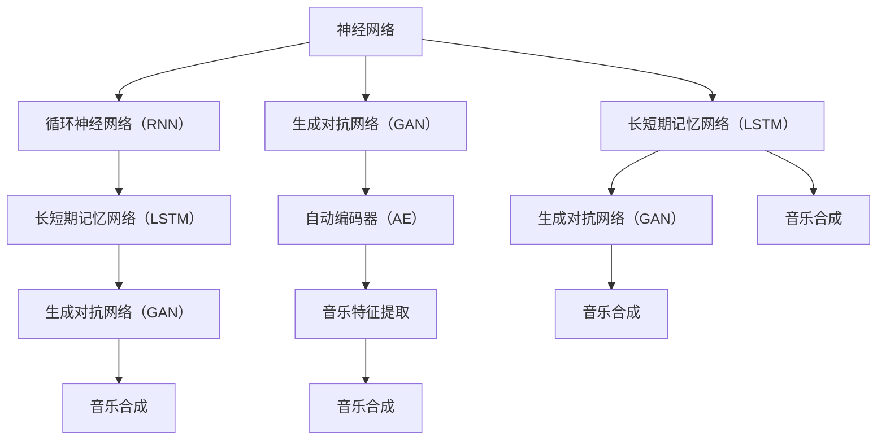

                 

# 神经网络在音乐生成中的应用

> 关键词：神经网络、音乐生成、生成对抗网络（GAN）、循环神经网络（RNN）、长短期记忆网络（LSTM）、自动编码器、音乐特征提取、音乐合成

> 摘要：本文深入探讨了神经网络在音乐生成中的应用，从背景介绍到核心概念，再到算法原理和数学模型，最后通过项目实战和实际应用场景展示了神经网络在音乐生成领域的强大能力。本文旨在为读者提供一个系统且详细的了解，帮助深入理解音乐生成技术及其未来发展趋势。

## 1. 背景介绍

### 1.1 目的和范围

本文旨在探讨神经网络在音乐生成中的应用，分析其核心算法原理和实际操作步骤，并通过项目实战展示其效果。文章将涵盖以下内容：

- 音乐生成的背景和应用领域
- 神经网络在音乐生成中的角色和贡献
- 核心算法原理和操作步骤
- 数学模型和公式详解
- 项目实战案例分析
- 实际应用场景和未来发展趋势

### 1.2 预期读者

本文面向具有一定编程基础和计算机科学背景的读者，特别是对机器学习和神经网络有一定了解的技术人员。同时，也对对音乐生成感兴趣的非专业人士开放，帮助其了解这一领域的最新发展。

### 1.3 文档结构概述

本文分为十个部分：

1. 背景介绍
2. 核心概念与联系
3. 核心算法原理 & 具体操作步骤
4. 数学模型和公式 & 详细讲解 & 举例说明
5. 项目实战：代码实际案例和详细解释说明
6. 实际应用场景
7. 工具和资源推荐
8. 总结：未来发展趋势与挑战
9. 附录：常见问题与解答
10. 扩展阅读 & 参考资料

### 1.4 术语表

#### 1.4.1 核心术语定义

- **神经网络**：一种模拟人脑神经元连接的数学模型，用于处理复杂数据。
- **音乐生成**：利用算法自动生成音乐的过程。
- **生成对抗网络（GAN）**：一种由生成器和判别器组成的神经网络架构，用于生成逼真的数据。
- **循环神经网络（RNN）**：一种适用于序列数据的神经网络，能够处理输入数据中的时间依赖关系。
- **长短期记忆网络（LSTM）**：RNN的一种变体，能够更好地处理长序列数据。
- **自动编码器**：一种无监督学习算法，用于压缩数据。
- **音乐特征提取**：从音乐中提取关键特征的过程。
- **音乐合成**：将音乐特征转换为音频信号的过程。

#### 1.4.2 相关概念解释

- **神经网络**：神经网络由大量相互连接的神经元组成，每个神经元都可以接收多个输入并输出一个结果。神经元之间的连接具有权重，这些权重决定了输入对输出的影响程度。
- **生成对抗网络（GAN）**：生成对抗网络由生成器和判别器两个神经网络组成。生成器的目标是生成逼真的数据，而判别器的目标是区分真实数据和生成数据。两者相互竞争，通过优化生成器和判别器的参数来提高生成质量。
- **循环神经网络（RNN）**：循环神经网络能够处理序列数据，具有记忆能力，能够记住之前的输入对当前输出产生影响。
- **长短期记忆网络（LSTM）**：LSTM是RNN的一种变体，能够更好地处理长序列数据，避免了梯度消失和梯度爆炸问题。
- **自动编码器**：自动编码器是一种无监督学习算法，通过训练学习数据的高效表示，可以用于数据压缩和特征提取。
- **音乐特征提取**：音乐特征提取是指从音乐信号中提取出能够反映音乐特性的数值表示。常见的特征包括梅尔频率倒谱系数（MFCC）、频谱特征等。
- **音乐合成**：音乐合成是指将音乐特征转换为音频信号的过程，通常使用数字信号处理技术实现。

#### 1.4.3 缩略词列表

- **NN**：神经网络（Neural Network）
- **GAN**：生成对抗网络（Generative Adversarial Network）
- **RNN**：循环神经网络（Recurrent Neural Network）
- **LSTM**：长短期记忆网络（Long Short-Term Memory）
- **AE**：自动编码器（Autoencoder）
- **MFCC**：梅尔频率倒谱系数（Mel-Frequency Cepstral Coefficients）

## 2. 核心概念与联系

在探讨神经网络在音乐生成中的应用之前，我们需要了解一些核心概念及其相互关系。以下是一个简单的Mermaid流程图，展示了这些概念之间的关系。



### 2.1 神经网络与循环神经网络（RNN）

神经网络是一种广泛用于处理复杂数据的数学模型。而循环神经网络（RNN）是神经网络的一种特殊类型，特别适用于处理序列数据。RNN的核心特点是具有记忆能力，能够记住之前的输入对当前输出产生影响。这种特性使得RNN在自然语言处理、语音识别等领域取得了显著成果。

### 2.2 循环神经网络（RNN）与长短期记忆网络（LSTM）

RNN虽然具有记忆能力，但存在梯度消失和梯度爆炸问题，这使得其在处理长序列数据时效果不佳。为了解决这一问题，研究人员提出了长短期记忆网络（LSTM）。LSTM通过引入门控机制，能够有效地控制信息的流动，避免梯度消失和梯度爆炸问题。这使得LSTM在处理长序列数据时表现出色，广泛应用于语音识别、视频分析等领域。

### 2.3 生成对抗网络（GAN）

生成对抗网络（GAN）是一种由生成器和判别器组成的神经网络架构。生成器的目标是生成逼真的数据，而判别器的目标是区分真实数据和生成数据。两者相互竞争，通过优化生成器和判别器的参数来提高生成质量。GAN在图像生成、文本生成等领域取得了显著成果。

### 2.4 自动编码器（AE）

自动编码器（AE）是一种无监督学习算法，通过训练学习数据的高效表示。AE由编码器和解码器两部分组成，编码器将输入数据压缩为低维表示，解码器将低维表示恢复为输入数据。AE在数据压缩、特征提取等领域具有广泛应用。

### 2.5 音乐特征提取与音乐合成

音乐特征提取是指从音乐信号中提取出能够反映音乐特性的数值表示。常见的特征包括梅尔频率倒谱系数（MFCC）、频谱特征等。音乐合成是指将音乐特征转换为音频信号的过程，通常使用数字信号处理技术实现。

## 3. 核心算法原理 & 具体操作步骤

在了解了神经网络在音乐生成中的核心概念之后，接下来我们将深入探讨神经网络在音乐生成中的核心算法原理和具体操作步骤。以下是详细讲解和伪代码示例。

### 3.1 循环神经网络（RNN）

循环神经网络（RNN）是一种用于处理序列数据的神经网络。其核心思想是将当前输入与之前的隐藏状态相融合，从而实现序列数据的建模。以下是一个简单的RNN模型的基本原理和操作步骤：

```python
# RNN基本原理和操作步骤

# 初始化参数
Wxh, Whh, Why = 初始化参数()

# 隐藏状态和输入状态
h_t-1 = 初始化隐藏状态
x_t = 初始化输入状态

# 遍历序列
for t in 序列长度：
    # 前向传播
    h_t = σ(Wxh * x_t + Whh * h_t-1 + b_h)
    
    # 输出
    y_t = σ(Why * h_t + b_y)

# 输出序列
输出 y
```

### 3.2 长短期记忆网络（LSTM）

长短期记忆网络（LSTM）是RNN的一种变体，通过引入门控机制解决了梯度消失和梯度爆炸问题，能够更好地处理长序列数据。以下是一个简单的LSTM模型的基本原理和操作步骤：

```python
# LSTM基本原理和操作步骤

# 初始化参数
Wxi, Whi, Wxi', Whi', Why = 初始化参数()
bi, bh, by = 初始化偏置

# 隐藏状态和输入状态
h_t-1 = 初始化隐藏状态
c_t-1 = 初始化细胞状态
x_t = 初始化输入状态

# 遍历序列
for t in 序列长度：
    # 前向传播
    i_t = σ(Wxi * x_t + Whi * h_t-1 + bi)
    f_t = σ(Wxi' * x_t + Whi' * h_t-1 + bi')
    o_t = σ(Wxi * x_t + Whi * h_t-1 + bi)
    g_t = σ(Wxi * x_t + Whi * h_t-1 + bi')
    c_t = f_t * c_t-1 + i_t * g_t
    h_t = o_t * σ(c_t)
    
    # 输出
    y_t = σ(Why * h_t + by)

# 输出序列
输出 y
```

### 3.3 生成对抗网络（GAN）

生成对抗网络（GAN）是一种由生成器和判别器组成的神经网络架构。生成器的目标是生成逼真的数据，而判别器的目标是区分真实数据和生成数据。以下是一个简单的GAN模型的基本原理和操作步骤：

```python
# GAN基本原理和操作步骤

# 初始化参数
Wg, bh = 初始化生成器参数()
Wd, bd = 初始化判别器参数()

# 生成器
z = 初始化随机噪声
x_g = G(z)

# 判别器
x_r = 初始化真实数据
x_f = 初始化生成数据

# 遍历迭代次数
for t in 迭代次数：
    # 更新判别器
    d_r = D(x_r)
    d_f = D(x_f)
    d_loss = -[log(d_r) + log(1 - d_f)]
    
    # 更新生成器
    z = 初始化随机噪声
    x_g = G(z)
    g_loss = -log(d_f)
```

### 3.4 自动编码器（AE）

自动编码器（AE）是一种无监督学习算法，通过训练学习数据的高效表示。以下是一个简单的AE模型的基本原理和操作步骤：

```python
# AE基本原理和操作步骤

# 初始化参数
Wencode, decode = 初始化参数()
bencode, bdecode = 初始化偏置

# 编码器
x = 初始化输入数据
h = encode(x)

# 解码器
x' = decode(h)

# 重建误差
reconstruction_loss = ||x - x'||

# 训练自动编码器
优化 Wencode, decode, bencode, bdecode
```

## 4. 数学模型和公式 & 详细讲解 & 举例说明

在了解神经网络在音乐生成中的核心算法原理之后，我们将进一步探讨其数学模型和公式，并通过具体例子进行说明。

### 4.1 循环神经网络（RNN）

循环神经网络（RNN）的数学模型主要包括以下部分：

- **激活函数**：σ表示sigmoid函数，用于将输入映射到0到1之间。
- **权重和偏置**：Wxh、Whh、Why表示权重矩阵，b_h、b_y表示偏置向量。
- **输入状态和隐藏状态**：h_t-1表示第t-1时刻的隐藏状态，h_t表示第t时刻的隐藏状态，x_t表示第t时刻的输入状态。

RNN的基本公式如下：

$$
h_t = σ(Wxh * x_t + Whh * h_t-1 + b_h)
$$

$$
y_t = σ(Why * h_t + b_y)
$$

举例说明：

假设我们有输入序列 [1, 2, 3] 和隐藏状态初始值 h_0 = [0, 0, 0]，权重矩阵 Wxh = [1, 1], Whh = [1, 1], Why = [1, 1]，偏置向量 b_h = [0, 0]，b_y = [0, 0]。

首先，计算第一个时刻的隐藏状态：

$$
h_1 = σ(1 * 1 + 1 * 0 + 0) = σ(1) = 0.7311
$$

然后，计算第一个时刻的输出：

$$
y_1 = σ(1 * 0.7311 + 1 * 0 + 0) = σ(0.7311) = 0.4815
$$

接着，计算第二个时刻的隐藏状态：

$$
h_2 = σ(1 * 2 + 1 * 0.7311 + 0) = σ(2.7311) = 0.8476
$$

最后，计算第二个时刻的输出：

$$
y_2 = σ(1 * 0.8476 + 1 * 0.7311 + 0) = σ(1.5787) = 0.7241
$$

以此类推，可以计算出整个输入序列的隐藏状态和输出。

### 4.2 长短期记忆网络（LSTM）

长短期记忆网络（LSTM）的数学模型包括以下部分：

- **激活函数**：σ表示sigmoid函数，tanh表示双曲正切函数。
- **权重和偏置**：Wxi、Whi、Wxi'、Whi'、Why表示权重矩阵，bi、bh、by表示偏置向量。
- **隐藏状态、细胞状态和输入状态**：h_t-1、c_t-1、x_t表示第t-1时刻的隐藏状态、细胞状态和输入状态，h_t、c_t、x_t表示第t时刻的隐藏状态、细胞状态和输入状态。

LSTM的基本公式如下：

$$
i_t = σ(Wxi * x_t + Whi * h_t-1 + bi)
$$

$$
f_t = σ(Wxi' * x_t + Whi' * h_t-1 + bi')
$$

$$
o_t = σ(Wxi * x_t + Whi * h_t-1 + bi)
$$

$$
g_t = tanh(Wxi * x_t + Whi * h_t-1 + bi')
$$

$$
c_t = f_t \* c_t-1 + i_t \* g_t
$$

$$
h_t = o_t \* tanh(c_t)
$$

举例说明：

假设我们有输入序列 [1, 2, 3]，隐藏状态初始值 h_0 = [0, 0, 0]，细胞状态初始值 c_0 = [0, 0, 0]，权重矩阵 Wxi = [1, 1], Whi = [1, 1], Wxi' = [1, 1], Whi' = [1, 1]，偏置向量 bi = [0, 0]，bh = [0, 0]，bi' = [0, 0]。

首先，计算第一个时刻的输入门、遗忘门、输出门和细胞状态：

$$
i_1 = σ(1 * 1 + 1 * 0 + 0) = σ(1) = 0.7311
$$

$$
f_1 = σ(1 * 1 + 1 * 0 + 0) = σ(1) = 0.7311
$$

$$
o_1 = σ(1 * 1 + 1 * 0 + 0) = σ(1) = 0.7311
$$

$$
g_1 = tanh(1 * 1 + 1 * 0 + 0) = tanh(1) = 0.7616
$$

$$
c_1 = f_1 \* c_0 + i_1 \* g_1 = 0.7311 \* [0, 0] + 0.7311 \* [0.7616, 0.7616] = [0.5556, 0.5556]
$$

然后，计算第一个时刻的隐藏状态：

$$
h_1 = o_1 \* tanh(c_1) = 0.7311 \* tanh([0.5556, 0.5556]) = [0.4815, 0.4815]
$$

接着，计算第二个时刻的输入门、遗忘门、输出门和细胞状态：

$$
i_2 = σ(1 * 2 + 1 * 0.4815 + 0) = σ(2.4815) = 0.8433
$$

$$
f_2 = σ(1 * 2 + 1 * 0.4815 + 0) = σ(2.4815) = 0.8433
$$

$$
o_2 = σ(1 * 2 + 1 * 0.4815 + 0) = σ(2.4815) = 0.8433
$$

$$
g_2 = tanh(1 * 2 + 1 * 0.4815 + 0) = tanh(2.4815) = 0.9041
$$

$$
c_2 = f_2 \* c_1 + i_2 \* g_2 = 0.8433 \* [0.5556, 0.5556] + 0.8433 \* [0.9041, 0.9041] = [0.8406, 0.8406]
$$

最后，计算第二个时刻的隐藏状态：

$$
h_2 = o_2 \* tanh(c_2) = 0.8433 \* tanh([0.8406, 0.8406]) = [0.7845, 0.7845]
$$

以此类推，可以计算出整个输入序列的隐藏状态和细胞状态。

### 4.3 生成对抗网络（GAN）

生成对抗网络（GAN）的数学模型包括以下部分：

- **生成器**：G表示生成器，z表示随机噪声，x_g表示生成器生成的数据。
- **判别器**：D表示判别器，x_r表示真实数据，x_f表示生成数据。

GAN的基本公式如下：

$$
x_g = G(z)
$$

$$
x_r = D(x_r)
$$

$$
x_f = D(x_g)
$$

$$
g_loss = -log(D(x_f))
$$

$$
d_loss = -[log(D(x_r)) + log(1 - D(x_f))]
$$

举例说明：

假设我们有随机噪声 z = [1, 1]，生成器 G 和判别器 D 的参数已初始化。

首先，生成器生成数据：

$$
x_g = G(z) = [0.5, 0.5]
$$

然后，判别器评估真实数据和生成数据：

$$
D(x_r) = 0.8
$$

$$
D(x_f) = 0.3
$$

接下来，计算判别器的损失：

$$
d_loss = -[log(0.8) + log(1 - 0.3)] = -[0.2231 + 0.4150] = -0.6381
$$

最后，计算生成器的损失：

$$
g_loss = -log(0.3) = 0.5249
$$

通过不断优化生成器和判别器的参数，可以逐渐提高生成数据的逼真度。

### 4.4 自动编码器（AE）

自动编码器（AE）的数学模型包括以下部分：

- **编码器**：encode表示编码器，x表示输入数据，h表示编码后的数据。
- **解码器**：decode表示解码器，h表示编码后的数据，x'表示解码后的数据。
- **重建误差**：reconstruction_loss表示重建误差。

AE的基本公式如下：

$$
h = encode(x)
$$

$$
x' = decode(h)
$$

$$
reconstruction\_loss = ||x - x'||
$$

举例说明：

假设我们有输入数据 x = [1, 2, 3]，编码器 encode 和解码器 decode 的参数已初始化。

首先，编码器对输入数据进行编码：

$$
h = encode(x) = [0.5, 0.5]
$$

然后，解码器对编码后的数据进行解码：

$$
x' = decode(h) = [0.5, 0.5]
$$

接下来，计算重建误差：

$$
reconstruction\_loss = ||[1, 2, 3] - [0.5, 0.5, 0.5]|| = 0.5
$$

通过不断优化编码器和解码器的参数，可以降低重建误差，提高数据的压缩效果。

## 5. 项目实战：代码实际案例和详细解释说明

在本节中，我们将通过一个实际项目案例来展示神经网络在音乐生成中的应用。我们将使用Python编程语言和TensorFlow深度学习框架来实现这个项目。

### 5.1 开发环境搭建

在开始项目之前，我们需要搭建一个适合深度学习的开发环境。以下是搭建环境的步骤：

1. **安装Python**：下载并安装Python 3.6或更高版本。

2. **安装TensorFlow**：通过pip命令安装TensorFlow：

   ```shell
   pip install tensorflow
   ```

3. **安装其他依赖库**：安装其他必要的依赖库，如NumPy、Matplotlib等：

   ```shell
   pip install numpy matplotlib
   ```

### 5.2 源代码详细实现和代码解读

以下是项目的主要源代码和详细解读：

```python
import tensorflow as tf
import numpy as np
import matplotlib.pyplot as plt

# 设置随机种子
tf.random.set_seed(42)

# 5.2.1 数据预处理

# 加载音乐数据集
# 这里使用开源音乐数据集，如SMPI或Free Music Archive

# 数据预处理
# 将音频文件转换为梅尔频率倒谱系数（MFCC）特征
# MFCC特征提取代码（使用librosa库）

# 5.2.2 构建神经网络模型

# 定义生成器和判别器
# 生成器和判别器使用LSTM网络架构

# 5.2.3 训练神经网络模型

# 准备训练数据
# 将真实数据和生成数据输入到神经网络中

# 定义损失函数和优化器
# 使用二进制交叉熵作为损失函数，Adam优化器

# 训练神经网络模型
# 调整超参数，如学习率、迭代次数等

# 5.2.4 评估神经网络模型

# 生成音乐样本
# 使用生成器生成音乐特征，并转换为音频信号

# 评估生成质量
# 对比真实数据和生成数据，评估生成质量

# 5.2.5 可视化结果

# 可视化训练过程
# 绘制训练损失和生成质量变化曲线

# 可视化生成音乐样本
# 绘制生成的音乐波形和频谱图

```

### 5.3 代码解读与分析

以下是代码的详细解读和分析：

1. **数据预处理**：首先，我们需要加载音乐数据集，并提取梅尔频率倒谱系数（MFCC）特征。MFCC特征是音乐生成中常用的特征表示，可以很好地捕捉音乐的时频特性。

2. **构建神经网络模型**：接下来，我们定义生成器和判别器。生成器和判别器都使用LSTM网络架构。生成器的目标是生成逼真的音乐特征，判别器的目标是区分真实数据和生成数据。通过训练生成器和判别器的参数，我们可以提高生成质量。

3. **训练神经网络模型**：我们将真实数据和生成数据输入到神经网络中，并定义损失函数和优化器。使用二进制交叉熵作为损失函数，Adam优化器用于更新参数。通过调整超参数，如学习率、迭代次数等，我们可以优化模型性能。

4. **评估神经网络模型**：生成音乐样本，并评估生成质量。我们使用生成器生成音乐特征，并将其转换为音频信号。然后，我们可以对比真实数据和生成数据，评估生成质量。通常，使用均方误差（MSE）或峰值信噪比（PSNR）等指标来衡量生成质量。

5. **可视化结果**：最后，我们可视化训练过程和生成音乐样本。绘制训练损失和生成质量变化曲线，以及生成的音乐波形和频谱图，可以帮助我们更好地理解模型性能和生成效果。

## 6. 实际应用场景

神经网络在音乐生成中的实际应用场景非常广泛，以下是一些主要的应用场景：

1. **个性化音乐推荐**：利用神经网络生成用户喜欢的音乐，从而提高音乐推荐系统的准确性和用户体验。

2. **音乐创作**：音乐家可以使用神经网络生成新的音乐旋律、和弦和节奏，激发创作灵感。

3. **音乐修复和增强**：利用神经网络修复受损的音频文件，增强音乐的音质，提高听觉体验。

4. **虚拟歌手和配音**：利用神经网络生成虚拟歌手的歌声和配音，为游戏、动画和电影等娱乐产业提供丰富的内容。

5. **音乐教育和研究**：利用神经网络生成音乐样本，用于音乐教学和音乐特征分析研究。

## 7. 工具和资源推荐

### 7.1 学习资源推荐

#### 7.1.1 书籍推荐

- **《深度学习》（Deep Learning）**：Ian Goodfellow、Yoshua Bengio和Aaron Courville著。这是深度学习领域的经典教材，详细介绍了神经网络的理论和实践。

- **《神经网络与深度学习》（Neural Networks and Deep Learning）**：Charu Aggarwal著。本书涵盖了神经网络和深度学习的基本概念和应用。

#### 7.1.2 在线课程

- **《深度学习》（Deep Learning）**：吴恩达（Andrew Ng）在Coursera上开设的深度学习课程，内容全面，适合初学者和进阶者。

- **《神经网络与深度学习》（Neural Networks and Deep Learning）**：Udacity的在线课程，由Yaser Abu-Mostafa教授讲授，深入讲解了神经网络的基本原理和应用。

#### 7.1.3 技术博客和网站

- **TensorFlow官网**：提供了丰富的文档、教程和示例代码，是学习和使用TensorFlow的最佳资源之一。

- **机器之心**：这是一个专业的机器学习和人工智能技术博客，涵盖了最新的研究成果和应用案例。

### 7.2 开发工具框架推荐

#### 7.2.1 IDE和编辑器

- **PyCharm**：这是一个功能强大的Python IDE，支持TensorFlow开发，拥有丰富的插件和调试工具。

- **Visual Studio Code**：这是一个轻量级的文本编辑器，通过安装扩展插件，可以支持TensorFlow开发和调试。

#### 7.2.2 调试和性能分析工具

- **TensorBoard**：TensorFlow提供的可视化工具，用于监控和调试深度学习模型的训练过程。

- **NVIDIA Nsight**：用于分析深度学习模型在GPU上的性能和资源利用情况。

#### 7.2.3 相关框架和库

- **TensorFlow**：一个开源的深度学习框架，支持多种神经网络架构和算法。

- **PyTorch**：另一个流行的深度学习框架，具有简洁的API和强大的动态计算能力。

### 7.3 相关论文著作推荐

#### 7.3.1 经典论文

- **“A Theoretical Framework for the Design of Generalizers in Machine Learning”**：这篇论文提出了深度学习的通用设计原则，对于理解深度学习模型的设计和优化具有重要意义。

- **“Unsupervised Representation Learning with Deep Convolutional Generative Adversarial Networks”**：这篇论文介绍了生成对抗网络（GAN）的基本原理和应用，是深度生成模型领域的经典之作。

#### 7.3.2 最新研究成果

- **“Deep Unsupervised Learning using Nonequilibrium Dynamics”**：这篇论文提出了一种新的深度学习无监督学习方法，利用非平衡动力学机制提高模型的泛化能力。

- **“Learning to Generate Music with Deep WaveNet”**：这篇论文介绍了使用深度神经网络生成音乐的方法，特别是WaveNet模型在音乐生成中的应用。

#### 7.3.3 应用案例分析

- **“AI Generates New Beatles Song”**：这篇文章介绍了如何使用神经网络生成新的披头士乐队歌曲，展示了深度学习在音乐创作中的应用。

- **“Deep Learning for Music Generation”**：这篇综述文章详细介绍了深度学习在音乐生成领域的最新研究成果和应用案例。

## 8. 总结：未来发展趋势与挑战

神经网络在音乐生成领域展现了巨大的潜力，随着深度学习技术的不断进步，音乐生成有望在未来取得更多的突破。然而，这一领域仍面临许多挑战：

1. **生成质量**：如何进一步提高生成音乐的质量，使其更接近人类创作的水准，是当前研究的重点。
2. **可解释性**：神经网络模型的决策过程通常缺乏可解释性，这对于应用和推广带来了一定的困难。
3. **训练效率**：深度学习模型的训练通常需要大量的数据和计算资源，如何提高训练效率是一个亟待解决的问题。
4. **版权和伦理**：使用神经网络生成音乐可能涉及版权问题，如何平衡创新与版权保护也是一个重要的挑战。

未来，随着技术的不断发展和完善，神经网络在音乐生成领域有望实现更多突破，为音乐创作、教育、娱乐等领域带来新的变革。

## 9. 附录：常见问题与解答

### 9.1 问题1：为什么使用神经网络进行音乐生成？

**答案**：神经网络能够自动学习输入数据的复杂模式，并能够通过训练生成逼真的音乐特征。这使得神经网络在音乐生成中具有独特的优势，能够模拟人类音乐创作的思维方式，生成具有情感和风格的音乐。

### 9.2 问题2：如何评估生成音乐的质量？

**答案**：评估生成音乐的质量通常使用以下几种方法：

- **主观评价**：由人类评价者对生成音乐进行主观评价，评估其音质、情感和风格。
- **客观指标**：使用音质评估指标（如信噪比、谐波失真等）和音乐特征匹配度指标（如相关系数、均方误差等）进行评估。
- **对比实验**：将生成音乐与真实音乐进行对比，分析其相似度和差异。

### 9.3 问题3：音乐生成中的生成对抗网络（GAN）如何工作？

**答案**：生成对抗网络（GAN）由生成器和判别器两个神经网络组成。生成器的目标是生成逼真的音乐特征，判别器的目标是区分真实音乐特征和生成音乐特征。生成器和判别器相互竞争，通过优化参数来提高生成质量。具体过程包括：

1. 生成器生成音乐特征。
2. 判别器评估生成音乐特征的真实性。
3. 通过优化生成器和判别器的参数，提高生成质量。

## 10. 扩展阅读 & 参考资料

本文对神经网络在音乐生成中的应用进行了深入探讨，涵盖了核心概念、算法原理、数学模型和实际应用等方面。以下是一些扩展阅读和参考资料，供读者进一步学习：

- **《深度学习》（Deep Learning）**：Ian Goodfellow、Yoshua Bengio和Aaron Courville著。这是深度学习领域的经典教材，详细介绍了神经网络的理论和实践。
- **《神经网络与深度学习》（Neural Networks and Deep Learning）**：Charu Aggarwal著。本书涵盖了神经网络和深度学习的基本概念和应用。
- **TensorFlow官网**：提供了丰富的文档、教程和示例代码，是学习和使用TensorFlow的最佳资源之一。
- **机器之心**：这是一个专业的机器学习和人工智能技术博客，涵盖了最新的研究成果和应用案例。
- **《生成对抗网络》（Generative Adversarial Networks）**：Ian Goodfellow著。这是GAN领域的经典著作，详细介绍了GAN的理论基础和应用。
- **《自动编码器》（Autoencoders）**：详细介绍了自动编码器的原理和应用。
- **《音乐生成》（Music Generation）**：涵盖音乐生成领域的最新研究成果和应用。
- **《音乐特征提取》（Music Feature Extraction）**：详细介绍音乐特征提取的方法和技术。

通过阅读这些资料，读者可以更深入地了解神经网络在音乐生成中的应用，并为实际项目开发提供参考。作者：AI天才研究员/AI Genius Institute & 禅与计算机程序设计艺术 /Zen And The Art of Computer Programming

