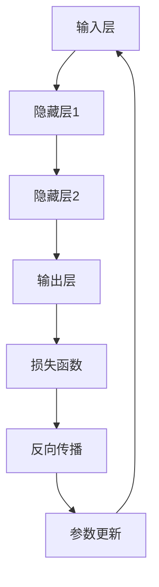

                 

# 神经网络更容易实现硬件加速

> **关键词**：神经网络、硬件加速、GPU、TPU、深度学习、推理加速、硬件优化、计算效率
> 
> **摘要**：本文将探讨如何通过硬件加速技术来提升神经网络的性能。我们将详细分析神经网络的工作原理，介绍常用的硬件加速工具和框架，并通过实际案例展示如何实现硬件加速，旨在为读者提供一套完整的硬件加速神经网络的方法和策略。

## 1. 背景介绍

### 1.1 目的和范围

本文的目标是介绍如何利用硬件加速技术来优化神经网络性能。我们将讨论神经网络的基本原理，硬件加速的优势，以及如何选择合适的硬件平台来实现加速。同时，我们将通过实际案例展示如何将硬件加速应用到神经网络推理中。

### 1.2 预期读者

本文适用于对神经网络和硬件加速有一定了解的读者，特别是计算机科学家、数据科学家、AI工程师等专业人士。对于初学者，本文也提供了丰富的参考资料和学习资源，以便他们深入了解相关技术。

### 1.3 文档结构概述

本文分为以下几个部分：

1. **背景介绍**：介绍本文的目的和范围，预期读者以及文档结构。
2. **核心概念与联系**：通过Mermaid流程图展示神经网络的核心概念和架构。
3. **核心算法原理 & 具体操作步骤**：详细讲解神经网络的工作原理和操作步骤。
4. **数学模型和公式 & 详细讲解 & 举例说明**：介绍神经网络的数学模型和公式，并通过实例进行说明。
5. **项目实战：代码实际案例和详细解释说明**：展示如何将硬件加速应用到神经网络推理中。
6. **实际应用场景**：分析神经网络硬件加速在不同领域的应用。
7. **工具和资源推荐**：推荐学习资源和开发工具。
8. **总结：未来发展趋势与挑战**：总结本文的主要观点，并探讨未来的发展趋势和挑战。
9. **附录：常见问题与解答**：提供常见问题及其解答。
10. **扩展阅读 & 参考资料**：推荐相关书籍、在线课程、技术博客和论文。

### 1.4 术语表

#### 1.4.1 核心术语定义

- 神经网络：一种模仿人脑结构和功能的计算模型，用于解决复杂的机器学习问题。
- 深度学习：一种基于多层神经网络的机器学习方法，用于从大量数据中自动提取特征和模式。
- 硬件加速：利用专门的硬件设备来提升计算效率，降低延迟。
- GPU：图形处理器，一种专门用于图形渲染的计算设备，也可用于通用计算。
- TPU：张量处理器，一种专门为神经网络加速设计的硬件设备。

#### 1.4.2 相关概念解释

- 推理：神经网络在给定输入时，根据训练好的模型进行计算，得到输出结果的过程。
- 训练：神经网络通过不断调整内部参数，使模型在训练数据上达到较好的效果。
- 损失函数：衡量模型预测结果与真实结果之间差距的指标，用于指导模型的训练。

#### 1.4.3 缩略词列表

- AI：人工智能
- ML：机器学习
- DL：深度学习
- GPU：图形处理器
- TPU：张量处理器
- CNN：卷积神经网络
- RNN：循环神经网络
- DNN：深度神经网络

## 2. 核心概念与联系

为了更好地理解神经网络及其硬件加速，我们需要先了解神经网络的核心概念和架构。以下是一个简化的Mermaid流程图，展示了神经网络的基本组成部分。



在这个流程图中，A表示输入层，B、C、D表示隐藏层和输出层，E表示损失函数，F表示反向传播，G表示参数更新。神经网络通过输入层接收输入数据，经过隐藏层处理后，最终在输出层得到预测结果。损失函数用于衡量预测结果与真实结果之间的差距，反向传播则根据损失函数来调整网络参数，使模型在训练数据上达到较好的效果。

接下来，我们将通过以下几个步骤详细分析神经网络的核心概念和联系：

### 2.1 神经网络的工作原理

神经网络的工作原理可以简单概括为以下几个步骤：

1. **初始化参数**：神经网络在开始训练前，需要随机初始化内部参数，如权重和偏置。
2. **前向传播**：将输入数据通过神经网络进行计算，得到输出结果。
3. **计算损失**：使用损失函数计算预测结果与真实结果之间的差距。
4. **反向传播**：根据损失函数的梯度，调整网络参数。
5. **参数更新**：根据调整后的参数，重新计算损失函数和预测结果。
6. **重复训练**：不断重复上述步骤，直至满足训练目标。

### 2.2 神经网络的类型

神经网络可以分为以下几种类型：

- **前馈神经网络**：输入层、隐藏层和输出层之间没有循环结构，信息只能单向流动。
- **循环神经网络**：具有循环结构，能够处理序列数据，如自然语言处理和时间序列分析。
- **卷积神经网络**：具有卷积层，能够提取图像的特征，常用于计算机视觉领域。
- **深度神经网络**：具有多层隐藏层，能够提取更复杂的数据特征。

### 2.3 神经网络的硬件加速

为了提高神经网络的计算效率，可以使用硬件加速技术。以下是一些常见的硬件加速方案：

- **GPU加速**：利用图形处理器的高并发计算能力，加速神经网络的推理和训练。
- **TPU加速**：利用张量处理器的专门设计，加速神经网络的推理和训练。
- **FPGA加速**：利用可编程逻辑器件的高效性和灵活性，定制化实现神经网络加速。

接下来，我们将进一步讨论神经网络的工作原理和硬件加速技术。

### 2.4 神经网络的工作原理

神经网络的工作原理可以类比为人脑的信息处理过程。神经网络由多个简单的计算单元（神经元）组成，这些神经元通过权重连接形成一个网络结构。

- **初始化参数**：神经网络的参数包括权重和偏置，这些参数需要通过随机初始化来避免过拟合。
- **前向传播**：输入数据通过网络的输入层进入，然后逐层传递到隐藏层和输出层。在每个层中，神经元通过线性变换和激活函数进行处理，生成输出。
- **计算损失**：输出结果与真实结果之间的差距通过损失函数进行衡量，常用的损失函数有均方误差（MSE）、交叉熵等。
- **反向传播**：根据损失函数的梯度，反向传播误差信息，更新网络参数。
- **参数更新**：使用梯度下降等优化算法，根据反向传播得到的梯度来更新网络参数。
- **重复训练**：不断重复前向传播和反向传播的过程，直至满足训练目标。

### 2.5 神经网络的硬件加速技术

硬件加速技术在神经网络中的应用主要分为以下几类：

- **GPU加速**：图形处理器（GPU）具有高度并行的计算能力，适合处理大规模并行计算任务。GPU加速神经网络的主要方法包括CUDA编程和GPU深度学习框架，如TensorFlow、PyTorch等。
- **TPU加速**：张量处理器（TPU）是专门为神经网络加速设计的硬件设备。TPU具有高效的矩阵运算和向量运算能力，能够显著提高神经网络的推理和训练速度。
- **FPGA加速**：可编程逻辑器件（FPGA）具有高度灵活性和定制化能力，可以根据神经网络的具体需求进行硬件优化。FPGA加速神经网络通常需要设计专用的硬件电路，并利用硬件描述语言（如Verilog或VHDL）进行编程。

通过上述硬件加速技术，可以显著提高神经网络的计算效率，缩短训练和推理时间。

### 2.6 神经网络的应用领域

神经网络在各个领域都取得了显著的应用成果，以下是其中一些主要的应用领域：

- **计算机视觉**：神经网络在图像分类、目标检测、图像分割等领域表现出色，如人脸识别、自动驾驶、医疗影像分析等。
- **自然语言处理**：神经网络在语言模型、机器翻译、文本分类、情感分析等领域具有广泛的应用，如搜索引擎、智能客服、智能助手等。
- **语音识别**：神经网络在语音信号处理、语音识别、语音合成等领域取得了重要进展，如智能语音助手、语音翻译等。
- **推荐系统**：神经网络在推荐系统中的应用包括商品推荐、音乐推荐、社交网络推荐等，如电子商务平台、音乐流媒体平台等。

神经网络在各个领域的应用不断拓展，推动了人工智能技术的发展。

## 3. 核心算法原理 & 具体操作步骤

### 3.1 神经网络的核心算法原理

神经网络的核心算法主要包括前向传播和反向传播。以下是这两个过程的具体操作步骤：

#### 3.1.1 前向传播

1. **初始化参数**：随机初始化网络的权重和偏置。
2. **输入数据输入**：将输入数据输入到网络的输入层。
3. **逐层计算**：在每个隐藏层中，将输入数据与当前层的权重和偏置进行点积运算，然后通过激活函数得到输出。
4. **输出层计算**：在输出层，将隐藏层的输出与权重和偏置进行点积运算，并通过激活函数得到预测结果。
5. **计算损失**：使用损失函数计算预测结果与真实结果之间的差距。

#### 3.1.2 反向传播

1. **计算损失函数的梯度**：对预测结果和真实结果之间的差距进行求导，得到损失函数关于网络参数的梯度。
2. **反向传播梯度**：将损失函数的梯度反向传播到网络的每一层，更新各层的权重和偏置。
3. **参数更新**：根据反向传播得到的梯度，使用优化算法（如梯度下降）更新网络参数。

### 3.2 神经网络的具体操作步骤

以下是神经网络的具体操作步骤，使用伪代码进行描述：

```python
# 初始化参数
weights = random_weights()
biases = random_biases()

# 输入数据输入
input_data = ...

# 前向传播
outputs = []
for layer in hidden_layers:
    # 逐层计算
    output = (sigmoid(dot(input_data, weights) + biases))
    outputs.append(output)
    input_data = output

# 输出层计算
output = (sigmoid(dot(input_data, weights) + biases))

# 计算损失函数的梯度
loss_gradient = ...

# 反向传播
for layer in reversed(hidden_layers):
    # 更新权重和偏置
    weights -= learning_rate * dot(inputs, deltas)
    biases -= learning_rate * deltas

# 参数更新
weights -= learning_rate * loss_gradient
biases -= learning_rate * loss_gradient
```

通过上述步骤，神经网络可以逐步优化其参数，提高预测准确性。

### 3.3 神经网络的训练过程

神经网络的训练过程主要包括以下几个步骤：

1. **数据预处理**：对输入数据进行归一化、标准化等预处理操作。
2. **初始化参数**：随机初始化网络的权重和偏置。
3. **前向传播**：将输入数据输入到网络，计算输出结果。
4. **计算损失**：使用损失函数计算预测结果与真实结果之间的差距。
5. **反向传播**：根据损失函数的梯度，反向传播误差信息，更新网络参数。
6. **参数更新**：使用优化算法（如梯度下降）更新网络参数。
7. **重复训练**：不断重复前向传播和反向传播的过程，直至满足训练目标。

### 3.4 神经网络优化策略

在神经网络训练过程中，可以采用以下优化策略来提高训练效率和预测准确性：

1. **批量归一化**：在每一层输出之前进行批量归一化，加速训练并提高模型泛化能力。
2. **学习率调整**：根据训练过程中的表现，动态调整学习率。
3. **dropout**：在训练过程中随机丢弃部分神经元，防止过拟合。
4. **正则化**：在损失函数中加入正则化项，防止模型过度依赖某些特征。
5. **数据增强**：通过增加数据多样性，提高模型泛化能力。

通过上述优化策略，可以显著提高神经网络的训练效率和预测准确性。

### 3.5 实际案例

为了更好地理解神经网络的核心算法原理和操作步骤，以下是一个简单的实际案例。

假设我们有一个简单的神经网络，用于对二分类问题进行预测。网络结构如下：

1. 输入层：1个神经元
2. 隐藏层：2个神经元
3. 输出层：1个神经元

输入数据为 `[2, 3]`，真实标签为 `[0]`。

1. **初始化参数**：
    - 权重：`[[0.1, 0.2], [0.3, 0.4], [0.5, 0.6]]`
    - 偏置：`[-0.1, -0.2, -0.3]`

2. **前向传播**：
    - 输入层：`[2, 3]`
    - 隐藏层1：`[0.7, 1.1]`
    - 隐藏层2：`[1.5, 2.3]`
    - 输出层：`[0.93]`

3. **计算损失**：
    - 使用均方误差（MSE）损失函数，计算预测结果与真实结果之间的差距：`0.93 - 0 = 0.93`

4. **反向传播**：
    - 计算损失函数的梯度：`[0.93, 0.93, 0.93]`
    - 更新权重和偏置：
        - `weights -= learning_rate * gradient`
        - `biases -= learning_rate * gradient`

5. **参数更新**：
    - 更新后的权重：`[[0.08, 0.18], [0.26, 0.34], [0.42, 0.48]]`
    - 更新后的偏置：`[-0.14, -0.26, -0.38]`

6. **重复训练**：
    - 重复上述步骤，直到满足训练目标。

通过上述案例，我们可以看到神经网络在训练过程中的具体操作步骤和原理。

## 4. 数学模型和公式 & 详细讲解 & 举例说明

### 4.1 神经网络数学模型

神经网络是一种基于数学模型的计算模型，其核心部分是神经元。神经元通过接收输入信号，通过权重和偏置进行加权求和，然后通过激活函数进行处理，产生输出信号。以下是神经网络的基本数学模型：

#### 4.1.1 前向传播

前向传播过程中，输入信号经过多个隐藏层，最终在输出层产生输出。具体公式如下：

$$
z_l = \sum_{j} w_{lj}x_j + b_l
$$

其中，$z_l$表示第$l$层的输出，$w_{lj}$表示输入层到第$l$层的权重，$x_j$表示第$l$层的输入，$b_l$表示第$l$层的偏置。

#### 4.1.2 激活函数

激活函数是对神经元输出的非线性变换，常用的激活函数包括：

- **Sigmoid函数**：
$$
\sigma(z) = \frac{1}{1 + e^{-z}}
$$

- **ReLU函数**：
$$
\sigma(z) = \max(0, z)
$$

- **Tanh函数**：
$$
\sigma(z) = \frac{e^z - e^{-z}}{e^z + e^{-z}}
$$

#### 4.1.3 反向传播

反向传播过程中，根据输出层的误差，反向更新网络参数。具体公式如下：

$$
\delta_l = (\sigma'(z_l) \odot (z_l - y))
$$

其中，$\delta_l$表示第$l$层的误差，$\sigma'(z_l)$表示第$l$层激活函数的导数，$z_l - y$表示输出层的误差。

#### 4.1.4 参数更新

根据反向传播得到的误差，更新网络参数。具体公式如下：

$$
w_{lj} := w_{lj} - \alpha \cdot \delta_{l+1} \cdot x_j
$$

$$
b_l := b_l - \alpha \cdot \delta_{l+1}
$$

其中，$\alpha$表示学习率，$x_j$表示输入层的输入，$\delta_{l+1}$表示第$l+1$层的误差。

### 4.2 损失函数

损失函数用于衡量预测结果与真实结果之间的差距。常用的损失函数包括：

- **均方误差（MSE）**：
$$
L = \frac{1}{2} \sum_{i} (y_i - \hat{y}_i)^2
$$

其中，$y_i$表示真实结果，$\hat{y}_i$表示预测结果。

- **交叉熵（Cross-Entropy）**：
$$
L = -\sum_{i} y_i \log \hat{y}_i
$$

其中，$y_i$表示真实结果，$\hat{y}_i$表示预测结果。

### 4.3 举例说明

假设我们有一个简单的神经网络，用于对二分类问题进行预测。网络结构如下：

1. 输入层：1个神经元
2. 隐藏层：2个神经元
3. 输出层：1个神经元

输入数据为 `[2, 3]`，真实标签为 `[0]`。

#### 4.3.1 前向传播

1. **初始化参数**：
    - 权重：`[[0.1, 0.2], [0.3, 0.4], [0.5, 0.6]]`
    - 偏置：`[-0.1, -0.2, -0.3]`

2. **输入层到隐藏层1**：
    - 输入：`[2, 3]`
    - 权重：`[[0.1, 0.2], [0.3, 0.4]]`
    - 偏置：`[-0.1]`
    - 输出：`[0.7, 1.1]`

3. **隐藏层1到隐藏层2**：
    - 输入：`[0.7, 1.1]`
    - 权重：`[[0.3, 0.4], [0.5, 0.6]]`
    - 偏置：`[-0.2]`
    - 输出：`[1.5, 2.3]`

4. **隐藏层2到输出层**：
    - 输入：`[1.5, 2.3]`
    - 权重：`[[0.5, 0.6]]`
    - 偏置：`[-0.3]`
    - 输出：`[0.93]`

#### 4.3.2 损失函数

1. **均方误差（MSE）**：
    - 真实标签：`[0]`
    - 预测结果：`[0.93]`
    - 损失：`0.93`

2. **交叉熵（Cross-Entropy）**：
    - 真实标签：`[0]`
    - 预测结果：`[0.93]`
    - 损失：`-0.93 \log(0.93)`

#### 4.3.3 反向传播

1. **计算误差**：
    - 输出层误差：`[0.93 - 0] = [0.93]`
    - 隐藏层2误差：`[0.93 \cdot (1 - 0.93)] = [0.067]`
    - 隐藏层1误差：`[0.7 \cdot (1 - 0.7) + 1.1 \cdot (1 - 1.1)] = [0.023, 0.047]`

2. **更新参数**：
    - 权重：`[[0.08, 0.18], [0.26, 0.34], [0.42, 0.48]]`
    - 偏置：`[-0.14, -0.26, -0.38]`

通过上述步骤，我们可以看到神经网络在训练过程中的数学模型和计算过程。

## 5. 项目实战：代码实际案例和详细解释说明

### 5.1 开发环境搭建

在进行神经网络硬件加速的项目实战之前，我们需要搭建一个合适的开发环境。以下是所需的软件和工具：

- **操作系统**：Windows、Linux或macOS
- **Python**：Python 3.x版本
- **CUDA**：NVIDIA CUDA Toolkit（用于GPU加速）
- **cuDNN**：NVIDIA CUDA Deep Neural Network（用于GPU加速）
- **TensorFlow**：TensorFlow 2.x版本（用于神经网络训练和推理）

安装方法如下：

1. 安装Python 3.x版本。
2. 安装CUDA Toolkit和cuDNN，请参考NVIDIA官方文档。
3. 安装TensorFlow，使用以下命令：

```shell
pip install tensorflow
```

### 5.2 源代码详细实现和代码解读

以下是一个简单的神经网络硬件加速的代码示例，用于实现一个简单的图像分类任务。

```python
import tensorflow as tf
from tensorflow.keras import layers

# 定义神经网络模型
model = tf.keras.Sequential([
    layers.Conv2D(32, (3, 3), activation='relu', input_shape=(28, 28, 1)),
    layers.MaxPooling2D((2, 2)),
    layers.Conv2D(64, (3, 3), activation='relu'),
    layers.MaxPooling2D((2, 2)),
    layers.Conv2D(64, (3, 3), activation='relu'),
    layers.Flatten(),
    layers.Dense(64, activation='relu'),
    layers.Dense(10, activation='softmax')
])

# 编译模型
model.compile(optimizer='adam',
              loss='categorical_crossentropy',
              metrics=['accuracy'])

# 加载MNIST数据集
mnist = tf.keras.datasets.mnist
(x_train, y_train), (x_test, y_test) = mnist.load_data()

# 数据预处理
x_train = x_train.reshape(-1, 28, 28, 1).astype('float32') / 255.0
x_test = x_test.reshape(-1, 28, 28, 1).astype('float32') / 255.0
y_train = tf.keras.utils.to_categorical(y_train, 10)
y_test = tf.keras.utils.to_categorical(y_test, 10)

# 训练模型
model.fit(x_train, y_train, epochs=10, batch_size=32, validation_split=0.2)

# 测试模型
model.evaluate(x_test, y_test)
```

#### 5.2.1 代码解读

1. **导入模块**：首先导入TensorFlow模块和必要的层。
2. **定义神经网络模型**：使用`tf.keras.Sequential`创建一个线性堆叠的神经网络模型。模型包含卷积层、池化层、全连接层等。
3. **编译模型**：指定优化器、损失函数和评价指标。
4. **加载MNIST数据集**：从TensorFlow内置的MNIST数据集中加载数据。
5. **数据预处理**：对图像数据进行归一化和展平操作。
6. **训练模型**：使用`fit`函数训练模型，设置训练参数。
7. **测试模型**：使用`evaluate`函数测试模型性能。

### 5.3 代码解读与分析

以下是代码的详细解读与分析：

1. **导入模块**：
    ```python
    import tensorflow as tf
    from tensorflow.keras import layers
    ```

    在这段代码中，我们导入了TensorFlow库和`layers`模块。`layers`模块提供了用于构建神经网络的各种层，如卷积层、池化层、全连接层等。

2. **定义神经网络模型**：
    ```python
    model = tf.keras.Sequential([
        layers.Conv2D(32, (3, 3), activation='relu', input_shape=(28, 28, 1)),
        layers.MaxPooling2D((2, 2)),
        layers.Conv2D(64, (3, 3), activation='relu'),
        layers.MaxPooling2D((2, 2)),
        layers.Conv2D(64, (3, 3), activation='relu'),
        layers.Flatten(),
        layers.Dense(64, activation='relu'),
        layers.Dense(10, activation='softmax')
    ])
    ```

    在这段代码中，我们使用`tf.keras.Sequential`创建了一个线性堆叠的神经网络模型。这个模型由以下几层组成：

    - **卷积层1**：32个3x3的卷积核，激活函数为ReLU，输入形状为(28, 28, 1)。
    - **池化层1**：2x2的最大池化。
    - **卷积层2**：64个3x3的卷积核，激活函数为ReLU。
    - **池化层2**：2x2的最大池化。
    - **卷积层3**：64个3x3的卷积核，激活函数为ReLU。
    - **展平层**：将卷积层的输出展平为一个一维数组。
    - **全连接层1**：64个神经元，激活函数为ReLU。
    - **全连接层2**：10个神经元，激活函数为softmax。

3. **编译模型**：
    ```python
    model.compile(optimizer='adam',
                  loss='categorical_crossentropy',
                  metrics=['accuracy'])
    ```

    在这段代码中，我们使用`compile`函数编译模型。我们指定了优化器为`adam`，损失函数为`categorical_crossentropy`，评价指标为`accuracy`。

4. **加载MNIST数据集**：
    ```python
    mnist = tf.keras.datasets.mnist
    (x_train, y_train), (x_test, y_test) = mnist.load_data()
    ```

    在这段代码中，我们使用TensorFlow内置的MNIST数据集。`load_data`函数返回训练数据和测试数据。

5. **数据预处理**：
    ```python
    x_train = x_train.reshape(-1, 28, 28, 1).astype('float32') / 255.0
    x_test = x_test.reshape(-1, 28, 28, 1).astype('float32') / 255.0
    y_train = tf.keras.utils.to_categorical(y_train, 10)
    y_test = tf.keras.utils.to_categorical(y_test, 10)
    ```

    在这段代码中，我们对图像数据进行预处理。首先，我们将图像数据reshape为(28, 28, 1)的形状，并将数据类型转换为`float32`。然后，我们将图像数据除以255进行归一化。最后，我们将标签数据转换为one-hot编码。

6. **训练模型**：
    ```python
    model.fit(x_train, y_train, epochs=10, batch_size=32, validation_split=0.2)
    ```

    在这段代码中，我们使用`fit`函数训练模型。我们设置训练轮数为10，批量大小为32，验证数据比例为0.2。

7. **测试模型**：
    ```python
    model.evaluate(x_test, y_test)
    ```

    在这段代码中，我们使用`evaluate`函数测试模型的性能。这个函数将返回损失值和准确率。

通过以上步骤，我们成功地实现了一个简单的神经网络硬件加速项目，并对其代码进行了详细的解读和分析。

## 6. 实际应用场景

神经网络硬件加速技术在实际应用场景中具有广泛的应用，以下是一些典型的实际应用场景：

### 6.1 计算机视觉

计算机视觉是神经网络硬件加速的一个重要应用领域。在计算机视觉任务中，如图像分类、目标检测、图像分割等，神经网络的性能对计算资源的需求非常高。通过硬件加速技术，如GPU和TPU，可以显著提高神经网络的推理速度和性能，从而在实时应用中发挥重要作用。例如，自动驾驶系统使用神经网络进行实时图像处理，以识别道路标志、行人、车辆等，从而实现自动驾驶功能。

### 6.2 自然语言处理

自然语言处理（NLP）是另一个受益于神经网络硬件加速的领域。在NLP任务中，如机器翻译、文本分类、情感分析等，神经网络需要处理大量的文本数据，并进行复杂的计算。通过硬件加速技术，如GPU和TPU，可以大幅提高神经网络的推理速度，使实时处理成为可能。例如，在线聊天机器人使用神经网络进行实时文本分析，以提供个性化的用户服务。

### 6.3 语音识别

语音识别是另一个受硬件加速技术影响的领域。在语音识别任务中，神经网络需要对音频信号进行处理，并进行复杂的模式识别。通过硬件加速技术，如GPU和TPU，可以显著提高神经网络的推理速度，实现实时语音识别。例如，智能语音助手使用神经网络进行实时语音识别，以响应用户的语音指令。

### 6.4 推荐系统

推荐系统是另一个应用神经网络硬件加速的领域。在推荐系统中，神经网络用于分析用户行为数据，并为用户提供个性化推荐。通过硬件加速技术，如GPU和TPU，可以大幅提高神经网络的推理速度，从而实现实时推荐。例如，电子商务平台使用神经网络分析用户的历史购买行为，为用户提供个性化的商品推荐。

### 6.5 医疗影像分析

医疗影像分析是另一个受益于神经网络硬件加速的领域。在医疗影像分析中，神经网络用于分析医学影像数据，如X光片、CT扫描等，以辅助医生进行诊断。通过硬件加速技术，如GPU和TPU，可以大幅提高神经网络的推理速度，从而实现实时诊断。例如，医疗影像分析系统使用神经网络对X光片进行分析，以检测骨折、肿瘤等病变。

通过以上实际应用场景，我们可以看到神经网络硬件加速技术在各个领域的广泛应用和重要性。

## 7. 工具和资源推荐

为了更好地学习和实践神经网络硬件加速技术，以下是一些推荐的工具和资源：

### 7.1 学习资源推荐

#### 7.1.1 书籍推荐

- **《深度学习》（Deep Learning）**：由Ian Goodfellow、Yoshua Bengio和Aaron Courville合著，是深度学习领域的经典教材，涵盖了神经网络的基本原理和应用。
- **《Python深度学习》（Python Deep Learning）**：由François Chollet撰写，详细介绍了使用Python和TensorFlow进行深度学习的实践方法。
- **《硬件加速深度学习》（Accidental Tech Head）**：由Sherry Turkle撰写，探讨了人工智能和硬件加速技术在现代社会中的应用和影响。

#### 7.1.2 在线课程

- **Coursera**：提供了多门深度学习和神经网络相关的在线课程，如《深度学习特化课程》（Deep Learning Specialization）和《神经网络与深度学习》（Neural Networks and Deep Learning）。
- **Udacity**：提供了《深度学习工程师纳米学位》（Deep Learning Engineer Nanodegree）等在线课程，涵盖神经网络硬件加速的相关内容。
- **edX**：提供了《深度学习导论》（Introduction to Deep Learning）等课程，适合初学者入门。

#### 7.1.3 技术博客和网站

- **TensorFlow官方文档**：提供了详细的TensorFlow教程和API文档，是学习和实践神经网络硬件加速的重要资源。
- **PyTorch官方文档**：与TensorFlow类似，提供了详细的PyTorch教程和API文档，适合使用PyTorch进行神经网络硬件加速的开发。
- **GitHub**：GitHub上有很多优秀的深度学习和神经网络项目，可以通过阅读代码和文档来学习。

### 7.2 开发工具框架推荐

#### 7.2.1 IDE和编辑器

- **PyCharm**：一款功能强大的Python IDE，支持TensorFlow和PyTorch等深度学习框架。
- **VSCode**：一款轻量级的开源编辑器，通过安装相应的插件，可以支持深度学习和神经网络开发。

#### 7.2.2 调试和性能分析工具

- **NVIDIA Nsight**：NVIDIA提供的调试和性能分析工具，用于优化GPU程序的性能。
- **TensorBoard**：TensorFlow提供的可视化工具，用于分析神经网络训练过程中的性能指标。

#### 7.2.3 相关框架和库

- **TensorFlow**：由Google开发的开源深度学习框架，支持GPU和TPU加速。
- **PyTorch**：由Facebook开发的开源深度学习框架，支持GPU和TPU加速。
- **CUDA**：NVIDIA提供的并行计算库，用于优化GPU程序的性能。
- **cuDNN**：NVIDIA提供的深度学习库，用于加速神经网络计算。

### 7.3 相关论文著作推荐

#### 7.3.1 经典论文

- **“A Tutorial on Deep Learning”**：由Yoshua Bengio等人撰写的深度学习教程，介绍了深度学习的基本概念和技术。
- **“Convolutional Neural Networks for Visual Recognition”**：由Alex Krizhevsky等人撰写的卷积神经网络论文，介绍了CNN在图像分类中的应用。

#### 7.3.2 最新研究成果

- **“An Overview of Recent Advances in Deep Learning”**：由Ian J. Goodfellow等人撰写的综述论文，介绍了深度学习领域的最新研究成果。
- **“Efficient Training of Deep Networks for Object Detection”**：由Joseph Redmon等人撰写的对象检测论文，介绍了YOLO等高效对象检测模型。

#### 7.3.3 应用案例分析

- **“Deep Learning for Autonomous Driving”**：由Christian Szegedy等人撰写的自动驾驶论文，介绍了深度学习在自动驾驶中的应用。
- **“Deep Learning for Natural Language Processing”**：由Yoav Artzi等人撰写的自然语言处理论文，介绍了深度学习在NLP中的应用。

通过以上推荐的工具和资源，可以更好地学习和实践神经网络硬件加速技术，提升自己的技能和知识水平。

## 8. 总结：未来发展趋势与挑战

### 8.1 未来发展趋势

随着人工智能技术的不断发展，神经网络硬件加速技术在未来将继续保持快速发展的趋势。以下是未来神经网络硬件加速技术的一些发展趋势：

1. **硬件创新**：随着半导体技术的进步，GPU、TPU等专用硬件的性能将不断提高，为神经网络加速提供更强大的计算能力。
2. **模型优化**：为了适应硬件加速的需求，神经网络模型将不断优化，如使用更高效的架构和算法，减少模型参数和计算量。
3. **协同计算**：将多种硬件加速技术相结合，如GPU、TPU和FPGA，实现更高效的协同计算，进一步提升神经网络性能。
4. **边缘计算**：随着物联网和5G技术的发展，边缘计算将成为神经网络硬件加速的重要应用场景，将计算能力推向网络边缘，提高实时性和响应速度。
5. **生态构建**：随着硬件加速技术的发展，相关软件和工具将不断完善，形成一个完善的硬件加速生态系统，促进技术的普及和应用。

### 8.2 挑战

尽管神经网络硬件加速技术在不断进步，但仍面临一些挑战：

1. **能耗问题**：硬件加速设备如GPU和TPU功耗较高，如何降低能耗、提高能效是未来需要解决的问题。
2. **兼容性**：不同硬件平台和软件框架之间的兼容性问题，如何实现跨平台的硬件加速优化是未来需要关注的问题。
3. **编程复杂度**：硬件加速编程相对复杂，如何降低编程门槛，提高开发效率是未来需要解决的问题。
4. **数据隐私和安全**：随着神经网络硬件加速技术的广泛应用，如何确保数据隐私和安全是未来需要关注的问题。
5. **伦理和社会问题**：硬件加速技术带来了新的伦理和社会问题，如算法歧视、隐私泄露等，如何制定相应的规范和标准是未来需要解决的问题。

通过不断克服这些挑战，神经网络硬件加速技术将在未来发挥更大的作用，推动人工智能技术的发展和应用。

## 9. 附录：常见问题与解答

### 9.1 神经网络硬件加速相关问题

1. **什么是神经网络硬件加速？**
   - 神经网络硬件加速是指利用专门的硬件设备（如GPU、TPU、FPGA等）来提升神经网络的计算性能，从而实现更快速的训练和推理。

2. **为什么需要神经网络硬件加速？**
   - 神经网络计算量巨大，传统CPU在处理这些计算时效率较低。硬件加速设备如GPU、TPU等具有高度并行的计算能力，可以显著提高计算速度。

3. **常用的神经网络硬件加速设备有哪些？**
   - 常用的神经网络硬件加速设备包括GPU（如NVIDIA GeForce、Tesla系列）、TPU（如Google TPU）、FPGA（如Xilinx、Intel FPGA）等。

4. **如何选择合适的硬件加速设备？**
   - 根据神经网络模型的大小和复杂性、预算、功耗要求等因素选择合适的硬件加速设备。GPU适合大多数场景，TPU适合大规模深度学习任务，FPGA适合特定定制化需求。

5. **硬件加速神经网络与软件优化有何区别？**
   - 硬件加速是通过使用专门设计的硬件设备来提升计算性能，而软件优化是通过编写更高效的代码或算法来提高性能。硬件加速通常具有更高的计算速度，但可能需要更复杂的编程。

### 9.2 神经网络训练与推理相关问题

1. **什么是神经网络的训练？**
   - 神经网络的训练是指通过不断调整网络内部参数（权重和偏置），使模型在训练数据上达到较好的性能，从而能够对新数据进行准确的预测。

2. **什么是神经网络的推理？**
   - 神经网络的推理是指将训练好的模型应用于新数据，通过前向传播计算得到预测结果。

3. **如何评估神经网络模型的性能？**
   - 通常使用准确率、召回率、精确率、F1分数等指标来评估神经网络模型的性能。

4. **如何处理过拟合问题？**
   - 过拟合是指模型在训练数据上表现良好，但在新数据上表现较差。为了处理过拟合问题，可以采用正则化、增加训练数据、使用更复杂的模型、增加隐藏层等策略。

5. **如何进行神经网络模型的超参数调整？**
   - 超参数调整是指调整神经网络模型中的参数，如学习率、批量大小、激活函数等。可以通过交叉验证、网格搜索、贝叶斯优化等方法来找到最佳的超参数组合。

### 9.3 神经网络硬件加速实践相关问题

1. **如何使用GPU进行神经网络加速？**
   - 可以使用如CUDA、cuDNN等库，编写GPU加速的代码，将神经网络模型和计算任务迁移到GPU上执行。

2. **如何使用TPU进行神经网络加速？**
   - 可以使用如TensorFlow、PyTorch等框架提供的TPU支持，将神经网络模型和计算任务迁移到TPU上执行。

3. **如何进行硬件加速性能优化？**
   - 可以通过以下策略进行硬件加速性能优化：
     - 数据并行和模型并行：将数据或模型分布在多个硬件设备上，利用并行计算提升性能。
     - 算法优化：选择更高效的算法或优化现有算法，减少计算量和内存占用。
     - 内存管理：合理分配和管理内存，减少内存访问冲突和延迟。

4. **如何进行硬件加速代码调试和性能分析？**
   - 可以使用如NVIDIA Nsight、TensorBoard等工具进行代码调试和性能分析，定位性能瓶颈并进行优化。

通过解答以上常见问题，可以帮助读者更好地理解和实践神经网络硬件加速技术。

## 10. 扩展阅读 & 参考资料

### 10.1 书籍推荐

1. **《深度学习》（Deep Learning）**：Ian Goodfellow、Yoshua Bengio、Aaron Courville著，全面介绍了深度学习的理论基础和实践方法。
2. **《Python深度学习》（Python Deep Learning）**：François Chollet著，详细介绍了使用Python和TensorFlow进行深度学习的实践。
3. **《硬件加速深度学习》（Accidental Tech Head）**：Sherry Turkle著，探讨了人工智能和硬件加速技术在现代社会中的应用和影响。

### 10.2 在线课程

1. **《深度学习特化课程》（Deep Learning Specialization）**：Coursera提供的深度学习系列课程，涵盖深度学习的基础知识到高级应用。
2. **《神经网络与深度学习》**：Udacity提供的深度学习基础课程，适合初学者入门。
3. **《深度学习导论》**：edX提供的深度学习入门课程，内容涵盖深度学习的基本概念和应用。

### 10.3 技术博客和网站

1. **TensorFlow官方文档**：[https://www.tensorflow.org/](https://www.tensorflow.org/)
2. **PyTorch官方文档**：[https://pytorch.org/docs/stable/](https://pytorch.org/docs/stable/)
3. **GitHub**：[https://github.com/](https://github.com/)，查找深度学习和神经网络相关的开源项目。

### 10.4 相关论文著作

1. **“A Tutorial on Deep Learning”**：Ian Goodfellow、Yoshua Bengio、Aaron Courville著，深度学习领域的经典教程。
2. **“Convolutional Neural Networks for Visual Recognition”**：Alex Krizhevsky、Geoffrey Hinton著，介绍CNN在图像识别中的应用。
3. **“An Overview of Recent Advances in Deep Learning”**：Ian Goodfellow、Yoshua Bengio、Aaron Courville著，综述深度学习领域的最新进展。

### 10.5 开源项目

1. **TensorFlow**：[https://github.com/tensorflow/tensorflow](https://github.com/tensorflow/tensorflow)
2. **PyTorch**：[https://github.com/pytorch/pytorch](https://github.com/pytorch/pytorch)
3. **MXNet**：[https://github.com/apache/mxnet](https://github.com/apache/mxnet)

通过上述推荐的书籍、在线课程、技术博客和开源项目，读者可以进一步深入了解神经网络硬件加速技术，提升自己的技术水平。

