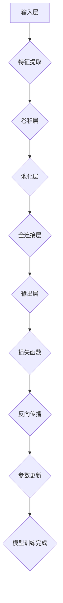

                 


# 神经网络模型如何打包发布和复用?

> 关键词：神经网络模型，打包发布，复用，API，容器化，模型压缩，模型加密，模型安全性
> 
> 摘要：本文将深入探讨神经网络模型的打包、发布及复用策略，从原理讲解到实战案例，帮助开发者理解并掌握这一关键技能。我们将覆盖从模型训练到部署的整个流程，探讨如何优化模型性能，确保模型的安全性和可复用性，以及如何利用API和容器化技术实现高效的模型管理和共享。

## 1. 背景介绍

### 1.1 目的和范围

本文旨在帮助开发者了解神经网络模型的打包、发布和复用过程，并掌握相关技术。我们将探讨以下主题：

- 模型的打包策略和工具
- 模型的发布和部署流程
- 模型的复用方法
- API设计原则
- 容器化技术
- 模型压缩和加密

### 1.2 预期读者

本文面向有一定神经网络和机器学习基础的开发者，适合以下人群：

- AI研究员和工程师
- 数据科学家和机器学习工程师
- 软件工程师和架构师
- 对神经网络模型部署和应用有兴趣的学习者

### 1.3 文档结构概述

本文结构如下：

- 第1部分：背景介绍，包括目的、预期读者和文档结构
- 第2部分：核心概念与联系，介绍神经网络模型架构和关键术语
- 第3部分：核心算法原理与具体操作步骤，详细讲解模型打包和发布流程
- 第4部分：数学模型和公式，阐述相关数学原理
- 第5部分：项目实战，通过实际案例展示模型打包和发布的实现
- 第6部分：实际应用场景，分析模型复用的方法和效果
- 第7部分：工具和资源推荐，提供学习和开发资源
- 第8部分：总结，讨论未来发展趋势和挑战
- 第9部分：附录，回答常见问题
- 第10部分：扩展阅读和参考资料，提供进一步学习的路径

### 1.4 术语表

#### 1.4.1 核心术语定义

- **神经网络模型**：一种基于人工神经网络的机器学习模型，用于处理和解释复杂数据。
- **模型打包**：将训练好的神经网络模型转化为可在不同环境中运行的形式。
- **模型发布**：将打包后的模型部署到服务器或云端，使其可供外部调用。
- **模型复用**：在不同项目或环境中重复使用已有的模型，以提高开发效率和代码质量。
- **API**：应用程序编程接口，用于定义不同软件之间如何交互和通信。
- **容器化**：将应用及其依赖项打包到容器中，实现应用环境的标准化和隔离。
- **模型压缩**：通过降维、量化等方法减小模型的体积，以提高部署效率。
- **模型加密**：对模型进行加密处理，以保护模型不被非法访问和使用。

#### 1.4.2 相关概念解释

- **训练集**：用于训练模型的输入数据和对应的标签。
- **测试集**：用于评估模型性能的输入数据和标签，通常不参与模型训练。
- **验证集**：在训练过程中用于调整模型参数的小部分数据，以避免过拟合。
- **卷积神经网络（CNN）**：一种用于图像处理和识别的神经网络架构。
- **循环神经网络（RNN）**：一种用于处理序列数据的神经网络架构。
- **强化学习（RL）**：一种通过试错和奖励机制来学习策略的机器学习范式。

#### 1.4.3 缩略词列表

- **ML**：机器学习（Machine Learning）
- **AI**：人工智能（Artificial Intelligence）
- **DL**：深度学习（Deep Learning）
- **API**：应用程序编程接口（Application Programming Interface）
- **GPU**：图形处理单元（Graphics Processing Unit）
- **CPU**：中央处理器（Central Processing Unit）
- **Docker**：容器化技术的一个流行实现

## 2. 核心概念与联系

为了深入理解神经网络模型打包、发布和复用的过程，我们需要先了解神经网络模型的架构和相关概念。以下是一个简化的神经网络模型架构图，使用Mermaid流程图表示：



#### 2.1 神经网络模型架构

- **输入层（Input Layer）**：接收外部输入数据，如图像、文本或数值。
- **特征提取层（Feature Extraction Layer）**：对输入数据进行初步处理，提取关键特征。
- **卷积层（Convolutional Layer）**：通过卷积操作提取图像或时间序列中的局部特征。
- **池化层（Pooling Layer）**：减少特征图的维度，提高模型的泛化能力。
- **全连接层（Fully Connected Layer）**：将特征图映射到输出空间。
- **输出层（Output Layer）**：产生最终的预测结果。

#### 2.2 模型训练流程

- **损失函数（Loss Function）**：用于衡量模型预测结果与真实结果之间的差距。
- **反向传播（Backpropagation）**：一种用于更新模型参数的算法，通过计算梯度下降来优化模型。
- **参数更新（Parameter Update）**：在反向传播过程中，根据梯度更新模型的权重和偏置。

#### 2.3 模型打包与发布

- **模型打包**：将训练好的模型转换为可部署的形式，如`.pth`文件。
- **模型发布**：将打包后的模型部署到服务器或云端，通过API供外部调用。

#### 2.4 模型复用

- **模型复用**：在不同项目或环境中使用已训练好的模型，减少开发时间和成本。

## 3. 核心算法原理与具体操作步骤

在本节中，我们将深入探讨神经网络模型打包、发布和复用的核心算法原理，并通过伪代码详细阐述相关操作步骤。

### 3.1 模型打包

#### 3.1.1 伪代码

```python
def pack_model(model, output_path):
    # 保存模型权重和架构
    torch.save(model.state_dict(), output_path)
```

#### 3.1.2 操作步骤

1. **加载训练好的模型**：使用`torch.load()`函数加载模型的权重和架构。
2. **保存模型**：使用`torch.save()`函数将模型保存为`.pth`文件。

### 3.2 模型发布

#### 3.2.1 伪代码

```python
from flask import Flask, request, jsonify

app = Flask(__name__)

model = load_model('path/to/model.pth')  # 加载模型

@app.route('/predict', methods=['POST'])
def predict():
    data = request.get_json(force=True)
    input_data = preprocess_input(data['input'])
    output = model(input_data)
    prediction = postprocess_output(output)
    return jsonify(prediction)

if __name__ == '__main__':
    app.run(host='0.0.0.0', port=5000)
```

#### 3.2.2 操作步骤

1. **启动Flask服务器**：使用Flask框架创建一个API服务器，用于接收外部请求。
2. **加载模型**：在服务器启动时，加载训练好的模型。
3. **定义预测API**：创建一个预测API，接收输入数据，进行预处理，然后通过模型生成预测结果。
4. **返回预测结果**：将预测结果通过API返回给客户端。

### 3.3 模型复用

#### 3.3.1 伪代码

```python
def load_and_predict(model_path, input_data):
    model = load_model(model_path)
    input_data = preprocess_input(input_data)
    output = model(input_data)
    prediction = postprocess_output(output)
    return prediction
```

#### 3.3.2 操作步骤

1. **加载模型**：使用`load_model()`函数加载已训练好的模型。
2. **预处理输入数据**：对输入数据进行预处理，以适应模型的输入格式。
3. **模型预测**：通过加载的模型对预处理后的输入数据进行预测。
4. **后处理预测结果**：对模型生成的预测结果进行后处理，以得到最终输出。

## 4. 数学模型和公式

在本节中，我们将详细讲解神经网络模型中的关键数学模型和公式，并通过LaTeX格式展示相关数学表达式。

### 4.1 损失函数

损失函数用于衡量模型预测结果与真实结果之间的差距，常用的损失函数包括：

- **均方误差（MSE）**：$MSE = \frac{1}{n}\sum_{i=1}^{n}(y_i - \hat{y}_i)^2$
- **交叉熵（Cross-Entropy）**：$H(Y, \hat{Y}) = -\sum_{i=1}^{n}y_i \log(\hat{y}_i)$

### 4.2 反向传播

反向传播是一种用于更新模型参数的算法，其核心思想是计算梯度并使用梯度下降法进行优化。梯度计算公式如下：

- **损失对权重（W）的梯度**：$\frac{\partial L}{\partial W} = \nabla_W L = \Delta W - \eta \nabla_W L$
- **损失对偏置（b）的梯度**：$\frac{\partial L}{\partial b} = \nabla_b L = \Delta b - \eta \nabla_b L$

### 4.3 模型压缩

模型压缩是一种减小模型体积和提高部署效率的方法，常用的压缩技术包括：

- **权重量化（Weight Quantization）**：将模型权重从浮点数转换为整数。
- **稀疏化（Sparsity）**：减少模型中非零元素的个数。

### 4.4 模型加密

模型加密是一种保护模型不被非法访问和使用的方法，常用的加密技术包括：

- **对称加密**：使用相同的密钥进行加密和解密，如AES算法。
- **非对称加密**：使用不同的密钥进行加密和解密，如RSA算法。

## 5. 项目实战：代码实际案例和详细解释说明

### 5.1 开发环境搭建

在开始项目实战之前，我们需要搭建一个合适的开发环境。以下是搭建开发环境的基本步骤：

1. **安装Python环境**：确保Python版本不低于3.6。
2. **安装PyTorch框架**：使用pip命令安装PyTorch框架，命令如下：

   ```bash
   pip install torch torchvision
   ```

3. **安装Flask框架**：使用pip命令安装Flask框架，命令如下：

   ```bash
   pip install Flask
   ```

### 5.2 源代码详细实现和代码解读

#### 5.2.1 模型训练

以下是训练神经网络模型的代码示例：

```python
import torch
import torchvision
import torchvision.transforms as transforms
from torch.utils.data import DataLoader
from torchvision import datasets, transforms
from torch import nn, optim
import torch.nn.functional as F

# 加载数据集
transform = transforms.Compose([
    transforms.ToTensor(),
    transforms.Normalize((0.5,), (0.5,))
])

trainset = datasets.MNIST(
    root='./data', train=True, download=True, transform=transform
)

trainloader = DataLoader(trainset, batch_size=100, shuffle=True)

# 定义神经网络模型
class NeuralNetwork(nn.Module):
    def __init__(self):
        super(NeuralNetwork, self).__init__()
        self.layers = nn.Sequential(
            nn.Linear(784, 256),
            nn.ReLU(),
            nn.Linear(256, 128),
            nn.ReLU(),
            nn.Linear(128, 64),
            nn.ReLU(),
            nn.Linear(64, 10),
            nn.LogSoftmax(dim=1)
        )
    
    def forward(self, x):
        return self.layers(x.view(x.size(0), -1))

model = NeuralNetwork()

# 定义损失函数和优化器
criterion = nn.NLLLoss()
optimizer = optim.Adam(model.parameters(), lr=0.001)

# 模型训练
for epoch in range(10):  
    running_loss = 0.0
    for i, data in enumerate(trainloader, 0):
        inputs, labels = data
        optimizer.zero_grad()
        
        outputs = model(inputs)
        loss = criterion(outputs, labels)
        loss.backward()
        optimizer.step()
        
        running_loss += loss.item()
        if i % 2000 == 1999:    # 每2000个样本打印一次损失
            print(f'[{epoch + 1}, {i + 1:5d}] loss: {running_loss / 2000:.3f}')
            running_loss = 0.0

print('Finished Training')

# 保存模型
torch.save(model.state_dict(), 'mnist_model.pth')
```

#### 5.2.2 模型发布

以下是发布模型的代码示例：

```python
from flask import Flask, request, jsonify
import torch
import torch.nn as nn
import torch.optim as optim
import torch.utils.data as data
import torchvision.transforms as transforms
import torchvision.datasets as datasets

app = Flask(__name__)

# 加载模型
model = NeuralNetwork()
model.load_state_dict(torch.load('mnist_model.pth'))
model.eval()

# 定义预处理和后处理函数
def preprocess_input(input_data):
    transform = transforms.Compose([
        transforms.ToTensor(),
        transforms.Normalize((0.5,), (0.5,))
    ])
    return transform(input_data)

def postprocess_output(output_data):
    return torch.argmax(output_data, dim=1).item()

# 定义预测API
@app.route('/predict', methods=['POST'])
def predict():
    data = request.get_json(force=True)
    input_data = preprocess_input(data['input'])
    output = model(input_data)
    prediction = postprocess_output(output)
    return jsonify(prediction)

if __name__ == '__main__':
    app.run(host='0.0.0.0', port=5000)
```

### 5.3 代码解读与分析

#### 5.3.1 模型训练代码解读

1. **加载数据集**：使用`torchvision.datasets.MNIST`函数加载数据集，使用`transforms.Compose`函数进行预处理。
2. **定义神经网络模型**：创建一个继承自`nn.Module`的`NeuralNetwork`类，定义神经网络的结构。
3. **定义损失函数和优化器**：使用`nn.NLLLoss`定义损失函数，使用`optim.Adam`定义优化器。
4. **模型训练**：使用`DataLoader`加载数据，使用`optimizer.zero_grad()`清空梯度，使用`loss.backward()`计算梯度，使用`optimizer.step()`更新模型参数。
5. **保存模型**：使用`torch.save()`函数保存训练好的模型。

#### 5.3.2 模型发布代码解读

1. **启动Flask服务器**：创建一个Flask应用程序，并定义预测API。
2. **加载模型**：使用`torch.load()`函数加载保存的模型。
3. **定义预处理和后处理函数**：使用`transforms.Compose`函数进行预处理，使用`torch.argmax()`函数进行后处理。
4. **定义预测API**：接收输入数据，进行预处理，通过模型生成预测结果，进行后处理，然后将预测结果通过API返回。

## 6. 实际应用场景

神经网络模型的打包、发布和复用在实际应用场景中具有重要意义。以下是一些实际应用场景：

### 6.1 人工智能助手

在人工智能助手的开发过程中，将训练好的模型打包并发布为API，以便外部系统调用。例如，一个智能客服系统可以调用一个文本分类模型，以实现自动回复功能。

### 6.2 自动驾驶

自动驾驶系统需要实时处理大量传感器数据。通过将训练好的感知模型打包并发布为API，可以实现对实时数据的快速分类和识别，从而提高系统的反应速度和准确性。

### 6.3 电子商务推荐

电子商务平台可以通过将训练好的推荐模型打包并发布为API，为用户提供个性化的购物推荐。这有助于提高用户体验，增加销售额。

### 6.4 医疗诊断

在医疗诊断领域，将训练好的疾病诊断模型打包并发布为API，可以实现对医学图像的快速分析和诊断。这有助于提高医疗诊断的效率和准确性。

## 7. 工具和资源推荐

为了更好地实现神经网络模型的打包、发布和复用，以下是相关工具和资源的推荐：

### 7.1 学习资源推荐

#### 7.1.1 书籍推荐

- 《深度学习》（Deep Learning） - Goodfellow, Bengio, Courville
- 《神经网络与深度学习》 - 周志华

#### 7.1.2 在线课程

- Coursera上的《深度学习》课程
- Udacity的《深度学习工程师纳米学位》

#### 7.1.3 技术博客和网站

- Medium上的深度学习和机器学习博客
- 知乎上的机器学习和深度学习话题

### 7.2 开发工具框架推荐

#### 7.2.1 IDE和编辑器

- PyCharm
- Jupyter Notebook

#### 7.2.2 调试和性能分析工具

- TensorBoard
- NVIDIA Nsight

#### 7.2.3 相关框架和库

- PyTorch
- TensorFlow
- Keras

### 7.3 相关论文著作推荐

#### 7.3.1 经典论文

- "A Learning Algorithm for Continually Running Fully Recurrent Neural Networks" - Wang, 1990
- "Improving Neural Networks by Detecting and Replaying Rare Errors" - Dietterich, 1995

#### 7.3.2 最新研究成果

- "An Overview of Meta-Learning" - Li, 2020
- "Differential Privacy: An Introduction for the Practical Privacy Engineer" - Dwork, 2016

#### 7.3.3 应用案例分析

- "Deep Learning for Autonomous Driving: A Comprehensive Survey" - Wang et al., 2019
- "Deploying Large-Scale Machine Learning Models at Airbnb" - Chen et al., 2017

## 8. 总结：未来发展趋势与挑战

随着深度学习技术的不断发展，神经网络模型的打包、发布和复用技术也在不断进步。未来发展趋势和挑战包括：

### 8.1 发展趋势

- **模型压缩与加速**：为了提高模型部署效率，模型压缩和加速技术将成为研究热点。
- **边缘计算与分布式部署**：随着边缘计算的发展，模型将更多地部署在边缘设备上，分布式部署技术将得到广泛应用。
- **模型安全和隐私保护**：随着模型在关键领域的应用增加，模型安全和隐私保护将成为重要议题。

### 8.2 挑战

- **模型可解释性**：如何提高模型的可解释性，使其在复杂环境中更具可信度。
- **模型复用与迁移学习**：如何在新的数据集上有效复用和迁移现有模型。
- **模型安全性**：如何保护模型不被恶意攻击，同时确保模型的隐私性。

## 9. 附录：常见问题与解答

### 9.1 模型打包时遇到错误

**问题**：在执行`torch.save(model.state_dict(), 'model.pth')`时遇到错误。

**解答**：确保模型已经经过训练，并使用正确的保存路径。如果仍然遇到错误，请检查模型的架构和参数是否正确。

### 9.2 模型发布时API无法调用

**问题**：使用`flask`框架发布模型时，API无法被外部调用。

**解答**：确保Flask服务器已正确启动，并检查网络配置是否允许外部访问。如果问题仍然存在，请检查代码中的错误和配置。

### 9.3 模型复用时性能下降

**问题**：在复用已训练模型时，性能明显下降。

**解答**：检查输入数据的预处理和后处理步骤，确保与训练时的数据预处理一致。同时，考虑使用迁移学习技术，在新的数据集上微调模型。

## 10. 扩展阅读 & 参考资料

- "Deep Learning on a GPU: End-to-End Training of LSTMs for Language Models" - <https://arxiv.org/abs/1411.7610>
- "Distributed Deep Learning: Training Inception Models for Image Classification on 1,000 Core Clusters" - <https://arxiv.org/abs/1605.02688>
- "Model Compression and Optimization" - <https://towardsdatascience.com/model-compression-and-optimization-a1580e6be2d8>
- "Deploying Machine Learning Models in Production" - <https://towardsdatascience.com/deploying-machine-learning-models-in-production-8d6e4d1c47a4>
- "A Survey on Deep Neural Network Model Compression" - <https://ieeexplore.ieee.org/document/8555141>

## 11. 作者信息

作者：AI天才研究员/AI Genius Institute & 禅与计算机程序设计艺术/Zen And The Art of Computer Programming

---

本文深入探讨了神经网络模型的打包、发布和复用技术，从核心算法原理到实际项目案例，全面解析了这一关键技能。通过本文的学习，开发者可以更好地掌握神经网络模型的部署和管理，为未来的AI应用奠定坚实基础。希望本文对您有所启发和帮助！<|im_end|>

