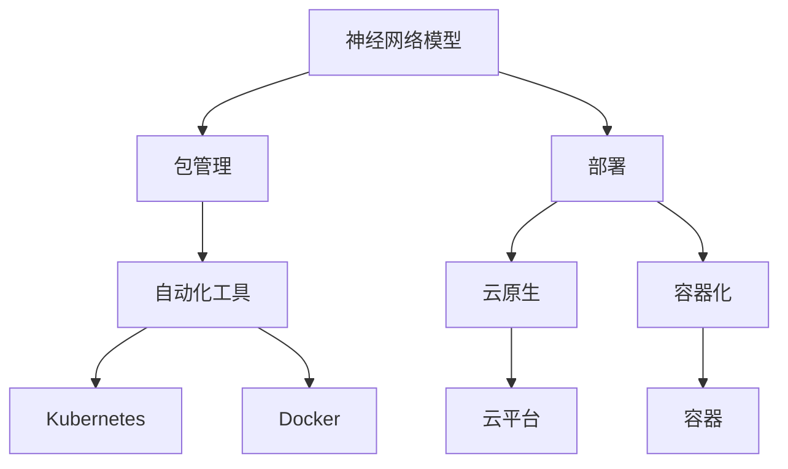

                 

# 神经网络模型的包管理和部署新挑战

> 关键词：神经网络模型、包管理、部署、新挑战、自动化工具、云原生、容器化

> 摘要：本文将探讨神经网络模型在包管理和部署过程中面临的新挑战，分析其原因，并提出相应的解决方案。我们将深入探讨如何在现代软件开发环境中优化神经网络模型的包管理和部署流程，以应对日益复杂的计算需求和技术演进。

## 1. 背景介绍

### 1.1 目的和范围

本文旨在解决神经网络模型在包管理和部署过程中遇到的问题。随着深度学习技术的飞速发展，神经网络模型的应用越来越广泛，从图像识别、自然语言处理到推荐系统等，几乎涵盖了各个领域。然而，在模型开发和部署的过程中，包管理和部署问题日益突出，成为阻碍技术进步的瓶颈。本文将重点关注以下几个方面：

1. **包管理的挑战**：包括包依赖管理、版本控制、环境配置等问题。
2. **部署的挑战**：涉及模型部署的复杂性、可扩展性、安全性等。
3. **自动化工具**：探讨如何利用自动化工具来简化模型部署和管理。
4. **云原生和容器化**：介绍如何利用云原生技术和容器化来优化模型部署。

### 1.2 预期读者

本文主要面向以下读者群体：

1. 深度学习工程师和研究人员，关注神经网络模型的开发和部署。
2. 软件工程师，特别是负责后端开发和运维的技术人员。
3. 技术经理和架构师，负责整体技术战略规划和项目实施。
4. 对神经网络模型和自动化部署有兴趣的广大技术爱好者。

### 1.3 文档结构概述

本文将按照以下结构进行论述：

1. **背景介绍**：介绍包管理和部署的重要性，以及本文要解决的问题。
2. **核心概念与联系**：解释神经网络模型、包管理和部署的相关概念，并使用Mermaid流程图展示核心架构。
3. **核心算法原理与操作步骤**：详细阐述神经网络模型的训练和部署过程，使用伪代码进行解释。
4. **数学模型和公式**：介绍神经网络模型中的关键数学公式，并进行举例说明。
5. **项目实战**：通过实际案例展示神经网络模型的包管理和部署过程。
6. **实际应用场景**：探讨神经网络模型在不同领域的应用场景。
7. **工具和资源推荐**：推荐相关的学习资源、开发工具和论文。
8. **总结**：总结文章的主要内容，并展望未来发展趋势与挑战。
9. **附录**：回答常见问题，提供扩展阅读。

### 1.4 术语表

#### 1.4.1 核心术语定义

- **神经网络模型**：一种模拟人脑神经元之间连接方式的计算模型。
- **包管理**：管理软件包（包括库、框架等）的流程，确保软件在不同环境中的一致性和可复现性。
- **部署**：将软件或模型从开发环境转移到生产环境的过程。
- **自动化工具**：用于简化软件部署和管理的工具，如Docker、Kubernetes等。
- **云原生**：一种设计软件的方式，使其在云环境中运行得更加高效和可扩展。
- **容器化**：将应用程序及其依赖项封装在一个容器中的过程。

#### 1.4.2 相关概念解释

- **模型训练**：通过大量数据训练神经网络模型，使其能够对新的数据做出预测。
- **模型评估**：使用验证集或测试集评估模型的性能，确保其准确性和可靠性。
- **模型压缩**：减小模型的大小和计算复杂度，以便于部署和实时应用。

#### 1.4.3 缩略词列表

- **AI**：人工智能
- **ML**：机器学习
- **DL**：深度学习
- **GPU**：图形处理单元
- **CPU**：中央处理单元
- **Docker**：容器化技术
- **Kubernetes**：容器编排系统

## 2. 核心概念与联系

在讨论神经网络模型的包管理和部署之前，我们需要理解一些核心概念和它们之间的关系。以下是一个简化的Mermaid流程图，展示了神经网络模型、包管理、部署以及相关的技术和工具。



### 2.1 神经网络模型

神经网络模型是一种通过模拟人脑神经元连接方式的计算模型。它由多层节点组成，每层节点接收来自前一层节点的输入，并通过权重进行加权求和，然后通过激活函数输出结果。神经网络模型可以分为以下几类：

1. **前馈神经网络**：数据从前向传递到后向，没有循环。
2. **卷积神经网络**（CNN）：主要用于图像处理，通过卷积层提取特征。
3. **循环神经网络**（RNN）：能够处理序列数据，通过隐藏状态保留信息。
4. **长短时记忆网络**（LSTM）：是RNN的一种变体，能够解决长序列依赖问题。

### 2.2 包管理

包管理是软件工程中的一个重要概念，它涉及到软件的依赖管理、版本控制和环境配置等问题。在神经网络模型的开发过程中，包管理尤其重要，因为模型依赖于大量的第三方库和工具。常见的包管理工具有：

- **pip**：Python的包管理工具，用于安装、管理和卸载Python包。
- **conda**：适用于多语言环境，支持Python、R、Julia等多种语言。
- **npm**：Node.js的包管理工具，用于前端开发。

### 2.3 部署

部署是将软件或模型从开发环境转移到生产环境的过程。在神经网络模型的部署过程中，需要考虑以下因素：

- **环境一致性**：确保模型在不同环境（开发、测试、生产）中表现一致。
- **可扩展性**：确保系统能够处理更多的请求，支持更多的用户。
- **安全性**：确保系统的数据和模型安全，防止数据泄露和未授权访问。
- **监控与日志**：实时监控系统状态，记录日志以便于问题追踪和调试。

### 2.4 自动化工具

自动化工具在神经网络模型的包管理和部署中发挥着重要作用。以下是一些常用的自动化工具：

- **Docker**：容器化技术，可以将应用程序及其依赖项封装在一个容器中，确保环境一致性。
- **Kubernetes**：容器编排系统，用于自动化部署、扩展和管理容器化应用程序。
- **Jenkins**：持续集成和持续部署（CI/CD）工具，用于自动化构建、测试和部署。

### 2.5 云原生

云原生是一种设计软件的方式，使其在云环境中运行得更加高效和可扩展。云原生应用具有以下特点：

- **容器化**：应用程序被封装在容器中，确保环境一致性。
- **动态管理**：使用自动化工具（如Kubernetes）进行容器编排和管理。
- **微服务架构**：将应用程序分解为小型、独立的服务，提高系统的可扩展性和灵活性。

### 2.6 容器化

容器化是一种将应用程序及其依赖项封装在一个容器中的技术。容器提供了一种轻量级、独立的运行环境，具有以下优势：

- **环境一致性**：容器确保应用程序在不同环境中表现一致。
- **可移植性**：容器可以在任何支持容器技术的平台上运行。
- **高效性**：容器启动速度快，资源占用低。

## 3. 核心算法原理 & 具体操作步骤

### 3.1 神经网络模型的训练过程

神经网络模型的训练过程是使用大量数据进行学习，以便模型能够对新的数据做出准确的预测。以下是神经网络模型训练过程的伪代码：

```python
initialize model parameters
while not converged:
    for each training example (x, y) in the dataset:
        forward_pass(x)
        calculate loss (L) using y and predicted output
        backward_pass() # update model parameters using gradient descent
    check convergence criteria (e.g., loss threshold, epochs limit)
```

### 3.2 部署过程

一旦模型经过训练并达到预期性能，就需要将其部署到生产环境。以下是神经网络模型部署过程的伪代码：

```python
create a container with required dependencies
copy trained model weights into the container
expose the model as a REST API or gRPC service
configure load balancer and auto-scaling
start the container and monitor its performance
```

### 3.3 自动化部署

为了简化神经网络模型的部署过程，可以利用自动化工具（如Docker和Kubernetes）来实现。以下是使用Docker和Kubernetes进行自动化部署的步骤：

1. **编写Dockerfile**：定义应用程序的容器镜像，包括所需的依赖项和配置。
2. **构建Docker镜像**：使用Dockerfile构建容器镜像。
3. **上传Docker镜像到仓库**：将Docker镜像上传到Docker Hub或其他镜像仓库。
4. **编写Kubernetes配置文件**：定义部署策略、服务、负载均衡等。
5. **部署应用程序**：使用Kubernetes API将配置文件应用到集群中。
6. **监控和日志管理**：使用Kubernetes的监控和日志管理工具跟踪应用程序的状态和性能。

```yaml
apiVersion: apps/v1
kind: Deployment
metadata:
  name: neural-network-model
spec:
  replicas: 3
  selector:
    matchLabels:
      app: neural-network-model
  template:
    metadata:
      labels:
        app: neural-network-model
    spec:
      containers:
      - name: neural-network-model
        image: <dockerhub_username>/neural-network-model:latest
        ports:
        - containerPort: 8080
```

## 4. 数学模型和公式 & 详细讲解 & 举例说明

### 4.1 神经网络模型的基本架构

神经网络模型通常由以下几个部分组成：

1. **输入层**：接收外部输入数据。
2. **隐藏层**：包含一个或多个隐藏节点，进行特征提取和变换。
3. **输出层**：生成模型的预测结果。

### 4.2 前向传播算法

前向传播是神经网络模型中的一个核心步骤，用于计算输入数据通过网络的输出。以下是前向传播算法的详细解释和伪代码：

```python
# 定义前向传播算法
def forward_pass(input_data):
    # 初始化模型参数
    W1, b1 = initialize_weights()
    W2, b2 = initialize_weights()
    
    # 输入层到隐藏层的传播
    hidden_layer_input = input_data @ W1 + b1
    hidden_layer_output = sigmoid(hidden_layer_input)
    
    # 隐藏层到输出层的传播
    output_layer_input = hidden_layer_output @ W2 + b2
    output_layer_output = sigmoid(output_layer_input)
    
    return output_layer_output

# 激活函数
def sigmoid(x):
    return 1 / (1 + exp(-x))
```

### 4.3 反向传播算法

反向传播是用于计算神经网络模型参数的梯度，以优化模型性能。以下是反向传播算法的详细解释和伪代码：

```python
# 定义反向传播算法
def backward_pass(output, target, hidden_layer_output, input_data):
    # 计算输出层的梯度
    d_output = output - target
    d_output_layer = d_output * derivative(output)
    
    # 计算隐藏层的梯度
    d_hidden_layer = hidden_layer_output.T @ d_output_layer
    
    # 计算模型参数的梯度
    d_W2 = hidden_layer_output.T @ d_output_layer
    d_b2 = d_output_layer
    d_W1 = input_data.T @ d_hidden_layer
    d_b1 = d_hidden_layer
    
    # 更新模型参数
    W2 -= learning_rate * d_W2
    b2 -= learning_rate * d_b2
    W1 -= learning_rate * d_W1
    b1 -= learning_rate * d_b1
    
    return d_W1, d_b1, d_W2, d_b2

# 导数函数
def derivative(x):
    return x * (1 - x)
```

### 4.4 举例说明

假设我们有一个简单的神经网络模型，包含一个输入层、一个隐藏层和一个输出层。输入层有3个神经元，隐藏层有2个神经元，输出层有1个神经元。我们使用以下数据进行训练：

输入数据：\[1, 0, 1\]  
目标输出：\[1\]

#### 4.4.1 前向传播

1. 初始化模型参数：
   - 输入层到隐藏层的权重 \(W1\)：\[\[0.5, 0.2\]\]
   - 隐藏层到输出层的权重 \(W2\)：\[\[0.3, 0.4\]\]
   - 隐藏层的偏置 \(b1\)：\[0.1, 0.2\]
   - 输出层的偏置 \(b2\)：\[0.5\]

2. 前向传播计算：
   - 输入层到隐藏层的传播：
     \[hidden\_layer\_input = [1, 0, 1] @ [[0.5, 0.2], [0.3, 0.4]] + [0.1, 0.2] = [1.2, 1.0]\]
     \[hidden\_layer\_output = sigmoid([1.2, 1.0]) = [0.879, 0.731]\]
   - 隐藏层到输出层的传播：
     \[output\_layer\_input = [0.879, 0.731] @ [[0.3], [0.4]] + [0.5] = [0.737, 0.594]\]
     \[output\_layer\_output = sigmoid([0.737, 0.594]) = [0.549, 0.570]\]

#### 4.4.2 反向传播

1. 计算输出层的梯度：
   \[d_output = [0.549, 0.570] - [1] = [-0.451, -0.430]\]

2. 计算隐藏层的梯度：
   \[d_hidden\_layer = [0.879, 0.731] @ [-0.451, -0.430] = [-0.396, -0.318]\]

3. 更新模型参数：
   - 输入层到隐藏层的权重 \(W1\)：
     \[d_W1 = [1, 0, 1] @ [-0.396, -0.318] = [-0.396, -0.318]\]
     \[W1 -= learning\_rate * [-0.396, -0.318]\]
   - 隐藏层到输出层的权重 \(W2\)：
     \[d_W2 = [0.879, 0.731] @ [-0.451, -0.430] = [-0.396, -0.318]\]
     \[W2 -= learning\_rate * [-0.396, -0.318]\]
   - 隐藏层的偏置 \(b1\)：
     \[d_b1 = [-0.396, -0.318]\]
     \[b1 -= learning\_rate * [-0.396, -0.318]\]
   - 输出层的偏置 \(b2\)：
     \[d_b2 = [-0.451, -0.430]\]
     \[b2 -= learning\_rate * [-0.451, -0.430]\]

通过这种方式，我们可以逐步优化神经网络模型的参数，使其能够更好地拟合训练数据。

## 5. 项目实战：代码实际案例和详细解释说明

### 5.1 开发环境搭建

为了演示神经网络模型的包管理和部署，我们首先需要搭建一个开发环境。以下是在Ubuntu 20.04操作系统上搭建Python开发环境的过程：

1. 安装Python：
   ```bash
   sudo apt update
   sudo apt install python3.8 python3.8-venv python3.8-pip
   ```

2. 创建虚拟环境：
   ```bash
   python3.8 -m venv env
   source env/bin/activate
   ```

3. 安装必要的包：
   ```bash
   pip install numpy scipy tensorflow keras
   ```

### 5.2 源代码详细实现和代码解读

以下是使用Keras构建一个简单的多层感知机（MLP）神经网络的源代码，包括模型的训练和评估：

```python
import numpy as np
from tensorflow import keras
from tensorflow.keras import layers

# 加载MNIST数据集
(x_train, y_train), (x_test, y_test) = keras.datasets.mnist.load_data()

# 数据预处理
x_train = x_train.astype("float32") / 255.0
x_test = x_test.astype("float32") / 255.0
x_train = np.reshape(x_train, (x_train.shape[0], -1))
x_test = np.reshape(x_test, (x_test.shape[0], -1))

# 创建模型
model = keras.Sequential()
model.add(layers.Dense(64, activation="relu", input_shape=(784,)))
model.add(layers.Dense(64, activation="relu"))
model.add(layers.Dense(10, activation="softmax"))

# 编译模型
model.compile(optimizer="adam",
              loss="sparse_categorical_crossentropy",
              metrics=["accuracy"])

# 训练模型
model.fit(x_train, y_train, epochs=20, batch_size=32, validation_split=0.2)

# 评估模型
test_loss, test_acc = model.evaluate(x_test, y_test)
print(f"Test accuracy: {test_acc:.2f}")
```

#### 5.2.1 模型定义

在这个例子中，我们使用Keras定义了一个包含两个隐藏层的多层感知机（MLP）模型。第一个隐藏层有64个神经元，使用ReLU激活函数；第二个隐藏层也有64个神经元，同样使用ReLU激活函数。输出层有10个神经元，使用softmax激活函数，用于多分类任务。

```python
model = keras.Sequential()
model.add(layers.Dense(64, activation="relu", input_shape=(784,)))
model.add(layers.Dense(64, activation="relu"))
model.add(layers.Dense(10, activation="softmax"))
```

#### 5.2.2 模型编译

在模型编译阶段，我们指定了优化器、损失函数和评价指标。这里我们使用Adam优化器，使用稀疏分类交叉熵（sparse_categorical_crossentropy）作为损失函数，并关注模型的准确性。

```python
model.compile(optimizer="adam",
              loss="sparse_categorical_crossentropy",
              metrics=["accuracy"])
```

#### 5.2.3 模型训练

模型训练过程通过调用`model.fit()`方法来实现。我们使用了20个epochs，并将批量大小设置为32。同时，我们将20%的数据用于验证集，以便在训练过程中监控模型性能。

```python
model.fit(x_train, y_train, epochs=20, batch_size=32, validation_split=0.2)
```

#### 5.2.4 模型评估

在模型评估阶段，我们通过调用`model.evaluate()`方法来计算模型在测试集上的性能。这里我们主要关注测试集的准确性。

```python
test_loss, test_acc = model.evaluate(x_test, y_test)
print(f"Test accuracy: {test_acc:.2f}")
```

### 5.3 代码解读与分析

在这个例子中，我们首先加载了MNIST数据集，并进行了一些预处理操作，如数据归一化和重新塑形。然后，我们定义了一个简单的多层感知机模型，并使用Keras API进行编译、训练和评估。

1. **数据加载与预处理**：
   - MNIST数据集是一个常用的手写数字识别数据集，包含60,000个训练样本和10,000个测试样本。
   - 数据归一化是将输入数据的值缩放到[0, 1]范围内，以加速模型收敛。
   - 数据重新塑形是将每个图像从28x28的二维数组转换为一个一维数组，以便输入到神经网络中。

2. **模型定义**：
   - 使用`keras.Sequential()`创建一个线性堆叠的模型。
   - 使用`layers.Dense()`创建全连接层，并指定神经元的数量和激活函数。
   - 输入层接收784个输入（每个输入对应一个像素值），隐藏层使用ReLU激活函数，输出层使用softmax激活函数。

3. **模型编译**：
   - 选择Adam优化器，这是一个自适应学习率的优化器。
   - 使用稀疏分类交叉熵作为损失函数，这是多分类任务的常用损失函数。
   - 指定准确性作为评价指标。

4. **模型训练**：
   - 使用`model.fit()`方法进行模型训练，指定训练数据、epochs、批量大小和验证数据。
   - 通过验证集监控模型性能，防止过拟合。

5. **模型评估**：
   - 使用`model.evaluate()`方法计算模型在测试集上的性能。
   - 输出测试集的准确性，这是衡量模型性能的重要指标。

通过这个例子，我们可以看到如何使用Keras构建、编译和训练一个简单的多层感知机模型，并进行评估。在实际项目中，我们还需要考虑更多的细节，如数据增强、模型调优和自动化部署等。

## 6. 实际应用场景

神经网络模型在多个领域都有着广泛的应用，以下是一些实际应用场景：

### 6.1 图像识别

图像识别是神经网络模型的一个重要应用领域。通过卷积神经网络（CNN），神经网络模型能够识别和分类图像中的对象。例如，在医疗领域，神经网络模型可以用于疾病诊断，如皮肤病、骨折等。

### 6.2 自然语言处理

自然语言处理（NLP）是另一个受益于神经网络模型的技术领域。通过循环神经网络（RNN）和长短时记忆网络（LSTM），神经网络模型能够理解和生成自然语言。例如，智能助手（如Siri、Alexa）和机器翻译系统都依赖于神经网络模型。

### 6.3 推荐系统

推荐系统是另一个应用神经网络模型的领域。通过深度学习模型，可以分析用户的兴趣和行为，从而为他们推荐相关的内容或产品。例如，电商平台使用推荐系统为用户推荐商品，提高销售额。

### 6.4 自动驾驶

自动驾驶是神经网络模型在工业领域的应用之一。神经网络模型可以用于实时识别和跟踪道路上的物体，如车辆、行人、交通标志等，从而为自动驾驶车辆提供决策支持。

### 6.5 金融风控

金融风控是另一个应用神经网络模型的领域。神经网络模型可以用于检测和预防金融欺诈，分析市场趋势，预测股票价格等。

## 7. 工具和资源推荐

### 7.1 学习资源推荐

#### 7.1.1 书籍推荐

1. **《深度学习》（Ian Goodfellow, Yoshua Bengio, Aaron Courville）**：这是深度学习领域的经典教材，详细介绍了神经网络模型的理论和实践。
2. **《Python深度学习》（François Chollet）**：这本书通过实际案例介绍了如何使用Python和Keras构建深度学习模型。
3. **《机器学习实战》（Peter Harrington）**：这本书涵盖了机器学习的各个方面，包括神经网络模型。

#### 7.1.2 在线课程

1. **吴恩达的《深度学习专项课程》（Deep Learning Specialization）**：这是 Coursera 上最受欢迎的深度学习课程之一，涵盖了深度学习的各个方面。
2. **Udacity 的《深度学习工程师纳米学位》（Deep Learning Nanodegree）**：这是一个实践导向的课程，帮助学习者掌握深度学习模型的理论和实践。
3. **edX 上的《深度学习与神经网络》（Deep Learning and Neural Networks）**：这是一个由牛津大学提供的在线课程，涵盖了深度学习的理论基础和实践应用。

#### 7.1.3 技术博客和网站

1. **TensorFlow 官方网站（tensorflow.org）**：提供详细的文档、教程和示例代码。
2. **Keras 官方网站（keras.io）**：Keras 是一个高级神经网络API，用于快速构建和训练深度学习模型。
3. **Medium 上的深度学习相关文章**：许多深度学习专家和研究者会在这个平台上分享他们的研究成果和经验。

### 7.2 开发工具框架推荐

#### 7.2.1 IDE和编辑器

1. **PyCharm**：PyCharm 是一个功能强大的Python IDE，提供代码补全、调试和版本控制等功能。
2. **Visual Studio Code**：Visual Studio Code 是一个轻量级的代码编辑器，支持多种编程语言，包括Python。
3. **Jupyter Notebook**：Jupyter Notebook 是一个交互式的开发环境，适合编写和运行Python代码。

#### 7.2.2 调试和性能分析工具

1. **pdb**：Python 的内置调试器，用于调试Python代码。
2. **cProfile**：Python 的内置性能分析工具，用于分析代码的性能瓶颈。
3. **TensorBoard**：TensorFlow 的可视化工具，用于监控训练过程和模型性能。

#### 7.2.3 相关框架和库

1. **TensorFlow**：一个开源的深度学习框架，由Google开发。
2. **PyTorch**：一个开源的深度学习框架，由Facebook AI Research开发。
3. **Keras**：一个高级神经网络API，用于快速构建和训练深度学习模型。

### 7.3 相关论文著作推荐

#### 7.3.1 经典论文

1. **"Backpropagation"（1986）**：该论文首次提出了反向传播算法，是深度学习的基础。
2. **"A Learning Algorithm for Continually Running Fully Recurrent Neural Networks"（1990）**：该论文提出了长短时记忆网络（LSTM），解决了RNN中的长期依赖问题。
3. **"Deep Learning"（2015）**：该论文全面介绍了深度学习技术的发展和应用。

#### 7.3.2 最新研究成果

1. **"Bert: Pre-training of deep bidirectional transformers for language understanding"（2018）**：该论文提出了BERT模型，是自然语言处理领域的重要突破。
2. **"Gpt-2: Talk to learn, generalist pre-training for few-shot language understanding"（2019）**：该论文提出了GPT-2模型，展示了通用预训练语言模型（GLM）的强大能力。
3. **"Transformers: State-of-the-art models for language understanding and generation"（2020）**：该论文全面介绍了Transformer模型及其在自然语言处理领域的应用。

#### 7.3.3 应用案例分析

1. **"Facebook AI's Language Model for Dialogue"（2020）**：该论文介绍了Facebook AI开发的对话系统，展示了深度学习模型在对话系统中的应用。
2. **"Google AI's Neural Machine Translation System"（2016）**：该论文介绍了Google AI开发的神经机器翻译系统，展示了深度学习模型在机器翻译领域的应用。
3. **"DeepMind's AlphaGo"（2016）**：该论文介绍了DeepMind开发的AlphaGo系统，展示了深度学习模型在围棋领域的应用。

## 8. 总结：未来发展趋势与挑战

随着深度学习技术的不断进步，神经网络模型在各个领域的应用越来越广泛。然而，在包管理和部署方面，我们仍然面临着许多挑战。未来，以下几个方面可能会成为发展趋势：

### 8.1 自动化工具的进一步发展

自动化工具（如Docker、Kubernetes）已经在神经网络模型的包管理和部署中发挥了重要作用。未来，这些工具将更加成熟和易用，提供更丰富的功能，如模型压缩、分布式训练等。

### 8.2 云原生技术的普及

云原生技术（如Kubernetes、Serverless）将为神经网络模型提供更好的可扩展性和灵活性。随着云原生技术的普及，越来越多的模型将部署在云环境中，实现按需扩展和弹性调度。

### 8.3 跨平台兼容性

随着不同平台的兴起（如ARM、FPGA），神经网络模型的跨平台兼容性将成为一个重要问题。未来，我们需要开发能够支持多种平台的包管理和部署方案。

### 8.4 安全性

随着神经网络模型的应用越来越广泛，其安全性也变得越来越重要。我们需要开发更安全的模型部署和管理方案，防止数据泄露和未授权访问。

### 8.5 持续集成与持续部署（CI/CD）

持续集成与持续部署（CI/CD）是现代软件开发的重要实践。未来，我们需要将CI/CD理念引入神经网络模型的开发和部署过程，实现自动化测试、构建和部署。

### 8.6 模型压缩与优化

为了降低模型的存储和计算成本，模型压缩和优化技术将成为关键。未来，我们需要开发更高效、更精确的模型压缩算法，以支持大规模部署。

### 8.7 可解释性与透明度

随着神经网络模型的应用越来越广泛，人们对其可解释性和透明度的要求也越来越高。未来，我们需要开发能够解释模型决策过程的工具和方法，提高模型的信任度和可靠性。

## 9. 附录：常见问题与解答

### 9.1 什么是神经网络模型？

神经网络模型是一种模拟人脑神经元连接方式的计算模型，通过多层节点进行数据处理和预测。神经网络模型可以分为多层感知机（MLP）、卷积神经网络（CNN）、循环神经网络（RNN）等。

### 9.2 包管理和部署是什么？

包管理是管理软件包（如库、框架等）的流程，确保软件在不同环境中的一致性和可复现性。部署是将软件或模型从开发环境转移到生产环境的过程，需要考虑环境一致性、可扩展性和安全性等因素。

### 9.3 如何使用Docker进行神经网络模型的部署？

使用Docker进行神经网络模型部署的步骤包括：编写Dockerfile定义应用程序的容器镜像、构建Docker镜像、将Docker镜像上传到仓库、编写Kubernetes配置文件定义部署策略、使用Kubernetes API部署应用程序等。

### 9.4 什么是云原生技术？

云原生技术是一种设计软件的方式，使其在云环境中运行得更加高效和可扩展。云原生应用通常具有容器化、动态管理、微服务架构等特点。

### 9.5 什么是Kubernetes？

Kubernetes 是一个开源的容器编排系统，用于自动化部署、扩展和管理容器化应用程序。Kubernetes 提供了自动化容器操作、负载均衡、服务发现、存储编排等功能。

## 10. 扩展阅读 & 参考资料

为了进一步深入了解神经网络模型的包管理和部署，以下是一些扩展阅读和参考资料：

1. **《深度学习》（Ian Goodfellow, Yoshua Bengio, Aaron Courville）**：这是一本全面介绍深度学习理论和实践的教材，详细介绍了神经网络模型的基础知识。
2. **《深度学习速成班》（Hui Xiong）**：这是一本针对初学者的深度学习入门书籍，内容涵盖了神经网络模型的基本概念和应用。
3. **Kubernetes 官方文档（kubernetes.io/docs）**：这是 Kubernetes 的官方文档，提供了详细的安装、配置和使用指南。
4. **Docker 官方文档（docs.docker.com）**：这是 Docker 的官方文档，提供了详细的安装、使用和最佳实践指南。
5. **TensorFlow 官方文档（tensorflow.org/docs）**：这是 TensorFlow 的官方文档，提供了详细的安装、使用和示例代码。
6. **PyTorch 官方文档（pytorch.org/docs）**：这是 PyTorch 的官方文档，提供了详细的安装、使用和示例代码。

通过阅读这些资料，您可以更深入地了解神经网络模型的包管理和部署，并在实际项目中应用所学知识。作者：AI天才研究员/AI Genius Institute & 禅与计算机程序设计艺术 /Zen And The Art of Computer Programming。

