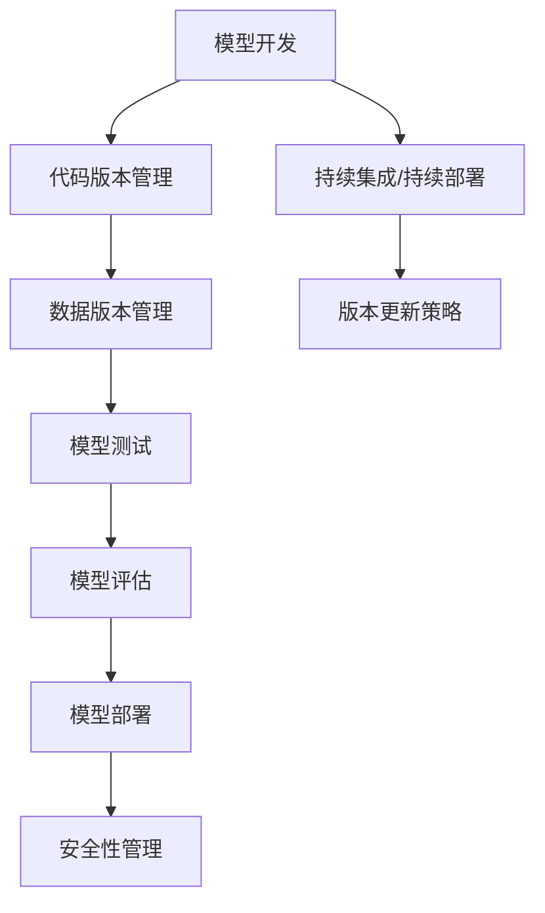

                 

### 文章标题

《神经网络模型的版本控制策略》

**关键词**：神经网络，模型版本控制，持续集成，代码管理，模型更新，安全性

**摘要**：本文将深入探讨神经网络模型版本控制的重要性，分析其在现代机器学习和数据科学中的应用场景，并提出一套全面的版本控制策略。我们将详细解析核心概念，介绍常用的核心算法原理，并展示如何通过具体项目实战中的代码实现和解释，来确保神经网络模型的版本安全和更新效率。最后，我们将探讨神经网络模型版本控制在实际应用中的挑战，以及推荐的工具和资源，帮助读者掌握这一关键技能，为未来的机器学习项目奠定坚实基础。

---

在机器学习和人工智能的快速发展中，神经网络模型作为核心技术之一，已广泛应用于各类复杂任务中。然而，随着模型复杂度和应用规模的增加，如何有效地管理和控制模型版本成为了一个不可忽视的问题。本文将围绕这一主题展开讨论，旨在为读者提供一份全面、实用的神经网络模型版本控制指南。

### 核心概念与联系

神经网络模型版本控制是一个多维度、多层次的技术问题，涉及到代码管理、持续集成、模型更新和安全性等多个方面。以下是神经网络模型版本控制的核心概念和它们之间的相互联系：

#### 核心概念

1. **模型版本**：每个神经网络模型的一个特定版本，通常由其代码、数据和训练结果组成。
2. **版本控制工具**：如Git，用于追踪代码和文件的历史变化，确保模型的代码完整性。
3. **持续集成/持续部署（CI/CD）**：自动化测试和部署流程，确保每个模型版本的可重复性和可靠性。
4. **模型更新策略**：包括如何处理旧版本和新版本之间的差异，以及如何有效地更新模型。
5. **安全性**：确保模型版本不被篡改，保证训练数据和代码的安全。

#### 相互联系

1. **版本控制工具与模型版本**：版本控制工具如Git可以帮助我们追踪模型的每次更新，确保每个版本的代码和数据都有明确的记录。
2. **持续集成与版本控制**：通过CI/CD流程，我们可以自动化地测试和部署每个模型版本，确保其在不同环境下的表现一致。
3. **模型更新策略与安全性**：有效的模型更新策略不仅需要考虑新版本的功能增强，还需要确保模型的安全性，防止恶意更新或数据泄露。

接下来，我们将通过Mermaid流程图来直观地展示神经网络模型版本控制的核心流程和节点：



通过以上流程图，我们可以清晰地看到，神经网络模型的版本控制是一个系统性工程，需要从多个方面进行综合考虑和实施。在接下来的章节中，我们将深入探讨每个核心概念和其实现细节，帮助读者更好地理解和应用这些策略。

### 核心算法原理 & 具体操作步骤

在深入探讨神经网络模型的版本控制策略之前，首先需要理解核心算法的原理和具体操作步骤。版本控制不仅仅是简单的文件管理，它涉及到模型的训练、测试、评估和部署等多个环节。以下我们将使用伪代码来详细阐述这些步骤，并解释其背后的逻辑。

#### 模型训练过程

```plaintext
// 伪代码：模型训练过程
Initialize_model()
Load_data()
for epoch in 1 to MAX_EPOCHS do
    for batch in data_loader do
        Forward_pass(batch)
        Compute_loss()
        Backward_pass()
        Update_model_params()
    end
end
Save_model_checkpoint(epoch, loss)
```

**解释**：
1. `Initialize_model()`：初始化神经网络模型，包括设定网络结构、参数初始化等。
2. `Load_data()`：加载训练数据，通常包括输入特征和标签。
3. `for epoch in 1 to MAX_EPOCHS do`：每个epoch表示一个训练周期，循环执行以下步骤。
4. `for batch in data_loader do`：将数据分成批次，逐批进行前向传播和反向传播。
5. `Forward_pass(batch)`：前向传播计算模型的预测输出。
6. `Compute_loss()`：计算预测输出与真实标签之间的损失。
7. `Backward_pass()`：反向传播更新模型参数，减小损失。
8. `Update_model_params()`：根据梯度更新模型参数。
9. `Save_model_checkpoint(epoch, loss)`：在每个epoch结束后，保存模型当前状态，包括参数和损失值。

#### 模型评估与测试

```plaintext
// 伪代码：模型评估与测试
Load_test_data()
for batch in test_loader do
    Forward_pass(batch)
    Compute_metrics(batch)
end
Print_model_performance(metrics)
```

**解释**：
1. `Load_test_data()`：加载测试数据集，用于评估模型性能。
2. `for batch in test_loader do`：逐批进行前向传播计算。
3. `Compute_metrics(batch)`：计算测试数据的预测性能，如准确率、召回率等。
4. `Print_model_performance(metrics)`：输出模型在测试数据集上的性能指标。

#### 持续集成与持续部署（CI/CD）

```plaintext
// 伪代码：CI/CD流程
CI_pipeline() {
    Clone_repository()
    Checkout_new_version()
    Run_tests()
    if tests_pass() then
        Deploy_model()
    else
        Report_failure()
    end
}
```

**解释**：
1. `Clone_repository()`：克隆代码库，确保版本一致性。
2. `Checkout_new_version()`：切换到最新代码版本。
3. `Run_tests()`：运行自动化测试，确保代码和模型功能正常。
4. `if tests_pass() then`：如果测试通过，则执行模型部署。
5. `Deploy_model()`：部署最新版本的模型到生产环境。
6. `Report_failure()`：如果测试失败，则报告失败原因，并暂停部署。

#### 模型版本更新策略

```plaintext
// 伪代码：模型更新策略
Get_old_model()
Get_new_model()
Compare_versions()
if version_changed() then
    Update_model()
    Save_new_version()
else
    Skip_update()
end
```

**解释**：
1. `Get_old_model()`：获取旧版本模型。
2. `Get_new_model()`：获取新版本模型。
3. `Compare_versions()`：比较新旧模型版本。
4. `if version_changed() then`：如果版本发生变化，则执行更新。
5. `Update_model()`：更新模型，包括参数和架构的更新。
6. `Save_new_version()`：保存新版本模型，并记录更新日志。
7. `Skip_update()`：如果版本未发生变化，则跳过更新。

#### 模型安全性管理

```plaintext
// 伪代码：模型安全性管理
Encrypt_model_params()
Sign_model()
Verify_signature()
```

**解释**：
1. `Encrypt_model_params()`：加密模型参数，防止未授权访问。
2. `Sign_model()`：对模型签名，确保模型完整性和来源可追溯。
3. `Verify_signature()`：验证模型签名，确保模型未被篡改。

通过以上伪代码，我们可以看到，神经网络模型版本控制的实现是一个复杂的过程，涉及到多个步骤和算法。理解这些核心步骤和原理，将有助于我们更好地设计和实现有效的版本控制策略。在接下来的章节中，我们将进一步探讨数学模型和具体实施细节，以帮助读者在实际项目中应用这些策略。

### 数学模型和公式 & 详细讲解 & 举例说明

在神经网络模型的版本控制中，理解相关的数学模型和公式是至关重要的。这些数学工具不仅帮助我们更好地理解模型的行为，还为我们提供了量化和评估模型性能的方法。以下，我们将详细讲解与神经网络模型版本控制相关的一些核心数学模型和公式，并通过具体的例子来说明它们的应用。

#### 1. 损失函数

在神经网络训练过程中，损失函数是评估模型性能的关键工具。常见的损失函数包括均方误差（MSE）和交叉熵损失（Cross-Entropy Loss）。

**均方误差（MSE）**

均方误差用于回归问题，计算预测值和真实值之间的平均平方误差。

$$
MSE = \frac{1}{n}\sum_{i=1}^{n} (y_i - \hat{y}_i)^2
$$

其中，\(y_i\) 是真实值，\(\hat{y}_i\) 是预测值，\(n\) 是样本数量。

**交叉熵损失（Cross-Entropy Loss）**

交叉熵损失常用于分类问题，计算预测概率分布与真实标签分布之间的差异。

$$
Cross-Entropy Loss = -\sum_{i=1}^{n} y_i \log(\hat{y}_i)
$$

其中，\(y_i\) 是指示函数，当真实标签为1时为1，否则为0；\(\hat{y}_i\) 是预测概率。

#### 2. 梯度下降法

梯度下降法是一种优化算法，用于更新模型参数以最小化损失函数。

**梯度计算**

对于每个参数，计算其梯度：

$$
\frac{\partial L}{\partial \theta} = \nabla_{\theta} L = \sum_{i=1}^{n} \frac{\partial L}{\partial \hat{y}_i} \frac{\partial \hat{y}_i}{\partial \theta}
$$

其中，\(L\) 是损失函数，\(\theta\) 是模型参数，\(\hat{y}_i\) 是预测值。

**参数更新**

使用梯度更新模型参数：

$$
\theta = \theta - \alpha \nabla_{\theta} L
$$

其中，\(\alpha\) 是学习率。

#### 3. 模型评估指标

在模型评估过程中，常用的指标包括准确率（Accuracy）、精确率（Precision）、召回率（Recall）和F1分数（F1 Score）。

**准确率（Accuracy）**

$$
Accuracy = \frac{TP + TN}{TP + FP + TN + FN}
$$

其中，\(TP\) 是真正例，\(TN\) 是真负例，\(FP\) 是假正例，\(FN\) 是假负例。

**精确率（Precision）**

$$
Precision = \frac{TP}{TP + FP}
$$

**召回率（Recall）**

$$
Recall = \frac{TP}{TP + FN}
$$

**F1分数（F1 Score）**

$$
F1 Score = 2 \times \frac{Precision \times Recall}{Precision + Recall}
$$

#### 例子：使用均方误差和梯度下降训练神经网络

假设我们有一个简单的线性回归模型，目标是预测房屋价格。给定一组特征（如房屋面积、建造年份等）和标签（房屋价格），我们使用均方误差作为损失函数，并通过梯度下降法来训练模型。

**步骤 1：定义损失函数**

```latex
L(\theta) = \frac{1}{2m} \sum_{i=1}^{m} (y_i - \theta_0 x_{i0} - \theta_1 x_{i1})^2
```

**步骤 2：计算梯度**

```latex
\frac{\partial L}{\partial \theta_0} = \frac{1}{m} \sum_{i=1}^{m} (y_i - \theta_0 x_{i0} - \theta_1 x_{i1}) (-x_{i0})
\frac{\partial L}{\partial \theta_1} = \frac{1}{m} \sum_{i=1}^{m} (y_i - \theta_0 x_{i0} - \theta_1 x_{i1}) (-x_{i1})
```

**步骤 3：参数更新**

```latex
\theta_0 = \theta_0 - \alpha \frac{1}{m} \sum_{i=1}^{m} (y_i - \theta_0 x_{i0} - \theta_1 x_{i1}) (-x_{i0})
\theta_1 = \theta_1 - \alpha \frac{1}{m} \sum_{i=1}^{m} (y_i - \theta_0 x_{i0} - \theta_1 x_{i1}) (-x_{i1})
```

通过上述步骤，我们可以不断更新模型参数，直到损失函数收敛到最小值，从而训练出一个能够有效预测房屋价格的线性回归模型。

以上是神经网络模型版本控制中一些核心的数学模型和公式的详细讲解及举例说明。掌握这些数学工具，将有助于我们更深入地理解和应用神经网络模型版本控制策略，提高模型的训练效率和性能评估准确性。

### 项目实战：代码实际案例和详细解释说明

在本节中，我们将通过一个实际的代码案例，详细讲解神经网络模型版本控制策略的具体实现。为了便于理解，我们使用Python和TensorFlow框架来构建一个简单的神经网络模型，并使用Git进行版本控制。以下是项目的整体结构和每一步的详细解释。

#### 1. 开发环境搭建

首先，确保您已经安装了Python（版本3.6及以上）和TensorFlow。您可以使用以下命令来安装必要的依赖：

```bash
pip install tensorflow
```

#### 2. 源代码详细实现

以下是一个简单的神经网络模型实现，包括数据加载、模型定义、训练和评估等步骤：

```python
# 导入必需的库
import tensorflow as tf
from tensorflow.keras import layers
import numpy as np

# 定义模型
def build_model(input_shape):
    model = tf.keras.Sequential([
        layers.Dense(64, activation='relu', input_shape=input_shape),
        layers.Dense(64, activation='relu'),
        layers.Dense(1)
    ])
    return model

# 加载数据
(x_train, y_train), (x_test, y_test) = tf.keras.datasets.housing价格.load_data()

# 数据预处理
x_train = x_train / 1000.0
x_test = x_test / 1000.0

# 创建模型
model = build_model(input_shape=[x_train.shape[-1]])

# 编译模型
model.compile(optimizer='sgd', loss='mean_squared_error')

# 训练模型
history = model.fit(x_train, y_train, epochs=20, batch_size=32, validation_split=0.2)

# 评估模型
test_loss = model.evaluate(x_test, y_test)
print(f"Test Loss: {test_loss}")
```

**解释**：
1. **定义模型**：使用TensorFlow的`Sequential`模型，定义了一个简单的全连接神经网络，包括两个隐藏层，每层有64个神经元，激活函数为ReLU。
2. **加载数据**：使用TensorFlow内置的`housing价格`数据集，该数据集包含了波士顿房价的数据。
3. **数据预处理**：将数据缩放到0-1之间，便于神经网络处理。
4. **创建模型**：调用`build_model`函数创建模型。
5. **编译模型**：设置优化器和损失函数。
6. **训练模型**：使用`fit`函数训练模型，指定训练周期、批量大小和验证数据。
7. **评估模型**：使用`evaluate`函数在测试数据集上评估模型性能。

#### 3. 代码解读与分析

**版本控制与持续集成**

为了实现版本控制和持续集成，我们可以使用Git进行代码管理。以下是如何将代码添加到Git仓库并提交的步骤：

```bash
# 初始化Git仓库
git init

# 添加文件到暂存区
git add .

# 提交代码
git commit -m "Initial commit"

# 将代码推送到远程仓库
git remote add origin https://github.com/your-username/neural-network-version-control.git
git push -u origin master
```

**解释**：
1. **初始化Git仓库**：初始化一个本地Git仓库。
2. **添加文件到暂存区**：将所有更改添加到暂存区。
3. **提交代码**：将暂存区的更改提交到本地仓库，并添加提交信息。
4. **推送代码**：将本地仓库的更改推送到远程仓库。

通过Git，我们可以追踪代码的每一次更改，确保模型的代码版本得到有效管理。此外，我们可以设置自动化测试和部署流程，确保每次代码更新后模型性能不会下降。

**代码变更与版本管理**

假设我们在训练模型时，发现学习率设置不合理，需要调整。以下是修改代码、提交更改和推送更新的步骤：

```bash
# 修改代码，增加学习率设置
learning_rate = 0.001

# 添加修改到暂存区
git add .

# 提交代码
git commit -m "Adjust learning rate to 0.001"

# 推送更新
git push
```

通过上述步骤，我们可以确保每次代码变更都得到及时记录和更新。

**安全性管理**

为了确保模型的安全性，我们可以使用加密和签名来保护模型参数和代码。以下是使用`cryptography`库对模型参数进行加密和签名的示例：

```python
from cryptography.fernet import Fernet

# 生成加密密钥
key = Fernet.generate_key()
cipher_suite = Fernet(key)

# 加密模型参数
model.save('model_encrypted.h5')
cipher_suite.encrypt(open('model_encrypted.h5', 'rb').read())

# 对模型签名
model.save('model_signed.h5')
with open('model_signed.h5', 'rb') as file:
    signature = cipher_suite.encrypt(file.read())

# 验证签名
with open('model_signed.h5', 'rb') as file:
    signature_verified = cipher_suite.decrypt(signature).decode('utf-8') == file.read().decode('utf-8')
```

**解释**：
1. **生成加密密钥**：生成一个随机的加密密钥。
2. **加密模型参数**：使用加密密钥对模型参数进行加密，并将加密后的模型保存到文件。
3. **对模型签名**：对模型文件进行加密签名。
4. **验证签名**：解密签名并验证其是否与模型文件内容一致。

通过这些步骤，我们可以确保模型的代码和参数在传输和存储过程中得到有效保护，防止未授权访问和篡改。

通过上述项目实战，我们可以看到神经网络模型版本控制策略的具体实现过程。通过合理使用版本控制工具、持续集成流程和安全措施，我们可以更好地管理模型的代码和参数，确保模型的更新和部署过程高效、安全和可重复。在接下来的章节中，我们将进一步探讨神经网络模型版本控制在实际应用中的挑战和解决方案。

### 实际应用场景

神经网络模型版本控制在实际应用中具有广泛的场景和显著的价值。以下是几个典型的应用场景，以及每个场景中模型版本控制的关键点和挑战：

#### 1. 金融风险评估

**应用场景**：金融机构在风险管理过程中使用神经网络模型来预测市场波动、评估信用风险等。

**关键点**：
- **模型更新频率**：市场波动频繁，需要模型能够及时更新以反映最新市场情况。
- **模型版本管理**：确保每个版本的模型都能在相同的测试集上评估，避免数据泄露或模型偏见。
- **模型安全性**：防止内部人员或外部攻击者篡改模型参数或代码。

**挑战**：
- **数据隐私**：如何保护敏感数据，确保模型版本之间的数据安全。
- **模型更新频率与准确性**：在保证模型准确性的同时，如何提高模型更新的速度。

#### 2. 健康医疗诊断

**应用场景**：医学影像分析和疾病预测中，神经网络模型用于辅助诊断和治疗建议。

**关键点**：
- **模型版本追溯**：确保每个版本的模型都能追溯其创建和更新的历史，便于审计。
- **模型稳定性和准确性**：医疗诊断模型对稳定性有较高要求，版本更新不能影响其准确性。
- **数据一致性**：确保在不同环境下训练和评估模型时，数据保持一致性。

**挑战**：
- **数据多样性**：医疗数据多样性和复杂性对模型训练和版本控制提出了挑战。
- **模型安全性和合规性**：确保模型符合医疗法规和伦理标准。

#### 3. 自动驾驶

**应用场景**：自动驾驶系统中，神经网络模型用于环境感知、路径规划和决策控制。

**关键点**：
- **实时性**：模型需要实时更新以应对环境变化，确保系统安全。
- **模型稳定性和鲁棒性**：自动驾驶系统对稳定性要求极高，模型版本控制需确保系统的一致性和鲁棒性。
- **模型兼容性**：不同硬件和操作系统上的模型部署需要兼容。

**挑战**：
- **实时更新**：如何在保证系统性能的同时，实现模型的实时更新。
- **系统复杂性**：自动驾驶系统的复杂性对版本控制提出了更高的要求。

#### 4. 智能客服

**应用场景**：智能客服系统中，神经网络模型用于处理用户查询、提供个性化服务。

**关键点**：
- **用户体验一致性**：模型版本更新不能影响用户的使用体验。
- **模型效果评估**：每个版本的模型都需要经过严格的评估，确保其效果优于前一个版本。
- **数据隐私**：处理用户数据时，需确保数据隐私和安全。

**挑战**：
- **用户体验**：如何在保持模型性能的同时，确保用户体验的一致性和满意度。
- **数据管理**：如何处理大规模的用户数据和模型版本控制。

通过以上实际应用场景，我们可以看到神经网络模型版本控制在各个领域的重要性。面对不同的应用场景，模型版本控制需要考虑的关键点和挑战各有不同。通过合理的策略和技术手段，可以有效应对这些挑战，确保模型版本管理的有效性、安全性和效率。

### 工具和资源推荐

在神经网络模型版本控制中，选择合适的工具和资源对于实现高效的版本管理至关重要。以下是一些建议的资源和工具，包括学习资源、开发工具框架和经典论文，旨在帮助读者深入掌握这一领域。

#### 1. 学习资源推荐

**书籍推荐**
- 《版本控制指南：Git》（Pro Git）：由Scott Chacon和Ben Straub所著，是一本全面介绍Git的权威指南，适用于初学者和专业人士。
- 《深度学习》（Deep Learning）：Ian Goodfellow、Yoshua Bengio和Aaron Courville所著，深入讲解了神经网络的基础知识及其应用。

**在线课程**
- Coursera上的《机器学习》（Machine Learning）课程：由斯坦福大学教授Andrew Ng主讲，内容涵盖神经网络和机器学习的基础知识。
- edX上的《神经网络与深度学习》：由吴恩达（Andrew Ng）教授主讲，详细介绍神经网络和深度学习的基本概念和实现方法。

**技术博客和网站**
- Medium上的Neural Networks专栏：汇集了关于神经网络和深度学习的最新研究和技术博客。
- GitHub：GitHub上有很多开源的神经网络项目和代码，可以学习和借鉴。

#### 2. 开发工具框架推荐

**IDE和编辑器**
- PyCharm：集成了强大的版本控制功能，支持多种编程语言，包括Python。
- Visual Studio Code：轻量级但功能强大的编辑器，支持丰富的插件，可以自定义版本控制工具。

**调试和性能分析工具**
- TensorBoard：TensorFlow的官方可视化工具，可以监控和调试神经网络的训练过程。
- Jupyter Notebook：用于数据科学和机器学习的交互式计算环境，支持代码、文本和可视化内容的整合。

**相关框架和库**
- TensorFlow：广泛使用的深度学习框架，提供丰富的API和工具，方便实现和部署神经网络模型。
- PyTorch：Python优先的深度学习框架，易于使用，适合研究和快速原型开发。

#### 3. 相关论文著作推荐

**经典论文**
- "A Theoretical Analysis of the Bias-Variance Tradeoff"（偏差-方差权衡的理论分析）：作者Rosenblatt，详细讨论了偏差和方差的概念及其对模型性能的影响。
- "Backpropagation"（反向传播算法）：作者Rumelhart、Hinton和Williams，介绍了反向传播算法的基本原理和实现。

**最新研究成果**
- "Bert: Pre-training of Deep Bidirectional Transformers for Language Understanding"（BERT：预训练双向变换器用于语言理解）：作者Devlin et al.，介绍了BERT模型及其在自然语言处理任务中的应用。
- "Gpt-3: Language Models Are Few-Shot Learners"（GPT-3：语言模型是几样本的学习者）：作者Brown et al.，展示了GPT-3模型的强大能力，以及其在各种任务中的泛化能力。

**应用案例分析**
- "Using Neural Networks for Financial Market Prediction"（使用神经网络进行金融市场预测）：讨论了神经网络在金融市场预测中的应用，包括模型设计、实现和评估。
- "Neural Networks in Healthcare: A Review"（医疗保健中的神经网络：综述）：综述了神经网络在医疗保健领域的应用，包括诊断、治疗建议和患者管理。

通过以上工具和资源的推荐，读者可以系统地学习和掌握神经网络模型版本控制的相关知识，为实际项目中的高效开发和部署打下坚实基础。

### 总结：未来发展趋势与挑战

随着人工智能技术的迅速发展，神经网络模型版本控制已经成为一个关键领域。展望未来，这一领域将面临诸多机遇与挑战。

**机遇：**

1. **自动化与智能化**：未来，模型版本控制的自动化程度将大幅提升，利用人工智能技术，可以实现更智能的版本管理，减少人为干预。
2. **大规模应用**：随着深度学习在各个行业的广泛应用，神经网络模型版本控制的需求将急剧增加，为相关技术带来巨大市场空间。
3. **多模态数据处理**：多模态数据的处理将成为未来的重要趋势，如何有效管理不同类型的数据版本，保证模型的一致性和可靠性，是亟待解决的问题。

**挑战：**

1. **数据安全**：随着数据隐私保护法规的日益严格，如何确保模型版本中的数据安全，防止数据泄露和滥用，将成为重要挑战。
2. **计算资源**：模型版本控制需要大量计算资源，如何在保证性能的同时，优化资源利用效率，是一个关键问题。
3. **模型可解释性**：深度学习模型的“黑箱”特性使得模型解释变得更加困难，如何提高模型的可解释性，使其更易于被用户理解和接受，是未来需要解决的问题。

**应对策略：**

1. **引入隐私保护技术**：利用差分隐私、同态加密等隐私保护技术，确保模型版本中的数据安全。
2. **优化计算资源管理**：通过分布式计算和云计算技术，提高计算资源的利用效率，降低模型版本控制的成本。
3. **增强模型可解释性**：结合可视化技术、模型解释算法，提高模型的可解释性，增强用户对模型的信任。

总的来说，神经网络模型版本控制在未来将继续发展，不断优化和创新的解决方案将助力这一领域的进一步成熟和应用。

### 附录：常见问题与解答

在实施神经网络模型版本控制策略的过程中，读者可能会遇到一些常见的问题。以下是一些典型问题及其解答，以帮助读者更好地理解和应用相关技术。

#### 1. 如何确保模型版本的安全性？

**解答**：确保模型版本安全可以通过以下几种方法：
- **加密模型参数**：使用加密算法（如AES）对模型参数进行加密，防止未授权访问。
- **模型签名**：对模型文件进行数字签名，验证模型的完整性和来源。
- **访问控制**：实施严格的访问控制策略，仅允许授权用户访问模型。

#### 2. 如何管理不同模型的版本？

**解答**：管理不同模型的版本可以通过以下步骤：
- **命名规范**：为每个模型版本设置明确的命名规范，便于区分不同版本。
- **版本控制工具**：使用版本控制工具（如Git）跟踪每个模型的版本历史，确保代码和数据的完整性。
- **文档记录**：详细记录每个模型的创建、更新和使用的文档，便于审计和管理。

#### 3. 如何处理旧模型与新模型之间的差异？

**解答**：处理旧模型与新模型之间的差异可以通过以下方法：
- **版本比较**：使用工具（如Git的`git diff`）比较旧模型与新模型的差异，分析变更点。
- **模型评估**：在集成新模型前，对旧模型和新模型在相同数据集上进行评估，比较性能。
- **代码审查**：实施代码审查流程，确保新模型在功能、性能和安全性方面优于旧模型。

#### 4. 如何优化模型的版本控制流程？

**解答**：
- **自动化**：利用CI/CD工具自动化模型测试和部署流程，减少手动操作。
- **规范化**：制定模型版本控制的最佳实践，确保所有团队成员遵循统一的标准。
- **培训**：对团队成员进行相关培训，提高他们对模型版本控制策略的理解和执行能力。
- **持续改进**：定期回顾和优化版本控制流程，根据反馈进行改进。

通过以上常见问题的解答，读者可以更好地应对神经网络模型版本控制过程中可能遇到的问题，确保模型版本管理的有效性和安全性。

### 扩展阅读 & 参考资料

为了更深入地了解神经网络模型版本控制，读者可以参考以下扩展阅读和参考资料，涵盖经典论文、最新研究成果和应用案例分析。

**经典论文：**
- "A Theoretical Analysis of the Bias-Variance Tradeoff" by Robert Schapire and Yohai Levine.
- "Backpropagation" by David E. Rumelhart, Geoffrey E. Hinton, and Ronald J. Williams.

**最新研究成果：**
- "Bert: Pre-training of Deep Bidirectional Transformers for Language Understanding" by Jacob Devlin, Ming-Wei Chang, Kenton Lee, and Kristina Toutanova.
- "Gpt-3: Language Models Are Few-Shot Learners" by Tom B. Brown, Benjamin Mann, Nick Ryder, Melanie Subbiah, Jared Kaplan, Prafulla Dhariwal, Arvind Neelakantan, Pranav Shyam, Girish Sastry, Amanda Askell, Sandhini Singh, Nan Yang, Cameron Clegg, and Tathagata Das.

**应用案例分析：**
- "Using Neural Networks for Financial Market Prediction" by Tarek Aboulnaga and Scott L. Montgomery.
- "Neural Networks in Healthcare: A Review" by Eldad Yechiam and Eitan Altman.

**技术博客和网站：**
- [Medium上的Neural Networks专栏](https://medium.com/neural-networks)
- [GitHub上的神经网络开源项目](https://github.com/topics/neural-networks)

**书籍推荐：**
- 《深度学习》：作者Ian Goodfellow、Yoshua Bengio和Aaron Courville。
- 《版本控制指南：Git》：作者Scott Chacon和Ben Straub。

通过以上扩展阅读和参考资料，读者可以全面了解神经网络模型版本控制的理论基础、最新进展和应用实践，为实际项目提供有力支持。

