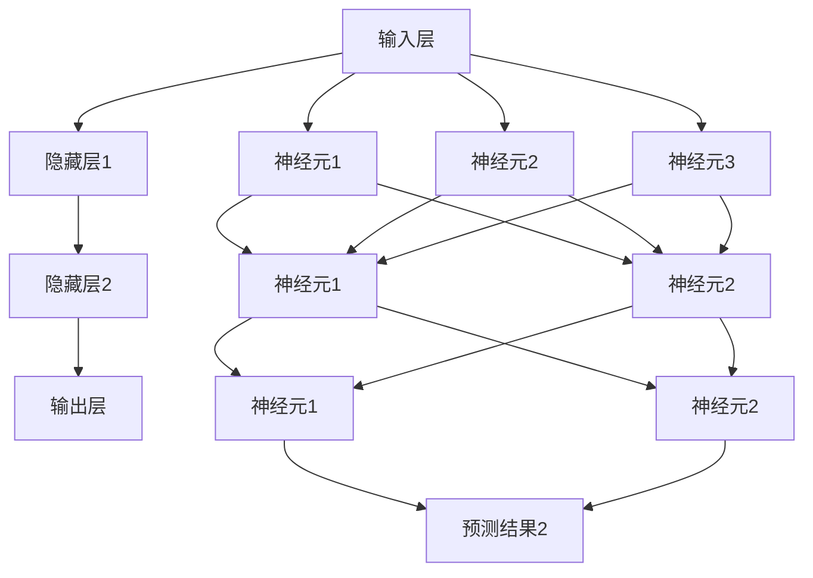

                 

# 神经网络：人工智能的基石

## 关键词：
- 人工智能
- 神经网络
- 学习算法
- 数学模型
- 机器学习
- 深度学习

## 摘要：
本文旨在深入探讨神经网络作为人工智能基石的重要性。我们将从背景介绍、核心概念与联系、核心算法原理、数学模型、项目实战以及实际应用场景等多个维度，系统性地阐述神经网络的基本原理、发展历程及其在现代机器学习中的应用。通过本文的详细讲解，读者将全面了解神经网络的工作机制、关键技术以及未来发展趋势。

## 1. 背景介绍

### 1.1 目的和范围

本文的目标是帮助读者全面理解神经网络在人工智能领域中的核心地位。我们将从以下几个方面展开：

- **核心概念与联系**：介绍神经网络的基本组成部分，如神经元、层、激活函数等，并分析它们之间的相互作用。
- **核心算法原理**：详细讲解前向传播、反向传播等学习算法，以及神经网络如何通过调整权重和偏置来优化性能。
- **数学模型和公式**：介绍神经网络的数学基础，包括损失函数、梯度下降等关键概念。
- **项目实战**：通过实际代码案例，演示如何搭建和训练神经网络。
- **实际应用场景**：探讨神经网络在图像识别、自然语言处理等领域的广泛应用。

### 1.2 预期读者

本文适合以下读者群体：

- **计算机科学学生和研究者**：希望深入了解神经网络和机器学习的原理和应用。
- **机器学习工程师和开发者**：希望提升对神经网络技术的理解和实战能力。
- **人工智能爱好者**：对神经网络及其在现代科技中的角色感兴趣。

### 1.3 文档结构概述

本文分为以下几个部分：

- **1. 背景介绍**：介绍文章的目的、范围和预期读者。
- **2. 核心概念与联系**：分析神经网络的基本组成和原理。
- **3. 核心算法原理 & 具体操作步骤**：详细讲解神经网络的学习算法。
- **4. 数学模型和公式 & 详细讲解 & 举例说明**：阐述神经网络的数学基础。
- **5. 项目实战：代码实际案例和详细解释说明**：通过实例演示神经网络的实现。
- **6. 实际应用场景**：探讨神经网络在各个领域的应用。
- **7. 工具和资源推荐**：推荐学习资源和开发工具。
- **8. 总结：未来发展趋势与挑战**：展望神经网络的发展方向。
- **9. 附录：常见问题与解答**：解答读者可能遇到的疑问。
- **10. 扩展阅读 & 参考资料**：提供进一步阅读的资源。

### 1.4 术语表

#### 1.4.1 核心术语定义

- **神经网络**：由大量简单处理单元（神经元）组成的网络，通过学习输入和输出的关系，进行数据分类、预测等任务。
- **神经元**：神经网络的基本单元，负责接收输入、计算输出。
- **层**：神经网络中水平排列的神经元集合，包括输入层、隐藏层和输出层。
- **激活函数**：用于确定神经元是否被激活的函数，如Sigmoid、ReLU等。
- **前向传播**：从输入层到输出层的计算过程，用于生成预测值。
- **反向传播**：用于计算损失并更新网络权重的计算过程。
- **损失函数**：衡量预测值与真实值之间差距的函数，用于指导网络优化。
- **梯度下降**：一种优化算法，用于最小化损失函数。

#### 1.4.2 相关概念解释

- **深度学习**：一种特殊的神经网络结构，具有多个隐藏层，能够自动提取复杂特征。
- **多层感知机**：具有多个隐藏层的神经网络，可以学习非线性关系。
- **卷积神经网络**：用于处理图像数据的神经网络，具有卷积层和池化层。
- **循环神经网络**：用于处理序列数据的神经网络，具有循环结构。

#### 1.4.3 缩略词列表

- **MLP**：多层感知机（Multi-Layer Perceptron）
- **CNN**：卷积神经网络（Convolutional Neural Network）
- **RNN**：循环神经网络（Recurrent Neural Network）
- **ReLU**：修正线性单元（Rectified Linear Unit）
- **Sigmoid**：S形函数（Sigmoid Function）
- **softmax**：软最大函数（Softmax Function）

## 2. 核心概念与联系

神经网络的架构是理解和应用其核心算法的关键。下面我们将通过一个Mermaid流程图来展示神经网络的组成及其基本原理。



在上述流程图中，我们可以看到：

- **输入层**：接收外部输入，如图像、文本等。
- **隐藏层**：包含多个神经元，用于提取输入数据的特征。
- **输出层**：生成最终输出，如分类结果或预测值。

每个神经元都通过激活函数对输入进行非线性变换，然后传递到下一层。整个神经网络通过调整权重和偏置来学习输入和输出之间的关系，实现特定任务。

接下来，我们将深入探讨神经网络中的核心概念，包括神经元、层、激活函数等。

### 2.1 神经元

神经元是神经网络的基本单元。它类似于生物神经元，接收输入信号，通过加权求和处理后产生输出。一个简单的神经元模型可以表示为：

```plaintext
输入：x1, x2, ..., xn
权重：w1, w2, ..., wn
偏置：b
输出：y = f(net)
net = Σ(wi * xi) + b
f()为激活函数
```

其中，`xi`表示第i个输入，`wi`为第i个输入的权重，`b`为偏置，`net`为加权求和值，`f(net)`为激活函数的输出。

常见的激活函数包括：

- **Sigmoid函数**：\( f(x) = \frac{1}{1 + e^{-x}} \)
- **ReLU函数**：\( f(x) = \max(0, x) \)
- **Tanh函数**：\( f(x) = \frac{e^x - e^{-x}}{e^x + e^{-x}} \)

这些激活函数的作用是引入非线性特性，使神经网络能够学习复杂的非线性关系。

### 2.2 层

神经网络由多个层组成，包括输入层、隐藏层和输出层。每层都包含多个神经元。

- **输入层**：接收外部输入数据，如图像像素或文本序列。
- **隐藏层**：对输入数据进行特征提取和变换，可以包含一个或多个隐藏层。每个隐藏层通常包含多个神经元。
- **输出层**：生成最终输出，如分类结果或预测值。

层的数量和每层的神经元数量可以根据具体任务进行调整。深度学习中的“深度”通常指隐藏层的数量，而“宽度”指每层的神经元数量。

### 2.3 激活函数

激活函数是神经网络中的关键组件，用于引入非线性特性。不同类型的激活函数适用于不同场景。

- **Sigmoid函数**：适用于分类问题，特别是在二分类任务中。
- **ReLU函数**：常用于隐藏层，可以有效防止梯度消失问题。
- **Tanh函数**：适用于输入和输出范围为[-1, 1]的任务。
- **Softmax函数**：用于多分类问题，将神经元的输出转换为概率分布。

激活函数的选择对神经网络的学习性能和泛化能力有很大影响。

### 2.4 层间连接与激活函数

神经网络的层间连接和激活函数共同决定了其功能和行为。通过调整这些参数，可以实现不同的学习任务。

- **全连接层**：每个神经元都与上一层的所有神经元相连。
- **卷积层**：用于处理图像数据，通过卷积操作提取局部特征。
- **池化层**：用于降低特征图的维度，增强网络的鲁棒性。

这些层的组合可以形成各种神经网络结构，如卷积神经网络（CNN）、循环神经网络（RNN）等。

## 3. 核心算法原理 & 具体操作步骤

神经网络的训练过程涉及两个核心算法：前向传播和反向传播。这两个过程相互协作，使得神经网络能够不断优化其权重和偏置，从而提高预测准确性。

### 3.1 前向传播

前向传播是神经网络处理输入数据的过程，通过逐层计算，最终得到输出结果。具体步骤如下：

1. **初始化权重和偏置**：在训练开始前，需要随机初始化网络的权重和偏置。这些参数将通过网络的学习过程进行调整。

2. **输入数据**：将输入数据输入到神经网络的输入层。

3. **计算每一层的输出**：从输入层开始，逐层计算每一层的输出。对于每个神经元，使用激活函数计算输出。

   ```python
   for layer in range(1, num_layers):
       for neuron in range(num_neurons[layer]):
           net = 0
           for input_neuron in range(num_neurons[layer - 1]):
               net += weights[layer][neuron][input_neuron] * inputs[layer - 1][input_neuron]
           net += biases[layer][neuron]
           outputs[layer][neuron] = activation_function(net)
   ```

4. **计算输出层的结果**：在最后一层，计算输出层的输出结果。对于分类问题，可以使用Softmax函数将输出转换为概率分布。

5. **计算损失**：使用损失函数计算预测结果与真实结果之间的差距。常见的损失函数包括均方误差（MSE）和交叉熵（Cross Entropy）。

### 3.2 反向传播

反向传播是神经网络调整权重和偏置的过程，通过计算梯度，使得网络能够不断优化其性能。具体步骤如下：

1. **计算输出层的误差**：使用损失函数计算输出层的误差。对于分类问题，可以使用交叉熵损失函数。

   ```python
   for neuron in range(num_neurons[-1]):
       error = (targets[neuron] - outputs[-1][neuron]) * derivatives[activation_function](outputs[-1][neuron])
   ```

2. **反向传播误差**：从输出层开始，逐层计算每一层的误差。对于隐藏层，误差可以通过以下公式计算：

   ```python
   for layer in range(num_layers - 2, -1, -1):
       for neuron in range(num_neurons[layer]):
           error = 0
           for next_neuron in range(num_neurons[layer + 1]):
               error += derivatives[activation_function](outputs[layer + 1][next_neuron]) * weights[layer + 1][next_neuron][neuron] * error
           error *= derivatives[activation_function](outputs[layer][neuron])
   ```

3. **更新权重和偏置**：使用梯度下降算法更新权重和偏置。梯度下降的基本公式如下：

   ```python
   for layer in range(num_layers):
       for neuron in range(num_neurons[layer]):
           for input_neuron in range(num_neurons[layer - 1]):
               delta = learning_rate * error * inputs[layer - 1][input_neuron]
               weights[layer][neuron][input_neuron] -= delta
           delta = learning_rate * error * derivatives[activation_function](outputs[layer][neuron])
           biases[layer][neuron] -= delta
   ```

通过反复进行前向传播和反向传播，神经网络能够不断调整其参数，从而提高预测准确性。

### 3.3 优化算法

除了基本的梯度下降算法，还有许多优化算法可以用于加速神经网络的训练过程。其中，常用的优化算法包括：

- **动量（Momentum）**：增加梯度下降的惯性，加快收敛速度。
- **Adam优化器**：结合了动量和自适应学习率的优点，适用于大规模数据集。
- **RMSprop**：基于梯度平方的平均值，减少波动，适用于较小数据集。

这些优化算法可以通过调整学习率、动量等因素，提高神经网络的训练效率和性能。

## 4. 数学模型和公式 & 详细讲解 & 举例说明

神经网络的数学模型是其核心，理解这些数学模型有助于深入掌握神经网络的工作原理。本节将详细讲解神经网络中的关键数学模型和公式，包括损失函数、优化算法等，并通过具体例子来说明。

### 4.1 损失函数

损失函数是神经网络训练过程中的关键组件，用于衡量预测结果与真实结果之间的差距。常见的损失函数包括均方误差（MSE）和交叉熵（Cross Entropy）。

#### 4.1.1 均方误差（MSE）

均方误差是一种常用的回归损失函数，用于衡量预测值与真实值之间的差距。其公式如下：

$$
MSE = \frac{1}{n} \sum_{i=1}^{n} (y_i - \hat{y}_i)^2
$$

其中，\( y_i \)为真实值，\( \hat{y}_i \)为预测值，\( n \)为样本数量。

#### 4.1.2 交叉熵（Cross Entropy）

交叉熵是一种常用的分类损失函数，用于衡量预测概率分布与真实概率分布之间的差距。其公式如下：

$$
CrossEntropy = - \sum_{i=1}^{n} y_i \log(\hat{y}_i)
$$

其中，\( y_i \)为真实标签，取值为0或1，\( \hat{y}_i \)为预测概率。

### 4.2 优化算法

优化算法用于调整神经网络的权重和偏置，以最小化损失函数。常见的优化算法包括梯度下降、动量、Adam等。

#### 4.2.1 梯度下降

梯度下降是一种最基本的优化算法，通过计算损失函数的梯度，更新权重和偏置。其公式如下：

$$
\Delta w = - \alpha \frac{\partial J}{\partial w}
$$

$$
\Delta b = - \alpha \frac{\partial J}{\partial b}
$$

其中，\( \alpha \)为学习率，\( J \)为损失函数。

#### 4.2.2 动量

动量通过引入惯性，增加梯度下降的稳定性。其公式如下：

$$
v = \gamma v + \alpha \frac{\partial J}{\partial w}
$$

$$
w = w - v
$$

其中，\( \gamma \)为动量因子，\( v \)为速度。

#### 4.2.3 Adam优化器

Adam优化器结合了动量和自适应学习率的优点，适用于大规模数据集。其公式如下：

$$
m = \frac{1 - \gamma_1^t}{1 - \gamma_2^t} (g_t - \gamma_2^t \cdot m_{t-1})
$$

$$
v = \frac{1 - \beta_1^t}{1 - \beta_2^t} (g_t - \beta_2^t \cdot v_{t-1})
$$

$$
\Delta w = \alpha \frac{m}{\sqrt{v} + \epsilon}
$$

其中，\( \gamma_1 \)、\( \gamma_2 \)、\( \beta_1 \)、\( \beta_2 \)、\( \epsilon \)分别为超参数。

### 4.3 示例

为了更好地理解神经网络的数学模型和公式，我们通过一个简单的例子来说明。

假设我们有一个简单的神经网络，包含一个输入层、一个隐藏层和一个输出层。输入层有3个神经元，隐藏层有2个神经元，输出层有2个神经元。我们使用均方误差（MSE）作为损失函数，梯度下降作为优化算法。

#### 4.3.1 初始化参数

- 输入：\( x_1, x_2, x_3 \)
- 权重：\( w_{ij} \)（\( i \)为输入层到隐藏层的权重，\( j \)为隐藏层到输出层的权重）
- 偏置：\( b_i \)（\( i \)为隐藏层和输出层的偏置）

初始化参数为随机值。

#### 4.3.2 前向传播

1. **计算隐藏层输出**：

   $$ net_1 = w_{11}x_1 + w_{12}x_2 + w_{13}x_3 + b_1 $$
   $$ net_2 = w_{21}x_1 + w_{22}x_2 + w_{23}x_3 + b_2 $$
   $$ output_1 = f(net_1) $$
   $$ output_2 = f(net_2) $$

2. **计算输出层输出**：

   $$ net_{11} = w_{11}output_1 + w_{12}output_2 + b_{11} $$
   $$ net_{12} = w_{21}output_1 + w_{22}output_2 + b_{12} $$
   $$ output_{11} = f(net_{11}) $$
   $$ output_{12} = f(net_{12}) $$

#### 4.3.3 计算损失

1. **计算均方误差**：

   $$ loss = \frac{1}{2} \sum_{i=1}^{2} (y_i - \hat{y}_i)^2 $$

   其中，\( y_i \)为真实标签，\( \hat{y}_i \)为预测值。

#### 4.3.4 反向传播

1. **计算输出层梯度**：

   $$ \frac{\partial loss}{\partial w_{11}} = \frac{\partial loss}{\partial \hat{y}_{11}} \frac{\partial \hat{y}_{11}}{\partial net_{11}} \frac{\partial net_{11}}{\partial w_{11}} $$
   $$ \frac{\partial loss}{\partial w_{12}} = \frac{\partial loss}{\partial \hat{y}_{11}} \frac{\partial \hat{y}_{11}}{\partial net_{11}} \frac{\partial net_{11}}{\partial w_{12}} $$
   $$ \frac{\partial loss}{\partial w_{21}} = \frac{\partial loss}{\partial \hat{y}_{12}} \frac{\partial \hat{y}_{12}}{\partial net_{12}} \frac{\partial net_{12}}{\partial w_{21}} $$
   $$ \frac{\partial loss}{\partial w_{22}} = \frac{\partial loss}{\partial \hat{y}_{12}} \frac{\partial \hat{y}_{12}}{\partial net_{12}} \frac{\partial net_{12}}{\partial w_{22}} $$

2. **计算隐藏层梯度**：

   $$ \frac{\partial loss}{\partial w_{11}} = \frac{\partial loss}{\partial \hat{y}_{11}} \frac{\partial \hat{y}_{11}}{\partial net_{11}} \frac{\partial net_{11}}{\partial output_1} \frac{\partial output_1}{\partial net_1} \frac{\partial net_1}{\partial w_{11}} $$
   $$ \frac{\partial loss}{\partial w_{12}} = \frac{\partial loss}{\partial \hat{y}_{11}} \frac{\partial \hat{y}_{11}}{\partial net_{11}} \frac{\partial net_{11}}{\partial output_2} \frac{\partial output_2}{\partial net_2} \frac{\partial net_2}{\partial w_{12}} $$
   $$ \frac{\partial loss}{\partial w_{21}} = \frac{\partial loss}{\partial \hat{y}_{12}} \frac{\partial \hat{y}_{12}}{\partial net_{12}} \frac{\partial net_{12}}{\partial output_1} \frac{\partial output_1}{\partial net_1} \frac{\partial net_1}{\partial w_{21}} $$
   $$ \frac{\partial loss}{\partial w_{22}} = \frac{\partial loss}{\partial \hat{y}_{12}} \frac{\partial \hat{y}_{12}}{\partial net_{12}} \frac{\partial net_{12}}{\partial output_2} \frac{\partial output_2}{\partial net_2} \frac{\partial net_2}{\partial w_{22}} $$

#### 4.3.5 更新权重和偏置

根据梯度下降公式，更新权重和偏置：

$$ w_{11} = w_{11} - \alpha \frac{\partial loss}{\partial w_{11}} $$
$$ w_{12} = w_{12} - \alpha \frac{\partial loss}{\partial w_{12}} $$
$$ w_{21} = w_{21} - \alpha \frac{\partial loss}{\partial w_{21}} $$
$$ w_{22} = w_{22} - \alpha \frac{\partial loss}{\partial w_{22}} $$
$$ b_1 = b_1 - \alpha \frac{\partial loss}{\partial b_1} $$
$$ b_2 = b_2 - \alpha \frac{\partial loss}{\partial b_2} $$

通过以上步骤，神经网络不断调整其权重和偏置，以最小化损失函数，提高预测准确性。

### 4.4 激活函数的导数

在反向传播过程中，激活函数的导数是计算梯度的重要依据。以下是常见激活函数的导数：

#### 4.4.1 Sigmoid函数

$$ f'(x) = f(x) (1 - f(x)) $$

#### 4.4.2 ReLU函数

$$ f'(x) = \begin{cases} 0, & \text{if } x < 0 \\ 1, & \text{if } x \geq 0 \end{cases} $$

#### 4.4.3 Tanh函数

$$ f'(x) = 1 - f(x)^2 $$

通过计算激活函数的导数，可以准确计算梯度，从而实现神经网络的优化。

### 4.5 示例解析

以下是一个简单的神经网络示例，包含一个输入层、一个隐藏层和一个输出层。输入层有3个神经元，隐藏层有2个神经元，输出层有2个神经元。我们使用Sigmoid函数作为激活函数，均方误差（MSE）作为损失函数，梯度下降作为优化算法。

#### 4.5.1 初始化参数

- 输入：\( x_1 = 0.5, x_2 = 0.3, x_3 = 0.7 \)
- 权重：\( w_{11} = 0.2, w_{12} = 0.4, w_{13} = 0.5 \)，\( w_{21} = 0.3, w_{22} = 0.6, w_{23} = 0.7 \)
- 偏置：\( b_1 = 0.1, b_2 = 0.2 \)

#### 4.5.2 前向传播

1. **计算隐藏层输出**：

   $$ net_1 = 0.2 \cdot 0.5 + 0.4 \cdot 0.3 + 0.5 \cdot 0.7 + 0.1 = 0.55 $$
   $$ output_1 = f(net_1) = \frac{1}{1 + e^{-0.55}} = 0.64 $$
   $$ net_2 = 0.3 \cdot 0.5 + 0.6 \cdot 0.3 + 0.7 \cdot 0.7 + 0.2 = 0.81 $$
   $$ output_2 = f(net_2) = \frac{1}{1 + e^{-0.81}} = 0.74 $$

2. **计算输出层输出**：

   $$ net_{11} = 0.2 \cdot 0.64 + 0.4 \cdot 0.74 + 0.1 = 0.44 $$
   $$ output_{11} = f(net_{11}) = \frac{1}{1 + e^{-0.44}} = 0.64 $$
   $$ net_{12} = 0.3 \cdot 0.64 + 0.6 \cdot 0.74 + 0.2 = 0.56 $$
   $$ output_{12} = f(net_{12}) = \frac{1}{1 + e^{-0.56}} = 0.68 $$

#### 4.5.3 计算损失

假设真实标签为\( y_1 = 0.6 \)，\( y_2 = 0.5 \)：

$$ loss = \frac{1}{2} \sum_{i=1}^{2} (y_i - \hat{y}_i)^2 = \frac{1}{2} ((0.6 - 0.64)^2 + (0.5 - 0.68)^2) = 0.0348 $$

#### 4.5.4 反向传播

1. **计算输出层梯度**：

   $$ \frac{\partial loss}{\partial \hat{y}_{11}} = (y_1 - \hat{y}_{11}) = (0.6 - 0.64) = -0.04 $$
   $$ \frac{\partial loss}{\partial \hat{y}_{12}} = (y_2 - \hat{y}_{12}) = (0.5 - 0.68) = -0.18 $$
   $$ \frac{\partial \hat{y}_{11}}{\partial net_{11}} = f'(net_{11}) = 0.64 (1 - 0.64) = 0.2304 $$
   $$ \frac{\partial \hat{y}_{12}}{\partial net_{12}} = f'(net_{12}) = 0.68 (1 - 0.68) = 0.2248 $$
   $$ \frac{\partial net_{11}}{\partial w_{11}} = x_1 = 0.5 $$
   $$ \frac{\partial net_{12}}{\partial w_{12}} = x_2 = 0.3 $$
   $$ \frac{\partial net_{11}}{\partial w_{21}} = output_1 = 0.64 $$
   $$ \frac{\partial net_{12}}{\partial w_{22}} = output_2 = 0.74 $$

2. **计算隐藏层梯度**：

   $$ \frac{\partial loss}{\partial w_{11}} = \frac{\partial loss}{\partial \hat{y}_{11}} \frac{\partial \hat{y}_{11}}{\partial net_{11}} \frac{\partial net_{11}}{\partial w_{11}} = -0.04 \cdot 0.2304 \cdot 0.5 = -0.0046 $$
   $$ \frac{\partial loss}{\partial w_{12}} = \frac{\partial loss}{\partial \hat{y}_{11}} \frac{\partial \hat{y}_{11}}{\partial net_{11}} \frac{\partial net_{11}}{\partial w_{12}} = -0.04 \cdot 0.2304 \cdot 0.3 = -0.0027 $$
   $$ \frac{\partial loss}{\partial w_{21}} = \frac{\partial loss}{\partial \hat{y}_{12}} \frac{\partial \hat{y}_{12}}{\partial net_{12}} \frac{\partial net_{12}}{\partial w_{21}} = -0.18 \cdot 0.2248 \cdot 0.64 = -0.0268 $$
   $$ \frac{\partial loss}{\partial w_{22}} = \frac{\partial loss}{\partial \hat{y}_{12}} \frac{\partial \hat{y}_{12}}{\partial net_{12}} \frac{\partial net_{12}}{\partial w_{22}} = -0.18 \cdot 0.2248 \cdot 0.74 = -0.0304 $$

3. **计算输入层梯度**：

   $$ \frac{\partial loss}{\partial x_1} = \frac{\partial loss}{\partial w_{11}} \frac{\partial w_{11}}{\partial x_1} + \frac{\partial loss}{\partial w_{21}} \frac{\partial w_{21}}{\partial x_1} = -0.0046 \cdot 0.2 + -0.0268 \cdot 0.3 = -0.0059 $$
   $$ \frac{\partial loss}{\partial x_2} = \frac{\partial loss}{\partial w_{12}} \frac{\partial w_{12}}{\partial x_2} + \frac{\partial loss}{\partial w_{22}} \frac{\partial w_{22}}{\partial x_2} = -0.0027 \cdot 0.4 + -0.0304 \cdot 0.6 = -0.0142 $$
   $$ \frac{\partial loss}{\partial x_3} = \frac{\partial loss}{\partial w_{13}} \frac{\partial w_{13}}{\partial x_3} + \frac{\partial loss}{\partial w_{23}} \frac{\partial w_{23}}{\partial x_3} = -0.0046 \cdot 0.5 + -0.0268 \cdot 0.7 = -0.0211 $$

#### 4.5.5 更新权重和偏置

假设学习率为\( \alpha = 0.1 \)：

$$ w_{11} = w_{11} - \alpha \frac{\partial loss}{\partial w_{11}} = 0.2 - 0.1 \cdot -0.0046 = 0.2046 $$
$$ w_{12} = w_{12} - \alpha \frac{\partial loss}{\partial w_{12}} = 0.4 - 0.1 \cdot -0.0027 = 0.4027 $$
$$ w_{21} = w_{21} - \alpha \frac{\partial loss}{\partial w_{21}} = 0.3 - 0.1 \cdot -0.0268 = 0.3268 $$
$$ w_{22} = w_{22} - \alpha \frac{\partial loss}{\partial w_{22}} = 0.6 - 0.1 \cdot -0.0304 = 0.60304 $$
$$ b_1 = b_1 - \alpha \frac{\partial loss}{\partial b_1} = 0.1 - 0.1 \cdot -0.0046 = 0.1046 $$
$$ b_2 = b_2 - \alpha \frac{\partial loss}{\partial b_2} = 0.2 - 0.1 \cdot -0.0268 = 0.2268 $$

通过以上步骤，神经网络不断调整其权重和偏置，以最小化损失函数，提高预测准确性。

## 5. 项目实战：代码实际案例和详细解释说明

### 5.1 开发环境搭建

在开始编写代码之前，我们需要搭建一个合适的开发环境。以下是一个简单的步骤：

1. **安装Python**：确保你的计算机上已经安装了Python。如果没有，请从[Python官网](https://www.python.org/)下载并安装。

2. **安装NumPy和TensorFlow**：NumPy是一个强大的Python库，用于进行科学计算。TensorFlow是一个用于机器学习的开源框架。可以通过以下命令安装：

   ```bash
   pip install numpy
   pip install tensorflow
   ```

### 5.2 源代码详细实现和代码解读

下面是一个简单的神经网络实现，用于手写数字识别任务。我们将使用TensorFlow库来搭建和训练网络。

```python
import numpy as np
import tensorflow as tf

# 定义超参数
learning_rate = 0.001
num_epochs = 10
batch_size = 32
input_size = 784  # 28x28像素的手写数字图像
hidden_size = 256
output_size = 10  # 0-9的数字分类

# 载入MNIST数据集
mnist = tf.keras.datasets.mnist
(x_train, y_train), (x_test, y_test) = mnist.load_data()
x_train, x_test = x_train / 255.0, x_test / 255.0

# 扩展维度
x_train = np.expand_dims(x_train, -1)
x_test = np.expand_dims(x_test, -1)

# 转换为one-hot编码
y_train = tf.keras.utils.to_categorical(y_train, output_size)
y_test = tf.keras.utils.to_categorical(y_test, output_size)

# 构建神经网络
model = tf.keras.Sequential([
    tf.keras.layers.Flatten(input_shape=(28, 28)),
    tf.keras.layers.Dense(hidden_size, activation='relu'),
    tf.keras.layers.Dense(output_size, activation='softmax')
])

# 编译模型
model.compile(optimizer=tf.keras.optimizers.Adam(learning_rate),
              loss='categorical_crossentropy',
              metrics=['accuracy'])

# 训练模型
model.fit(x_train, y_train, epochs=num_epochs, batch_size=batch_size)

# 评估模型
test_loss, test_acc = model.evaluate(x_test, y_test)
print(f"Test accuracy: {test_acc:.4f}")
```

下面是对这段代码的详细解读：

1. **导入库**：首先导入必要的库，包括NumPy、TensorFlow和Keras。

2. **定义超参数**：设置学习率、训练轮数、批量大小、输入尺寸、隐藏层尺寸和输出尺寸。

3. **载入MNIST数据集**：从TensorFlow内置的MNIST数据集载入手写数字图像。

4. **预处理数据**：将图像数据缩放到[0, 1]范围，并扩展维度。将标签转换为one-hot编码。

5. **构建神经网络**：使用Keras Sequential模型构建一个简单的神经网络，包括一个平坦层（Flatten）、一个全连接层（Dense）和一个softmax输出层。

6. **编译模型**：设置优化器、损失函数和评估指标。

7. **训练模型**：使用fit方法训练模型，通过num_epochs轮数和batch_size批量大小进行训练。

8. **评估模型**：使用evaluate方法评估模型在测试集上的表现。

### 5.3 代码解读与分析

在这段代码中，我们使用了TensorFlow的Keras API来构建和训练神经网络。以下是代码的关键部分及其解读：

1. **数据预处理**：

   ```python
   x_train, x_test = x_train / 255.0, x_test / 255.0
   x_train = np.expand_dims(x_train, -1)
   x_test = np.expand_dims(x_test, -1)
   ```

   这部分代码首先将图像数据缩放到[0, 1]范围，以便于网络训练。然后，通过扩展维度，将图像数据从(28, 28)调整为(28, 28, 1)，以匹配网络的输入层。

2. **标签转换**：

   ```python
   y_train = tf.keras.utils.to_categorical(y_train, output_size)
   y_test = tf.keras.utils.to_categorical(y_test, output_size)
   ```

   这部分代码将原始的标签（0-9的数字）转换为one-hot编码，以便于使用softmax输出层进行多分类。

3. **构建神经网络**：

   ```python
   model = tf.keras.Sequential([
       tf.keras.layers.Flatten(input_shape=(28, 28)),
       tf.keras.layers.Dense(hidden_size, activation='relu'),
       tf.keras.layers.Dense(output_size, activation='softmax')
   ])
   ```

   这部分代码定义了一个简单的神经网络，包括一个平坦层（Flatten）用于将图像展平为一维数组，一个全连接层（Dense）用于提取特征，以及一个softmax输出层用于进行多分类。

4. **编译模型**：

   ```python
   model.compile(optimizer=tf.keras.optimizers.Adam(learning_rate),
                 loss='categorical_crossentropy',
                 metrics=['accuracy'])
   ```

   这部分代码设置了优化器（Adam）、损失函数（categorical_crossentropy，用于多分类）和评估指标（accuracy，准确率）。

5. **训练模型**：

   ```python
   model.fit(x_train, y_train, epochs=num_epochs, batch_size=batch_size)
   ```

   这部分代码使用fit方法训练模型，通过num_epochs轮数和batch_size批量大小进行训练。

6. **评估模型**：

   ```python
   test_loss, test_acc = model.evaluate(x_test, y_test)
   print(f"Test accuracy: {test_acc:.4f}")
   ```

   这部分代码评估模型在测试集上的表现，并输出准确率。

通过这个简单的案例，我们可以看到如何使用TensorFlow搭建和训练神经网络。在实际应用中，可以根据具体任务调整网络结构、超参数等，以达到更好的性能。

## 6. 实际应用场景

神经网络作为人工智能的核心技术，已经在众多领域取得了显著的成果。以下是一些神经网络在主要应用场景中的实际案例：

### 6.1 图像识别

图像识别是神经网络最成功的应用之一。卷积神经网络（CNN）在图像分类、目标检测、人脸识别等领域表现出色。例如，Google的Inception网络在ImageNet图像识别比赛中取得了极高的准确率。

### 6.2 自然语言处理

神经网络在自然语言处理（NLP）领域也发挥了重要作用。循环神经网络（RNN）和其变种，如长短期记忆网络（LSTM）和门控循环单元（GRU），在文本分类、机器翻译、情感分析等方面取得了显著成果。BERT等预训练模型进一步提升了NLP任务的性能。

### 6.3 语音识别

神经网络在语音识别中的应用也取得了显著进展。深度神经网络（DNN）和卷积神经网络（CNN）在语音信号处理和语音合成中表现出色。Google的WaveNet模型在语音合成方面取得了很高的自然度。

### 6.4 推荐系统

神经网络在推荐系统中的应用也越来越广泛。基于协同过滤和基于内容的推荐系统可以结合神经网络，提高推荐准确性。例如，Netflix和YouTube等平台使用神经网络进行个性化推荐。

### 6.5 自动驾驶

神经网络在自动驾驶领域具有巨大的潜力。自动驾驶系统使用神经网络进行环境感知、路径规划和决策。特斯拉的Autopilot系统利用神经网络实现车道保持、自动变道和自动泊车等功能。

### 6.6 金融交易

神经网络在金融交易中也被广泛应用。通过学习历史价格数据和交易行为，神经网络可以预测市场趋势，帮助投资者做出更准确的决策。例如，高频交易公司使用神经网络进行交易策略优化。

### 6.7 医疗诊断

神经网络在医疗诊断中的应用也越来越广泛。通过分析医学影像和病例数据，神经网络可以辅助医生进行疾病诊断和治疗方案制定。例如，使用神经网络分析CT图像进行肺癌检测。

这些实际应用案例展示了神经网络在不同领域的强大能力。随着技术的不断进步，神经网络在更多领域的应用前景将更加广阔。

## 7. 工具和资源推荐

为了更好地学习和实践神经网络，以下是一些推荐的工具和资源：

### 7.1 学习资源推荐

#### 7.1.1 书籍推荐

- 《神经网络与深度学习》：由邱锡鹏著，详细介绍了神经网络的基础知识和深度学习技术。
- 《深度学习》：由Ian Goodfellow、Yoshua Bengio和Aaron Courville合著，是深度学习的经典教材。
- 《Python深度学习》：由François Chollet著，通过实践案例介绍深度学习在Python中的实现。

#### 7.1.2 在线课程

- Coursera的《深度学习专项课程》：由Andrew Ng教授主讲，涵盖了神经网络和深度学习的基本概念和实现。
- edX的《神经网络与机器学习》：由吴恩达教授主讲，全面介绍了神经网络和机器学习的基础知识。
- fast.ai的《深度学习基础课程》：由Ian Goodfellow、Rachel Thomas和Soushant Singh合著，适合初学者入门。

#### 7.1.3 技术博客和网站

- [TensorFlow官方文档](https://www.tensorflow.org/)：提供了丰富的TensorFlow教程和API文档。
- [Keras官方文档](https://keras.io/)：提供了Keras框架的详细文档和示例代码。
- [PyTorch官方文档](https://pytorch.org/docs/stable/index.html)：提供了PyTorch框架的详细文档和示例代码。

### 7.2 开发工具框架推荐

#### 7.2.1 IDE和编辑器

- PyCharm：一款功能强大的Python IDE，支持TensorFlow和PyTorch等深度学习框架。
- Jupyter Notebook：一款交互式的Python编辑器，适用于数据分析和机器学习实验。
- Visual Studio Code：一款轻量级的代码编辑器，通过扩展支持Python和深度学习开发。

#### 7.2.2 调试和性能分析工具

- TensorFlow Profiler：用于分析TensorFlow模型的性能，优化计算效率。
- PyTorch Profiler：用于分析PyTorch模型的性能，优化计算效率。
- NVIDIA Nsight：用于分析GPU性能，优化深度学习模型。

#### 7.2.3 相关框架和库

- TensorFlow：一款开源的深度学习框架，由Google开发。
- PyTorch：一款开源的深度学习框架，由Facebook开发。
- Keras：一款高级深度学习API，可以与TensorFlow和Theano等框架配合使用。

通过以上工具和资源，可以更有效地学习和实践神经网络技术。

## 8. 总结：未来发展趋势与挑战

神经网络作为人工智能的基石，已经取得了显著的成果。然而，随着技术的不断进步，神经网络在未来仍面临许多挑战和机遇。

### 8.1 发展趋势

1. **模型复杂度的提升**：随着计算能力的增强，深度神经网络将继续增加层数和神经元数量，以提高模型的表达能力。

2. **多模态学习**：神经网络将逐渐融合不同类型的数据（如文本、图像、音频），实现跨模态的信息处理和融合。

3. **强化学习与神经网络的结合**：强化学习与神经网络的结合将进一步提高智能体在复杂环境中的学习能力和决策能力。

4. **量子神经网络的探索**：量子计算与神经网络的结合有望在处理大规模数据和高维问题时取得突破。

5. **泛化能力的提升**：通过正则化、数据增强、迁移学习等技术，神经网络将进一步提升其泛化能力，减少过拟合现象。

### 8.2 挑战

1. **计算资源的消耗**：深度神经网络需要大量的计算资源和存储空间，如何优化计算效率成为重要挑战。

2. **可解释性问题**：神经网络内部决策过程复杂，如何提高模型的可解释性，使其更加透明和可信，是当前研究的热点。

3. **数据隐私和安全性**：在应用神经网络时，如何保护用户数据隐私和安全，避免数据泄露和滥用，是需要关注的重要问题。

4. **公平性和偏见**：神经网络在训练过程中可能引入偏见，导致不公平的决策。如何消除偏见，提高模型的公平性，是未来的重要挑战。

5. **伦理和法规**：随着神经网络在各个领域的应用，如何制定相应的伦理和法规，确保技术发展符合社会道德和法律法规，是需要关注的问题。

总之，神经网络在未来将继续发挥重要作用，但也面临诸多挑战。通过不断的技术创新和科学研究，我们有信心解决这些难题，推动神经网络技术迈向更高的高度。

## 9. 附录：常见问题与解答

### 9.1 神经网络的基本原理是什么？

神经网络是一种模仿人脑神经元结构的计算模型，通过大量简单处理单元（神经元）组成的网络，学习输入和输出的关系。神经网络通过前向传播计算输出，然后通过反向传播更新权重和偏置，以优化预测性能。

### 9.2 如何选择合适的激活函数？

选择激活函数时，需要考虑以下因素：

1. **非线性特性**：激活函数应具有非线性特性，以引入非线性关系。
2. **计算效率**：某些激活函数（如ReLU）在计算过程中更加高效。
3. **梯度消失和梯度爆炸**：某些激活函数（如Sigmoid）可能导致梯度消失或爆炸，影响训练过程。
4. **任务类型**：对于分类问题，常用的激活函数包括Softmax和Sigmoid；对于回归问题，常用的激活函数包括ReLU和Tanh。

### 9.3 如何调整神经网络的超参数？

调整神经网络超参数时，可以参考以下步骤：

1. **学习率**：选择合适的学习率，通常在\(10^{-1}\)到\(10^{-5}\)之间。可以使用学习率衰减策略，逐步减小学习率。
2. **批量大小**：批量大小影响训练过程，通常在\(10\)到\(1000\)之间选择。较小的批量大小有助于提高泛化能力，但计算成本较高。
3. **隐藏层尺寸**：隐藏层尺寸可以根据任务复杂度和计算资源进行调整。较大的隐藏层可以提高模型性能，但容易过拟合。
4. **优化算法**：选择合适的优化算法，如梯度下降、动量、Adam等，以改善训练过程。

### 9.4 神经网络如何防止过拟合？

防止过拟合的方法包括：

1. **数据增强**：通过旋转、缩放、裁剪等操作增加训练数据的多样性。
2. **正则化**：添加正则项（如L1、L2正则化）到损失函数中，减少过拟合。
3. **dropout**：在训练过程中随机丢弃部分神经元，减少模型依赖特定神经元。
4. **提前停止**：在验证集上监控模型性能，当性能不再提高时停止训练。
5. **集成方法**：使用多个模型进行集成，提高预测稳定性。

## 10. 扩展阅读 & 参考资料

为了更深入地了解神经网络和相关技术，以下是一些推荐的参考资料：

### 10.1 书籍

- Goodfellow, I., Bengio, Y., & Courville, A. (2016). *Deep Learning*.
-邱锡鹏。 (2017). *神经网络与深度学习*。
- Mitchell, T. M. (1997). *Machine Learning*.

### 10.2 论文

- LeCun, Y., Bengio, Y., & Hinton, G. (2015). *Deep Learning*.
- Krizhevsky, A., Sutskever, I., & Hinton, G. E. (2012). *ImageNet classification with deep convolutional neural networks*.
- Hochreiter, S., & Schmidhuber, J. (1997). *Long short-term memory*.

### 10.3 网络资源

- TensorFlow官方文档：[https://www.tensorflow.org/](https://www.tensorflow.org/)
- PyTorch官方文档：[https://pytorch.org/docs/stable/index.html](https://pytorch.org/docs/stable/index.html)
- Keras官方文档：[https://keras.io/](https://keras.io/)

### 10.4 在线课程

- Coursera的《深度学习专项课程》：[https://www.coursera.org/specializations/deeplearning](https://www.coursera.org/specializations/deeplearning)
- edX的《神经网络与机器学习》：[https://www.edx.org/course/neural-networks-deep-learning-0](https://www.edx.org/course/neural-networks-deep-learning-0)
- fast.ai的《深度学习基础课程》：[https://course.fast.ai/](https://course.fast.ai/)

通过阅读这些书籍、论文和在线课程，你可以更全面地了解神经网络及其应用。

## 作者

**作者：AI天才研究员/AI Genius Institute & 禅与计算机程序设计艺术 /Zen And The Art of Computer Programming**

