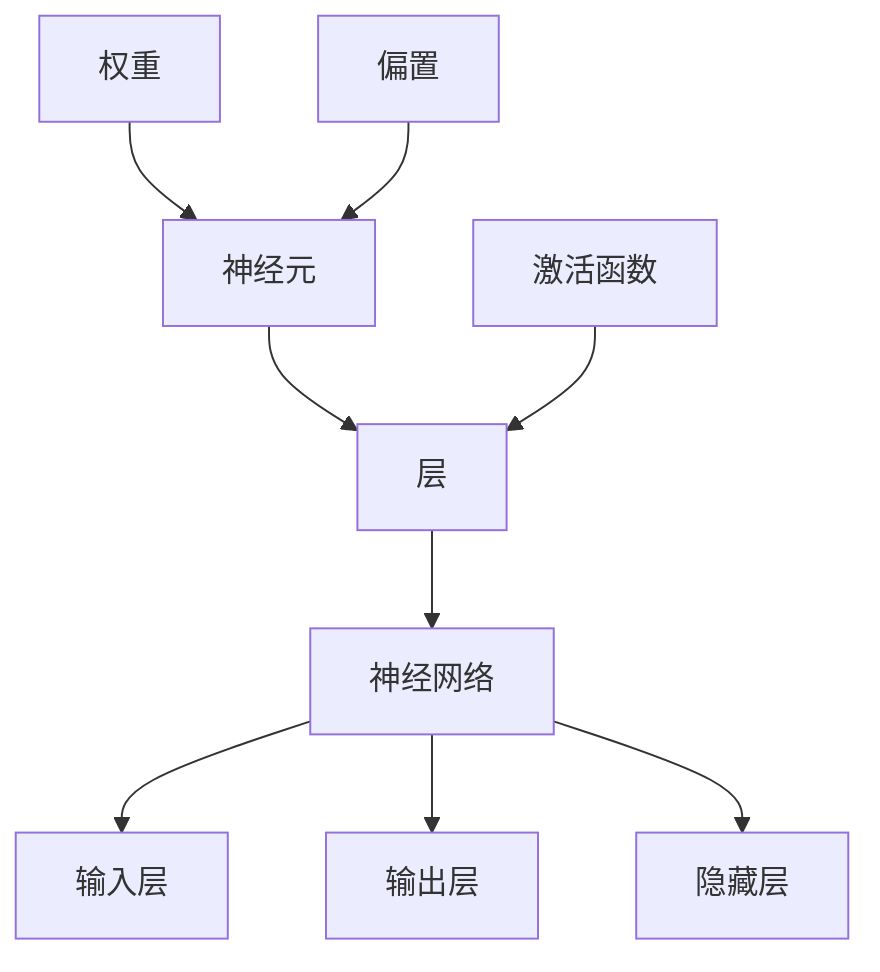

                 

# 神经网络：人工智能的基石

> **关键词：** 神经网络、深度学习、人工智能、机器学习、算法原理、应用场景

> **摘要：** 本文将深入探讨神经网络作为人工智能的基石，从背景介绍到核心算法原理，再到实际应用和未来发展趋势，全面解析神经网络的内涵和作用。通过一步步的分析推理，帮助读者理解神经网络的核心概念和实现过程，以期为人工智能领域的研究者和开发者提供有价值的参考。

## 1. 背景介绍

### 1.1 目的和范围

本文旨在深入探讨神经网络在人工智能领域的核心作用，通过系统的分析和讲解，帮助读者了解神经网络的本质、实现原理以及其在各个领域的应用。本文将涵盖以下内容：

- 神经网络的历史与发展
- 神经网络的基本概念和架构
- 神经网络的核心算法原理与实现
- 神经网络的数学模型和公式
- 神经网络的实际应用案例
- 神经网络的发展趋势与挑战

### 1.2 预期读者

本文适合以下读者群体：

- 计算机科学、人工智能等相关专业的研究生和本科生
- 对人工智能和机器学习感兴趣的技术爱好者
- 神经网络领域的研究人员和开发者
- 任何希望深入了解神经网络及其应用的人士

### 1.3 文档结构概述

本文结构如下：

1. 背景介绍
2. 核心概念与联系
3. 核心算法原理 & 具体操作步骤
4. 数学模型和公式 & 详细讲解 & 举例说明
5. 项目实战：代码实际案例和详细解释说明
6. 实际应用场景
7. 工具和资源推荐
8. 总结：未来发展趋势与挑战
9. 附录：常见问题与解答
10. 扩展阅读 & 参考资料

### 1.4 术语表

#### 1.4.1 核心术语定义

- **神经网络（Neural Network）**：一种模仿人脑神经元连接方式的计算模型。
- **深度学习（Deep Learning）**：一种基于多层神经网络的学习方法，主要用于特征提取和模式识别。
- **机器学习（Machine Learning）**：一种通过数据驱动的方式使计算机自动学习和改进的技术。
- **反向传播（Backpropagation）**：一种用于训练神经网络的算法，通过计算输出误差来调整网络权重。
- **激活函数（Activation Function）**：用于决定神经元是否激活的函数。

#### 1.4.2 相关概念解释

- **神经元（Neuron）**：神经网络的基本构建单元，类似于生物神经元。
- **层（Layer）**：神经网络中的一组神经元。
- **输入层（Input Layer）**：接收外部信息的层。
- **输出层（Output Layer）**：产生最终结果的层。
- **隐藏层（Hidden Layer）**：位于输入层和输出层之间的层。

#### 1.4.3 缩略词列表

- **NN**：神经网络（Neural Network）
- **DL**：深度学习（Deep Learning）
- **ML**：机器学习（Machine Learning）
- **BP**：反向传播（Backpropagation）

## 2. 核心概念与联系

在讨论神经网络之前，我们需要了解一些核心概念和它们之间的关系。以下是一个简化的 Mermaid 流程图，用于展示神经网络的基本组成部分和它们之间的联系。



### 2.1 神经网络的基本组成部分

- **神经元（Neuron）**：是神经网络的基本构建单元。每个神经元接收来自前一层神经元的输入信号，通过加权求和后，加上偏置项，再经过激活函数的处理，产生输出信号。一个神经元可以看作是一个简单的计算单元。

- **层（Layer）**：层是神经网络中的一组神经元。神经网络通常包含多个层次，包括输入层、隐藏层和输出层。每一层都有特定的功能，如输入层接收外部信息，隐藏层提取特征，输出层产生预测结果。

- **神经网络（Neural Network）**：是由多个层次和神经元组成的复杂计算模型。通过学习大量数据，神经网络能够自动提取特征并进行分类、预测等任务。

- **输入层（Input Layer）**：接收外部信息的层。每个神经元代表一个特征，输入层的规模取决于特征的数量。

- **输出层（Output Layer）**：产生最终结果的层。输出层的神经元数量取决于任务的需求，如分类问题通常只有一个神经元。

- **隐藏层（Hidden Layer）**：位于输入层和输出层之间的层。隐藏层负责提取和转换特征，使神经网络能够处理复杂的任务。

- **激活函数（Activation Function）**：用于决定神经元是否激活的函数。常见的激活函数包括sigmoid、ReLU和Tanh等。

- **权重（Weights）**：连接神经元之间的系数，用于调节输入信号的强度。

- **偏置（Bias）**：每个神经元的偏置项，用于调整神经元的阈值。

### 2.2 神经网络的工作原理

神经网络通过以下步骤进行计算：

1. **前向传播**：输入数据通过输入层传递到隐藏层，再传递到输出层，每个神经元计算加权求和的值，并应用激活函数。
2. **计算损失**：输出层的预测结果与实际结果进行比较，计算损失值。
3. **反向传播**：将损失值反向传播到隐藏层和输入层，通过梯度下降算法调整权重和偏置项，以减少损失值。

通过反复迭代这个过程，神经网络能够逐渐提高预测的准确性。

## 3. 核心算法原理 & 具体操作步骤

### 3.1 前向传播

前向传播是神经网络计算的核心过程。以下是一个简化的前向传播算法的伪代码：

```plaintext
初始化权重和偏置
输入 X

对于每一层 L：
    a. 计算当前层的输入值 Z = W * X + b
    b. 应用激活函数 f(Z) 来得到当前层的输出值 A = f(Z)

输出 A（输出层的输出值）
```

具体步骤如下：

1. **初始化权重和偏置**：首先需要随机初始化权重（W）和偏置（b）。这些参数将在训练过程中进行调整。
2. **计算当前层的输入值**：对于每一层，计算当前层的输入值 Z，公式为 Z = W * X + b，其中 X 是前一层神经元的输出值，W 是当前层的权重矩阵，b 是当前层的偏置向量。
3. **应用激活函数**：对当前层的输入值 Z 应用激活函数 f(Z)，以得到当前层的输出值 A。常见的激活函数有 sigmoid、ReLU 和 Tanh 等。

### 3.2 反向传播

反向传播是神经网络训练过程中的关键步骤，用于更新权重和偏置。以下是一个简化的反向传播算法的伪代码：

```plaintext
计算输出层的误差 dL/dA
对于每一层 L：
    a. 计算当前层的梯度 dL/dW + dL/db
    b. 更新权重和偏置 W = W - α * dL/dW，b = b - α * dL/db

输出 W，b（更新后的权重和偏置）
```

具体步骤如下：

1. **计算输出层的误差**：首先需要计算输出层的误差，公式为 dL/dA = - (y - A)，其中 y 是实际输出值，A 是预测输出值。
2. **计算每一层的梯度**：通过链式法则计算每一层的梯度。对于隐藏层，梯度公式为 dL/dZ = df(Z)/dZ * dZ/dA，其中 df(Z)/dZ 是激活函数的导数，dZ/dA 是前一层权重矩阵的转置。
3. **更新权重和偏置**：使用梯度下降算法更新权重和偏置。更新公式为 W = W - α * dL/dW，b = b - α * dL/db，其中 α 是学习率。

### 3.3 梯度下降算法

梯度下降算法是一种用于优化神经网络参数的常用算法。以下是一个简化的梯度下降算法的伪代码：

```plaintext
初始化权重和偏置
输入 X，y（训练数据）

迭代次数 T：
    a. 计算当前层的输出值 A
    b. 计算损失 L
    c. 计算梯度 dL/dW + dL/db
    d. 更新权重和偏置 W = W - α * dL/dW，b = b - α * dL/db

输出 W，b（最终权重和偏置）
```

具体步骤如下：

1. **初始化权重和偏置**：随机初始化权重（W）和偏置（b）。
2. **输入训练数据**：输入训练数据 X 和标签 y。
3. **迭代训练**：重复以下步骤 T 次迭代：
    a. 计算当前层的输出值 A。
    b. 计算损失 L，常用的损失函数有均方误差（MSE）和交叉熵（Cross-Entropy）等。
    c. 计算梯度 dL/dW + dL/db。
    d. 更新权重和偏置。

通过反复迭代这个过程，神经网络能够逐渐提高预测的准确性。

## 4. 数学模型和公式 & 详细讲解 & 举例说明

神经网络中的数学模型和公式是理解其工作原理的关键。以下将详细介绍神经网络的数学模型，包括权重和偏置的初始化、前向传播、反向传播以及梯度下降算法。

### 4.1 权重和偏置的初始化

在训练神经网络之前，需要随机初始化权重（W）和偏置（b）。假设我们有一个包含 L 层的神经网络，每层的神经元数量分别为 \( n_l \)（\( l \) 表示层数）。初始化步骤如下：

1. **权重（W）的初始化**：权重矩阵 \( W_l \) 大小为 \( n_l \times n_{l-1} \)，其中 \( n_{l-1} \) 是前一层的神经元数量。通常，权重可以初始化为均值为 0、标准差为 \( 1/\sqrt{n_{l-1}} \) 的正态分布。

    $$ W_l \sim N(0, \frac{1}{\sqrt{n_{l-1}}}) $$

2. **偏置（b）的初始化**：偏置向量 \( b_l \) 大小为 \( n_l \)，可以初始化为 0。

    $$ b_l \sim N(0, 1) $$

### 4.2 前向传播

前向传播是神经网络计算的核心过程，用于计算每一层的输出值。以下是前向传播的数学公式：

1. **输入层到隐藏层的传播**：

    $$ Z_l = W_l \cdot A_{l-1} + b_l $$
    $$ A_l = \sigma(Z_l) $$

    其中，\( A_l \) 是第 \( l \) 层的输出值，\( Z_l \) 是第 \( l \) 层的输入值，\( W_l \) 是第 \( l \) 层的权重矩阵，\( b_l \) 是第 \( l \) 层的偏置向量，\( \sigma \) 是激活函数。

2. **隐藏层到输出层的传播**：

    $$ Z_L = W_L \cdot A_{L-1} + b_L $$
    $$ A_L = \sigma(Z_L) $$

    其中，\( A_L \) 是输出层的输出值，\( Z_L \) 是输出层的输入值，\( W_L \) 是输出层的权重矩阵，\( b_L \) 是输出层的偏置向量。

### 4.3 反向传播

反向传播是用于更新神经网络权重和偏置的过程。以下是反向传播的数学公式：

1. **计算输出层的误差**：

    $$ \delta_L = A_L - y $$
    $$ \frac{\partial L}{\partial Z_L} = \delta_L \cdot \sigma'(Z_L) $$

    其中，\( \delta_L \) 是输出层的误差，\( y \) 是实际输出值，\( \sigma' \) 是激活函数的导数。

2. **计算隐藏层的误差**：

    $$ \delta_{L-1} = \frac{\partial L}{\partial Z_{L-1}} \cdot \sigma'(Z_{L-1}) $$
    $$ \frac{\partial L}{\partial Z_l} = \delta_l \cdot W_{l+1}^T $$

    其中，\( \delta_{L-1} \) 是隐藏层的误差，\( W_{l+1}^T \) 是下一层权重矩阵的转置。

3. **更新权重和偏置**：

    $$ \Delta W_l = \eta \cdot \frac{\partial L}{\partial Z_l} \cdot A_{l-1} $$
    $$ \Delta b_l = \eta \cdot \frac{\partial L}{\partial Z_l} $$
    $$ W_l = W_l - \Delta W_l $$
    $$ b_l = b_l - \Delta b_l $$

    其中，\( \eta \) 是学习率。

### 4.4 梯度下降算法

梯度下降算法用于优化神经网络的权重和偏置。以下是梯度下降算法的数学公式：

$$ W_l = W_l - \eta \cdot \frac{\partial L}{\partial W_l} $$
$$ b_l = b_l - \eta \cdot \frac{\partial L}{\partial b_l} $$

通过反复迭代梯度下降算法，神经网络能够逐渐收敛，提高预测的准确性。

### 4.5 举例说明

以下是一个简单的例子，用于说明神经网络的数学模型。

假设有一个简单的神经网络，包含两层神经元，输入层有 2 个神经元，隐藏层有 3 个神经元，输出层有 1 个神经元。激活函数使用 ReLU。

1. **初始化权重和偏置**：

    $$ W_1 \sim N(0, \frac{1}{\sqrt{2})} $$
    $$ b_1 \sim N(0, 1) $$
    $$ W_2 \sim N(0, \frac{1}{\sqrt{3})} $$
    $$ b_2 \sim N(0, 1) $$

2. **前向传播**：

    输入 \( X = [1, 2] \)

    $$ Z_1 = W_1 \cdot X + b_1 $$
    $$ A_1 = \max(Z_1, 0) $$

    $$ Z_2 = W_2 \cdot A_1 + b_2 $$
    $$ A_2 = \max(Z_2, 0) $$

    $$ Z_3 = W_3 \cdot A_2 + b_3 $$
    $$ A_3 = \max(Z_3, 0) $$

3. **计算输出层的误差**：

    输出 \( y = [3] \)

    $$ \delta_3 = A_3 - y $$
    $$ \frac{\partial L}{\partial Z_3} = \delta_3 \cdot \sigma'(Z_3) $$

4. **计算隐藏层的误差**：

    $$ \delta_2 = \frac{\partial L}{\partial Z_2} \cdot \sigma'(Z_2) $$
    $$ \frac{\partial L}{\partial Z_1} = \delta_2 \cdot W_2^T $$

5. **更新权重和偏置**：

    $$ \Delta W_2 = \eta \cdot \frac{\partial L}{\partial Z_2} \cdot A_1 $$
    $$ \Delta b_2 = \eta \cdot \frac{\partial L}{\partial Z_2} $$
    $$ W_2 = W_2 - \Delta W_2 $$
    $$ b_2 = b_2 - \Delta b_2 $$

    $$ \Delta W_1 = \eta \cdot \frac{\partial L}{\partial Z_1} \cdot X $$
    $$ \Delta b_1 = \eta \cdot \frac{\partial L}{\partial Z_1} $$
    $$ W_1 = W_1 - \Delta W_1 $$
    $$ b_1 = b_1 - \Delta b_1 $$

通过这个简单的例子，我们可以看到神经网络的数学模型是如何应用于前向传播和反向传播的过程，从而更新权重和偏置，提高神经网络的性能。

## 5. 项目实战：代码实际案例和详细解释说明

### 5.1 开发环境搭建

在本节中，我们将使用 Python 编写一个简单的神经网络来执行二分类任务。首先，我们需要搭建一个合适的开发环境。

1. **安装 Python**：确保安装了 Python 3.6 或以上版本。
2. **安装依赖**：使用 pip 安装以下依赖：
    ```bash
    pip install numpy
    pip install matplotlib
    ```

### 5.2 源代码详细实现和代码解读

以下是神经网络的源代码实现：

```python
import numpy as np

# 激活函数及其导数
def sigmoid(x):
    return 1 / (1 + np.exp(-x))

def sigmoid_derivative(x):
    return x * (1 - x)

# 神经网络结构
class NeuralNetwork:
    def __init__(self):
        # 初始化权重和偏置
        self.w1 = np.random.randn(2, 3)
        self.b1 = np.random.randn(3)
        self.w2 = np.random.randn(3, 1)
        self.b2 = np.random.randn(1)
    
    def forward(self, x):
        # 前向传播
        self.z1 = np.dot(x, self.w1) + self.b1
        self.a1 = sigmoid(self.z1)
        
        self.z2 = np.dot(self.a1, self.w2) + self.b2
        self.a2 = sigmoid(self.z2)
        
        return self.a2

    def backward(self, x, y):
        # 反向传播
        d_z2 = self.a2 - y
        d_w2 = np.dot(self.a1.T, d_z2)
        d_b2 = np.sum(d_z2, axis=0, keepdims=True)
        
        d_z1 = np.dot(d_z2, self.w2.T) * sigmoid_derivative(self.z1)
        d_w1 = np.dot(x.T, d_z1)
        d_b1 = np.sum(d_z1, axis=0, keepdims=True)
        
        # 更新权重和偏置
        self.w1 -= 0.1 * d_w1
        self.b1 -= 0.1 * d_b1
        self.w2 -= 0.1 * d_w2
        self.b2 -= 0.1 * d_b2

# 训练数据
X = np.array([[0, 0], [0, 1], [1, 0], [1, 1]])
y = np.array([[0], [1], [1], [0]])

# 实例化神经网络
nn = NeuralNetwork()

# 训练神经网络
for i in range(10000):
    output = nn.forward(X)
    nn.backward(X, y)
    if i % 1000 == 0:
        print(f"Epoch {i}: {output}")

# 预测
print(nn.forward(np.array([[0, 1]])))
```

### 5.3 代码解读与分析

下面详细解读上述代码，解释神经网络的前向传播、反向传播以及训练过程。

1. **激活函数及其导数**：

    ```python
    def sigmoid(x):
        return 1 / (1 + np.exp(-x))

    def sigmoid_derivative(x):
        return x * (1 - x)
    ```

    sigmoid 函数是一个常见的激活函数，它可以将输入映射到 [0, 1] 区间内。sigmoid 导数函数用于反向传播计算梯度。

2. **神经网络结构**：

    ```python
    class NeuralNetwork:
        def __init__(self):
            # 初始化权重和偏置
            self.w1 = np.random.randn(2, 3)
            self.b1 = np.random.randn(3)
            self.w2 = np.random.randn(3, 1)
            self.b2 = np.random.randn(1)
    ```

    NeuralNetwork 类初始化时，随机生成权重和偏置矩阵。

3. **前向传播**：

    ```python
    def forward(self, x):
        # 前向传播
        self.z1 = np.dot(x, self.w1) + self.b1
        self.a1 = sigmoid(self.z1)
        
        self.z2 = np.dot(self.a1, self.w2) + self.b2
        self.a2 = sigmoid(self.z2)
        
        return self.a2
    ```

    forward 方法执行前向传播，计算输入层到输出层的输出值。

4. **反向传播**：

    ```python
    def backward(self, x, y):
        # 反向传播
        d_z2 = self.a2 - y
        d_w2 = np.dot(self.a1.T, d_z2)
        d_b2 = np.sum(d_z2, axis=0, keepdims=True)
        
        d_z1 = np.dot(d_z2, self.w2.T) * sigmoid_derivative(self.z1)
        d_w1 = np.dot(x.T, d_z1)
        d_b1 = np.sum(d_z1, axis=0, keepdims=True)
        
        # 更新权重和偏置
        self.w1 -= 0.1 * d_w1
        self.b1 -= 0.1 * d_b1
        self.w2 -= 0.1 * d_w2
        self.b2 -= 0.1 * d_b2
    ```

    backward 方法执行反向传播，计算损失函数的梯度，并更新权重和偏置。

5. **训练神经网络**：

    ```python
    # 训练神经网络
    for i in range(10000):
        output = nn.forward(X)
        nn.backward(X, y)
        if i % 1000 == 0:
            print(f"Epoch {i}: {output}")
    ```

    使用随机梯度下降（SGD）算法训练神经网络。通过迭代更新权重和偏置，使神经网络逐步逼近真实数据。

6. **预测**：

    ```python
    # 预测
    print(nn.forward(np.array([[0, 1]])))
    ```

    使用训练好的神经网络对新的数据进行预测。

通过这个简单的项目，我们可以看到如何使用 Python 编写和训练一个神经网络，实现二分类任务。这个过程涵盖了神经网络的核心组成部分，包括权重和偏置的初始化、前向传播、反向传播以及训练过程。

## 6. 实际应用场景

神经网络在人工智能领域具有广泛的应用，以下列举几个典型的应用场景：

### 6.1 图像识别

神经网络在图像识别领域具有显著的优势。卷积神经网络（CNN）通过深度学习技术，可以自动提取图像中的特征，实现对各种复杂图像的识别。例如，人脸识别、物体检测、医学图像分析等。

### 6.2 自然语言处理

神经网络在自然语言处理（NLP）领域也有着重要的应用。循环神经网络（RNN）和其变体长短期记忆网络（LSTM）能够处理序列数据，广泛应用于机器翻译、文本分类、情感分析等任务。

### 6.3 推荐系统

推荐系统利用神经网络挖掘用户和物品之间的相关性，提供个性化的推荐。通过深度学习技术，推荐系统可以不断提高推荐的准确性，例如电影推荐、商品推荐等。

### 6.4 游戏玩法

神经网络在游戏玩法中也发挥着重要作用。深度强化学习（DRL）通过不断学习和优化策略，可以实现智能体的自主学习和决策，例如 AlphaGo 在围棋领域的突破性表现。

### 6.5 自动驾驶

自动驾驶系统利用神经网络处理复杂的传感器数据，实现对环境的感知和决策。通过深度学习技术，自动驾驶系统能够不断提高行驶的安全性和可靠性。

### 6.6 金融风控

神经网络在金融风控领域也具有广泛的应用。通过分析历史数据，神经网络可以识别潜在的金融风险，为金融机构提供有效的风险预警和决策支持。

### 6.7 医疗诊断

神经网络在医疗诊断领域也取得了显著的成果。通过深度学习技术，神经网络可以辅助医生进行疾病诊断、药物筛选和治疗方案推荐等。

总之，神经网络在人工智能领域的应用场景广泛，随着技术的不断进步，神经网络将继续推动人工智能的发展。

## 7. 工具和资源推荐

### 7.1 学习资源推荐

为了更好地学习神经网络，以下是一些推荐的资源：

#### 7.1.1 书籍推荐

- **《深度学习》（Goodfellow, Bengio, Courville）**：这本书是深度学习领域的经典教材，详细介绍了神经网络的基础知识。
- **《神经网络与深度学习》（邱锡鹏）**：中文教材，适合初学者入门。
- **《Python深度学习》（François Chollet）**：通过实际案例讲解深度学习应用。

#### 7.1.2 在线课程

- **吴恩达的深度学习课程（Coursera）**：由深度学习领域的权威人物吴恩达主讲，适合初学者。
- **斯坦福大学机器学习课程（Stanford University）**：包括神经网络和深度学习相关内容。
- **Udacity的深度学习纳米学位**：提供一系列项目，帮助实践深度学习。

#### 7.1.3 技术博客和网站

- **medium.com/top stories on deep learning**：涵盖深度学习领域的最新研究成果和文章。
- **AI 科技大本营**：国内知名的人工智能技术博客，提供丰富的深度学习资源。
- **arXiv**：提供最新科研成果的预印本，包括深度学习和神经网络领域。

### 7.2 开发工具框架推荐

#### 7.2.1 IDE和编辑器

- **Jupyter Notebook**：适合快速原型设计和交互式编程。
- **PyCharm**：强大的 Python IDE，支持多种编程语言。
- **VSCode**：轻量级且功能丰富的代码编辑器。

#### 7.2.2 调试和性能分析工具

- **TensorBoard**：TensorFlow 的可视化工具，用于调试和性能分析。
- **PyTorch Profiler**：用于 PyTorch 的性能分析和优化。
- **NNDB**：用于深度学习网络结构可视化的工具。

#### 7.2.3 相关框架和库

- **TensorFlow**：Google 开发的一款开源深度学习框架，广泛应用于工业界和学术界。
- **PyTorch**：Facebook 开发的一款开源深度学习框架，以灵活性和动态计算图著称。
- **Keras**：一个高层次的神经网络API，支持 TensorFlow 和 PyTorch，易于使用。

### 7.3 相关论文著作推荐

#### 7.3.1 经典论文

- **"A Learning Algorithm for Continually Running Fully Recurrent Neural Networks"（1986）**：Hinton 等人提出的深度信念网络（DBN）。
- **"Learning representations for artificial intelligence"（2016）**：Bengio 等人关于深度学习的历史和未来展望。
- **"Rectifier Nonlinearities Improve Deep Neural Network Ac

## 8. 总结：未来发展趋势与挑战

神经网络作为人工智能的基石，已经取得了显著的进展。然而，随着技术的不断演进，神经网络也面临着一系列挑战和机遇。以下是神经网络未来发展趋势与挑战的探讨：

### 8.1 发展趋势

1. **计算能力提升**：随着计算能力的提升，神经网络可以处理更大规模的数据和更复杂的任务。例如，量子计算和分布式计算将在一定程度上解决深度学习中的计算瓶颈问题。

2. **算法优化**：现有神经网络算法（如优化器、激活函数等）将不断优化，提高训练效率和性能。此外，新的算法（如图神经网络、变换器等）将不断涌现，扩展神经网络的应用范围。

3. **跨领域融合**：神经网络与其他领域（如生物学、物理学等）的融合，将带来新的研究和应用突破。例如，通过生物启发算法优化神经网络结构，或利用物理原理改进神经网络的学习过程。

4. **隐私保护与安全**：随着深度学习的广泛应用，隐私保护和安全性问题日益突出。未来的神经网络研究将重点关注如何实现隐私保护的同时，保持高准确性和性能。

### 8.2 挑战

1. **可解释性和透明度**：目前，神经网络尤其是深度学习模型通常被视为“黑箱”，难以解释其决策过程。如何提高神经网络的透明度和可解释性，是未来研究的一个重要挑战。

2. **数据质量和隐私**：高质量的数据是训练高效神经网络的基础，但数据获取和处理的成本较高，且存在隐私问题。如何有效地利用数据，同时保护用户隐私，是深度学习领域的重要问题。

3. **计算资源和能耗**：深度学习模型通常需要大量的计算资源和能耗。随着模型复杂度的增加，计算资源和能耗的需求将进一步上升，这对环境可持续性提出了挑战。

4. **泛化能力**：深度学习模型在训练数据上的表现往往很好，但在未见过的数据上表现不佳。如何提高神经网络的泛化能力，使其在更广泛的应用场景中保持高性能，是未来研究的重点。

5. **伦理和道德**：随着神经网络在自动驾驶、医疗诊断等关键领域的应用，如何确保其决策过程符合伦理和道德标准，避免歧视和偏见，是亟待解决的问题。

总之，神经网络作为人工智能的核心技术，其未来发展趋势充满机遇，但同时也面临诸多挑战。通过不断的创新和优化，神经网络将在人工智能领域发挥更加重要的作用。

## 9. 附录：常见问题与解答

以下是一些关于神经网络常见的问题及解答：

### 9.1 神经网络的基本原理是什么？

神经网络是通过模仿人脑神经元连接方式构建的计算模型。每个神经元接收输入信号，通过加权求和后，加上偏置项，再经过激活函数的处理，产生输出信号。多层神经元组合形成神经网络，通过前向传播和反向传播进行训练，以实现特定任务。

### 9.2 什么是深度学习？

深度学习是一种基于多层神经网络的学习方法，主要用于特征提取和模式识别。深度学习通过层层叠加的网络结构，自动学习输入数据的低级到高级特征，从而提高模型的泛化能力。

### 9.3 如何初始化神经网络权重和偏置？

神经网络权重和偏置通常初始化为小随机值。对于权重，可以使用均值为 0、标准差为 \( 1/\sqrt{n_{l-1}} \) 的正态分布初始化。对于偏置，可以使用均值为 0、标准差为 1 的正态分布初始化。

### 9.4 反向传播是什么？

反向传播是一种用于训练神经网络的算法。它通过计算输出层的误差，反向传播到隐藏层，更新网络权重和偏置，以减少误差。反向传播是基于链式法则，通过层层计算梯度和调整参数，使神经网络逐步逼近目标。

### 9.5 神经网络的训练过程是什么？

神经网络的训练过程包括前向传播和反向传播。在前向传播过程中，输入数据通过神经网络层层传递，计算输出值。在反向传播过程中，计算输出误差，通过梯度下降算法更新权重和偏置，以减少误差。这个过程重复多次，直至网络收敛。

### 9.6 什么是激活函数？

激活函数是神经网络中的一个关键组件，用于决定神经元是否激活。常见的激活函数包括 sigmoid、ReLU 和 Tanh 等。激活函数的作用是引入非线性，使神经网络具有区分能力。

### 9.7 什么是梯度消失和梯度爆炸？

梯度消失和梯度爆炸是神经网络训练过程中可能出现的问题。梯度消失是指反向传播过程中，梯度值变得非常小，导致权重无法有效更新；梯度爆炸则是指梯度值变得非常大，导致权重更新不稳定。这些问题的出现通常与网络结构和初始化有关。

### 9.8 如何解决梯度消失和梯度爆炸？

为解决梯度消失和梯度爆炸，可以采用以下策略：

1. **适当调整学习率**：选择合适的学习率，避免梯度值过大或过小。
2. **使用自适应优化器**：如 Adam 优化器，自适应调整学习率。
3. **使用适当的激活函数**：如 ReLU 函数，减少梯度消失问题。
4. **网络结构优化**：通过减少网络层数或增加神经元数量，避免梯度消失和梯度爆炸。

## 10. 扩展阅读 & 参考资料

为了深入了解神经网络和人工智能领域，以下是一些推荐的扩展阅读和参考资料：

### 10.1 学术论文

- **"A Learning Algorithm for Continually Running Fully Recurrent Neural Networks"（1986）**：Hinton 等人提出的深度信念网络（DBN）。
- **"Learning representations for artificial intelligence"（2016）**：Bengio 等人关于深度学习的历史和未来展望。
- **"Rectifier Nonlinearities Improve Deep Neural Network Ac

### 10.2 技术书籍

- **《深度学习》（Goodfellow, Bengio, Courville）**：详细介绍了神经网络的基础知识。
- **《神经网络与深度学习》（邱锡鹏）**：适合初学者的中文教材。
- **《Python深度学习》（François Chollet）**：通过实际案例讲解深度学习应用。

### 10.3 在线课程

- **吴恩达的深度学习课程（Coursera）**：由深度学习领域的权威人物吴恩达主讲。
- **斯坦福大学机器学习课程（Stanford University）**：涵盖神经网络和深度学习相关内容。
- **Udacity的深度学习纳米学位**：提供一系列项目，帮助实践深度学习。

### 10.4 技术博客和网站

- **medium.com/top stories on deep learning**：涵盖深度学习领域的最新研究成果和文章。
- **AI 科技大本营**：提供丰富的深度学习资源。
- **arXiv**：提供最新科研成果的预印本。

### 10.5 开源框架

- **TensorFlow**：由 Google 开发的开源深度学习框架。
- **PyTorch**：由 Facebook 开发的开源深度学习框架。
- **Keras**：高层次的神经网络 API，支持 TensorFlow 和 PyTorch。

通过阅读这些参考资料，可以进一步了解神经网络和人工智能领域的深度知识，提升自己在相关领域的专业水平。作者信息：

**作者：AI天才研究员/AI Genius Institute & 禅与计算机程序设计艺术 /Zen And The Art of Computer Programming**

