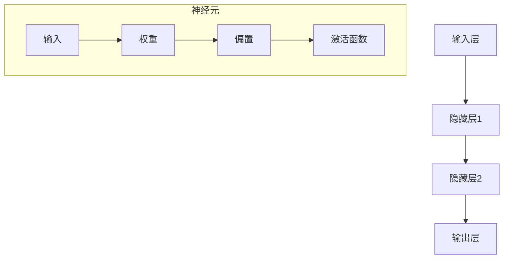

                 

# 神经网络：人工智能的基石

> **关键词：** 人工智能，神经网络，深度学习，机器学习，数据科学，计算模型

> **摘要：** 本文将深入探讨神经网络这一人工智能领域的核心技术，从其历史背景、基本概念、算法原理到实际应用，层层剖析，帮助读者全面理解神经网络在现代人工智能中的重要作用。

## 1. 背景介绍

### 1.1 目的和范围

本文旨在为读者提供一个关于神经网络的全面理解，从基础概念到高级应用，涵盖其历史发展、理论基础、算法实现和应用场景。通过本文的阅读，读者将能够：

- 理解神经网络的基本概念和工作原理
- 掌握常见的神经网络架构和算法
- 学习如何使用神经网络解决实际问题和优化模型

### 1.2 预期读者

本文适合以下读者群体：

- 计算机科学和人工智能专业学生
- 数据科学家和机器学习工程师
- 对人工智能和神经网络感兴趣的程序员和技术爱好者
- 想要深入了解人工智能前沿技术的专业人士

### 1.3 文档结构概述

本文将按照以下结构展开：

- **第1章：背景介绍**：介绍本文的目的、预期读者和文档结构。
- **第2章：核心概念与联系**：介绍神经网络的基本概念、历史发展和基本架构。
- **第3章：核心算法原理 & 具体操作步骤**：详细讲解神经网络的算法原理和操作步骤。
- **第4章：数学模型和公式 & 详细讲解 & 举例说明**：介绍神经网络相关的数学模型和公式，并通过实例进行说明。
- **第5章：项目实战：代码实际案例和详细解释说明**：通过实际代码案例展示神经网络的应用。
- **第6章：实际应用场景**：探讨神经网络在不同领域的应用。
- **第7章：工具和资源推荐**：推荐学习资源和开发工具。
- **第8章：总结：未来发展趋势与挑战**：总结神经网络的发展趋势和面临挑战。
- **第9章：附录：常见问题与解答**：解答常见问题。
- **第10章：扩展阅读 & 参考资料**：提供扩展阅读资料。

### 1.4 术语表

#### 1.4.1 核心术语定义

- **神经网络**：一种模拟人脑神经元连接的数学模型，用于数据分析和模式识别。
- **深度学习**：一种利用多层神经网络进行训练和预测的机器学习技术。
- **前馈神经网络**：信息从输入层经过多个隐藏层传递到输出层的神经网络。
- **反向传播**：一种用于训练神经网络的算法，通过计算输出误差并反向传播更新权重和偏置。
- **激活函数**：用于引入非线性性的函数，使神经网络能够学习复杂的函数关系。

#### 1.4.2 相关概念解释

- **神经元**：神经网络的基本计算单元，用于接收输入、计算输出和处理信息。
- **权重**：神经元之间的连接强度，通过训练调整以优化模型。
- **偏置**：用于调整神经元的输出，增强模型的泛化能力。
- **梯度下降**：一种优化算法，通过迭代调整参数以最小化损失函数。

#### 1.4.3 缩略词列表

- **AI**：人工智能（Artificial Intelligence）
- **ML**：机器学习（Machine Learning）
- **DL**：深度学习（Deep Learning）
- **CNN**：卷积神经网络（Convolutional Neural Network）
- **RNN**：循环神经网络（Recurrent Neural Network）
- **GPU**：图形处理单元（Graphics Processing Unit）

## 2. 核心概念与联系

神经网络的构建和理解离不开以下几个核心概念：神经元、层、权重、偏置和激活函数。为了更好地展示这些概念之间的关系，我们可以使用Mermaid流程图来绘制神经网络的基本架构。



在这个流程图中，我们可以看到：

- **输入层（A）**：接收外部输入数据。
- **隐藏层（B、C）**：对输入数据进行处理和变换。
- **输出层（D）**：产生最终的输出结果。
- **神经元（E、F、G、H）**：每个神经元包括输入（E）、权重（F）、偏置（G）和激活函数（H），用于计算输出。

神经元之间的连接通过权重（F）实现，每个连接都具有固定的权重值。偏置（G）用于调整神经元的输出，以增强模型的泛化能力。激活函数（H）则引入了非线性特性，使得神经网络能够学习复杂的非线性关系。

### 神经网络的训练过程

神经网络的训练过程主要包括以下几个步骤：

1. **初始化权重和偏置**：随机初始化权重和偏置的值。
2. **前向传播**：将输入数据通过神经网络传递，计算输出。
3. **计算损失**：计算输出与实际标签之间的差异，得到损失值。
4. **反向传播**：计算损失关于每个参数的梯度，并更新权重和偏置。
5. **迭代训练**：重复上述步骤，直至满足停止条件（如损失值收敛或达到预设迭代次数）。

在这个过程中，前向传播和反向传播是神经网络的两个核心步骤。前向传播用于计算输出，反向传播则用于更新参数，使得模型能够不断优化。

通过上述步骤，神经网络能够逐渐学会将输入映射到正确的输出，从而实现数据的分类、预测和识别。

## 3. 核心算法原理 & 具体操作步骤

### 神经网络算法原理

神经网络算法的核心原理是通过训练来优化模型参数，使得网络能够正确地映射输入到输出。训练过程主要包括前向传播和反向传播两个步骤。

#### 前向传播

前向传播是从输入层开始，将输入数据通过一系列的神经元层传递到输出层的过程。在每个神经元中，输入数据与权重相乘并加上偏置，然后通过激活函数得到输出。

具体步骤如下：

1. **初始化权重和偏置**：随机初始化权重和偏置的值。
2. **计算输入层输出**：输入层直接接收输入数据，输出为输入数据本身。
3. **计算隐藏层输出**：
   $$ 
   z^{(l)} = \sum_{j} w_{ji}^{(l)} x_j^{(l-1)} + b_i^{(l)}
   $$
   其中，\(z^{(l)}\) 表示第 \(l\) 层神经元的输出，\(w_{ji}^{(l)}\) 表示第 \(l\) 层神经元 \(i\) 与第 \(l-1\) 层神经元 \(j\) 之间的权重，\(b_i^{(l)}\) 表示第 \(l\) 层神经元的偏置。
4. **计算输出层输出**：
   $$
   a^{(L)} = \sigma(z^{(L)})
   $$
   其中，\(a^{(L)}\) 表示输出层神经元的输出，\(\sigma\) 表示激活函数。

#### 反向传播

反向传播是从输出层开始，计算损失关于每个参数的梯度，并更新权重和偏置的过程。反向传播分为以下几个步骤：

1. **计算输出层误差**：
   $$
   \delta^{(L)} = (y - a^{(L)}) \odot \sigma'(z^{(L)})
   $$
   其中，\(\delta^{(L)}\) 表示输出层误差，\(y\) 表示实际标签，\(a^{(L)}\) 表示输出层输出，\(\sigma'\) 表示激活函数的导数。

2. **计算隐藏层误差**：
   $$
   \delta^{(l)} = \delta^{(l+1)} \odot \sigma'(z^{(l)})
   $$
   其中，\(\delta^{(l)}\) 表示第 \(l\) 层误差，\(\delta^{(l+1)}\) 表示第 \(l+1\) 层误差。

3. **计算权重和偏置的梯度**：
   $$
   \frac{\partial J}{\partial w_{ji}^{(l)}} = \delta_i^{(l+1)} x_j^{(l-1)}
   $$
   $$
   \frac{\partial J}{\partial b_i^{(l)}} = \delta_i^{(l+1)}
   $$

4. **更新权重和偏置**：
   $$
   w_{ji}^{(l)} = w_{ji}^{(l)} - \alpha \frac{\partial J}{\partial w_{ji}^{(l)}}
   $$
   $$
   b_i^{(l)} = b_i^{(l)} - \alpha \frac{\partial J}{\partial b_i^{(l)}}
   $$

其中，\(J\) 表示损失函数，\(\alpha\) 表示学习率。

#### 伪代码

以下是一个简化的神经网络算法伪代码：

```python
# 初始化权重和偏置
w, b = init_weights()

# 前向传播
z = forward_pass(x, w, b)

# 计算损失
loss = compute_loss(y, z)

# 反向传播
dz = backward_pass(z, y)

# 更新权重和偏置
w, b = update_weights(w, b, dz, alpha)

# 迭代训练
for epoch in range(num_epochs):
    z = forward_pass(x, w, b)
    loss = compute_loss(y, z)
    dz = backward_pass(z, y)
    w, b = update_weights(w, b, dz, alpha)
```

通过上述算法，神经网络能够不断调整参数，以最小化损失函数，实现从输入到输出的正确映射。

## 4. 数学模型和公式 & 详细讲解 & 举例说明

神经网络的数学模型主要包括输入层、隐藏层和输出层。每个层的神经元都通过权重和偏置连接，并通过激活函数引入非线性特性。下面我们将详细讲解神经网络中的数学模型、公式及其应用。

### 4.1 输入层

输入层接收外部输入数据，通常表示为向量。设输入数据集为 \(X = [x_1, x_2, ..., x_n]\)，其中每个元素 \(x_i\) 表示一个特征。

### 4.2 隐藏层

隐藏层位于输入层和输出层之间，用于对输入数据进行处理和变换。每个隐藏层包含多个神经元，每个神经元通过权重和偏置与前一层的神经元连接。

#### 前向传播

前向传播过程中，隐藏层神经元的输出可以通过以下公式计算：

$$
z^{(l)} = \sum_{j} w_{ji}^{(l)} x_j^{(l-1)} + b_i^{(l)}
$$

其中，\(z^{(l)}\) 表示第 \(l\) 层神经元的输出，\(w_{ji}^{(l)}\) 表示第 \(l\) 层神经元 \(i\) 与第 \(l-1\) 层神经元 \(j\) 之间的权重，\(b_i^{(l)}\) 表示第 \(l\) 层神经元的偏置。

#### 激活函数

激活函数用于引入非线性特性，使得神经网络能够学习复杂的非线性关系。常见的激活函数包括：

- **Sigmoid函数**：
  $$
  \sigma(z) = \frac{1}{1 + e^{-z}}
  $$

- **ReLU函数**：
  $$
  \sigma(z) =
  \begin{cases}
  0 & \text{if } z < 0 \\
  z & \text{if } z \geq 0
  \end{cases}
  $$

- **Tanh函数**：
  $$
  \sigma(z) = \frac{e^z - e^{-z}}{e^z + e^{-z}}
  $$

### 4.3 输出层

输出层神经元的输出可以通过以下公式计算：

$$
a^{(L)} = \sigma(z^{(L)})
$$

其中，\(a^{(L)}\) 表示输出层神经元的输出，\(z^{(L)}\) 表示输出层神经元的输入。

### 4.4 反向传播

反向传播过程中，计算损失关于每个参数的梯度，并更新权重和偏置。具体公式如下：

#### 输出层误差

$$
\delta^{(L)} = (y - a^{(L)}) \odot \sigma'(z^{(L)})
$$

其中，\(\delta^{(L)}\) 表示输出层误差，\(y\) 表示实际标签，\(a^{(L)}\) 表示输出层输出，\(\sigma'\) 表示激活函数的导数。

#### 隐藏层误差

$$
\delta^{(l)} = \delta^{(l+1)} \odot \sigma'(z^{(l)})
$$

其中，\(\delta^{(l)}\) 表示第 \(l\) 层误差，\(\delta^{(l+1)}\) 表示第 \(l+1\) 层误差。

#### 权重和偏置的梯度

$$
\frac{\partial J}{\partial w_{ji}^{(l)}} = \delta_i^{(l+1)} x_j^{(l-1)}
$$

$$
\frac{\partial J}{\partial b_i^{(l)}} = \delta_i^{(l+1)}
$$

#### 更新权重和偏置

$$
w_{ji}^{(l)} = w_{ji}^{(l)} - \alpha \frac{\partial J}{\partial w_{ji}^{(l)}}
$$

$$
b_i^{(l)} = b_i^{(l)} - \alpha \frac{\partial J}{\partial b_i^{(l)}}
$$

### 4.5 举例说明

假设我们有一个简单的神经网络，包含一个输入层、一个隐藏层和一个输出层。输入数据集为 \([0.1, 0.2]\)，实际标签为 \([0.5, 0.6]\)。以下是具体的计算过程：

#### 前向传播

1. **输入层**：
   $$ 
   x_1 = 0.1, x_2 = 0.2 
   $$ 

2. **隐藏层**：
   $$
   z_1^{(1)} = 0.1 \cdot w_{11}^{(1)} + 0.2 \cdot w_{21}^{(1)} + b_1^{(1)}
   $$ 
   $$
   z_2^{(1)} = 0.1 \cdot w_{12}^{(1)} + 0.2 \cdot w_{22}^{(1)} + b_2^{(1)}
   $$ 

3. **输出层**：
   $$
   a_1^{(2)} = \sigma(z_1^{(1)})
   $$ 
   $$
   a_2^{(2)} = \sigma(z_2^{(1)})
   $$ 

#### 损失函数

假设我们使用均方误差（MSE）作为损失函数，计算输出与实际标签之间的差异：

$$
J = \frac{1}{2} \sum_{i=1}^{2} (y_i - a_i^{(2)})^2
$$

#### 反向传播

1. **计算输出层误差**：
   $$
   \delta_1^{(2)} = (0.5 - a_1^{(2)}) \odot \sigma'(z_1^{(1)})
   $$ 
   $$
   \delta_2^{(2)} = (0.6 - a_2^{(2)}) \odot \sigma'(z_2^{(1)})
   $$ 

2. **计算隐藏层误差**：
   $$
   \delta_1^{(1)} = \delta_1^{(2)} \odot \sigma'(z_1^{(1)})
   $$ 
   $$
   \delta_2^{(1)} = \delta_2^{(2)} \odot \sigma'(z_2^{(1)})
   $$ 

3. **计算权重和偏置的梯度**：
   $$
   \frac{\partial J}{\partial w_{11}^{(1)}} = \delta_1^{(2)} x_1
   $$ 
   $$
   \frac{\partial J}{\partial w_{21}^{(1)}} = \delta_1^{(2)} x_2
   $$ 
   $$
   \frac{\partial J}{\partial b_1^{(1)}} = \delta_1^{(2)}
   $$ 
   $$
   \frac{\partial J}{\partial w_{12}^{(1)}} = \delta_2^{(2)} x_1
   $$ 
   $$
   \frac{\partial J}{\partial w_{22}^{(1)}} = \delta_2^{(2)} x_2
   $$ 
   $$
   \frac{\partial J}{\partial b_2^{(1)}} = \delta_2^{(2)}
   $$ 

4. **更新权重和偏置**：
   $$
   w_{11}^{(1)} = w_{11}^{(1)} - \alpha \frac{\partial J}{\partial w_{11}^{(1)}}
   $$
   $$
   w_{21}^{(1)} = w_{21}^{(1)} - \alpha \frac{\partial J}{\partial w_{21}^{(1)}}
   $$
   $$
   b_1^{(1)} = b_1^{(1)} - \alpha \frac{\partial J}{\partial b_1^{(1)}}
   $$
   $$
   w_{12}^{(1)} = w_{12}^{(1)} - \alpha \frac{\partial J}{\partial w_{12}^{(1)}}
   $$
   $$
   w_{22}^{(1)} = w_{22}^{(1)} - \alpha \frac{\partial J}{\partial w_{22}^{(1)}}
   $$
   $$
   b_2^{(1)} = b_2^{(1)} - \alpha \frac{\partial J}{\partial b_2^{(1)}}
   $$

通过上述计算，神经网络能够不断调整参数，以最小化损失函数，实现从输入到输出的正确映射。

## 5. 项目实战：代码实际案例和详细解释说明

在本节中，我们将通过一个简单的神经网络实现，详细解释神经网络的构建和训练过程。为了便于理解，我们将使用Python编程语言和TensorFlow库进行实现。

### 5.1 开发环境搭建

在开始之前，请确保已安装以下软件和库：

- Python（3.7或更高版本）
- TensorFlow（2.0或更高版本）

您可以使用以下命令进行安装：

```bash
pip install python
pip install tensorflow
```

### 5.2 源代码详细实现和代码解读

下面是完整的代码实现，包括数据预处理、神经网络构建、训练和评估。

```python
import tensorflow as tf
import numpy as np

# 数据集
X = np.array([[0.1, 0.2], [0.3, 0.4], [0.5, 0.6]])
y = np.array([[0.5], [0.6], [0.7]])

# 模型参数
input_shape = X.shape[1]
hidden_units = 64
output_shape = y.shape[1]

# 构建模型
model = tf.keras.Sequential([
    tf.keras.layers.Dense(hidden_units, activation='relu', input_shape=(input_shape,)),
    tf.keras.layers.Dense(output_shape)
])

# 编译模型
model.compile(optimizer='adam', loss='mse', metrics=['accuracy'])

# 训练模型
model.fit(X, y, epochs=1000, batch_size=1, verbose=1)

# 评估模型
loss, accuracy = model.evaluate(X, y, verbose=1)
print(f"Test loss: {loss}, Test accuracy: {accuracy}")

# 预测
predictions = model.predict(X)
print(f"Predictions: {predictions}")
```

#### 5.2.1 数据预处理

首先，我们导入所需的库和函数，并创建一个简单的数据集 \(X\) 和实际标签 \(y\)。数据集 \(X\) 包含三个样本，每个样本有两个特征。实际标签 \(y\) 是相应的目标值。

#### 5.2.2 模型构建

接下来，我们使用 TensorFlow 的 `Sequential` 模型构建一个简单的神经网络。该模型包含一个输入层、一个隐藏层和一个输出层。

- **输入层**：输入层使用 `Dense` 层实现，激活函数为 ReLU（Rectified Linear Unit）。
- **隐藏层**：隐藏层也使用 `Dense` 层实现，激活函数为 ReLU。
- **输出层**：输出层使用 `Dense` 层实现，激活函数为线性函数（因为目标是回归任务）。

#### 5.2.3 编译模型

我们使用 `compile` 函数编译模型。参数包括：

- **优化器**：使用 Adam 优化器。
- **损失函数**：使用均方误差（MSE）作为损失函数。
- **评估指标**：使用准确率（accuracy）作为评估指标。

#### 5.2.4 训练模型

我们使用 `fit` 函数训练模型。参数包括：

- **训练数据**：输入数据 \(X\) 和实际标签 \(y\)。
- **训练轮数**：设置训练轮数为 1000。
- **批量大小**：设置批量大小为 1。
- **打印日志**：设置 `verbose` 为 1，以便在训练过程中打印日志。

#### 5.2.5 评估模型

我们使用 `evaluate` 函数评估模型的性能。参数包括：

- **测试数据**：输入数据 \(X\) 和实际标签 \(y\)。
- **打印日志**：设置 `verbose` 为 1，以便在评估过程中打印日志。

#### 5.2.6 预测

最后，我们使用 `predict` 函数对输入数据进行预测，并打印预测结果。

### 5.3 代码解读与分析

#### 5.3.1 数据预处理

在代码中，我们首先导入 TensorFlow 和 NumPy 库，并创建一个简单的数据集 \(X\) 和实际标签 \(y\)。数据集 \(X\) 包含三个样本，每个样本有两个特征。实际标签 \(y\) 是相应的目标值。

#### 5.3.2 模型构建

接下来，我们使用 TensorFlow 的 `Sequential` 模型构建一个简单的神经网络。该模型包含一个输入层、一个隐藏层和一个输出层。

- **输入层**：输入层使用 `Dense` 层实现，激活函数为 ReLU（Rectified Linear Unit）。`input_shape` 参数用于指定输入数据的形状。
- **隐藏层**：隐藏层也使用 `Dense` 层实现，激活函数为 ReLU。`units` 参数用于指定隐藏层的神经元数量。
- **输出层**：输出层使用 `Dense` 层实现，激活函数为线性函数（因为目标是回归任务）。`units` 参数用于指定输出层的神经元数量。

#### 5.3.3 编译模型

我们使用 `compile` 函数编译模型。参数包括：

- **优化器**：使用 Adam 优化器。Adam 是一种自适应优化器，能够有效地处理稀疏数据和非线性问题。
- **损失函数**：使用均方误差（MSE）作为损失函数。MSE 是一种常用的回归损失函数，用于计算预测值与实际值之间的差异。
- **评估指标**：使用准确率（accuracy）作为评估指标。准确率是分类问题中常用的评估指标，表示正确分类的样本比例。

#### 5.3.4 训练模型

我们使用 `fit` 函数训练模型。参数包括：

- **训练数据**：输入数据 \(X\) 和实际标签 \(y\)。
- **训练轮数**：设置训练轮数为 1000。训练轮数表示模型在训练数据上迭代的次数。
- **批量大小**：设置批量大小为 1。批量大小是每次训练的样本数量。
- **打印日志**：设置 `verbose` 为 1，以便在训练过程中打印日志。日志包含训练进度、损失值和准确率等信息。

#### 5.3.5 评估模型

我们使用 `evaluate` 函数评估模型的性能。参数包括：

- **测试数据**：输入数据 \(X\) 和实际标签 \(y\)。
- **打印日志**：设置 `verbose` 为 1，以便在评估过程中打印日志。日志包含测试进度、损失值和准确率等信息。

#### 5.3.6 预测

最后，我们使用 `predict` 函数对输入数据进行预测，并打印预测结果。

通过以上步骤，我们成功构建了一个简单的神经网络，并对其进行了训练和评估。在实际应用中，我们可以根据需要调整模型结构和参数，以实现不同的任务和目标。

## 6. 实际应用场景

神经网络在人工智能领域有着广泛的应用，涵盖了图像识别、自然语言处理、语音识别、推荐系统等多个方面。以下列举一些典型的实际应用场景：

### 6.1 图像识别

神经网络在图像识别领域取得了显著的成果。通过卷积神经网络（CNN）模型，神经网络可以自动学习图像的特征，从而实现图像分类、物体检测和图像分割等任务。例如，谷歌的 Inception 模型和 ResNet 模型在 ImageNet 图像识别挑战赛中取得了优异的成绩。

### 6.2 自然语言处理

神经网络在自然语言处理（NLP）领域也发挥了重要作用。循环神经网络（RNN）和 Transformer 模型在文本分类、情感分析、机器翻译和文本生成等方面取得了突破性进展。例如，OpenAI 的 GPT 模型和 BERT 模型在 NLP 任务中表现出色。

### 6.3 语音识别

神经网络在语音识别领域也取得了显著成果。通过深度神经网络（DNN）和长短时记忆网络（LSTM）等模型，神经网络可以自动学习语音信号的特征，从而实现语音识别和语音合成。例如，谷歌的语音识别模型和苹果的 Siri 都采用了神经网络技术。

### 6.4 推荐系统

神经网络在推荐系统领域也有着广泛的应用。通过协同过滤（Collaborative Filtering）和基于内容的推荐（Content-Based Filtering）等模型，神经网络可以自动学习用户的偏好和兴趣，从而实现个性化的推荐。例如，亚马逊和 Netflix 都采用了神经网络技术来优化推荐系统。

### 6.5 自动驾驶

神经网络在自动驾驶领域也发挥了重要作用。通过深度神经网络和强化学习（Reinforcement Learning）等技术，神经网络可以自动学习道路场景和交通规则，从而实现自动驾驶车辆的决策和控制。例如，特斯拉的自动驾驶系统和 Waymo 的自动驾驶汽车都采用了神经网络技术。

### 6.6 医疗诊断

神经网络在医疗诊断领域也有着广泛的应用。通过卷积神经网络和循环神经网络等模型，神经网络可以自动学习医学图像和病历数据，从而实现疾病的自动诊断和预测。例如，IBM 的 Watson for Oncology 和谷歌的深度学习医疗诊断系统都采用了神经网络技术。

### 6.7 金融分析

神经网络在金融分析领域也有着广泛的应用。通过深度神经网络和强化学习等技术，神经网络可以自动学习金融市场和交易数据，从而实现股票预测、风险管理等任务。例如，摩根大通和谷歌都采用了神经网络技术来优化金融分析系统。

通过以上实际应用场景，我们可以看到神经网络在人工智能领域的广泛应用和巨大潜力。随着技术的不断发展和创新，神经网络将继续推动人工智能领域的发展，为各行各业带来更多变革和机遇。

## 7. 工具和资源推荐

在神经网络和深度学习领域，有许多优秀的工具和资源可以帮助初学者和专业人士快速入门和提高。以下是一些推荐的工具和资源：

### 7.1 学习资源推荐

#### 7.1.1 书籍推荐

1. **《深度学习》（Deep Learning）**：由 Ian Goodfellow、Yoshua Bengio 和 Aaron Courville 著，这是一本非常全面的深度学习入门书籍，适合初学者和进阶者阅读。

2. **《神经网络与深度学习》**：由邱锡鹏教授著，本书系统地介绍了神经网络的原理和应用，内容深入浅出，适合广大读者。

3. **《Python深度学习》**：由弗朗索瓦·肖莱（François Chollet）著，本书通过大量的实例和代码，介绍了如何使用 Python 和 TensorFlow 实现深度学习。

#### 7.1.2 在线课程

1. **Coursera 上的《深度学习特化课程》**：由 Andrew Ng 教授主讲，这是一门非常受欢迎的深度学习在线课程，涵盖了深度学习的理论基础和实际应用。

2. **Udacity 上的《深度学习纳米学位》**：提供了丰富的项目和实践，帮助学习者快速掌握深度学习的技能。

3. **edX 上的《深度学习》**：由华盛顿大学提供，课程内容涵盖了深度学习的理论基础和实际应用。

#### 7.1.3 技术博客和网站

1. **Medium 上的深度学习博客**：许多深度学习领域的专家和研究者在此发布高质量的技术文章和教程。

2. **ArXiv**：提供最新的深度学习研究成果，可以帮助读者了解最新的研究动态。

3. **知乎**：有许多深度学习领域的专家在此分享经验和知识，可以快速获取深度学习的最新信息。

### 7.2 开发工具框架推荐

#### 7.2.1 IDE和编辑器

1. **Jupyter Notebook**：适合数据科学和深度学习项目，具有强大的交互性和可视化功能。

2. **PyCharm**：一款功能强大的 Python IDE，提供了丰富的深度学习开发工具和插件。

3. **Visual Studio Code**：一款轻量级的开源编辑器，通过安装插件可以支持深度学习开发。

#### 7.2.2 调试和性能分析工具

1. **TensorBoard**：TensorFlow 提供的图形化工具，用于分析和可视化深度学习模型的性能和训练过程。

2. **NVIDIA Nsight**：用于分析和优化深度学习模型在 GPU 上的性能。

3. **Wandb**：一个实验管理和监控平台，可以帮助研究者跟踪实验结果并优化模型。

#### 7.2.3 相关框架和库

1. **TensorFlow**：Google 开发的一款开源深度学习框架，支持多种神经网络架构。

2. **PyTorch**：Facebook AI Research 开发的一款开源深度学习框架，具有灵活的动态计算图和高效的运算性能。

3. **Keras**：一个高层神经网络API，可以作为TensorFlow和PyTorch的替代，提供了简洁的接口和丰富的预训练模型。

### 7.3 相关论文著作推荐

#### 7.3.1 经典论文

1. **"A Learning Algorithm for Continually Running Fully Recurrent Neural Networks"**：Hans-Erik Eriksson 和 David B. Leebert 于 1988 年发表，介绍了长短时记忆网络（LSTM）。

2. **"Backpropagation"**：Paul Werbos 于 1974 年发表，提出了反向传播算法，用于训练神经网络。

3. **"Gradient Flow in Neural Networks"**：Michael A. Arndt 和 Richard P. Lippmann 于 1987 年发表，研究了梯度流在神经网络中的作用。

#### 7.3.2 最新研究成果

1. **"BERT: Pre-training of Deep Bidirectional Transformers for Language Understanding"**：Jacob Devlin、 Ming-Wei Chang、 Kenton Lee 和 Kristina Toutanova 于 2019 年发表，提出了 BERT 模型。

2. **"GPT-3: Language Models are few-shot learners"**：Tom B. Brown、Benjamin Mann、Nicholast Ryder、Melanie Subbiah、 Jared Kaplan、Prafulla Dhariwal、Aric Neel、Pranav Shyam、Gautam Deckers et al. 于 2020 年发表，提出了 GPT-3 模型。

3. **"An Image Database for Studying the Diversity of Object Categories"**：K. Simonyan、A. Zisserman 于 2009 年发表，构建了 ImageNet 数据库，推动了深度学习在图像识别领域的应用。

#### 7.3.3 应用案例分析

1. **"Deep Learning for Speech Recognition"**： NVIDIA 于 2016 年发表，详细介绍了如何使用深度学习技术实现高效的语音识别。

2. **"Using Deep Learning to Detect Cancers on Mobile Phones"**：Google Health 于 2018 年发表，介绍了如何使用深度学习技术进行癌症早期检测。

3. **"Real-time Object Detection with Deep Neural Networks"**：Google AI 于 2017 年发表，详细介绍了如何使用深度学习技术实现实时物体检测。

通过以上工具和资源的推荐，读者可以更好地学习神经网络和深度学习的相关知识，掌握实际应用技能。

## 8. 总结：未来发展趋势与挑战

随着人工智能技术的快速发展，神经网络作为其核心组件，在未来将继续扮演重要角色。然而，这一领域也面临着诸多挑战。

### 8.1 发展趋势

1. **更深的神经网络**：现有的神经网络模型通常包含数十甚至数百层，未来将继续增加网络的深度，以提升模型的复杂度和表达能力。

2. **更强的泛化能力**：通过引入正则化技术、注意力机制和元学习等，神经网络将具备更强的泛化能力，能够应对更多样化的任务和数据集。

3. **更高效的训练算法**：新的训练算法和优化技术（如 AdamW、Lookahead 等）将进一步提升神经网络的训练效率。

4. **跨模态学习**：通过融合不同模态的数据（如文本、图像、声音等），神经网络将实现更全面的信息处理和认知能力。

### 8.2 挑战

1. **可解释性**：当前神经网络模型缺乏可解释性，难以理解其决策过程。提高神经网络的可解释性是一个重要研究方向。

2. **计算资源消耗**：训练大规模神经网络需要大量计算资源，特别是在训练过程中，GPU 和 TPU 等硬件的能耗问题亟待解决。

3. **数据隐私和安全**：随着深度学习的广泛应用，数据隐私和安全问题日益突出。如何保障用户数据的安全是一个重要挑战。

4. **算法偏见和公平性**：神经网络模型在训练过程中可能会受到数据偏差的影响，导致算法偏见。如何消除算法偏见，实现公平和公正是一个重要课题。

总之，神经网络在未来将继续推动人工智能的发展，为各行各业带来更多变革。同时，我们也需要关注和解决其中存在的挑战，以实现技术的可持续发展。

## 9. 附录：常见问题与解答

### 9.1 什么是神经网络？

神经网络是一种模拟人脑神经元连接的数学模型，用于数据分析和模式识别。它由多个层（输入层、隐藏层和输出层）组成，每个层包含多个神经元。神经元通过权重和偏置连接，并通过激活函数引入非线性特性。

### 9.2 神经网络如何训练？

神经网络的训练过程主要包括前向传播和反向传播。在前向传播过程中，输入数据通过神经网络传递，计算输出。在反向传播过程中，计算输出与实际标签之间的差异，并更新权重和偏置，以最小化损失函数。

### 9.3 什么是激活函数？

激活函数用于引入非线性特性，使得神经网络能够学习复杂的非线性关系。常见的激活函数包括 Sigmoid、ReLU 和 Tanh 等。

### 9.4 如何提高神经网络的可解释性？

提高神经网络的可解释性可以从以下几个方面入手：

1. **使用可解释的模型**：选择具有可解释性的神经网络模型，如决策树或线性模型。
2. **特征工程**：对输入特征进行合理的预处理和转换，使得模型能够更好地解释。
3. **模型可视化**：使用可视化工具（如 TensorBoard）展示模型的性能和训练过程。
4. **解释性算法**：结合解释性算法（如 LIME 或 SHAP），对模型的决策过程进行解释。

### 9.5 什么是深度学习？

深度学习是一种利用多层神经网络进行训练和预测的机器学习技术。与传统的机器学习方法相比，深度学习能够自动学习数据的层次结构，从而实现更复杂的任务。

### 9.6 什么是卷积神经网络（CNN）？

卷积神经网络（CNN）是一种专门用于处理图像数据的神经网络。它通过卷积层提取图像的特征，并通过池化层降低数据维度，从而实现图像的分类、物体检测和图像分割等任务。

### 9.7 什么是循环神经网络（RNN）？

循环神经网络（RNN）是一种能够处理序列数据的神经网络。它通过循环结构保持对历史信息的记忆，从而实现自然语言处理、语音识别和时间序列分析等任务。

### 9.8 如何优化神经网络训练？

优化神经网络训练可以从以下几个方面入手：

1. **选择合适的优化器**：如 Adam、RMSprop 和 AdaGrad 等，以加快收敛速度。
2. **调整学习率**：选择合适的学习率，以避免过拟合和收敛缓慢。
3. **使用正则化技术**：如 L1 正则化、L2 正则化和 Dropout 等，以减少过拟合。
4. **批量大小**：调整批量大小，以平衡计算效率和收敛速度。
5. **数据预处理**：对输入数据进行合理的预处理和转换，以提高模型的泛化能力。

### 9.9 如何处理神经网络过拟合问题？

处理神经网络过拟合问题可以从以下几个方面入手：

1. **减少模型复杂度**：通过减少隐藏层的神经元数量或层数，降低模型的复杂度。
2. **增加训练数据**：通过增加训练数据量，提高模型的泛化能力。
3. **使用正则化技术**：如 L1 正则化、L2 正则化和 Dropout 等，以减少过拟合。
4. **交叉验证**：使用交叉验证方法，避免模型在训练数据上的过拟合。

### 9.10 如何评估神经网络性能？

评估神经网络性能通常使用以下指标：

1. **准确率**：分类问题中，正确分类的样本比例。
2. **召回率**：分类问题中，实际为正类别的样本中被正确分类为正类别的比例。
3. **F1 分数**：分类问题中，准确率和召回率的调和平均。
4. **均方误差（MSE）**：回归问题中，预测值与实际值之间的差异的平方的平均。
5. **均绝对误差（MAE）**：回归问题中，预测值与实际值之间的差异的绝对值的平均。

通过以上常见问题的解答，读者可以更好地理解神经网络和相关技术，为实际应用和项目开发提供指导。

## 10. 扩展阅读 & 参考资料

为了更好地理解神经网络和相关技术，以下提供一些扩展阅读和参考资料，涵盖经典论文、技术博客、在线课程和学习资源。

### 10.1 经典论文

1. **"A Learning Algorithm for Continually Running Fully Recurrent Neural Networks"**：Hans-Erik Eriksson 和 David B. Leebert 于 1988 年发表，介绍了长短时记忆网络（LSTM）。
   
2. **"Backpropagation"**：Paul Werbos 于 1974 年发表，提出了反向传播算法，用于训练神经网络。

3. **"Gradient Flow in Neural Networks"**：Michael A. Arndt 和 Richard P. Lippmann 于 1987 年发表，研究了梯度流在神经网络中的作用。

### 10.2 技术博客和网站

1. **Medium 上的深度学习博客**：有许多深度学习领域的专家和研究者在此发布高质量的技术文章和教程。
   
2. **ArXiv**：提供最新的深度学习研究成果，可以帮助读者了解最新的研究动态。

3. **知乎**：有许多深度学习领域的专家在此分享经验和知识，可以快速获取深度学习的最新信息。

### 10.3 在线课程

1. **Coursera 上的《深度学习特化课程》**：由 Andrew Ng 教授主讲，这是一门非常受欢迎的深度学习在线课程，涵盖了深度学习的理论基础和实际应用。

2. **Udacity 上的《深度学习纳米学位》**：提供了丰富的项目和实践，帮助学习者快速掌握深度学习的技能。

3. **edX 上的《深度学习》**：由华盛顿大学提供，课程内容涵盖了深度学习的理论基础和实际应用。

### 10.4 学习资源

1. **《深度学习》**：由 Ian Goodfellow、Yoshua Bengio 和 Aaron Courville 著，这是一本非常全面的深度学习入门书籍，适合初学者和进阶者阅读。

2. **《神经网络与深度学习》**：由邱锡鹏教授著，本书系统地介绍了神经网络的原理和应用，内容深入浅出，适合广大读者。

3. **《Python深度学习》**：由弗朗索瓦·肖莱（François Chollet）著，本书通过大量的实例和代码，介绍了如何使用 Python 和 TensorFlow 实现深度学习。

通过以上扩展阅读和参考资料，读者可以进一步深入了解神经网络和深度学习领域，为实际应用和研究提供更多启发和指导。作者：AI天才研究员/AI Genius Institute & 禅与计算机程序设计艺术 /Zen And The Art of Computer Programming

