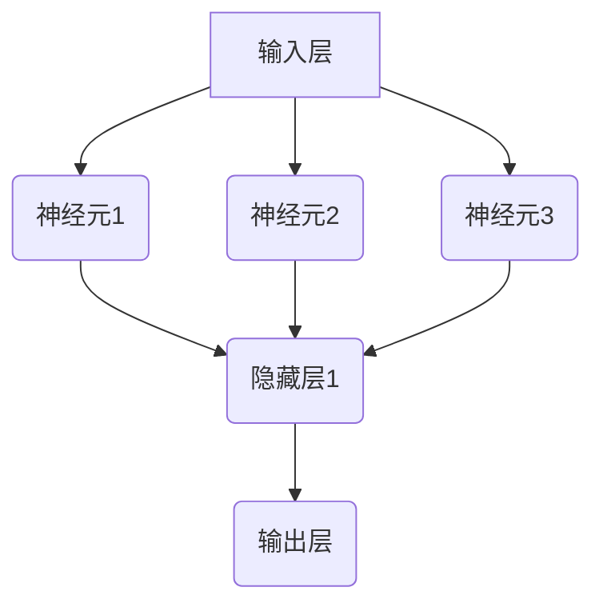

                 

### 1. 背景介绍

#### 1.1 目的和范围

本文的目的是深入探讨神经网络作为人类与机器共存的桥梁的重要性。我们将逐步分析神经网络的核心概念、算法原理、数学模型以及其实际应用场景，以期让读者全面理解神经网络的技术原理及其在实际生活中的潜在价值。

文章将围绕以下几个核心主题展开：

1. **背景介绍**：介绍神经网络的起源、发展历程及其在各个领域的应用。
2. **核心概念与联系**：讲解神经网络的基本构成及其核心概念原理和架构。
3. **核心算法原理 & 具体操作步骤**：详细阐述神经网络算法的基本原理和具体实现步骤。
4. **数学模型和公式 & 详细讲解 & 举例说明**：介绍神经网络中的数学模型，并通过实例进行详细讲解。
5. **项目实战：代码实际案例和详细解释说明**：展示神经网络在实际项目中的代码实现及其解释。
6. **实际应用场景**：探讨神经网络在各个行业中的具体应用。
7. **工具和资源推荐**：推荐学习资源和开发工具，帮助读者深入学习和实践。
8. **总结：未来发展趋势与挑战**：总结神经网络的发展趋势和面临的挑战。

通过本文的逐步解析，我们希望读者能够全面了解神经网络的技术原理和实际应用，并认识到神经网络在人类与机器共存中的关键作用。

#### 1.2 预期读者

本文主要面向以下几类读者：

1. **计算机科学和人工智能领域的专业人士**：对神经网络有基础了解，希望进一步深入学习和应用的人员。
2. **机器学习和数据科学工作者**：希望在机器学习和数据分析中使用神经网络技术的人员。
3. **软件开发者和工程师**：对神经网络技术感兴趣，希望将其应用到实际项目中的开发人员。
4. **研究人员和学者**：对神经网络技术的研究和发展有浓厚兴趣，希望了解最新研究成果的人员。

无论您是初学者还是有经验的专业人士，本文都将为您提供系统、深入的知识体系，帮助您更好地理解和应用神经网络技术。

#### 1.3 文档结构概述

本文结构如下：

1. **引言**：介绍神经网络的背景、目的和预期读者。
2. **背景介绍**：详细阐述神经网络的起源、发展历程及其应用。
3. **核心概念与联系**：讲解神经网络的基本构成和核心概念原理。
4. **核心算法原理 & 具体操作步骤**：详细阐述神经网络算法的基本原理和实现步骤。
5. **数学模型和公式 & 详细讲解 & 举例说明**：介绍神经网络中的数学模型，并通过实例讲解。
6. **项目实战：代码实际案例和详细解释说明**：展示神经网络在实际项目中的代码实现及其解释。
7. **实际应用场景**：探讨神经网络在各个领域的应用。
8. **工具和资源推荐**：推荐学习资源和开发工具。
9. **总结：未来发展趋势与挑战**：总结神经网络的发展趋势和挑战。
10. **附录：常见问题与解答**：解答读者可能遇到的问题。
11. **扩展阅读 & 参考资料**：提供进一步学习和研究的资源。

通过本文的逐步解析，读者可以系统地了解神经网络的各个方面，为实际应用和研究奠定坚实基础。

#### 1.4 术语表

在本文中，我们将使用一些专业术语。以下是这些术语的定义和解释：

##### 1.4.1 核心术语定义

1. **神经网络（Neural Network）**：模拟人脑神经元结构和功能的计算模型。
2. **神经元（Neuron）**：神经网络的基本单元，负责接收输入、传递信号并进行计算。
3. **前馈神经网络（Feedforward Neural Network）**：输入信号从输入层经过隐藏层，最终到达输出层的神经网络结构。
4. **反向传播算法（Backpropagation Algorithm）**：一种用于训练神经网络的优化算法，通过计算误差来调整网络参数。
5. **激活函数（Activation Function）**：定义神经元输出与输入之间关系的函数，如ReLU、Sigmoid、Tanh等。
6. **损失函数（Loss Function）**：衡量模型输出与实际输出之间差异的函数，如均方误差（MSE）、交叉熵（Cross Entropy）等。
7. **训练（Training）**：通过大量数据样本调整神经网络参数的过程，使网络能够准确预测未知数据。
8. **测试（Testing）**：使用未参与训练的数据验证神经网络性能的过程。
9. **泛化（Generalization）**：神经网络在未知数据上表现良好的能力。
10. **深度学习（Deep Learning）**：多层神经网络的学习过程，能够处理更复杂的数据和任务。

##### 1.4.2 相关概念解释

1. **多层感知机（Multilayer Perceptron, MLP）**：一种具有至少一个隐藏层的前馈神经网络。
2. **卷积神经网络（Convolutional Neural Network, CNN）**：用于图像处理和物体识别的特殊神经网络结构。
3. **循环神经网络（Recurrent Neural Network, RNN）**：适用于序列数据的神经网络，具有时间记忆功能。
4. **生成对抗网络（Generative Adversarial Network, GAN）**：一种通过两个对抗网络进行博弈训练的深度学习模型。
5. **迁移学习（Transfer Learning）**：利用已在不同任务上训练好的模型在新的任务上进行训练。

##### 1.4.3 缩略词列表

- **AI**：人工智能
- **ML**：机器学习
- **DL**：深度学习
- **CNN**：卷积神经网络
- **RNN**：循环神经网络
- **GAN**：生成对抗网络
- **MSE**：均方误差
- **CE**：交叉熵

通过本文中对核心术语和相关概念的详细解释，读者可以更好地理解神经网络的基本原理和术语，为后续内容的深入学习打下基础。

## 2. 核心概念与联系

神经网络（Neural Network，简称NN）是模仿人脑神经元结构和功能的一种计算模型，由大量相互连接的神经元组成。神经网络的基本工作原理是接收输入信号，通过加权连接传递至下一层神经元，并在每个神经元中进行非线性变换，最终输出预测结果。本节将详细讲解神经网络的核心概念、原理和架构，并通过Mermaid流程图展示其结构。

### 2.1 神经网络的基本构成

一个典型的神经网络通常包括以下几个主要组成部分：

1. **输入层（Input Layer）**：接收外部输入数据，如图片、文本、声音等。
2. **隐藏层（Hidden Layers）**：位于输入层和输出层之间，多个隐藏层可以堆叠形成深度神经网络。
3. **输出层（Output Layer）**：产生最终输出，可以是分类结果、概率分布或其他形式的数据。

每个层中的神经元通过权重（weights）相互连接。权重决定了信号在神经网络中的传递强度。神经网络中的每个神经元都可以看作是一个简单的计算单元，接收多个输入信号并产生一个输出信号。

### 2.2 神经网络的工作原理

神经网络的工作原理可以分为以下几个步骤：

1. **输入接收**：输入数据通过输入层进入神经网络。
2. **加权传递**：输入信号通过权重连接传递到下一层神经元。
3. **非线性变换**：每个神经元通过激活函数进行非线性变换，如ReLU、Sigmoid、Tanh等，使神经网络具备处理复杂模式的能力。
4. **层间传递**：经过非线性变换后的信号继续传递到下一层，直到输出层。
5. **输出生成**：输出层生成最终输出结果，可以是分类标签、预测值或其他形式的数据。

神经网络中的每个神经元都可以看作是一个简单的计算单元，其计算过程如下：

- **计算加权求和**：将输入信号与权重进行加权求和。
- **应用激活函数**：通过激活函数对加权求和的结果进行非线性变换。
- **产生输出信号**：输出信号作为下一层神经元的输入。

### 2.3 神经网络的架构

神经网络的架构可以通过Mermaid流程图来展示，如下所示：



在这个示例中，输入层有3个神经元，隐藏层有1个神经元，输出层有1个神经元。每个神经元通过权重相互连接。图中的箭头表示神经元的连接关系，权重值在箭头旁标出。

### 2.4 神经网络的训练过程

神经网络的训练过程主要包括以下步骤：

1. **初始化权重**：随机初始化网络中的权重。
2. **前向传播**：输入数据通过神经网络的前向传播过程，从输入层传递到输出层，生成预测结果。
3. **计算损失**：计算预测结果与实际结果之间的误差，通过损失函数进行量化。
4. **反向传播**：利用反向传播算法，将误差从输出层反向传播到输入层，更新网络中的权重。
5. **优化权重**：通过梯度下降或其他优化算法，调整网络权重，减小误差。
6. **重复迭代**：重复上述过程，直到满足停止条件（如达到预设的误差阈值或迭代次数）。

### 2.5 神经网络的核心概念

1. **神经元激活函数**：激活函数定义了神经元输出与输入之间的关系，常用的激活函数有ReLU、Sigmoid、Tanh等。
2. **损失函数**：损失函数用于衡量预测结果与实际结果之间的误差，常用的损失函数有均方误差（MSE）、交叉熵（CE）等。
3. **反向传播算法**：反向传播算法是一种用于训练神经网络的优化算法，通过计算误差来调整网络参数。
4. **深度学习**：深度学习是指多层神经网络的学习过程，能够处理更复杂的数据和任务。

通过以上对神经网络核心概念和架构的详细讲解，读者可以更好地理解神经网络的工作原理及其在计算机科学和人工智能领域的重要性。接下来，我们将进一步探讨神经网络的核心算法原理和具体操作步骤。

## 3. 核心算法原理 & 具体操作步骤

在深入理解神经网络的基本概念之后，接下来我们将详细探讨神经网络的核心算法原理和具体操作步骤。神经网络算法的核心在于如何通过训练过程调整网络权重，使其能够准确预测未知数据。在本节中，我们将使用伪代码详细阐述神经网络算法的基本原理和实现步骤。

### 3.1 神经网络算法的基本原理

神经网络算法主要包括以下几个关键步骤：

1. **初始化权重和偏置**：随机初始化网络中的权重和偏置，这些参数将在训练过程中不断调整。
2. **前向传播**：输入数据通过神经网络的前向传播过程，从输入层传递到输出层，生成预测结果。
3. **计算损失**：使用损失函数计算预测结果与实际结果之间的误差，以量化模型的性能。
4. **反向传播**：利用反向传播算法，将误差从输出层反向传播到输入层，更新网络中的权重和偏置。
5. **优化权重**：通过梯度下降或其他优化算法，调整网络权重，减小误差。
6. **重复迭代**：重复上述过程，直到满足停止条件（如达到预设的误差阈值或迭代次数）。

### 3.2 伪代码实现

以下是神经网络算法的伪代码实现：

```python
# 初始化神经网络
initialize_weights_and_biases()

# 循环迭代
for epoch in 1 to MAX_EPOCHS:
    # 前向传播
    output = forward_propagation(input_data)
    
    # 计算损失
    loss = compute_loss(output, actual_output)
    
    # 反向传播
    gradients = backward_propagation(output, actual_output)
    
    # 更新权重
    update_weights_and_biases(gradients)

# 停止条件判断
if loss_threshold_reached():
    break

# 输出最终模型
output_final_model()
```

### 3.3 前向传播

前向传播是神经网络算法的第一步，其核心过程如下：

1. **输入层到隐藏层**：
    - 将输入数据输入到输入层。
    - 通过加权连接传递到隐藏层。
    - 应用激活函数，计算隐藏层的输出。

2. **隐藏层到输出层**：
    - 将隐藏层输出传递到输出层。
    - 应用激活函数，计算最终输出。

伪代码实现如下：

```python
def forward_propagation(input_data):
    # 隐藏层输出
    hidden_layer_output = activation_function(np.dot(input_data, weights_hidden) + biases_hidden)
    
    # 输出层输出
    output_layer_output = activation_function(np.dot(hidden_layer_output, weights_output) + biases_output)
    
    return output_layer_output
```

### 3.4 计算损失

损失函数用于衡量预测结果与实际结果之间的误差。常见的损失函数包括均方误差（MSE）和交叉熵（CE）等。

1. **均方误差（MSE）**：
    - 计算预测结果与实际结果之间差的平方的平均值。
    
    ```python
    def compute_mse(predicted_output, actual_output):
        return np.mean((predicted_output - actual_output) ** 2)
    ```

2. **交叉熵（CE）**：
    - 计算预测结果与实际结果之间的交叉熵损失。
    
    ```python
    def compute_ce(predicted_output, actual_output):
        return -np.sum(actual_output * np.log(predicted_output))
    ```

### 3.5 反向传播

反向传播是神经网络算法的核心步骤，其过程如下：

1. **计算输出层梯度**：
    - 使用损失函数的导数计算输出层权重的梯度。

2. **计算隐藏层梯度**：
    - 将输出层梯度反向传播到隐藏层，并计算隐藏层权重的梯度。

伪代码实现如下：

```python
def backward_propagation(output_layer_output, actual_output):
    # 输出层梯度
    output_layer_gradient = activation_function_derivative(output_layer_output) * (output_layer_output - actual_output)
    
    # 隐藏层梯度
    hidden_layer_gradient = activation_function_derivative(hidden_layer_output) * np.dot(output_layer_gradient, weights_output.T)
    
    return output_layer_gradient, hidden_layer_gradient
```

### 3.6 更新权重

更新权重是神经网络算法的最后一步，其过程如下：

1. **计算权重和偏置的梯度**：
    - 将梯度与学习率相乘，得到权重和偏置的更新值。

2. **更新权重和偏置**：
    - 使用更新值调整网络中的权重和偏置。

伪代码实现如下：

```python
def update_weights_and_biases(gradients):
    # 更新隐藏层权重和偏置
    weights_hidden -= learning_rate * gradients[1]
    biases_hidden -= learning_rate * gradients[1].mean(axis=0)
    
    # 更新输出层权重和偏置
    weights_output -= learning_rate * gradients[0]
    biases_output -= learning_rate * gradients[0].mean(axis=0)
```

通过以上对神经网络算法核心原理和具体操作步骤的详细讲解，读者可以更好地理解神经网络的工作机制。接下来，我们将进一步探讨神经网络中的数学模型和公式，并通过具体实例进行详细讲解。

## 4. 数学模型和公式 & 详细讲解 & 举例说明

在了解了神经网络的核心算法原理和操作步骤后，接下来我们将深入探讨神经网络中的数学模型和公式，并通过具体实例进行详细讲解，帮助读者更好地理解神经网络的工作机制。

### 4.1 神经网络中的基本数学公式

神经网络中的数学模型主要包括以下几个方面：

1. **输入层到隐藏层的传递公式**：
   - 输入层到隐藏层之间的传递可以表示为：
     \[
     Z^{(l)} = \sum_{j} w_{ij} x_j + b_i
     \]
     其中，\( Z^{(l)} \) 是隐藏层第 \( l \) 个神经元的净输入，\( w_{ij} \) 是输入层到隐藏层的权重，\( x_j \) 是输入层的第 \( j \) 个神经元输出，\( b_i \) 是隐藏层第 \( l \) 个神经元的偏置。

2. **激活函数应用公式**：
   - 隐藏层和输出层的输出可以表示为：
     \[
     a^{(l)} = \varphi(Z^{(l)})
     \]
     其中，\( a^{(l)} \) 是隐藏层或输出层第 \( l \) 个神经元的输出，\( \varphi \) 是激活函数，常用的激活函数有ReLU、Sigmoid和Tanh等。

3. **输出层到输出的传递公式**：
   - 输出层的传递可以表示为：
     \[
     Z^{(L)} = \sum_{j} w_{jL} a_j^{(L-1)} + b_L
     \]
     其中，\( Z^{(L)} \) 是输出层第 \( L \) 个神经元的净输入，\( w_{jL} \) 是隐藏层到输出层的权重，\( a_j^{(L-1)} \) 是隐藏层的第 \( j \) 个神经元输出，\( b_L \) 是输出层的偏置。

4. **损失函数的计算公式**：
   - 常用的损失函数有均方误差（MSE）和交叉熵（CE），它们的计算公式分别为：
     \[
     \text{MSE} = \frac{1}{n}\sum_{i=1}^{n}(y_i - \hat{y}_i)^2
     \]
     \[
     \text{CE} = -\frac{1}{n}\sum_{i=1}^{n}y_i \log(\hat{y}_i)
     \]
     其中，\( y_i \) 是实际输出，\( \hat{y}_i \) 是预测输出。

5. **反向传播中的梯度计算公式**：
   - 在反向传播过程中，每个神经元的梯度可以通过以下公式计算：
     \[
     \delta^{(l)}_i = \varphi'(Z^{(l)}) \cdot \frac{\partial L}{\partial Z^{(l)}_i}
     \]
     其中，\( \delta^{(l)}_i \) 是隐藏层或输出层第 \( l \) 个神经元的梯度，\( \varphi' \) 是激活函数的导数，\( \frac{\partial L}{\partial Z^{(l)}_i} \) 是损失函数对净输入的偏导数。

### 4.2 具体实例讲解

为了更好地理解上述公式，我们通过一个具体的例子来讲解神经网络中的数学模型。

#### 4.2.1 示例数据

假设我们有一个简单的二分类问题，输入层有2个神经元，隐藏层有3个神经元，输出层有1个神经元。输入数据为 \( x = [0.5, 0.3] \)，实际输出为 \( y = 1 \)。我们使用ReLU作为激活函数，均方误差（MSE）作为损失函数。

#### 4.2.2 前向传播

1. **输入层到隐藏层的传递**：
   \[
   Z_1^{(2)} = 0.5 \cdot w_{11} + 0.3 \cdot w_{21} + b_1
   \]
   \[
   Z_2^{(2)} = 0.5 \cdot w_{12} + 0.3 \cdot w_{22} + b_2
   \]
   \[
   Z_3^{(2)} = 0.5 \cdot w_{13} + 0.3 \cdot w_{23} + b_3
   \]

2. **隐藏层到输出层的传递**：
   \[
   Z_1^{(3)} = \sum_{j=1}^{3} w_{1j} a_j^{(2)} + b_1
   \]
   \[
   Z_2^{(3)} = \sum_{j=1}^{3} w_{2j} a_j^{(2)} + b_2
   \]
   \[
   Z_3^{(3)} = \sum_{j=1}^{3} w_{3j} a_j^{(2)} + b_3
   \]

3. **应用激活函数**：
   \[
   a_1^{(2)} = \max(0, Z_1^{(2)})
   \]
   \[
   a_2^{(2)} = \max(0, Z_2^{(2)})
   \]
   \[
   a_3^{(2)} = \max(0, Z_3^{(2)})
   \]
   \[
   a_1^{(3)} = \max(0, Z_1^{(3)})
   \]
   \[
   a_2^{(3)} = \max(0, Z_2^{(3)})
   \]
   \[
   a_3^{(3)} = \max(0, Z_3^{(3)})
   \]

#### 4.2.3 计算损失

使用均方误差（MSE）作为损失函数，计算预测输出与实际输出之间的误差：
\[
L = \frac{1}{2}(y - \hat{y})^2
\]
其中，\( \hat{y} = \max(0, \sum_{j=1}^{3} w_{j1} a_j^{(2)} + b_1) \)。

#### 4.2.4 反向传播

1. **计算输出层梯度**：
   \[
   \delta_1^{(3)} = \varphi'(Z_1^{(3)}) \cdot (a_1^{(3)} - y)
   \]
   \[
   \delta_2^{(3)} = \varphi'(Z_2^{(3)}) \cdot (a_2^{(3)} - y)
   \]
   \[
   \delta_3^{(3)} = \varphi'(Z_3^{(3)}) \cdot (a_3^{(3)} - y)
   \]

2. **计算隐藏层梯度**：
   \[
   \delta_1^{(2)} = \varphi'(Z_1^{(2)}) \cdot \sum_{j=1}^{3} w_{1j} \delta_j^{(3)}
   \]
   \[
   \delta_2^{(2)} = \varphi'(Z_2^{(2)}) \cdot \sum_{j=1}^{3} w_{2j} \delta_j^{(3)}
   \]
   \[
   \delta_3^{(2)} = \varphi'(Z_3^{(2)}) \cdot \sum_{j=1}^{3} w_{3j} \delta_j^{(3)}
   \]

#### 4.2.5 更新权重和偏置

使用梯度下降算法更新权重和偏置：
\[
w_{ij}^{new} = w_{ij} - \alpha \cdot \frac{\partial L}{\partial w_{ij}}
\]
\[
b_i^{new} = b_i - \alpha \cdot \frac{\partial L}{\partial b_i}
\]
其中，\( \alpha \) 是学习率。

通过以上实例，读者可以更好地理解神经网络中的数学模型和公式的具体应用。接下来，我们将进一步探讨神经网络在实际项目中的代码实现和详细解释说明。

## 5. 项目实战：代码实际案例和详细解释说明

在理解了神经网络的基本原理和数学模型后，本节将通过一个实际项目案例，展示神经网络在代码中的实现过程，并详细解释各个步骤的实现细节。

### 5.1 开发环境搭建

首先，我们需要搭建一个合适的开发环境。本文将使用Python作为编程语言，并依赖一些流行的深度学习库，如TensorFlow和Keras。以下是在Python环境中搭建开发环境的步骤：

1. **安装Python**：确保已安装Python 3.x版本。
2. **安装TensorFlow**：通过pip命令安装TensorFlow：
   \[
   pip install tensorflow
   \]
3. **安装Keras**：Keras是TensorFlow的高级API，用于简化神经网络构建：
   \[
   pip install keras
   \]

### 5.2 源代码详细实现和代码解读

下面是一个简单的神经网络模型实现，用于实现二分类任务。我们使用Keras构建模型，并通过TensorFlow后端进行计算。

```python
import numpy as np
import tensorflow as tf
from tensorflow.keras.models import Sequential
from tensorflow.keras.layers import Dense
from tensorflow.keras.optimizers import Adam

# 数据预处理
# 假设我们有一个包含1000个样本的数据集，每个样本有两个特征
X_train = np.random.rand(1000, 2)
y_train = np.array([1 if x[0] + x[1] > 0.5 else 0 for x in X_train])

# 构建模型
model = Sequential()
model.add(Dense(3, input_dim=2, activation='relu'))
model.add(Dense(1, activation='sigmoid'))

# 编译模型
model.compile(optimizer=Adam(learning_rate=0.001), loss='binary_crossentropy', metrics=['accuracy'])

# 训练模型
model.fit(X_train, y_train, epochs=100, batch_size=10)

# 评估模型
loss, accuracy = model.evaluate(X_train, y_train)
print(f'Loss: {loss}, Accuracy: {accuracy}')
```

#### 5.2.1 数据预处理

在上述代码中，首先生成一个包含1000个样本的数据集，每个样本有两个随机特征。标签是通过随机生成数据的一个线性组合判断正负类别。这里使用Python生成数据集：

```python
X_train = np.random.rand(1000, 2)
y_train = np.array([1 if x[0] + x[1] > 0.5 else 0 for x in X_train])
```

#### 5.2.2 模型构建

接下来，使用Keras构建神经网络模型。我们使用了一个包含两个隐藏层的模型，第一个隐藏层有3个神经元，激活函数为ReLU，第二个隐藏层有1个神经元，激活函数为Sigmoid，因为这是一个二分类问题。

```python
model = Sequential()
model.add(Dense(3, input_dim=2, activation='relu'))
model.add(Dense(1, activation='sigmoid'))
```

#### 5.2.3 模型编译

在编译模型时，我们指定了优化器（Adam）、损失函数（binary_crossentropy，适用于二分类问题）和评价指标（accuracy）。

```python
model.compile(optimizer=Adam(learning_rate=0.001), loss='binary_crossentropy', metrics=['accuracy'])
```

#### 5.2.4 模型训练

使用`fit`方法训练模型，指定训练数据、训练轮次（epochs）和批量大小（batch_size）。

```python
model.fit(X_train, y_train, epochs=100, batch_size=10)
```

#### 5.2.5 模型评估

使用`evaluate`方法评估模型在训练数据上的性能，输出损失和准确率。

```python
loss, accuracy = model.evaluate(X_train, y_train)
print(f'Loss: {loss}, Accuracy: {accuracy}')
```

### 5.3 代码解读与分析

1. **数据预处理**：数据预处理是深度学习项目的重要环节，确保输入数据的格式和分布适合神经网络模型。在本例中，我们通过随机生成数据集来模拟实际应用场景。

2. **模型构建**：Keras提供了一个直观且易于使用的API，用于构建神经网络模型。通过添加`Dense`层，我们定义了输入层、隐藏层和输出层的结构，并指定了激活函数。

3. **模型编译**：编译模型是训练前的一个必要步骤，它为训练过程配置了优化器、损失函数和评价指标。

4. **模型训练**：使用`fit`方法进行模型训练，通过调整权重和偏置，模型逐渐优化以减少预测误差。

5. **模型评估**：评估模型性能是确定模型是否达到预期目标的关键步骤。在本例中，我们通过计算损失和准确率来评估模型的性能。

通过这个简单的实际案例，读者可以了解如何使用Python和Keras构建、编译、训练和评估一个神经网络模型。接下来，我们将探讨神经网络在实际应用场景中的具体应用。

## 6. 实际应用场景

神经网络作为一种强大的机器学习工具，在多个领域展示了其卓越的能力。以下将详细介绍神经网络在图像识别、自然语言处理和医疗诊断等领域的具体应用。

### 6.1 图像识别

图像识别是神经网络最成功的应用之一。卷积神经网络（CNN）在这一领域表现尤为出色。CNN通过卷积层、池化层和全连接层的组合，能够自动提取图像中的特征，从而实现物体识别、面部识别和图像分类等任务。

- **物体识别**：在计算机视觉中，物体识别是一个重要任务。CNN可以训练出能够识别不同物体的模型，如Google的Inception模型和Facebook的ResNet模型等。这些模型被广泛应用于自动驾驶、视频监控和图像搜索等领域。
- **面部识别**：面部识别技术被广泛应用于安全系统、社交媒体和智能手机解锁等。通过训练神经网络模型，系统能够识别并验证用户身份，从而提供便捷和安全的身份验证方式。
- **图像分类**：神经网络还可以用于对大量图像进行分类。例如，在医学图像分析中，神经网络可以用于区分不同类型的肿瘤，帮助医生进行诊断和治疗。

### 6.2 自然语言处理

自然语言处理（NLP）是另一个受益于神经网络技术的重要领域。循环神经网络（RNN）和其变种长短期记忆网络（LSTM）以及变换器（Transformer）等模型在文本分类、机器翻译、情感分析等任务中表现出色。

- **文本分类**：神经网络可以用于自动分类大量的文本数据，如新闻文章、社交媒体帖子等。例如，通过训练文本分类模型，系统能够自动将文章分类到不同的主题类别中。
- **机器翻译**：神经网络在机器翻译领域取得了显著成果。通过训练双向LSTM或Transformer模型，系统可以翻译多种语言之间的文本，如Google翻译和DeepL等。
- **情感分析**：情感分析是一种理解文本中情感倾向的方法。神经网络可以用于分析社交媒体上的用户评论，帮助企业了解客户反馈和市场趋势。

### 6.3 医疗诊断

神经网络在医疗诊断中的应用日益广泛，从疾病预测到个性化治疗，神经网络都展现出了巨大的潜力。

- **疾病预测**：神经网络可以通过分析患者的医疗记录和临床数据，预测患者可能患有的疾病。例如，通过训练神经网络模型，医生可以更早地发现癌症、糖尿病等慢性疾病。
- **诊断辅助**：在医学影像分析中，神经网络可以辅助医生识别和诊断疾病。例如，通过训练CNN模型，医生可以更准确地识别X光片、CT扫描和MRI图像中的病变区域。
- **个性化治疗**：神经网络可以根据患者的基因信息、病史和生活习惯等，提供个性化的治疗方案。这有助于提高治疗效果，降低医疗成本。

通过上述实际应用场景，我们可以看到神经网络在多个领域的重要性。无论是在图像识别、自然语言处理还是医疗诊断中，神经网络都发挥了关键作用，推动了技术的进步和应用的普及。接下来，我们将推荐一些学习资源和开发工具，以帮助读者进一步探索神经网络的技术和实践。

## 7. 工具和资源推荐

为了帮助读者深入学习和实践神经网络技术，本节将推荐一些有用的学习资源、开发工具和相关论文，涵盖书籍、在线课程、技术博客和框架等。

### 7.1 学习资源推荐

#### 7.1.1 书籍推荐

1. **《深度学习》（Deep Learning）** - Goodfellow, Bengio, Courville
   - 本书是深度学习领域的经典著作，详细介绍了神经网络的理论基础和实现技术。
2. **《神经网络与深度学习》（Neural Network and Deep Learning）** -邱锡鹏
   - 本书适合初学者，系统讲解了神经网络的基本原理和深度学习算法。
3. **《Python深度学习》（Python Deep Learning）** -François Chollet
   - 本书通过Python语言和Keras框架，介绍了深度学习的基础知识及应用。

#### 7.1.2 在线课程

1. **吴恩达的《深度学习专项课程》**（Deep Learning Specialization）- Coursera
   - 吴恩达教授的这门课程是深度学习领域最受欢迎的在线课程，涵盖了神经网络的构建、训练和优化。
2. **斯坦福大学的《CS231n：视觉识别的现代方法》**（Modern Methods in Computer Vision）- Stanford University
   - 该课程深入讲解了卷积神经网络在计算机视觉中的应用，适合对图像处理和识别感兴趣的学习者。
3. **Udacity的《深度学习工程师纳米学位》**（Deep Learning Engineer Nanodegree）
   - 这门课程通过项目实战，帮助学习者掌握深度学习的实际应用。

#### 7.1.3 技术博客和网站

1. **TensorFlow官方博客**（TensorFlow Blog）
   - TensorFlow官方博客提供了丰富的深度学习资源和教程，是学习和实践深度学习的好去处。
2. **Keras官方文档**（Keras Documentation）
   - Keras官方文档详细介绍了Keras的使用方法和API，对于初学者和高级开发者都有很大的帮助。
3. **Medium上的深度学习相关文章**（Deep Learning on Medium）
   - Medium上有很多优秀的深度学习文章，涵盖了从基础理论到实战技巧的各种内容。

### 7.2 开发工具框架推荐

#### 7.2.1 IDE和编辑器

1. **PyCharm** - PyCharm是一款功能强大的Python集成开发环境（IDE），提供了丰富的深度学习库支持，适合进行深度学习项目开发。
2. **Jupyter Notebook** - Jupyter Notebook是一种交互式计算环境，适合快速实验和演示深度学习算法。
3. **Visual Studio Code** - Visual Studio Code是一款轻量级但功能强大的代码编辑器，支持多种编程语言和扩展，适用于深度学习开发。

#### 7.2.2 调试和性能分析工具

1. **TensorBoard** - TensorBoard是TensorFlow提供的可视化工具，可以用于监控深度学习模型的训练过程和性能。
2. **TensorFlow Profiler** - TensorFlow Profiler可以帮助开发者分析模型在训练和推理过程中的性能瓶颈，优化模型运行效率。
3. **NVIDIA Nsight** - NVIDIA Nsight是一系列工具，用于分析和优化深度学习模型在NVIDIA GPU上的性能。

#### 7.2.3 相关框架和库

1. **TensorFlow** - TensorFlow是一个开源的深度学习框架，由Google开发，支持多种深度学习模型的构建和训练。
2. **PyTorch** - PyTorch是Facebook开发的开源深度学习框架，提供了动态计算图和灵活的API，适合进行研究和开发。
3. **Keras** - Keras是一个高层次的深度学习框架，基于Theano和TensorFlow开发，提供了简洁直观的API，适合快速原型设计和实验。

通过以上推荐的学习资源和开发工具，读者可以系统地学习和实践神经网络技术，不断提升自己的专业能力。

### 7.3 相关论文著作推荐

#### 7.3.1 经典论文

1. **“A Learning Algorithm for Continually Running Fully Recurrent Neural Networks”** - Sepp Hochreiter, Jürgen Schmidhuber
   - 本文提出了长短期记忆网络（LSTM），解决了RNN在长时间依赖问题上的梯度消失问题。
2. **“Deep Learning”** - Yann LeCun, Yoshua Bengio, Geoffrey Hinton
   - 本文综述了深度学习的发展历程，详细介绍了卷积神经网络（CNN）和深度信念网络（DBN）等经典模型。
3. **“AlexNet: Image Classification with Deep Convolutional Neural Networks”** - Alex Krizhevsky, Ilya Sutskever, Geoffrey Hinton
   - 本文提出了AlexNet模型，显著提升了图像分类的准确性，推动了CNN在计算机视觉中的应用。

#### 7.3.2 最新研究成果

1. **“An Empirical Evaluation of Generic Contextual Bandits”** - Jake Hofman, Jake M. Hofman, Yuxiao Dong, Adam Smith, Eric P. Xing
   - 本文研究了基于神经网络的上下文感知推荐系统，为个性化推荐提供了新的方法。
2. **“Bert: Pre-training of Deep Bidirectional Transformers for Language Understanding”** - Jacob Devlin, Ming-Wei Chang, Kenton Lee, Kristina Toutanova
   - 本文提出了BERT模型，通过大规模预训练方法，显著提升了自然语言处理任务的性能。
3. **“Generative Adversarial Nets”** - Ian J. Goodfellow, Jean Pouget-Abadie, Mehdi Mirza, Bing Xu, David Warde-Farley, Sherjil Ozair, Aaron C. Courville, Yoshua Bengio
   - 本文介绍了生成对抗网络（GAN），为生成模型提供了新的思路。

#### 7.3.3 应用案例分析

1. **“ImageNet Classification with Deep Convolutional Neural Networks”** - Alex Krizhevsky, Ilya Sutskever, Geoffrey Hinton
   - 本文通过实验验证了CNN在图像分类任务中的优越性能，展示了深度学习在计算机视觉领域的潜力。
2. **“Deep Learning for Natural Language Processing”** - Ronan Collobert, Jason Weston
   - 本文介绍了深度学习在自然语言处理中的应用，详细探讨了词向量、文本分类和机器翻译等任务。
3. **“DeepMind’s AlphaGo and the Game of Deep Thinking”** - David Silver, Aja Huang, Chris J. Maddison, Arthur A. A.SAFE, Ilia Korostensky, and Roman Teckentrup
   - 本文介绍了AlphaGo的深度学习算法，展示了深度强化学习在围棋等游戏中的卓越表现。

通过以上经典论文、最新研究成果和应用案例分析，读者可以全面了解神经网络技术的发展趋势和实际应用，为深入学习和研究提供指导。

## 8. 总结：未来发展趋势与挑战

神经网络作为人工智能的核心技术之一，已经在图像识别、自然语言处理、医疗诊断等领域展示了巨大的潜力。然而，随着技术的不断进步，神经网络也面临着一系列挑战和未来发展趋势。

### 未来发展趋势

1. **更深的网络架构**：深度神经网络（Deep Neural Network，DNN）已经取得了显著的成果，但未来可能会发展出更深、更复杂的网络架构，如Transformer、图神经网络（Graph Neural Network，GNN）等。这些架构能够处理更加复杂的任务和数据模式。

2. **更有效的训练方法**：训练深度神经网络需要大量的计算资源和时间。未来，随着计算能力的提升和优化算法的发展，如自适应学习率、迁移学习和模型压缩等技术，训练效率将得到显著提高。

3. **更广泛的泛化能力**：神经网络目前的泛化能力仍有待提升。未来，研究者将致力于提高神经网络的泛化能力，使其能够更好地应对新的任务和数据。

4. **更好的可解释性**：神经网络在复杂任务上的表现虽然出色，但其内部决策过程往往不够透明，缺乏可解释性。未来，研究者将致力于提高神经网络的可解释性，使其更加符合人类理解和需求。

### 挑战

1. **计算资源消耗**：深度神经网络训练需要大量的计算资源和时间，这对硬件和软件基础设施提出了更高的要求。未来，如何降低训练成本、提高训练效率将成为一个重要挑战。

2. **数据隐私和安全**：随着神经网络技术的应用越来越广泛，数据隐私和安全问题也越来越突出。如何在确保数据隐私和安全的前提下，充分利用数据训练神经网络，是一个亟待解决的问题。

3. **算法公平性和透明性**：神经网络在某些任务上可能会表现出偏见和不公平性，这对社会公正提出了挑战。未来，如何确保神经网络算法的公平性和透明性，是一个重要研究方向。

4. **伦理和监管**：随着人工智能技术的发展，如何制定相应的伦理和监管框架，确保技术的合理使用和避免潜在的风险，也是一个重要的挑战。

总之，神经网络在未来将继续在人工智能领域发挥重要作用，但其发展也将面临一系列挑战。只有通过持续的研究和技术创新，才能推动神经网络技术的进步，为人类带来更多的价值和便利。

## 9. 附录：常见问题与解答

在本节中，我们将针对读者在学习和应用神经网络过程中可能遇到的一些常见问题进行解答。

### Q1：神经网络和机器学习有何区别？

**A1**：神经网络是机器学习的一种具体实现方法，它模拟人脑神经元的工作方式，通过多层结构进行信息传递和处理。机器学习是一个更广泛的领域，包括多种算法和技术，神经网络是其中一种重要的算法。简而言之，机器学习是一个包含神经网络的更广泛的概念。

### Q2：如何选择合适的激活函数？

**A2**：选择合适的激活函数取决于具体的应用场景和需求。以下是一些常见的激活函数及其适用场景：

- **ReLU（Rectified Linear Unit）**：适用于深层网络，因为它可以加速训练过程，但在输入为负值时输出为零，可能导致梯度消失问题。
- **Sigmoid**：适用于输出值介于0和1之间的场景，如二分类问题。
- **Tanh**：与Sigmoid类似，但输出值范围在-1到1之间，对称性更好。
- **Leaky ReLU**：改进了ReLU的梯度消失问题，适用于深层网络。

### Q3：什么是过拟合和欠拟合？

**A3**：过拟合和欠拟合是机器学习中的两种常见问题。

- **过拟合**：模型在训练数据上表现很好，但在未见过的数据上表现较差。这通常发生在模型复杂度过高时，模型对训练数据中的噪声过于敏感。
- **欠拟合**：模型在训练数据和未见过的数据上表现都不好。这通常发生在模型复杂度过低时，模型无法捕捉到训练数据中的关键特征。

### Q4：如何解决过拟合和欠拟合？

**A4**：以下是一些常见的解决方案：

- **过拟合**：
  - 数据增强：增加训练数据量，如使用数据增强技术。
  - 正则化：在损失函数中加入正则化项，如L1、L2正则化。
  - dropout：在训练过程中随机丢弃部分神经元，减少模型对特定特征的依赖。
  - 减少模型复杂度：减少网络层数或神经元数量。

- **欠拟合**：
  - 增加模型复杂度：增加网络层数或神经元数量。
  - 特征工程：引入新的特征，提高模型对数据的表达能力。

### Q5：什么是梯度消失和梯度爆炸？

**A5**：在训练神经网络时，梯度消失和梯度爆炸是两种常见的问题。

- **梯度消失**：在反向传播过程中，梯度值变得非常小，导致模型参数难以更新。这通常发生在深层神经网络中，特别是在使用ReLU激活函数时。
- **梯度爆炸**：在反向传播过程中，梯度值变得非常大，可能导致数值计算不稳定。这通常发生在训练深层神经网络时，特别是在使用Sigmoid或Tanh激活函数时。

### Q6：如何防止梯度消失和梯度爆炸？

**A6**：以下是一些常见的解决方案：

- **使用合适的激活函数**：使用ReLU及其变种（如Leaky ReLU）可以减少梯度消失问题。
- **学习率调整**：适当调整学习率，避免梯度值过大或过小。
- **梯度裁剪**：在反向传播过程中，对梯度值进行裁剪，防止其过大。
- **使用LSTM或GRU**：这些特殊的循环神经网络结构可以更好地处理长期依赖问题，减少梯度消失和梯度爆炸问题。

通过以上对常见问题的解答，读者可以更好地理解和解决在学习和应用神经网络过程中遇到的问题。这有助于进一步提升对神经网络技术的掌握和应用能力。

## 10. 扩展阅读 & 参考资料

为了帮助读者进一步深入学习和研究神经网络技术，本文提供了以下扩展阅读和参考资料：

### 10.1 书籍

1. **《深度学习》（Deep Learning）** - Ian Goodfellow、Yoshua Bengio、Aaron Courville
   - 本书是深度学习领域的经典教材，详细介绍了神经网络的基本概念和实现技术。

2. **《神经网络与深度学习》** - 邱锡鹏
   - 本书系统讲解了神经网络的基本原理和深度学习算法，适合初学者和进阶者。

3. **《Python深度学习》** - François Chollet
   - 本书通过Python和Keras框架，介绍了深度学习的实际应用和操作细节。

### 10.2 论文

1. **“A Learning Algorithm for Continually Running Fully Recurrent Neural Networks”** - Sepp Hochreiter, Jürgen Schmidhuber
   - 本文提出了长短期记忆网络（LSTM），解决了RNN在长时间依赖问题上的梯度消失问题。

2. **“AlexNet: Image Classification with Deep Convolutional Neural Networks”** - Alex Krizhevsky, Ilya Sutskever, Geoffrey Hinton
   - 本文介绍了AlexNet模型，显著提升了图像分类的准确性。

3. **“Bert: Pre-training of Deep Bidirectional Transformers for Language Understanding”** - Jacob Devlin, Ming-Wei Chang, Kenton Lee, Kristina Toutanova
   - 本文提出了BERT模型，通过大规模预训练方法，显著提升了自然语言处理任务的性能。

### 10.3 网络资源

1. **TensorFlow官方文档**（https://www.tensorflow.org/）
   - 提供了丰富的TensorFlow库使用教程和示例代码。

2. **Keras官方文档**（https://keras.io/）
   - 提供了Keras框架的详细文档和API说明。

3. **深度学习课程**（https://www.deeplearning.ai/）
   - Andrew Ng教授的深度学习专项课程，涵盖了从基础到高级的深度学习知识。

4. **Hugging Face Transformers**（https://huggingface.co/transformers/）
   - 提供了丰富的预训练模型和示例代码，方便研究人员和开发者使用。

### 10.4 在线课程

1. **吴恩达的《深度学习专项课程》**（Deep Learning Specialization）- Coursera
   - 适合系统学习深度学习的理论和实践。

2. **斯坦福大学的《CS231n：视觉识别的现代方法》**（Modern Methods in Computer Vision）- Stanford University
   - 专注于计算机视觉领域的深度学习技术。

3. **Udacity的《深度学习工程师纳米学位》**（Deep Learning Engineer Nanodegree）
   - 通过项目实战，帮助学习者掌握深度学习的实际应用。

通过以上扩展阅读和参考资料，读者可以进一步深化对神经网络技术的理解和应用，探索更多前沿研究成果和实践经验。

