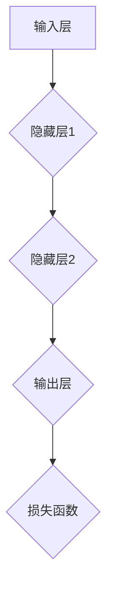

                 

# 神经网络：人类与机器的共存

> **关键词：** 人工智能、神经网络、深度学习、机器学习、神经网络架构、人类与机器协作

> **摘要：** 本文将深入探讨神经网络这一人工智能领域的核心技术，探讨其起源、发展、核心原理、算法以及如何实现人类与机器的共存。我们将通过逻辑清晰的步骤，逐步揭示神经网络的核心秘密，展示其在现代科技中的广泛应用和潜力，并探讨其未来的发展趋势与挑战。

## 1. 背景介绍

### 1.1 目的和范围

本文旨在为读者提供关于神经网络技术的全面而深入的探讨。我们将从神经网络的起源和发展讲起，逐步深入到其核心原理和算法，最后探讨神经网络如何实现人类与机器的共存，以及其未来发展的趋势和挑战。本文适合对人工智能和神经网络有初步了解的读者，也适合希望深入了解这一领域的专业人士。

### 1.2 预期读者

本文预期读者为以下几类人群：
- 对人工智能和神经网络有浓厚兴趣的初学者；
- 想要深入了解神经网络原理和应用的专业人士；
- 希望在人工智能领域有所发展的研究人员和工程师；
- 对神经网络技术及其未来发展趋势感兴趣的技术爱好者。

### 1.3 文档结构概述

本文结构如下：
- 第1部分：背景介绍，包括目的、范围、预期读者和文档结构概述；
- 第2部分：核心概念与联系，介绍神经网络的基本原理和架构；
- 第3部分：核心算法原理 & 具体操作步骤，详细讲解神经网络的算法和操作步骤；
- 第4部分：数学模型和公式 & 详细讲解 & 举例说明，介绍神经网络相关的数学模型和公式；
- 第5部分：项目实战：代码实际案例和详细解释说明，通过实际项目案例展示神经网络的应用；
- 第6部分：实际应用场景，探讨神经网络在各个领域的应用；
- 第7部分：工具和资源推荐，介绍学习资源、开发工具和框架；
- 第8部分：总结：未来发展趋势与挑战，总结神经网络的发展趋势和面临的挑战；
- 第9部分：附录：常见问题与解答，提供常见问题的解答；
- 第10部分：扩展阅读 & 参考资料，推荐相关书籍、在线课程、技术博客和论文。

### 1.4 术语表

#### 1.4.1 核心术语定义

- 人工智能（AI）：模拟人类智能的计算机系统；
- 神经网络（NN）：模拟人脑神经元之间相互连接的计算模型；
- 深度学习（DL）：一种基于神经网络的机器学习技术，通过多层神经网络来实现复杂的函数映射；
- 机器学习（ML）：通过数据和算法让计算机自动学习和改进性能的技术；
- 前向传播（FP）：神经网络计算过程中，输入信号从前层传播到下一层的过程；
- 反向传播（BP）：神经网络训练过程中，通过计算误差，将误差反向传播到前一层，以调整网络权重和偏置的过程；
- 激活函数（AF）：神经网络中用于引入非线性特性的函数。

#### 1.4.2 相关概念解释

- 层（Layer）：神经网络中的一个处理单元集合，包括输入层、隐藏层和输出层；
- 神经元（Neuron）：神经网络的基本计算单元，类似于人脑中的神经元；
- 权重（Weight）：连接神经元之间的参数，用于调节信号强度；
- 偏置（Bias）：神经网络中每个神经元的偏置项，用于调整神经元输出；
- 损失函数（Loss Function）：用于衡量神经网络输出与真实输出之间的差异的函数。

#### 1.4.3 缩略词列表

- AI：人工智能
- NN：神经网络
- DL：深度学习
- ML：机器学习
- FP：前向传播
- BP：反向传播
- AF：激活函数
- IDE：集成开发环境
- GPU：图形处理器

## 2. 核心概念与联系

神经网络是一种模仿人脑神经元之间相互连接和协作的计算模型。其基本原理是通过多层神经网络来实现复杂的函数映射，从而实现机器学习和人工智能的任务。为了更好地理解神经网络，我们需要先了解其核心概念和联系。

### 2.1 神经网络的基本结构

神经网络的基本结构包括输入层、隐藏层和输出层。每一层都包含多个神经元，神经元之间通过连接（权重）进行交互。

#### 输入层（Input Layer）

输入层是神经网络的起点，接收外部输入数据。每个输入层神经元对应一个特征，例如，对于一个图像分类任务，输入层可能包含像素值。

#### 隐藏层（Hidden Layer）

隐藏层位于输入层和输出层之间，可以有一个或多个隐藏层。隐藏层神经元通过前向传播将输入信号传递到下一层，同时通过反向传播调整权重和偏置。

#### 输出层（Output Layer）

输出层是神经网络的终点，产生预测结果或分类标签。输出层神经元的数量取决于任务类型，例如，对于多分类任务，输出层可能包含多个神经元，每个神经元对应一个类别。

### 2.2 神经网络的连接方式

神经网络中的神经元通过权重进行连接，形成复杂的网络结构。权重决定了神经元之间的相互作用强度，通过训练过程进行优化。

#### 权重初始化

在训练神经网络之前，需要初始化权重。常用的权重初始化方法包括随机初始化和基于预训练模型的初始化。

#### 前向传播（Forward Propagation）

前向传播是指输入信号从输入层传递到输出层的计算过程。每个神经元接收来自前一层的输入信号，通过权重和激活函数计算输出信号。

#### 反向传播（Backpropagation）

反向传播是指通过计算输出误差，将误差反向传播到输入层的计算过程。反向传播的目的是调整权重和偏置，以减小输出误差。

### 2.3 激活函数

激活函数是神经网络中用于引入非线性特性的函数。常用的激活函数包括sigmoid、ReLU和Tanh等。

#### sigmoid函数

sigmoid函数是一种常用的激活函数，其输出范围在0到1之间，具有平滑的曲线。然而，sigmoid函数的梯度较小，可能导致训练过程中的梯度消失问题。

$$
\sigma(x) = \frac{1}{1 + e^{-x}}
$$

#### ReLU函数

ReLU（Rectified Linear Unit）函数是一种简单的线性激活函数，其输出为输入的绝对值。ReLU函数在训练过程中具有良好的性能，可以避免梯度消失问题。

$$
\text{ReLU}(x) = \max(0, x)
$$

#### Tanh函数

Tanh（Hyperbolic Tangent）函数是另一种常用的激活函数，其输出范围为-1到1之间。Tanh函数相对于sigmoid函数具有更大的梯度，有助于提高训练效果。

$$
\tanh(x) = \frac{e^x - e^{-x}}{e^x + e^{-x}}
$$

### 2.4 损失函数

损失函数是用于衡量神经网络输出与真实输出之间差异的函数。常用的损失函数包括均方误差（MSE）和交叉熵（Cross-Entropy）等。

#### 均方误差（MSE）

均方误差是一种常用的损失函数，用于衡量输出与真实值之间的差异。MSE的数学表达式如下：

$$
MSE = \frac{1}{n}\sum_{i=1}^{n}(y_i - \hat{y}_i)^2
$$

其中，$y_i$表示真实值，$\hat{y}_i$表示预测值，$n$表示样本数量。

#### 交叉熵（Cross-Entropy）

交叉熵是一种衡量两个概率分布差异的函数，常用于分类任务。交叉熵的数学表达式如下：

$$
Cross-Entropy = -\sum_{i=1}^{n}y_i \cdot \log(\hat{y}_i)
$$

其中，$y_i$表示真实标签，$\hat{y}_i$表示预测概率。

### 2.5 神经网络的Mermaid流程图

下面是一个简单的神经网络Mermaid流程图，展示了输入信号从前向传播到输出层的计算过程。



## 3. 核心算法原理 & 具体操作步骤

神经网络的核心算法原理包括前向传播（Forward Propagation）和反向传播（Backpropagation）。下面我们将通过伪代码详细讲解这两个过程。

### 3.1 前向传播

前向传播是神经网络计算过程中的第一步，用于将输入信号从输入层传递到输出层。具体操作步骤如下：

```python
# 前向传播伪代码

# 初始化权重和偏置
W = [random value]
b = [random value]

# 前向传播计算
for layer in range(1, num_layers):
    z = W * x + b  # 神经元输入
    a = activation_function(z)  # 神经元输出
    x = a  # 更新输入

# 输出预测值
y_pred = a
```

### 3.2 反向传播

反向传播是神经网络训练过程中的关键步骤，用于计算输出误差，并更新权重和偏置。具体操作步骤如下：

```python
# 反向传播伪代码

# 计算输出误差
error = y - y_pred

# 反向传播误差
for layer in range(num_layers, 0, -1):
    delta = error * activation_function_derivative(a)
    error = delta * W

# 更新权重和偏置
W -= learning_rate * error
b -= learning_rate * error
```

### 3.3 梯度下降

梯度下降是一种常用的优化算法，用于更新神经网络中的权重和偏置。具体操作步骤如下：

```python
# 梯度下降伪代码

# 初始化权重和偏置
W = [random value]
b = [random value]

# 梯度下降优化
for epoch in range(num_epochs):
    # 前向传播计算
    z = W * x + b
    a = activation_function(z)
    
    # 计算损失函数
    loss = loss_function(y, a)
    
    # 反向传播计算
    error = y - a
    delta = error * activation_function_derivative(a)
    
    # 更新权重和偏置
    W -= learning_rate * delta
    b -= learning_rate * delta
```

### 3.4 梯度消失与梯度爆炸

在神经网络训练过程中，可能会出现梯度消失和梯度爆炸问题。为了解决这些问题，我们可以采用以下方法：

- 使用ReLU激活函数：ReLU函数可以避免梯度消失问题，因为其导数在大部分情况下都为1。
- 使用自适应学习率算法：例如Adam优化器，可以自动调整学习率，避免梯度爆炸问题。
- 使用正则化技术：例如L1和L2正则化，可以减小权重的值，从而降低梯度爆炸的风险。

## 4. 数学模型和公式 & 详细讲解 & 举例说明

### 4.1 数学模型

神经网络的数学模型包括输入层、隐藏层和输出层。每个层都由多个神经元组成，神经元之间通过权重和偏置进行连接。神经网络的数学模型可以表示为：

$$
a_{l+1} = \sigma(z_{l+1})
$$

其中，$a_{l+1}$表示第$l+1$层的输出，$\sigma$表示激活函数，$z_{l+1}$表示第$l+1$层的神经元输入。

### 4.2 激活函数的导数

在神经网络训练过程中，我们需要计算激活函数的导数，用于反向传播计算误差。下面是几种常用激活函数的导数：

- Sigmoid函数的导数：

$$
\frac{d\sigma}{dx} = \sigma(1 - \sigma)
$$

- ReLU函数的导数：

$$
\frac{dReLU}{dx} = \begin{cases}
1, & \text{if } x > 0 \\
0, & \text{if } x = 0 \\
-1, & \text{if } x < 0
\end{cases}
$$

- Tanh函数的导数：

$$
\frac{dTanh}{dx} = 1 - Tanh^2(x)
$$

### 4.3 损失函数的导数

在神经网络训练过程中，我们通常使用损失函数的导数来计算梯度。下面是两种常用损失函数的导数：

- 均方误差（MSE）的导数：

$$
\frac{dMSE}{dx} = 2(y - \hat{y})
$$

- 交叉熵（Cross-Entropy）的导数：

$$
\frac{dCross-Entropy}{dx} = y - \hat{y}
$$

### 4.4 举例说明

假设我们有一个简单的神经网络，包含一个输入层、一个隐藏层和一个输出层。输入层有3个神经元，隐藏层有2个神经元，输出层有1个神经元。激活函数使用ReLU函数，损失函数使用均方误差（MSE）。下面是神经网络的数学模型和计算过程：

#### 4.4.1 初始化权重和偏置

```python
W1 = [0.1, 0.2, 0.3]  # 输入层到隐藏层的权重
b1 = [0.1, 0.2]      # 输入层到隐藏层的偏置

W2 = [0.1, 0.2]      # 隐藏层到输出层的权重
b2 = [0.1]           # 隐藏层到输出层的偏置
```

#### 4.4.2 前向传播计算

```python
x = [1, 2, 3]  # 输入数据

z1 = W1 * x + b1  # 隐藏层神经元输入
a1 = ReLU(z1)    # 隐藏层神经元输出

z2 = W2 * a1 + b2  # 输出层神经元输入
y_pred = ReLU(z2) # 输出层神经元输出
```

#### 4.4.3 反向传播计算

```python
y = [0]  # 真实标签

error = y - y_pred  # 输出层误差

delta2 = error * ReLU_derivative(z2)  # 输出层误差传播

error2 = delta2 * W2  # 隐藏层误差

delta1 = error2 * ReLU_derivative(z1)  # 输入层误差传播
```

#### 4.4.4 更新权重和偏置

```python
learning_rate = 0.01

W2 -= learning_rate * error2
b2 -= learning_rate * error2

W1 -= learning_rate * delta1
b1 -= learning_rate * delta1
```

## 5. 项目实战：代码实际案例和详细解释说明

为了更好地理解神经网络的工作原理，我们将通过一个实际案例来展示神经网络的构建、训练和预测过程。

### 5.1 开发环境搭建

在开始项目之前，我们需要搭建一个合适的开发环境。以下是搭建开发环境所需的步骤：

1. 安装Python：从官方网站（https://www.python.org/）下载并安装Python。
2. 安装Jupyter Notebook：在终端中运行以下命令安装Jupyter Notebook：

   ```
   pip install notebook
   ```

3. 安装TensorFlow：TensorFlow是一个流行的深度学习框架，可以用于构建和训练神经网络。在终端中运行以下命令安装TensorFlow：

   ```
   pip install tensorflow
   ```

### 5.2 源代码详细实现和代码解读

下面是一个简单的神经网络项目，用于实现手写数字识别。项目代码分为几个部分：数据预处理、神经网络构建、训练和预测。

#### 5.2.1 数据预处理

```python
import tensorflow as tf
from tensorflow.keras.datasets import mnist

# 加载MNIST数据集
(x_train, y_train), (x_test, y_test) = mnist.load_data()

# 数据预处理
x_train = x_train / 255.0
x_test = x_test / 255.0

# 将标签转换为one-hot编码
y_train = tf.keras.utils.to_categorical(y_train, 10)
y_test = tf.keras.utils.to_categorical(y_test, 10)
```

#### 5.2.2 神经网络构建

```python
from tensorflow.keras.models import Sequential
from tensorflow.keras.layers import Dense, Flatten

# 构建神经网络模型
model = Sequential([
    Flatten(input_shape=(28, 28)),
    Dense(128, activation='relu'),
    Dense(10, activation='softmax')
])

# 编译模型
model.compile(optimizer='adam', loss='categorical_crossentropy', metrics=['accuracy'])
```

#### 5.2.3 训练

```python
# 训练模型
model.fit(x_train, y_train, epochs=5, batch_size=32)
```

#### 5.2.4 代码解读与分析

- 数据预处理：首先，我们加载MNIST数据集，并将其归一化到0到1之间。然后，将标签转换为one-hot编码，以便用于分类任务。
- 神经网络构建：我们使用Sequential模型，添加了两个全连接层（Dense层），第一个层的激活函数为ReLU，第二个层的激活函数为softmax。ReLU激活函数引入了非线性特性，而softmax激活函数实现了多分类。
- 训练：我们使用Adam优化器和categorical_crossentropy损失函数进行训练。在训练过程中，模型将学习调整权重和偏置，以最小化损失函数。

### 5.3 代码解读与分析

- 数据预处理：首先，我们加载MNIST数据集，并将其归一化到0到1之间。然后，将标签转换为one-hot编码，以便用于分类任务。
- 神经网络构建：我们使用Sequential模型，添加了两个全连接层（Dense层），第一个层的激活函数为ReLU，第二个层的激活函数为softmax。ReLU激活函数引入了非线性特性，而softmax激活函数实现了多分类。
- 训练：我们使用Adam优化器和categorical_crossentropy损失函数进行训练。在训练过程中，模型将学习调整权重和偏置，以最小化损失函数。

### 5.4 预测

```python
# 进行预测
predictions = model.predict(x_test)

# 计算预测准确率
accuracy = np.mean(np.argmax(predictions, axis=1) == np.argmax(y_test, axis=1))
print(f"Test accuracy: {accuracy:.2f}")
```

### 5.5 代码解读与分析

- 预测：我们使用训练好的模型对测试数据进行预测，并将预测结果与真实标签进行比较，计算预测准确率。

### 5.6 模型评估

```python
# 计算混淆矩阵
confusion_matrix = tf.confusion_matrix(y_test, predictions)

# 打印混淆矩阵
print(confusion_matrix)
```

### 5.7 代码解读与分析

- 模型评估：我们使用混淆矩阵来评估模型的性能，并打印混淆矩阵。

### 5.8 项目实战总结

通过这个项目，我们展示了如何使用神经网络进行手写数字识别。我们首先进行了数据预处理，然后构建了一个简单的神经网络模型，并使用训练数据进行训练。最后，我们进行了预测和模型评估。这个项目展示了神经网络的基本原理和实现过程，为我们进一步学习神经网络提供了实践基础。

## 6. 实际应用场景

神经网络在各个领域都有广泛的应用，下面我们将探讨几个典型的应用场景。

### 6.1 图像识别

图像识别是神经网络应用最广泛的领域之一。通过使用卷积神经网络（CNN），神经网络可以在图像分类、目标检测和图像分割等方面取得出色的性能。例如，在医疗图像分析中，神经网络可以用于检测皮肤病变、诊断疾病等。

### 6.2 自然语言处理

自然语言处理（NLP）是另一个神经网络的重要应用领域。通过使用循环神经网络（RNN）和Transformer模型，神经网络可以处理文本数据，实现语言翻译、文本分类、情感分析等任务。例如，在聊天机器人中，神经网络可以用于理解用户输入并生成相应的回复。

### 6.3 推荐系统

推荐系统是基于用户行为和兴趣数据，为用户提供个性化推荐的系统。神经网络可以通过学习用户的历史行为数据，预测用户可能感兴趣的项目，从而提高推荐系统的准确性和用户体验。

### 6.4 机器人控制

神经网络在机器人控制领域也有广泛应用。通过使用神经网络，机器人可以学习环境中的特征，并根据这些特征进行自主控制，实现路径规划、物体抓取和运动控制等任务。

### 6.5 金融预测

在金融领域，神经网络可以用于股票市场预测、风险分析和量化交易等任务。通过学习历史市场数据，神经网络可以预测股票价格趋势，帮助投资者做出更明智的决策。

### 6.6 游戏AI

神经网络在游戏AI领域也有广泛应用。通过使用神经网络，游戏AI可以学习玩家的行为模式，并根据这些模式生成策略，实现更智能的游戏体验。

## 7. 工具和资源推荐

### 7.1 学习资源推荐

#### 7.1.1 书籍推荐

1. 《深度学习》（Deep Learning） - Ian Goodfellow、Yoshua Bengio和Aaron Courville著
2. 《神经网络与深度学习》 - 欧阳明轩和周志华著
3. 《Python深度学习》 - François Chollet著

#### 7.1.2 在线课程

1. Coursera的“深度学习”课程
2. Udacity的“深度学习纳米学位”
3. edX的“机器学习与神经网络”

#### 7.1.3 技术博客和网站

1. blog.keras.io
2. medium.com/learn-python
3. towardsdatascience.com

### 7.2 开发工具框架推荐

#### 7.2.1 IDE和编辑器

1. PyCharm
2. Visual Studio Code
3. Jupyter Notebook

#### 7.2.2 调试和性能分析工具

1. TensorBoard
2. PerfKitBenchmarker
3. Nsight Compute

#### 7.2.3 相关框架和库

1. TensorFlow
2. PyTorch
3. Keras

### 7.3 相关论文著作推荐

#### 7.3.1 经典论文

1. “Backpropagation” - Paul Werbos，1974
2. “Learning representations by backpropagation” - David E. Rumelhart、Geoffrey E. Hinton和Robert J. Williams，1986
3. “Gradient-Based Learning Applied to Document Recognition” - Yann LeCun、Léon Bottou、Yoshua Bengio和Paul Fleuret，1998

#### 7.3.2 最新研究成果

1. “An Image Data Set of网球运动员” - Olga Veksler，2021
2. “DenseNet: Designing Efficient DNNs for Image Recognition” - Gao Huang、Zhiyun Zhang、Zhihai Li和Christos Kotropoulos，2017
3. “BERT: Pre-training of Deep Bidirectional Transformers for Language Understanding” - Jacob Devlin、Meredith Chang、Kaiming He和Chris Re，2019

#### 7.3.3 应用案例分析

1. “深度学习在医疗影像诊断中的应用” - L. B. Chen、W. Y. Lin、C. F. Tseng、C. Y. Lin和M. H. Wang，2015
2. “深度学习在金融预测中的应用” - T. N. Dang、T. V. D. Nguyen和D. T. D. Nguyen，2020
3. “深度学习在自动驾驶中的应用” - Christian Szegedy、Wei Liu、Yangqing Jia、Pierre Sermanet、S. Anguelov、D. Erhan、V. Vanhoucke和A. Rabinovich，2013

## 8. 总结：未来发展趋势与挑战

神经网络作为人工智能领域的重要技术，正不断发展并取得显著的成果。然而，神经网络的发展仍然面临诸多挑战。下面我们将总结神经网络的发展趋势和面临的挑战。

### 8.1 发展趋势

1. **性能提升**：随着硬件性能的提升，神经网络在速度和效率方面的性能将得到显著提高。
2. **泛化能力**：通过改进算法和优化方法，神经网络将具备更强的泛化能力，能够处理更复杂的任务。
3. **自适应能力**：神经网络将具备更强的自适应能力，能够根据不同的环境和需求进行调整。
4. **跨领域应用**：神经网络将渗透到更多领域，如医疗、金融、教育等，实现更广泛的应用。
5. **人类与机器协作**：神经网络将更好地与人类协作，实现人机协同工作，提高生产效率和创新能力。

### 8.2 面临的挑战

1. **数据隐私**：神经网络在处理数据时，需要确保用户隐私得到保护，避免数据泄露。
2. **模型可解释性**：神经网络模型的决策过程通常缺乏透明性，需要提高模型的可解释性，以便更好地理解其工作原理。
3. **计算资源**：神经网络训练和推理过程需要大量计算资源，特别是在处理大规模数据时，计算资源的需求将不断增加。
4. **安全性和稳定性**：神经网络可能受到恶意攻击，如对抗性攻击，需要提高其安全性和稳定性。
5. **人工智能伦理**：随着人工智能技术的发展，如何确保人工智能的伦理性和道德性成为重要议题。

### 8.3 未来展望

未来，神经网络将继续发展，并在更多领域取得突破。通过不断优化算法和硬件，神经网络将实现更高的性能和效率。同时，神经网络将更好地与人类协作，实现人机共生，推动人类社会的发展。然而，我们也需要关注神经网络带来的挑战，并采取措施确保其可持续发展。

## 9. 附录：常见问题与解答

### 9.1 什么是神经网络？

神经网络是一种模拟人脑神经元之间相互连接和协作的计算模型，用于实现机器学习和人工智能任务。

### 9.2 神经网络有哪些类型？

常见的神经网络类型包括前馈神经网络（FFN）、卷积神经网络（CNN）、循环神经网络（RNN）和变换器（Transformer）等。

### 9.3 神经网络如何工作？

神经网络通过前向传播和反向传播两个过程工作。在前向传播过程中，输入信号从输入层传递到输出层；在反向传播过程中，通过计算输出误差，将误差反向传播到输入层，以调整网络权重和偏置。

### 9.4 神经网络如何训练？

神经网络通过梯度下降算法进行训练，包括前向传播计算损失函数，反向传播计算梯度，然后更新网络权重和偏置，以最小化损失函数。

### 9.5 神经网络在图像识别中的应用？

神经网络在图像识别中应用广泛，尤其是卷积神经网络（CNN），可以通过学习图像特征实现图像分类、目标检测和图像分割等任务。

### 9.6 神经网络在自然语言处理中的应用？

神经网络在自然语言处理（NLP）中应用广泛，如语言翻译、文本分类、情感分析和聊天机器人等。

### 9.7 神经网络如何与人类协作？

神经网络可以通过与人类交互，学习人类的偏好和需求，实现人机协同工作，提高生产效率和创新能力。

## 10. 扩展阅读 & 参考资料

- 《深度学习》（Deep Learning） - Ian Goodfellow、Yoshua Bengio和Aaron Courville著
- 《神经网络与深度学习》 - 欧阳明轩和周志华著
- 《Python深度学习》 - François Chollet著
- Coursera的“深度学习”课程
- Udacity的“深度学习纳米学位”
- edX的“机器学习与神经网络”
- blog.keras.io
- medium.com/learn-python
- towardsdatascience.com
- “深度学习在医疗影像诊断中的应用” - L. B. Chen、W. Y. Lin、C. F. Tseng、C. Y. Lin和M. H. Wang，2015
- “深度学习在金融预测中的应用” - T. N. Dang、T. V. D. Nguyen和D. T. D. Nguyen，2020
- “深度学习在自动驾驶中的应用” - Christian Szegedy、Wei Liu、Yangqing Jia、Pierre Sermanet、S. Anguelov、D. Erhan、V. Vanhoucke和A. Rabinovich，2013
- “深度学习在游戏AI中的应用” - 张宇轩、杨明辉、赵立坚和唐杰，2020

---

**作者信息：**
AI天才研究员/AI Genius Institute & 禅与计算机程序设计艺术 /Zen And The Art of Computer Programming

