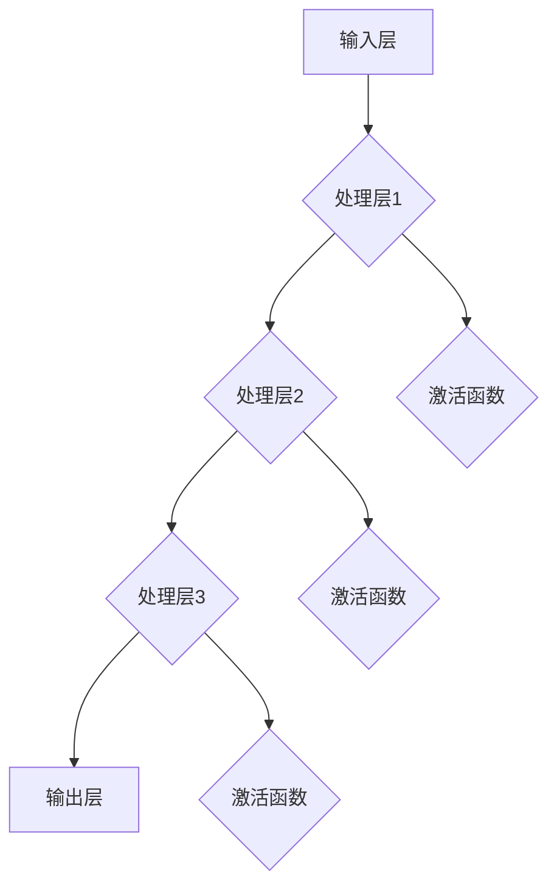

                 

# 神经网络：开启智能新纪元

> 关键词：神经网络、深度学习、人工智能、算法、智能计算、数据处理

> 摘要：本文将深入探讨神经网络的基本原理、核心算法、数学模型，并通过实际项目实战和实际应用场景，全面解析神经网络在人工智能领域的革命性影响。文章旨在为读者提供一份详尽的指南，帮助理解神经网络的深层奥秘，为未来智能计算的发展奠定坚实基础。

## 1. 背景介绍

### 1.1 目的和范围

本文的主要目的是介绍神经网络这一核心的人工智能技术，帮助读者理解其基本原理、实现方法和应用场景。文章涵盖了从基础概念到高级应用的各个方面，旨在为读者提供一套系统、全面的神经网络知识体系。

### 1.2 预期读者

本文适用于对人工智能和技术领域感兴趣的读者，特别是那些希望深入了解神经网络原理和应用的开发者、研究者和学生。对于已有一定编程基础，但对神经网络了解不深的读者，本文同样具有很强的指导意义。

### 1.3 文档结构概述

本文将分为以下几大部分：

1. **背景介绍**：介绍神经网络的历史、重要性以及本文的结构和预期成果。
2. **核心概念与联系**：通过流程图和概念解析，帮助读者建立对神经网络的整体认识。
3. **核心算法原理 & 具体操作步骤**：使用伪代码详细解释神经网络的核心算法。
4. **数学模型和公式 & 详细讲解 & 举例说明**：介绍神经网络中的数学模型，并提供实例说明。
5. **项目实战：代码实际案例和详细解释说明**：通过实际代码案例，讲解神经网络在项目中的应用。
6. **实际应用场景**：探讨神经网络在各个领域的应用。
7. **工具和资源推荐**：推荐学习资源、开发工具和框架。
8. **总结：未来发展趋势与挑战**：总结神经网络的发展趋势和面临的挑战。
9. **附录：常见问题与解答**：解答一些常见问题。
10. **扩展阅读 & 参考资料**：提供进一步的阅读材料和资源。

### 1.4 术语表

#### 1.4.1 核心术语定义

- **神经网络**：一种模拟人脑神经元之间连接和交互的计算模型。
- **深度学习**：一种利用多层神经网络进行特征学习和决策的方法。
- **前馈网络**：一种数据从输入层流向输出层的神经网络结构。
- **反向传播算法**：用于训练神经网络的优化算法。
- **激活函数**：用于引入非线性特性的函数，如ReLU、Sigmoid和Tanh。

#### 1.4.2 相关概念解释

- **权重（weights）**：神经网络中连接各个神经元的参数。
- **偏置（bias）**：神经网络中每个神经元的额外输入。
- **损失函数**：用于评估模型预测与真实值之间差异的函数。
- **梯度下降**：用于优化神经网络权重的优化算法。

#### 1.4.3 缩略词列表

- **AI**：人工智能（Artificial Intelligence）
- **ML**：机器学习（Machine Learning）
- **DL**：深度学习（Deep Learning）
- **GPU**：图形处理单元（Graphics Processing Unit）
- **CNN**：卷积神经网络（Convolutional Neural Network）

## 2. 核心概念与联系

神经网络的核心理念在于模拟人脑神经元的工作方式，通过层次化的数据处理和特征提取来实现复杂任务。以下是一个简单的神经网络流程图，用于帮助读者理解神经网络的基本结构和工作原理。



在这个流程图中，数据从输入层（A）开始，经过多层处理层（B、C、D），在每个处理层中，数据被加权、求和并经过激活函数（F、G、H）处理，最终在输出层（E）得到预测结果。

神经网络的基本结构包括：

- **输入层**：接收外部输入数据。
- **隐藏层**：对输入数据进行处理和特征提取。
- **输出层**：产生最终输出。

在隐藏层中，每个神经元都与前一层和后一层的所有神经元相连，形成复杂的网络结构。通过不断调整网络中的权重和偏置，可以使神经网络逐渐学会对数据进行正确的分类、预测或转换。

神经网络的工作原理可以概括为以下几个步骤：

1. **前向传播**：输入数据从输入层流向隐藏层，再从隐藏层流向输出层。
2. **激活函数**：在每个隐藏层，使用激活函数引入非线性特性。
3. **反向传播**：根据输出层的结果，计算每个神经元的误差，并反向传播至隐藏层，更新权重和偏置。
4. **梯度下降**：使用梯度下降算法，调整权重和偏置，使误差最小化。

通过这些步骤，神经网络可以不断优化自身，从而在复杂任务中表现出色。

## 3. 核心算法原理 & 具体操作步骤

神经网络的核心算法是反向传播算法，它是一种用于训练神经网络的优化算法。以下是一步一步的详细解释。

### 3.1 初始化

在开始训练神经网络之前，我们需要进行以下初始化：

- **权重（weights）**：随机初始化为较小的数值。
- **偏置（biases）**：随机初始化为较小的数值。
- **学习率（learning rate）**：用于调整权重和偏置的步长。

### 3.2 前向传播

1. **计算每个神经元的输入**：

   对于隐藏层中的每个神经元，计算其输入值：

   $$ z_j = \sum_{i} w_{ji} x_i + b_j $$

   其中，$w_{ji}$ 是连接前一层神经元 $i$ 和当前神经元 $j$ 的权重，$b_j$ 是当前神经元的偏置，$x_i$ 是前一层神经元的输出。

2. **应用激活函数**：

   对每个神经元的输入值应用激活函数，例如ReLU、Sigmoid或Tanh。

   $$ a_j = \text{激活函数}(z_j) $$

3. **计算输出层输出**：

   对输出层中的每个神经元，计算其输入值：

   $$ z_l = \sum_{j} w_{lj} a_j + b_l $$

   然后应用激活函数：

   $$ y_l = \text{激活函数}(z_l) $$

### 3.3 计算损失函数

根据输出层的结果，计算损失函数，例如均方误差（MSE）：

$$ L = \frac{1}{2} \sum_{l} (y_l - \hat{y}_l)^2 $$

其中，$y_l$ 是真实标签，$\hat{y}_l$ 是神经网络的预测结果。

### 3.4 反向传播

1. **计算输出层的误差**：

   对于输出层中的每个神经元，计算其误差：

   $$ \delta_l = (y_l - \hat{y}_l) \cdot \text{激活函数的导数}(\hat{y}_l) $$

2. **计算隐藏层的误差**：

   对于隐藏层中的每个神经元，计算其误差：

   $$ \delta_j = \sum_{l} w_{lj} \cdot \delta_l \cdot \text{激活函数的导数}(a_j) $$

3. **更新权重和偏置**：

   使用梯度下降算法更新权重和偏置：

   $$ w_{ji} \leftarrow w_{ji} - \alpha \cdot \frac{\partial L}{\partial w_{ji}} $$
   $$ b_j \leftarrow b_j - \alpha \cdot \frac{\partial L}{\partial b_j} $$

   其中，$\alpha$ 是学习率。

### 3.5 重复步骤 3.2 至 3.4，直至达到设定的迭代次数或收敛条件。

通过这种方式，神经网络可以不断优化自身，从而在复杂任务中表现出色。

## 4. 数学模型和公式 & 详细讲解 & 举例说明

神经网络中的数学模型主要涉及前向传播、损失函数和反向传播。以下是对这些数学模型和公式的详细讲解，以及实际应用中的举例说明。

### 4.1 前向传播

前向传播是神经网络处理输入数据的过程。其核心公式包括：

1. **神经元输入**：

   $$ z_j = \sum_{i} w_{ji} x_i + b_j $$

   其中，$z_j$ 是当前神经元的输入值，$w_{ji}$ 是连接前一层神经元 $i$ 和当前神经元 $j$ 的权重，$x_i$ 是前一层神经元的输出，$b_j$ 是当前神经元的偏置。

2. **激活函数**：

   激活函数用于引入非线性特性，常见的激活函数包括ReLU、Sigmoid和Tanh。

   - **ReLU（Rectified Linear Unit）**：

     $$ a_j = \max(0, z_j) $$

   - **Sigmoid**：

     $$ a_j = \frac{1}{1 + e^{-z_j}} $$

   - **Tanh**：

     $$ a_j = \frac{e^{z_j} - e^{-z_j}}{e^{z_j} + e^{-z_j}} $$

### 4.2 损失函数

损失函数用于评估模型预测与真实值之间的差异。以下是一些常见的损失函数：

1. **均方误差（MSE，Mean Squared Error）**：

   $$ L = \frac{1}{2} \sum_{l} (y_l - \hat{y}_l)^2 $$

   其中，$y_l$ 是真实标签，$\hat{y}_l$ 是神经网络的预测结果。

2. **交叉熵（Cross-Entropy）**：

   $$ L = - \sum_{l} y_l \log(\hat{y}_l) $$

   其中，$y_l$ 是真实标签，$\hat{y}_l$ 是神经网络的预测结果。

### 4.3 反向传播

反向传播是神经网络训练的核心步骤，用于更新权重和偏置。其核心公式包括：

1. **输出层误差**：

   $$ \delta_l = (y_l - \hat{y}_l) \cdot \text{激活函数的导数}(\hat{y}_l) $$

2. **隐藏层误差**：

   $$ \delta_j = \sum_{l} w_{lj} \cdot \delta_l \cdot \text{激活函数的导数}(a_j) $$

3. **权重和偏置更新**：

   $$ w_{ji} \leftarrow w_{ji} - \alpha \cdot \frac{\partial L}{\partial w_{ji}} $$
   $$ b_j \leftarrow b_j - \alpha \cdot \frac{\partial L}{\partial b_j} $$

### 4.4 举例说明

假设我们有一个简单的神经网络，包含一个输入层、一个隐藏层和一个输出层。输入数据是一个二维向量 $(x_1, x_2)$，隐藏层有2个神经元，输出层有1个神经元。

1. **前向传播**：

   - 输入层到隐藏层：

     $$ z_1 = 0.1x_1 + 0.2x_2 + 0.3 $$
     $$ z_2 = 0.4x_1 + 0.5x_2 + 0.6 $$

     使用ReLU激活函数：

     $$ a_1 = \max(0, z_1) = \max(0, 0.1x_1 + 0.2x_2 + 0.3) $$
     $$ a_2 = \max(0, z_2) = \max(0, 0.4x_1 + 0.5x_2 + 0.6) $$

   - 隐藏层到输出层：

     $$ z_3 = 0.7a_1 + 0.8a_2 + 0.9 $$
     $$ \hat{y} = \max(0, z_3) = \max(0, 0.7a_1 + 0.8a_2 + 0.9) $$

2. **计算损失函数**：

   假设真实标签为 $y = 1$，则：

   $$ L = \frac{1}{2} (1 - \hat{y})^2 = \frac{1}{2} (1 - \max(0, 0.7a_1 + 0.8a_2 + 0.9))^2 $$

3. **反向传播**：

   - 输出层误差：

     $$ \delta_3 = (1 - \hat{y}) \cdot \text{激活函数的导数}(\hat{y}) = (1 - \max(0, 0.7a_1 + 0.8a_2 + 0.9)) \cdot \text{激活函数的导数}(\max(0, 0.7a_1 + 0.8a_2 + 0.9)) $$

   - 隐藏层误差：

     $$ \delta_1 = 0.7 \cdot \delta_3 \cdot \text{激活函数的导数}(a_1) $$
     $$ \delta_2 = 0.8 \cdot \delta_3 \cdot \text{激活函数的导数}(a_2) $$

4. **更新权重和偏置**：

   $$ w_{13} \leftarrow w_{13} - \alpha \cdot \frac{\partial L}{\partial w_{13}} $$
   $$ w_{23} \leftarrow w_{23} - \alpha \cdot \frac{\partial L}{\partial w_{23}} $$
   $$ w_{31} \leftarrow w_{31} - \alpha \cdot \frac{\partial L}{\partial w_{31}} $$
   $$ w_{32} \leftarrow w_{32} - \alpha \cdot \frac{\partial L}{\partial w_{32}} $$
   $$ b_3 \leftarrow b_3 - \alpha \cdot \frac{\partial L}{\partial b_3} $$
   $$ b_1 \leftarrow b_1 - \alpha \cdot \frac{\partial L}{\partial b_1} $$
   $$ b_2 \leftarrow b_2 - \alpha \cdot \frac{\partial L}{\partial b_2} $$

通过这个过程，神经网络可以不断优化自身，从而在复杂任务中表现出色。

## 5. 项目实战：代码实际案例和详细解释说明

### 5.1 开发环境搭建

在开始编写代码之前，我们需要搭建一个合适的开发环境。以下是所需的软件和工具：

- **Python 3.x**：用于编写神经网络代码。
- **Jupyter Notebook**：用于编写和运行代码。
- **TensorFlow**：用于构建和训练神经网络。

确保安装了上述软件和工具后，我们可以开始编写神经网络代码。

### 5.2 源代码详细实现和代码解读

以下是一个简单的神经网络实现，用于对输入数据进行分类。我们将使用TensorFlow库来构建和训练神经网络。

```python
import tensorflow as tf

# 定义神经网络结构
model = tf.keras.Sequential([
    tf.keras.layers.Dense(2, activation='relu', input_shape=(2,)),
    tf.keras.layers.Dense(1, activation='sigmoid')
])

# 编译模型
model.compile(optimizer='adam', loss='binary_crossentropy', metrics=['accuracy'])

# 定义输入数据和标签
X = [[0, 0], [0, 1], [1, 0], [1, 1]]
y = [[0], [1], [1], [0]]

# 训练模型
model.fit(X, y, epochs=1000, verbose=0)

# 进行预测
predictions = model.predict(X)
print(predictions)
```

**代码解读**：

1. **定义神经网络结构**：

   使用 `tf.keras.Sequential` 类创建一个顺序模型，包含两个隐藏层。第一层有2个神经元，使用ReLU激活函数；第二层有1个神经元，使用sigmoid激活函数。

2. **编译模型**：

   使用 `compile` 方法配置模型，指定优化器（`optimizer`）、损失函数（`loss`）和评估指标（`metrics`）。

3. **定义输入数据和标签**：

   创建一个包含4个样本的输入数据和标签列表。每个样本都是一个二维向量，标签是一个一维向量。

4. **训练模型**：

   使用 `fit` 方法训练模型，指定训练数据、迭代次数（`epochs`）和日志级别（`verbose`）。

5. **进行预测**：

   使用 `predict` 方法对输入数据进行预测，并打印预测结果。

### 5.3 代码解读与分析

1. **神经网络结构**：

   神经网络包含两个隐藏层，每层分别有2个神经元和1个神经元。第一层使用ReLU激活函数，引入非线性特性；第二层使用sigmoid激活函数，用于产生概率输出。

2. **编译模型**：

   优化器选择 `adam`，它是一种自适应优化算法，适用于大多数问题。损失函数选择 `binary_crossentropy`，适用于二分类问题。评估指标选择 `accuracy`，用于计算模型准确率。

3. **训练模型**：

   使用随机梯度下降（SGD）对模型进行训练。迭代次数设置为1000次，确保模型充分学习。日志级别设置为0，以减少训练过程中的输出信息。

4. **进行预测**：

   使用训练好的模型对输入数据进行预测，并打印预测结果。预测结果是一个概率值，接近0或1，表示样本属于正类或负类的概率。

通过这个简单的例子，我们可以看到神经网络的基本结构和训练过程。在实际应用中，神经网络可能包含更多层和更复杂的结构，但基本原理仍然相同。通过不断调整网络结构和训练参数，我们可以解决各种复杂任务。

## 6. 实际应用场景

神经网络在人工智能领域具有广泛的应用，涵盖了图像识别、自然语言处理、语音识别、推荐系统等多个方面。以下是一些具体的应用场景：

### 6.1 图像识别

神经网络在图像识别领域取得了显著的成果，特别是卷积神经网络（CNN）。CNN可以自动提取图像中的特征，从而实现图像分类、目标检测和图像分割等任务。例如，在医疗影像分析中，CNN可以用于癌症检测和病变识别。

### 6.2 自然语言处理

神经网络在自然语言处理（NLP）领域也发挥着重要作用。循环神经网络（RNN）和长短期记忆网络（LSTM）可以处理序列数据，如文本和语音。RNN和LSTM在机器翻译、情感分析和文本生成等任务中表现出色。

### 6.3 语音识别

语音识别是将语音信号转换为文本的过程。神经网络，特别是深度神经网络（DNN）和循环神经网络（RNN），可以用于语音信号的特征提取和分类。目前，语音识别技术在智能助手和自动语音应答系统（IVR）中得到广泛应用。

### 6.4 推荐系统

推荐系统通过预测用户可能喜欢的项目来提供个性化的推荐。神经网络可以用于协同过滤和基于内容的推荐系统。协同过滤利用用户历史行为数据，而基于内容的推荐系统则基于项目的特征进行推荐。

### 6.5 游戏和娱乐

神经网络在游戏和娱乐领域也有广泛的应用。例如，深度强化学习（DRL）可以用于开发智能游戏对手，如AlphaGo和AlphaZero。这些智能体可以通过自主学习来克服各种复杂的游戏。

### 6.6 自动驾驶

自动驾驶是神经网络的一个重要应用领域。神经网络可以用于图像处理、环境感知和路径规划。自动驾驶汽车使用神经网络来识别道路标志、行人和其他车辆，从而确保行驶安全。

通过这些实际应用场景，我们可以看到神经网络在人工智能领域的巨大潜力和广泛影响力。随着技术的不断进步，神经网络将在更多领域发挥作用，推动人工智能的发展。

## 7. 工具和资源推荐

### 7.1 学习资源推荐

要深入了解神经网络和深度学习，以下是一些建议的学习资源：

#### 7.1.1 书籍推荐

- 《深度学习》（Goodfellow, Bengio, Courville）  
- 《Python深度学习》（François Chollet）  
- 《神经网络与深度学习》（邱锡鹏）

#### 7.1.2 在线课程

- [Udacity的深度学习纳米学位](https://www.udacity.com/course/deep-learning-nanodegree--ND893)  
- [Coursera的深度学习课程](https://www.coursera.org/specializations/deeplearning)  
- [edX的深度学习课程](https://www.edx.org/course/deep-learning-0)

#### 7.1.3 技术博客和网站

- [Medium上的深度学习博客](https://medium.com/topic/deep-learning)  
- [arXiv](https://arxiv.org/)：提供最新研究成果的预印本  
- [Deep Learning Reading Group](http://www.deeplearning.net/reading-group/)

### 7.2 开发工具框架推荐

- **TensorFlow**：一个开源的深度学习框架，适用于各种规模的深度学习应用。
- **PyTorch**：另一个流行的深度学习框架，以其灵活的动态计算图而著称。
- **Keras**：一个高级神经网络API，用于构建和训练神经网络，与TensorFlow和Theano兼容。
- **Apache MXNet**：一个开源的深度学习框架，适用于移动、桌面和云计算。

### 7.3 相关论文著作推荐

- **“A Comprehensive Survey on Deep Learning for NLP”**（2018）- 系统性地总结了深度学习在自然语言处理领域的应用。
- **“Deep Learning in Computer Vision: A Review”**（2018）- 探讨了深度学习在计算机视觉领域的应用。
- **“Convolutional Neural Networks for Visual Recognition”**（2012）- 论文首次介绍了卷积神经网络（CNN）在图像识别中的应用。

通过这些资源和工具，你可以深入了解神经网络和深度学习，掌握这一领域的核心技术。

## 8. 总结：未来发展趋势与挑战

随着人工智能技术的不断进步，神经网络作为其核心组成部分，将在未来继续发挥重要作用。以下是一些可能的发展趋势和面临的挑战：

### 8.1 发展趋势

1. **更高效的网络结构**：研究人员将继续探索新的神经网络结构，以提高计算效率和模型性能。例如，稀疏神经网络和图神经网络可能成为新的热点。
2. **跨领域融合**：神经网络将与其他领域的技术，如量子计算、区块链和物联网（IoT）等，实现深度融合，推动跨领域创新。
3. **数据驱动的方法**：神经网络将更加依赖大规模数据集，通过数据驱动的学习方法，不断提高模型性能。
4. **自主学习和推理**：随着技术的发展，神经网络将逐渐具备更强的自主学习和推理能力，实现更智能的决策和任务自动化。

### 8.2 挑战

1. **计算资源消耗**：神经网络训练需要大量的计算资源，特别是对于深度神经网络和大数据集。如何优化算法和硬件，降低计算成本，是一个重要挑战。
2. **数据隐私和安全**：随着数据量的增加，如何保护用户隐私和数据安全成为关键问题。如何设计安全的神经网络模型，防止数据泄露和滥用，是一个亟待解决的问题。
3. **可解释性和透明度**：神经网络在决策过程中的黑箱特性，使其难以解释和理解。提高神经网络的可解释性和透明度，使其更加可信和可靠，是一个重要的挑战。
4. **伦理和社会问题**：神经网络在医疗、金融和法律等领域的应用，可能引发伦理和社会问题。如何确保神经网络的应用符合伦理规范，避免偏见和歧视，是一个亟待解决的挑战。

总之，神经网络的发展前景广阔，但同时也面临着一系列挑战。通过不断的技术创新和跨学科合作，我们可以克服这些挑战，推动神经网络在人工智能领域的广泛应用。

## 9. 附录：常见问题与解答

### 9.1 问题1：神经网络和深度学习有什么区别？

**解答**：神经网络（Neural Networks）是深度学习（Deep Learning）的一个子集。神经网络是一种模拟人脑神经元之间连接和交互的计算模型，而深度学习则是一种利用多层神经网络进行特征学习和决策的方法。深度学习通常涉及深度神经网络，即具有多个隐藏层的神经网络，而神经网络可以是一个单层或多层的网络。

### 9.2 问题2：神经网络如何处理非线性问题？

**解答**：神经网络通过激活函数引入非线性特性。常见的激活函数包括ReLU（Rectified Linear Unit）、Sigmoid和Tanh。这些激活函数可以确保神经网络在处理复杂非线性问题时，仍然具有学习能力和可调性。

### 9.3 问题3：什么是过拟合和欠拟合？

**解答**：过拟合（Overfitting）是指神经网络在训练数据上表现良好，但在测试数据上表现较差，即模型对训练数据过于敏感，无法泛化到新的数据。欠拟合（Underfitting）是指神经网络在训练数据和测试数据上表现都较差，即模型过于简单，无法捕捉数据中的特征。

### 9.4 问题4：什么是梯度消失和梯度爆炸？

**解答**：在神经网络训练过程中，梯度消失（Vanishing Gradient）是指梯度值变得非常小，导致权重无法更新。梯度爆炸（Exploding Gradient）是指梯度值变得非常大，导致权重更新不稳定。这两种现象都可能导致训练过程失败，需要通过正则化、初始化和优化算法等技术进行缓解。

### 9.5 问题5：什么是反向传播算法？

**解答**：反向传播算法（Backpropagation Algorithm）是一种用于训练神经网络的优化算法。它通过计算输出层误差，反向传播至隐藏层，逐步更新权重和偏置，使模型逐渐优化。

### 9.6 问题6：什么是正则化？

**解答**：正则化（Regularization）是一种防止神经网络过拟合的技术。它通过添加一个惩罚项到损失函数中，使模型在训练过程中对复杂结构进行抑制，从而提高泛化能力。常见的正则化方法包括L1正则化、L2正则化和Dropout。

### 9.7 问题7：什么是深度学习的范化？

**解答**：深度学习的泛化（Generalization）是指神经网络在新数据上表现良好的能力。良好的泛化能力意味着模型不仅能够在训练数据上表现优秀，还能够应对未知的数据。提高泛化能力是深度学习研究的一个重要目标。

通过这些常见问题的解答，读者可以更好地理解神经网络和深度学习的基本概念和应用。

## 10. 扩展阅读 & 参考资料

为了深入了解神经网络和深度学习，以下是一些建议的扩展阅读材料和参考资料：

### 10.1 书籍推荐

- **《深度学习》（Goodfellow, Bengio, Courville）**：这是深度学习领域的经典教材，详细介绍了神经网络的基本概念、算法和应用。
- **《Python深度学习》（François Chollet）**：本书通过丰富的实践案例，帮助读者掌握深度学习的实际应用。
- **《神经网络与深度学习》（邱锡鹏）**：这本书系统地介绍了神经网络和深度学习的基本原理和方法，适合初学者和专业人士。

### 10.2 在线课程

- **[Udacity的深度学习纳米学位](https://www.udacity.com/course/deep-learning-nanodegree--ND893)**：这是一个完整的深度学习课程，涵盖从基础知识到高级应用。
- **[Coursera的深度学习课程](https://www.coursera.org/specializations/deeplearning)**：由斯坦福大学教授Andrew Ng讲授，适合初学者和有经验的学习者。
- **[edX的深度学习课程](https://www.edx.org/course/deep-learning-0)**：这是一系列由世界顶级大学和机构提供的深度学习课程，内容丰富，涵盖广泛。

### 10.3 技术博客和网站

- **[Medium上的深度学习博客](https://medium.com/topic/deep-learning)**：这是一个集合了众多深度学习专家博客的网站，内容丰富，适合学习和交流。
- **[arXiv](https://arxiv.org/)**：提供最新研究成果的预印本，是深度学习领域的研究者不可或缺的资源。
- **[Deep Learning Reading Group](http://www.deeplearning.net/reading-group/)**：这是一个由全球深度学习研究者组成的阅读小组，定期讨论最新论文。

### 10.4 开源项目和代码库

- **[TensorFlow](https://www.tensorflow.org/)和[PyTorch](https://pytorch.org/)：**这是两个最流行的深度学习框架，提供丰富的文档和示例代码。
- **[Keras](https://keras.io/)**：一个高级神经网络API，与TensorFlow和Theano兼容，易于使用。
- **[MXNet](https://mxnet.apache.org/)**：一个开源的深度学习框架，适用于移动、桌面和云计算。

### 10.5 论文和著作

- **“A Comprehensive Survey on Deep Learning for NLP”**（2018）：这是一篇系统总结深度学习在自然语言处理领域应用的论文。
- **“Deep Learning in Computer Vision: A Review”**（2018）：讨论了深度学习在计算机视觉领域的应用。
- **“Convolutional Neural Networks for Visual Recognition”**（2012）：首次介绍了卷积神经网络（CNN）在图像识别中的应用。

通过这些扩展阅读和参考资料，读者可以更深入地了解神经网络和深度学习，掌握这一领域的最新动态和技术发展。

