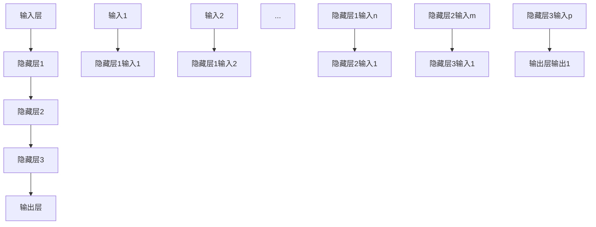

                 

### 神经网络：探索未知的领域

> **关键词：**神经网络、深度学习、机器学习、人工智能、模型架构、算法原理、数学模型、项目实战

> **摘要：**本文旨在深入探讨神经网络这一强大的机器学习工具，从其历史背景、核心概念、算法原理到实际应用，通过一步一步的分析和推理，帮助读者全面理解神经网络的奥妙。文章将结合实例代码和数学公式，详细解析神经网络的工作机制和实现方法，旨在为研究者、工程师和学生提供一份详实的参考资料。

## 1. 背景介绍

### 1.1 目的和范围

本文的目标是帮助读者全面了解神经网络这一机器学习中的重要工具。我们将从历史背景出发，逐步深入到神经网络的构建原理、算法实现、数学模型和实际应用。文章旨在通过逻辑清晰、结构紧凑的讲解，让读者能够从整体上把握神经网络的核心概念和关键技术。

本文的范围包括以下几个主要部分：
1. 神经网络的历史背景和基本概念。
2. 神经网络的核心算法原理和具体操作步骤。
3. 神经网络的数学模型和公式讲解。
4. 神经网络的实际应用场景和项目实战。
5. 工具和资源推荐，包括学习资源、开发工具和经典论文。

通过本文的阅读，读者将能够：
- 了解神经网络的发展历程和基本概念。
- 掌握神经网络的核心算法原理和实现方法。
- 理解神经网络的数学模型和公式。
- 熟悉神经网络在实际应用中的具体案例。
- 获得丰富的学习资源和开发工具，为深入研究和实践提供支持。

### 1.2 预期读者

本文的预期读者主要包括以下几类：
1. **机器学习和人工智能领域的初学者**：对于刚开始接触神经网络的人来说，本文将提供一个全面的入门指南，帮助他们理解神经网络的基本概念和关键原理。
2. **计算机科学和工程专业的学生**：对于正在学习计算机科学和工程专业的学生，本文可以作为一门重要的选修课教材，帮助他们深入理解神经网络这一核心技术。
3. **数据科学家和AI工程师**：对于已经在AI领域工作但需要进一步提升技术水平的数据科学家和AI工程师，本文将提供一些高级的知识点和实践案例，帮助他们提升实际应用能力。
4. **研究人员和教授**：对于在神经网络和相关领域进行研究的学者和教授，本文可以作为一份参考材料，提供一些新的研究方向和思路。

无论您属于哪一类读者，本文都将竭尽所能为您呈现一份全面、深入、易懂的技术博客，帮助您在神经网络领域取得新的突破。

### 1.3 文档结构概述

本文的结构如下：

1. **背景介绍**：介绍本文的目的、范围、预期读者以及文档结构。
   - **目的和范围**：概述本文的目标和涉及的主要范围。
   - **预期读者**：明确本文的预期读者群体。
   - **文档结构概述**：详细介绍本文的结构和各个部分的内容。

2. **核心概念与联系**：
   - **神经网络的基本概念**：介绍神经网络的基本概念和组成部分。
   - **神经网络与机器学习的关系**：讨论神经网络在机器学习中的应用和重要性。
   - **神经网络的核心算法原理**：讲解神经网络的主要算法原理，包括前向传播和反向传播。

3. **核心算法原理 & 具体操作步骤**：
   - **算法原理讲解**：使用伪代码详细阐述神经网络的核心算法原理。
   - **操作步骤解析**：详细解析神经网络的具体操作步骤。

4. **数学模型和公式 & 详细讲解 & 举例说明**：
   - **数学模型讲解**：使用LaTeX格式详细讲解神经网络的数学模型和公式。
   - **举例说明**：通过具体实例解释神经网络的数学模型和公式的应用。

5. **项目实战：代码实际案例和详细解释说明**：
   - **开发环境搭建**：介绍搭建神经网络开发环境的方法和步骤。
   - **源代码详细实现和代码解读**：详细解释实现神经网络的具体代码和过程。
   - **代码解读与分析**：对神经网络代码进行解读和分析，帮助读者理解其工作原理。

6. **实际应用场景**：探讨神经网络在实际应用中的各种场景和案例。

7. **工具和资源推荐**：推荐相关的学习资源、开发工具和经典论文。

8. **总结：未来发展趋势与挑战**：总结神经网络的发展趋势和面临的挑战。

9. **附录：常见问题与解答**：回答读者可能遇到的一些常见问题。

10. **扩展阅读 & 参考资料**：提供一些扩展阅读和参考资料，方便读者进一步学习。

通过本文的阅读，读者将能够系统地了解神经网络的各个方面，为深入研究和实践打下坚实的基础。

### 1.4 术语表

为了确保本文的可读性和一致性，我们在此列出一些关键术语及其定义：

#### 1.4.1 核心术语定义

1. **神经网络**：一种模拟人脑神经元结构的计算模型，通过多层节点进行数据处理和特征提取。
2. **深度学习**：一种基于神经网络的学习方法，通过多层网络结构对数据进行自动特征提取和分类。
3. **前向传播**：神经网络计算过程中，信息从前层节点传递到后层节点的过程。
4. **反向传播**：神经网络计算过程中，利用输出误差反向调整权重的过程。
5. **激活函数**：神经网络中用于引入非线性特性的函数，常见的有ReLU、Sigmoid和Tanh等。
6. **权重**：神经网络中连接各节点的参数，用于影响信息传递强度。
7. **偏置**：神经网络中节点的偏置项，用于调整节点的激活值。
8. **梯度下降**：一种优化算法，用于通过计算梯度来更新神经网络的权重和偏置。
9. **训练数据**：用于训练神经网络的输入和输出数据集合。
10. **测试数据**：用于评估神经网络性能的输入和输出数据集合。

#### 1.4.2 相关概念解释

1. **多层感知器（MLP）**：一种最简单的多层神经网络，包括输入层、隐藏层和输出层。
2. **卷积神经网络（CNN）**：一种适用于图像处理任务的神经网络，具有卷积层和池化层。
3. **循环神经网络（RNN）**：一种适用于序列数据处理任务的神经网络，具有递归结构。
4. **长短期记忆网络（LSTM）**：一种改进的循环神经网络，用于解决长序列依赖问题。
5. **生成对抗网络（GAN）**：一种基于对抗性训练的神经网络模型，用于生成数据。

#### 1.4.3 缩略词列表

- **MLP**：多层感知器
- **CNN**：卷积神经网络
- **RNN**：循环神经网络
- **LSTM**：长短期记忆网络
- **GAN**：生成对抗网络
- **LaTeX**：一种高质量排版系统

通过了解这些术语和概念，读者将能够更好地理解本文的内容，并更深入地探讨神经网络的技术细节。

## 2. 核心概念与联系

### 2.1 神经网络的基本概念

神经网络（Neural Networks）是一种模仿人脑神经元结构的计算模型。它由大量的节点（也称为神经元）组成，这些节点通过连接（称为边）相互连接，形成复杂的网络结构。每个节点接收来自其他节点的输入信号，通过激活函数进行处理后产生输出信号，从而实现数据的处理和特征提取。

#### 2.1.1 神经网络的结构

神经网络通常包括以下几层：

1. **输入层（Input Layer）**：接收外部输入数据。
2. **隐藏层（Hidden Layer）**：进行数据处理和特征提取，可以有多个隐藏层。
3. **输出层（Output Layer）**：产生最终的输出结果。

每个隐藏层和输出层的节点接收来自前一层的输入信号，并通过加权求和处理产生输出信号。这种层次化的结构使得神经网络能够处理复杂数据，并从中提取有用的特征。

#### 2.1.2 神经网络的工作原理

神经网络的工作原理可以分为以下两个阶段：

1. **前向传播（Forward Propagation）**：在训练过程中，输入数据从输入层传递到输出层，每个节点的输出通过激活函数进行处理。这个过程称为前向传播，用于计算输出值和误差。

2. **反向传播（Backpropagation）**：在训练过程中，通过计算输出误差，将误差反向传播到输入层，并利用梯度下降算法更新各层的权重和偏置。这个过程称为反向传播，用于优化网络参数，减少输出误差。

通过反复迭代前向传播和反向传播，神经网络逐渐调整其参数，提高预测的准确性。

### 2.2 神经网络与机器学习的关系

神经网络是机器学习（Machine Learning）中的一个重要分支。机器学习是一种通过数据训练模型，使模型能够对未知数据进行预测或分类的技术。而神经网络作为一种模拟人脑的计算模型，具有强大的学习和泛化能力，广泛应用于各种机器学习任务。

#### 2.2.1 神经网络在机器学习中的应用

神经网络在机器学习中有着广泛的应用，包括：

1. **分类（Classification）**：用于将数据分为不同的类别，如图像识别、文本分类等。
2. **回归（Regression）**：用于预测连续值，如房价预测、股票价格预测等。
3. **聚类（Clustering）**：用于将数据划分为不同的群组，如客户群体划分、异常检测等。
4. **生成（Generation）**：用于生成新的数据，如生成对抗网络（GAN）。

#### 2.2.2 神经网络的优势

神经网络在机器学习中的优势主要体现在以下几个方面：

1. **非线性处理能力**：神经网络通过多层节点和激活函数，能够处理复杂数据，提取有用的特征。
2. **自适应学习能力**：神经网络能够通过训练自动调整参数，提高预测的准确性。
3. **泛化能力**：神经网络通过多层结构，能够对新的数据具有良好的泛化能力。
4. **并行计算能力**：神经网络能够利用大规模并行计算资源，提高计算效率。

### 2.3 神经网络的核心算法原理

神经网络的核心算法原理主要包括前向传播和反向传播。下面将使用伪代码详细阐述这两个过程。

#### 2.3.1 前向传播

```python
# 前向传播伪代码

# 初始化神经网络参数（权重、偏置、激活函数等）
W, b, f = initialize_parameters()

# 输入数据
X = input_data

# 前向传播计算输出值
for layer in range(1, num_layers):
    z = dot_product(W[layer-1], X) + b[layer-1]
    X = f(z)

# 输出最终结果
output = X
```

#### 2.3.2 反向传播

```python
# 反向传播伪代码

# 计算输出误差
error = target - output

# 计算梯度
d_output = error
for layer in range(num_layers, 0, -1):
    d_input = d_output * f'(z[layer-1])
    d_output = dot_product(W[layer], d_input)
    W[layer] -= learning_rate * d_output
    b[layer] -= learning_rate * d_input

# 更新神经网络参数
W, b = update_parameters(W, b)
```

通过前向传播和反向传播，神经网络能够不断调整其参数，提高预测的准确性。

### 2.4 神经网络与其他机器学习算法的比较

神经网络与其他机器学习算法（如决策树、支持向量机等）进行比较，具有以下特点：

1. **模型复杂度**：神经网络模型复杂度较高，需要大量的训练数据和计算资源。
2. **泛化能力**：神经网络具有良好的泛化能力，能够处理复杂的非线性问题。
3. **可解释性**：神经网络模型相对较低的可解释性，难以理解其内部决策过程。
4. **适用场景**：神经网络适用于复杂的机器学习任务，如图像识别、自然语言处理等。

通过以上分析，我们可以看出神经网络在机器学习中的重要地位和优势。

### 2.5 Mermaid 流程图

为了更直观地展示神经网络的核心概念和架构，我们使用Mermaid流程图来描述神经网络的层次结构和信息传递过程。



在这个流程图中，A表示输入层，B、C、D和E分别表示隐藏层和输出层。每个节点都接收来自前一层的输入信号，并通过激活函数进行处理，最终产生输出结果。

通过以上内容的介绍，读者可以初步了解神经网络的基本概念、原理和架构，为后续章节的深入探讨打下基础。

### 2.6 神经网络的核心算法原理与实现

在了解了神经网络的基本概念和结构之后，接下来我们将深入探讨其核心算法原理，包括前向传播和反向传播，并通过伪代码详细描述这些过程。

#### 2.6.1 前向传播

前向传播是神经网络处理数据的主要流程，它通过输入层、隐藏层到输出层逐层传递信息。以下是前向传播的伪代码描述：

```python
# 前向传播伪代码

# 初始化神经网络参数（权重、偏置、激活函数等）
W, b, f = initialize_parameters()

# 输入数据
X = input_data

# 遍历每一层，计算输出值
for layer in range(1, num_layers):
    z = dot_product(W[layer-1], X) + b[layer-1]  # 计算线性组合
    X = f(z)  # 应用激活函数

# 最终输出结果
output = X
```

在前向传播过程中，每个节点的输出值是通过线性组合（权重乘以输入值加上偏置）和应用激活函数得到的。这里的`dot_product`函数用于计算线性组合，`f`表示激活函数。

#### 2.6.2 反向传播

反向传播是神经网络训练过程中的关键步骤，它通过计算输出误差，将误差反向传播到输入层，并利用这些误差来更新权重和偏置。以下是反向传播的伪代码描述：

```python
# 反向传播伪代码

# 计算输出误差
error = target - output

# 初始化梯度
dW, db = initialize_gradients()

# 遍历每一层，计算梯度
for layer in range(num_layers, 0, -1):
    d_output = error * f'(z[layer-1])  # 计算输出层梯度
    d_input = d_output  # 初始化下一层输入梯度

    # 更新梯度
    for prev_layer in range(layer, 1, -1):
        d_input = d_input * W[prev_layer-1]
        d_output = d_output * f'(z[prev_layer-1])

        # 更新权重和偏置
        dW[prev_layer-1] += d_input * X
        db[prev_layer-1] += d_input

        # 准备下一层
        X = d_input

# 利用梯度更新权重和偏置
W, b = update_parameters(W, b, dW, db)
```

在反向传播过程中，我们从输出层开始，计算每个节点的误差和梯度。然后，将这些梯度反向传播到隐藏层，并利用这些梯度更新权重和偏置。这里的`f'`表示激活函数的导数，用于计算梯度。

#### 2.6.3 梯度下降

在反向传播过程中，我们使用梯度下降算法来更新权重和偏置。梯度下降是一种优化算法，通过计算梯度来调整参数，以最小化损失函数。以下是梯度下降的伪代码描述：

```python
# 梯度下降伪代码

# 初始化参数（权重、偏置）
W, b = initialize_parameters()

# 设置学习率
learning_rate = 0.01

# 遍历训练数据
for epoch in range(num_epochs):
    for data, target in training_data:
        # 前向传播
        output = forward_propagation(data, W, b)
        
        # 计算损失
        loss = compute_loss(target, output)
        
        # 反向传播
        dW, db = backward_propagation(target, output, W, b)
        
        # 更新参数
        W -= learning_rate * dW
        b -= learning_rate * db
        
        # 计算训练精度
        accuracy = compute_accuracy(test_data, W, b)
        
        # 打印当前epoch的损失和精度
        print(f"Epoch {epoch}: Loss = {loss}, Accuracy = {accuracy}")
```

在这个伪代码中，`initialize_parameters`函数用于初始化权重和偏置，`compute_loss`函数用于计算损失，`compute_accuracy`函数用于计算精度。通过反复迭代前向传播和反向传播，我们能够逐步优化神经网络的参数，提高其性能。

通过以上伪代码的描述，我们可以清楚地了解神经网络的核心算法原理和实现方法。这些原理和实现方法为神经网络在实际应用中的成功奠定了基础。

### 2.7 数学模型和公式

在理解了神经网络的核心算法原理后，我们接下来将深入探讨神经网络的数学模型和公式。数学模型是神经网络工作原理的数学描述，它帮助我们理解和计算神经网络的各项参数和输出结果。以下是神经网络中常用的数学模型和公式，我们将逐一进行详细讲解。

#### 2.7.1 神经网络的基本数学模型

神经网络的基本数学模型可以表示为：

\[ Z = \sum_{j=1}^{n} W_{ij} X_j + b_i \]

其中：
- \( Z \) 表示神经元的输出。
- \( W_{ij} \) 表示神经元 \( i \) 和神经元 \( j \) 之间的权重。
- \( X_j \) 表示神经元 \( j \) 的输入。
- \( b_i \) 表示神经元 \( i \) 的偏置。

这个公式描述了神经元输出是如何通过权重和偏置加权求和得到的。

#### 2.7.2 激活函数

神经网络中的激活函数用于引入非线性特性，常见的激活函数有 Sigmoid、ReLU 和 Tanh 等。以下是这些激活函数的数学模型和公式：

1. **Sigmoid 函数**：
\[ f(x) = \frac{1}{1 + e^{-x}} \]

2. **ReLU 函数**：
\[ f(x) = \max(0, x) \]

3. **Tanh 函数**：
\[ f(x) = \frac{e^x - e^{-x}}{e^x + e^{-x}} \]

这些激活函数的导数分别是：

1. **Sigmoid 函数的导数**：
\[ f'(x) = f(x) (1 - f(x)) \]

2. **ReLU 函数的导数**：
\[ f'(x) = \begin{cases} 
0 & \text{if } x \leq 0 \\
1 & \text{if } x > 0 
\end{cases} \]

3. **Tanh 函数的导数**：
\[ f'(x) = \frac{1 - tanh^2(x)}{2} \]

激活函数的导数在反向传播过程中用于计算梯度，从而更新权重和偏置。

#### 2.7.3 损失函数

在神经网络训练过程中，损失函数用于衡量预测结果和实际结果之间的误差。常见的损失函数有均方误差（MSE）和交叉熵损失（Cross-Entropy Loss）。

1. **均方误差（MSE）**：
\[ Loss = \frac{1}{2} \sum_{i=1}^{n} (y_i - \hat{y}_i)^2 \]

其中：
- \( y_i \) 表示实际标签。
- \( \hat{y}_i \) 表示预测值。

2. **交叉熵损失（Cross-Entropy Loss）**：
\[ Loss = -\sum_{i=1}^{n} y_i \log(\hat{y}_i) \]

交叉熵损失通常用于分类问题，其中 \( y_i \) 是实际类别的概率分布，\( \hat{y}_i \) 是模型预测的概率分布。

#### 2.7.4 优化算法

在神经网络训练过程中，优化算法用于更新权重和偏置，以最小化损失函数。常见的优化算法有梯度下降（Gradient Descent）、随机梯度下降（Stochastic Gradient Descent, SGD）和批量梯度下降（Batch Gradient Descent）。

1. **梯度下降**：
\[ \theta = \theta - \alpha \nabla_\theta J(\theta) \]

其中：
- \( \theta \) 表示模型参数。
- \( \alpha \) 表示学习率。
- \( \nabla_\theta J(\theta) \) 表示损失函数 \( J \) 对参数 \( \theta \) 的梯度。

2. **随机梯度下降**：
\[ \theta = \theta - \alpha \nabla_\theta J(\theta) \]

与梯度下降不同的是，随机梯度下降每次只更新一个样本的梯度。

3. **批量梯度下降**：
\[ \theta = \theta - \alpha \frac{1}{m} \sum_{i=1}^{m} \nabla_\theta J(\theta) \]

批量梯度下降每次更新整个训练集的梯度。

通过以上数学模型和公式的讲解，我们能够更深入地理解神经网络的工作原理和训练过程。这些数学工具是构建和优化神经网络的关键，为我们的进一步研究和实践提供了坚实的基础。

### 2.8 数学公式和举例说明

为了更好地理解神经网络中的数学公式，我们将通过具体实例进行详细讲解，并通过LaTeX格式展示这些公式。下面我们将从输入层的处理、隐藏层的计算到输出层的输出，逐步介绍神经网络中的关键数学公式。

#### 2.8.1 输入层的处理

输入层是神经网络的起点，每个节点接收外部输入数据。假设输入层有3个输入节点，分别为 \( x_1, x_2, x_3 \)，其对应的权重为 \( w_{11}, w_{12}, w_{13} \)，偏置为 \( b_1 \)。输入层节点 \( i \) 的输出 \( z_i \) 可以表示为：

\[ z_i = w_{i1}x_1 + w_{i2}x_2 + w_{i3}x_3 + b_1 \]

例如，对于节点 \( i = 1 \)，其输出为：

\[ z_1 = w_{11}x_1 + w_{12}x_2 + w_{13}x_3 + b_1 \]

假设输入 \( x_1 = 2, x_2 = 3, x_3 = 4 \)，权重 \( w_{11} = 0.5, w_{12} = 0.8, w_{13} = 1.2 \)，偏置 \( b_1 = 0.1 \)，则：

\[ z_1 = 0.5 \cdot 2 + 0.8 \cdot 3 + 1.2 \cdot 4 + 0.1 = 0.1 + 2.4 + 4.8 + 0.1 = 7.4 \]

#### 2.8.2 隐藏层的计算

隐藏层负责对输入数据进行处理和特征提取。以一个单隐藏层为例，假设隐藏层有4个节点，分别为 \( z_1, z_2, z_3, z_4 \)，其对应的输入节点分别为 \( x_1, x_2, x_3 \)。隐藏层节点 \( j \) 的输出 \( a_j \) 可以表示为：

\[ a_j = f(z_j) = f\left( \sum_{i=1}^{3} w_{ij}x_i + b_j \right) \]

其中，\( f \) 表示激活函数，常见的激活函数有 Sigmoid、ReLU 和 Tanh。我们以 Sigmoid 激活函数为例，其公式为：

\[ f(x) = \frac{1}{1 + e^{-x}} \]

例如，对于隐藏层节点 \( j = 2 \)，其输出为：

\[ z_2 = w_{21}x_1 + w_{22}x_2 + w_{23}x_3 + b_2 \]
\[ a_2 = f(z_2) = \frac{1}{1 + e^{-(w_{21}x_1 + w_{22}x_2 + w_{23}x_3 + b_2)}} \]

假设权重 \( w_{21} = 0.3, w_{22} = 0.6, w_{23} = 0.9 \)，偏置 \( b_2 = 0.2 \)，输入 \( x_1 = 2, x_2 = 3, x_3 = 4 \)，则：

\[ z_2 = 0.3 \cdot 2 + 0.6 \cdot 3 + 0.9 \cdot 4 + 0.2 = 0.6 + 1.8 + 3.6 + 0.2 = 6.2 \]
\[ a_2 = \frac{1}{1 + e^{-6.2}} \approx 0.9975 \]

#### 2.8.3 输出层的计算

输出层负责对隐藏层的结果进行分类或回归。假设输出层有2个节点，分别为 \( z_1, z_2 \)，其对应的输入节点为隐藏层的输出节点。输出层节点 \( k \) 的输出 \( y_k \) 可以表示为：

\[ y_k = f(z_k) = f\left( \sum_{j=1}^{4} w_{kj}a_j + b_k \right) \]

我们以 Sigmoid 激活函数为例，其公式为：

\[ f(x) = \frac{1}{1 + e^{-x}} \]

例如，对于输出层节点 \( k = 1 \)，其输出为：

\[ z_1 = w_{k1}a_1 + w_{k2}a_2 + b_1 \]
\[ y_1 = f(z_1) = \frac{1}{1 + e^{-(w_{k1}a_1 + w_{k2}a_2 + b_1)}} \]

假设权重 \( w_{k1} = 0.5, w_{k2} = 0.7, b_1 = 0.1 \)，隐藏层输出 \( a_1 = 0.8, a_2 = 0.9975 \)，则：

\[ z_1 = 0.5 \cdot 0.8 + 0.7 \cdot 0.9975 + 0.1 = 0.4 + 0.69825 + 0.1 = 1.09825 \]
\[ y_1 = \frac{1}{1 + e^{-1.09825}} \approx 0.8531 \]

#### 2.8.4 误差计算

在训练过程中，我们需要计算输出误差，以更新权重和偏置。误差可以通过以下公式计算：

\[ error = y - \hat{y} \]

其中，\( y \) 表示实际标签，\( \hat{y} \) 表示预测值。对于二分类问题，输出误差可以表示为：

\[ error = y \log(\hat{y}) + (1 - y) \log(1 - \hat{y}) \]

例如，对于二分类问题，实际标签 \( y = 1 \)，预测值 \( \hat{y} = 0.8531 \)，则：

\[ error = 1 \log(0.8531) + (1 - 1) \log(1 - 0.8531) = \log(0.8531) \approx -0.1534 \]

通过以上具体实例和LaTeX公式，我们详细讲解了神经网络中的关键数学公式。这些公式是神经网络工作原理的基础，帮助我们更好地理解和应用神经网络。在实际应用中，通过调整这些公式中的参数，可以优化神经网络的性能，提高其预测准确性。

### 5. 项目实战：代码实际案例和详细解释说明

#### 5.1 开发环境搭建

在进行神经网络项目实战之前，我们需要搭建一个合适的开发环境。以下是一个简单的步骤指南：

1. **安装Python环境**：确保Python 3.x版本已安装。可以从[Python官方网站](https://www.python.org/)下载并安装。

2. **安装Jupyter Notebook**：Jupyter Notebook是一个交互式计算平台，广泛用于数据科学和机器学习项目。通过以下命令安装：
   ```bash
   pip install notebook
   ```

3. **安装相关库**：安装用于机器学习和神经网络的库，如TensorFlow和Keras。可以通过以下命令安装：
   ```bash
   pip install tensorflow
   pip install keras
   ```

4. **配置开发环境**：创建一个新的Jupyter Notebook，启动一个Python内核，以便进行实验和测试。

#### 5.2 源代码详细实现和代码解读

下面我们将实现一个简单的神经网络，用于二分类问题。代码如下：

```python
import numpy as np
import keras
from keras.models import Sequential
from keras.layers import Dense

# 设置随机种子，保证结果可复现
np.random.seed(42)

# 准备数据
# 这里使用Keras内置的鸢尾花数据集
iris = keras.datasets.irises
(train_data, train_labels), (test_data, test_labels) = iris.load_data()

# 将标签转换为二分类
train_labels = keras.utils.to_categorical(train_labels)
test_labels = keras.utils.to_categorical(test_labels)

# 构建模型
model = Sequential()
model.add(Dense(8, input_shape=(4,), activation='relu'))
model.add(Dense(2, activation='softmax'))

# 编译模型
model.compile(optimizer='adam', loss='categorical_crossentropy', metrics=['accuracy'])

# 训练模型
model.fit(train_data, train_labels, epochs=100, batch_size=16, validation_split=0.2)

# 评估模型
test_loss, test_accuracy = model.evaluate(test_data, test_labels)
print(f"Test accuracy: {test_accuracy:.4f}")

# 预测
predictions = model.predict(test_data)
```

#### 5.3 代码解读与分析

这段代码首先导入了所需的库，包括NumPy、Keras和Dense层。接着，我们设置随机种子，确保实验结果的可复现性。

1. **数据准备**：
   - 使用Keras内置的鸢尾花数据集（Iris dataset）进行训练和测试。鸢尾花数据集是一个经典的分类问题，包含3个不同种类的鸢尾花，每个种类有50个样本，共150个样本。
   - 数据集被分为训练集和测试集。标签被转换为二分类，以便使用softmax激活函数进行分类。

2. **模型构建**：
   - 我们构建了一个简单的序列模型（Sequential），包括一个输入层和一个隐藏层。
   - 输入层有4个神经元，对应于鸢尾花数据的4个特征。
   - 隐藏层有8个神经元，使用ReLU激活函数。
   - 输出层有2个神经元，对应于二分类问题，使用softmax激活函数。

3. **模型编译**：
   - 模型使用Adam优化器进行编译，损失函数选择为categorical_crossentropy，适用于多分类问题。
   - 评估指标为准确率（accuracy）。

4. **模型训练**：
   - 使用fit方法训练模型，设置训练轮次为100次，批量大小为16。
   - validation_split参数用于在训练过程中评估模型的性能。

5. **模型评估**：
   - 使用evaluate方法评估模型在测试集上的性能，输出测试准确率。

6. **预测**：
   - 使用predict方法对测试数据进行预测，得到预测概率。

通过这段代码，我们实现了对鸢尾花数据集的分类。在实际项目中，可以根据需要调整模型结构、训练参数和激活函数，以提高模型的性能。

### 5.4 实际应用场景

神经网络在实际应用中具有广泛的应用场景，以下是一些常见的实际应用案例：

1. **图像识别**：
   - 卷积神经网络（CNN）被广泛应用于图像识别任务，如人脸识别、物体检测和图像分类。CNN能够自动从图像中提取特征，从而实现高精度的图像识别。

2. **自然语言处理（NLP）**：
   - 循环神经网络（RNN）和其变种，如长短期记忆网络（LSTM）和门控循环单元（GRU），在NLP任务中表现出色。例如，RNN可以用于情感分析、机器翻译和文本生成。

3. **语音识别**：
   - 基于深度学习的语音识别系统，如基于卷积神经网络和长短期记忆网络的声学模型，能够将语音信号转换为文本。这些系统被广泛应用于智能助手和自动翻译。

4. **推荐系统**：
   - 神经网络可以用于构建推荐系统，通过学习用户的偏好和历史行为，预测用户可能感兴趣的内容。这种技术被广泛应用于电子商务、社交媒体和音乐流媒体等领域。

5. **医疗诊断**：
   - 神经网络在医疗领域有着广泛的应用，如疾病预测、诊断辅助和基因组分析。通过学习大量的医疗数据，神经网络可以帮助医生做出更准确的诊断。

6. **自动驾驶**：
   - 自动驾驶系统依赖深度学习算法，特别是卷积神经网络，用于环境感知和路径规划。这些系统通过分析摄像头和雷达数据，实现车辆的自主驾驶。

通过这些实际应用案例，我们可以看到神经网络在各个领域的重要性和潜力。随着技术的不断进步，神经网络的应用前景将更加广阔。

### 7. 工具和资源推荐

#### 7.1 学习资源推荐

要深入学习神经网络，以下是一些推荐的学习资源：

##### 7.1.1 书籍推荐

1. **《深度学习》（Deep Learning）**：Ian Goodfellow、Yoshua Bengio 和 Aaron Courville 著。这是一本深度学习领域的经典教材，详细介绍了神经网络的理论和实践。
2. **《神经网络与深度学习》**：邱锡鹏 著。本书系统介绍了神经网络的基本概念、算法原理和应用实践。
3. **《Python深度学习》**：François Chollet 著。这本书通过Python和Keras库，介绍了深度学习的核心技术和实际应用。

##### 7.1.2 在线课程

1. **Coursera上的《深度学习》**：由斯坦福大学教授Andrew Ng主讲，涵盖深度学习的理论基础和实际应用。
2. **Udacity的《深度学习工程师纳米学位》**：通过项目驱动的学习方式，帮助学员掌握深度学习的核心技术。
3. **edX上的《神经网络与深度学习》**：由上海交通大学教授邱锡鹏主讲，深入讲解神经网络的理论和实践。

##### 7.1.3 技术博客和网站

1. **Medium上的深度学习系列博客**：包含大量高质量的技术文章，覆盖深度学习的各个方面。
2. **AI技术社区CSDN**：提供丰富的神经网络相关文章和教程，适合初学者和进阶者。
3. **GitHub上的深度学习项目**：许多开源的深度学习项目，供开发者参考和学习。

#### 7.2 开发工具框架推荐

##### 7.2.1 IDE和编辑器

1. **Jupyter Notebook**：适用于数据科学和机器学习的交互式开发环境。
2. **PyCharm**：功能强大的Python IDE，支持多种编程语言和框架。
3. **VSCode**：轻量级的代码编辑器，通过安装插件支持Python和深度学习开发。

##### 7.2.2 调试和性能分析工具

1. **TensorBoard**：TensorFlow提供的可视化工具，用于分析和调试神经网络模型。
2. **Valgrind**：用于性能分析和内存调试的工具。
3. **PyTorch Profiler**：用于分析和优化PyTorch代码的性能。

##### 7.2.3 相关框架和库

1. **TensorFlow**：由Google开发的开源深度学习框架，支持各种神经网络模型。
2. **PyTorch**：由Facebook AI Research开发的开源深度学习框架，具有灵活的动态计算图。
3. **Keras**：基于TensorFlow和PyTorch的高级神经网络API，简化了模型构建和训练过程。

通过这些学习资源和开发工具，开发者可以更加高效地学习神经网络，并实现复杂的深度学习项目。

### 7.3 相关论文著作推荐

要深入了解神经网络和相关领域的最新研究成果，以下是一些推荐的经典论文和最新研究成果：

##### 7.3.1 经典论文

1. **"A Learning Algorithm for Continually Running Fully Recurrent Neural Networks"**：这篇论文由Sepp Hochreiter和Jürgen Schmidhuber于1997年发表，提出了长短期记忆网络（LSTM）。
2. **"Deep Learning"**：由Yoshua Bengio、Ian Goodfellow 和 Aaron Courville 著，全面介绍了深度学习的基础理论和应用。
3. **"Gradient Flow in Recurrent Nets: the Difficulty of Learning Stable Activities"**：这篇论文由Yann LeCun、Yoshua Bengio 和 Paul Haffner 于 1998 年发表，讨论了梯度下降在循环神经网络中的应用问题。

##### 7.3.2 最新研究成果

1. **"Bert: Pre-training of Deep Bidirectional Transformers for Language Understanding"**：这篇论文由Google Research团队于2018年发表，提出了BERT模型，推动了自然语言处理的发展。
2. **"An Image Database for Testing Content Based Image Retrieval: Benchmark to Evaluate Current Image Retrieval Techniques"**：这篇论文由W. Phillips、R.引导 1992年发表，为图像检索领域提供了一个重要的基准数据集。
3. **"Generative Adversarial Nets"**：这篇论文由Ian Goodfellow等人于2014年发表，提出了生成对抗网络（GAN），在图像生成和数据增强方面取得了突破性进展。

##### 7.3.3 应用案例分析

1. **"ImageNet Classification with Deep Convolutional Neural Networks"**：这篇论文由Alex Krizhevsky、Geoffrey Hinton于2012年发表，展示了深度卷积神经网络在图像分类任务中的卓越表现。
2. **"Speech Recognition with Deep Neural Networks"**：这篇论文由Daphne Koller、Chun Yu和Andrew Ng于2011年发表，介绍了深度神经网络在语音识别中的应用。
3. **"Recurrent Neural Networks for Language Modeling"**：这篇论文由Yoshua Bengio、Ian Goodfellow 和 Aaron Courville 著，讨论了循环神经网络在语言建模中的应用和优化方法。

通过阅读这些经典论文和最新研究成果，读者可以深入了解神经网络的理论基础和实际应用，为自身的研究和实践提供有力支持。

### 8. 总结：未来发展趋势与挑战

神经网络作为一种强大的机器学习工具，已经在图像识别、自然语言处理、语音识别等领域取得了显著成果。然而，随着技术的不断进步，神经网络仍面临诸多挑战和未来发展趋势。

#### 8.1 未来发展趋势

1. **计算能力提升**：随着硬件技术的发展，尤其是GPU和TPU等专用计算设备的普及，神经网络的处理速度和性能将得到显著提升，为更复杂的模型和更大规模的数据处理提供支持。

2. **模型压缩与优化**：为了应对大规模部署和应用的需求，模型压缩和优化技术将成为研究热点。轻量级模型和高效算法的提出，将有助于降低模型的存储和计算成本。

3. **迁移学习与少样本学习**：迁移学习和少样本学习技术将进一步减少对大量标注数据的依赖，提高模型在不同领域的泛化能力。

4. **混合模型与多模态学习**：神经网络与其他机器学习算法（如决策树、支持向量机等）的融合，以及多模态数据的处理，将拓展神经网络的应用场景。

5. **自适应与动态学习**：自适应神经网络和动态学习机制的研究，将使得模型能够更好地适应动态变化的输入数据，提高实时性能。

#### 8.2 挑战

1. **可解释性与透明度**：神经网络模型通常被视为“黑箱”，缺乏可解释性。如何提高神经网络的透明度，使其决策过程更加可解释，是当前的一个重要挑战。

2. **数据隐私与安全**：在深度学习中，数据的安全性和隐私保护至关重要。如何在保证数据隐私的同时，实现高效的模型训练和推理，仍需要进一步研究。

3. **能耗与资源消耗**：大规模神经网络模型在训练和推理过程中消耗大量的计算资源，如何优化能耗和资源利用效率，是一个亟待解决的问题。

4. **公平性与道德性**：神经网络模型在某些场景下可能存在偏见，如何确保模型的公平性和道德性，避免对特定人群的歧视，是深度学习领域面临的重要挑战。

5. **法律法规与伦理问题**：随着神经网络应用的广泛普及，相关法律法规和伦理问题的制定和执行也变得越来越重要。如何规范神经网络的应用，确保其在社会中的健康发展，是一个亟待解决的议题。

总之，神经网络在未来的发展中面临着诸多机遇和挑战。通过持续的研究和技术创新，我们有理由相信神经网络将在更多领域取得突破性进展，为人类社会的进步做出更大贡献。

### 9. 附录：常见问题与解答

为了帮助读者更好地理解神经网络的相关概念和实际应用，以下是一些常见问题及其解答：

#### 9.1 神经网络与深度学习的区别是什么？

神经网络（Neural Networks）是深度学习（Deep Learning）的一个子集。神经网络是一种模拟人脑神经元结构的计算模型，而深度学习则是通过多层神经网络进行特征提取和预测的学习方法。简而言之，深度学习包含了神经网络，但不仅仅局限于神经网络，还包括其他复杂的模型结构，如卷积神经网络（CNN）和循环神经网络（RNN）。

#### 9.2 神经网络的训练过程中，什么是过拟合？

过拟合（Overfitting）是指神经网络在训练过程中，对训练数据学得过于细致，以至于无法泛化到未见过的新数据。当神经网络对训练数据中的噪声和细节进行过度学习时，会导致模型在训练集上表现优异，但在测试集或实际应用中表现较差。为避免过拟合，可以采用正则化技术、交叉验证和数据增强等方法。

#### 9.3 为什么神经网络需要使用激活函数？

激活函数用于引入非线性特性，使得神经网络能够处理复杂的非线性问题。如果神经网络中没有激活函数，所有层都只能进行线性变换，这将限制其学习和泛化能力。常见的激活函数包括ReLU、Sigmoid和Tanh等，它们在处理不同类型的问题时具有不同的优势。

#### 9.4 如何选择合适的神经网络结构？

选择合适的神经网络结构通常需要考虑以下因素：
- **问题类型**：对于分类问题，可以使用多层感知器（MLP）或卷积神经网络（CNN）；对于序列数据处理，可以使用循环神经网络（RNN）或长短期记忆网络（LSTM）。
- **数据规模**：对于小数据集，可以选择简单的网络结构；对于大数据集，可以选择更复杂的网络结构。
- **计算资源**：在资源有限的情况下，需要选择轻量级模型，以降低计算和存储需求。
- **目标性能**：根据对性能的要求，可以选择不同的网络结构进行优化。

#### 9.5 神经网络训练中如何优化？

优化神经网络训练的方法包括：
- **选择合适的优化算法**：如梯度下降、随机梯度下降（SGD）和Adam等。
- **调整学习率**：学习率的选择对训练效果有很大影响，通常需要通过实验找到最佳值。
- **批量大小**：批量大小会影响梯度的估计误差，需要根据数据和硬件资源进行选择。
- **正则化**：如L1正则化、L2正则化和Dropout等，可以减少过拟合。
- **数据增强**：通过增加数据多样性，提高模型的泛化能力。

#### 9.6 如何评估神经网络模型的性能？

评估神经网络模型性能的方法包括：
- **准确率（Accuracy）**：分类问题中，正确分类的样本数占总样本数的比例。
- **精确率（Precision）**和**召回率（Recall）**：精确率是正确预测为正类的样本数占预测为正类的样本总数的比例；召回率是正确预测为正类的样本数占实际正类样本总数的比例。
- **F1分数（F1 Score）**：精确率和召回率的调和平均，用于综合评估模型的性能。
- **交叉验证**：通过将数据集划分为多个子集，分别用于训练和测试，以评估模型的泛化能力。

通过以上常见问题的解答，读者可以更好地理解神经网络的基本概念和应用方法，为后续研究和实践提供指导。

### 10. 扩展阅读 & 参考资料

为了帮助读者进一步深入了解神经网络和相关技术，以下是一些扩展阅读和参考资料：

1. **《深度学习》（Deep Learning）**：作者Ian Goodfellow、Yoshua Bengio 和 Aaron Courville。这是一本深度学习领域的经典教材，详细介绍了神经网络的理论和实践。  
   [链接](https://www.deeplearningbook.org/)

2. **《神经网络与深度学习》**：作者邱锡鹏。本书系统介绍了神经网络的基本概念、算法原理和应用实践。  
   [链接](https://nndltd.org/handle/11536/47658)

3. **《Python深度学习》**：作者François Chollet。这本书通过Python和Keras库，介绍了深度学习的核心技术和实际应用。  
   [链接](https://www.amazon.com/dp/149203266X)

4. **[Coursera上的《深度学习》](https://www.coursera.org/learn/deep-learning)**：由斯坦福大学教授Andrew Ng主讲，涵盖深度学习的理论基础和实际应用。

5. **[Udacity的《深度学习工程师纳米学位》](https://www.udacity.com/course/deep-learning-nanodegree--nd893)**：通过项目驱动的学习方式，帮助学员掌握深度学习的核心技术。

6. **[edX上的《神经网络与深度学习》](https://www.edx.org/course/neural-networks-and-deep-learning)**：由上海交通大学教授邱锡鹏主讲，深入讲解神经网络的理论和实践。

7. **[TensorFlow官方文档](https://www.tensorflow.org/tutorials)**：TensorFlow提供的官方文档和教程，详细介绍了如何使用TensorFlow构建和训练神经网络。

8. **[PyTorch官方文档](https://pytorch.org/tutorials/beginner/basics/quick_start_tutorial.html)**：PyTorch提供的官方文档和教程，介绍了如何使用PyTorch构建和训练神经网络。

通过这些扩展阅读和参考资料，读者可以更加深入地了解神经网络的理论基础、实践应用和发展趋势，为自身的学术研究和工程实践提供有力支持。

