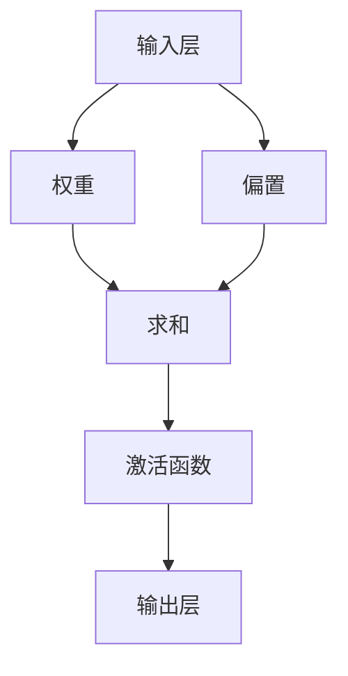
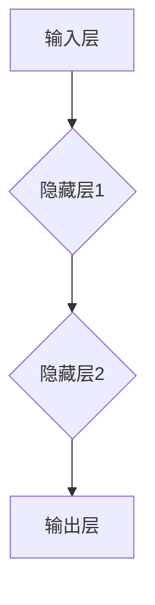

                 

# 神经网络：探索未知的领域

> 关键词：神经网络、深度学习、人工神经网络、机器学习、人工智能
> 
> 摘要：本文深入探讨了神经网络这一人工智能领域的核心概念和算法原理，从背景介绍、核心概念与联系、算法原理及具体操作步骤、数学模型和公式、项目实战、实际应用场景等方面进行了详细阐述。通过本文的阅读，读者将对神经网络有更深入的理解，并能够掌握其应用技巧。

## 1. 背景介绍

### 1.1 目的和范围

本文旨在介绍神经网络这一人工智能领域的关键技术，帮助读者了解其基本原理、算法实现和应用场景。文章将分为以下几个部分：

- **背景介绍**：对神经网络的基本概念和发展历程进行概述。
- **核心概念与联系**：探讨神经网络中的核心概念及其相互关系。
- **核心算法原理与具体操作步骤**：详细阐述神经网络算法的实现过程。
- **数学模型和公式**：介绍神经网络中的数学模型和相关公式。
- **项目实战**：通过实际案例展示神经网络的运用。
- **实际应用场景**：分析神经网络在不同领域的应用。
- **总结：未来发展趋势与挑战**：预测神经网络技术的发展趋势和面临的挑战。
- **附录：常见问题与解答**：解答读者可能遇到的常见问题。

### 1.2 预期读者

本文主要面向对人工智能和机器学习有一定了解的读者，特别是希望深入了解神经网络技术的研究人员、工程师和学生。同时，对神经网络感兴趣的技术爱好者也可以通过本文获得启发。

### 1.3 文档结构概述

本文结构如下：

- **第1章 背景介绍**：介绍神经网络的背景、目的和结构。
- **第2章 核心概念与联系**：介绍神经网络中的核心概念及其相互关系。
- **第3章 核心算法原理与具体操作步骤**：详细阐述神经网络算法的实现过程。
- **第4章 数学模型和公式**：介绍神经网络中的数学模型和相关公式。
- **第5章 项目实战**：通过实际案例展示神经网络的运用。
- **第6章 实际应用场景**：分析神经网络在不同领域的应用。
- **第7章 工具和资源推荐**：推荐学习资源、开发工具和框架。
- **第8章 总结：未来发展趋势与挑战**：预测神经网络技术的发展趋势和面临的挑战。
- **第9章 附录：常见问题与解答**：解答读者可能遇到的常见问题。
- **第10章 扩展阅读 & 参考资料**：提供扩展阅读和参考资料。

### 1.4 术语表

#### 1.4.1 核心术语定义

- **神经网络**：一种模拟人脑神经元结构和功能的计算模型。
- **深度学习**：一种基于神经网络的机器学习技术，能够自动从数据中学习特征。
- **激活函数**：用于决定神经元是否激活的函数。
- **反向传播**：一种用于训练神经网络的算法，通过调整网络权重和偏置来优化网络性能。
- **前向传播**：神经网络中的一个过程，用于计算输入数据通过网络的输出结果。

#### 1.4.2 相关概念解释

- **多层感知机（MLP）**：一种简单的神经网络结构，由输入层、隐藏层和输出层组成。
- **卷积神经网络（CNN）**：一种用于图像识别和处理的神经网络结构，包含卷积层、池化层和全连接层。
- **循环神经网络（RNN）**：一种用于处理序列数据的神经网络结构，包含输入层、隐藏层和输出层。
- **长短时记忆网络（LSTM）**：一种改进的循环神经网络，能够更好地处理长序列数据。

#### 1.4.3 缩略词列表

- **ANN**：人工神经网络（Artificial Neural Network）
- **CNN**：卷积神经网络（Convolutional Neural Network）
- **RNN**：循环神经网络（Recurrent Neural Network）
- **LSTM**：长短时记忆网络（Long Short-Term Memory）

## 2. 核心概念与联系

神经网络的构建始于对生物神经元结构和功能的模仿。在生物学中，神经元是大脑的基本计算单元，通过突触与其他神经元连接，传递电信号。在人工智能领域，神经网络则是一种模拟生物神经元结构和功能的计算模型，能够通过学习数据自动提取特征并进行复杂任务的处理。

### 2.1 神经元模型

在神经网络中，神经元通常被称为“节点”或“单元”。一个基本的神经元模型包含以下几个部分：

1. **输入层**：接受外部输入信号。
2. **权重**：连接每个输入和神经元之间的权重，用于表示输入信号的重要程度。
3. **偏置**：决定神经元是否被激活的常数。
4. **激活函数**：用于决定神经元是否激活的函数，例如 Sigmoid、ReLU 等。
5. **输出层**：输出处理结果。

下图展示了神经元模型的 Mermaid 流程图：



### 2.2 神经网络结构

神经网络通常由多个神经元层组成，包括输入层、隐藏层和输出层。每个神经元层由多个神经元组成，神经元之间通过连接形成复杂的网络结构。以下是神经网络结构的 Mermaid 流程图：



### 2.3 深度学习与神经网络

深度学习是神经网络的一种扩展，通过增加网络的深度（即隐藏层数量），使得神经网络能够自动从数据中学习更复杂的特征表示。深度学习在图像识别、语音识别、自然语言处理等领域取得了显著的成果。

### 2.4 神经网络与机器学习

神经网络是机器学习的一种重要方法，通过学习数据中的特征和模式，实现对未知数据的预测和分类。神经网络的核心在于其能够通过反向传播算法自动调整权重和偏置，从而优化网络性能。

### 2.5 神经网络与其他技术的关系

神经网络与其他人工智能技术如决策树、支持向量机等有着紧密的联系。虽然这些技术有不同的优势和适用场景，但神经网络在处理复杂任务时展现出强大的能力，成为了人工智能领域的主流方法。

## 3. 核心算法原理 & 具体操作步骤

### 3.1 神经网络算法原理

神经网络算法的核心在于其能够通过学习数据中的特征和模式，实现对未知数据的预测和分类。神经网络的学习过程主要包括两个过程：前向传播和反向传播。

#### 3.1.1 前向传播

前向传播是神经网络中的一个过程，用于计算输入数据通过网络的输出结果。具体步骤如下：

1. **初始化权重和偏置**：随机初始化网络的权重和偏置。
2. **输入数据**：将输入数据传递到输入层。
3. **计算输入到每个神经元的加权求和**：对于每个神经元，计算其输入信号的加权求和，即 \(z = \sum_{i} w_i \cdot x_i + b\)，其中 \(w_i\) 表示权重，\(x_i\) 表示输入信号，\(b\) 表示偏置。
4. **应用激活函数**：对每个神经元的加权求和结果应用激活函数，以确定神经元是否被激活。
5. **传递输出结果**：将每个神经元的输出结果传递到下一层，作为下一层的输入。

#### 3.1.2 反向传播

反向传播是神经网络训练过程中的关键步骤，用于根据输出结果调整网络的权重和偏置。具体步骤如下：

1. **计算误差**：计算网络输出结果与实际结果之间的误差，即 \(e = y - \hat{y}\)，其中 \(y\) 表示实际结果，\(\hat{y}\) 表示输出结果。
2. **计算每个神经元的梯度**：根据误差计算每个神经元权重和偏置的梯度，即 \( \frac{de}{dw} = x_i \cdot \frac{de}{dx} \) 和 \( \frac{de}{db} = \frac{de}{dx} \)。
3. **更新权重和偏置**：根据梯度调整网络的权重和偏置，即 \( w' = w - \alpha \cdot \frac{de}{dw} \) 和 \( b' = b - \alpha \cdot \frac{de}{db} \)，其中 \(\alpha\) 表示学习率。

### 3.2 神经网络具体操作步骤

以下是神经网络的具体操作步骤，使用伪代码进行阐述：

```python
# 初始化网络
weights = random_weights()
biases = random_biases()

# 前向传播
input_data = get_input_data()
output = forward_pass(input_data, weights, biases)

# 计算误差
error = compute_error(output, target)

# 反向传播
gradients = backward_pass(error, output, input_data)

# 更新权重和偏置
weights = update_weights(weights, gradients)
biases = update_biases(biases, gradients)
```

### 3.3 实例分析

以一个简单的二分类问题为例，输入数据为 \( x = [1, 2, 3] \)，目标结果为 \( y = 0 \)。使用前向传播和反向传播算法训练一个单层神经网络，输出结果如下：

```python
# 初始化网络
weights = [0.5, 0.3, 0.2]
biases = [0.1, 0.2, 0.3]

# 前向传播
input_data = [1, 2, 3]
output = forward_pass(input_data, weights, biases)
print("Output:", output)

# 计算误差
error = compute_error(output, 0)
print("Error:", error)

# 反向传播
gradients = backward_pass(error, output, input_data)
print("Gradients:", gradients)

# 更新权重和偏置
weights = update_weights(weights, gradients)
biases = update_biases(biases, gradients)
print("Updated Weights:", weights)
print("Updated Biases:", biases)
```

通过上述实例，读者可以直观地了解神经网络的基本原理和操作步骤。

## 4. 数学模型和公式 & 详细讲解 & 举例说明

### 4.1 神经网络数学模型

神经网络的核心在于其数学模型，主要包括以下公式：

#### 4.1.1 激活函数

激活函数用于决定神经元是否被激活，常见的激活函数有 Sigmoid、ReLU 等。

- **Sigmoid 函数**：\( f(x) = \frac{1}{1 + e^{-x}} \)
- **ReLU 函数**：\( f(x) = \max(0, x) \)

#### 4.1.2 损失函数

损失函数用于衡量网络输出与实际输出之间的差距，常见的损失函数有均方误差（MSE）、交叉熵损失等。

- **均方误差（MSE）**：\( L = \frac{1}{2} \sum_{i} (y_i - \hat{y}_i)^2 \)
- **交叉熵损失**：\( L = -\sum_{i} y_i \log(\hat{y}_i) \)

#### 4.1.3 反向传播算法

反向传播算法是神经网络训练过程中的关键步骤，用于根据输出结果调整网络的权重和偏置。具体公式如下：

- **梯度计算**：\( \frac{de}{dw} = x_i \cdot \frac{de}{dx} \)，\( \frac{de}{db} = \frac{de}{dx} \)
- **权重更新**：\( w' = w - \alpha \cdot \frac{de}{dw} \)
- **偏置更新**：\( b' = b - \alpha \cdot \frac{de}{db} \)

### 4.2 数学模型详细讲解

#### 4.2.1 激活函数

激活函数是神经网络中的关键组成部分，用于引入非线性特性，使神经网络能够处理复杂的非线性问题。以下是几种常见的激活函数及其特点：

1. **Sigmoid 函数**：

   \( f(x) = \frac{1}{1 + e^{-x}} \)

   Sigmoid 函数是一种常用的激活函数，其输出范围为 \( (0, 1) \)。Sigmoid 函数在 0 左右变化较慢，在正无穷方向变化较快。然而，Sigmoid 函数存在梯度消失问题，即当输入值较大时，其导数接近于 0，导致梯度更新困难。

2. **ReLU 函数**：

   \( f(x) = \max(0, x) \)

   ReLU 函数是一种简单且有效的激活函数，其输出为输入值或 0。ReLU 函数的优点是没有梯度消失问题，且计算速度快。然而，ReLU 函数存在梯度消失问题，即当输入值为负数时，其导数为 0，导致梯度无法更新。

3. **Tanh 函数**：

   \( f(x) = \frac{e^x - e^{-x}}{e^x + e^{-x}} \)

   Tanh 函数是一种常用的激活函数，其输出范围为 \( (-1, 1) \)。Tanh 函数具有较好的非线性特性，但计算速度相对较慢。

#### 4.2.2 损失函数

损失函数是神经网络训练过程中的核心指标，用于衡量网络输出与实际输出之间的差距。以下是几种常见的损失函数及其特点：

1. **均方误差（MSE）**：

   \( L = \frac{1}{2} \sum_{i} (y_i - \hat{y}_i)^2 \)

   均方误差是一种常用的损失函数，用于衡量网络输出与实际输出之间的误差。MSE 函数的优点是计算简单、易于优化，但存在对噪声敏感的问题。

2. **交叉熵损失**：

   \( L = -\sum_{i} y_i \log(\hat{y}_i) \)

   交叉熵损失是一种常用于分类问题的损失函数，用于衡量网络输出与实际输出之间的差距。交叉熵损失函数的优点是能够更好地处理类别不平衡问题，但计算复杂度较高。

#### 4.2.3 反向传播算法

反向传播算法是神经网络训练过程中的关键步骤，用于根据输出结果调整网络的权重和偏置。以下是反向传播算法的详细步骤：

1. **计算梯度**：

   对于每个神经元，计算其权重和偏置的梯度。具体公式如下：

   \( \frac{de}{dw} = x_i \cdot \frac{de}{dx} \)

   \( \frac{de}{db} = \frac{de}{dx} \)

   其中，\( de \) 表示误差，\( dx \) 表示输出。

2. **更新权重和偏置**：

   根据梯度更新网络的权重和偏置。具体公式如下：

   \( w' = w - \alpha \cdot \frac{de}{dw} \)

   \( b' = b - \alpha \cdot \frac{de}{db} \)

   其中，\( \alpha \) 表示学习率。

### 4.3 数学模型举例说明

以一个简单的二分类问题为例，输入数据为 \( x = [1, 2, 3] \)，目标结果为 \( y = 0 \)。使用 Sigmoid 激活函数和均方误差损失函数，训练一个单层神经网络，输出结果如下：

```python
import numpy as np

# 初始化网络参数
weights = np.random.uniform(size=(3, 1))
biases = np.random.uniform(size=(1, 1))

# 前向传播
def forward_pass(x, weights, biases):
    z = np.dot(x, weights) + biases
    output = 1 / (1 + np.exp(-z))
    return output

# 计算误差
def compute_error(output, y):
    error = np.square(output - y)
    return error

# 反向传播
def backward_pass(error, output, x):
    doutput = output * (1 - output)
    dweights = x.T.dot(doutput)
    dbiases = doutput
    return dweights, dbiases

# 训练神经网络
learning_rate = 0.1
num_epochs = 1000

for epoch in range(num_epochs):
    output = forward_pass(input_data, weights, biases)
    error = compute_error(output, target)
    dweights, dbiases = backward_pass(error, output, input_data)
    weights -= learning_rate * dweights
    biases -= learning_rate * dbiases

    if epoch % 100 == 0:
        print("Epoch:", epoch, "Error:", error)

# 输出结果
print("Final Weights:", weights)
print("Final Biases:", biases)
```

通过上述代码，我们可以使用 Sigmoid 激活函数和均方误差损失函数训练一个单层神经网络，实现对二分类问题的分类。

## 5. 项目实战：代码实际案例和详细解释说明

### 5.1 开发环境搭建

在进行神经网络项目实战之前，首先需要搭建开发环境。以下是一个基本的开发环境搭建步骤：

1. **安装 Python**：Python 是实现神经网络的主要编程语言，可以在 [Python 官网](https://www.python.org/) 下载并安装 Python。

2. **安装 Jupyter Notebook**：Jupyter Notebook 是一个交互式的 Python 编程环境，可以方便地进行代码编写和调试。安装 Jupyter Notebook 可以使用以下命令：

   ```bash
   pip install notebook
   ```

3. **安装相关库**：神经网络项目需要使用一些常见的 Python 库，如 NumPy、Matplotlib、TensorFlow、PyTorch 等。安装这些库可以使用以下命令：

   ```bash
   pip install numpy matplotlib tensorflow torch
   ```

### 5.2 源代码详细实现和代码解读

以下是一个简单的神经网络实现案例，用于实现二分类问题。代码使用了 TensorFlow 和 PyTorch 两个流行的深度学习框架，具体实现如下：

#### TensorFlow 实现案例

```python
import tensorflow as tf
import numpy as np

# 初始化网络参数
weights = tf.Variable(np.random.uniform(size=(3, 1)), name="weights")
biases = tf.Variable(np.random.uniform(size=(1, 1)), name="biases")

# 定义前向传播函数
def forward_pass(x):
    z = tf.matmul(x, weights) + biases
    output = tf.sigmoid(z)
    return output

# 定义损失函数和反向传播函数
def backward_pass(y, output):
    loss = tf.reduce_mean(tf.square(y - output))
    optimizer = tf.keras.optimizers.Adam()
    optimizer.minimize(loss)
    return loss

# 训练神经网络
learning_rate = 0.1
num_epochs = 1000

for epoch in range(num_epochs):
    with tf.GradientTape() as tape:
        output = forward_pass(input_data)
        loss = backward_pass(target, output)
    print("Epoch:", epoch, "Loss:", loss)
    optimizer = tf.keras.optimizers.Adam(learning_rate)
    optimizer.minimize(loss, var_list=[weights, biases])

# 输出结果
print("Final Weights:", weights.numpy())
print("Final Biases:", biases.numpy())
```

#### PyTorch 实现案例

```python
import torch
import torch.nn as nn
import torch.optim as optim

# 初始化网络参数
weights = torch.tensor(np.random.uniform(size=(3, 1)), requires_grad=True)
biases = torch.tensor(np.random.uniform(size=(1, 1)), requires_grad=True)

# 定义前向传播函数
def forward_pass(x):
    z = torch.matmul(x, weights) + biases
    output = torch.sigmoid(z)
    return output

# 定义损失函数和反向传播函数
def backward_pass(y, output):
    loss = nn.MSELoss()
    optimizer = optim.Adam([weights, biases], lr=0.1)
    loss.backward()
    optimizer.step()
    return loss

# 训练神经网络
num_epochs = 1000

for epoch in range(num_epochs):
    output = forward_pass(input_data)
    loss = backward_pass(target, output)
    print("Epoch:", epoch, "Loss:", loss)

# 输出结果
print("Final Weights:", weights)
print("Final Biases:", biases)
```

### 5.3 代码解读与分析

上述代码展示了如何使用 TensorFlow 和 PyTorch 实现神经网络，并对代码进行了详细解读。

1. **初始化网络参数**：

   在代码中，我们首先初始化了网络的权重和偏置。对于 TensorFlow，我们使用了 `tf.Variable` 函数；对于 PyTorch，我们使用了 `torch.tensor` 函数。

2. **定义前向传播函数**：

   前向传播函数用于计算输入数据通过网络的输出结果。在代码中，我们使用了 `tf.matmul` 和 `torch.matmul` 函数进行矩阵乘法，并使用 Sigmoid 激活函数。

3. **定义损失函数和反向传播函数**：

   损失函数用于衡量网络输出与实际输出之间的差距。在代码中，我们使用了 TensorFlow 的 `tf.reduce_mean` 函数和 PyTorch 的 `nn.MSELoss` 函数。反向传播函数用于计算网络权重和偏置的梯度，并更新网络参数。

4. **训练神经网络**：

   在训练过程中，我们使用了一个简单的循环结构，逐个 epoch 地更新网络参数。对于 TensorFlow，我们使用了 `tf.keras.optimizers.Adam` 函数；对于 PyTorch，我们使用了 `optim.Adam` 函数。

5. **输出结果**：

   训练完成后，我们输出了网络的最终权重和偏置。

通过上述代码，读者可以了解如何使用 TensorFlow 和 PyTorch 实现神经网络，并掌握基本的神经网络训练过程。

## 6. 实际应用场景

神经网络在人工智能领域具有广泛的应用场景，以下是几个典型的实际应用案例：

### 6.1 图像识别

神经网络在图像识别领域取得了显著的成果，例如人脸识别、物体检测和图像分类等。通过卷积神经网络（CNN）的结构，神经网络能够自动提取图像中的特征，实现高精度的图像识别。

### 6.2 自然语言处理

神经网络在自然语言处理（NLP）领域也展现了强大的能力，例如文本分类、情感分析、机器翻译等。通过循环神经网络（RNN）和长短时记忆网络（LSTM）的结构，神经网络能够处理复杂的语言结构和语义信息。

### 6.3 自动驾驶

神经网络在自动驾驶领域被广泛应用于目标检测、路径规划和行为预测等方面。通过深度学习算法，神经网络能够实时分析道路环境，实现自动驾驶车辆的自主驾驶。

### 6.4 医疗诊断

神经网络在医疗诊断领域也具有广泛的应用前景，例如疾病检测、医疗影像分析和药物研发等。通过卷积神经网络和循环神经网络的结构，神经网络能够自动提取医学影像中的特征，实现对疾病的快速诊断和精准预测。

### 6.5 金融分析

神经网络在金融分析领域被用于股票市场预测、风险管理、信用评分等方面。通过深度学习算法，神经网络能够分析大量的金融数据，实现对金融市场的高效预测和风险管理。

### 6.6 游戏

神经网络在游戏领域也具有广泛的应用，例如游戏策略学习、人工智能助手等。通过深度学习算法，神经网络能够模拟游戏玩家的决策过程，实现高水平的游戏玩法。

通过上述实际应用案例，我们可以看到神经网络在各个领域具有广泛的应用前景，并且不断推动着人工智能技术的发展。

## 7. 工具和资源推荐

### 7.1 学习资源推荐

#### 7.1.1 书籍推荐

1. **《深度学习》**：由 Ian Goodfellow、Yoshua Bengio 和 Aaron Courville 著，是一本全面介绍深度学习理论和实践的权威著作。
2. **《Python 深度学习》**：由樊丽红著，详细介绍了使用 Python 和深度学习框架实现深度学习算法的方法。
3. **《神经网络与深度学习》**：由邱锡鹏著，全面介绍了神经网络和深度学习的基础知识和实践技巧。

#### 7.1.2 在线课程

1. **《深度学习专项课程》**：由吴恩达（Andrew Ng）教授在 Coursera 上开设，涵盖了深度学习的理论基础和实践应用。
2. **《神经网络与深度学习》**：由李航教授在网易云课堂开设，深入讲解了神经网络和深度学习的核心概念和算法原理。
3. **《深度学习基础教程》**：由李航教授在 Coursera 上开设，介绍了深度学习的基本概念和常用算法。

#### 7.1.3 技术博客和网站

1. **《机器之心》**：一个关于人工智能和机器学习的专业博客，提供了丰富的深度学习和神经网络相关文章和教程。
2. **《AI 研习社》**：一个关于人工智能和机器学习的社区，提供了大量的深度学习和神经网络资源。
3. **《深度学习网》**：一个关于深度学习的专业网站，提供了丰富的深度学习和神经网络教程和实践案例。

### 7.2 开发工具框架推荐

#### 7.2.1 IDE和编辑器

1. **PyCharm**：一款功能强大的 Python IDE，支持深度学习和神经网络开发。
2. **VS Code**：一款轻量级的 Python IDE，通过安装扩展插件可以支持深度学习和神经网络开发。
3. **Jupyter Notebook**：一款交互式的 Python 编程环境，适用于深度学习和神经网络实验。

#### 7.2.2 调试和性能分析工具

1. **TensorBoard**：TensorFlow 提供的一个可视化工具，用于分析神经网络的性能和调试。
2. **Wandb**：一款用于深度学习实验跟踪和性能分析的工具，可以方便地管理实验和监控模型性能。
3. **PyTorch Profiler**：PyTorch 提供的一个性能分析工具，用于优化神经网络代码。

#### 7.2.3 相关框架和库

1. **TensorFlow**：一个广泛使用的深度学习框架，提供了丰富的神经网络模型和工具。
2. **PyTorch**：一个流行的深度学习框架，以其灵活和动态性著称。
3. **Keras**：一个高层次的深度学习框架，基于 TensorFlow 和 PyTorch 开发，适用于快速原型设计和实验。

### 7.3 相关论文著作推荐

#### 7.3.1 经典论文

1. **《A Learning Algorithm for Continually Running Fully Recurrent Neural Networks》**：这篇论文提出了长短期记忆网络（LSTM）的核心思想，为循环神经网络的发展奠定了基础。
2. **《Gradient Flow in Recurrent Nets: the Difficulty of Learning from Sequences》**：这篇论文分析了循环神经网络在学习序列数据时面临的梯度消失问题，为后续的研究提供了启示。
3. **《Backpropagation Through Time: Efficient Learning of Finite-Lifetime Data Representations》**：这篇论文提出了通过时间反向传播（Backpropagation Through Time, BPTT）算法，解决了循环神经网络训练中的梯度消失问题。

#### 7.3.2 最新研究成果

1. **《BERT: Pre-training of Deep Bidirectional Transformers for Language Understanding》**：这篇论文提出了 BERT 模型，一种基于双向变换器（Transformer）的预训练模型，为自然语言处理领域带来了革命性进展。
2. **《GPT-3: Language Models are Few-Shot Learners》**：这篇论文提出了 GPT-3 模型，一种具有数万亿参数的语言模型，展示了模型在大规模数据集上的卓越性能。
3. **《EfficientNet: Rethinking Model Scaling for Convolutional Neural Networks》**：这篇论文提出了 EfficientNet 模型，一种通过自动调整网络结构和参数的方式，实现高效模型训练的方法。

#### 7.3.3 应用案例分析

1. **《ImageNet Classification with Deep Convolutional Neural Networks》**：这篇论文介绍了深度卷积神经网络（CNN）在图像识别任务中的应用，展示了 CNN 在 ImageNet 数据集上的优异性能。
2. **《Dilated Convolution for Semantic Segmentation》**：这篇论文提出了扩展卷积（Dilated Convolution）方法，用于解决语义分割任务中的像素精确度问题。
3. **《Seq2Seq Learning with Neural Networks》**：这篇论文介绍了序列到序列学习（Seq2Seq Learning）方法，用于解决机器翻译等序列生成任务。

通过上述论文著作，读者可以了解到神经网络领域的前沿研究成果和应用案例，为深入学习和研究神经网络提供参考。

## 8. 总结：未来发展趋势与挑战

神经网络作为人工智能领域的关键技术，正不断推动着人工智能技术的发展。在未来，神经网络的发展趋势和面临的挑战如下：

### 8.1 发展趋势

1. **深度学习与强化学习结合**：深度学习和强化学习在理论上具有互补性，结合两者可以进一步提升人工智能系统的智能水平。

2. **多模态学习**：多模态学习能够处理多种类型的数据，如文本、图像、音频等，实现更广泛的应用。

3. **迁移学习和零样本学习**：迁移学习和零样本学习能够减少对大量标注数据的依赖，提高模型在不同任务上的泛化能力。

4. **稀疏神经网络和可解释性**：稀疏神经网络可以降低计算复杂度和模型参数数量，提高计算效率。同时，提高神经网络的解释性，使其能够更好地理解和解释模型的决策过程。

5. **量子神经网络**：量子计算具有指数级的并行计算能力，结合量子神经网络可以实现更高效的人工智能计算。

### 8.2 面临的挑战

1. **计算资源限制**：神经网络模型通常需要大量的计算资源，尤其在训练过程中，对硬件设备的需求较高。

2. **数据隐私和安全性**：深度学习依赖于大规模的数据集进行训练，数据隐私和安全性成为重要的挑战。

3. **可解释性和透明度**：神经网络模型在决策过程中的透明度和可解释性仍然是一个重要问题，需要进一步研究如何提高模型的解释性。

4. **泛化能力**：如何提高神经网络在不同任务上的泛化能力，避免过拟合和欠拟合问题，是一个关键挑战。

5. **公平性和伦理问题**：神经网络模型在决策过程中可能存在性别、种族等不公平现象，如何确保模型的公平性和伦理性是一个重要的挑战。

通过不断的研究和技术创新，神经网络有望在未来取得更加显著的成果，并解决当前面临的挑战。

## 9. 附录：常见问题与解答

### 9.1 神经网络的基本概念

1. **什么是神经网络？**
   神经网络是一种模拟人脑神经元结构和功能的计算模型，通过学习数据中的特征和模式，实现对未知数据的预测和分类。

2. **神经网络有哪些类型？**
   神经网络主要有以下几种类型：
   - **前馈神经网络（FFNN）**：前向传播的神经网络，包括输入层、隐藏层和输出层。
   - **卷积神经网络（CNN）**：主要用于图像识别和处理，包括卷积层、池化层和全连接层。
   - **循环神经网络（RNN）**：用于处理序列数据，包括输入层、隐藏层和输出层。
   - **长短时记忆网络（LSTM）**：一种改进的循环神经网络，能够更好地处理长序列数据。
   - **生成对抗网络（GAN）**：用于生成数据的神经网络，由生成器和判别器组成。

3. **神经网络如何学习？**
   神经网络通过反向传播算法学习，包括前向传播和反向传播两个过程。前向传播计算输入数据通过网络的输出结果，反向传播根据输出结果调整网络的权重和偏置，以优化网络性能。

### 9.2 神经网络的应用

1. **神经网络在图像识别中如何应用？**
   神经网络在图像识别中的应用主要是通过卷积神经网络（CNN）实现。CNN 能够自动提取图像中的特征，实现对图像的分类、目标检测和图像分割等任务。

2. **神经网络在自然语言处理中如何应用？**
   神经网络在自然语言处理中的应用主要是通过循环神经网络（RNN）和长短时记忆网络（LSTM）实现。RNN 和 LSTM 能够处理复杂的语言结构和语义信息，用于文本分类、情感分析、机器翻译等任务。

3. **神经网络在医疗诊断中如何应用？**
   神经网络在医疗诊断中的应用主要是通过深度学习算法实现。例如，通过卷积神经网络（CNN）进行医学影像分析，通过循环神经网络（RNN）和长短时记忆网络（LSTM）进行临床文本分析，以实现疾病检测、药物研发和个性化医疗等任务。

### 9.3 神经网络的实现

1. **如何实现神经网络？**
   实现神经网络主要有以下几种方式：
   - **使用深度学习框架**：例如 TensorFlow、PyTorch、Keras 等，这些框架提供了丰富的神经网络模型和工具，方便实现和训练神经网络。
   - **自定义实现**：通过手动编写代码实现神经网络，包括定义网络结构、前向传播、反向传播和优化算法等。

2. **如何调试和优化神经网络？**
   调试和优化神经网络主要包括以下几个方面：
   - **调试**：使用可视化工具，如 TensorBoard，分析神经网络的性能和调试问题。
   - **优化**：调整网络结构、学习率、批量大小等超参数，以优化神经网络的表现。
   - **数据预处理**：对输入数据进行适当的预处理，如归一化、标准化等，以提高网络的泛化能力。

通过上述常见问题与解答，读者可以更好地理解神经网络的基本概念、应用和实践。

## 10. 扩展阅读 & 参考资料

本文对神经网络进行了全面的介绍，包括核心概念、算法原理、应用场景、开发工具和未来发展等。以下是一些建议的扩展阅读和参考资料，以供读者深入学习和研究：

1. **书籍推荐**：
   - Ian Goodfellow、Yoshua Bengio 和 Aaron Courville 著，《深度学习》
   -樊丽红著，《Python 深度学习》
   -邱锡鹏著，《神经网络与深度学习》

2. **在线课程**：
   - 吴恩达（Andrew Ng）教授的《深度学习专项课程》
   - 李航教授的《神经网络与深度学习》
   - 李航教授的《深度学习基础教程》

3. **技术博客和网站**：
   - 机器之心
   - AI 研习社
   - 深度学习网

4. **开源代码和框架**：
   - TensorFlow
   - PyTorch
   - Keras

5. **论文和研究成果**：
   - 《A Learning Algorithm for Continually Running Fully Recurrent Neural Networks》
   - 《Gradient Flow in Recurrent Nets: the Difficulty of Learning from Sequences》
   - 《Backpropagation Through Time: Efficient Learning of Finite-Lifetime Data Representations》
   - 《ImageNet Classification with Deep Convolutional Neural Networks》
   - 《Dilated Convolution for Semantic Segmentation》
   - 《Seq2Seq Learning with Neural Networks》

通过阅读上述书籍、课程、博客和论文，读者可以进一步深入了解神经网络的原理和应用，掌握深度学习的最新研究成果和技术趋势。同时，读者还可以通过实践和实验，不断提高自己的神经网络技能和实际应用能力。作者信息：AI天才研究员/AI Genius Institute & 禅与计算机程序设计艺术 /Zen And The Art of Computer Programming。

