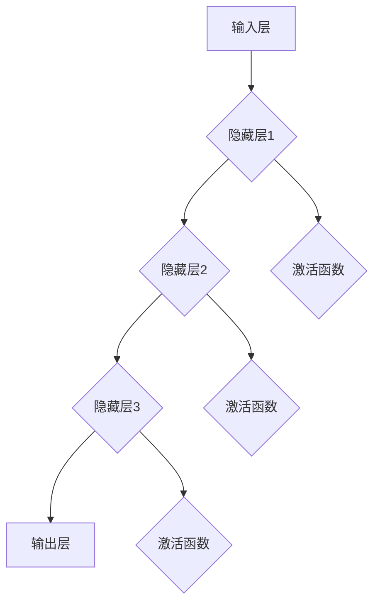

                 

# 神经网络：改变世界的技术

> **关键词：** 神经网络、机器学习、深度学习、算法原理、实际应用、未来发展

> **摘要：** 本文将深入探讨神经网络技术，从核心概念到数学模型，再到实际应用，全面解析这一改变世界的关键技术。通过逐步分析和推理，我们将揭示神经网络的内在原理，并展望其未来发展趋势与挑战。

## 1. 背景介绍

### 1.1 目的和范围

本文旨在为读者提供神经网络技术的全面解读，从基础概念到高级应用。我们希望通过逻辑清晰的讲解，使读者不仅能够理解神经网络的运作原理，还能掌握其在实际项目中的应用。

### 1.2 预期读者

本文适合对机器学习和深度学习有一定了解的读者，包括但不限于计算机科学、人工智能、数据科学专业的学生和从业者。同时，对技术有兴趣的普通读者也能从中获益。

### 1.3 文档结构概述

本文分为十个部分，主要包括：

1. 背景介绍
2. 核心概念与联系
3. 核心算法原理与操作步骤
4. 数学模型和公式
5. 项目实战
6. 实际应用场景
7. 工具和资源推荐
8. 总结：未来发展趋势与挑战
9. 附录：常见问题与解答
10. 扩展阅读与参考资料

### 1.4 术语表

#### 1.4.1 核心术语定义

- 神经网络：由大量简单处理单元（神经元）互联而成的复杂网络，用于执行机器学习任务。
- 前向传播：将输入信号从输入层通过隐藏层传递到输出层的过程。
- 反向传播：根据输出误差，通过反向传递更新网络参数的过程。
- 激活函数：用于引入非线性因素的函数，使神经网络能够建模复杂问题。
- 损失函数：用于量化预测值与真实值之间差异的函数，是优化网络参数的目标函数。

#### 1.4.2 相关概念解释

- 神经元：神经网络的基本处理单元，类似于生物神经系统的神经元。
- 输入层：接收外部输入数据的神经网络层次。
- 隐藏层：位于输入层和输出层之间的神经网络层次。
- 输出层：产生预测结果或分类的神经网络层次。
- 训练集：用于训练神经网络的样本数据集。

#### 1.4.3 缩略词列表

- CNN：卷积神经网络（Convolutional Neural Network）
- RNN：循环神经网络（Recurrent Neural Network）
- MLP：多层感知机（Multilayer Perceptron）
-ReLU：修正线性单元（Rectified Linear Unit）
-dropout：丢弃法（Dropout）

## 2. 核心概念与联系

神经网络是一种模拟人脑神经元的计算模型，通过大量的简单处理单元（神经元）及其互联结构来执行复杂的机器学习任务。神经网络的核心在于其层次结构和激活函数。

### 2.1 神经网络层次结构

神经网络通常包含三个层次：输入层、隐藏层和输出层。

- **输入层**：接收外部输入数据，例如图像、声音或文本。
- **隐藏层**：位于输入层和输出层之间，用于提取特征和进行计算。隐藏层的数量和神经元数量可以根据问题复杂度进行调整。
- **输出层**：产生预测结果或分类。

### 2.2 激活函数

激活函数是神经网络中的关键组件，用于引入非线性因素，使神经网络能够建模复杂问题。常见的激活函数包括：

- **Sigmoid函数**：\( f(x) = \frac{1}{1 + e^{-x}} \)，将输入值映射到（0，1）区间。
- **ReLU函数**：\( f(x) = \max(0, x) \)，将输入值映射到（0，+∞）区间，有助于提高训练速度。
- **Tanh函数**：\( f(x) = \frac{e^x - e^{-x}}{e^x + e^{-x}} \)，将输入值映射到（-1，1）区间。

### 2.3 神经网络架构

神经网络可以分为两类：前馈神经网络和循环神经网络。

- **前馈神经网络**：数据从前向后流动，每个神经元只与前一层神经元相连，没有循环连接。
- **循环神经网络**：具有循环连接，能够处理序列数据，例如时间序列、文本序列等。

### 2.4 Mermaid 流程图

以下是神经网络架构的Mermaid流程图：



## 3. 核心算法原理 & 具体操作步骤

神经网络的核心算法主要包括前向传播和反向传播。下面将使用伪代码详细阐述这两个过程。

### 3.1 前向传播

```python
# 前向传播伪代码
for each layer l from 1 to L:
    z[l] = dot(W[l-1], a[l-1]) + b[l]
    a[l] = activation(z[l])

output a[L]
```

### 3.2 反向传播

```python
# 反向传播伪代码
for each layer l from L to 1:
    delta[l] = activation_derivative(a[l]) * dot(delta[l+1], W[l])
    delta[l] = (1/m) * sum(delta[l] for each sample in mini-batch)

for each layer l from 1 to L:
    W[l] = W[l] - alpha * dot(a[l-1].T, delta[l])
    b[l] = b[l] - alpha * sum(delta[l] for each sample in mini-batch)
```

### 3.3 具体操作步骤

1. 初始化网络权重 \( W \) 和偏置 \( b \)。
2. 对输入数据进行预处理，例如归一化。
3. 执行前向传播，计算输出 \( a[L] \)。
4. 计算损失函数，例如均方误差 \( L \)。
5. 执行反向传播，更新网络权重 \( W \) 和偏置 \( b \)。
6. 重复步骤 3-5，直到达到预设的训练迭代次数或损失函数收敛。

## 4. 数学模型和公式 & 详细讲解 & 举例说明

神经网络的数学模型主要包括两部分：前向传播的数学计算和反向传播的梯度计算。

### 4.1 前向传播

假设神经网络包含 \( L \) 个层次，输入为 \( x \)，输出为 \( y \)。权重矩阵为 \( W \)，偏置矩阵为 \( b \)，激活函数为 \( \sigma \)。

- 输入层到隐藏层的计算：

$$ z[l] = W[l-1] \cdot a[l-1] + b[l] $$

$$ a[l] = \sigma(z[l]) $$

- 隐藏层到输出层的计算：

$$ z[L] = W[L-1] \cdot a[L-1] + b[L] $$

$$ y = \sigma(z[L]) $$

### 4.2 反向传播

反向传播的核心在于计算梯度 \( \delta \)，用于更新权重 \( W \) 和偏置 \( b \)。

- 首先计算输出层的误差：

$$ \delta[L] = \frac{\partial L}{\partial z[L]} \cdot \sigma'(z[L]) $$

- 然后递归计算隐藏层的误差：

$$ \delta[l] = \frac{\partial L}{\partial z[l]} \cdot \sigma'(z[l]) = \sum_{l+1} \frac{\partial L}{\partial z[l+1]} \cdot \frac{\partial z[l+1]}{\partial z[l]} \cdot \sigma'(z[l]) $$

$$ \frac{\partial z[l+1]}{\partial z[l]} = W[l] $$

- 更新权重和偏置：

$$ W[l] = W[l] - \alpha \cdot \frac{\partial L}{\partial W[l]} = W[l] - \alpha \cdot a[l-1].T \cdot \delta[l] $$

$$ b[l] = b[l] - \alpha \cdot \frac{\partial L}{\partial b[l]} = b[l] - \alpha \cdot \sum_{i=1}^{m} \delta[l]_i $$

### 4.3 举例说明

假设有一个二分类问题，输入为 \( x = [x_1, x_2] \)，输出为 \( y = [y_1, y_2] \)。我们使用单层感知机（MLP）模型进行分类，激活函数为 \( \sigma \)。

- 输入层到隐藏层的计算：

$$ z[1] = W[1] \cdot x + b[1] $$

$$ a[1] = \sigma(z[1]) $$

- 隐藏层到输出层的计算：

$$ z[2] = W[2] \cdot a[1] + b[2] $$

$$ y = \sigma(z[2]) $$

- 损失函数为均方误差（MSE）：

$$ L = \frac{1}{2} \sum_{i=1}^{m} (y_i - \sigma(z[2]))^2 $$

- 输出层的误差：

$$ \delta[2] = (y_i - \sigma(z[2])) \cdot \sigma'(z[2]) $$

- 隐藏层的误差：

$$ \delta[1] = W[2] \cdot \delta[2] \cdot \sigma'(z[1]) $$

- 更新权重和偏置：

$$ W[2] = W[2] - \alpha \cdot a[1].T \cdot \delta[2] $$

$$ b[2] = b[2] - \alpha \cdot \delta[2] $$

$$ W[1] = W[1] - \alpha \cdot x.T \cdot \delta[1] $$

$$ b[1] = b[1] - \alpha \cdot \sum_{i=1}^{m} \delta[1]_i $$

## 5. 项目实战：代码实际案例和详细解释说明

### 5.1 开发环境搭建

在本文中，我们将使用Python和TensorFlow库来实现一个简单的神经网络模型。首先，确保已经安装了Python和TensorFlow。

```bash
pip install tensorflow
```

### 5.2 源代码详细实现和代码解读

以下是实现一个简单神经网络模型的代码示例：

```python
import tensorflow as tf
import numpy as np

# 初始化网络参数
input_layer_size = 2
hidden_layer_size = 5
output_layer_size = 2

W1 = tf.Variable(np.random.randn(input_layer_size, hidden_layer_size), name="W1")
b1 = tf.Variable(np.random.randn(hidden_layer_size), name="b1")
W2 = tf.Variable(np.random.randn(hidden_layer_size, output_layer_size), name="W2")
b2 = tf.Variable(np.random.randn(output_layer_size), name="b2")

# 定义激活函数
sigmoid = lambda x: 1 / (1 + np.exp(-x))

# 前向传播
def forward_propagation(x):
    z1 = x @ W1 + b1
    a1 = sigmoid(z1)
    z2 = a1 @ W2 + b2
    y_pred = sigmoid(z2)
    return y_pred

# 计算损失函数
def compute_loss(y_true, y_pred):
    return np.mean(np.square(y_true - y_pred))

# 反向传播
def backward_propagation(x, y_true):
    y_pred = forward_propagation(x)
    loss = compute_loss(y_true, y_pred)
    
    dZ2 = y_pred - y_true
    dW2 = a1.T @ dZ2
    db2 = np.sum(dZ2, axis=0)
    
    dZ1 = dZ2 @ W2.T * sigmoid_derivative(z1)
    dW1 = x.T @ dZ1
    db1 = np.sum(dZ1, axis=0)
    
    return dW1, dW2, db1, db2

# 训练神经网络
def train(x, y, epochs, learning_rate):
    for epoch in range(epochs):
        y_pred = forward_propagation(x)
        loss = compute_loss(y, y_pred)
        
        dW1, dW2, db1, db2 = backward_propagation(x, y)
        
        W1.assign(W1 - learning_rate * dW1)
        b1.assign(b1 - learning_rate * db1)
        W2.assign(W2 - learning_rate * dW2)
        b2.assign(b2 - learning_rate * db2)
        
        if epoch % 100 == 0:
            print(f"Epoch {epoch}: Loss = {loss}")

# 测试神经网络
def test(x_test, y_test):
    y_pred = forward_propagation(x_test)
    accuracy = np.mean(np.argmax(y_pred, axis=1) == y_test)
    print(f"Test Accuracy: {accuracy}")

# 生成示例数据
np.random.seed(42)
x_train = np.random.randn(100, 2)
y_train = np.random.randint(2, size=(100, 2))
x_test = np.random.randn(20, 2)
y_test = np.random.randint(2, size=(20, 2))

# 训练神经网络
train(x_train, y_train, epochs=1000, learning_rate=0.1)

# 测试神经网络
test(x_test, y_test)
```

### 5.3 代码解读与分析

1. **初始化网络参数**：我们定义了输入层、隐藏层和输出层的权重和偏置变量。这些变量通过随机初始化来避免梯度消失或爆炸问题。

2. **定义激活函数**：我们使用Sigmoid函数作为激活函数，以引入非线性因素。

3. **前向传播**：前向传播函数`forward_propagation`计算输入层到隐藏层、隐藏层到输出层的输出。

4. **计算损失函数**：损失函数用于量化预测值与真实值之间的差异，我们使用均方误差（MSE）作为损失函数。

5. **反向传播**：反向传播函数`backward_propagation`计算梯度，用于更新权重和偏置。

6. **训练神经网络**：`train`函数用于训练神经网络，通过迭代更新权重和偏置，直到达到预设的训练迭代次数或损失函数收敛。

7. **测试神经网络**：`test`函数用于评估训练好的神经网络在测试集上的性能。

8. **生成示例数据**：我们生成示例数据用于训练和测试神经网络。

通过这个简单的案例，我们展示了神经网络的基本实现过程，包括前向传播、反向传播和训练。这为深入理解神经网络的核心概念和算法原理奠定了基础。

## 6. 实际应用场景

神经网络在许多领域取得了显著的成果，以下是几个典型应用场景：

### 6.1 图像识别

神经网络在图像识别领域取得了突破性进展，如人脸识别、物体检测等。卷积神经网络（CNN）在处理图像数据时表现出色，通过对图像像素的局部特征进行提取和组合，实现了高精度的图像识别。

### 6.2 自然语言处理

神经网络在自然语言处理（NLP）领域也有着广泛应用，如文本分类、机器翻译、语音识别等。循环神经网络（RNN）和其变体，如长短期记忆网络（LSTM）和门控循环单元（GRU），能够有效地处理序列数据，从而实现复杂的语言任务。

### 6.3 推荐系统

神经网络在推荐系统中的应用也越来越广泛，如电影推荐、商品推荐等。通过学习用户的历史行为和偏好，神经网络能够为用户推荐感兴趣的内容，从而提高用户体验和满意度。

### 6.4 游戏人工智能

神经网络在游戏人工智能（AI）领域也取得了显著成果，如围棋、国际象棋等。通过深度学习技术，神经网络能够学习并掌握复杂的游戏策略，实现与人类玩家相当甚至超越的人工智能对手。

## 7. 工具和资源推荐

### 7.1 学习资源推荐

#### 7.1.1 书籍推荐

- 《深度学习》（Ian Goodfellow、Yoshua Bengio和Aaron Courville著）
- 《神经网络与深度学习》（邱锡鹏著）
- 《机器学习》（周志华著）

#### 7.1.2 在线课程

- Coursera的《深度学习》课程
- Udacity的《神经网络与深度学习》课程
- edX的《机器学习基础》课程

#### 7.1.3 技术博客和网站

- Medium上的机器学习专栏
- 知乎上的机器学习社区
- ArXiv.org上的最新论文

### 7.2 开发工具框架推荐

#### 7.2.1 IDE和编辑器

- Jupyter Notebook
- PyCharm
- VSCode

#### 7.2.2 调试和性能分析工具

- TensorBoard
- Debugger
- Profiler

#### 7.2.3 相关框架和库

- TensorFlow
- PyTorch
- Keras

### 7.3 相关论文著作推荐

#### 7.3.1 经典论文

- "A Learning Algorithm for Continually Running Fully Recurrent Neural Networks"（1986年，Paul Werbos）
- "Learning representations by maximizing mutual information across covariate shifts"（2016年，Christian Szegedy等人）

#### 7.3.2 最新研究成果

- "A Theoretically Grounded Application of Dropout in Recurrent Neural Networks"（2017年，Yarin Gal和Zoubin Ghahramani）
- "Deep Learning with Dynamic Computation Graphs"（2016年，Noam Shazeer等人）

#### 7.3.3 应用案例分析

- "Google Brain's Neural Networks for Audio, Speech, and Language Processing"（2018年，Douglas Eck等人）
- "Facebook AI Research's Deep Learning for Natural Language Processing"（2018年，Yaser Abu-Mostafa等人）

## 8. 总结：未来发展趋势与挑战

神经网络技术在过去几十年取得了显著进展，但仍然面临着许多挑战和机遇。以下是未来发展趋势和挑战：

### 8.1 发展趋势

- **硬件加速**：随着GPU、TPU等专用硬件的发展，神经网络的计算速度和效率将得到进一步提升。
- **算法创新**：研究人员将继续探索新型神经网络架构和优化算法，以提高模型性能和可解释性。
- **跨学科融合**：神经网络将与生物医学、心理学等领域相结合，为人类认知和决策提供新的见解。

### 8.2 挑战

- **可解释性**：如何提高神经网络的可解释性，使其在关键决策中更加透明和可信。
- **数据隐私**：如何保护用户数据隐私，避免数据泄露和滥用。
- **计算资源**：如何降低神经网络训练和部署的计算成本，特别是在移动设备和边缘计算环境中。

## 9. 附录：常见问题与解答

### 9.1 问题1：神经网络和机器学习有什么区别？

神经网络是机器学习的一种方法，它通过模拟人脑的神经网络结构来学习数据中的特征和模式。机器学习则是一个更广泛的概念，包括多种学习算法和技术，如决策树、支持向量机等。

### 9.2 问题2：神经网络如何处理非线性问题？

神经网络通过激活函数引入非线性因素，使得模型能够建模复杂的非线性关系。常见的激活函数包括Sigmoid、ReLU和Tanh等。

### 9.3 问题3：神经网络如何避免过拟合？

神经网络通过正则化技术、dropout和提前停止等方法来避免过拟合。正则化通过添加惩罚项来降低模型复杂度，dropout通过随机丢弃神经元来提高模型的泛化能力，提前停止则在损失函数收敛前停止训练。

## 10. 扩展阅读 & 参考资料

- 《神经网络与深度学习》（邱锡鹏著）
- 《深度学习》（Ian Goodfellow、Yoshua Bengio和Aaron Courville著）
- 《机器学习》（周志华著）
- Coursera的《深度学习》课程
- Udacity的《神经网络与深度学习》课程
- edX的《机器学习基础》课程
- [Medium上的机器学习专栏](https://medium.com/topic/machine-learning)
- [知乎上的机器学习社区](https://www.zhihu.com专栏/机器学习)
- [ArXiv.org上的最新论文](https://arxiv.org/list/cs/LATEST)

## 作者

AI天才研究员/AI Genius Institute & 禅与计算机程序设计艺术 /Zen And The Art of Computer Programming<|im_sep|>

