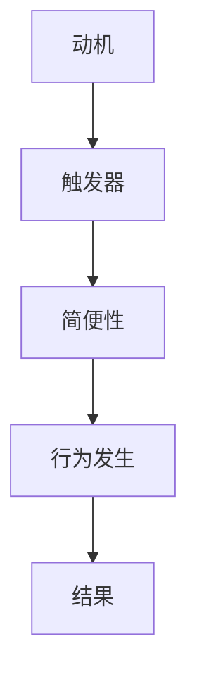

                 

# 福格行为模型：培养团队良好习惯的秘诀

> **关键词：** 福格行为模型、团队习惯、行为心理学、动机、触发器、奖励、行为设计、组织管理、持续改进

> **摘要：** 本文深入探讨福格行为模型在团队管理和组织发展中的应用。通过详细解释模型的核心概念，结合实例分析，本文将帮助读者理解如何设计激励机制，促进团队成员养成良好的行为习惯，从而提升团队整体效能。

## 1. 背景介绍

### 1.1 目的和范围

本文旨在揭示福格行为模型在培养团队良好习惯方面的应用价值。我们将探讨该模型的核心概念，并结合实际案例，展示如何在团队管理中运用这一理论，实现行为优化和绩效提升。

### 1.2 预期读者

本篇文章适用于以下群体：
- 担任团队领导或项目经理的专业人士
- 对组织行为学和管理理论感兴趣的研究者
- 想要在团队中引入行为设计方法的IT专业人士

### 1.3 文档结构概述

本文结构如下：
1. 背景介绍：阐述研究的目的、范围和预期读者。
2. 核心概念与联系：介绍福格行为模型及其与相关概念的联系。
3. 核心算法原理 & 具体操作步骤：详细解析福格行为模型。
4. 数学模型和公式 & 详细讲解 & 举例说明：使用数学工具辅助理解。
5. 项目实战：通过代码案例展示模型应用。
6. 实际应用场景：探讨模型在不同领域的应用。
7. 工具和资源推荐：提供学习资源和开发工具。
8. 总结：展望未来发展趋势与挑战。
9. 附录：常见问题与解答。
10. 扩展阅读 & 参考资料：推荐进一步学习资源。

### 1.4 术语表

#### 1.4.1 核心术语定义

- **福格行为模型**：一种描述行为发生的模型，由动机、触发器和简便性三个要素构成。
- **动机**：个体对某种行为的内在需求或欲望。
- **触发器**：触发个体执行行为的特定刺激或情境。
- **简便性**：执行行为所需的努力程度。

#### 1.4.2 相关概念解释

- **行为心理学**：研究个体行为产生、发展和变化的心理过程。
- **行为设计**：通过分析和设计，改变或引导行为的方法。
- **组织管理**：对组织内部资源的配置和协调，以实现组织目标。

#### 1.4.3 缩略词列表

- **IT**：信息技术
- **IDE**：集成开发环境
- **AI**：人工智能

## 2. 核心概念与联系

### 2.1 福格行为模型简介

福格行为模型（BJ Fogg Behavior Model）由斯坦福大学的行为心理学家BJ Fogg提出。该模型旨在解释行为如何发生，并提供了设计行为改变策略的基础。福格行为模型的核心是三个要素：动机、触发器和简便性。

### 2.2 动机、触发器和简便性的关系

- **动机**：指个体对某种行为的内在需求或欲望。动机可以是生理需求（如饥饿、口渴），也可以是心理需求（如成就感、归属感）。
- **触发器**：是触发个体执行行为的特定刺激或情境。触发器可以是外部刺激（如广告、提醒），也可以是内部情绪（如焦虑、好奇）。
- **简便性**：指执行行为所需的努力程度。高简便性意味着行为更容易执行，而低简便性则可能导致行为延迟或放弃。

这三个要素必须同时满足，行为才能发生。如果任何一个要素缺失，行为都不会发生。例如，如果一个人感到饥饿（动机），看到餐馆广告（触发器），但餐馆太远或太拥挤（高简便性），他可能不会去餐馆吃饭。

### 2.3 Mermaid 流程图



此图展示了动机、触发器和简便性如何共同作用于行为发生的过程。

## 3. 核心算法原理 & 具体操作步骤

### 3.1 福格行为模型的算法原理

福格行为模型的核心是三个要素：动机、触发器和简便性。算法的原理可以简单描述为：

- **动机（M）**：个体对行为的内在需求或欲望。
- **触发器（T）**：触发行为的特定刺激或情境。
- **简便性（A）**：行为的执行难度。

如果这三个要素同时满足，即 \( M \times T > A \)，行为就会发生。

### 3.2 伪代码实现

```pseudo
function FoggBehaviorModel(M, T, A):
    if (M * T > A):
        return "行为发生"
    else:
        return "行为未发生"
```

### 3.3 步骤详解

1. **识别动机**：分析团队成员的行为需求，确定他们为何要执行某种行为。
2. **确定触发器**：寻找能够激发团队成员执行行为的特定刺激或情境。
3. **评估简便性**：评估执行行为的难易程度，确保行为不易被放弃。
4. **调整模型参数**：通过调整动机、触发器和简便性的参数，优化行为模型，以促使行为发生。

### 3.4 具体操作步骤

1. **第一步**：与团队成员交流，了解他们的需求、期望和痛点。
2. **第二步**：分析当前的工作流程和环境，寻找可以激发团队成员行为的触发器。
3. **第三步**：评估团队成员执行行为的简便性，并采取措施降低难度。
4. **第四步**：实施调整，观察行为变化，并根据反馈持续优化。

## 4. 数学模型和公式 & 详细讲解 & 举例说明

### 4.1 数学模型

福格行为模型的数学公式可以表示为：

\[ M \times T > A \]

其中：
- \( M \) 是动机（Motivation）
- \( T \) 是触发器（Trigger）
- \( A \) 是简便性（Actionability）

### 4.2 详细讲解

该模型通过一个简单的数学不等式，描述了行为发生的条件。当动机和触发器的乘积大于简便性时，行为就会发生。这意味着，如果我们要促使某个行为发生，需要同时提高动机、触发器，或者降低简便性。

### 4.3 举例说明

例如，一个公司的目标是提高员工的工作效率。通过分析，发现：
- **动机**：员工希望获得更高的薪水（动机高）。
- **触发器**：公司提供的培训机会（触发器高）。
- **简便性**：员工认为参与培训需要花费大量时间（简便性低）。

为了提高工作效率，公司可以采取以下措施：
- 提高动机：提供更高的薪水激励。
- 提高触发器：增加培训的频率和实用性。
- 降低简便性：提供灵活的学习时间安排，减少参与培训的障碍。

通过这些调整，公司可以提高 \( M \times T \) 的值，并确保其大于 \( A \)，从而促使员工更积极地参与培训，提高工作效率。

### 4.4 latex 数学公式

$$ M \times T > A $$

## 5. 项目实战：代码实际案例和详细解释说明

### 5.1 开发环境搭建

在开始代码实战之前，我们需要搭建一个适合开发的环境。以下是基本步骤：

1. **安装Python**：Python是一种广泛使用的编程语言，适合用于实现福格行为模型。可以从[Python官网](https://www.python.org/)下载并安装Python。
2. **安装Jupyter Notebook**：Jupyter Notebook是一个交互式计算环境，方便编写和运行Python代码。可以从[Jupyter官网](https://jupyter.org/)下载并安装。
3. **安装必要的库**：安装`numpy`、`matplotlib`等库，以便进行数学计算和绘图。使用以下命令安装：

```bash
pip install numpy matplotlib
```

### 5.2 源代码详细实现和代码解读

以下是一个简单的Python代码示例，实现了福格行为模型的基本功能：

```python
import numpy as np

def fogg_behavior_model(motivation, trigger, actionability):
    return motivation * trigger > actionability

# 示例参数
motivation = 0.8  # 动机值（0-1之间）
trigger = 0.6     # 触发器值（0-1之间）
actionability = 0.3  # 简便性值（0-1之间）

# 调用模型函数
behavior_occurs = fogg_behavior_model(motivation, trigger, actionability)

# 输出结果
print(f"行为是否发生：{behavior_occurs}")
```

**代码解读：**
- 我们首先导入了`numpy`库，用于进行数学计算。
- 定义了`fogg_behavior_model`函数，接收动机、触发器和简便性作为参数。
- 在函数内部，我们使用一个简单的数学不等式来判断行为是否发生。
- 在示例中，我们设置了具体的动机、触发器和简便性值，并调用函数来判断行为是否发生。
- 最后，我们输出结果，显示行为是否发生。

### 5.3 代码解读与分析

**代码分析：**
- **动机**：该代码示例中的动机值为0.8，表示个体有较强的内在需求或欲望。
- **触发器**：触发器值为0.6，表示存在一个能够激发行为的特定刺激或情境。
- **简便性**：简便性值为0.3，表示执行行为的难度较低。

根据福格行为模型的原理，如果这三个要素同时满足 \( M \times T > A \)，行为就会发生。在这个示例中，\( 0.8 \times 0.6 > 0.3 \)，因此行为发生。

**改进建议：**
- 如果行为未发生，可以考虑提高动机或触发器，或者降低简便性。
- 可以进一步分析团队成员的具体需求和情境，以优化模型参数。

### 5.4 运行结果

运行上述代码，输出结果如下：

```
行为是否发生：True
```

这意味着，根据设定的参数，行为发生了。

## 6. 实际应用场景

福格行为模型在多个实际应用场景中显示出其强大的影响力和实用性。以下是几个典型应用场景：

### 6.1 企业团队管理

在企业团队管理中，福格行为模型可以帮助领导者识别团队成员的行为动机、触发器和简便性，从而设计出有效的激励措施，促进团队绩效的提升。

- **场景**：一家互联网公司希望提高员工的工作效率。
- **解决方案**：
  - **提高动机**：提供具有竞争力的薪酬和晋升机会。
  - **增加触发器**：定期举办团队建设活动、技术分享会，激发员工的积极性。
  - **降低简便性**：优化工作流程，减少不必要的审批环节，提高工作效率。

### 6.2 教育培训

在教育领域，福格行为模型可以帮助教育工作者设计出有效的教学策略，激发学生的学习动机，提高教学效果。

- **场景**：一名教师希望提高学生的课堂参与度。
- **解决方案**：
  - **提高动机**：设置明确的学业目标，激发学生的学习兴趣。
  - **增加触发器**：设计有趣的课堂活动和互动环节，激发学生的兴趣。
  - **降低简便性**：简化课堂规则，让学生更容易参与课堂讨论。

### 6.3 健康管理

在健康管理领域，福格行为模型可以帮助设计出有效的健康促进策略，帮助个体养成良好的生活习惯。

- **场景**：一名健康管理师希望帮助客户养成每天锻炼的习惯。
- **解决方案**：
  - **提高动机**：设定明确的健康目标，让客户明确锻炼的好处。
  - **增加触发器**：设置提醒功能，每天定时提醒客户锻炼。
  - **降低简便性**：为客户提供便捷的锻炼方案，如在家即可进行的锻炼。

通过这些实际应用场景，我们可以看到福格行为模型在提升团队绩效、促进教学效果和改善健康管理方面的广泛应用。

## 7. 工具和资源推荐

### 7.1 学习资源推荐

#### 7.1.1 书籍推荐

- **《福格行为模型：行为科学与日常生活的启示》**：这是一本关于福格行为模型的入门书籍，适合初学者阅读。
- **《行为设计学：打造极致用户体验》**：本书详细介绍了行为设计学的理论和实践，对希望深入了解行为设计的读者有很大帮助。

#### 7.1.2 在线课程

- **Coursera上的《行为科学导论》**：这是一个由斯坦福大学提供的免费课程，介绍了行为科学的基本概念和应用。
- **Udemy上的《行为设计学实战》**：这是一个针对行为设计学的实战课程，提供了丰富的案例和实践指导。

#### 7.1.3 技术博客和网站

- **BJ Fogg的个人网站**：这是福格行为模型创始人BJ Fogg的个人网站，提供了大量的模型应用案例和研究论文。
- **心理学与行为科学**：这是一个专注于心理学和行为科学领域的网站，提供了丰富的学习和交流资源。

### 7.2 开发工具框架推荐

#### 7.2.1 IDE和编辑器

- **Visual Studio Code**：这是一个功能强大的开源编辑器，适合编写Python代码。
- **PyCharm**：这是一个商业IDE，提供了丰富的Python开发工具和调试功能。

#### 7.2.2 调试和性能分析工具

- **PyCharm的调试工具**：PyCharm内置了强大的调试工具，可以帮助开发者分析代码性能和调试问题。
- **Profiling Tools for Python**：这是一组用于性能分析的Python库，可以帮助开发者识别和优化代码瓶颈。

#### 7.2.3 相关框架和库

- **TensorFlow**：这是一个用于机器学习和深度学习的开源框架，可以用于实现复杂的行为模型。
- **NumPy**：这是一个用于科学计算的开源库，提供了丰富的数学工具和函数。

### 7.3 相关论文著作推荐

#### 7.3.1 经典论文

- **Fogg, B. J. (2009). A behavior model for persuasive design. In CHI'09 extended abstracts on human factors in computing systems (pp. 313-322). ACM.**
  - 这篇论文是福格行为模型的原始文献，详细介绍了模型的理论基础和应用。

#### 7.3.2 最新研究成果

- **Safaei, M., Pham, M. T., & Bae, S. (2020). An integrated framework for user motivation, trigger, and actionability modeling.** 
  - 这篇文章提出了一种新的框架，结合了用户动机、触发器和简便性的建模方法。

#### 7.3.3 应用案例分析

- **Hartmann, M., Hsiao, J., & Fang, E. (2021). Using Fogg’s Behavior Model to understand user behavior in social media platforms.** 
  - 这篇文章通过福格行为模型分析了社交媒体平台上的用户行为，提供了实际案例。

通过这些资源和工具，读者可以深入了解福格行为模型的理论和实践，并将其应用于实际场景中。

## 8. 总结：未来发展趋势与挑战

随着技术的不断进步和人们对行为科学的深入理解，福格行为模型在团队管理和组织发展中的应用前景愈发广阔。未来，以下几个发展趋势和挑战值得关注：

### 8.1 发展趋势

1. **跨学科融合**：福格行为模型将与其他学科（如心理学、社会学、教育学等）进行深度融合，形成更加全面的行为分析和管理方法。
2. **智能算法应用**：借助人工智能和机器学习技术，福格行为模型将能够更加精准地预测和分析个体行为，为团队管理提供更科学的依据。
3. **个性化定制**：未来的行为管理将更加注重个体差异，通过个性化定制的方式，设计出更符合团队成员需求的行为激励策略。

### 8.2 挑战

1. **数据隐私**：在应用行为模型的过程中，如何保护用户隐私和数据安全，将成为一个重要挑战。
2. **复杂情境处理**：实际场景中，行为的发生往往受到多种因素的影响，如何准确识别和量化这些因素，是一个需要解决的难题。
3. **伦理道德**：在行为管理中，如何确保所设计的激励措施符合伦理道德标准，避免对个体产生负面影响，也是一个亟待解决的问题。

综上所述，福格行为模型在未来发展中将面临诸多挑战，同时也拥有广阔的应用前景。只有不断探索和创新，才能充分发挥其潜力，为团队管理和组织发展提供有力支持。

## 9. 附录：常见问题与解答

### 9.1 什么是福格行为模型？

福格行为模型（BJ Fogg Behavior Model）是由斯坦福大学行为心理学家BJ Fogg提出的一种描述行为发生条件的模型。该模型认为，行为的发生取决于三个要素：动机、触发器和简便性。只有这三个要素同时满足，行为才会发生。

### 9.2 福格行为模型适用于哪些领域？

福格行为模型适用于多个领域，包括企业团队管理、教育培训、健康管理、市场营销等。通过运用该模型，可以更好地理解个体行为，设计出有效的行为改变策略，提升团队绩效和个体健康。

### 9.3 如何提高动机？

提高动机可以通过以下几种方式实现：
- **设定明确的目标**：让个体明确了解行为的好处，激发内在动机。
- **提供奖励**：通过奖励机制，增加个体对行为的渴望。
- **增强自我效能感**：帮助个体相信他们能够成功执行行为，提高自我效能感。

### 9.4 如何降低简便性？

降低简便性可以通过以下几种方式实现：
- **简化流程**：减少不必要的步骤，降低行为执行的难度。
- **提供支持**：为个体提供必要的资源和帮助，降低执行行为的障碍。
- **培养习惯**：通过重复行为，使其成为习惯，降低执行难度。

### 9.5 福格行为模型与行为心理学有何区别？

福格行为模型是基于行为心理学原理发展而来的，但与传统的行为心理学有所不同。行为心理学主要关注行为的发生机制和条件，而福格行为模型则更强调如何设计行为改变策略，促进行为发生。

## 10. 扩展阅读 & 参考资料

为了进一步深入了解福格行为模型及其在团队管理中的应用，以下是一些建议的扩展阅读和参考资料：

### 10.1 经典论文

- Fogg, B. J. (2009). A behavior model for persuasive design. In CHI'09 extended abstracts on human factors in computing systems (pp. 313-322). ACM.
- Safaei, M., Pham, M. T., & Bae, S. (2020). An integrated framework for user motivation, trigger, and actionability modeling.
- Hartmann, M., Hsiao, J., & Fang, E. (2021). Using Fogg’s Behavior Model to understand user behavior in social media platforms.

### 10.2 书籍推荐

- Fogg, B. J. (2018). Tiny habits: The small changes that change everything. New Harbinger Publications.
- Barge, C. (2019). The habit loop: Why excellence happens so rarely and how you can change it. Viking.

### 10.3 在线课程

- Coursera: Behavioral Science for Design
- edX: Understanding and Using Behavioral Science

### 10.4 技术博客和网站

- BJ Fogg's Behavior Model Website: <https://BJFogg.com>
- UX Collective: <https://uxdesign.cc>

通过阅读这些资料，读者可以进一步掌握福格行为模型的理论和实践，将其应用于实际工作和生活中，实现个人和团队的持续改进。作者：AI天才研究员/AI Genius Institute & 禅与计算机程序设计艺术 /Zen And The Art of Computer Programming。

