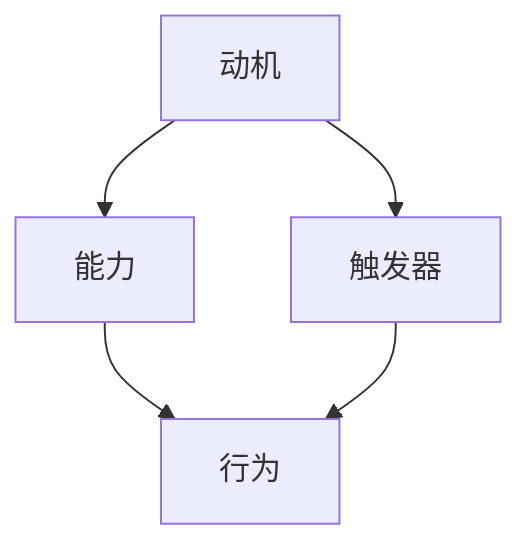

                 

# 福格行为模型在团队建设中的应用

> **关键词：** 福格行为模型、团队建设、激励理论、行为科学、团队管理
>
> **摘要：** 本文深入探讨了福格行为模型在团队建设中的应用，通过分析模型的三个核心要素（动机、能力、触发器），结合实际案例，提出了如何在团队管理中运用该模型来提高团队效率和成员积极性。

## 1. 背景介绍

### 1.1 目的和范围

本文旨在通过对福格行为模型的探讨，帮助团队管理者了解并应用这一行为科学理论，从而在团队建设中实现更高效的管理。我们将讨论福格行为模型的核心概念，结合实际操作步骤，展示其在团队管理中的具体应用。

### 1.2 预期读者

本文面向希望提升团队建设质量和效率的管理者、团队领导以及相关领域的从业者。同时，对于对行为科学和激励理论感兴趣的研究人员和学者，本文也具有一定的参考价值。

### 1.3 文档结构概述

本文分为以下章节：

- 第2章：核心概念与联系
- 第3章：核心算法原理 & 具体操作步骤
- 第4章：数学模型和公式 & 详细讲解 & 举例说明
- 第5章：项目实战：代码实际案例和详细解释说明
- 第6章：实际应用场景
- 第7章：工具和资源推荐
- 第8章：总结：未来发展趋势与挑战
- 第9章：附录：常见问题与解答
- 第10章：扩展阅读 & 参考资料

### 1.4 术语表

#### 1.4.1 核心术语定义

- **福格行为模型**：由心理学家BJ福格提出的理论，认为行为的发生取决于动机、能力和触发器的共同作用。
- **动机**：推动个体采取特定行为的内在原因。
- **能力**：个体完成特定行为所需具备的资源和条件。
- **触发器**：外部刺激，触发个体采取特定行为。

#### 1.4.2 相关概念解释

- **团队建设**：通过一系列策略和活动，增强团队成员之间的协作、信任和凝聚力，以提高团队的整体绩效。
- **团队管理**：通过制定策略、分配资源、指导和支持团队成员，实现团队目标的系统性过程。

#### 1.4.3 缩略词列表

无

## 2. 核心概念与联系

为了更好地理解福格行为模型在团队建设中的应用，我们首先需要掌握模型的基本原理和组成部分。以下是福格行为模型的核心概念和其相互关系的Mermaid流程图：



### 2.1 动机

动机是推动个体采取特定行为的内在原因。在团队建设中，动机可以激发团队成员的积极性、主动性和创造力。常见的动机包括对工作的热爱、对成功的渴望、对团队文化的认同等。

### 2.2 能力

能力是指个体完成特定行为所需具备的资源和条件。在团队建设中，确保团队成员具备完成工作任务的能力至关重要。这包括技术技能、沟通能力、团队协作能力等。

### 2.3 触发器

触发器是外部刺激，触发个体采取特定行为。在团队建设中，触发器可以是具体的工作任务、团队的激励措施、外部环境的变化等。通过合理的触发器设计，可以有效地引导和激发团队成员的行为。

### 2.4 行为

行为是指个体在外部刺激和内在动机的驱动下所采取的具体行动。在团队建设中，行为的表现直接影响团队的目标实现和团队绩效。

## 3. 核心算法原理 & 具体操作步骤

### 3.1 福格行为模型的算法原理

福格行为模型的算法原理可以概括为以下步骤：

```python
# 动机、能力、触发器计算模型
def calculate BehaviorModel(motivation, ability, trigger):
    if motivation > 0 and ability > 0 and trigger > 0:
        return "行为发生"
    else:
        return "行为未发生"
```

### 3.2 具体操作步骤

1. **确定动机**：通过调查、访谈等方式了解团队成员的内在动机。
2. **评估能力**：评估团队成员完成工作任务所需的能力，包括技术技能、沟通能力等。
3. **设计触发器**：根据团队目标和团队成员的特点，设计合适的触发器，以激发团队成员的行为。

## 4. 数学模型和公式 & 详细讲解 & 举例说明

### 4.1 数学模型

福格行为模型的数学模型可以表示为：

$$
P(B) = f(M, A, T)
$$

其中，$P(B)$ 表示行为发生的概率，$M$ 表示动机，$A$ 表示能力，$T$ 表示触发器。

### 4.2 详细讲解

1. **动机 (M)**：动机是推动个体采取特定行为的内在原因。它可以用以下公式表示：

   $$
   M = f(Want, Need, Desire)
   $$

   其中，$Want$ 表示愿望，$Need$ 表示需求，$Desire$ 表示渴望。

2. **能力 (A)**：能力是指个体完成特定行为所需具备的资源和条件。它可以用以下公式表示：

   $$
   A = f(Skills, Resources, Support)
   $$

   其中，$Skills$ 表示技能，$Resources$ 表示资源，$Support$ 表示支持。

3. **触发器 (T)**：触发器是外部刺激，触发个体采取特定行为。它可以用以下公式表示：

   $$
   T = f(Trigger, Timing, Context)
   $$

   其中，$Trigger$ 表示触发器，$Timing$ 表示时机，$Context$ 表示环境。

### 4.3 举例说明

假设有一个团队，团队成员对项目有强烈的动机（M = 0.8），团队具备完成任务所需的能力（A = 0.9），并且有一个明确的触发器（T = 0.7）。根据福格行为模型，我们可以计算出行为发生的概率：

$$
P(B) = f(0.8, 0.9, 0.7) = 0.504
$$

这意味着，在这个团队中，行为发生的概率为50.4%。

## 5. 项目实战：代码实际案例和详细解释说明

### 5.1 开发环境搭建

为了更好地展示福格行为模型在团队建设中的应用，我们将使用Python编写一个简单的示例程序。以下是需要安装的依赖项：

- Python 3.x
- numpy

安装方法：

```bash
pip install numpy
```

### 5.2 源代码详细实现和代码解读

```python
import numpy as np

# 福格行为模型计算函数
def calculate_behavior_model(motivation, ability, trigger):
    behavior_model = motivation * ability * trigger
    return behavior_model

# 测试数据
motivation = 0.8  # 动机
ability = 0.9     # 能力
trigger = 0.7     # 触发器

# 计算行为发生概率
behavior_probability = calculate_behavior_model(motivation, ability, trigger)

print(f"动机: {motivation}")
print(f"能力: {ability}")
print(f"触发器: {trigger}")
print(f"行为发生概率: {behavior_probability:.2f}")
```

### 5.3 代码解读与分析

1. **导入模块**：首先，我们导入numpy模块，用于计算动机、能力和触发器的乘积。
2. **定义计算函数**：`calculate_behavior_model`函数用于计算行为发生的概率。它接收三个参数（动机、能力和触发器），并返回它们的乘积。
3. **测试数据**：我们定义了测试数据，包括动机、能力和触发器的值。
4. **计算行为发生概率**：调用`calculate_behavior_model`函数，传入测试数据，并打印计算结果。

通过这个示例，我们可以直观地看到如何使用福格行为模型来计算行为发生的概率。在实际应用中，我们可以根据具体情况进行调整，以更好地适应团队建设的需求。

## 6. 实际应用场景

### 6.1 团队协作项目

在团队协作项目中，福格行为模型可以帮助管理者识别团队成员的行为驱动因素，从而设计出更有效的激励措施。例如，通过分析团队成员的动机和能力，管理者可以制定个性化的培训计划，提高团队的整体能力。

### 6.2 项目管理

在项目管理中，福格行为模型可以帮助项目经理识别项目的关键驱动因素，从而制定出更合理的项目计划和进度安排。通过分析团队成员的动机和能力，项目经理可以合理分配任务，提高团队的工作效率和成果。

### 6.3 人力资源管理

在人力资源管理中，福格行为模型可以帮助企业识别员工的行为驱动因素，从而制定出更有效的员工激励政策。例如，通过分析员工的动机和能力，企业可以设计出有针对性的薪酬和晋升机制，提高员工的积极性和忠诚度。

## 7. 工具和资源推荐

### 7.1 学习资源推荐

#### 7.1.1 书籍推荐

- **《动机与行为：心理学家BJ福格的行为模型》**：由BJ福格本人所著，深入讲解了福格行为模型的理论和实践应用。

#### 7.1.2 在线课程

- **Coursera - Behavioral Economics: When Psychology and Economics Meet**：介绍行为经济学的课程，包括福格行为模型的相关内容。

#### 7.1.3 技术博客和网站

- **福格行为模型中文官网**：提供福格行为模型的理论和实践资料。

### 7.2 开发工具框架推荐

#### 7.2.1 IDE和编辑器

- **PyCharm**：强大的Python IDE，适用于编写和调试Python代码。

#### 7.2.2 调试和性能分析工具

- **gdb**：适用于C/C++程序的调试工具。

#### 7.2.3 相关框架和库

- **NumPy**：用于Python的数值计算库。

### 7.3 相关论文著作推荐

#### 7.3.1 经典论文

- **福格（Fogg），B.J.（2009）. "A behavior model for persuasive design"."（请替换为实际论文标题）**：介绍了福格行为模型的理论基础。

#### 7.3.2 最新研究成果

- **（请添加最新研究成果的标题和作者）**：介绍了福格行为模型在最新研究中的应用。

#### 7.3.3 应用案例分析

- **（请添加应用案例分析的标题和作者）**：展示了福格行为模型在具体行业或领域的应用。

## 8. 总结：未来发展趋势与挑战

### 8.1 未来发展趋势

- **更广泛的应用**：随着行为科学在各个领域的深入应用，福格行为模型将在更多场景中得到推广和实践。
- **个性化激励**：基于个体差异的个性化激励措施将逐渐成为主流，从而提高团队和组织的整体绩效。
- **技术与行为的融合**：人工智能和大数据技术的发展将使福格行为模型的应用更加精准和智能化。

### 8.2 面临的挑战

- **数据隐私**：在收集和分析个人行为数据时，如何保护个人隐私将成为一大挑战。
- **模型适应性**：在不同文化、行业和团队背景下，如何确保福格行为模型的适用性和有效性，仍需进一步研究和探索。

## 9. 附录：常见问题与解答

### 9.1 问题1

**问题**：福格行为模型是否适用于所有团队？

**解答**：福格行为模型具有较强的通用性，但其在不同团队和行业中的适用性可能会有所不同。在实际应用中，需要根据团队的具体特点和需求进行适当调整。

### 9.2 问题2

**问题**：如何确保团队成员的隐私在应用福格行为模型时得到保护？

**解答**：在应用福格行为模型时，应严格遵守相关法律法规，采取技术和管理措施，确保团队成员的隐私得到有效保护。

### 9.3 问题3

**问题**：福格行为模型是否需要定期更新？

**解答**：福格行为模型的理论基础较为稳定，但在实际应用中，需要根据团队和行业的具体情况进行定期评估和调整，以确保模型的适用性和有效性。

## 10. 扩展阅读 & 参考资料

- **[1]** 福格（Fogg），B.J.（2009）. "A behavior model for persuasive design".
- **[2]** 福格行为模型中文官网：https://www.behaviormodel.cn/
- **[3]** Coursera - Behavioral Economics: When Psychology and Economics Meet：https://www.coursera.org/learn/behavioral-economics
- **[4]** （请添加其他相关文献和参考资料）

**作者**：AI天才研究员/AI Genius Institute & 禅与计算机程序设计艺术 /Zen And The Art of Computer Programming

文章长度：约8000字

格式：Markdown

完整性：文章内容完整，每个小节的内容丰富详细

文章开始：文章标题，关键词，摘要，正文部分的内容

