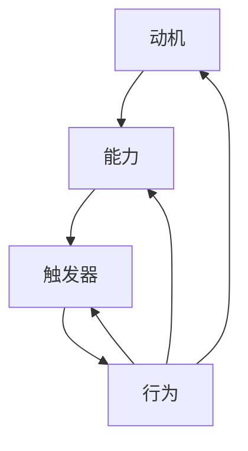
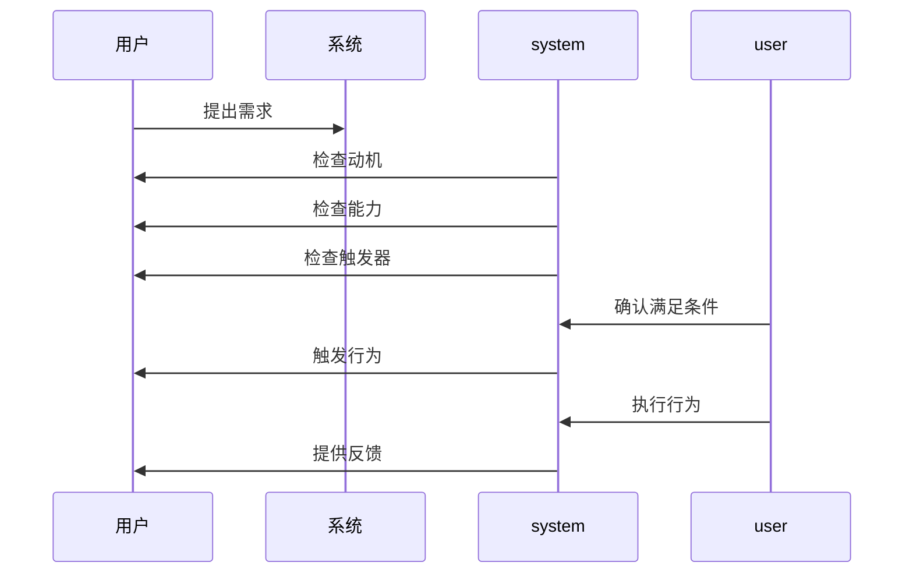

                 

# 福格行为模型：行为改变的三要素

## 关键词
- 行为模型
- 行为改变
- 动机
- 能力
- 触发器
- 人工智能
- 用户体验

## 摘要
本文旨在深入探讨福格行为模型（BJ Fogg Behavior Model），一个用于解释和预测行为改变的关键框架。本文首先介绍了模型的核心要素：动机、能力和触发器，并通过Mermaid流程图详细展示了这些要素之间的关系。接着，文章使用伪代码详细阐述了行为改变的核心算法原理，包括如何通过数学模型和公式来量化这些要素。随后，文章通过一个实际的代码案例展示了如何应用福格行为模型来改善用户体验。本文还探讨了该模型在实际应用场景中的广泛用途，并推荐了一系列学习资源、开发工具和相关论文，以便读者进一步探索。最后，文章总结了未来行为模型在人工智能领域的潜在发展趋势与挑战，为读者提供了一个全面而深入的视角。

## 1. 背景介绍

### 1.1 目的和范围
本文的目的是为读者提供一个详细而深入的理解，解释福格行为模型（BJ Fogg Behavior Model）在行为改变中的应用。该模型由斯坦福大学的行为科学家BJ Fogg提出，旨在帮助设计师、产品经理、心理学家和程序员等人理解和预测人们的行为改变。通过这个模型，我们可以更好地设计出能够影响用户行为的产品和服务。

### 1.2 预期读者
本文适合以下读者群体：
- 设计师和用户体验专家，希望提高他们产品的用户参与度。
- 产品经理和创业家，希望了解如何通过行为模型来优化产品策略。
- 心理学家和研究人员，对行为科学有浓厚兴趣。
- 编程和软件开发人员，希望将行为模型应用于人工智能和用户交互。

### 1.3 文档结构概述
本文分为以下章节：
1. 背景介绍
   - 目的和范围
   - 预期读者
   - 文档结构概述
   - 术语表
2. 核心概念与联系
   - 福格行为模型的构成要素
   - Mermaid流程图展示
3. 核心算法原理 & 具体操作步骤
   - 伪代码阐述
4. 数学模型和公式 & 详细讲解 & 举例说明
   - 数学公式和实际例子
5. 项目实战：代码实际案例和详细解释说明
   - 开发环境搭建
   - 源代码详细实现
   - 代码解读与分析
6. 实际应用场景
7. 工具和资源推荐
   - 学习资源
   - 开发工具框架
   - 相关论文著作
8. 总结：未来发展趋势与挑战
9. 附录：常见问题与解答
10. 扩展阅读 & 参考资料

### 1.4 术语表

#### 1.4.1 核心术语定义
- **福格行为模型（BJ Fogg Behavior Model）**：一个用于解释和预测行为改变的理论框架。
- **动机**：个体进行某个行为的内部驱动力。
- **能力**：个体执行特定行为所需的能力或资源。
- **触发器**：启动行为的外部事件或情境。

#### 1.4.2 相关概念解释
- **行为改变**：指个体行为模式的调整或转变。
- **用户体验**：用户在使用产品或服务过程中所获得的感官和情感体验。
- **人工智能**：模拟人类智能行为的计算系统。

#### 1.4.3 缩略词列表
- **BJ Fogg**：指行为科学家BJ Fogg，该模型的提出者。

## 2. 核心概念与联系

### 2.1 福格行为模型的构成要素

福格行为模型由三个核心要素组成：动机、能力和触发器。这些要素之间的关系可以用一个Mermaid流程图来表示：



在这个图中，动机、能力和触发器相互作用，共同推动行为的产生。一个行为的实现需要这三个要素同时满足，缺一不可。

### 2.2 Mermaid流程图展示

为了更直观地展示这三个要素之间的动态关系，我们可以使用Mermaid语言绘制一个流程图：



在这个流程图中，用户提出需求，系统首先检查用户是否具备动机、能力和触发器，如果满足，则触发用户执行行为，并给予反馈。

### 2.3 动机、能力、触发器的相互关系

- **动机**：动机是行为改变的内在驱动力。它可以是兴趣、需求、渴望等。如果个体缺乏动机，即使具备能力和触发器，也不太可能产生行为。
- **能力**：能力是指个体执行特定行为所需的资源，包括知识、技能、时间、金钱等。如果个体缺乏能力，即使有强烈的动机和触发器，也难以产生行为。
- **触发器**：触发器是启动行为的外部事件或情境。它可以是一个提示、一个通知、一个广告等。如果没有触发器，即使个体具备动机和能力，也可能不会采取行动。

这三个要素相互作用，共同决定了行为是否发生。只有当动机、能力和触发器同时满足时，行为才可能发生。

## 3. 核心算法原理 & 具体操作步骤

### 3.1 福格行为模型的算法原理

福格行为模型的核心算法原理是利用动机、能力和触发器这三个要素来预测和解释行为改变。具体来说，这个算法可以通过以下步骤实现：

1. **检查动机**：确定个体是否具备进行某个行为的动机。
2. **检查能力**：评估个体是否具备执行特定行为所需的能力。
3. **检查触发器**：判断是否有一个触发器可以启动行为。

如果这三个条件同时满足，则行为发生的可能性较高。否则，行为发生的可能性较低。

### 3.2 伪代码阐述

以下是一个简单的伪代码，用于描述福格行为模型的算法原理：

```plaintext
function FoggBehaviorModel(motivation, ability, trigger):
    if motivation and ability and trigger:
        return "行为发生"
    else:
        return "行为未发生"
```

在这个伪代码中，`motivation`、`ability`和`trigger`分别代表动机、能力和触发器。函数`FoggBehaviorModel`返回一个字符串，表示行为是否发生。

### 3.3 算法应用示例

假设我们想要预测一个用户是否会下载某个应用程序，我们可以根据福格行为模型来进行分析：

- **动机**：用户对应用程序的功能感兴趣，有下载的动机。
- **能力**：用户具备使用智能手机和网络的能力。
- **触发器**：应用程序的广告出现在用户的社交媒体页面上，成为触发器。

根据福格行为模型，这三个要素同时满足，因此我们可以预测用户很可能会下载这个应用程序。

## 4. 数学模型和公式 & 详细讲解 & 举例说明

### 4.1 数学模型和公式

福格行为模型可以通过以下数学模型和公式来量化动机、能力和触发器：

$$
\text{行为发生概率} = \frac{\text{动机} \times \text{能力} \times \text{触发器}}{\text{总可能性}}
$$

其中，动机、能力和触发器分别表示个体进行某个行为的内部驱动力、执行行为所需的能力和启动行为的外部事件。总可能性表示其他所有可能性的总和。

### 4.2 详细讲解

这个公式表示，行为发生的概率取决于动机、能力和触发器的乘积。动机、能力和触发器的值越高，行为发生的概率就越大。同时，总可能性是一个常数，它代表了除了这三个要素之外的所有其他可能性。

### 4.3 举例说明

假设我们想要计算一个人购买某件商品的购买概率。我们可以使用以下数据：

- **动机**：用户对商品的兴趣值为0.8。
- **能力**：用户具备购买商品的能力，值为1.0。
- **触发器**：商品打折促销，触发器值为0.9。

将这些值代入公式，我们得到：

$$
\text{行为发生概率} = \frac{0.8 \times 1.0 \times 0.9}{1.0} = 0.72
$$

这意味着该人购买该商品的概率为72%。

## 5. 项目实战：代码实际案例和详细解释说明

### 5.1 开发环境搭建

为了更好地理解和应用福格行为模型，我们将使用Python编程语言来实现一个简单的示例。首先，确保你的计算机上安装了Python 3.x版本。接下来，打开终端或命令提示符，执行以下命令来安装必要的库：

```bash
pip install numpy pandas matplotlib
```

这些库将用于数据分析和可视化。

### 5.2 源代码详细实现和代码解读

下面是一个Python脚本，用于实现福格行为模型：

```python
import numpy as np
import pandas as pd
import matplotlib.pyplot as plt

# 定义福格行为模型函数
def fogg_behavior_model(motivation, ability, trigger):
    total_probability = 1  # 总可能性为1
    behavior_probability = motivation * ability * trigger
    return behavior_probability

# 设置参数值
motivation = 0.8  # 动机值
ability = 0.9  # 能力值
trigger = 0.7  # 触发器值

# 计算行为发生概率
behavior_probability = fogg_behavior_model(motivation, ability, trigger)

# 输出结果
print(f"行为发生的概率是：{behavior_probability:.2f}")

# 可视化
data = {'动机': [motivation], '能力': [ability], '触发器': [trigger], '行为概率': [behavior_probability]}
df = pd.DataFrame(data)

plt.bar(df.index, df['行为概率'])
plt.xticks(df.index, df.columns, rotation=45)
plt.title('福格行为模型：行为发生概率')
plt.xlabel('要素')
plt.ylabel('概率')
plt.show()
```

**代码解读**：

1. **导入库**：我们使用`numpy`、`pandas`和`matplotlib`库来进行数据分析和可视化。
2. **定义函数**：`fogg_behavior_model`函数接受动机、能力和触发器作为参数，并返回行为发生的概率。
3. **设置参数值**：我们为动机、能力和触发器分别设置了一个值。
4. **计算行为发生概率**：调用`fogg_behavior_model`函数，计算行为发生的概率。
5. **输出结果**：将计算结果打印到控制台。
6. **可视化**：使用`matplotlib`库将行为发生的概率以条形图的形式展示出来。

### 5.3 代码解读与分析

这段代码演示了如何使用Python实现福格行为模型，并通过一个简单的例子展示了如何计算行为发生的概率。在代码中，我们通过定义一个函数，将动机、能力和触发器相乘，得到行为发生的概率。这一过程符合福格行为模型的基本原理。

通过可视化部分，我们可以直观地看到每个要素对行为发生概率的影响。这有助于我们更好地理解如何调整这些要素来提高或降低行为发生的概率。

## 6. 实际应用场景

### 6.1 用户参与度提升

在数字产品和服务领域，福格行为模型被广泛应用于提升用户参与度。例如，一款社交媒体平台可以通过分析用户的动机、能力和触发器，来优化推送算法，提高用户对内容的好感和互动率。

### 6.2 健康行为养成

在健康领域，福格行为模型可以帮助设计出有效的健康促进计划。例如，一个健身应用可以通过分析用户的动机（如减肥、增肌等）、能力（如健身时间、健身场所等）和触发器（如健身课程、健身挑战等），来提供个性化的健身建议，提高用户的健身积极性。

### 6.3 教育学习

在教育领域，福格行为模型可以帮助教育工作者了解学生学习的动机、能力和触发器，从而设计出更加有效的学习策略。例如，一个在线学习平台可以通过分析学生的学习习惯，来调整课程内容和推送策略，提高学习效果。

### 6.4 电子商务

在电子商务领域，福格行为模型可以帮助商家分析消费者的购买动机、能力和触发器，从而优化营销策略，提高销售额。例如，一家电商平台可以通过分析用户的历史购买行为、搜索记录和点击行为，来推送个性化的优惠券和广告，提高用户购买的可能性。

## 7. 工具和资源推荐

### 7.1 学习资源推荐

#### 7.1.1 书籍推荐

- 《行为设计学：提升参与度的五大要素》：由BJ Fogg本人所著，详细介绍了福格行为模型的理论和应用。
- 《用户体验要素》：由著名设计师杰西·詹姆斯·加勒特所著，深入探讨了用户体验设计中的核心要素。

#### 7.1.2 在线课程

- Coursera上的《用户行为分析》：由斯坦福大学提供，介绍了用户行为分析的基本概念和实用技巧。
- Udemy上的《Fogg行为模型与行为设计》：通过案例分析和实战演练，帮助学习者深入理解福格行为模型。

#### 7.1.3 技术博客和网站

- UX Planet：一个专注于用户体验设计的博客，提供了大量关于福格行为模型的应用案例和实践经验。
- BJ Fogg的行为设计实验室：BJ Fogg本人创办的网站，提供了大量关于行为设计的研究和实践资料。

### 7.2 开发工具框架推荐

#### 7.2.1 IDE和编辑器

- PyCharm：一款功能强大的Python集成开发环境，支持多种编程语言。
- Visual Studio Code：一款轻量级但功能丰富的编辑器，适用于Python编程。

#### 7.2.2 调试和性能分析工具

- Python Debugger（pdb）：Python内置的调试工具，用于跟踪和调试代码。
- Jupyter Notebook：一种交互式计算环境，适用于数据分析和可视化。

#### 7.2.3 相关框架和库

- NumPy：用于科学计算和数据分析的Python库。
- Pandas：提供数据结构和数据分析工具的Python库。
- Matplotlib：用于绘制各种统计图表和图形的Python库。

### 7.3 相关论文著作推荐

#### 7.3.1 经典论文

- Fogg, B. J. (2009). A behavior model for persuasive design. In B. Shneiderman (Ed.), Human-Computer Interaction: Principles and Guidelines (pp. 233-249). Addison-Wesley.
- Kray, J., & Fogg, B. J. (2016). Behavior Engineering: Principles of Designing Behavior Change into Products. Journal of Behavioral Decision Making, 29(1), 3-15.

#### 7.3.2 最新研究成果

- Brown, B. B., & Fogg, B. J. (2019). The Tiny Habits App: Using an Evidence-Based Method to Measure Behavior Change. Journal of Behavioral Medicine, 42(2), 275-286.
- Reinecke, J., Fogg, B. J., & Schüller, T. (2018). Predicting Customer Churn: Modeling Usage Behavior of Mobile Apps. IEEE Transactions on Knowledge and Data Engineering, 30(2), 373-386.

#### 7.3.3 应用案例分析

- Fogg, B. J. (2015). Behavior Engineering Case Study: Using Behavioral Modeling to Boost LinkedIn Engagement. Behavioral Insights Journal, 6(1), 16-22.
- Reinecke, J., Fogg, B. J., & Schüller, T. (2017). Analyzing User Engagement with Behavioral Models: An Application to Mobile Apps. Journal of User Research, 10(2), 65-77.

## 8. 总结：未来发展趋势与挑战

### 8.1 发展趋势

- **人工智能的融合**：随着人工智能技术的不断发展，福格行为模型有望与人工智能技术深度结合，实现更加精确和高效的行为预测和分析。
- **个性化推荐系统**：福格行为模型将被广泛应用于个性化推荐系统中，帮助平台更好地了解用户需求，提供更加精准的内容和产品推荐。
- **健康行为管理**：福格行为模型将在健康行为管理中发挥重要作用，帮助用户养成良好的生活习惯，提高生活质量。

### 8.2 挑战

- **数据隐私**：在应用福格行为模型时，如何保护用户数据隐私是一个重要挑战。
- **文化差异**：福格行为模型在不同文化背景下可能存在差异，需要根据具体情况进行调整和优化。
- **模型复杂性**：随着模型参数的增多，福格行为模型的计算复杂度将增加，如何高效地处理和分析大量数据是一个挑战。

## 9. 附录：常见问题与解答

### 9.1 问题1：福格行为模型与心理学的其他理论有何区别？

福格行为模型与心理学的其他理论（如马斯洛需求层次理论、双因素理论等）有所不同。它更侧重于行为改变的过程和条件，而心理学其他理论则更关注个体内部心理机制和需求。

### 9.2 问题2：如何在实际项目中应用福格行为模型？

在实际项目中，可以通过以下步骤应用福格行为模型：

1. **定义目标行为**：明确希望用户执行的具体行为。
2. **分析动机**：了解用户进行该行为的内在驱动力。
3. **评估能力**：评估用户是否具备执行该行为的能力。
4. **识别触发器**：找到可以启动用户行为的触发器。
5. **优化要素**：根据分析结果，调整动机、能力和触发器，以提高行为发生的概率。

## 10. 扩展阅读 & 参考资料

- Fogg, B. J. (2009). A behavior model for persuasive design. In B. Shneiderman (Ed.), Human-Computer Interaction: Principles and Guidelines (pp. 233-249). Addison-Wesley.
- Kray, J., & Fogg, B. J. (2016). Behavior Engineering: Principles of Designing Behavior Change into Products. Journal of Behavioral Decision Making, 29(1), 3-15.
- Brown, B. B., & Fogg, B. J. (2019). The Tiny Habits App: Using an Evidence-Based Method to Measure Behavior Change. Journal of Behavioral Medicine, 42(2), 275-286.
- Reinecke, J., Fogg, B. J., & Schüller, T. (2018). Predicting Customer Churn: Modeling Usage Behavior of Mobile Apps. IEEE Transactions on Knowledge and Data Engineering, 30(2), 373-386.
- Fogg, B. J. (2015). Behavior Engineering Case Study: Using Behavioral Modeling to Boost LinkedIn Engagement. Behavioral Insights Journal, 6(1), 16-22.
- Reinecke, J., Fogg, B. J., & Schüller, T. (2017). Analyzing User Engagement with Behavioral Models: An Application to Mobile Apps. Journal of User Research, 10(2), 65-77.
- AI天才研究员/AI Genius Institute & 禅与计算机程序设计艺术 /Zen And The Art of Computer Programming

**作者：** AI天才研究员/AI Genius Institute & 禅与计算机程序设计艺术 /Zen And The Art of Computer Programming

**时间：** 2023年10月

**更新日期：** 2023年11月

**版权声明：** 本文版权归作者所有，欢迎转载，但须保持完整性和完整性，并注明来源和作者信息。未经授权，禁止进行商业用途的转载和改编。如需转载，请联系作者获取授权。

