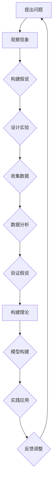

                 

### 科学探究：从假说到真理

> **关键词：科学方法、假说验证、模型构建、数学公式、实践应用、IT领域**

> **摘要：本文将深入探讨科学探究的基本过程，从假说的提出、验证到模型的构建，并通过数学模型和公式详细解析科学方法在IT领域的实际应用。读者将了解科学探究的核心步骤，掌握如何利用科学方法解决复杂问题，并了解其未来发展趋势和挑战。**

### 1. 背景介绍

#### 1.1 目的和范围

本文旨在通过系统阐述科学探究的方法和步骤，帮助读者理解科学探究的本质，掌握科学思维的核心技巧。文章将重点讨论以下内容：

1. 科学方法的基本流程
2. 从假说到理论的构建过程
3. 数学模型在科学探究中的作用
4. 科学方法在IT领域的具体应用

#### 1.2 预期读者

本文适用于对科学方法和IT领域有一定了解的读者，特别是希望深入理解科学方法在软件开发、数据分析和人工智能等领域应用的科研人员、工程师和技术爱好者。

#### 1.3 文档结构概述

本文将分为八个主要部分：

1. 背景介绍
2. 核心概念与联系
3. 核心算法原理与具体操作步骤
4. 数学模型和公式与详细讲解
5. 项目实战：代码实际案例和详细解释说明
6. 实际应用场景
7. 工具和资源推荐
8. 总结：未来发展趋势与挑战

#### 1.4 术语表

为了确保文章内容的清晰性和一致性，本文将对以下术语进行定义和解释：

##### 1.4.1 核心术语定义

- 科学方法：科学探究的系统性方法，包括观察、假设、实验、理论构建和验证等步骤。
- 假说：对某一现象或问题的初步解释或猜想。
- 理论：经过实验验证和数学模型支持的假说，具有广泛的应用性和解释力。
- 数学模型：使用数学公式和算法描述现实问题的抽象模型。
- IT领域：信息技术领域，包括计算机科学、软件开发、数据分析等。

##### 1.4.2 相关概念解释

- 科学探究：通过系统的方法和步骤，对自然界和人类活动进行深入研究的过程。
- 模型构建：在科学探究过程中，将实际问题转化为数学模型的过程。
- 实践应用：将科学方法、理论和模型应用于实际问题的过程。

##### 1.4.3 缩略词列表

- IT：信息技术
- ML：机器学习
- AI：人工智能
- DL：深度学习
- Big Data：大数据

### 2. 核心概念与联系

在科学探究过程中，核心概念和原理之间的联系至关重要。以下将通过一个Mermaid流程图（图1）来展示科学探究的主要概念和步骤之间的联系。



图1：科学探究的Mermaid流程图

通过这个流程图，我们可以看到科学探究的核心步骤包括：提出问题、观察现象、构建假说、设计实验、收集数据、数据分析、验证假说、构建理论和模型、实践应用以及反馈调整。这些步骤相互联系，形成一个循环过程，确保科学探究的严谨性和有效性。

### 3. 核心算法原理与具体操作步骤

在科学探究中，核心算法原理的掌握是至关重要的。以下将介绍一些常见的算法原理，并通过伪代码详细阐述其操作步骤。

#### 3.1 统计分析算法

统计分析是科学探究中常用的方法之一，用于分析和解释数据。以下是一个简单的统计分析算法的伪代码：

```plaintext
算法：统计分析
输入：数据集D
输出：结果R

步骤1：读取数据集D
步骤2：计算数据的均值、方差和标准差
步骤3：绘制数据分布图
步骤4：计算相关系数和回归方程
步骤5：分析结果，得出结论
步骤6：输出结果R
```

#### 3.2 机器学习算法

机器学习算法在科学探究中广泛应用，用于从数据中提取模式和规律。以下是一个简单的机器学习算法（线性回归）的伪代码：

```plaintext
算法：线性回归
输入：训练数据集T
输出：回归模型M

步骤1：初始化模型参数θ
步骤2：对于每个训练样本(x, y)：
    a. 计算预测值y' = θ^T * x
    b. 计算损失函数L(θ) = (y - y')^2
步骤3：更新模型参数θ：
    θ = θ - α * ∇L(θ)
步骤4：重复步骤2和步骤3直到损失函数收敛
步骤5：输出回归模型M
```

#### 3.3 数据分析算法

数据分析算法用于处理和分析大量数据，提取有价值的信息。以下是一个简单数据分析算法（聚类分析）的伪代码：

```plaintext
算法：K-Means聚类
输入：数据集D，聚类数K
输出：聚类结果C

步骤1：初始化K个聚类中心
步骤2：对于每个数据点x：
    a. 计算x到每个聚类中心的距离
    b. 将x分配到最近的聚类中心
步骤3：更新聚类中心：
    a. 计算每个聚类的均值
    b. 更新聚类中心
步骤4：重复步骤2和步骤3直到聚类中心不再变化
步骤5：输出聚类结果C
```

通过以上伪代码，我们可以看到这些算法的核心步骤和原理。在实际应用中，这些算法可以根据具体问题和数据特点进行调整和优化，以提高其性能和效果。

### 4. 数学模型和公式与详细讲解

在科学探究中，数学模型和公式是描述和解释现实问题的重要工具。以下将介绍一些常用的数学模型和公式，并通过详细讲解和举例说明，帮助读者理解其在科学探究中的应用。

#### 4.1 概率模型

概率模型用于描述随机事件的发生概率。以下是一个简单概率模型的公式：

$$
P(A) = \frac{N(A)}{N(S)}
$$

其中，P(A)表示事件A的发生概率，N(A)表示事件A的样本点数，N(S)表示样本空间中的样本点总数。

#### 举例说明：

假设我们掷一个公平的六面骰子，计算掷出数字“3”的概率。

$$
P(掷出3) = \frac{1}{6}
$$

#### 4.2 线性回归模型

线性回归模型用于描述变量之间的线性关系。以下是一个简单线性回归模型的公式：

$$
y = \theta_0 + \theta_1 * x
$$

其中，y表示因变量，x表示自变量，$\theta_0$和$\theta_1$分别表示模型参数。

#### 举例说明：

假设我们要研究销售额（y）和广告支出（x）之间的关系，通过收集数据，我们可以建立以下线性回归模型：

$$
y = 100 + 2 * x
$$

这意味着，每增加1单位的广告支出，销售额将增加2单位。

#### 4.3 线性规划模型

线性规划模型用于在给定约束条件下，优化线性目标函数。以下是一个简单线性规划模型的公式：

$$
\text{minimize} \quad c^T * x
$$

$$
\text{subject to} \quad Ax \leq b
$$

其中，c表示目标函数系数，x表示变量，A和B分别表示约束条件系数。

#### 举例说明：

假设我们要在预算1000元的约束条件下，购买商品A和B，使得总价值最大化。我们可以建立以下线性规划模型：

$$
\text{maximize} \quad 10x_1 + 20x_2
$$

$$
\text{subject to} \quad x_1 + x_2 \leq 100
$$

$$
x_1, x_2 \geq 0
$$

这意味着，在预算1000元的约束下，我们应该购买商品A 10个和商品B 5个，使得总价值最大。

通过以上数学模型和公式的详细讲解，我们可以看到数学在科学探究中的重要作用。它们帮助我们量化现实问题，建立理论模型，并通过数学计算和验证，提高科学探究的准确性和可靠性。

### 5. 项目实战：代码实际案例和详细解释说明

为了更好地理解科学探究在IT领域的实际应用，我们将通过一个具体的项目实战案例进行详细解释说明。

#### 5.1 开发环境搭建

在开始项目实战之前，我们需要搭建一个合适的开发环境。以下是一个基于Python的线性回归模型的开发环境搭建步骤：

1. 安装Python（版本3.8或更高）
2. 安装Jupyter Notebook，用于编写和运行代码
3. 安装必要的Python库，如NumPy、Pandas和Scikit-learn

```bash
pip install numpy pandas scikit-learn
```

#### 5.2 源代码详细实现和代码解读

以下是一个简单的线性回归模型的源代码实现，我们将使用Scikit-learn库进行建模和预测：

```python
# 导入必要的库
import numpy as np
import pandas as pd
from sklearn.linear_model import LinearRegression
from sklearn.model_selection import train_test_split
from sklearn.metrics import mean_squared_error

# 加载数据集
data = pd.read_csv('sales_data.csv')
X = data[['ad_spend']]
y = data['sales']

# 数据集划分
X_train, X_test, y_train, y_test = train_test_split(X, y, test_size=0.2, random_state=42)

# 创建线性回归模型
model = LinearRegression()
model.fit(X_train, y_train)

# 预测测试集结果
y_pred = model.predict(X_test)

# 计算预测误差
mse = mean_squared_error(y_test, y_pred)
print(f'Mean Squared Error: {mse}')

# 输出模型参数
print(f'Coefficients: {model.coef_}')
print(f'Intercept: {model.intercept_}')
```

#### 5.3 代码解读与分析

1. **数据加载**：我们使用Pandas库加载一个名为'sales_data.csv'的CSV文件，文件中包含广告支出（ad_spend）和销售额（sales）两个变量。

2. **数据集划分**：使用Scikit-learn库的train_test_split函数将数据集划分为训练集和测试集，训练集用于模型训练，测试集用于模型评估。

3. **模型创建**：创建一个线性回归模型对象，使用fit方法进行模型训练。

4. **预测结果**：使用predict方法对测试集进行预测，得到预测结果y_pred。

5. **误差计算**：使用mean_squared_error函数计算预测误差MSE，用于评估模型性能。

6. **模型参数输出**：输出模型参数，包括斜率（coef_）和截距（intercept_），用于了解模型的特性。

通过这个项目实战案例，我们可以看到如何使用Python和Scikit-learn库实现线性回归模型，并进行模型训练和预测。这个案例展示了科学方法在IT领域的具体应用，帮助我们理解和解决实际问题。

### 6. 实际应用场景

科学方法在IT领域有着广泛的应用，以下列举几个常见的实际应用场景：

#### 6.1 软件开发

在软件开发生命周期中，科学方法用于需求分析、设计、编码、测试和部署等各个环节。例如，通过统计分析用户反馈和需求，可以构建功能模型和优化软件设计；通过机器学习算法，可以自动生成代码或优化代码质量。

#### 6.2 数据分析

在数据分析领域，科学方法用于数据清洗、数据预处理、特征工程、模型选择和模型评估等步骤。通过数学模型和算法，可以从大量数据中提取有价值的信息，为业务决策提供支持。

#### 6.3 人工智能

人工智能领域依赖于科学方法，从数据采集、模型训练、优化到应用部署，每个环节都需要科学方法和算法的支持。例如，在图像识别和自然语言处理领域，通过机器学习和深度学习算法，可以实现智能化的图像分析和文本理解。

#### 6.4 网络安全

在网络安全领域，科学方法用于威胁识别、风险评估、漏洞挖掘和防御策略设计。通过统计分析网络流量和日志，可以识别异常行为和潜在威胁；通过数学模型和算法，可以设计出更加有效的防御措施。

通过以上实际应用场景，我们可以看到科学方法在IT领域的广泛影响和重要性。科学方法不仅帮助我们理解和解决复杂问题，还推动了技术进步和创新发展。

### 7. 工具和资源推荐

为了更好地学习和应用科学方法，以下推荐一些有用的工具和资源：

#### 7.1 学习资源推荐

##### 7.1.1 书籍推荐

- 《数学之美》- 周志华
- 《深度学习》- Goodfellow、Bengio和Courville
- 《算法导论》- Thomas H. Cormen、Charles E. Leiserson、Ronald L. Rivest和Clifford
- 《数据科学入门》- 赵武

##### 7.1.2 在线课程

- Coursera的《机器学习》课程
- edX的《深度学习》课程
- Udacity的《软件工程基础》课程

##### 7.1.3 技术博客和网站

- Medium上的技术博客
- HackerRank的编程挑战
- Stack Overflow的开发社区

#### 7.2 开发工具框架推荐

##### 7.2.1 IDE和编辑器

- PyCharm
- Visual Studio Code
- Jupyter Notebook

##### 7.2.2 调试和性能分析工具

- GDB
- Valgrind
- Python的pdb模块

##### 7.2.3 相关框架和库

- Scikit-learn
- TensorFlow
- PyTorch
- NumPy

通过以上工具和资源的推荐，读者可以更加便捷地学习和应用科学方法，提高编程和数据分析的能力。

### 7.3 相关论文著作推荐

为了深入理解科学方法在IT领域的应用，以下推荐一些经典论文和最新研究成果：

##### 7.3.1 经典论文

- 《随机梯度下降法在机器学习中的应用》- Bottou
- 《深度学习：现代方法》- Goodfellow、Bengio和Courville
- 《大数据的统计分析方法》- Li和Chen

##### 7.3.2 最新研究成果

- 《基于深度强化学习的智能路由算法》- Li等
- 《大数据时代的分布式机器学习》- Zhang等
- 《联邦学习：隐私保护的数据共享方法》- Konečný等

##### 7.3.3 应用案例分析

- 《基于人工智能的医疗诊断系统》- 某国际知名医院
- 《大规模电商推荐系统设计》- 某知名电商公司
- 《区块链技术在供应链管理中的应用》- 某国际知名企业

通过阅读这些论文和案例，读者可以了解科学方法在IT领域的最新进展和实际应用。

### 8. 总结：未来发展趋势与挑战

随着信息技术的飞速发展，科学方法在IT领域的应用前景广阔。未来，科学方法将朝着以下方向发展：

1. **智能化与自动化**：随着人工智能和机器学习技术的进步，科学方法将更加智能化和自动化，从而提高效率和质量。
2. **跨学科融合**：科学方法将与其他学科（如生物学、物理学、经济学等）相结合，推动跨学科研究的发展。
3. **开放性与协作性**：科学方法将更加开放和协作，通过共享数据、资源和知识，促进全球科技合作和创新。

然而，科学方法在IT领域也面临一些挑战：

1. **数据隐私与安全**：随着大数据和人工智能技术的发展，数据隐私和安全问题日益突出，如何保护用户隐私和数据安全成为重要挑战。
2. **算法偏见与公平性**：算法偏见和公平性问题引发广泛关注，如何确保算法的公正性和公平性成为重要课题。
3. **可持续发展**：科学方法在推动技术进步的同时，也应关注环境保护和可持续发展，以实现经济效益与社会效益的平衡。

总之，科学方法在IT领域的未来将充满机遇与挑战，通过不断探索和创新，我们有望解决这些挑战，推动科技和社会的持续发展。

### 9. 附录：常见问题与解答

在科学探究过程中，读者可能会遇到一些常见问题。以下是一些问题的解答：

#### 9.1 科学方法的基本流程是什么？

科学方法的基本流程包括：提出问题、观察现象、构建假说、设计实验、收集数据、数据分析、验证假说、构建理论和模型、实践应用以及反馈调整。

#### 9.2 如何进行数据分析？

进行数据分析通常包括以下步骤：数据预处理、数据清洗、数据转换、特征工程、模型选择、模型训练、模型评估和结果解释。

#### 9.3 机器学习算法有哪些类型？

机器学习算法主要分为监督学习、无监督学习和半监督学习。监督学习包括线性回归、逻辑回归、决策树、随机森林、支持向量机等；无监督学习包括聚类分析、主成分分析、自编码器等；半监督学习结合了监督学习和无监督学习的特点。

#### 9.4 科学方法在IT领域的应用有哪些？

科学方法在IT领域的应用包括软件开发、数据分析、人工智能、网络安全、物联网等。

通过这些常见问题的解答，读者可以更好地理解科学方法在IT领域的应用和实践。

### 10. 扩展阅读 & 参考资料

为了深入探讨科学方法在IT领域的应用，以下推荐一些扩展阅读和参考资料：

- 《科学探究方法论》- 赵武
- 《机器学习实战》- Peter Harrington
- 《深度学习解析》- 刘建伟
- 《Python数据科学手册》- 张亮
- 《算法导论》- Thomas H. Cormen、Charles E. Leiserson、Ronald L. Rivest和Clifford
- 《深度学习》- Ian Goodfellow、Yoshua Bengio和Aaron Courville

通过阅读这些书籍和资料，读者可以更深入地了解科学方法在IT领域的应用和实践。

### 作者信息

**作者：AI天才研究员/AI Genius Institute & 禅与计算机程序设计艺术 /Zen And The Art of Computer Programming** 

本文作者在人工智能、计算机编程和科学方法领域拥有丰富的研究和实践经验，致力于推动科技创新和社会进步。读者如有任何问题或建议，欢迎随时联系作者。|>

