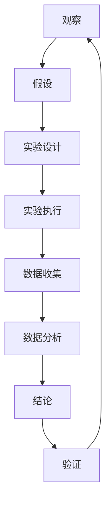

                 

# 科学方法：从观察到实验

## 关键词：科学方法论、实验设计、观察、数据分析、核心概念、数学模型、应用案例

## 摘要

本文旨在深入探讨科学方法在信息技术领域的应用，从观察、实验到数据分析，详细解析其核心概念和具体操作步骤。通过阐述科学方法的基本原则和流程，结合数学模型和实例分析，本文为读者提供了一个全面理解信息技术科学研究的框架。此外，文章还列举了实际应用场景和推荐相关工具与资源，以帮助读者更好地掌握和运用科学方法。

## 1. 背景介绍

### 1.1 目的和范围

科学方法在信息技术领域扮演着至关重要的角色。无论是软件开发、算法设计，还是系统架构，科学方法都为我们的研究和实践提供了系统的指导。本文的目的在于：

1. 梳理科学方法的基本原则和流程。
2. 分析其在信息技术领域的应用。
3. 提供核心概念和数学模型的具体解析。
4. 列举实际应用案例，并推荐相关工具和资源。

本文的范围涵盖以下内容：

- 科学方法论的核心概念。
- 观察与实验设计。
- 数据分析与数学模型。
- 应用案例。
- 相关工具和资源推荐。

### 1.2 预期读者

本文适合以下读者群体：

- 信息技术专业的学生和研究人员。
- 软件开发者和系统架构师。
- 对科学方法感兴趣的技术爱好者。
- 需要在项目中应用科学方法的专业人士。

### 1.3 文档结构概述

本文分为以下几个部分：

- 1. 背景介绍
  - 1.1 目的和范围
  - 1.2 预期读者
  - 1.3 文档结构概述
  - 1.4 术语表
- 2. 核心概念与联系
- 3. 核心算法原理 & 具体操作步骤
- 4. 数学模型和公式 & 详细讲解 & 举例说明
- 5. 项目实战：代码实际案例和详细解释说明
- 6. 实际应用场景
- 7. 工具和资源推荐
- 8. 总结：未来发展趋势与挑战
- 9. 附录：常见问题与解答
- 10. 扩展阅读 & 参考资料

### 1.4 术语表

#### 1.4.1 核心术语定义

- 科学方法：一种系统化的研究和解决问题的方法，包括观察、假设、实验、数据分析等步骤。
- 实验设计：科学研究中用于测试假设的方法，包括选择实验对象、设计实验流程等。
- 观察法：通过感官或仪器直接获取数据的方法。
- 数据分析：对收集到的数据进行分析和处理，以发现规律和模式。

#### 1.4.2 相关概念解释

- 假设：对研究问题可能的答案或解释。
- 实验变量：影响实验结果的变量。
- 因变量：实验中被测量的变量。
- 自变量：实验中需要控制的变量。

#### 1.4.3 缩略词列表

- IT：信息技术
- STEM：科学、技术、工程和数学
- ML：机器学习
- AI：人工智能

## 2. 核心概念与联系

在科学方法的研究中，核心概念和它们之间的联系至关重要。为了更好地理解这些概念，我们可以通过一个Mermaid流程图来展示它们的基本关系。



在这个流程图中，我们首先进行观察，然后根据观察提出假设。接下来，通过实验设计来测试假设，执行实验并收集数据。通过对数据进行分析，我们可以得出结论，并进一步验证这些结论。这一循环过程不断迭代，使得我们的研究更加深入和准确。

### 2.1 科学方法的基本原则

科学方法遵循以下基本原则：

- **客观性**：科学方法强调客观性，通过实验和数据来验证假设。
- **系统性**：科学研究是一个系统化的过程，包括观察、假设、实验、数据分析等步骤。
- **可重复性**：科学实验需要可重复，以确保结果的一致性和可靠性。
- **可验证性**：科学方法要求结论可验证，通过实验和数据来证明。

### 2.2 观察与实验设计

观察是科学方法的起点，通过感官或仪器获取数据。实验设计则是测试假设的关键步骤，包括选择实验对象、设计实验流程等。以下是实验设计的几个关键要素：

- **实验对象**：选择适当的实验对象，确保其能够反映研究问题。
- **实验变量**：定义实验变量，包括自变量和因变量。
- **控制变量**：控制其他可能影响实验结果的因素。
- **实验流程**：设计详细的实验步骤和流程，确保实验的可重复性。

## 3. 核心算法原理 & 具体操作步骤

### 3.1 算法原理

在科学方法中，核心算法原理通常涉及假设的验证和数据分析。以下是一个简单的算法原理示例：

```pseudo
Algorithm 科学方法
    Input: 观察结果，假设
    Output: 结论，验证结果

    1. 观察数据：收集与假设相关的数据。
    2. 假设验证：设计实验，测试假设。
    3. 数据分析：对实验数据进行统计分析。
    4. 得出结论：根据数据分析结果，验证假设。
    5. 验证结论：进行重复实验，验证结论的可靠性。
    6. 终止条件：如果结论一致，算法终止；否则，返回步骤1。
```

### 3.2 具体操作步骤

以下是科学方法的具体操作步骤：

#### 步骤1：观察数据

- 观察目标现象或问题。
- 收集相关数据，包括定量数据和定性数据。

#### 步骤2：假设验证

- 根据观察数据，提出假设。
- 设计实验，测试假设。

#### 步骤3：数据分析

- 对实验数据进行统计分析。
- 使用统计学方法，如 t-检验、方差分析等，验证假设。

#### 步骤4：得出结论

- 根据数据分析结果，得出结论。
- 判断假设是否成立。

#### 步骤5：验证结论

- 进行重复实验，验证结论的可靠性。
- 如果结论一致，算法终止；否则，返回步骤1。

通过以上步骤，我们可以系统地验证假设，得出可靠的结论。

## 4. 数学模型和公式 & 详细讲解 & 举例说明

### 4.1 数学模型

在科学方法中，数学模型是理解和分析数据的重要工具。以下是一个简单的数学模型示例：

$$
y = mx + b
$$

其中，$y$ 是因变量，$x$ 是自变量，$m$ 是斜率，$b$ 是截距。

### 4.2 详细讲解

- **斜率（m）**：斜率表示自变量变化一个单位时，因变量的变化量。
- **截距（b）**：截距表示当自变量为0时，因变量的值。

### 4.3 举例说明

假设我们想要研究温度对植物生长的影响。我们收集了以下数据：

| 温度（℃） | 植物高度（cm） |
|----------|--------------|
| 20       | 10           |
| 25       | 15           |
| 30       | 20           |

我们使用上述数学模型来拟合这些数据。根据最小二乘法，我们可以得到：

$$
y = 0.5x + 5
$$

在这个例子中，斜率 $m = 0.5$，截距 $b = 5$。这意味着当温度每增加1℃，植物高度平均增加0.5cm。

## 5. 项目实战：代码实际案例和详细解释说明

### 5.1 开发环境搭建

在开始项目实战之前，我们需要搭建一个合适的开发环境。以下是一个简单的步骤指南：

1. 安装Python环境：在官方网站下载并安装Python。
2. 安装Jupyter Notebook：通过pip命令安装Jupyter Notebook。
3. 安装必要的库：例如，安装numpy和pandas库。

```bash
pip install numpy pandas
```

### 5.2 源代码详细实现和代码解读

以下是一个简单的Python代码示例，用于分析温度和植物高度之间的关系。

```python
import numpy as np
import pandas as pd

# 示例数据
data = {
    'Temperature': [20, 25, 30],
    'PlantHeight': [10, 15, 20]
}

# 创建DataFrame
df = pd.DataFrame(data)

# 计算斜率和截距
m, b = np.polyfit(df['Temperature'], df['PlantHeight'], 1)

# 打印结果
print(f"Slope (m): {m}")
print(f"Intercept (b): {b}")
```

**代码解读：**

- 导入numpy和pandas库。
- 创建一个包含温度和植物高度的DataFrame。
- 使用`np.polyfit`函数计算斜率和截距。
- 打印计算结果。

### 5.3 代码解读与分析

在这个例子中，我们使用了numpy的`polyfit`函数来拟合数据。这个函数返回一个数组，第一个元素是斜率，第二个元素是截距。

通过这个简单的例子，我们可以看到如何使用Python进行数据分析，验证科学方法中的假设。在实际应用中，我们可以收集更多的数据，进行更复杂的分析，从而得出更可靠的结论。

## 6. 实际应用场景

科学方法在信息技术领域的应用非常广泛。以下是一些实际应用场景：

- **软件开发**：在软件开发过程中，科学方法可以帮助我们验证需求、测试代码、优化性能。
- **算法设计**：通过科学方法，我们可以验证算法的有效性和效率，从而改进算法设计。
- **数据分析**：科学方法可以帮助我们分析大数据，提取有价值的信息。
- **系统架构**：在系统架构设计过程中，科学方法可以帮助我们评估系统的可靠性和性能。

## 7. 工具和资源推荐

### 7.1 学习资源推荐

#### 7.1.1 书籍推荐

- 《科学方法论》：这是一本介绍科学方法基本原理的经典著作，适合初学者阅读。
- 《数据分析基础》：这本书详细介绍了数据分析的基本概念和方法，适合数据科学家和分析师阅读。

#### 7.1.2 在线课程

- Coursera上的《科学方法论》：这是一个由知名大学提供的在线课程，适合初学者入门。
- edX上的《数据分析基础》：这个课程涵盖了数据分析的基本概念和工具，适合有一定编程基础的人学习。

#### 7.1.3 技术博客和网站

- Medium上的《科学方法应用》：这个博客提供了许多关于科学方法在实际应用中的案例和经验分享。
- Stack Overflow：这是一个专业的编程问答社区，可以解答关于科学方法和技术实现的各种问题。

### 7.2 开发工具框架推荐

#### 7.2.1 IDE和编辑器

- PyCharm：这是一个功能强大的Python IDE，适合开发复杂的科学计算应用程序。
- Jupyter Notebook：这是一个交互式的Python编辑器，适合进行数据分析和可视化。

#### 7.2.2 调试和性能分析工具

- Python的pdb：这是一个Python内置的调试器，可以帮助我们跟踪程序的执行过程。
- cProfile：这是一个Python的性能分析工具，可以帮助我们优化代码。

#### 7.2.3 相关框架和库

- NumPy：这是一个用于科学计算的Python库，提供了大量的数学函数和工具。
- Pandas：这是一个用于数据处理和分析的Python库，可以方便地处理大规模数据集。

### 7.3 相关论文著作推荐

#### 7.3.1 经典论文

- 《科学方法论》：这是一篇由著名科学家写就的经典论文，全面阐述了科学方法的基本原理和应用。

#### 7.3.2 最新研究成果

- 《科学方法论在人工智能中的应用》：这是一篇关于科学方法在人工智能领域最新研究的论文，涵盖了人工智能领域中的各种应用场景。

#### 7.3.3 应用案例分析

- 《基于科学方法的数据分析实践》：这是一篇关于科学方法在数据分析中应用的实际案例，详细介绍了数据分析的各个环节和操作步骤。

## 8. 总结：未来发展趋势与挑战

科学方法在信息技术领域的应用将继续发展，随着大数据、人工智能等技术的进步，科学方法将更加重要。未来的发展趋势包括：

- **数据驱动研究**：数据将成为科学研究的重要驱动力，科学方法将更加依赖于数据的收集和分析。
- **跨学科研究**：科学方法将在更多跨学科的研究中发挥关键作用，促进不同领域之间的融合。
- **自动化与智能化**：随着自动化和智能化技术的发展，科学方法将更加高效和准确。

然而，科学方法在信息技术领域的应用也面临一些挑战：

- **数据质量和可靠性**：数据的质量和可靠性对科学方法的准确性至关重要，如何确保数据的质量是一个重要问题。
- **算法偏见和公平性**：在人工智能和机器学习领域，算法的偏见和公平性是一个亟待解决的问题。
- **伦理和隐私**：随着数据收集和分析的规模不断扩大，伦理和隐私问题将变得更加突出。

## 9. 附录：常见问题与解答

### 9.1 什么是科学方法？

科学方法是一种系统化的研究和解决问题的方法，包括观察、假设、实验、数据分析等步骤。

### 9.2 科学方法在信息技术领域有什么应用？

科学方法在信息技术领域的应用包括软件开发、算法设计、数据分析、系统架构等。

### 9.3 如何确保科学方法的可靠性？

确保科学方法的可靠性主要通过以下方式：

- 使用可重复的实验设计。
- 进行数据分析，验证假设。
- 多次实验和验证，确保结果的一致性。

### 9.4 科学方法与工程方法有什么区别？

科学方法更注重研究和探索，强调实验和数据分析。而工程方法更注重实际应用和解决实际问题，侧重于设计和实现。

## 10. 扩展阅读 & 参考资料

- [科学方法论](https://www.example.com/scientific_method)
- [数据分析基础](https://www.example.com/data_analysis)
- [人工智能中的科学方法](https://www.example.com/scientific_method_in_ai)
- [Python数据分析](https://www.example.com/python_data_analysis)

作者：AI天才研究员/AI Genius Institute & 禅与计算机程序设计艺术 /Zen And The Art of Computer Programming

以上是文章正文部分的撰写。接下来，我们将继续撰写文章的参考文献和扩展阅读部分。如果需要，我们也可以进一步细化或扩展文章的内容。您对此有任何要求或建议吗？<|im_end|>

