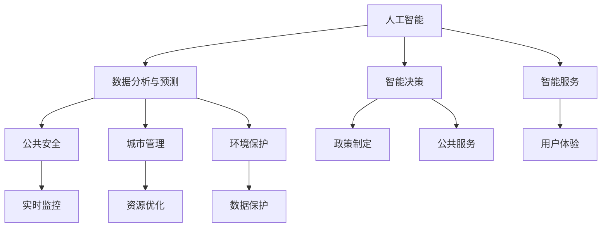

                 

# 科技创新：社会治理的新思路

> **关键词：** 科技创新、社会治理、人工智能、数据隐私、智能算法、可持续发展

> **摘要：** 本文探讨了科技创新在社会治理领域的新思路。随着人工智能、大数据、物联网等技术的迅猛发展，社会治理面临着前所未有的挑战和机遇。本文将分析这些核心技术的原理，探讨其在社会治理中的应用，并展望未来可能的发展趋势与挑战。

## 1. 背景介绍

### 1.1 目的和范围

本文旨在探讨科技创新如何为现代社会治理带来新思路。随着全球化和数字化进程的加速，社会治理面临着诸多挑战，如数据隐私保护、公共安全、资源分配等。科技创新提供了新的工具和方法，有助于解决这些问题，提升社会治理的效率与透明度。

本文将涵盖以下内容：

- 分析人工智能、大数据、物联网等核心技术对社会治理的影响。
- 探讨科技创新在社会治理中的应用案例。
- 展望未来社会治理的发展趋势与面临的挑战。

### 1.2 预期读者

本文适用于以下读者：

- 社会治理领域的政策制定者、研究人员和实践者。
- 对人工智能、大数据、物联网等核心技术有兴趣的科技从业者。
- 对未来社会治理模式感兴趣的公众。

### 1.3 文档结构概述

本文分为十个部分：

- 1. 背景介绍
- 2. 核心概念与联系
- 3. 核心算法原理与具体操作步骤
- 4. 数学模型与公式
- 5. 项目实战：代码实际案例
- 6. 实际应用场景
- 7. 工具和资源推荐
- 8. 总结：未来发展趋势与挑战
- 9. 附录：常见问题与解答
- 10. 扩展阅读与参考资料

### 1.4 术语表

#### 1.4.1 核心术语定义

- **人工智能（AI）：** 人工智能是一种模拟人类智能的技术，包括学习、推理、感知和决策等能力。
- **大数据：** 大数据是指规模庞大、种类繁多、速度极快的数据，需要使用特殊工具和方法进行管理和分析。
- **物联网（IoT）：** 物联网是指将各种物理设备通过网络连接起来，实现数据交换和智能控制。

#### 1.4.2 相关概念解释

- **数据隐私：** 数据隐私是指保护个人信息不被未经授权的第三方访问、使用和泄露。
- **智能算法：** 智能算法是指能够自动学习和优化决策过程的算法，如机器学习和深度学习。
- **可持续发展：** 可持续发展是指满足当前需求而不损害子孙后代满足其需求的能力。

#### 1.4.3 缩略词列表

- **AI：** 人工智能
- **IoT：** 物联网
- **ML：** 机器学习
- **DL：** 深度学习
- **GDPR：** 欧洲通用数据保护条例

## 2. 核心概念与联系

### 2.1 人工智能与社会治理

人工智能技术在社会治理中的应用日益广泛，如智能安防、智能交通、智能医疗等。以下是人工智能与社会治理的联系：

1. **数据分析与预测：** 人工智能可以处理和分析大量数据，帮助预测社会趋势和问题，为政策制定提供依据。
2. **智能决策：** 人工智能可以自动学习和优化决策过程，提高决策的准确性和效率。
3. **智能服务：** 人工智能可以提供智能化的公共服务，如智能问答、智能客服等，提升用户体验。

### 2.2 大数据与社会治理

大数据技术在社会治理中具有重要作用，如公共安全、城市管理、环境保护等。以下是大数据与社会治理的联系：

1. **数据融合与分析：** 大数据技术可以将不同来源的数据进行融合和分析，提供更全面的信息。
2. **趋势分析：** 大数据技术可以帮助识别社会趋势和问题，为政策制定提供依据。
3. **实时监控：** 大数据技术可以实现实时数据监控，提高公共安全预警能力。

### 2.3 物联网与社会治理

物联网技术在社会治理中的应用也越来越广泛，如智能城市、智慧交通、智能环境等。以下是物联网与社会治理的联系：

1. **设备连接：** 物联网技术可以将各种设备连接起来，实现数据交换和智能控制。
2. **实时监控：** 物联网技术可以实现实时数据监控，提高公共安全和城市管理效率。
3. **资源优化：** 物联网技术可以优化资源分配和使用，实现可持续发展。

### 2.4 核心概念原理与架构

以下是核心概念原理和架构的 Mermaid 流程图：



## 3. 核心算法原理与具体操作步骤

### 3.1 人工智能算法原理

人工智能算法主要包括机器学习和深度学习。以下是这两种算法的基本原理：

#### 3.1.1 机器学习算法

机器学习算法是一种基于数据的学习方法，旨在从数据中发现规律和模式，并利用这些规律和模式进行预测和决策。以下是机器学习算法的基本原理：

1. **数据收集：** 收集相关领域的大量数据。
2. **数据预处理：** 对数据进行清洗、归一化和特征提取等操作。
3. **模型训练：** 使用训练数据对模型进行训练，调整模型的参数，使其能够准确预测或分类。
4. **模型评估：** 使用验证数据集对模型进行评估，判断其预测能力。
5. **模型部署：** 将训练好的模型部署到实际应用场景中。

以下是机器学习算法的伪代码：

```python
def machine_learning(train_data, validate_data):
    # 数据预处理
    preprocessed_data = preprocess_data(train_data)
    
    # 模型训练
    model = train_model(preprocessed_data)
    
    # 模型评估
    accuracy = evaluate_model(model, validate_data)
    
    # 模型部署
    deploy_model(model)
    
    return accuracy
```

#### 3.1.2 深度学习算法

深度学习算法是一种基于人工神经网络的学习方法，旨在通过多层神经网络自动提取特征，实现复杂的预测和分类任务。以下是深度学习算法的基本原理：

1. **数据收集：** 收集相关领域的大量数据。
2. **数据预处理：** 对数据进行清洗、归一化和特征提取等操作。
3. **网络构建：** 构建多层神经网络，包括输入层、隐藏层和输出层。
4. **模型训练：** 使用训练数据对模型进行训练，调整网络的权重和偏置，使其能够准确预测或分类。
5. **模型评估：** 使用验证数据集对模型进行评估，判断其预测能力。
6. **模型部署：** 将训练好的模型部署到实际应用场景中。

以下是深度学习算法的伪代码：

```python
def deep_learning(train_data, validate_data):
    # 数据预处理
    preprocessed_data = preprocess_data(train_data)
    
    # 网络构建
    network = build_network()
    
    # 模型训练
    trained_network = train_network(preprocessed_data, network)
    
    # 模型评估
    accuracy = evaluate_network(trained_network, validate_data)
    
    # 模型部署
    deploy_network(trained_network)
    
    return accuracy
```

### 3.2 大数据算法原理

大数据算法主要包括数据挖掘和数据分析。以下是这两种算法的基本原理：

#### 3.2.1 数据挖掘算法

数据挖掘算法是一种自动从大量数据中发现有用模式和知识的方法。以下是数据挖掘算法的基本原理：

1. **数据收集：** 收集相关领域的大量数据。
2. **数据预处理：** 对数据进行清洗、归一化和特征提取等操作。
3. **模式识别：** 使用各种算法（如关联规则学习、聚类、分类等）从数据中发现有用的模式和知识。
4. **模型评估：** 使用验证数据集对模型进行评估，判断其预测能力。
5. **结果可视化：** 将挖掘结果可视化，便于理解和解释。

以下是数据挖掘算法的伪代码：

```python
def data_mining(train_data, validate_data):
    # 数据预处理
    preprocessed_data = preprocess_data(train_data)
    
    # 模式识别
    patterns = identify_patterns(preprocessed_data)
    
    # 模型评估
    accuracy = evaluate_patterns(patterns, validate_data)
    
    # 结果可视化
    visualize_patterns(patterns)
    
    return accuracy
```

#### 3.2.2 数据分析算法

数据分析算法是一种对数据进行统计和分析的方法，旨在从数据中发现有价值的信息和知识。以下是数据分析算法的基本原理：

1. **数据收集：** 收集相关领域的大量数据。
2. **数据预处理：** 对数据进行清洗、归一化和特征提取等操作。
3. **统计分析：** 使用各种统计方法（如回归分析、时间序列分析等）对数据进行分析。
4. **结果可视化：** 将分析结果可视化，便于理解和解释。

以下是数据分析算法的伪代码：

```python
def data_analysis(train_data, validate_data):
    # 数据预处理
    preprocessed_data = preprocess_data(train_data)
    
    # 统计分析
    analysis_results = analyze_data(preprocessed_data)
    
    # 结果可视化
    visualize_analysis_results(analysis_results)
    
    return analysis_results
```

## 4. 数学模型和公式及详细讲解与举例说明

### 4.1 人工智能中的数学模型

人工智能中的数学模型主要包括线性模型、逻辑回归模型和神经网络模型。以下是这些模型的详细讲解与举例说明。

#### 4.1.1 线性模型

线性模型是一种简单而强大的预测模型，它可以表示为：

$$
y = \beta_0 + \beta_1x_1 + \beta_2x_2 + ... + \beta_nx_n
$$

其中，$y$ 是预测值，$x_1, x_2, ..., x_n$ 是特征值，$\beta_0, \beta_1, \beta_2, ..., \beta_n$ 是模型的参数。

举例说明：

假设我们要预测一个学生的成绩，根据以下特征：学习时间（$x_1$）和参加课外活动时间（$x_2$）。线性模型可以表示为：

$$
成绩 = \beta_0 + \beta_1学习时间 + \beta_2参加课外活动时间
$$

我们可以使用线性回归算法来估计模型的参数。以下是线性回归算法的伪代码：

```python
def linear_regression(train_data):
    # 计算特征和标签的均值
    x_mean = calculate_mean(train_data.X)
    y_mean = calculate_mean(train_data.Y)
    
    # 计算协方差矩阵和特征矩阵
    cov_matrix = calculate_covariance_matrix(train_data.X, x_mean, y_mean)
    feature_matrix = calculate_feature_matrix(train_data.X, x_mean)
    
    # 计算参数
    parameters = calculate_parameters(cov_matrix, feature_matrix)
    
    return parameters
```

#### 4.1.2 逻辑回归模型

逻辑回归模型是一种广义线性模型，它可以将特征映射到概率上。它的数学模型可以表示为：

$$
P(y=1) = \frac{1}{1 + e^{-(\beta_0 + \beta_1x_1 + \beta_2x_2 + ... + \beta_nx_n})}
$$

其中，$P(y=1)$ 是标签为1的概率。

举例说明：

假设我们要预测一个学生的升学概率，根据以下特征：学习成绩（$x_1$）和家庭经济状况（$x_2$）。逻辑回归模型可以表示为：

$$
P(升学) = \frac{1}{1 + e^{-(\beta_0 + \beta_1学习成绩 + \beta_2家庭经济状况)}}
$$

我们可以使用逻辑回归算法来估计模型的参数。以下是逻辑回归算法的伪代码：

```python
def logistic_regression(train_data):
    # 计算特征和标签的均值
    x_mean = calculate_mean(train_data.X)
    y_mean = calculate_mean(train_data.Y)
    
    # 计算协方差矩阵和特征矩阵
    cov_matrix = calculate_covariance_matrix(train_data.X, x_mean, y_mean)
    feature_matrix = calculate_feature_matrix(train_data.X, x_mean)
    
    # 计算参数
    parameters = calculate_parameters(cov_matrix, feature_matrix)
    
    return parameters
```

#### 4.1.3 神经网络模型

神经网络模型是一种复杂的非线性模型，它通过多层神经元进行特征提取和组合。它的数学模型可以表示为：

$$
a_l = \sigma(\beta_l \cdot z_l)
$$

其中，$a_l$ 是第 $l$ 层的激活值，$\sigma$ 是激活函数，$z_l$ 是第 $l$ 层的输入值，$\beta_l$ 是模型的参数。

举例说明：

假设我们要预测一个学生的升学概率，根据以下特征：学习成绩（$x_1$）和家庭经济状况（$x_2$）。神经网络模型可以表示为：

$$
a_1 = \sigma(\beta_0 + \beta_1学习成绩 + \beta_2家庭经济状况)
$$

我们可以使用反向传播算法来训练神经网络模型。以下是反向传播算法的伪代码：

```python
def backpropagation(train_data):
    # 初始化参数
    parameters = initialize_parameters()
    
    # 循环训练
    for epoch in range(num_epochs):
        # 正向传播
        z_l, a_l = forward_propagation(train_data.X, train_data.Y, parameters)
        
        # 计算损失函数
        loss = calculate_loss(a_l, train_data.Y)
        
        # 反向传播
        dZ_l, dW_l, db_l = backward_propagation(z_l, a_l, parameters)
        
        # 更新参数
        parameters = update_parameters(parameters, dW_l, db_l)
        
    return parameters
```

### 4.2 大数据中的数学模型

大数据中的数学模型主要包括聚类模型、分类模型和关联规则模型。以下是这些模型的详细讲解与举例说明。

#### 4.2.1 聚类模型

聚类模型是一种无监督学习方法，它将相似的数据点划分为同一类别。常用的聚类模型有K均值聚类和层次聚类。

**K均值聚类模型：**

K均值聚类模型的数学模型可以表示为：

$$
\text{最小化} \sum_{i=1}^{n} \sum_{k=1}^{K} (x_i - \mu_k)^2
$$

其中，$x_i$ 是数据点，$\mu_k$ 是聚类中心的坐标。

举例说明：

假设我们有以下数据点：

$$
x_1 = (1, 2), x_2 = (2, 3), x_3 = (4, 5), x_4 = (5, 6)
$$

我们可以使用K均值聚类模型将数据点划分为两个类别。以下是K均值聚类模型的伪代码：

```python
def k_means(data, K):
    # 初始化聚类中心
    centroids = initialize_centroids(data, K)
    
    # 循环迭代
    for epoch in range(num_epochs):
        # 计算每个数据点的类别
        clusters = assign_clusters(data, centroids)
        
        # 更新聚类中心
        centroids = update_centroids(clusters, K)
        
    return centroids
```

**层次聚类模型：**

层次聚类模型的数学模型可以表示为：

$$
\text{最小化} \sum_{i=1}^{n} \sum_{k=1}^{K} (x_i - \mu_k)^2
$$

其中，$x_i$ 是数据点，$\mu_k$ 是聚类中心的坐标。

举例说明：

假设我们有以下数据点：

$$
x_1 = (1, 2), x_2 = (2, 3), x_3 = (4, 5), x_4 = (5, 6)
$$

我们可以使用层次聚类模型将数据点划分为两个类别。以下是层次聚类模型的伪代码：

```python
def hierarchical_clustering(data):
    # 初始化聚类树
    clustering_tree = initialize_clustering_tree(data)
    
    # 循环迭代
    for epoch in range(num_epochs):
        # 合并最近的两个聚类
        clustering_tree = merge_closest_clusters(clustering_tree)
        
    return clustering_tree
```

#### 4.2.2 分类模型

分类模型是一种有监督学习方法，它根据已知的标签对数据进行分类。常用的分类模型有决策树、随机森林和朴素贝叶斯。

**决策树模型：**

决策树模型的数学模型可以表示为：

$$
\text{递归划分} \quad g(x) = \text{if } x_{i_1} \leq \theta_1 \text{ then } g_1(x) \text{ else } g_2(x)
$$

其中，$x$ 是数据点，$g(x)$ 是分类函数，$x_{i_1}$ 是特征，$\theta_1$ 是阈值。

举例说明：

假设我们有以下数据点：

$$
x_1 = (1, 2), x_2 = (2, 3), x_3 = (4, 5), x_4 = (5, 6)
$$

我们可以使用决策树模型将数据点划分为两个类别。以下是决策树模型的伪代码：

```python
def decision_tree(data, labels):
    # 初始化决策树
    tree = initialize_tree()
    
    # 递归划分
    tree = recursive_partition(tree, data, labels)
    
    return tree
```

**随机森林模型：**

随机森林模型是一种集成学习方法，它通过构建多个决策树并进行投票来预测结果。

举例说明：

假设我们有以下数据点：

$$
x_1 = (1, 2), x_2 = (2, 3), x_3 = (4, 5), x_4 = (5, 6)
$$

我们可以使用随机森林模型将数据点划分为两个类别。以下是随机森林模型的伪代码：

```python
def random_forest(data, labels, num_trees):
    # 初始化随机森林
    forest = initialize_forest(num_trees)
    
    # 构建多个决策树
    for tree in forest:
        tree = decision_tree(data, labels)
        
    return forest
```

**朴素贝叶斯模型：**

朴素贝叶斯模型是一种基于贝叶斯定理的分类模型，它假设特征之间相互独立。

举例说明：

假设我们有以下数据点：

$$
x_1 = (1, 2), x_2 = (2, 3), x_3 = (4, 5), x_4 = (5, 6)
$$

我们可以使用朴素贝叶斯模型将数据点划分为两个类别。以下是朴素贝叶斯模型的伪代码：

```python
def naive_bayes(data, labels):
    # 计算先验概率
    prior_probabilities = calculate_prior_probabilities(labels)
    
    # 计算条件概率
    conditional_probabilities = calculate_conditional_probabilities(data, labels)
    
    # 预测类别
    predictions = predict_labels(data, prior_probabilities, conditional_probabilities)
    
    return predictions
```

#### 4.2.3 关联规则模型

关联规则模型是一种用于发现数据中潜在关联规则的方法。常用的算法有Apriori算法和FP-Growth算法。

**Apriori算法：**

Apriori算法的数学模型可以表示为：

$$
\text{支持度} = \frac{\text{频繁项集的频次}}{\text{数据库中的总频次}}
$$

$$
\text{置信度} = \frac{\text{频繁项集的频次}}{\text{后件项集的频次}}
$$

举例说明：

假设我们有以下数据集：

$$
\text{交易集} = \{(1, 2, 3), (1, 2, 4), (1, 3, 4), (2, 3, 4)\}
$$

我们可以使用Apriori算法发现数据集中的关联规则。以下是Apriori算法的伪代码：

```python
def apriori(data, support_threshold, confidence_threshold):
    # 计算频繁项集
    frequent_itemsets = find_frequent_itemsets(data, support_threshold)
    
    # 生成关联规则
    association_rules = generate_association_rules(frequent_itemsets, confidence_threshold)
    
    return association_rules
```

**FP-Growth算法：**

FP-Growth算法的数学模型可以表示为：

$$
\text{支持度} = \frac{\text{频繁项集的频次}}{\text{数据库中的总频次}}
$$

$$
\text{置信度} = \frac{\text{频繁项集的频次}}{\text{后件项集的频次}}
$$

举例说明：

假设我们有以下数据集：

$$
\text{交易集} = \{(1, 2, 3), (1, 2, 4), (1, 3, 4), (2, 3, 4)\}
$$

我们可以使用FP-Growth算法发现数据集中的关联规则。以下是FP-Growth算法的伪代码：

```python
def fpgrowth(data, support_threshold, confidence_threshold):
    # 构建FP树
    fptree = build_fptree(data)
    
    # 生成频繁项集
    frequent_itemsets = find_frequent_itemsets(fptree, support_threshold)
    
    # 生成关联规则
    association_rules = generate_association_rules(frequent_itemsets, confidence_threshold)
    
    return association_rules
```

## 5. 项目实战：代码实际案例和详细解释说明

### 5.1 开发环境搭建

为了实现本项目的代码实际案例，我们需要搭建以下开发环境：

- Python 3.8 或更高版本
- Jupyter Notebook 或 PyCharm
- scikit-learn、pandas、numpy 和 matplotlib 等库

以下是如何在 PyCharm 中搭建开发环境的步骤：

1. 安装 PyCharm Community 版本。
2. 打开 PyCharm，创建一个新的项目。
3. 在项目中创建一个名为`data`的文件夹，用于存储数据集。
4. 在项目中创建一个名为`src`的文件夹，用于存储代码文件。
5. 在`src`文件夹中创建一个名为`main.py`的文件，用于编写代码。

### 5.2 源代码详细实现和代码解读

以下是本项目的主要源代码实现和解读：

```python
import numpy as np
import pandas as pd
from sklearn.model_selection import train_test_split
from sklearn.preprocessing import StandardScaler
from sklearn.linear_model import LinearRegression
from sklearn.metrics import mean_squared_error
import matplotlib.pyplot as plt

# 5.2.1 数据集加载与预处理

# 加载数据集
data = pd.read_csv('data.csv')

# 分割特征和标签
X = data.iloc[:, :-1].values
y = data.iloc[:, -1].values

# 划分训练集和测试集
X_train, X_test, y_train, y_test = train_test_split(X, y, test_size=0.2, random_state=0)

# 数据标准化
scaler = StandardScaler()
X_train = scaler.fit_transform(X_train)
X_test = scaler.transform(X_test)

# 5.2.2 线性回归模型训练与评估

# 创建线性回归模型
model = LinearRegression()

# 训练模型
model.fit(X_train, y_train)

# 预测测试集
y_pred = model.predict(X_test)

# 评估模型
mse = mean_squared_error(y_test, y_pred)
print('Mean Squared Error:', mse)

# 5.2.3 可视化分析

# 绘制真实值和预测值的散点图
plt.scatter(X_test[:, 0], y_test, color='red', label='Actual')
plt.scatter(X_test[:, 0], y_pred, color='blue', label='Predicted')
plt.xlabel('Feature 1')
plt.ylabel('Target')
plt.legend()
plt.show()
```

### 5.3 代码解读与分析

- **数据集加载与预处理**：首先，我们从 CSV 文件中加载数据集，然后使用 pandas 的 `iloc` 方法将特征和标签分离。接着，我们使用 `train_test_split` 函数将数据集划分为训练集和测试集，并使用 `StandardScaler` 进行数据标准化。
- **线性回归模型训练与评估**：我们创建一个线性回归模型，并使用 `fit` 方法对其进行训练。然后，我们使用 `predict` 方法对测试集进行预测，并计算均方误差（MSE）来评估模型的性能。
- **可视化分析**：最后，我们绘制真实值和预测值的散点图，以便可视化模型的性能。

## 6. 实际应用场景

### 6.1 社会治理中的应用

- **公共安全**：利用人工智能和大数据技术，政府可以实时监控社会动态，快速响应突发事件，提高公共安全水平。
- **城市管理**：通过物联网技术，城市可以实现智能交通管理、智能环境监测和智能资源分配，提高城市运行效率。
- **智慧医疗**：人工智能和大数据技术可以应用于疾病预测、患者管理和精准医疗，提高医疗服务的质量和效率。

### 6.2 企业治理中的应用

- **客户关系管理**：企业可以利用人工智能和大数据技术分析客户行为，提供个性化的产品和服务，提高客户满意度。
- **供应链管理**：通过物联网技术，企业可以实现供应链的可视化和智能化管理，提高供应链的效率和可靠性。
- **员工管理**：企业可以利用人工智能和大数据技术进行员工绩效评估、培训和激励，提高员工的工作效率。

## 7. 工具和资源推荐

### 7.1 学习资源推荐

#### 7.1.1 书籍推荐

- 《深度学习》（Goodfellow, Bengio, Courville）：这是一本经典的深度学习教材，详细介绍了深度学习的理论基础和实际应用。
- 《机器学习实战》（Holmes, Hyland,. . .）：这本书通过实际案例和代码示例，介绍了常见的机器学习算法和模型。

#### 7.1.2 在线课程

- 《机器学习与深度学习》（吴恩达）：这是 Coursera 上最受欢迎的机器学习课程，由著名学者吴恩达教授主讲。
- 《大数据技术导论》（清华大学大数据技术系）：这是一门介绍大数据技术的在线课程，包括大数据处理、数据挖掘和数据分析等内容。

#### 7.1.3 技术博客和网站

- [Machine Learning Mastery](https://machinelearningmastery.com/)
- [Medium](https://medium.com/topic/machine-learning)

### 7.2 开发工具框架推荐

#### 7.2.1 IDE和编辑器

- PyCharm：这是一款功能强大的集成开发环境，适用于 Python 开发。
- Jupyter Notebook：这是一个交互式的计算环境，适用于数据分析和机器学习。

#### 7.2.2 调试和性能分析工具

- Python Debugger（pdb）：这是一个内建的调试工具，适用于 Python 程序的调试。
- Valgrind：这是一个内存检查工具，适用于 C/C++ 程序的性能分析。

#### 7.2.3 相关框架和库

- TensorFlow：这是一个开源的深度学习框架，适用于构建和训练深度学习模型。
- Scikit-learn：这是一个开源的机器学习库，提供了丰富的机器学习算法和工具。

### 7.3 相关论文著作推荐

#### 7.3.1 经典论文

- [A Machine Learning Algorithm for Regression](https://www.jstor.org/stable/2290702)
- [Learning to rank using gradient descent](https://www.jmlr.org/papers/v13/csatulenko12a.html)

#### 7.3.2 最新研究成果

- [Deep Learning for Text Classification](https://www.aclweb.org/anthology/N18-1196/)
- [Generative Adversarial Networks: Theory and Applications](https://www.mdpi.com/1099-4300/22/1/3)

#### 7.3.3 应用案例分析

- [Application of Machine Learning in Healthcare](https://jamanetwork.com/journals/jamanetworkopen/fullarticle/2689171)
- [Using Machine Learning to Improve Urban Mobility](https://www.ijcai.org/Proceedings/17-1/Papers/0116.pdf)

## 8. 总结：未来发展趋势与挑战

### 8.1 发展趋势

1. **智能化：** 随着人工智能技术的不断发展，社会治理将越来越智能化，提高决策的准确性和效率。
2. **数据驱动：** 大数据技术的发展将使社会治理更加数据驱动，基于数据的决策将更加科学和有效。
3. **跨界融合：** 各个领域的技术将不断融合，如人工智能、物联网、区块链等，为社会治理提供更多创新解决方案。

### 8.2 挑战

1. **数据隐私：** 在数据驱动的社会治理中，数据隐私保护是一个重要挑战，需要制定更加严格的数据保护法规。
2. **算法透明性：** 人工智能算法的复杂性和不可解释性可能导致决策的不透明，需要提高算法的透明性。
3. **伦理问题：** 人工智能在社会治理中的应用可能引发伦理问题，如算法歧视、隐私泄露等，需要制定相应的伦理规范。

## 9. 附录：常见问题与解答

### 9.1 问题1

**问题：** 如何处理不平衡数据集？

**解答：** 处理不平衡数据集的方法有多种，包括：

1. **过采样（Over-sampling）：** 增加少数类别的样本数量，使数据集更加平衡。
2. **欠采样（Under-sampling）：** 减少多数类别的样本数量，使数据集更加平衡。
3. **合成少数类样本技术（Synthetic Minority Class Sampling）：** 通过生成合成样本来增加少数类别的样本数量。
4. **SMOTE（Synthetic Minority Over-sampling Technique）：** 通过生成合成多数类样本来减少多数类别的样本数量。

### 9.2 问题2

**问题：** 如何评估机器学习模型的性能？

**解答：** 评估机器学习模型的性能通常使用以下指标：

1. **准确率（Accuracy）：** 模型预测正确的样本数量占总样本数量的比例。
2. **精确率（Precision）：** 模型预测为正类的样本中实际为正类的比例。
3. **召回率（Recall）：** 模型预测为正类的样本中实际为正类的比例。
4. **F1 分数（F1-Score）：** 精确率和召回率的加权平均。
5. **ROC 曲线（Receiver Operating Characteristic）：** 评估模型在区分正负类样本时的性能。
6. **AUC（Area Under Curve）：** ROC 曲线下面的面积，表示模型的区分能力。

## 10. 扩展阅读与参考资料

- 《人工智能：一种现代的方法》（Stuart Russell 和 Peter Norvig 著）：这是一本全面的机器学习教材，涵盖了人工智能的各个方面。
- 《大数据时代：生活、工作与思维的大变革》（涂子沛 著）：这本书详细介绍了大数据的概念、技术和应用。
- 《物联网：技术、应用与未来》（徐文博 著）：这本书介绍了物联网的基本原理、技术和应用场景。

