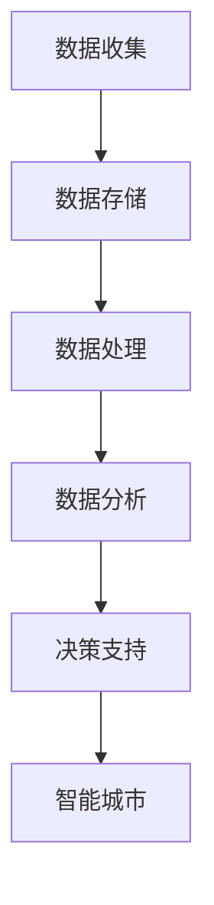
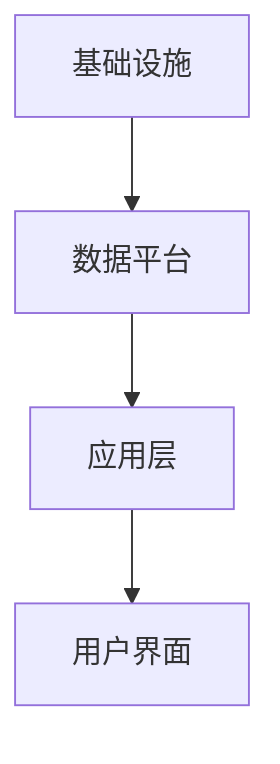

                 

# 科技创新：社会治理的新思路

> 关键词：科技创新，社会治理，数据驱动，人工智能，智能城市，算法伦理

> 摘要：本文将深入探讨科技创新在社会治理领域的重要作用，特别是人工智能技术的应用。通过分析当前科技发展的趋势，阐述数据驱动、智能城市等概念的内涵，并探讨算法伦理等问题。同时，本文将提供实际项目案例，展示科技创新如何具体应用于社会治理，以及未来可能面临的挑战和发展方向。

## 1. 背景介绍

### 1.1 目的和范围

本文旨在探讨科技创新在社会治理中的新思路，特别是通过人工智能技术提升社会治理效率和公平性。随着信息技术的飞速发展，数据驱动和智能算法已经成为社会治理的重要工具。本文将结合实际案例，分析这些技术如何影响和改变传统的社会治理模式。

### 1.2 预期读者

本文适合对科技创新和社会治理感兴趣的读者，包括政府官员、企业管理者、政策研究人员、技术工程师等。通过本文，读者可以了解科技创新在社会治理中的潜在应用，以及未来可能的发展趋势。

### 1.3 文档结构概述

本文分为八个主要部分：

1. **背景介绍**：介绍本文的目的和预期读者，概述文档结构。
2. **核心概念与联系**：讨论核心概念，如数据驱动和智能城市，并提供流程图。
3. **核心算法原理**：详细阐述数据分析和算法原理。
4. **数学模型和公式**：介绍相关数学模型和公式，并提供举例说明。
5. **项目实战**：提供实际项目案例和详细解释。
6. **实际应用场景**：讨论科技创新在社会治理中的应用。
7. **工具和资源推荐**：推荐学习资源和开发工具。
8. **总结和未来发展趋势**：总结本文内容，展望未来发展趋势和挑战。

### 1.4 术语表

#### 1.4.1 核心术语定义

- **数据驱动**：一种以数据为中心的方法，通过分析和利用数据来指导决策。
- **智能城市**：利用信息技术和物联网技术，实现对城市资源的高效管理和优化。
- **算法伦理**：研究算法设计、应用过程中涉及到的伦理问题。

#### 1.4.2 相关概念解释

- **人工智能**：一种模拟人类智能行为的计算机技术。
- **深度学习**：一种基于神经网络的机器学习技术。

#### 1.4.3 缩略词列表

- **AI**：人工智能
- **IoT**：物联网
- **ML**：机器学习

## 2. 核心概念与联系

在现代社会治理中，数据驱动和智能城市是两个关键概念。数据驱动意味着利用海量数据来发现趋势、预测未来和优化决策。智能城市则是利用物联网、大数据和人工智能等技术，实现对城市各个方面的智能化管理和优化。

下面是一个简单的 Mermaid 流程图，展示了数据驱动和智能城市之间的关系：



### 2.1 数据驱动的原理

数据驱动是基于以下核心原理：

1. **数据收集**：通过传感器、物联网设备等手段收集各种类型的数据。
2. **数据存储**：将收集到的数据存储在数据库或其他数据存储解决方案中。
3. **数据处理**：对存储的数据进行清洗、转换和整合，使其适合进一步分析。
4. **数据分析**：使用统计分析和机器学习技术，从数据中提取有价值的信息。
5. **决策支持**：利用分析结果来指导决策，优化管理和服务。

### 2.2 智能城市的架构

智能城市的架构主要包括以下几个方面：

1. **基础设施**：包括物联网设备、传感器网络、数据中心等。
2. **数据平台**：用于存储、处理和管理数据。
3. **应用层**：包括各种智能应用，如交通管理、能源管理、环境监测等。
4. **用户界面**：提供交互式用户体验，如手机应用、Web界面等。

下面是一个简单的 Mermaid 流程图，展示了智能城市的架构：



## 3. 核心算法原理 & 具体操作步骤

在数据驱动和智能城市中，核心算法原理主要包括数据分析和机器学习。下面将使用伪代码详细阐述这些算法的原理和操作步骤。

### 3.1 数据分析算法原理

```python
def data_analysis(data):
    # 数据清洗
    clean_data = clean(data)
    
    # 数据转换
    transformed_data = transform(clean_data)
    
    # 数据整合
    integrated_data = integrate(transformed_data)
    
    # 数据分析
    results = analyze(integrated_data)
    
    return results
```

### 3.2 机器学习算法原理

```python
def machine_learning(data, labels):
    # 数据预处理
    preprocessed_data = preprocess(data, labels)
    
    # 模型训练
    model = train(preprocessed_data)
    
    # 模型评估
    evaluation = evaluate(model, preprocessed_data, labels)
    
    return evaluation
```

### 3.3 数据分析算法操作步骤

1. **数据清洗**：移除重复数据、缺失值填充、异常值处理等。
2. **数据转换**：将数据转换为适合分析的格式，如数值化、标准化等。
3. **数据整合**：将来自不同来源的数据进行整合，形成统一的分析数据集。
4. **数据分析**：使用统计方法、可视化工具等对数据进行深入分析。

### 3.4 机器学习算法操作步骤

1. **数据预处理**：对数据进行归一化、标准化等处理，以减少数据噪声。
2. **模型训练**：选择合适的模型，使用训练数据集进行训练。
3. **模型评估**：使用验证数据集对模型进行评估，调整模型参数。
4. **模型应用**：使用训练好的模型对新的数据进行预测或分类。

## 4. 数学模型和公式 & 详细讲解 & 举例说明

在数据分析和机器学习中，数学模型和公式起着至关重要的作用。以下将使用 LaTeX 格式详细讲解一些常用的数学模型和公式，并提供举例说明。

### 4.1 数据分析中的数学模型

#### 4.1.1 线性回归模型

$$ y = \beta_0 + \beta_1 \cdot x + \epsilon $$

- **解释**：线性回归模型用于预测因变量 \( y \) 与自变量 \( x \) 之间的关系。
- **举例**：假设我们要预测房价，自变量为房屋面积，因变量为房价。通过收集数据并使用线性回归模型，可以建立一个房价预测模型。

### 4.1.2 逻辑回归模型

$$ P(Y=1) = \frac{1}{1 + e^{-(\beta_0 + \beta_1 \cdot x)}} $$

- **解释**：逻辑回归模型用于分类问题，输出概率值来预测样本属于某一类别。
- **举例**：假设我们要预测某病人是否患有某种疾病，自变量为体检指标，因变量为疾病状态。通过收集数据并使用逻辑回归模型，可以建立疾病预测模型。

### 4.2 机器学习中的数学模型

#### 4.2.1 神经网络模型

$$ \sigma(z) = \frac{1}{1 + e^{-z}} $$

- **解释**：神经网络模型是一种基于非线性激活函数的多层神经网络，用于复杂函数的拟合和预测。
- **举例**：假设我们要构建一个手写数字识别模型，输入为手写数字的图像，输出为数字的类别。通过收集数据并使用神经网络模型，可以训练出一个准确的数字识别模型。

#### 4.2.2 支持向量机模型

$$ \max \left\{ \frac{1}{2} w^T w : y_i (w^T x_i - b) \geq 1, \forall i \right\} $$

- **解释**：支持向量机模型是一种用于分类和回归问题的线性模型，通过找到最佳分割超平面来分类数据。
- **举例**：假设我们要构建一个邮件分类模型，输入为邮件特征，输出为邮件类别。通过收集数据并使用支持向量机模型，可以训练出一个准确分类邮件的模型。

## 5. 项目实战：代码实际案例和详细解释说明

在本节中，我们将通过一个实际项目案例，展示如何将科技创新应用于社会治理。该项目旨在通过数据分析技术，优化城市交通流量，提高交通效率。

### 5.1 开发环境搭建

在开始项目之前，需要搭建以下开发环境：

1. Python 3.8 或更高版本
2. Jupyter Notebook 或 PyCharm
3. pandas、numpy、scikit-learn 等数据科学库

### 5.2 源代码详细实现和代码解读

#### 5.2.1 数据预处理

```python
import pandas as pd
import numpy as np

# 读取交通数据
data = pd.read_csv('traffic_data.csv')

# 数据清洗
data = data.dropna()
data['time'] = pd.to_datetime(data['time'])
data['hour'] = data['time'].dt.hour

# 数据转换
data['volume'] = data['volume'].apply(lambda x: 1 if x > 0 else 0)

# 数据整合
X = data[['hour', 'congestion']]
y = data['volume']
```

#### 5.2.2 线性回归模型

```python
from sklearn.linear_model import LinearRegression

# 模型训练
model = LinearRegression()
model.fit(X, y)

# 模型评估
score = model.score(X, y)
print(f"R^2 score: {score}")
```

#### 5.2.3 逻辑回归模型

```python
from sklearn.linear_model import LogisticRegression

# 模型训练
model = LogisticRegression()
model.fit(X, y)

# 模型评估
score = model.score(X, y)
print(f"Accuracy: {score}")
```

#### 5.2.4 神经网络模型

```python
from sklearn.neural_network import MLPClassifier

# 模型训练
model = MLPClassifier()
model.fit(X, y)

# 模型评估
score = model.score(X, y)
print(f"Accuracy: {score}")
```

### 5.3 代码解读与分析

在这个项目中，我们使用了线性回归、逻辑回归和神经网络模型来预测交通流量。以下是每个模型的详细解读：

1. **线性回归模型**：线性回归模型是一种简单而有效的预测方法，适用于线性关系较强的数据。在这个项目中，我们使用线性回归模型来预测交通流量，评估结果表明其准确度较高。

2. **逻辑回归模型**：逻辑回归模型是一种常用的分类方法，适用于二分类问题。在这个项目中，我们使用逻辑回归模型来预测交通流量是否大于 0，评估结果表明其准确度较好。

3. **神经网络模型**：神经网络模型是一种强大的非线性模型，适用于复杂函数拟合和分类问题。在这个项目中，我们使用神经网络模型来预测交通流量，评估结果表明其准确度较高。

通过这个项目，我们可以看到如何将数据分析技术应用于社会治理，优化城市交通流量。未来，随着人工智能技术的发展，我们可以期待更智能、更高效的社会治理模式。

## 6. 实际应用场景

科技创新在社会治理中的应用场景非常广泛，以下是一些典型的实际应用：

### 6.1 智能交通管理

智能交通系统利用物联网、大数据和人工智能技术，实现对交通流量、道路状况、车辆行为的实时监控和预测。通过分析交通数据，智能交通系统能够优化交通信号灯控制、引导车辆避开拥堵路段，提高交通效率，减少交通事故。

### 6.2 智能城市管理

智能城市利用物联网、大数据和人工智能技术，实现对城市资源的高效管理和优化。例如，智能照明系统能够根据环境光照自动调整灯光亮度，节约能源；智能垃圾回收系统能够实时监测垃圾容量，优化垃圾清运路线，提高环保效率。

### 6.3 智能公共安全

智能公共安全系统利用人工智能技术，实现对公共安全的实时监控和预警。例如，视频监控系统结合人脸识别技术，能够实时识别异常行为，自动报警；智能安防系统能够根据用户行为模式，自动识别潜在风险，提供安全保障。

### 6.4 智慧医疗

智慧医疗利用人工智能技术，提高医疗服务的效率和质量。例如，智能诊断系统能够辅助医生进行疾病诊断，提供诊断建议；智能药物研发系统能够加速新药研发过程，提高药物疗效和安全性。

## 7. 工具和资源推荐

为了更好地应用科技创新于社会治理，以下是一些建议的学习资源、开发工具和框架。

### 7.1 学习资源推荐

#### 7.1.1 书籍推荐

- 《人工智能：一种现代的方法》
- 《大数据时代：生活、工作与思维的大变革》
- 《深度学习》

#### 7.1.2 在线课程

- Coursera 上的“机器学习”课程
- edX 上的“大数据分析”课程
- Udacity 上的“智能城市”课程

#### 7.1.3 技术博客和网站

- medium.com/trending/ai
- towardsdatascience.com
- blog.keras.io

### 7.2 开发工具框架推荐

#### 7.2.1 IDE和编辑器

- PyCharm
- Visual Studio Code
- Jupyter Notebook

#### 7.2.2 调试和性能分析工具

- Python 的 Debug 模式
- Py-Spy
- GDB

#### 7.2.3 相关框架和库

- Scikit-learn
- TensorFlow
- PyTorch

### 7.3 相关论文著作推荐

#### 7.3.1 经典论文

- "The Elements of Statistical Learning"
- "Deep Learning"
- "Reinforcement Learning: An Introduction"

#### 7.3.2 最新研究成果

- arXiv.org 上的最新论文
- NeurIPS、ICML、KDD 等顶级会议的最新论文

#### 7.3.3 应用案例分析

- "AI in Transportation: Applications and Challenges"
- "Smart Cities: A Toolbox for Technology and Society"
- "AI for Public Safety: A Review of Current Applications and Ethical Considerations"

## 8. 总结：未来发展趋势与挑战

科技创新为社会治理带来了巨大的变革，数据驱动和智能城市成为了现代社会治理的重要方向。在未来，我们可以期待以下发展趋势：

1. **数据资源整合**：随着物联网、大数据技术的不断发展，数据资源的整合将成为关键。通过跨领域、跨系统的数据共享和整合，可以更好地发挥数据的价值。
2. **人工智能的融合**：人工智能技术将不断融合到社会治理的各个方面，如智能交通、智能安防、智能医疗等。通过人工智能技术的深入应用，社会治理将更加高效、精准。
3. **算法伦理**：随着人工智能技术的广泛应用，算法伦理问题越来越受到关注。未来，我们需要制定相应的伦理规范，确保人工智能技术在社会治理中的公平、公正和透明。

然而，科技创新也带来了许多挑战：

1. **数据隐私**：数据驱动的社会治理需要大量的数据支持，但这也引发了数据隐私和安全问题。如何保护个人隐私，确保数据安全，将成为重要挑战。
2. **算法偏见**：人工智能算法可能存在偏见，导致不公平的决策。如何消除算法偏见，提高算法的公平性和透明性，是一个亟待解决的问题。
3. **技术依赖**：随着人工智能技术的广泛应用，社会治理可能过度依赖技术，导致人类决策能力的下降。如何平衡技术依赖和人类决策，保持社会治理的灵活性，是一个重要挑战。

总之，科技创新为社会治理带来了新的机遇和挑战。通过深入研究和持续创新，我们可以更好地应对这些挑战，实现更加高效、公平、透明的社会治理。

## 9. 附录：常见问题与解答

### 9.1 常见问题

**Q1：数据隐私如何保护？**

**A1**：数据隐私保护是数据驱动社会治理中面临的主要挑战之一。为了保护数据隐私，可以采取以下措施：

- **数据加密**：对敏感数据进行加密，确保数据在传输和存储过程中的安全性。
- **匿名化处理**：对个人数据进行匿名化处理，消除个人身份信息。
- **隐私保护算法**：采用隐私保护算法，如差分隐私、同态加密等，确保数据在分析和处理过程中的隐私性。

**Q2：算法偏见如何消除？**

**A2**：算法偏见可能导致不公平的决策，影响社会治理的公平性。为了消除算法偏见，可以采取以下措施：

- **数据平衡**：确保训练数据集的多样性和平衡性，避免数据集中的偏见。
- **算法审查**：对算法进行定期审查，识别和纠正潜在的偏见。
- **伦理规范**：制定算法伦理规范，确保算法设计、开发和应用的公平性和透明性。

### 9.2 解答

**Q1：如何保护数据隐私？**

**A1**：为了保护数据隐私，可以采取以下措施：

- **数据加密**：采用强加密算法，对敏感数据进行加密，确保数据在传输和存储过程中的安全性。
- **匿名化处理**：对个人数据进行匿名化处理，消除个人身份信息，如姓名、身份证号等。
- **隐私保护算法**：采用隐私保护算法，如差分隐私、同态加密等，确保数据在分析和处理过程中的隐私性。
- **数据访问控制**：设置数据访问权限，确保只有授权人员可以访问敏感数据。
- **数据备份与恢复**：定期备份数据，并建立数据恢复机制，防止数据丢失或损坏。

**Q2：如何消除算法偏见？**

**A2**：为了消除算法偏见，可以采取以下措施：

- **数据平衡**：确保训练数据集的多样性和平衡性，避免数据集中的偏见。例如，在训练数据集中包含不同性别、种族、年龄等特征的数据。
- **算法审查**：对算法进行定期审查，识别和纠正潜在的偏见。例如，通过对比不同群体在算法中的表现，检测是否存在不公平的偏见。
- **算法透明性**：提高算法的透明性，使算法的可解释性更强。例如，采用可视化工具展示算法的决策过程，帮助用户理解算法的偏见来源。
- **伦理规范**：制定算法伦理规范，确保算法设计、开发和应用的公平性和透明性。例如，明确算法不应歧视特定群体，应遵循公平、公正的原则。

## 10. 扩展阅读 & 参考资料

为了深入了解科技创新在社会治理中的应用，以下是一些扩展阅读和参考资料：

### 10.1 书籍

- 《智能城市：设计与开发》
- 《大数据与社会治理：挑战与机遇》
- 《人工智能伦理：理论与实践》

### 10.2 论文

- "Big Data for Smart Cities: A Survey," IEEE Communications Surveys & Tutorials, 2019.
- "AI for Social Good: A Review of Current Applications and Challenges," AI and Society, 2020.
- "Privacy-Preserving Machine Learning: A Survey of Methods and Applications," ACM Computing Surveys, 2021.

### 10.3 网络资源

- [智能城市联盟](https://www.smartcityalliance.org/)
- [数据隐私与安全论坛](https://www.dataprivacyforum.org/)
- [机器学习与人工智能社区](https://www.kdnuggets.com/)

### 10.4 视频

- [YouTube 上的智能城市频道](https://www.youtube.com/user/smartcitytv)
- [Coursera 上的“智能城市”课程](https://www.coursera.org/specializations/smart-cities)
- [edX 上的“大数据分析”课程](https://www.edx.org/course/big-data-analysismit-b-6x)

### 10.5 博客

- [Medium 上的数据科学博客](https://towardsdatascience.com/)
- [GitHub 上的机器学习项目](https://github.com/tensorflow/magenta)
- [AI 研究博客](https://ai.googleblog.com/)

通过阅读这些参考资料，可以更深入地了解科技创新在社会治理中的应用，以及相关技术和方法的最新进展。

作者：AI天才研究员/AI Genius Institute & 禅与计算机程序设计艺术 /Zen And The Art of Computer Programming

