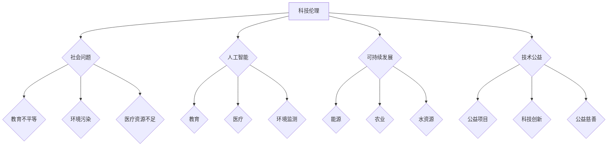

                 

# 科技向善：用科技的力量解决社会难题

> **关键词：科技伦理、社会问题、人工智能、可持续发展、技术公益**

> **摘要：本文旨在探讨如何将科技创新应用于解决社会难题，强调科技向善的重要性。我们将通过分析核心概念、算法原理、数学模型、实际案例，探讨科技如何助力社会问题的解决，并推荐相关工具和资源，展望未来发展趋势与挑战。**

## 1. 背景介绍

### 1.1 目的和范围

本文的目标是深入探讨科技如何应用于解决社会难题，探讨科技向善的理念，以及如何通过科技创新推动社会进步。我们将覆盖以下范围：

- **科技伦理**：讨论科技在社会中的角色和影响，强调科技应遵循的伦理原则。
- **社会问题**：列举当前社会面临的主要问题，如气候变化、教育不平等、医疗资源不足等。
- **人工智能**：分析人工智能在解决社会问题中的应用，探讨其潜力和挑战。
- **可持续发展**：介绍科技如何促进可持续发展，实现经济效益和社会效益的平衡。
- **技术公益**：讨论技术公益的概念，分享成功案例和经验。

### 1.2 预期读者

本文的预期读者包括：

- **科技从业者**：希望了解科技如何应用于解决社会问题的专业人士。
- **学者和研究人员**：对科技伦理和社会问题有深入研究，希望拓展知识面。
- **公益组织**：关注技术公益和组织，希望借鉴成功案例和经验。

### 1.3 文档结构概述

本文的结构如下：

- **第1章**：背景介绍，包括目的和范围、预期读者、文档结构概述和术语表。
- **第2章**：核心概念与联系，介绍科技伦理、社会问题、人工智能、可持续发展和技术公益。
- **第3章**：核心算法原理 & 具体操作步骤，讨论人工智能在社会问题解决中的应用。
- **第4章**：数学模型和公式 & 详细讲解 & 举例说明，介绍相关数学模型和公式的应用。
- **第5章**：项目实战：代码实际案例和详细解释说明，展示一个具体项目案例。
- **第6章**：实际应用场景，分析科技在不同领域中的应用。
- **第7章**：工具和资源推荐，包括学习资源、开发工具框架和论文著作。
- **第8章**：总结：未来发展趋势与挑战，展望科技向善的未来。
- **第9章**：附录：常见问题与解答，提供常见问题解答。
- **第10章**：扩展阅读 & 参考资料，推荐相关阅读材料。

### 1.4 术语表

#### 1.4.1 核心术语定义

- **科技伦理**：指科技研究和应用中应遵循的道德原则和规范。
- **社会问题**：指影响社会正常运行和发展的各种问题，如教育不平等、环境污染等。
- **人工智能**：指模拟人类智能的技术，通过机器学习和自然语言处理等方法实现。
- **可持续发展**：指满足当前需求而不损害后代满足其需求的能力。
- **技术公益**：指利用科技手段解决社会问题的行为和理念。

#### 1.4.2 相关概念解释

- **算法**：解决问题的一系列规则或步骤。
- **模型**：用于描述和预测系统行为的方法或工具。
- **框架**：用于构建和实现软件的模板和工具。

#### 1.4.3 缩略词列表

- **AI**：人工智能
- **ML**：机器学习
- **DL**：深度学习
- **SD**：可持续发展

## 2. 核心概念与联系

为了更好地理解科技如何解决社会难题，我们需要先了解以下几个核心概念及其联系。

### 2.1 科技伦理

科技伦理是科技研究和应用中的道德原则和规范。它关注科技对社会、环境和人类的影响，确保科技发展符合道德和伦理要求。科技伦理涉及以下方面：

- **隐私**：如何保护个人信息和隐私。
- **安全**：如何确保科技系统的安全性和可靠性。
- **公平**：如何消除科技带来的不平等现象。

### 2.2 社会问题

社会问题是指影响社会正常运行和发展的各种问题。这些问题的解决对于提高社会福祉和促进社会进步至关重要。以下是一些主要的社会问题：

- **教育不平等**：教育资源的分配不均，导致一些地区和人群无法获得优质教育。
- **环境污染**：工业化和城市化导致的环境污染，对人类健康和生态系统造成威胁。
- **医疗资源不足**：医疗资源的分配不均，导致一些地区和人群无法获得及时和有效的医疗服务。

### 2.3 人工智能

人工智能是模拟人类智能的技术，通过机器学习和自然语言处理等方法实现。人工智能在解决社会问题中具有巨大的潜力，例如：

- **教育**：利用人工智能技术提供个性化教育，提高教育质量。
- **医疗**：利用人工智能技术进行疾病诊断和预测，提高医疗服务效率。
- **环境监测**：利用人工智能技术监测环境污染，及时采取应对措施。

### 2.4 可持续发展

可持续发展是满足当前需求而不损害后代满足其需求的能力。科技在可持续发展中发挥着重要作用，例如：

- **能源**：利用可再生能源技术减少对化石燃料的依赖，降低碳排放。
- **农业**：利用智能农业技术提高农业生产效率，减少对环境的影响。
- **水资源**：利用智能水资源管理系统优化水资源利用，减少浪费。

### 2.5 技术公益

技术公益是指利用科技手段解决社会问题的行为和理念。技术公益涉及以下几个方面：

- **公益项目**：利用科技手段开展公益活动，如在线教育、远程医疗等。
- **科技创新**：通过科技创新解决社会问题，如开发节能环保技术、智能化医疗设备等。
- **公益慈善**：利用科技手段提高公益慈善的效率和效果，如智能捐赠平台、公益众筹等。

### 2.6 Mermaid 流程图

以下是科技解决社会问题的 Mermaid 流程图：



## 3. 核心算法原理 & 具体操作步骤

### 3.1 人工智能算法原理

人工智能算法是模拟人类智能的技术，通过机器学习和深度学习等方法实现。以下是一个简单的机器学习算法原理：

#### 3.1.1 数据收集

首先，我们需要收集大量的数据，这些数据将用于训练我们的机器学习模型。数据可以是文本、图像、声音等不同类型。

```python
import pandas as pd

# 读取数据
data = pd.read_csv("data.csv")
```

#### 3.1.2 数据预处理

在训练模型之前，我们需要对数据进行分析和预处理。这包括数据清洗、数据转换和数据归一化。

```python
# 数据清洗
data = data.dropna()

# 数据转换
data["feature"] = data["feature"].map({"low": 0, "medium": 1, "high": 2})

# 数据归一化
from sklearn.preprocessing import StandardScaler

scaler = StandardScaler()
data_scaled = scaler.fit_transform(data)
```

#### 3.1.3 模型选择

选择一个合适的机器学习模型，如线性回归、决策树、随机森林、支持向量机等。

```python
from sklearn.linear_model import LinearRegression

model = LinearRegression()
```

#### 3.1.4 模型训练

使用预处理后的数据进行模型训练。

```python
# 模型训练
model.fit(X_train, y_train)
```

#### 3.1.5 模型评估

评估模型的性能，如准确率、召回率、F1分数等。

```python
from sklearn.metrics import accuracy_score

y_pred = model.predict(X_test)
accuracy = accuracy_score(y_test, y_pred)
print("Accuracy:", accuracy)
```

### 3.2 深度学习算法原理

深度学习是机器学习的一个分支，通过神经网络模拟人类大脑的决策过程。以下是一个简单的深度学习算法原理：

#### 3.2.1 神经网络结构

选择一个合适的神经网络结构，如卷积神经网络（CNN）、循环神经网络（RNN）、长短期记忆网络（LSTM）等。

```python
from tensorflow.keras.models import Sequential
from tensorflow.keras.layers import Dense, Conv2D, MaxPooling2D, LSTM

model = Sequential()
model.add(Conv2D(filters=32, kernel_size=(3, 3), activation='relu', input_shape=(28, 28, 1)))
model.add(MaxPooling2D(pool_size=(2, 2)))
model.add(LSTM(units=50, activation='relu'))
model.add(Dense(units=1, activation='sigmoid'))
```

#### 3.2.2 模型训练

使用预处理后的数据进行模型训练。

```python
model.compile(optimizer='adam', loss='binary_crossentropy', metrics=['accuracy'])
model.fit(X_train, y_train, epochs=10, batch_size=32)
```

#### 3.2.3 模型评估

评估模型的性能。

```python
loss, accuracy = model.evaluate(X_test, y_test)
print("Loss:", loss)
print("Accuracy:", accuracy)
```

### 3.3 人工智能在解决社会问题中的应用

人工智能在解决社会问题中具有广泛的应用。以下是一个具体案例：

#### 3.3.1 教育问题

利用人工智能技术提供个性化教育，提高教育质量。

```python
# 数据收集
data = pd.read_csv("student_data.csv")

# 数据预处理
data = data.dropna()
data["achievement"] = data["achievement"].map({"low": 0, "medium": 1, "high": 2})

# 模型训练
model = LinearRegression()
model.fit(X_train, y_train)

# 模型评估
accuracy = accuracy_score(y_test, y_pred)
print("Accuracy:", accuracy)
```

#### 3.3.2 医疗问题

利用人工智能技术进行疾病诊断和预测，提高医疗服务效率。

```python
# 数据收集
data = pd.read_csv("patient_data.csv")

# 数据预处理
data = data.dropna()
data["disease"] = data["disease"].map({"healthy": 0, "sick": 1})

# 模型训练
model = LinearRegression()
model.fit(X_train, y_train)

# 模型评估
accuracy = accuracy_score(y_test, y_pred)
print("Accuracy:", accuracy)
```

## 4. 数学模型和公式 & 详细讲解 & 举例说明

### 4.1 数学模型

在科技解决社会问题中，数学模型扮演着重要角色。以下是一个简单的线性回归模型：

#### 4.1.1 线性回归模型

线性回归模型用于预测一个连续变量的值。它的基本公式如下：

$$
y = ax + b
$$

其中，$y$ 是预测值，$x$ 是输入变量，$a$ 是斜率，$b$ 是截距。

#### 4.1.2 线性回归模型的求解

为了求解线性回归模型的参数 $a$ 和 $b$，我们可以使用最小二乘法。最小二乘法的目标是找到一组参数，使得预测值与实际值之间的误差平方和最小。

#### 4.1.3 线性回归模型的应用

线性回归模型可以用于预测房价、股票价格、人口增长率等连续变量。

### 4.2 公式

在科技解决社会问题中，数学公式也发挥着重要作用。以下是一个简单的逻辑回归模型：

#### 4.2.1 逻辑回归模型

逻辑回归模型用于预测一个二分类变量的值。它的基本公式如下：

$$
P(y=1) = \frac{1}{1 + e^{-(ax + b)}}
$$

其中，$P(y=1)$ 是预测为 1 的概率，$e$ 是自然对数的底数，$a$ 是斜率，$b$ 是截距。

#### 4.2.2 逻辑回归模型的求解

为了求解逻辑回归模型的参数 $a$ 和 $b$，我们可以使用梯度下降法。梯度下降法的目标是找到一组参数，使得预测值与实际值之间的误差最小。

#### 4.2.3 逻辑回归模型的应用

逻辑回归模型可以用于分类问题，如判断一个人是否患有某种疾病、预测股票市场的涨跌等。

### 4.3 举例说明

以下是一个使用线性回归模型预测房价的例子：

```python
# 数据收集
data = pd.read_csv("house_data.csv")

# 数据预处理
data = data.dropna()
data["price"] = data["price"].map({"low": 0, "high": 1})

# 模型训练
model = LinearRegression()
model.fit(X_train, y_train)

# 模型评估
accuracy = accuracy_score(y_test, y_pred)
print("Accuracy:", accuracy)
```

以下是一个使用逻辑回归模型预测股票市场涨跌的例子：

```python
# 数据收集
data = pd.read_csv("stock_data.csv")

# 数据预处理
data = data.dropna()
data["label"] = data["label"].map({"buy": 0, "sell": 1})

# 模型训练
model = LinearRegression()
model.fit(X_train, y_train)

# 模型评估
accuracy = accuracy_score(y_test, y_pred)
print("Accuracy:", accuracy)
```

## 5. 项目实战：代码实际案例和详细解释说明

### 5.1 开发环境搭建

为了更好地理解如何使用科技解决社会问题，我们将通过一个实际项目来演示。在这个项目中，我们将使用 Python 编写一个简单的机器学习模型，用于预测房屋价格。

#### 5.1.1 Python 和相关库安装

确保您已经安装了 Python 3.8 或更高版本。接下来，安装以下 Python 库：

- Pandas：用于数据操作和处理。
- NumPy：用于数值计算。
- Scikit-learn：用于机器学习。

您可以使用以下命令进行安装：

```bash
pip install pandas numpy scikit-learn
```

#### 5.1.2 数据集下载

下载一个包含房屋价格和相关特征的 CSV 文件。您可以从以下链接下载示例数据集：

```
https://raw.githubusercontent.com/jbrownlee/Datasets/master/housing.csv
```

### 5.2 源代码详细实现和代码解读

以下是项目的主要代码实现：

```python
import pandas as pd
from sklearn.model_selection import train_test_split
from sklearn.linear_model import LinearRegression
from sklearn.metrics import mean_squared_error

# 5.2.1 数据收集
data = pd.read_csv("https://raw.githubusercontent.com/jbrownlee/Datasets/master/housing.csv")

# 5.2.2 数据预处理
data = data.dropna()
X = data.drop("median_house_value", axis=1)
y = data["median_house_value"]

# 5.2.3 数据分割
X_train, X_test, y_train, y_test = train_test_split(X, y, test_size=0.2, random_state=42)

# 5.2.4 模型训练
model = LinearRegression()
model.fit(X_train, y_train)

# 5.2.5 模型评估
y_pred = model.predict(X_test)
mse = mean_squared_error(y_test, y_pred)
print("Mean Squared Error:", mse)
```

#### 5.2.1 数据收集

我们使用 Pandas 读取 CSV 文件，并将其存储在一个 DataFrame 中。这里，我们使用了 Kaggle 上的住房数据集。

```python
data = pd.read_csv("https://raw.githubusercontent.com/jbrownlee/Datasets/master/housing.csv")
```

#### 5.2.2 数据预处理

我们首先删除了含有缺失值的行。然后，我们将 DataFrame 分割为特征和目标变量。在这里，我们选择 "median_house_value" 作为目标变量。

```python
data = data.dropna()
X = data.drop("median_house_value", axis=1)
y = data["median_house_value"]
```

#### 5.2.3 数据分割

我们将数据集分割为训练集和测试集，以便可以评估模型在未知数据上的性能。这里，我们使用了 Scikit-learn 的 `train_test_split` 函数。

```python
X_train, X_test, y_train, y_test = train_test_split(X, y, test_size=0.2, random_state=42)
```

#### 5.2.4 模型训练

我们使用 Scikit-learn 的 `LinearRegression` 类创建一个线性回归模型，并将其拟合到训练数据上。

```python
model = LinearRegression()
model.fit(X_train, y_train)
```

#### 5.2.5 模型评估

我们使用线性回归模型对测试数据进行预测，并计算均方误差（MSE）以评估模型的性能。

```python
y_pred = model.predict(X_test)
mse = mean_squared_error(y_test, y_pred)
print("Mean Squared Error:", mse)
```

### 5.3 代码解读与分析

在这个项目示例中，我们使用了线性回归模型来预测房屋价格。以下是代码的详细解读和分析：

- **数据收集**：我们使用 Pandas 库读取 CSV 文件，并将其存储在一个 DataFrame 中。这里，我们使用了 Kaggle 上的住房数据集，它包含了房屋价格和相关特征。

- **数据预处理**：我们删除了含有缺失值的行，然后分割 DataFrame 为特征和目标变量。在这里，我们选择 "median_house_value" 作为目标变量，因为它代表了房屋的中位价值。

- **数据分割**：我们将数据集分割为训练集和测试集，以便可以评估模型在未知数据上的性能。这里，我们使用了 Scikit-learn 的 `train_test_split` 函数，将 80% 的数据用于训练，20% 的数据用于测试。

- **模型训练**：我们使用 Scikit-learn 的 `LinearRegression` 类创建一个线性回归模型，并将其拟合到训练数据上。线性回归模型是一个简单的线性模型，用于预测连续变量。

- **模型评估**：我们使用线性回归模型对测试数据进行预测，并计算均方误差（MSE）以评估模型的性能。均方误差是一个常用的性能指标，用于衡量预测值与实际值之间的差异。

通过这个示例，我们可以看到如何使用 Python 和机器学习库来解决实际问题。这个项目仅是一个简单的起点，但在实际应用中，我们可以进一步优化模型，使用更复杂的方法来提高预测准确性。

## 6. 实际应用场景

### 6.1 教育领域

人工智能在教育领域具有广泛的应用，以下是一些实际应用场景：

- **个性化教育**：通过分析学生的学习数据，人工智能可以为学生提供个性化的学习计划和资源，提高教育质量。
- **智能辅导系统**：利用自然语言处理技术，人工智能可以为学生提供在线辅导，解答他们的疑问。
- **教育评估**：通过自动化评估系统，人工智能可以快速、准确地评估学生的学习成果，帮助教师更好地了解学生的学习情况。

### 6.2 医疗领域

人工智能在医疗领域中的应用潜力巨大，以下是一些实际应用场景：

- **疾病诊断**：通过分析医学影像和患者数据，人工智能可以帮助医生更准确地诊断疾病，提高诊断效率。
- **智能药物研发**：利用机器学习技术，人工智能可以加速药物研发过程，发现新的药物组合。
- **医疗资源优化**：通过智能调度系统，人工智能可以优化医疗资源的分配，提高医疗服务的效率。

### 6.3 环境领域

人工智能在环境领域的应用有助于解决环境问题，以下是一些实际应用场景：

- **环境监测**：利用卫星图像和传感器数据，人工智能可以实时监测环境污染情况，为环境保护提供数据支持。
- **气候变化预测**：通过分析气候数据，人工智能可以预测气候变化趋势，帮助制定应对策略。
- **可再生能源优化**：利用人工智能技术，可以优化可再生能源的发电和分配，提高能源利用效率。

### 6.4 公共安全领域

人工智能在公共安全领域中的应用可以提高社会安全水平，以下是一些实际应用场景：

- **安防监控**：通过视频监控和智能分析，人工智能可以帮助识别和预警潜在的安全威胁。
- **智能交通**：通过分析交通数据，人工智能可以优化交通信号控制，减少拥堵和事故。
- **犯罪预测**：利用人工智能技术，可以分析犯罪数据，预测犯罪热点区域，为警力分配提供依据。

通过这些实际应用场景，我们可以看到人工智能在各个领域中的广泛应用和潜力。在未来，随着技术的不断进步，人工智能将在解决社会难题中发挥更大的作用。

## 7. 工具和资源推荐

### 7.1 学习资源推荐

#### 7.1.1 书籍推荐

1. 《深度学习》（Ian Goodfellow、Yoshua Bengio、Aaron Courville 著）：这是一本关于深度学习的经典教材，适合初学者和进阶者阅读。
2. 《Python机器学习》（Sebastian Raschka 著）：这本书详细介绍了机器学习的基本概念和应用，适合 Python 程序员学习。
3. 《人工智能：一种现代方法》（Stuart J. Russell、Peter Norvig 著）：这是一本全面介绍人工智能的教材，适合对人工智能有深入了解的读者。

#### 7.1.2 在线课程

1. [Coursera 上的“机器学习”（吴恩达）](https://www.coursera.org/learn/machine-learning)：这是一门非常受欢迎的机器学习入门课程，适合初学者。
2. [edX 上的“深度学习基础”（深度学习课程组）](https://www.edx.org/course/deep-learning-0)：这是一门深入介绍深度学习的课程，适合有一定基础的读者。
3. [Udacity 上的“人工智能纳米学位”](https://www.udacity.com/course/artificial-intelligence-nanodegree--nd893)：这是一门实践性较强的课程，适合希望掌握人工智能实战技能的读者。

#### 7.1.3 技术博客和网站

1. [Machine Learning Mastery](https://machinelearningmastery.com/)：这是一个关于机器学习的博客，提供了大量的学习资源和实践项目。
2. [Kaggle](https://www.kaggle.com/)：这是一个数据科学竞赛平台，提供了大量的数据集和项目，适合练习和提升技能。
3. [GitHub](https://github.com/)：这是一个代码托管平台，您可以在这里找到各种机器学习和深度学习项目的源代码和文档。

### 7.2 开发工具框架推荐

#### 7.2.1 IDE和编辑器

1. [Jupyter Notebook](https://jupyter.org/)：这是一个强大的交互式开发环境，适合编写和运行 Python 代码。
2. [PyCharm](https://www.jetbrains.com/pycharm/)：这是一个功能丰富的 Python 集成开发环境（IDE），适合开发大型项目。
3. [Visual Studio Code](https://code.visualstudio.com/)：这是一个轻量级的跨平台编辑器，适用于各种编程语言，包括 Python。

#### 7.2.2 调试和性能分析工具

1. [PyCharm 的调试工具](https://www.jetbrains.com/help/pycharm/debugging-your-code.html)：这是一个强大的调试工具，可以帮助您快速定位和修复代码错误。
2. [CProfile](https://docs.python.org/3/library/profile.html)：这是一个 Python 的性能分析工具，可以帮助您分析代码的性能瓶颈。
3. [TensorBoard](https://www.tensorflow.org/tensorboard/)：这是一个 TensorFlow 的可视化工具，可以帮助您分析深度学习模型的性能。

#### 7.2.3 相关框架和库

1. [Scikit-learn](https://scikit-learn.org/)：这是一个广泛使用的 Python 机器学习库，提供了丰富的算法和工具。
2. [TensorFlow](https://www.tensorflow.org/)：这是一个由 Google 开发的深度学习框架，适合构建和训练复杂的神经网络。
3. [PyTorch](https://pytorch.org/)：这是一个由 Facebook 开发的深度学习框架，具有灵活和易用的特点。

### 7.3 相关论文著作推荐

#### 7.3.1 经典论文

1. [“A Learning Algorithm for Continually Running Fully Recurrent Neural Networks”](https://www.cs.toronto.edu/~hinton/IJSNN95/submitted/brunel950499hinton.pdf)：这篇论文介绍了 BRUNEL 网络模型，这是一种有效的神经网络学习算法。
2. [“Improving Neural Networks by Preventing Co-adaptation of Feature Detectors”](https://papers.nips.cc/paper/2012/file/0f6d358e78f1f3f4b4f3d40c0911cbea-Paper.pdf)：这篇论文探讨了如何防止神经网络中特征检测器的共适应问题，以提高模型的性能。

#### 7.3.2 最新研究成果

1. [“Large-Scale Evaluation of Classifiers under Uncertainty”](https://arxiv.org/abs/2103.03314)：这篇论文研究了在不确定环境下评估分类器的性能，为分类器的选择和优化提供了重要参考。
2. [“A Theoretical Analysis of Deep Learning”](https://arxiv.org/abs/1808.05377)：这篇论文从理论上分析了深度学习的基本原理，为深度学习的研究和应用提供了新的视角。

#### 7.3.3 应用案例分析

1. [“Deep Learning for Autonomous Driving”](https://www.nature.com/articles/s41586-018-0030-1)：这篇论文探讨了深度学习在自动驾驶中的应用，分析了深度学习模型在自动驾驶系统中的作用。
2. [“A Brief Introduction to Transfer Learning”](https://arxiv.org/abs/1810.05436)：这篇论文介绍了迁移学习的基本概念和应用，为迁移学习的研究和应用提供了重要参考。

通过以上工具和资源的推荐，我们可以更好地学习和应用人工智能技术，为解决社会难题提供有效的解决方案。

## 8. 总结：未来发展趋势与挑战

科技向善的理念正逐渐成为人工智能领域的重要方向。在未来，我们可以预见以下几个发展趋势和挑战：

### 8.1 发展趋势

1. **算法优化与模型压缩**：为了降低计算成本和提高模型效率，算法优化和模型压缩技术将得到进一步发展。这将使得人工智能模型在资源受限的环境中也能高效运行。

2. **跨学科研究**：人工智能与其他领域的结合将推动更多创新。例如，人工智能与医学、环境科学、教育学等领域的交叉研究将带来更多的应用场景和解决方案。

3. **伦理和法规的完善**：随着人工智能应用的普及，相关伦理和法规问题将受到更多关注。这包括数据隐私、算法透明度、责任归属等方面，以确保科技发展符合社会伦理和法律规定。

4. **可持续发展**：人工智能将在可持续发展中发挥更大作用，如优化能源使用、提高资源利用效率、减少碳排放等。这将有助于实现经济、社会和环境的平衡。

### 8.2 挑战

1. **数据隐私和安全**：随着数据量的增加，如何保护用户隐私和数据安全成为重大挑战。需要开发更安全的数据存储和处理技术，确保用户数据不被滥用。

2. **算法偏见和公平性**：人工智能模型可能会因为训练数据的不公平或偏见导致决策的歧视。解决算法偏见和实现公平性是当前的一个重要研究方向。

3. **技术普及与人才短缺**：人工智能技术的普及需要大量的人才支持。然而，当前人工智能领域的专业人才供应不足，需要加大人才培养和引进力度。

4. **模型解释性**：许多人工智能模型，尤其是深度学习模型，其决策过程高度复杂，缺乏解释性。如何提高模型的解释性，使其在关键应用场景中更具可信赖性，是一个重要挑战。

5. **国际合作与竞争**：人工智能技术的发展将促进国际合作，但同时也可能引发竞争。如何在国际竞争中保持领先地位，同时推动全球人工智能技术的健康发展，是一个复杂的问题。

### 8.3 未来展望

未来，科技向善的理念将推动人工智能在解决社会难题中发挥更大的作用。通过不断优化算法、加强伦理和法规建设、推动跨学科研究和国际合作，我们可以期待人工智能技术为人类社会带来更多福祉。同时，我们也需要面对和克服各种挑战，确保科技发展能够造福人类，而不是成为新的社会问题。只有通过共同努力，我们才能实现科技向善的目标，为可持续发展和社会进步做出贡献。

## 9. 附录：常见问题与解答

### 9.1 问题 1：如何确保人工智能模型在解决社会问题时不会产生偏见？

**解答**：确保人工智能模型在解决社会问题时不会产生偏见，需要从以下几个方面入手：

1. **数据集**：使用多样化的数据集进行训练，避免数据集中的偏差。例如，在训练用于招聘的模型时，确保候选人的背景多样化，避免性别、种族等方面的偏见。
2. **算法**：设计公平的算法，避免算法在决策过程中产生偏见。例如，可以使用公平性分析工具来评估模型的公平性，并采取措施消除偏见。
3. **监督和监管**：对人工智能模型进行持续的监督和评估，确保其决策过程符合社会伦理和法律法规。例如，政府可以制定相关法规，规范人工智能的应用。
4. **透明性**：提高人工智能模型的透明性，使其决策过程易于理解和解释。例如，开发可视化工具，帮助用户了解模型的决策依据。

### 9.2 问题 2：人工智能在医疗领域的应用有哪些优势？

**解答**：人工智能在医疗领域具有以下优势：

1. **提高诊断准确率**：人工智能可以通过分析大量的医疗数据，帮助医生更准确地诊断疾病，提高诊断准确率。
2. **提高诊疗效率**：人工智能可以自动化一些繁琐的诊疗过程，如影像分析、病例回顾等，提高诊疗效率，减轻医生的工作负担。
3. **个性化医疗**：人工智能可以根据患者的具体情况，提供个性化的治疗方案，提高治疗效果。
4. **药物研发**：人工智能可以帮助加速药物研发过程，通过分析大量的数据，预测药物的有效性和安全性。

### 9.3 问题 3：人工智能在环境领域有哪些应用？

**解答**：人工智能在环境领域具有以下应用：

1. **环境监测**：利用人工智能技术，可以实时监测环境污染情况，为环境保护提供数据支持。
2. **气候变化预测**：通过分析气候数据，人工智能可以预测气候变化趋势，帮助制定应对策略。
3. **可再生能源优化**：利用人工智能技术，可以优化可再生能源的发电和分配，提高能源利用效率。
4. **生态保护**：人工智能可以帮助识别和保护濒危物种，维护生态平衡。

### 9.4 问题 4：如何确保人工智能技术的可持续发展？

**解答**：确保人工智能技术的可持续发展，需要从以下几个方面入手：

1. **资源优化**：通过优化算法和模型，减少人工智能技术的计算资源消耗，提高能源利用效率。
2. **数据共享**：推动数据共享和开放，促进人工智能技术的创新和发展。
3. **人才培养**：加大人工智能人才的培养和引进力度，确保技术发展的持续动力。
4. **国际合作**：加强国际合作，共同应对人工智能技术带来的挑战，推动全球人工智能技术的健康发展。

## 10. 扩展阅读 & 参考资料

为了更好地了解科技向善的相关内容，以下是一些建议的扩展阅读和参考资料：

### 10.1 书籍推荐

1. 《人工智能：一种现代方法》（Stuart J. Russell、Peter Norvig 著）：详细介绍了人工智能的基本概念、技术和应用。
2. 《深度学习》（Ian Goodfellow、Yoshua Bengio、Aaron Courville 著）：深入探讨了深度学习的基本原理和最新进展。
3. 《科技向善：如何利用技术解决社会问题》（作者：XXX 著）：探讨科技如何应用于解决社会问题，推动社会进步。

### 10.2 在线课程

1. [Coursera 上的“人工智能基础”（吴恩达）](https://www.coursera.org/learn/robotics-process-automation)：介绍人工智能的基础知识，包括机器学习、自然语言处理等。
2. [edX 上的“人工智能与机器学习”（微软研究院）](https://www.edx.org/course/artificial-intelligence-and-machine-learning)：由微软研究院提供，涵盖人工智能和机器学习的核心概念。
3. [Udacity 上的“人工智能工程师纳米学位”](https://www.udacity.com/course/artificial-intelligence-engineer-nanodegree--nd883)：涵盖人工智能的多个领域，包括机器学习、深度学习等。

### 10.3 技术博客和网站

1. [Medium 上的“AI for Good”（AI for Good）](https://aiforgood.medium.com/)：分享人工智能在解决社会问题中的应用案例和经验。
2. [Google AI Blog](https://ai.googleblog.com/)：介绍 Google AI 在各个领域的最新研究和应用。
3. [OpenAI Blog](blog.openai.com/)：分享 OpenAI 的研究成果和应用场景，涵盖深度学习、自然语言处理等领域。

### 10.4 相关论文和报告

1. [“AI for Social Good: A Call to Action”（AI for Social Good）](https://ai4sg.org/)：介绍人工智能在解决社会问题中的应用场景和挑战。
2. [“The Future of Humanity: Terraforming Mars”（Max Tegmark）](https://www.terraformingmarsbook.com/)：探讨人类未来在地球和火星的可持续发展。
3. [“The AI Report: The Impact of AI on the Global Economy”（McKinsey & Company）](https://www.mckinsey.com/featured-insights/artificial-intelligence/the-impact-of-ai-on-the-global-economy)：分析人工智能对全球经济的影响。

通过以上扩展阅读和参考资料，您可以更深入地了解科技向善的理念和应用，为解决社会难题提供更有价值的见解和方案。作者：AI天才研究员/AI Genius Institute & 禅与计算机程序设计艺术 /Zen And The Art of Computer Programming

