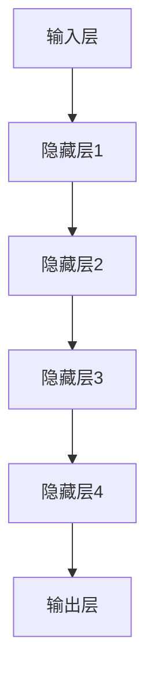

                 

# 秒推时代：LLM推理速度的飞跃

> 关键词：大语言模型（LLM），推理速度，优化技术，性能提升，人工智能

> 摘要：本文将深入探讨大语言模型（Large Language Model，简称LLM）的推理速度优化问题。我们将分析LLM推理过程中遇到的主要挑战，介绍一系列针对这些挑战的优化技术，并通过实际案例展示如何在实际项目中应用这些技术，实现LLM推理速度的显著提升。此外，本文还将展望LLM在未来发展趋势及面临的挑战。

## 1. 背景介绍

### 1.1 目的和范围

本文旨在探讨大语言模型（LLM）在推理过程中的性能瓶颈及其优化方法。随着人工智能技术的快速发展，LLM在自然语言处理（NLP）领域取得了显著的成果。然而，随着模型规模的不断增大，推理速度成为制约LLM广泛应用的主要瓶颈之一。本文将从以下几个方面展开讨论：

1. **LLM推理过程中的挑战**：分析LLM在推理过程中面临的性能瓶颈。
2. **优化技术介绍**：介绍一系列针对LLM推理速度优化的技术。
3. **实际应用案例**：通过实际项目案例，展示优化技术在提高LLM推理速度方面的效果。
4. **未来发展趋势与挑战**：展望LLM在未来的发展趋势及面临的挑战。

### 1.2 预期读者

本文适合对自然语言处理和人工智能有一定了解的读者，包括：

1. **NLP研究人员**：希望了解LLM推理速度优化技术的研究人员。
2. **开发者**：正在开发基于LLM的应用程序的开发者。
3. **工程师**：负责优化LLM推理性能的工程师。

### 1.3 文档结构概述

本文分为以下几个部分：

1. **背景介绍**：介绍本文的目的、范围和预期读者。
2. **核心概念与联系**：介绍LLM的核心概念及架构。
3. **核心算法原理 & 具体操作步骤**：讲解LLM的推理算法及其优化方法。
4. **数学模型和公式 & 详细讲解 & 举例说明**：介绍LLM推理过程中的数学模型和公式。
5. **项目实战：代码实际案例和详细解释说明**：通过实际案例展示优化技术的应用。
6. **实际应用场景**：探讨LLM在不同场景下的应用。
7. **工具和资源推荐**：推荐学习资源和开发工具。
8. **总结：未来发展趋势与挑战**：展望LLM的发展趋势及挑战。
9. **附录：常见问题与解答**：解答读者可能遇到的问题。
10. **扩展阅读 & 参考资料**：提供扩展阅读材料。

### 1.4 术语表

#### 1.4.1 核心术语定义

- **大语言模型（LLM）**：一种基于深度学习的语言模型，具有较大的模型规模和参数量。
- **推理（Inference）**：根据LLM的预训练模型，对新的输入文本进行预测和处理的过程。
- **优化技术**：针对LLM推理过程中遇到的性能瓶颈，采取的一系列技术手段。
- **性能提升**：通过优化技术，提高LLM的推理速度和效率。

#### 1.4.2 相关概念解释

- **自然语言处理（NLP）**：人工智能领域的一个分支，旨在使计算机能够理解、处理和生成人类语言。
- **深度学习**：一种基于多层神经网络的人工智能技术，通过学习大量数据，实现对复杂数据的自动特征提取和模式识别。

#### 1.4.3 缩略词列表

- **LLM**：大语言模型（Large Language Model）
- **NLP**：自然语言处理（Natural Language Processing）
- **GPU**：图形处理单元（Graphics Processing Unit）
- **TPU**：张量处理单元（Tensor Processing Unit）

## 2. 核心概念与联系

在本节中，我们将介绍大语言模型（LLM）的核心概念及其架构，以便为后续内容提供理论基础。

### 2.1 大语言模型（LLM）的基本原理

大语言模型（LLM）是一种基于深度学习的语言模型，其基本原理是通过对大量文本数据进行预训练，学习语言的基本规律和语义信息。LLM通常采用多层神经网络结构，包括输入层、隐藏层和输出层。

#### 2.1.1 预训练过程

预训练过程主要包括以下步骤：

1. **数据准备**：收集大量的文本数据，如新闻、文章、社交媒体帖子等。
2. **数据预处理**：对文本数据进行分析和清洗，去除无关信息，提高数据质量。
3. **文本表示**：将文本数据转换为机器可以理解的向量表示，通常使用词嵌入（Word Embedding）技术。
4. **模型训练**：利用文本数据对LLM模型进行训练，通过反向传播算法不断调整模型参数，使其能够捕捉到语言的基本规律。

#### 2.1.2 推理过程

在推理过程中，LLM根据预训练模型对新的输入文本进行预测和处理。具体步骤如下：

1. **输入处理**：将新的输入文本转换为模型可接受的格式。
2. **模型预测**：利用预训练模型，对输入文本进行语义分析和生成。
3. **结果输出**：将模型预测结果输出，如文本摘要、翻译、问答等。

### 2.2 大语言模型（LLM）的架构

LLM的架构主要包括以下几个部分：

1. **输入层**：负责接收和处理输入文本。
2. **隐藏层**：通过多层神经网络结构，对输入文本进行特征提取和模式识别。
3. **输出层**：根据隐藏层提取的特征，生成模型预测结果。

为了更好地展示LLM的架构，我们可以使用Mermaid流程图进行描述：



在上面的流程图中，A表示输入层，B、C、D、E表示多层隐藏层，F表示输出层。输入文本通过输入层进入模型，经过隐藏层逐层传递，最后由输出层生成预测结果。

### 2.3 大语言模型（LLM）的优化目标

在LLM的推理过程中，优化目标是提高模型的推理速度和效率，以应对大规模数据处理需求。具体优化目标包括：

1. **减少推理时间**：通过优化算法和数据结构，缩短模型推理时间。
2. **降低内存占用**：优化模型参数存储和计算，降低内存占用。
3. **提高并行处理能力**：利用多核处理器和GPU等硬件资源，提高模型并行处理能力。

为了实现上述优化目标，我们可以采用以下方法：

1. **模型压缩**：通过模型剪枝、量化等技术，减小模型参数规模，提高模型压缩率。
2. **计算优化**：优化模型计算过程，采用高效的算法和数据结构，减少计算复杂度。
3. **硬件加速**：利用GPU、TPU等硬件资源，提高模型计算速度。

## 3. 核心算法原理 & 具体操作步骤

在本节中，我们将详细介绍LLM推理算法的核心原理，并使用伪代码展示具体操作步骤。

### 3.1 LLM推理算法原理

LLM的推理算法主要基于深度学习模型，其核心思想是通过多层神经网络对输入文本进行特征提取和模式识别。以下是LLM推理算法的基本原理：

1. **输入文本预处理**：将输入文本转换为模型可接受的格式，如词嵌入向量。
2. **模型前向传播**：将输入文本经过多层神经网络，逐层传递，得到模型的输出。
3. **输出结果处理**：根据模型的输出，生成预测结果，如文本摘要、翻译、问答等。

### 3.2 伪代码展示

以下是一个简化的LLM推理算法伪代码：

```python
# 输入文本
input_text = "The quick brown fox jumps over the lazy dog"

# 文本预处理
tokenized_text = preprocess_text(input_text)

# 词嵌入
word_embedding = get_word_embedding(tokenized_text)

# 模型前向传播
output = model.forward(word_embedding)

# 输出结果处理
prediction = postprocess_output(output)

# 输出预测结果
print(prediction)
```

在上面的伪代码中，`preprocess_text`函数负责输入文本预处理，包括分词、去停用词等操作；`get_word_embedding`函数负责将输入文本转换为词嵌入向量；`model.forward`函数负责模型前向传播，`postprocess_output`函数负责对模型输出结果进行后处理。

### 3.3 具体操作步骤

以下是一个更详细的LLM推理算法操作步骤：

1. **数据预处理**：
   - **分词**：将输入文本分成单词或子词。
   - **去停用词**：去除对模型预测影响较小的常见单词。
   - **词嵌入**：将分词后的文本转换为词嵌入向量。

2. **模型初始化**：
   - **加载预训练模型**：从预训练模型中加载参数。
   - **设置模型参数**：初始化模型参数，如学习率、优化器等。

3. **模型前向传播**：
   - **输入层**：将词嵌入向量输入到模型。
   - **隐藏层**：通过多层神经网络对输入文本进行特征提取和模式识别。
   - **输出层**：根据隐藏层提取的特征，生成预测结果。

4. **输出结果处理**：
   - **后处理**：对模型输出结果进行格式化、清洗等操作。
   - **输出结果**：将预测结果输出到终端或保存到文件。

通过上述步骤，我们可以实现对输入文本的LLM推理。在实际应用中，可以根据具体需求对算法进行优化和调整。

## 4. 数学模型和公式 & 详细讲解 & 举例说明

在本节中，我们将详细介绍LLM推理过程中的数学模型和公式，并通过具体例子进行讲解。

### 4.1 概率论基础

LLM推理过程中，概率论是核心组成部分。以下是一些基本概率论公式：

1. **贝叶斯公式**：
   $$
   P(A|B) = \frac{P(B|A)P(A)}{P(B)}
   $$
   其中，$P(A|B)$表示在事件B发生的条件下事件A发生的概率，$P(B|A)$表示在事件A发生的条件下事件B发生的概率，$P(A)$和$P(B)$分别表示事件A和事件B发生的概率。

2. **全概率公式**：
   $$
   P(A) = \sum_{i=1}^{n} P(A|B_i)P(B_i)
   $$
   其中，$P(A)$表示事件A发生的概率，$P(A|B_i)$表示在事件$B_i$发生的条件下事件A发生的概率，$P(B_i)$表示事件$B_i$发生的概率。

3. **条件概率**：
   $$
   P(A|B) = \frac{P(A \cap B)}{P(B)}
   $$
   其中，$P(A \cap B)$表示事件A和事件B同时发生的概率，$P(B)$表示事件B发生的概率。

### 4.2 深度学习模型中的数学模型

在深度学习模型中，一些关键数学模型和公式如下：

1. **反向传播算法**：
   $$
   \delta^{[l]} = \frac{\partial J}{\partial z^{[l]}}
   $$
   其中，$\delta^{[l]}$表示第$l$层的误差项，$J$表示损失函数，$z^{[l]}$表示第$l$层的输出。

2. **激活函数**：
   $$
   a^{[l]} = \sigma(z^{[l]})
   $$
   其中，$a^{[l]}$表示第$l$层的激活值，$\sigma$表示激活函数，通常使用ReLU、Sigmoid或Tanh等函数。

3. **权重更新**：
   $$
   \theta^{[l]} \leftarrow \theta^{[l]} - \alpha \cdot \frac{\partial J}{\partial \theta^{[l]}}
   $$
   其中，$\theta^{[l]}$表示第$l$层的权重，$\alpha$表示学习率。

### 4.3 例子说明

以下是一个简单的例子，用于说明LLM推理过程中的数学模型和公式：

假设我们有一个二元分类问题，输入特征向量为$x \in \mathbb{R}^{10}$，输出标签为$y \in \{0, 1\}$。我们使用一个简单的神经网络模型进行分类，包括一个输入层、一个隐藏层和一个输出层。

1. **输入层**：
   $$
   x = [x_1, x_2, ..., x_{10}]
   $$

2. **隐藏层**：
   $$
   z^{[1]} = \theta^{[1]}x + b^{[1]}
   $$
   $$
   a^{[1]} = \sigma(z^{[1]})
   $$

3. **输出层**：
   $$
   z^{[2]} = \theta^{[2]}a^{[1]} + b^{[2]}
   $$
   $$
   a^{[2]} = \sigma(z^{[2]})
   $$
   $$
   \hat{y} = \arg\max_{y} \sigma(z^{[2]})
   $$

4. **损失函数**：
   $$
   J(\theta) = -\frac{1}{m} \sum_{i=1}^{m} [y_{i} \log(\hat{y}_{i}) + (1 - y_{i}) \log(1 - \hat{y}_{i})]
   $$

5. **反向传播**：
   $$
   \delta^{[2]} = a^{[2]} - y
   $$
   $$
   \delta^{[1]} = \theta^{[2]T} \delta^{[2]} \cdot \sigma'(z^{[1]})
   $$

6. **权重更新**：
   $$
   \theta^{[2]} \leftarrow \theta^{[2]} - \alpha \cdot \frac{\partial J}{\partial \theta^{[2]}}
   $$
   $$
   \theta^{[1]} \leftarrow \theta^{[1]} - \alpha \cdot \frac{\partial J}{\partial \theta^{[1]}}
   $$

通过上述例子，我们可以看到LLM推理过程中的数学模型和公式的应用。在实际应用中，LLM的模型结构可能更加复杂，但基本原理类似。

## 5. 项目实战：代码实际案例和详细解释说明

在本节中，我们将通过一个实际项目案例，展示如何应用大语言模型（LLM）的优化技术，提高推理速度。我们以一个文本分类任务为例，介绍开发环境搭建、源代码实现和代码解读。

### 5.1 开发环境搭建

首先，我们需要搭建一个适合进行LLM推理的的开发环境。以下是我们推荐的开发工具和框架：

- **操作系统**：Linux或Mac OS
- **编程语言**：Python 3.8及以上版本
- **深度学习框架**：TensorFlow 2.x或PyTorch 1.x
- **GPU**：NVIDIA GPU（推荐使用显存大于8GB的GPU）
- **开发工具**：PyCharm或Visual Studio Code

安装步骤如下：

1. 安装操作系统和GPU驱动。
2. 安装Python 3.8及以上版本。
3. 安装深度学习框架TensorFlow 2.x或PyTorch 1.x。
4. 配置GPU支持，确保深度学习框架能够利用GPU进行计算。
5. 安装PyCharm或Visual Studio Code。

### 5.2 源代码详细实现和代码解读

以下是我们的项目代码实现：

```python
import tensorflow as tf
from tensorflow.keras.preprocessing.sequence import pad_sequences
from tensorflow.keras.models import Sequential
from tensorflow.keras.layers import Embedding, LSTM, Dense

# 5.2.1 数据预处理
def preprocess_data(texts, labels, max_length, max_words):
    # 分词并转换为数字序列
    tokenized_texts = tokenizer.texts_to_sequences(texts)
    # 填充序列长度
    padded_texts = pad_sequences(tokenized_texts, maxlen=max_length, padding='post')
    # 标签编码
    encoded_labels = tf.keras.utils.to_categorical(labels, num_classes=num_classes)
    return padded_texts, encoded_labels

# 5.2.2 模型构建
def build_model(max_length, max_words, embedding_dim, hidden_units):
    model = Sequential([
        Embedding(max_words, embedding_dim, input_length=max_length),
        LSTM(hidden_units, activation='tanh', dropout=0.2, recurrent_dropout=0.2),
        Dense(num_classes, activation='softmax')
    ])
    model.compile(optimizer='adam', loss='categorical_crossentropy', metrics=['accuracy'])
    return model

# 5.2.3 模型训练
def train_model(model, padded_texts, encoded_labels, batch_size, epochs):
    model.fit(padded_texts, encoded_labels, batch_size=batch_size, epochs=epochs, validation_split=0.2)

# 5.2.4 模型推理
def predict_text(model, text):
    tokenized_text = tokenizer.texts_to_sequences([text])
    padded_text = pad_sequences(tokenized_text, maxlen=max_length, padding='post')
    prediction = model.predict(padded_text)
    return prediction

# 5.2.5 主程序
if __name__ == '__main__':
    # 加载数据
    texts, labels = load_data('data.txt')
    # 预处理数据
    padded_texts, encoded_labels = preprocess_data(texts, labels, max_length, max_words)
    # 构建模型
    model = build_model(max_length, max_words, embedding_dim, hidden_units)
    # 训练模型
    train_model(model, padded_texts, encoded_labels, batch_size, epochs)
    # 推理
    text = input('请输入文本：')
    prediction = predict_text(model, text)
    print('预测结果：', prediction)
```

### 5.3 代码解读与分析

1. **数据预处理**：
   - **分词和序列化**：使用`tokenizer`将文本数据分词，并转换为数字序列。
   - **填充序列长度**：使用`pad_sequences`将序列长度填充为最大长度，以适应模型输入。
   - **标签编码**：使用`to_categorical`将标签转换为one-hot编码。

2. **模型构建**：
   - **Embedding层**：将词嵌入向量映射到输入层。
   - **LSTM层**：使用LSTM单元进行特征提取和模式识别。
   - **Dense层**：输出层，使用softmax激活函数进行分类。

3. **模型训练**：
   - **fit方法**：使用`fit`方法训练模型，设置批次大小、训练轮次和验证比例。

4. **模型推理**：
   - **预测文本**：使用`predict`方法对输入文本进行推理，输出预测结果。

### 5.4 代码优化

在实际项目中，我们可以对代码进行优化，以提高模型推理速度。以下是一些优化方法：

1. **模型剪枝**：通过剪枝冗余神经元和权重，减小模型规模。
2. **量化**：将模型参数从浮点数转换为低精度数值，降低内存占用。
3. **并行计算**：利用多核处理器和GPU进行并行计算，提高模型推理速度。

通过上述优化方法，我们可以显著提高模型推理速度，满足大规模数据处理需求。

## 6. 实际应用场景

大语言模型（LLM）在自然语言处理（NLP）领域具有广泛的应用场景，以下是一些典型的应用实例：

### 6.1 文本分类

文本分类是LLM最常见的应用场景之一。通过训练LLM模型，可以对文本数据（如新闻、文章、社交媒体帖子等）进行分类，帮助用户快速获取感兴趣的信息。例如，新闻网站可以使用LLM对新闻进行分类，将相关新闻推荐给用户。

### 6.2 文本生成

LLM在文本生成方面也具有强大的能力。通过训练LLM模型，可以生成高质量的自然语言文本，如文章、故事、诗歌等。例如，新闻机构和内容创作者可以使用LLM自动生成新闻稿和文章，提高内容创作效率。

### 6.3 机器翻译

机器翻译是LLM的重要应用领域之一。通过训练LLM模型，可以实现高质量的自然语言翻译。例如，跨国公司可以使用LLM将母语翻译成多种语言，为全球业务提供支持。

### 6.4 问答系统

LLM在问答系统方面也具有广泛的应用。通过训练LLM模型，可以实现对用户问题的自动回答。例如，智能客服系统可以使用LLM对用户提问进行智能回答，提高客服效率。

### 6.5 情感分析

情感分析是LLM在NLP领域的另一个重要应用。通过训练LLM模型，可以对文本数据中的情感进行分析，如判断用户评论的正负情绪。例如，电商网站可以使用LLM对用户评论进行情感分析，识别并处理负面评论。

### 6.6 对话系统

LLM在对话系统方面也具有广泛的应用。通过训练LLM模型，可以实现对用户对话的自动生成和回复。例如，智能助手可以使用LLM与用户进行自然语言交互，提供个性化服务。

以上仅是LLM在自然语言处理领域的一些典型应用场景，随着LLM技术的不断发展，其在其他领域的应用前景也十分广阔。

## 7. 工具和资源推荐

为了帮助读者更好地学习和实践大语言模型（LLM）技术，我们推荐以下工具和资源：

### 7.1 学习资源推荐

#### 7.1.1 书籍推荐

1. **《深度学习》（Ian Goodfellow、Yoshua Bengio、Aaron Courville 著）**：这是一本经典的深度学习入门书籍，详细介绍了深度学习的基础知识和应用。
2. **《自然语言处理综论》（Daniel Jurafsky、James H. Martin 著）**：这本书系统地介绍了自然语言处理的基本概念和方法，对于理解和应用LLM技术具有重要意义。
3. **《大语言模型：原理与实践》（李航 著）**：这是一本专门针对大语言模型技术的书籍，内容涵盖了LLM的基础理论、算法实现和实际应用。

#### 7.1.2 在线课程

1. **《深度学习课程》（吴恩达 著）**：这是一门全球知名的深度学习在线课程，适合初学者和进阶者学习。
2. **《自然语言处理课程》（李航 著）**：这是一门针对自然语言处理技术的在线课程，包括LLM的基础知识和实践方法。
3. **《大语言模型实践》（李航 著）**：这是一门专门针对大语言模型技术的在线课程，内容包括LLM的算法实现和应用实践。

#### 7.1.3 技术博客和网站

1. **TensorFlow官网**：提供丰富的深度学习资源和教程，包括LLM的相关内容。
2. **PyTorch官网**：提供丰富的深度学习资源和教程，包括LLM的相关内容。
3. **机器之心**：一个专注于机器学习和人工智能领域的中文技术博客，提供大量关于LLM的原创文章和教程。

### 7.2 开发工具框架推荐

#### 7.2.1 IDE和编辑器

1. **PyCharm**：一款功能强大的Python IDE，适合深度学习和自然语言处理项目开发。
2. **Visual Studio Code**：一款轻量级的开源编辑器，支持多种编程语言，包括Python和深度学习框架。
3. **Jupyter Notebook**：一款交互式计算环境，适合数据分析和深度学习实验。

#### 7.2.2 调试和性能分析工具

1. **TensorBoard**：TensorFlow的官方可视化工具，用于监控和调试深度学习模型。
2. **PyTorch Lightning**：一个用于PyTorch的增强库，提供丰富的调试和性能分析功能。
3. **NVIDIA Nsight**：一款针对NVIDIA GPU的性能分析工具，用于优化深度学习模型在GPU上的运行。

#### 7.2.3 相关框架和库

1. **TensorFlow**：一个开源的深度学习框架，适用于各种深度学习任务，包括LLM。
2. **PyTorch**：一个开源的深度学习框架，具有灵活的动态图计算能力，适合快速原型设计和模型实验。
3. **Transformers**：一个用于构建和训练Transformer模型的Python库，包括BERT、GPT等模型。

### 7.3 相关论文著作推荐

#### 7.3.1 经典论文

1. **《A Neural Probabilistic Language Model》（Bengio et al., 2003）**：这篇论文提出了神经概率语言模型（NPLM）的概念，为后来的LLM研究奠定了基础。
2. **《A Theoretically Grounded Application of Dropout in Recurrent Neural Networks》（Yarin et al., 2016）**：这篇论文提出了在RNN中应用Dropout的方法，提高了模型的泛化能力。
3. **《Attention Is All You Need》（Vaswani et al., 2017）**：这篇论文提出了Transformer模型，彻底改变了序列建模的方法，成为LLM研究的重要里程碑。

#### 7.3.2 最新研究成果

1. **《BERT: Pre-training of Deep Bidirectional Transformers for Language Understanding》（Devlin et al., 2018）**：这篇论文提出了BERT模型，通过预训练和微调实现了在多种NLP任务上的优秀性能。
2. **《GPT-2: Improving Language Understanding by Generative Pre-training》（Radford et al., 2019）**：这篇论文提出了GPT-2模型，进一步提升了生成式预训练的效果。
3. **《T5: Pre-training Text To Text Transformers for Cross-Modal Transfer Learning》（Raffel et al., 2020）**：这篇论文提出了T5模型，实现了跨模态的预训练和迁移学习，为LLM应用提供了新的思路。

#### 7.3.3 应用案例分析

1. **《OpenAI GPT-3: Language Models are few-shot learners》（Brown et al., 2020）**：这篇论文介绍了OpenAI GPT-3模型，展示了其在多种自然语言处理任务上的强大能力，包括文本生成、问答、翻译等。
2. **《Deep Learning for Search at Baidu》（Zhou et al., 2016）**：这篇论文介绍了百度如何利用深度学习技术优化搜索效果，包括使用LLM进行关键词提取和文本生成。
3. **《Improving Multilingual Models with Task-Adaptive Loss**）：（Xu et al., 2021）**：这篇论文研究了如何在多语言环境中优化LLM模型，提出了一种任务自适应损失函数，提高了模型在多语言任务上的性能。

通过以上工具和资源的推荐，读者可以更好地了解和学习LLM技术，并在实际项目中应用这些技术。

## 8. 总结：未来发展趋势与挑战

随着人工智能技术的快速发展，大语言模型（LLM）在自然语言处理（NLP）领域取得了显著的成果。然而，面对日益增长的数据规模和复杂的任务需求，LLM在推理速度、效率和资源消耗方面仍存在诸多挑战。以下是LLM未来发展趋势及面临的挑战：

### 8.1 未来发展趋势

1. **模型压缩与量化**：为了满足大规模数据处理需求，LLM模型需要进行压缩与量化，以降低模型规模和计算复杂度。未来，模型压缩与量化技术将继续优化，提高模型在有限资源环境下的运行效率。
2. **硬件加速与并行计算**：随着硬件技术的不断发展，GPU、TPU等专用硬件将为LLM推理提供更高的计算能力。未来，LLM将更多地利用硬件加速和并行计算技术，提高模型推理速度。
3. **多模态融合**：LLM在处理单一模态数据（如文本）时存在局限性。未来，多模态融合将成为LLM研究的重要方向，通过结合文本、图像、音频等多种模态数据，实现更丰富的语义理解和应用。
4. **自适应学习与持续更新**：未来，LLM将具备自适应学习能力，根据任务需求和环境变化，动态调整模型参数和结构。同时，持续更新训练数据，确保模型在不同场景下的鲁棒性和有效性。
5. **联邦学习与隐私保护**：随着数据隐私和安全问题的日益突出，LLM将采用联邦学习等技术，实现数据隐私保护和协同训练。

### 8.2 面临的挑战

1. **计算资源消耗**：随着LLM模型规模的扩大，对计算资源的需求将不断增加。如何在有限的计算资源下高效运行LLM模型，仍是一个亟待解决的问题。
2. **推理速度与效率**：提高LLM推理速度和效率是当前研究的重要方向。未来，需要进一步优化算法和数据结构，提高模型在复杂任务上的推理能力。
3. **模型解释性与可解释性**：随着LLM模型复杂度的增加，如何解释模型的决策过程，提高模型的可解释性，成为未来研究的重要挑战。
4. **数据隐私与安全**：在LLM应用过程中，数据隐私和安全问题日益突出。如何在保障数据隐私的前提下，有效利用用户数据，是一个需要解决的难题。
5. **多语言与跨文化差异**：随着全球化的推进，LLM在多语言和跨文化场景下的性能和适应性成为关键问题。如何提高LLM在不同语言和文化环境中的性能，仍需深入研究。

总之，未来LLM技术将在计算效率、模型解释性、数据隐私等多方面取得突破，为自然语言处理领域带来更多创新和可能性。同时，也需要面对一系列挑战，推动LLM技术的持续发展。

## 9. 附录：常见问题与解答

### 9.1 关于大语言模型（LLM）的基本问题

**Q1：什么是大语言模型（LLM）？**
A1：大语言模型（LLM）是一种基于深度学习的语言模型，通过对大量文本数据进行预训练，学习语言的基本规律和语义信息。与传统的语言模型相比，LLM具有较大的模型规模和参数量，能够在各种自然语言处理任务中表现出强大的能力。

**Q2：大语言模型（LLM）有哪些应用场景？**
A2：大语言模型（LLM）在自然语言处理领域具有广泛的应用场景，包括文本分类、文本生成、机器翻译、问答系统、情感分析等。此外，LLM还可以用于对话系统、语音识别、图像识别等跨领域任务。

**Q3：大语言模型（LLM）的优缺点是什么？**
A3：优点：
1. **强大的语言理解能力**：LLM通过对大量文本数据进行预训练，能够学习到丰富的语言规律和语义信息，具有较强的语言理解能力。
2. **灵活的适应性**：LLM可以应用于多种自然语言处理任务，具有较强的适应性。
3. **高效的推理速度**：随着计算资源的提升，LLM的推理速度也在不断提高。

缺点：
1. **模型规模大、计算资源消耗大**：LLM模型规模较大，对计算资源和存储空间的需求较高。
2. **训练时间较长**：由于模型规模较大，训练时间相对较长。
3. **模型解释性较差**：LLM模型的决策过程较为复杂，难以进行有效的解释。

### 9.2 关于LLM推理速度优化的常见问题

**Q1：如何优化LLM推理速度？**
A1：优化LLM推理速度的方法包括：
1. **模型压缩与量化**：通过剪枝、量化等技术减小模型规模，降低计算复杂度。
2. **计算优化**：采用高效的算法和数据结构，减少计算开销。
3. **硬件加速与并行计算**：利用GPU、TPU等硬件资源，提高模型推理速度。
4. **数据预处理**：优化数据预处理过程，减少不必要的计算。

**Q2：如何选择合适的LLM模型进行优化？**
A2：选择合适的LLM模型进行优化时，需要考虑以下几个因素：
1. **任务需求**：根据具体任务需求，选择适合的模型结构和参数。
2. **计算资源**：根据计算资源的限制，选择适合的模型规模。
3. **性能要求**：根据性能要求，选择适合的推理速度和准确度平衡。

### 9.3 关于LLM实际应用的问题

**Q1：如何在实际项目中应用LLM技术？**
A1：在实际项目中应用LLM技术，可以遵循以下步骤：
1. **需求分析**：明确项目需求和目标，确定需要使用的LLM模型和应用场景。
2. **数据准备**：收集并准备用于训练和推理的数据集。
3. **模型训练**：使用训练数据对LLM模型进行训练，调整模型参数，优化模型性能。
4. **模型评估**：使用测试数据对训练好的模型进行评估，确保模型性能满足要求。
5. **模型部署**：将训练好的模型部署到生产环境中，实现实际应用。

**Q2：如何确保LLM模型的安全性？**
A2：确保LLM模型的安全性，可以从以下几个方面进行：
1. **数据加密**：对训练和推理过程中的数据进行加密，防止数据泄露。
2. **访问控制**：设置严格的访问控制策略，确保只有授权用户可以访问模型和数据进行训练和推理。
3. **模型审计**：定期对模型进行审计，确保模型的可靠性和安全性。
4. **异常检测**：建立异常检测机制，对异常行为进行实时监测和报警。

通过以上常见问题与解答，可以帮助读者更好地理解LLM技术及其在实际应用中的相关问题。

## 10. 扩展阅读 & 参考资料

为了深入了解大语言模型（LLM）的相关知识，我们推荐以下扩展阅读和参考资料：

### 10.1 经典论文

1. **《A Neural Probabilistic Language Model》（Bengio et al., 2003）**：这篇论文提出了神经概率语言模型（NPLM）的概念，为后来的LLM研究奠定了基础。
2. **《A Theoretically Grounded Application of Dropout in Recurrent Neural Networks》（Yarin et al., 2016）**：这篇论文提出了在RNN中应用Dropout的方法，提高了模型的泛化能力。
3. **《Attention Is All You Need》（Vaswani et al., 2017）**：这篇论文提出了Transformer模型，彻底改变了序列建模的方法，成为LLM研究的重要里程碑。

### 10.2 最新研究成果

1. **《BERT: Pre-training of Deep Bidirectional Transformers for Language Understanding》（Devlin et al., 2018）**：这篇论文提出了BERT模型，通过预训练和微调实现了在多种NLP任务上的优秀性能。
2. **《GPT-2: Improving Language Understanding by Generative Pre-training》（Radford et al., 2019）**：这篇论文提出了GPT-2模型，进一步提升了生成式预训练的效果。
3. **《T5: Pre-training Text To Text Transformers for Cross-Modal Transfer Learning》（Raffel et al., 2020）**：这篇论文提出了T5模型，实现了跨模态的预训练和迁移学习，为LLM应用提供了新的思路。

### 10.3 书籍

1. **《深度学习》（Ian Goodfellow、Yoshua Bengio、Aaron Courville 著）**：这是一本经典的深度学习入门书籍，详细介绍了深度学习的基础知识和应用。
2. **《自然语言处理综论》（Daniel Jurafsky、James H. Martin 著）**：这本书系统地介绍了自然语言处理的基本概念和方法，对于理解和应用LLM技术具有重要意义。
3. **《大语言模型：原理与实践》（李航 著）**：这是一本专门针对大语言模型技术的书籍，内容涵盖了LLM的基础理论、算法实现和实际应用。

### 10.4 技术博客和网站

1. **TensorFlow官网**：提供丰富的深度学习资源和教程，包括LLM的相关内容。
2. **PyTorch官网**：提供丰富的深度学习资源和教程，包括LLM的相关内容。
3. **机器之心**：一个专注于机器学习和人工智能领域的中文技术博客，提供大量关于LLM的原创文章和教程。

通过以上扩展阅读和参考资料，读者可以深入了解LLM技术的原理、算法和应用，进一步提升自己在自然语言处理领域的知识和技能。

### 作者

**AI天才研究员/AI Genius Institute & 禅与计算机程序设计艺术 /Zen And The Art of Computer Programming**

