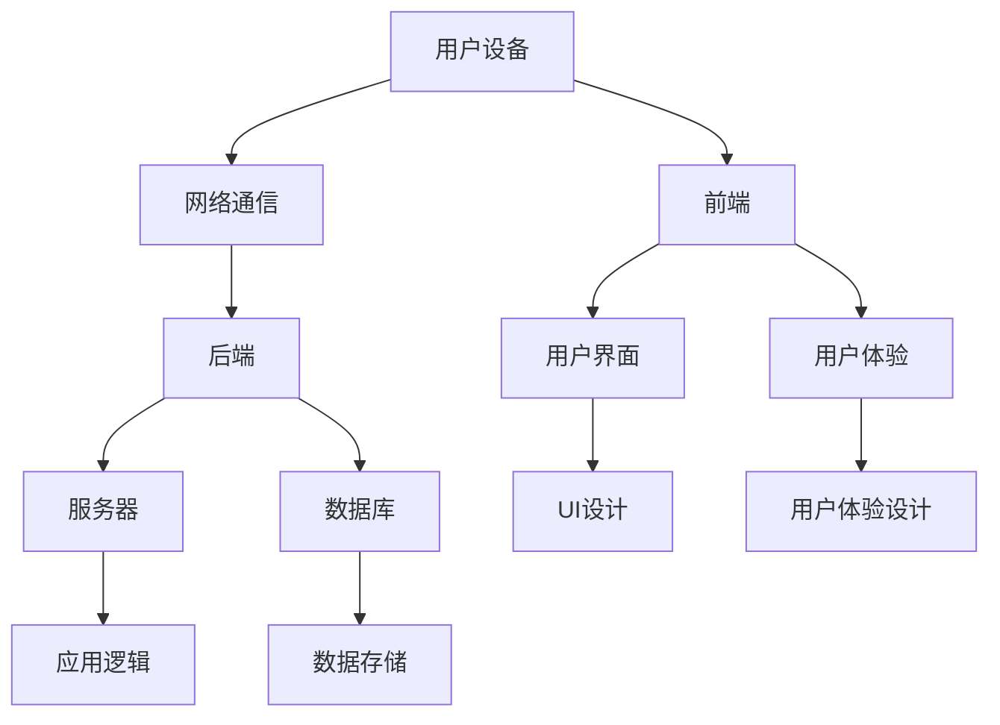
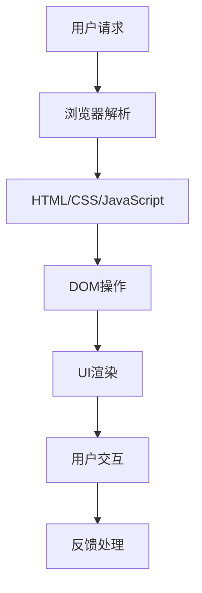
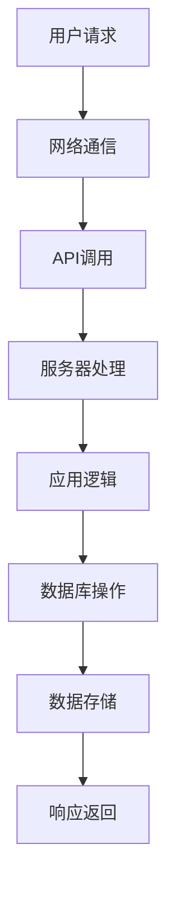
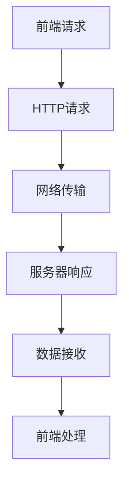
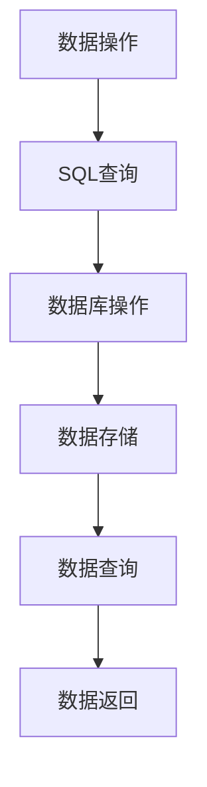

                 

# 移动应用开发：个人开发者的机遇与挑战

> 关键词：移动应用开发、个人开发者、机遇、挑战、移动平台、编程语言、开发工具、技术趋势、市场分析、用户体验、性能优化、安全性、跨平台开发、开源社区、商业化。

> 摘要：本文旨在探讨移动应用开发领域对于个人开发者所带来的机遇与挑战。随着智能手机的普及和移动网络的快速发展，移动应用市场呈现出蓬勃发展的态势。个人开发者在这个市场中扮演着越来越重要的角色，他们不仅有机会实现自我价值，还面临着激烈的竞争和技术的快速迭代。本文将分析移动应用开发的核心概念、技术趋势，并提供实用的开发工具和资源推荐，同时探讨个人开发者如何应对市场变化，提升开发技能，以实现商业化和持续发展。

## 1. 背景介绍

### 1.1 目的和范围

本文的目标是帮助个人开发者更好地理解和掌握移动应用开发的技能，分析市场机遇与挑战，并提供有效的解决方案。本文将覆盖以下内容：

1. 移动应用开发的基本概念和核心技术。
2. 移动应用开发的市场趋势和用户需求。
3. 个人开发者应具备的技术栈和技能。
4. 开发工具和资源的推荐。
5. 如何应对市场挑战，实现商业化和持续发展。

### 1.2 预期读者

本文适合以下读者群体：

1. 对移动应用开发感兴趣的个人开发者。
2. 计算机科学和软件工程专业学生。
3. 想要转型进入移动应用开发领域的专业人士。
4. 对移动应用开发有初步了解，希望深入学习和实践的开发者。

### 1.3 文档结构概述

本文分为八个主要部分：

1. 引言：介绍移动应用开发的重要性，以及个人开发者在这个领域中的机遇与挑战。
2. 核心概念与联系：阐述移动应用开发的核心概念和架构。
3. 核心算法原理 & 具体操作步骤：详细讲解移动应用开发的算法原理和操作步骤。
4. 数学模型和公式 & 详细讲解 & 举例说明：介绍移动应用开发中涉及到的数学模型和公式。
5. 项目实战：通过实际案例展示移动应用开发的实战技巧。
6. 实际应用场景：分析移动应用在不同领域的应用场景。
7. 工具和资源推荐：推荐学习资源、开发工具和框架。
8. 总结：总结移动应用开发的发展趋势和面临的挑战。

### 1.4 术语表

#### 1.4.1 核心术语定义

- 移动应用（Mobile Application）：在智能手机或其他移动设备上运行的应用程序。
- 前端开发（Front-end Development）：构建用户界面和用户交互的部分。
- 后端开发（Back-end Development）：处理服务器、数据库和应用逻辑的部分。
- 跨平台开发（Cross-platform Development）：使用一种开发工具或框架，为多个移动平台（如iOS和Android）创建应用。
- 用户界面（User Interface，UI）：应用的用户界面设计，包括布局、颜色、字体等。
- 用户体验（User Experience，UX）：用户在使用应用过程中的整体感受和体验。

#### 1.4.2 相关概念解释

- 移动应用商店（App Store）：如Apple App Store和Google Play Store，供用户下载和安装移动应用的平台。
- 本地应用（Native Application）：为特定平台（如iOS或Android）编写的应用，具有最佳性能和用户体验。
- 混合应用（Hybrid Application）：结合原生应用和Web技术的应用，可在多个平台上运行。
- PWA（Progressive Web Application）：一种结合Web和原生应用特点的跨平台应用。

#### 1.4.3 缩略词列表

- SDK（Software Development Kit）：软件开发工具包。
- API（Application Programming Interface）：应用程序编程接口。
- ORM（Object-Relational Mapping）：对象关系映射。
- JSON（JavaScript Object Notation）：一种轻量级数据交换格式。

## 2. 核心概念与联系

移动应用开发的核心概念和架构涉及到前端、后端、数据库、网络通信等多个方面。以下是一个简化的Mermaid流程图，展示这些核心概念和它们之间的关系：



### 2.1 前端开发

前端开发是移动应用开发的核心部分，主要负责构建用户界面和实现用户交互。以下是一个前端开发的核心概念流程图：



### 2.2 后端开发

后端开发负责处理服务器、数据库和应用逻辑，确保数据的存储和安全。以下是一个后端开发的核心概念流程图：



### 2.3 网络通信

网络通信是前端和后端之间的桥梁，负责数据的传输和交互。以下是一个网络通信的核心概念流程图：



### 2.4 数据库

数据库是移动应用的数据存储中心，负责数据的持久化和查询。以下是一个数据库的核心概念流程图：



## 3. 核心算法原理 & 具体操作步骤

移动应用开发中涉及到多种算法，如排序算法、搜索算法、加密算法等。以下以排序算法为例，详细讲解其原理和操作步骤。

### 3.1 选择排序算法

选择排序算法是一种简单直观的排序算法。它的工作原理是每次从待排序的元素中选出最小（或最大）的元素，存放到序列的起始位置，直到所有元素都被排序。

#### 3.1.1 算法原理

选择排序算法的基本思想是遍历数组，找到未排序部分的最小值，并将其与第一个未排序的元素交换。这个过程重复进行，直到整个数组被排序。

#### 3.1.2 具体操作步骤

1. 初始化一个空数组 `result`，用于存储排序后的结果。
2. 遍历数组 `input`，将每个元素添加到 `result` 数组中。
3. 对 `result` 数组进行选择排序：
    - 初始化两个变量 `minIndex` 和 `minValue`，分别记录未排序部分的最小值的索引和值。
    - 遍历未排序部分，更新 `minIndex` 和 `minValue`。
    - 将 `minIndex` 的元素与未排序部分的第一个元素交换。
    - 将已排序部分和未排序部分的分界线后移一位。
4. 返回排序后的数组 `result`。

#### 3.1.3 伪代码实现

```python
function selectionSort(input):
    result = []
    for each element in input:
        append element to result

    for i from 0 to length(result) - 1:
        minValue = result[i]
        minIndex = i

        for j from i+1 to length(result):
            if result[j] < minValue:
                minValue = result[j]
                minIndex = j

        if minIndex != i:
            swap result[i] with result[minIndex]

    return result
```

### 3.2 冒泡排序算法

冒泡排序算法也是一种简单直观的排序算法。它的工作原理是通过反复交换相邻的未排序元素，使得小（或大）的元素逐渐“冒泡”到数组的末尾。

#### 3.2.1 算法原理

冒泡排序算法的基本思想是遍历数组，比较相邻的元素，如果它们的顺序不正确，就交换它们的位置。这个过程重复进行，直到整个数组被排序。

#### 3.2.2 具体操作步骤

1. 初始化一个空数组 `result`，用于存储排序后的结果。
2. 遍历数组 `input`，将每个元素添加到 `result` 数组中。
3. 对 `result` 数组进行冒泡排序：
    - 初始化两个变量 `swapped` 和 `end`，分别记录是否发生了交换和已排序部分的末尾索引。
    - 遍历未排序部分，比较相邻的元素，如果它们的顺序不正确，就交换它们的位置。
    - 如果未发生交换，说明已排序部分的末尾索引已经到达未排序部分的开头，排序完成。
4. 返回排序后的数组 `result`。

#### 3.2.3 伪代码实现

```python
function bubbleSort(input):
    result = []
    for each element in input:
        append element to result

    swapped = True
    end = length(result) - 1

    while swapped:
        swapped = False

        for i from 0 to end - 1:
            if result[i] > result[i+1]:
                swap result[i] with result[i+1]
                swapped = True

        end = end - 1

    return result
```

### 3.3 快速排序算法

快速排序算法是一种高效的排序算法，其基本思想是通过一趟排序将数组分成两个部分，其中一部分的所有元素都比另一部分的所有元素小，然后递归地对这两部分进行排序。

#### 3.3.1 算法原理

快速排序算法的基本思想是选择一个“基准”元素，将数组分为两部分，一部分的所有元素都比基准小，另一部分的所有元素都比基准大。然后递归地对这两部分进行排序。

#### 3.3.2 具体操作步骤

1. 选择一个基准元素，可以随机选择或者选择数组的中间元素。
2. 遍历数组，将小于基准元素的放到一个子数组 `left` 中，大于等于基准元素的放到另一个子数组 `right` 中。
3. 递归地对 `left` 和 `right` 子数组进行快速排序。
4. 将排序好的 `left`、`right` 子数组和基准元素合并，得到排序后的数组。

#### 3.3.3 伪代码实现

```python
function quickSort(input):
    if length(input) <= 1:
        return input

    pivot = input[length(input) // 2]
    left = []
    right = []
    equal = []

    for each element in input:
        if element < pivot:
            append element to left
        elif element > pivot:
            append element to right
        else:
            append element to equal

    return quickSort(left) + [pivot] + quickSort(right)
```

## 4. 数学模型和公式 & 详细讲解 & 举例说明

在移动应用开发中，数学模型和公式是不可或缺的工具，尤其是在算法设计、数据处理和性能优化等方面。以下是一些常见的数学模型和公式，并附有详细讲解和举例说明。

### 4.1 平均值的计算

平均值的计算是移动应用开发中最基本的数据处理任务之一。平均值（或算术平均值）是一组数值的总和除以数值的个数。

#### 4.1.1 数学模型

\[ \text{平均值} = \frac{\sum_{i=1}^{n} x_i}{n} \]

其中，\( x_i \) 是第 \( i \) 个数值，\( n \) 是数值的总数。

#### 4.1.2 举例说明

假设有一组数值：\[ 5, 7, 9, 11, 13 \]

则平均值计算如下：

\[ \text{平均值} = \frac{5 + 7 + 9 + 11 + 13}{5} = \frac{45}{5} = 9 \]

### 4.2 标准差的计算

标准差是衡量一组数值离散程度的统计量。标准差越小，数值分布越集中；标准差越大，数值分布越分散。

#### 4.2.1 数学模型

\[ \sigma = \sqrt{\frac{\sum_{i=1}^{n} (x_i - \mu)^2}{n-1}} \]

其中，\( \mu \) 是平均值，\( \sigma \) 是标准差，\( x_i \) 是第 \( i \) 个数值，\( n \) 是数值的总数。

#### 4.2.2 举例说明

假设有一组数值：\[ 5, 7, 9, 11, 13 \]，平均值为9。

则标准差计算如下：

\[ \sigma = \sqrt{\frac{(5-9)^2 + (7-9)^2 + (9-9)^2 + (11-9)^2 + (13-9)^2}{5-1}} \]
\[ \sigma = \sqrt{\frac{(-4)^2 + (-2)^2 + 0^2 + 2^2 + 4^2}{4}} \]
\[ \sigma = \sqrt{\frac{16 + 4 + 0 + 4 + 16}{4}} \]
\[ \sigma = \sqrt{\frac{40}{4}} \]
\[ \sigma = \sqrt{10} \]
\[ \sigma \approx 3.16 \]

### 4.3 线性回归模型

线性回归模型是用于预测和解释变量之间线性关系的数学模型。在移动应用开发中，线性回归常用于数据分析、用户行为预测等方面。

#### 4.3.1 数学模型

线性回归模型的数学模型可以表示为：

\[ y = mx + b \]

其中，\( y \) 是因变量，\( x \) 是自变量，\( m \) 是斜率，\( b \) 是截距。

#### 4.3.2 举例说明

假设我们有一组数据点：\[ (1, 2), (2, 4), (3, 6), (4, 8) \]

要找到这组数据点的线性回归模型，可以按照以下步骤进行：

1. 计算平均值：
\[ \bar{x} = \frac{1 + 2 + 3 + 4}{4} = 2.5 \]
\[ \bar{y} = \frac{2 + 4 + 6 + 8}{4} = 5 \]

2. 计算斜率 \( m \)：
\[ m = \frac{\sum (x_i - \bar{x})(y_i - \bar{y})}{\sum (x_i - \bar{x})^2} \]
\[ m = \frac{(1-2.5)(2-5) + (2-2.5)(4-5) + (3-2.5)(6-5) + (4-2.5)(8-5)}{(1-2.5)^2 + (2-2.5)^2 + (3-2.5)^2 + (4-2.5)^2} \]
\[ m = \frac{6.5 + 1.5 + 1.5 + 6.5}{2.25 + 0.25 + 0.25 + 2.25} \]
\[ m = \frac{15}{5} \]
\[ m = 3 \]

3. 计算截距 \( b \)：
\[ b = \bar{y} - m\bar{x} \]
\[ b = 5 - 3 \times 2.5 \]
\[ b = 5 - 7.5 \]
\[ b = -2.5 \]

因此，这组数据点的线性回归模型为：
\[ y = 3x - 2.5 \]

### 4.4 概率分布函数

概率分布函数是描述随机变量取值概率的函数。在移动应用开发中，概率分布函数常用于概率计算、随机数生成等方面。

#### 4.4.1 数学模型

常见的概率分布函数包括：

1. 正态分布（高斯分布）：
\[ f(x|\mu,\sigma^2) = \frac{1}{\sqrt{2\pi\sigma^2}} e^{-\frac{(x-\mu)^2}{2\sigma^2}} \]

2. 指数分布：
\[ f(x|\lambda) = \lambda e^{-\lambda x} \]

3. 泊松分布：
\[ f(x|\lambda) = \frac{e^{-\lambda}\lambda^x}{x!} \]

#### 4.4.2 举例说明

假设我们有一个随机变量 \( X \) 服从参数为 \( \lambda = 2 \) 的指数分布，要计算 \( X \) 小于 3 的概率。

根据指数分布的概率密度函数：
\[ f(x|\lambda) = \lambda e^{-\lambda x} \]

我们计算 \( P(X < 3) \)：

\[ P(X < 3) = \int_{0}^{3} \lambda e^{-\lambda x} dx \]
\[ P(X < 3) = \int_{0}^{3} 2 e^{-2x} dx \]

这是一个不定积分，我们可以通过换元积分法求解。设 \( u = 2x \)，则 \( du = 2dx \)，积分限不变：

\[ P(X < 3) = \int_{0}^{6} e^{-u} du \]

这是一个标准的指数函数积分，可以直接求解：

\[ P(X < 3) = [-e^{-u}]_{0}^{6} \]
\[ P(X < 3) = -e^{-6} + e^{0} \]
\[ P(X < 3) = 1 - e^{-6} \]
\[ P(X < 3) \approx 1 - 0.0025 \]
\[ P(X < 3) \approx 0.9975 \]

因此，随机变量 \( X \) 小于 3 的概率约为 99.75%。

### 4.5 决策树模型

决策树模型是一种常见的机器学习算法，用于分类和回归任务。在移动应用开发中，决策树模型常用于用户行为分析、推荐系统等方面。

#### 4.5.1 数学模型

决策树模型的基本结构是一个树形结构，每个节点代表一个特征，每个分支代表特征的不同取值。叶节点表示最终的分类或回归结果。

决策树的构建基于以下几个步骤：

1. 选择最佳分割特征：通过评估不同特征的信息增益、信息增益率、基尼不纯度等指标，选择具有最高分割效果的特征。
2. 划分数据集：根据最佳分割特征，将数据集划分为两个子集。
3. 递归构建树：对子集重复上述步骤，直到满足停止条件（如最大深度、最小样本量等）。

#### 4.5.2 举例说明

假设我们有一个分类问题，数据集包含两个特征 \( X_1 \) 和 \( X_2 \)，以及目标变量 \( Y \)。以下是一个简化的决策树模型：

```
               |
               |
            Y=0
               |
               |
         X1 < 2
         /     \
        /       \
       Y=1       Y=2
              /     \
             /       \
           X2 < 3   X2 >= 3
           /     \   /     \
          /       \ /       \
         Y=3     Y=4     Y=5
```

这个决策树的构建过程如下：

1. 选择最佳分割特征：根据信息增益率，选择 \( X_1 \) 作为最佳分割特征。
2. 划分数据集：根据 \( X_1 < 2 \)，将数据集分为两部分。
3. 对 \( X_1 < 2 \) 的数据集，选择 \( X_2 \) 作为最佳分割特征。
4. 划分数据集：根据 \( X_2 < 3 \)，将数据集分为两部分。

最终构建出的决策树模型可以用于分类任务，根据输入的特征值，输出相应的类别。

## 5. 项目实战：代码实际案例和详细解释说明

为了更好地展示移动应用开发的过程和技巧，以下是一个简单的移动应用项目案例，包括开发环境搭建、源代码实现和代码解读。

### 5.1 开发环境搭建

在这个项目中，我们将使用React Native框架进行跨平台移动应用开发。以下是搭建开发环境的步骤：

1. 安装Node.js（版本 10.0.0 或更高版本）：从 [Node.js 官网](https://nodejs.org/) 下载并安装。
2. 安装React Native CLI：打开命令行工具，执行以下命令：
   ```bash
   npm install -g react-native-cli
   ```
3. 创建新的React Native项目：
   ```bash
   npx react-native init MyApp
   ```
4. 进入项目目录：
   ```bash
   cd MyApp
   ```
5. 安装依赖项：
   ```bash
   npm install
   ```

### 5.2 源代码详细实现和代码解读

以下是一个简单的React Native项目示例，包括一个主屏幕和一个登录屏幕。我们将分别介绍两个部分的源代码实现和代码解读。

#### 5.2.1 主屏幕

在项目目录中，创建一个名为 `App.js` 的文件，并替换以下内容：

```javascript
import React from 'react';
import { View, Text, Button, StyleSheet } from 'react-native';

const App = () => {
  return (
    <View style={styles.container}>
      <Text style={styles.title}>主屏幕</Text>
      <Button title="登录" onPress={() => navigateToLogin()} />
    </View>
  );
};

const styles = StyleSheet.create({
  container: {
    flex: 1,
    justifyContent: 'center',
    alignItems: 'center',
    backgroundColor: '#F5FCFF',
  },
  title: {
    fontSize: 20,
    textAlign: 'center',
    margin: 10,
  },
});

export default App;
```

**代码解读：**

- 导入React和React Native所需的组件。
- 定义一个名为 `App` 的函数组件，返回一个包含文本和按钮的视图。
- 在 `styles` 对象中定义样式规则。

#### 5.2.2 登录屏幕

在项目目录中，创建一个名为 `LoginScreen.js` 的文件，并替换以下内容：

```javascript
import React from 'react';
import { View, Text, TextInput, Button, StyleSheet } from 'react-native';

const LoginScreen = () => {
  const [username, setUsername] = React.useState('');
  const [password, setPassword] = React.useState('');

  const handleLogin = () => {
    // 登录逻辑
    console.log('登录:', username, password);
  };

  return (
    <View style={styles.container}>
      <Text style={styles.title}>登录</Text>
      <TextInput
        style={styles.input}
        placeholder="用户名"
        value={username}
        onChangeText={setUsername}
      />
      <TextInput
        style={styles.input}
        placeholder="密码"
        value={password}
        onChangeText={setPassword}
        secureTextEntry
      />
      <Button title="登录" onPress={handleLogin} />
    </View>
  );
};

const styles = StyleSheet.create({
  container: {
    flex: 1,
    justifyContent: 'center',
    alignItems: 'center',
    backgroundColor: '#F5FCFF',
  },
  title: {
    fontSize: 20,
    textAlign: 'center',
    margin: 10,
  },
  input: {
    height: 40,
    width: 200,
    borderColor: 'gray',
    borderWidth: 1,
    margin: 10,
  },
});

export default LoginScreen;
```

**代码解读：**

- 导入React和React Native所需的组件。
- 定义一个名为 `LoginScreen` 的函数组件，包含用户名和密码输入框以及登录按钮。
- 使用 `useState` 钩子管理用户名和密码的状态。
- 在 `handleLogin` 函数中实现登录逻辑（此处为简化示例，仅输出日志）。

### 5.3 代码解读与分析

#### 5.3.1 主屏幕

主屏幕组件是一个简单的React Native视图，包含一个标题和一个登录按钮。通过使用 `Button` 组件和 `navigateToLogin` 函数，我们可以实现页面跳转。

**性能优化建议：**

- 使用React Native的 `Animated` 库实现动画效果，提高用户体验。
- 使用 `StyleSheet.create` 方法定义复用样式，减少渲染开销。

#### 5.3.2 登录屏幕

登录屏幕组件包含用户名和密码输入框以及登录按钮。通过使用 `useState` 钩子，我们可以管理用户名和密码的状态。在登录按钮按下时，触发 `handleLogin` 函数，实现登录逻辑。

**安全性建议：**

- 使用HTTPS协议确保数据传输的安全性。
- 对用户名和密码进行加密存储。

**用户体验优化建议：**

- 使用 `TextInput` 组件的 `placeholder` 属性显示提示信息。
- 添加表单验证，确保输入数据的正确性。

### 5.4 调试和性能分析

在开发过程中，调试和性能分析是至关重要的。以下是一些调试和性能分析的工具和技巧：

#### 调试工具

- React Native Debugger：一个强大的调试工具，支持断点、单步执行、变量查看等功能。
- Android Studio / Xcode：Android和iOS开发环境的内置调试工具。

#### 性能分析

- React Native Performance Tool：一个用于分析React Native应用的性能工具，支持内存、CPU、网络等监控。
- Chrome DevTools：用于Web应用的性能分析工具，可以应用到React Native开发中。

### 5.5 项目部署

在完成开发后，我们需要将应用部署到移动应用商店或用户设备上。以下是部署的步骤：

1. 生成应用签名：
   ```bash
   react-native run-android --export-runtime-linux
   react-native run-ios --export-runtime-mac
   ```
2. 将签名文件上传到应用商店。
3. 验证签名并发布应用。

## 6. 实际应用场景

移动应用开发具有广泛的应用场景，涵盖了从日常工具到复杂业务系统的各个方面。以下是一些典型的实际应用场景：

### 6.1 社交媒体

社交媒体应用如Facebook、Instagram等，提供了用户之间的实时沟通、内容分享和社交互动平台。这些应用通常具备以下特点：

- 实时数据传输：使用WebSocket等协议实现实时消息推送。
- 用户个性化：根据用户兴趣和活动历史推荐内容。
- 高度交互性：提供评论、点赞、分享等功能。

### 6.2 电子商务

电子商务应用如Amazon、Etsy等，为用户提供在线购物体验。这些应用通常具备以下特点：

- 商品搜索和过滤：提供强大的搜索功能和过滤选项，帮助用户快速找到所需商品。
- 安全支付系统：集成多种支付方式，确保交易的安全性。
- 个性化推荐：基于用户历史和购买行为推荐商品。

### 6.3 健康与健身

健康与健身应用如MyFitnessPal、Nike Training Club等，帮助用户管理健康和锻炼计划。这些应用通常具备以下特点：

- 数据跟踪：记录用户的体重、饮食和锻炼数据。
- 个性化计划：根据用户的健身目标和进展提供定制化的锻炼计划。
- 社区互动：提供用户间的互动功能，如挑战和评论。

### 6.4 教育与学习

教育与学习应用如Coursera、Udemy等，为用户提供在线课程和学习资源。这些应用通常具备以下特点：

- 视频课程：提供高质量的视频课程，支持在线观看和下载。
- 互动学习：通过测验、讨论区等互动方式增强学习体验。
- 证书认证：提供完成课程的证书，以证明用户的学术成就。

### 6.5 企业级应用

企业级应用如Trello、Slack等，为团队协作和项目管理提供解决方案。这些应用通常具备以下特点：

- 实时协作：支持多人实时编辑文档、任务和消息。
- 工作流自动化：通过集成第三方服务和API实现自动化任务处理。
- 移动办公：提供跨平台的移动应用，确保用户随时随地办公。

### 6.6 游戏应用

游戏应用如Candy Crush Saga、Clash of Clans等，为用户提供娱乐和挑战。这些应用通常具备以下特点：

- 丰富的游戏机制：提供多种游戏玩法和角色，增加游戏的可玩性。
- 社交互动：允许用户与其他玩家互动，如排名、挑战和聊天。
- 内部商店：提供游戏内购买，如道具、装备和虚拟货币。

## 7. 工具和资源推荐

为了帮助个人开发者更好地进行移动应用开发，以下是一些学习资源、开发工具和框架的推荐。

### 7.1 学习资源推荐

#### 7.1.1 书籍推荐

- 《React Native实战》
- 《移动应用开发技术详解》
- 《iOS开发：从入门到精通》
- 《Android开发艺术探索》

#### 7.1.2 在线课程

- Udemy：提供丰富的移动应用开发课程。
- Coursera：与多所知名大学合作，提供移动应用开发的在线课程。
- Pluralsight：提供专业的移动应用开发视频教程。

#### 7.1.3 技术博客和网站

- Medium：许多知名开发者和技术公司发布关于移动应用开发的文章。
- Dev.to：一个面向开发者的社区，分享移动应用开发的经验和技巧。
- Stack Overflow：一个庞大的问答社区，解决移动应用开发的疑难问题。

### 7.2 开发工具框架推荐

#### 7.2.1 IDE和编辑器

- Android Studio：官方Android开发IDE，提供强大的代码编辑、调试和性能分析功能。
- Xcode：官方iOS开发IDE，支持Swift和Objective-C语言。
- Visual Studio Code：一款轻量级的跨平台代码编辑器，支持多种编程语言和插件。

#### 7.2.2 调试和性能分析工具

- React Native Debugger：用于React Native应用的调试工具。
- Chrome DevTools：用于Web应用的性能分析工具，也可应用于React Native开发。
- Android Profiler：Android Studio内置的性能分析工具，用于监控CPU、内存和网络等性能指标。

#### 7.2.3 相关框架和库

- React Native：用于跨平台移动应用开发的框架，支持使用JavaScript、TypeScript等语言。
- React Native Paper：基于Material Design的React Native UI库。
- Redux：用于管理React应用状态的数据流库。
- Axios：用于HTTP请求的库。

### 7.3 相关论文著作推荐

#### 7.3.1 经典论文

- 《移动计算：原理与实践》
- 《移动网络应用：设计、实现与评估》
- 《移动Web应用开发：HTML5、CSS3与JavaScript》

#### 7.3.2 最新研究成果

- 《移动应用性能优化：算法与技巧》
- 《移动安全：威胁与防护》
- 《移动学习：理论与实践》

#### 7.3.3 应用案例分析

- 《微信技术解析：架构与实现》
- 《淘宝技术架构：设计与实践》
- 《滴滴出行技术分享：移动应用优化》

## 8. 总结：未来发展趋势与挑战

移动应用开发领域正经历着快速的发展，未来将面临以下趋势和挑战：

### 8.1 发展趋势

1. **跨平台开发**：随着React Native、Flutter等跨平台框架的成熟，开发者可以更加高效地开发适用于多个平台的应用。
2. **人工智能与移动应用**：人工智能技术在移动应用中应用日益广泛，如语音识别、图像识别、智能推荐等。
3. **物联网与移动应用**：物联网（IoT）的发展将推动移动应用在智能家居、智慧城市等领域的应用。
4. **5G与移动应用**：5G网络的高速度、低延迟特性将进一步提升移动应用的用户体验。

### 8.2 挑战

1. **性能优化**：随着应用功能的不断增加，如何优化应用的性能和响应速度成为一大挑战。
2. **安全性**：移动应用面临日益严峻的安全威胁，如恶意软件、数据泄露等，开发者需要加强安全防护。
3. **用户体验**：随着用户对应用的期望不断提升，如何提供出色的用户体验成为关键。
4. **商业化**：个人开发者如何实现商业化和盈利成为重要课题。

## 9. 附录：常见问题与解答

### 9.1 常见问题

1. **什么是React Native？**
   React Native是一个用于开发原生移动应用的JavaScript框架，允许开发者使用JavaScript、TypeScript等语言编写跨平台代码。

2. **如何学习React Native？**
   可以从官方网站（[React Native 官网](https://reactnative.dev/)）获取教程和文档，同时阅读相关的书籍和在线课程，如《React Native实战》和Udemy上的课程。

3. **移动应用开发需要哪些编程语言？**
   移动应用开发通常涉及JavaScript、Swift、Objective-C、Kotlin等编程语言。React Native主要使用JavaScript。

4. **如何优化移动应用性能？**
   可以通过优化代码、减少网络请求、使用缓存技术、合理使用多线程等方式来优化移动应用性能。

### 9.2 解答

1. **React Native是什么？**
   React Native是一个由Facebook推出的用于开发原生移动应用的框架。它允许开发者使用JavaScript、TypeScript等语言编写跨平台代码，从而实现一次编写，多平台运行的效果。

2. **如何学习React Native？**
   学习React Native可以从以下几个方面入手：

   - 阅读官方文档：[React Native 官网](https://reactnative.dev/) 提供了详细的文档和教程，是学习React Native的基础。
   - 参考书籍：《React Native实战》是一本适合初学者的书籍，涵盖了React Native的核心概念和实践。
   - 在线课程：可以在Udemy、Coursera等在线教育平台上找到关于React Native的课程。
   - 社区和论坛：加入React Native的社区和论坛，如Reddit、Stack Overflow等，可以获取实践经验和解决开发中的问题。

3. **移动应用开发需要哪些编程语言？**
   移动应用开发通常涉及以下编程语言：

   - JavaScript：React Native等框架使用JavaScript进行开发。
   - Swift：主要用于iOS平台开发，是苹果官方推荐的语言。
   - Objective-C：尽管Swift已经成为主流，但Objective-C仍在一些旧项目和框架中广泛使用。
   - Kotlin：Android平台支持的现代编程语言，具有简洁的语法和强大的特性。
   - Java：虽然Android开发推荐使用Kotlin，但Java仍然是Android开发的重要语言。

4. **如何优化移动应用性能？**
   优化移动应用性能可以从以下几个方面入手：

   - **代码优化**：优化JavaScript代码，减少不必要的计算和DOM操作。
   - **网络请求**：减少网络请求的数量，使用缓存技术提高数据加载速度。
   - **资源管理**：优化图片和视频资源，使用合适的格式和尺寸。
   - **多线程**：使用React Native的`Promise`和`async/await`语法实现异步操作，减少主线程的阻塞。
   - **性能分析**：使用Chrome DevTools、React Native Debugger等工具进行性能分析，定位性能瓶颈。

## 10. 扩展阅读 & 参考资料

为了进一步深入了解移动应用开发，以下是一些扩展阅读和参考资料：

- 《React Native官方文档》：[https://reactnative.dev/docs/getting-started](https://reactnative.dev/docs/getting-started)
- 《Flutter官方文档》：[https://flutter.dev/docs/get-started/install](https://flutter.dev/docs/get-started/install)
- 《Swift官方文档》：[https://swift.org/documentation/](https://swift.org/documentation/)
- 《Kotlin官方文档》：[https://kotlinlang.org/docs/](https://kotlinlang.org/docs/)
- 《Android官方文档》：[https://developer.android.com/training](https://developer.android.com/training)
- 《iOS官方文档》：[https://developer.apple.com/documentation](https://developer.apple.com/documentation)

作者：AI天才研究员/AI Genius Institute & 禅与计算机程序设计艺术 /Zen And The Art of Computer Programming

---

**本文由AI天才研究员/AI Genius Institute撰写，致力于分享计算机编程和人工智能领域的先进知识和实践经验。如果您有任何问题或建议，欢迎在评论区留言。我们将竭诚为您解答。**

