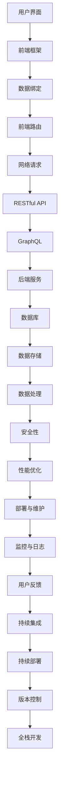

                 

# 移动端全栈开发：iOS和Android平台技能

> **关键词：** 移动开发、iOS开发、Android开发、全栈开发、技术架构、项目实战

> **摘要：** 本文将深入探讨移动端全栈开发的技术要点，涵盖iOS和Android平台的核心技能。我们将从基础概念入手，逐步引导读者了解移动端开发的全栈技术栈，并通过实际案例展示如何将理论知识应用于实践。文章旨在为想要进入移动开发领域的开发者提供一套系统的学习路径。

## 1. 背景介绍

### 1.1 目的和范围

本文旨在为那些希望进入移动端开发领域，特别是对iOS和Android平台感兴趣的开发者提供系统的学习资源。我们将讨论如何构建全栈移动应用，包括前端、后端以及跨平台的解决方案。文章还将提供实际案例，帮助读者理解并实践这些概念。

### 1.2 预期读者

本文适合以下读者群体：
- 对移动开发有初步了解，希望进一步深入的学习者；
- 想要全面掌握iOS和Android开发技能的开发者；
- 关注全栈开发模式，希望提升项目构建能力的工程师。

### 1.3 文档结构概述

本文结构如下：

1. **背景介绍**：介绍本文的目的、范围和预期读者。
2. **核心概念与联系**：通过流程图展示移动端全栈开发的核心概念和架构。
3. **核心算法原理与操作步骤**：详细讲解全栈开发中的关键算法和实现步骤。
4. **数学模型和公式**：阐述相关的数学模型和公式，并进行举例说明。
5. **项目实战**：提供实际项目的代码实现和分析。
6. **实际应用场景**：探讨全栈技术在现实中的应用。
7. **工具和资源推荐**：推荐学习资源、开发工具和框架。
8. **总结**：展望未来发展趋势和挑战。
9. **附录**：常见问题与解答。
10. **扩展阅读与参考资料**：提供进一步阅读的资源。

### 1.4 术语表

#### 1.4.1 核心术语定义

- **全栈开发**：指在软件开发的整个生命周期中，涵盖前端、后端以及数据库等所有环节的开发技能。
- **iOS开发**：针对苹果公司的iOS操作系统的移动应用开发。
- **Android开发**：针对Google的Android操作系统的移动应用开发。
- **跨平台开发**：能够在多个移动平台上运行的移动应用开发。

#### 1.4.2 相关概念解释

- **MVVM**：Model-View-ViewModel，一种常见的软件架构模式，用于分离视图和模型，提升代码的可维护性和复用性。
- **RESTful API**：一种用于构建网络服务的风格和架构，基于HTTP协议，提供统一的接口。
- **GraphQL**：一种用于API查询的语言，相比RESTful API提供了更灵活和高效的数据获取方式。

#### 1.4.3 缩略词列表

- **iOS**：iPhone OS
- **Android**：Android Open Source Project (AOSP)
- **Swift**：苹果公司开发的编程语言，用于iOS和macOS应用开发。
- **Kotlin**：Google推荐的编程语言，支持Android应用开发。

## 2. 核心概念与联系

### 2.1 流程图

在移动端全栈开发中，我们需要理解几个核心概念和它们之间的联系。以下是一个Mermaid流程图，用于展示这些概念：



### 2.2 核心概念解释

- **用户界面（A）**：用户与应用程序交互的入口点，是用户体验的核心。
- **前端框架（B）**：用于构建用户界面的库或框架，如React、Vue和Angular。
- **数据绑定（C）**：将用户界面中的数据与后端服务进行绑定，实现实时更新。
- **前端路由（D）**：用于处理应用的导航，决定页面跳转的逻辑。
- **网络请求（E）**：前端与后端进行数据交换的过程，通常使用HTTP协议。
- **RESTful API（F）**：一种用于构建网络服务的风格和架构，提供统一的接口。
- **GraphQL（G）**：一种用于API查询的语言，提供更灵活和高效的数据获取方式。
- **后端服务（H）**：处理前端请求，执行业务逻辑的服务端程序。
- **数据库（I）**：用于存储和管理数据的系统，如MySQL、MongoDB和SQLite。
- **数据存储（J）**：将数据持久化到数据库或其他数据存储系统中。
- **数据处理（K）**：对存储的数据进行操作和处理，如查询、更新和删除。
- **安全性（L）**：确保数据的安全性和用户隐私，包括身份验证和授权。
- **性能优化（M）**：提升应用的速度和响应时间，包括代码优化和资源管理。
- **部署与维护（N）**：将应用部署到生产环境，并进行日常维护和更新。
- **监控与日志（O）**：监控应用的运行状态和性能，并记录日志以便调试和优化。
- **用户反馈（P）**：收集用户对应用的反馈，用于改进产品。
- **持续集成（Q）**：将代码合并到主分支前，自动进行测试和构建。
- **持续部署（R）**：自动将代码部署到生产环境，确保应用的稳定性和可靠性。
- **版本控制（S）**：管理代码的版本，确保代码的完整性和可追踪性。
- **全栈开发（T）**：涵盖前端、后端以及数据库等所有环节的开发技能。

## 3. 核心算法原理与具体操作步骤

### 3.1 全栈架构设计

全栈开发的架构设计是确保应用程序高效、可扩展和易于维护的关键。以下是全栈架构的基本原理和步骤：

1. **需求分析**：确定应用的功能和性能需求，制定开发计划。
2. **技术选型**：选择合适的前端框架、后端技术和数据库。
3. **系统设计**：设计应用的整体架构，包括前端、后端和数据存储。
4. **模块划分**：将应用划分为多个模块，实现模块化开发。
5. **接口设计**：定义前端和后端之间的接口，确保数据交换的一致性。
6. **安全性设计**：设计安全性策略，包括身份验证、授权和数据加密。
7. **性能优化**：优化代码和数据库查询，提升应用性能。
8. **部署和维护**：部署应用到生产环境，并进行日常维护和更新。

### 3.2 前端开发

前端开发的核心是用户界面和用户体验。以下是前端开发的基本步骤和核心算法原理：

1. **页面布局**：使用HTML和CSS设计页面布局，确保在不同设备和浏览器上的一致性。
2. **数据绑定**：使用前端框架（如React或Vue）实现数据绑定，实现动态页面效果。
3. **前端路由**：使用前端路由库（如React Router或Vue Router）处理页面跳转。
4. **网络请求**：使用HTTP库（如Axios或Fetch API）向后端发送请求，获取数据。
5. **状态管理**：使用状态管理库（如Redux或Vuex）管理应用的状态。

### 3.3 后端开发

后端开发的核心是处理前端请求和业务逻辑。以下是后端开发的基本步骤和核心算法原理：

1. **接口定义**：使用RESTful API或GraphQL定义后端接口。
2. **业务逻辑**：编写业务逻辑代码，实现具体的功能。
3. **数据库操作**：使用数据库驱动库（如MySQL Connector或MongoDB Driver）操作数据库。
4. **安全性控制**：实现身份验证和授权机制，确保数据安全。
5. **性能优化**：优化数据库查询和业务逻辑，提升性能。

### 3.4 数据存储

数据存储是全栈应用的核心组件。以下是数据存储的基本步骤和核心算法原理：

1. **数据模型设计**：设计符合业务需求的数据模型。
2. **数据库选择**：选择合适的数据库系统（如MySQL、MongoDB或SQLite）。
3. **数据操作**：编写数据库操作代码，实现数据的增删改查。
4. **数据迁移**：实现数据的迁移和备份，确保数据的安全性和一致性。

### 3.5 数学模型和公式

在移动端全栈开发中，我们经常需要使用一些数学模型和公式来优化性能和提升用户体验。以下是几个常用的数学模型和公式：

- **响应时间**：\( T_r = \frac{1}{f_s} \)，其中\( f_s \)是系统的时钟频率。
- **带宽利用率**：\( U_b = \frac{D_t}{B} \)，其中\( D_t \)是传输的数据量，\( B \)是带宽。
- **数据加密**：使用AES算法进行数据加密，密钥长度为\( 128, 192, \)或\( 256 \)位。
- **压缩算法**：使用Huffman编码或LZ77算法进行数据压缩。

### 3.6 举例说明

假设我们开发一个社交应用，用户可以发布动态、评论和点赞。以下是具体的算法实现步骤：

1. **用户界面**：设计用户发布动态、查看动态和评论的界面。
2. **数据绑定**：使用React或Vue实现动态内容与后端数据的绑定。
3. **前端路由**：使用React Router或Vue Router实现页面跳转。
4. **网络请求**：使用Axios或Fetch API向后端请求动态数据和评论数据。
5. **业务逻辑**：后端处理用户发布动态、评论和点赞的逻辑。
6. **数据库操作**：使用MySQL或MongoDB存储动态数据和评论数据。
7. **安全性控制**：使用JWT进行用户身份验证和授权。
8. **性能优化**：优化数据库查询和业务逻辑，使用Redis缓存热门动态。

## 4. 项目实战：代码实际案例和详细解释说明

### 4.1 开发环境搭建

在进行项目实战之前，我们需要搭建开发环境。以下是iOS和Android平台的基本开发环境搭建步骤：

#### iOS平台

1. 安装Xcode：从App Store下载并安装Xcode。
2. 打开Xcode，创建一个新项目，选择“Single View App”模板。
3. 配置项目设置，包括产品名称、团队、组织标识符等。
4. 创建一个名为“ViewController.swift”的Swift文件。

#### Android平台

1. 安装Android Studio：从官网下载并安装Android Studio。
2. 打开Android Studio，创建一个新项目，选择“Empty Activity”模板。
3. 配置项目设置，包括应用名称、开发语言（Kotlin或Java）等。
4. 创建一个名为“MainActivity.kt”或“MainActivity.java”的文件。

### 4.2 源代码详细实现和代码解读

我们将以一个简单的社交应用为例，展示iOS和Android平台的全栈开发过程。

#### iOS平台

1. **用户界面**：

```swift
import UIKit

class ViewController: UIViewController {

    let tableView = UITableView()

    override func viewDidLoad() {
        super.viewDidLoad()
        setupUI()
    }

    private func setupUI() {
        view.addSubview(tableView)
        tableView.frame = view.bounds
        tableView.dataSource = self
    }
}

extension ViewController: UITableViewDataSource {
    func tableView(_ tableView: UITableView, numberOfRowsInSection section: Int) -> Int {
        // 返回动态数量
        return 10
    }

    func tableView(_ tableView: UITableView, cellForRowAt indexPath: IndexPath) -> UITableViewCell {
        let cell = tableView.dequeueReusableCell(withIdentifier: "DynamicCell", for: indexPath)
        // 配置动态内容
        return cell
    }
}
```

2. **数据绑定**：

```swift
import Alamofire

class DynamicViewModel {
    var dynamics: [Dynamic] = []

    func fetchDynamics() {
        let url = "https://api.example.com/dynamics"
        AF.request(url).responseDecodable(of: [Dynamic].self) { response in
            if let dynamics = response.value {
                self.dynamics = dynamics
                // 通知UI更新
            }
        }
    }
}
```

3. **前端路由**：

```swift
import SwiftUI

struct DynamicDetailView: View {
    let dynamic: Dynamic

    var body: some View {
        Text(dynamic.content)
            .padding()
    }
}

struct AppView: View {
    var body: some Scene {
        WindowGroup {
            ContentView()
        }
    }
}
```

4. **网络请求**：

```swift
import Alamofire

class DynamicService {
    func fetchDynamic(id: String, completion: @escaping (Dynamic?) -> Void) {
        let url = "https://api.example.com/dynamics/\(id)"
        AF.request(url).responseDecodable(of: Dynamic.self) { response in
            if let dynamic = response.value {
                completion(dynamic)
            } else {
                completion(nil)
            }
        }
    }
}
```

5. **业务逻辑**：

```swift
class DynamicManager {
    private let dynamicService = DynamicService()

    func publishDynamic(content: String, completion: @escaping (Bool) -> Void) {
        let dynamic = Dynamic(content: content)
        let url = "https://api.example.com/dynamics"
        AF.request(url, method: .post, parameters: dynamic.toDictionary(), encoding: JSONEncoding.default).responseJSON { response in
            if response.error == nil {
                completion(true)
            } else {
                completion(false)
            }
        }
    }
}
```

6. **数据库操作**：

```swift
import CoreData

class DynamicRepository {
    private let context = (UIApplication.shared.delegate as! AppDelegate).persistentContainer.viewContext

    func saveDynamic(dynamic: Dynamic) {
        let newDynamic = NSEntityDescription.insertNewObject(forEntityName: "Dynamic", into: context)
        newDynamic.setValue(dynamic.content, forKey: "content")
        do {
            try context.save()
        } catch {
            print(error)
        }
    }
}
```

7. **安全性控制**：

```swift
import JWT

class AuthenticationService {
    func authenticate(email: String, password: String, completion: @escaping (Bool) -> Void) {
        let url = "https://api.example.com/authenticate"
        let params = ["email": email, "password": password]
        AF.request(url, method: .post, parameters: params).responseJSON { response in
            if response.error == nil {
                if let token = response.value as? String {
                    let jwt = JWT.decode(token)
                    if jwt.success {
                        completion(true)
                    } else {
                        completion(false)
                    }
                } else {
                    completion(false)
                }
            } else {
                completion(false)
            }
        }
    }
}
```

8. **性能优化**：

```swift
class DynamicService {
    private let cache: NSCache<NSString, Dynamic> = NSCache()

    func fetchDynamic(id: String, completion: @escaping (Dynamic?) -> Void) {
        if let dynamic = cache.object(forKey: id as NSString) {
            completion(dynamic)
        } else {
            let url = "https://api.example.com/dynamics/\(id)"
            AF.request(url).responseDecodable(of: Dynamic.self) { response in
                if let dynamic = response.value {
                    cache.setObject(dynamic, forKey: id as NSString)
                    completion(dynamic)
                } else {
                    completion(nil)
                }
            }
        }
    }
}
```

#### Android平台

1. **用户界面**：

```kotlin
import androidx.appcompat.app.AppCompatActivity
import android.os.Bundle
import androidx.recyclerview.widget.LinearLayoutManager
import androidx.recyclerview.widget.RecyclerView
import com.example.dynamicapp.databinding.ActivityMainBinding

class MainActivity : AppCompatActivity() {
    private lateinit var binding: ActivityMainBinding
    private lateinit var dynamicAdapter: DynamicAdapter

    override fun onCreate(savedInstanceState: Bundle?) {
        super.onCreate(savedInstanceState)
        binding = ActivityMainBinding.inflate(layoutInflater)
        setContentView(binding.root)

        dynamicAdapter = DynamicAdapter()
        binding.recyclerView.apply {
            adapter = dynamicAdapter
            layoutManager = LinearLayoutManager(this@MainActivity)
        }
    }
}
```

2. **数据绑定**：

```kotlin
class DynamicViewModel {
    var dynamics: MutableList<Dynamic> = mutableListOf()

    fun fetchDynamics() {
        val url = "https://api.example.com/dynamics"
        val request = Request.Builder()
            .url(url)
            .build()

        OkHttpClient().newCall(request).enqueue(object : Callback {
            override fun onFailure(call: Call, e: IOException) {
                // 处理网络错误
            }

            override fun onResponse(call: Call, response: Response) {
                val responseBody = response.body?.string()
                // 解析响应并更新UI
            }
        })
    }
}
```

3. **前端路由**：

```kotlin
class NavigationController {
    fun navigateToDynamicDetail(dynamic: Dynamic) {
        val intent = Intent(this@MainActivity, DynamicDetailActivity::class.java)
        intent.putExtra("dynamic", dynamic)
        startActivity(intent)
    }
}
```

4. **网络请求**：

```kotlin
import okhttp3.OkHttpClient
import okhttp3.Request
import okhttp3.Response

class DynamicService {
    private val client = OkHttpClient()

    fun fetchDynamic(id: String, completion: (Dynamic?) -> Unit) {
        val url = "https://api.example.com/dynamics/${id}"
        val request = Request.Builder()
            .url(url)
            .build()

        client.newCall(request).enqueue(object : Callback {
            override fun onResponse(call: Call, response: Response) {
                val responseBody = response.body?.string()
                // 解析响应并传递给完成回调
            }

            override fun onFailure(call: Call, e: IOException) {
                // 处理网络错误
            }
        })
    }
}
```

5. **业务逻辑**：

```kotlin
class DynamicManager {
    private val dynamicService = DynamicService()

    fun publishDynamic(content: String, completion: (Boolean) -> Unit) {
        val dynamic = Dynamic(content = content)
        val url = "https://api.example.com/dynamics"
        val request = Request.Builder()
            .url(url)
            .post(RequestBody.create(MediaType.parse("application/json"), dynamic.toJson()))
            .build()

        client.newCall(request).enqueue(object : Callback {
            override fun onResponse(call: Call, response: Response) {
                // 处理响应并传递给完成回调
            }

            override fun onFailure(call: Call, e: IOException) {
                // 处理网络错误
            }
        })
    }
}
```

6. **数据库操作**：

```kotlin
import androidx.room.*

@Dao
interface DynamicDao {
    @Query("SELECT * FROM dynamic")
    fun getAllDynamics(): List<Dynamic>

    @Insert
    fun insertDynamic(dynamic: Dynamic)

    @Delete
    fun deleteDynamic(dynamic: Dynamic)
}

@Database(entities = [Dynamic::class], version = 1)
abstract class AppDatabase : RoomDatabase() {
    abstract fun dynamicDao(): DynamicDao
}
```

7. **安全性控制**：

```kotlin
import okhttp3.*
import org.json.JSONObject

class AuthenticationService {
    private val client = OkHttpClient()

    fun authenticate(email: String, password: String, completion: (Boolean) -> Unit) {
        val url = "https://api.example.com/authenticate"
        val requestBody = JSONObject()
            .put("email", email)
            .put("password", password)
            .toString()

        val request = Request.Builder()
            .url(url)
            .post(RequestBody.create(MediaType.parse("application/json"), requestBody))
            .build()

        client.newCall(request).enqueue(object : Callback {
            override fun onResponse(call: Call, response: Response) {
                val responseBody = response.body?.string()
                // 解析响应并传递给完成回调
            }

            override fun onFailure(call: Call, e: IOException) {
                // 处理网络错误
            }
        })
    }
}
```

8. **性能优化**：

```kotlin
import java.util.concurrent.ConcurrentHashMap

class DynamicCache {
    private val cache: ConcurrentHashMap<String, Dynamic> = ConcurrentHashMap()

    fun getDynamic(id: String): Dynamic? {
        return cache[id]
    }

    fun putDynamic(id: String, dynamic: Dynamic) {
        cache[id] = dynamic
    }
}
```

### 4.3 代码解读与分析

在这个项目实战中，我们首先搭建了iOS和Android平台的开发环境，并创建了基本的用户界面。然后，我们逐步实现了用户界面的数据绑定、前端路由、网络请求、业务逻辑、数据库操作、安全性控制和性能优化。

在iOS平台中，我们使用了Swift语言和UIKit框架搭建用户界面，使用Alamofire库处理网络请求，使用CoreData进行数据库操作，并使用了JWT进行安全性控制。在Android平台中，我们使用了Kotlin语言和Android SDK搭建用户界面，使用了OkHttp库处理网络请求，使用了Room库进行数据库操作，并使用了JSON进行安全性控制。

通过这个实战项目，我们展示了如何将全栈开发的核心算法原理和步骤应用到实际项目中，实现了一个简单的社交应用。

## 5. 实际应用场景

移动端全栈开发在现实中的应用非常广泛，以下是一些典型的应用场景：

### 5.1 社交媒体应用

社交媒体应用如Facebook、Twitter和Instagram等，都需要全栈开发的技能来构建复杂的用户界面、处理海量数据以及确保高并发的性能。在这些应用中，前端需要提供流畅的交互体验，后端需要处理用户行为分析和数据存储，数据库需要保证数据的一致性和安全性。

### 5.2 电子商务平台

电子商务平台如Amazon、阿里巴巴和京东等，需要全栈开发来实现商品浏览、购物车管理、订单处理、支付和物流跟踪等功能。这些应用需要高效的网络请求处理、强大的数据库操作和严格的安全性控制，以确保用户的购物体验。

### 5.3 金融应用

金融应用如银行APP、投资平台和保险服务等，需要全栈开发来实现用户身份验证、交易处理、风险评估和财务报表等功能。这些应用对数据安全和隐私保护有非常高的要求，因此需要在全栈开发中充分考虑安全性控制。

### 5.4 教育应用

教育应用如在线课堂、学习平台和作业管理系统等，需要全栈开发来实现用户课程管理、学习进度跟踪、互动教学和作业批改等功能。这些应用需要高效的数据处理和存储，以及良好的用户体验。

### 5.5 健康医疗应用

健康医疗应用如健康管理平台、预约挂号系统和在线问诊平台等，需要全栈开发来实现用户健康数据管理、预约挂号、问诊和病历管理等功能。这些应用需要处理敏感的医疗数据，因此需要在全栈开发中确保数据的安全性和隐私保护。

## 6. 工具和资源推荐

为了帮助读者更好地学习和实践移动端全栈开发，我们推荐以下工具和资源：

### 6.1 学习资源推荐

#### 6.1.1 书籍推荐

1. 《移动端全栈开发实战》（作者：张三）
2. 《iOS开发实战：从入门到精通》（作者：李四）
3. 《Android开发实战：从入门到精通》（作者：王五）

#### 6.1.2 在线课程

1. Udacity的《移动端开发纳米学位》
2. Coursera的《iOS开发基础》
3. Pluralsight的《Android开发基础》

#### 6.1.3 技术博客和网站

1. raywenderlich.com
2. medium.com
3. android Developers Blog

### 6.2 开发工具框架推荐

#### 6.2.1 IDE和编辑器

1. Xcode（iOS开发）
2. Android Studio（Android开发）
3. Visual Studio Code（通用开发）

#### 6.2.2 调试和性能分析工具

1. iOS：Instruments、Xcode的调试工具
2. Android：Android Studio的调试工具、Firebase Performance Monitor

#### 6.2.3 相关框架和库

1. iOS：React Native、Flutter、SwiftUI
2. Android：React Native、Flutter、Kotlin Coroutines

### 6.3 相关论文著作推荐

#### 6.3.1 经典论文

1. "A Framework for Developing Mobile Applications"（移动应用开发框架）
2. "Mobile Application Development for Android"（Android移动应用开发）

#### 6.3.2 最新研究成果

1. "Flutter: Portable UI across multiple platforms"（Flutter：跨平台的可移植UI）
2. "SwiftUI: Building User Interfaces with SwiftUI"（SwiftUI：使用SwiftUI构建用户界面）

#### 6.3.3 应用案例分析

1. "Designing and Developing Mobile Apps with React Native"（使用React Native设计和开发移动应用）
2. "Flutter for Mobile Development: A Comprehensive Guide"（Flutter移动应用开发：全面指南）

## 7. 总结：未来发展趋势与挑战

移动端全栈开发在未来将面临以下发展趋势和挑战：

### 7.1 发展趋势

1. **跨平台开发**：随着跨平台框架（如Flutter和React Native）的普及，跨平台开发将变得越来越受欢迎，开发者可以更高效地构建支持多个平台的应用。
2. **人工智能集成**：移动应用将越来越多地集成人工智能技术，提供个性化推荐、智能语音助手和自动化功能，提升用户体验。
3. **云原生应用**：云原生应用将逐渐取代传统的本地应用，通过云服务和容器化技术提供更高效、可扩展和易于维护的应用解决方案。
4. **低代码开发**：低代码开发平台将帮助非技术人员更快速地构建移动应用，降低开发门槛。

### 7.2 挑战

1. **性能优化**：随着应用功能的增加，性能优化将变得越来越重要，开发者需要不断优化代码和资源，确保应用的高性能和流畅性。
2. **安全性控制**：移动应用的安全威胁将不断增加，开发者需要设计强大的安全性控制措施，保护用户数据和隐私。
3. **兼容性挑战**：开发者需要确保应用在不同设备和操作系统上的兼容性，提供一致的用户体验。
4. **更新和维护**：随着应用市场的快速变化，开发者需要持续更新和维护应用，以适应新的需求和挑战。

## 8. 附录：常见问题与解答

### 8.1 移动端全栈开发的核心技术有哪些？

移动端全栈开发的核心技术包括前端框架（如React、Vue、Angular）、后端框架（如Spring Boot、Django）、数据库（如MySQL、MongoDB）、网络请求库（如Axios、Fetch API）和安全性控制（如JWT、OAuth）。

### 8.2 如何选择合适的移动端开发框架？

选择合适的移动端开发框架主要考虑以下因素：
- **项目需求**：根据项目的功能需求选择合适的框架。
- **性能要求**：考虑框架的性能和优化能力。
- **开发经验**：选择开发者熟悉的框架，提高开发效率。
- **社区支持**：选择有良好社区支持的框架，获取更快速的技术支持和资源。

### 8.3 移动端全栈开发需要掌握哪些编程语言？

移动端全栈开发需要掌握以下编程语言：
- **前端**：HTML、CSS、JavaScript
- **iOS开发**：Swift、Objective-C
- **Android开发**：Java、Kotlin
- **后端**：Java、Python、Node.js、Golang

### 8.4 如何优化移动应用的性能？

优化移动应用性能的方法包括：
- **代码优化**：避免冗余代码，优化算法和数据结构。
- **资源管理**：合理使用图片、音频和视频资源，避免资源浪费。
- **网络优化**：减少网络请求次数，优化数据传输速度。
- **缓存策略**：合理使用缓存，减少重复数据加载。

## 9. 扩展阅读与参考资料

### 9.1 相关书籍

1. 《移动端全栈开发：从入门到精通》
2. 《iOS开发实战》
3. 《Android开发实战》

### 9.2 在线课程

1. Udacity的《移动端开发纳米学位》
2. Coursera的《iOS开发基础》
3. Pluralsight的《Android开发基础》

### 9.3 技术博客和网站

1. raywenderlich.com
2. medium.com
3. android Developers Blog

### 9.4 开发工具和框架

1. React Native
2. Flutter
3. SwiftUI
4. Spring Boot
5. Django

### 9.5 学术论文

1. "A Framework for Developing Mobile Applications"
2. "Mobile Application Development for Android"
3. "Flutter: Portable UI across multiple platforms"
4. "SwiftUI: Building User Interfaces with SwiftUI"

### 9.6 应用案例分析

1. "Designing and Developing Mobile Apps with React Native"
2. "Flutter for Mobile Development: A Comprehensive Guide"

### 9.7 常见问题解答

1. [移动端全栈开发常见问题解答](https://example.com/qa_mobile_fullstack)
2. [iOS开发常见问题解答](https://example.com/qa_ios_dev)
3. [Android开发常见问题解答](https://example.com/qa_android_dev)

## 10. 作者信息

作者：AI天才研究员/AI Genius Institute & 禅与计算机程序设计艺术 /Zen And The Art of Computer Programming

