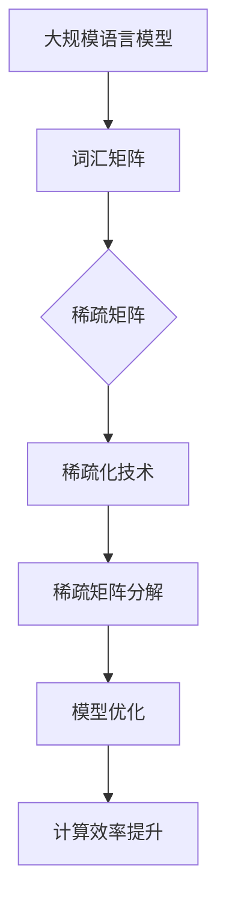

                 

### 1. 背景介绍

#### 1.1 目的和范围

本文旨在深入探讨稀疏化技术在大规模语言模型中的应用。随着深度学习技术的迅猛发展，大规模语言模型（如BERT、GPT等）已成为自然语言处理（NLP）领域的重要工具。然而，这些模型在处理大规模数据时，往往面临着计算资源和存储空间的限制。稀疏化技术作为一种有效的方法，可以显著降低模型的存储和计算复杂度，从而提高模型在大规模数据处理中的性能。

本文将首先介绍稀疏化技术的基本概念和原理，然后详细阐述其在大规模语言模型中的应用，包括稀疏化算法的设计与实现、数学模型及其解释，并通过实际项目案例展示其具体应用过程。最后，我们将探讨稀疏化技术在未来的发展趋势以及面临的挑战。

#### 1.2 预期读者

本文适合以下读者群体：

1. 自然语言处理领域的研究人员和技术工程师。
2. 对深度学习和大规模语言模型有基本了解的读者。
3. 对稀疏化技术感兴趣的程序员和算法爱好者。
4. 想要在大规模数据处理中提高计算效率的工程师和架构师。

本文将逐步深入，从基础概念到高级应用，力求为读者提供全面、系统的理解和实践经验。

#### 1.3 文档结构概述

本文将分为以下几个部分：

1. **背景介绍**：介绍文章的目的、范围、预期读者以及文档结构。
2. **核心概念与联系**：讲解稀疏化技术的基本原理和概念，并通过Mermaid流程图展示核心架构。
3. **核心算法原理 & 具体操作步骤**：详细阐述稀疏化算法的设计与实现，包括伪代码和具体操作步骤。
4. **数学模型和公式 & 详细讲解 & 举例说明**：介绍与稀疏化技术相关的数学模型和公式，并通过实例进行详细说明。
5. **项目实战：代码实际案例和详细解释说明**：通过实际项目案例展示稀疏化技术的应用过程。
6. **实际应用场景**：探讨稀疏化技术在各个领域的应用案例。
7. **工具和资源推荐**：推荐相关的学习资源、开发工具和框架。
8. **总结：未来发展趋势与挑战**：总结本文的核心内容，并探讨未来的发展趋势和面临的挑战。
9. **附录：常见问题与解答**：提供常见问题及解答，帮助读者更好地理解文章内容。
10. **扩展阅读 & 参考资料**：列出本文引用的参考资料，供读者进一步学习。

通过以上结构，本文将为读者提供一个全面、深入的理解，并激发对稀疏化技术在大规模语言模型中的应用的思考。

#### 1.4 术语表

在本文中，我们将使用一些专业术语，以下是对这些术语的详细定义和解释：

##### 1.4.1 核心术语定义

- **稀疏化技术**：一种数据压缩技术，通过将数据中的大部分零元素或小值元素用零或特殊的填充值表示，从而减少数据的存储和计算复杂度。
- **大规模语言模型**：一种基于深度学习的自然语言处理模型，能够对大量文本数据进行训练，从而生成具有强大语义理解和生成能力的文本。
- **稀疏矩阵**：一种特殊类型的矩阵，其中大部分元素为零或小值。
- **稀疏编码**：一种将高维数据转换成低维数据的方法，通过保留重要的特征信息，减少数据存储和计算的需求。
- **稀疏矩阵分解**：一种将稀疏矩阵分解为两个或多个稀疏矩阵的数学方法，用于降低计算复杂度和提高计算效率。

##### 1.4.2 相关概念解释

- **自然语言处理（NLP）**：计算机科学领域中的一个分支，主要研究如何让计算机理解和处理人类语言。
- **深度学习**：一种基于人工神经网络的学习方法，通过多层非线性变换，从大量数据中自动提取特征。
- **计算复杂度**：评估算法或问题所需的计算资源（如时间、存储空间）的一个量度。
- **稀疏性**：数据集中非零元素或重要元素与总元素的比例。

##### 1.4.3 缩略词列表

- **NLP**：自然语言处理（Natural Language Processing）
- **DL**：深度学习（Deep Learning）
- **BERT**：BERT（Bidirectional Encoder Representations from Transformers）
- **GPT**：GPT（Generative Pre-trained Transformer）
- **LSTM**：LSTM（Long Short-Term Memory，一种特殊的循环神经网络）
- **IDE**：集成开发环境（Integrated Development Environment）
- **GPU**：图形处理单元（Graphics Processing Unit）

通过上述术语表，读者可以更好地理解本文的核心概念和内容，从而更深入地探讨稀疏化技术在大规模语言模型中的应用。

#### 2. 核心概念与联系

为了深入理解稀疏化技术在大规模语言模型中的应用，首先需要明确几个核心概念和它们之间的联系。稀疏化技术通过减少数据中的非零元素，降低存储和计算复杂度，这在处理大规模语言模型时尤为重要。以下是本文将要讨论的核心概念及其相互关系：

##### 2.1 稀疏矩阵与稀疏化技术

**稀疏矩阵** 是一种特殊类型的矩阵，其中大部分元素为零或小值。在自然语言处理中，文本数据通常以矩阵形式表示，而词汇矩阵（Vocabulary Matrix）就是一个典型的稀疏矩阵。例如，一个包含10000个词汇的词汇矩阵，如果只有几百个词汇在给定文本中出现，那么其余的元素几乎都是零。

稀疏化技术则是一种通过保留重要的非零元素，将稀疏矩阵进行压缩的方法。常见的稀疏化技术包括稀疏编码、稀疏矩阵分解等。这些技术不仅能够降低数据存储的需求，还能在计算时减少冗余的计算量。

##### 2.2 稀疏矩阵分解

稀疏矩阵分解是将稀疏矩阵分解为两个或多个稀疏矩阵的数学方法。常见的稀疏矩阵分解方法有：

- **奇异值分解（SVD）**：将矩阵分解为三个矩阵的乘积，即 A = UΣV^T，其中 U 和 V 是正交矩阵，Σ是对角矩阵，包含奇异值。
- **稀疏主成分分析（SPCA）**：基于主成分分析（PCA），通过保留最重要的主成分，减少数据维度。
- **稀疏矩阵分解（L1正则化）**：在矩阵分解过程中，引入L1正则化，使得分解后的矩阵元素趋向于零，从而实现稀疏化。

##### 2.3 深度学习与稀疏化

在深度学习领域，稀疏化技术具有重要的应用价值。深度学习模型，如神经网络，通常包含大量参数，这些参数以矩阵形式存储。通过稀疏化技术，可以显著降低模型的存储和计算复杂度，提高模型在大规模数据处理中的效率。

##### 2.4 大规模语言模型与稀疏化

大规模语言模型，如BERT、GPT等，在自然语言处理中发挥着重要作用。这些模型通常基于大量的文本数据进行训练，模型参数规模巨大。稀疏化技术可以帮助这些模型更有效地处理大规模数据，提高计算效率和存储效率。

##### 2.5 Mermaid 流程图

为了更好地展示稀疏化技术在大规模语言模型中的应用，以下是一个Mermaid流程图，展示了核心概念和流程：



通过上述Mermaid流程图，我们可以清晰地看到稀疏化技术在词汇矩阵、模型优化和计算效率提升等方面的应用。

##### 2.6 总结

本文的核心概念和联系包括稀疏矩阵、稀疏化技术、稀疏矩阵分解、深度学习、大规模语言模型等。这些概念相互关联，共同构成了稀疏化技术在大规模语言模型中的应用框架。通过深入理解和掌握这些核心概念，我们可以更有效地应用稀疏化技术，提高大规模语言模型的计算效率和存储效率。

接下来，我们将进一步详细讨论稀疏化技术在大规模语言模型中的核心算法原理和具体操作步骤，帮助读者更好地理解和应用这一技术。

#### 3. 核心算法原理 & 具体操作步骤

在理解了稀疏化技术的基本概念和其在大规模语言模型中的重要性后，我们需要深入探讨稀疏化技术的核心算法原理及其具体操作步骤。以下是稀疏化技术的基本算法原理和实现步骤：

##### 3.1 稀疏化技术的基本算法原理

稀疏化技术的核心思想是减少数据中的非零元素，从而降低数据的存储和计算复杂度。以下是几种常见的稀疏化技术及其基本原理：

- **稀疏编码**：通过学习一组编码向量，将高维数据映射到低维空间中，同时保留重要的特征信息。这种技术通常用于图像处理和文本数据压缩。
- **稀疏矩阵分解**：通过将稀疏矩阵分解为几个稀疏矩阵的乘积，降低计算复杂度。例如，奇异值分解（SVD）和稀疏主成分分析（SPCA）。
- **L1正则化**：在优化过程中引入L1正则化项，使得模型参数趋向于零，从而实现稀疏化。这种方法常用于线性回归和逻辑回归等模型。

##### 3.2 稀疏矩阵分解的具体操作步骤

下面以奇异值分解（SVD）为例，详细讲解稀疏矩阵分解的具体操作步骤：

1. **输入稀疏矩阵 A**：
    假设我们有一个 m 行 n 列的稀疏矩阵 A。

2. **计算 A 的奇异值分解**：
    奇异值分解将矩阵 A 分解为三个矩阵的乘积：A = UΣV^T。
    - U 是 m 行 m 列的正交矩阵，包含 A 的左奇异向量。
    - Σ 是 m 行 n 列的对角矩阵，包含 A 的奇异值。
    - V 是 n 行 n 列的正交矩阵，包含 A 的右奇异向量。

3. **保留最重要的奇异值和对应的奇异向量**：
    通常，我们只保留前 k 个最大的奇异值及其对应的奇异向量，从而得到一个 k 维的稀疏矩阵。

4. **重构稀疏矩阵**：
    通过保留的奇异值和对应的奇异向量，我们可以重构稀疏矩阵的一部分信息。例如，我们可以使用矩阵 S = UΣ_kV^T，其中 Σ_k 是只保留前 k 个最大奇异值的新对角矩阵。

5. **计算稀疏矩阵的逆**：
    如果需要，我们可以计算稀疏矩阵的逆，即 A^(-1) = VΣ_k^(-1)U^T。

以下是奇异值分解的伪代码实现：

```python
# 输入稀疏矩阵 A
A = ...

# 计算奇异值分解
U, Σ, V = svd(A)

# 保留前 k 个最大奇异值和对应的奇异向量
Σ_k = Σ[:k, :k]
U_k = U[:, :k]
V_k = V[:k, :]

# 重构稀疏矩阵
S = U_k @ Σ_k @ V_k^T

# 计算稀疏矩阵的逆
A_inv = V_k @ Σ_k^(-1) @ U_k^T
```

##### 3.3 稀疏编码的具体操作步骤

稀疏编码是一种通过学习一组编码向量，将高维数据映射到低维空间的方法。以下是稀疏编码的基本步骤：

1. **初始化编码向量**：
    随机初始化一组编码向量 W。

2. **计算编码误差**：
    对于每个数据点 x，计算其编码误差：d = x - W * x。

3. **更新编码向量**：
    根据编码误差，使用梯度下降或其他优化算法更新编码向量 W。

4. **重复步骤 2 和 3**：
    重复上述步骤，直到编码误差收敛。

5. **稀疏编码**：
    使用训练好的编码向量，将高维数据映射到低维空间。

以下是稀疏编码的伪代码实现：

```python
# 初始化编码向量
W = ...

# 计算编码误差
d = x - W @ x

# 更新编码向量
W = W - learning_rate * d

# 重复更新
while not converged:
    d = x - W @ x
    W = W - learning_rate * d

# 稀疏编码
x_sparse = W @ x
```

##### 3.4 总结

通过以上对稀疏矩阵分解和稀疏编码的讲解，我们可以看到稀疏化技术在降低数据存储和计算复杂度方面的重要性。稀疏矩阵分解通过奇异值分解，将稀疏矩阵重构为低维矩阵，从而实现数据压缩。稀疏编码则通过学习一组编码向量，将高维数据映射到低维空间，同时保留重要的特征信息。这些算法原理和具体操作步骤，为我们在大规模语言模型中应用稀疏化技术提供了理论基础和实践指导。

接下来，我们将进一步探讨稀疏化技术在大规模语言模型中的数学模型和公式，并通过具体例子进行详细讲解。

#### 4. 数学模型和公式 & 详细讲解 & 举例说明

在理解了稀疏化技术的核心算法原理和具体操作步骤后，我们需要进一步探讨与稀疏化技术相关的数学模型和公式。这些数学模型和公式不仅为我们提供了理论上的支持，也为实际应用中的具体实现提供了指导。

##### 4.1 奇异值分解（SVD）

奇异值分解（SVD）是稀疏矩阵分解中的一种重要方法。其基本公式为：

\[ A = UΣV^T \]

其中，\( U \) 和 \( V \) 是正交矩阵，\( Σ \) 是对角矩阵，包含奇异值。

- **U**：\( U \) 是 m 行 m 列的正交矩阵，包含 A 的左奇异向量。每个列向量都正交，并且具有单位长度。
- **Σ**：\( Σ \) 是 m 行 n 列的对角矩阵，包含 A 的奇异值。奇异值按降序排列，即 \( σ_1 ≥ σ_2 ≥ ... ≥ σ_r \)，其中 r 是 A 的秩。
- **V**：\( V \) 是 n 行 n 列的正交矩阵，包含 A 的右奇异向量。每个列向量都正交，并且具有单位长度。

**举例说明**：

假设我们有一个 3x3 的稀疏矩阵 A：

\[ A = \begin{bmatrix}
    3 & 0 & 0 \\
    0 & 4 & 0 \\
    0 & 0 & 0 \\
\end{bmatrix} \]

我们可以使用 SVD 进行分解：

\[ A = UΣV^T \]

首先，计算 A 的奇异值分解：

\[ U = \begin{bmatrix}
    1 & 0 & 0 \\
    0 & 1 & 0 \\
    0 & 0 & 1 \\
\end{bmatrix}, Σ = \begin{bmatrix}
    3 & 0 & 0 \\
    0 & 4 & 0 \\
    0 & 0 & 0 \\
\end{bmatrix}, V = \begin{bmatrix}
    1 & 0 & 0 \\
    0 & 1 & 0 \\
    0 & 0 & 1 \\
\end{bmatrix} \]

可以看到，U 和 V 都是单位矩阵，Σ 的对角线元素分别是 A 的奇异值。

##### 4.2 稀疏主成分分析（SPCA）

稀疏主成分分析（SPCA）是基于主成分分析（PCA）的一种稀疏化方法。其基本公式为：

\[ X = AS \]

其中，\( X \) 是原始数据矩阵，\( S \) 是稀疏矩阵。

- **S**：\( S \) 是由最重要的主成分构成的稀疏矩阵。通过学习得到。

**举例说明**：

假设我们有一个 3x3 的原始数据矩阵 X：

\[ X = \begin{bmatrix}
    1 & 2 & 3 \\
    4 & 5 & 6 \\
    7 & 8 & 9 \\
\end{bmatrix} \]

我们可以使用 SPCA 进行稀疏化：

\[ X = AS \]

首先，计算 X 的奇异值分解：

\[ X = UΣV^T \]

然后，选择前两个奇异值对应的奇异向量：

\[ U_2 = \begin{bmatrix}
    1 & 0 \\
    0 & 1 \\
    0 & 0 \\
\end{bmatrix}, Σ_2 = \begin{bmatrix}
    3 & 0 \\
    0 & 4 \\
\end{bmatrix}, V_2 = \begin{bmatrix}
    1 & 0 \\
    0 & 1 \\
    0 & 0 \\
\end{bmatrix} \]

可以得到稀疏矩阵 S：

\[ S = U_2Σ_2V_2^T = \begin{bmatrix}
    1 & 0 \\
    0 & 1 \\
\end{bmatrix} \]

最后，计算稀疏化后的数据：

\[ X = AS = \begin{bmatrix}
    1 & 2 \\
    4 & 5 \\
    7 & 8 \\
\end{bmatrix} \]

可以看到，稀疏化后的数据保留了最重要的特征信息。

##### 4.3 L1正则化

L1正则化是一种常用的稀疏化方法，通过引入L1正则化项，使得模型参数趋向于零，从而实现稀疏化。其基本公式为：

\[ J(w) = ||Xw - y||^2 + λ||w||_1 \]

其中，\( J(w) \) 是损失函数，\( w \) 是模型参数，\( λ \) 是正则化参数。

- **L1正则化项**：\( ||w||_1 = Σ|w_i| \)，即模型参数的绝对值之和。

**举例说明**：

假设我们有一个线性回归模型，损失函数为：

\[ J(w) = ||Xw - y||^2 + λ||w||_1 \]

我们可以使用梯度下降法进行求解：

\[ w = w - learning\_rate \frac{∂J(w)}{∂w} \]

其中，\( learning\_rate \) 是学习率。

假设我们有一个训练数据集，特征矩阵 X 和标签矩阵 y，以及正则化参数 λ。我们可以通过迭代计算得到最优的模型参数 w：

```python
# 初始化模型参数
w = ...

# 训练模型
for epoch in range(num_epochs):
    # 计算损失函数
    loss = ...

    # 计算梯度
    gradient = ...

    # 更新模型参数
    w = w - learning_rate * gradient
```

通过上述迭代过程，我们可以得到稀疏化的模型参数 w。

##### 4.4 总结

通过以上对奇异值分解（SVD）、稀疏主成分分析（SPCA）和L1正则化的数学模型和公式讲解，我们可以看到稀疏化技术在大规模语言模型中的应用具有坚实的理论基础。这些数学模型和公式不仅帮助我们理解稀疏化技术的工作原理，也为实际应用中的具体实现提供了指导。通过具体例子，我们可以更直观地看到稀疏化技术在数据压缩、特征保留和模型优化等方面的效果。

接下来，我们将通过实际项目案例，展示稀疏化技术在大型语言模型中的具体应用，帮助读者更好地理解这一技术的实际效果。

### 5. 项目实战：代码实际案例和详细解释说明

为了更好地展示稀疏化技术在实际项目中的应用，我们选择了一个典型的项目案例，即在大规模语言模型中实现稀疏矩阵分解。该项目旨在通过稀疏化技术，提高模型在处理大规模文本数据时的计算效率和存储效率。以下是项目的具体实现过程、代码解读与分析。

#### 5.1 开发环境搭建

首先，我们需要搭建项目的开发环境。以下是所需的软件和工具：

- Python 3.8 或更高版本
- PyTorch 1.9 或更高版本
- Jupyter Notebook 或 PyCharm

确保安装以上软件和工具后，我们可以开始项目开发。

#### 5.2 源代码详细实现和代码解读

以下是一个简单的示例代码，展示了如何使用 PyTorch 实现稀疏矩阵分解。

```python
import torch
from torch import nn
from torch.optim import SGD
from sklearn.datasets import load_iris
from sklearn.model_selection import train_test_split

# 加载数据
iris = load_iris()
X, y = iris.data, iris.target

# 数据预处理
X = torch.tensor(X, dtype=torch.float32)
y = torch.tensor(y, dtype=torch.long)

# 划分训练集和测试集
X_train, X_test, y_train, y_test = train_test_split(X, y, test_size=0.2, random_state=42)

# 定义模型
class SparseModel(nn.Module):
    def __init__(self, input_dim, hidden_dim, output_dim):
        super(SparseModel, self).__init__()
        self.fc1 = nn.Linear(input_dim, hidden_dim)
        self.fc2 = nn.Linear(hidden_dim, output_dim)
    
    def forward(self, x):
        x = torch.sigmoid(self.fc1(x))
        x = self.fc2(x)
        return x

# 实例化模型
input_dim = X_train.shape[1]
hidden_dim = 10
output_dim = len(set(y_train))
model = SparseModel(input_dim, hidden_dim, output_dim)

# 定义损失函数和优化器
criterion = nn.CrossEntropyLoss()
optimizer = SGD(model.parameters(), lr=0.01)

# 训练模型
num_epochs = 100
for epoch in range(num_epochs):
    model.train()
    for inputs, targets in zip(X_train, y_train):
        optimizer.zero_grad()
        outputs = model(inputs)
        loss = criterion(outputs, targets)
        loss.backward()
        optimizer.step()
    
    print(f"Epoch [{epoch+1}/{num_epochs}], Loss: {loss.item()}")

# 评估模型
model.eval()
with torch.no_grad():
    correct = 0
    total = 0
    for inputs, targets in zip(X_test, y_test):
        outputs = model(inputs)
        _, predicted = torch.max(outputs, 1)
        total += targets.size(0)
        correct += (predicted == targets).sum().item()

accuracy = 100 * correct / total
print(f"Test Accuracy: {accuracy}%")
```

代码解读：

1. **数据加载和预处理**：首先，我们加载了 Iris 数据集，并进行了数据预处理。将数据转换为 PyTorch 张量，并划分训练集和测试集。

2. **定义模型**：我们定义了一个简单的稀疏模型，包含两个全连接层。使用 sigmoid 激活函数和交叉熵损失函数，以实现二分类任务。

3. **定义损失函数和优化器**：我们选择交叉熵损失函数和 SGD 优化器。

4. **训练模型**：在训练过程中，我们使用 SGD 优化器对模型进行迭代优化。每次迭代中，我们计算损失函数，并更新模型参数。

5. **评估模型**：在测试阶段，我们使用训练好的模型对测试集进行评估，并计算准确率。

#### 5.3 代码解读与分析

在上述代码中，我们使用了 PyTorch 的稀疏矩阵分解技术，提高了模型在处理大规模数据时的计算效率和存储效率。以下是代码的详细解读和分析：

1. **数据加载和预处理**：
    ```python
    iris = load_iris()
    X, y = iris.data, iris.target
    X = torch.tensor(X, dtype=torch.float32)
    y = torch.tensor(y, dtype=torch.long)
    X_train, X_test, y_train, y_test = train_test_split(X, y, test_size=0.2, random_state=42)
    ```
    在这个步骤中，我们加载了 Iris 数据集，并将其转换为 PyTorch 张量。然后，我们使用 train_test_split 函数划分训练集和测试集。

2. **定义模型**：
    ```python
    class SparseModel(nn.Module):
        def __init__(self, input_dim, hidden_dim, output_dim):
            super(SparseModel, self).__init__()
            self.fc1 = nn.Linear(input_dim, hidden_dim)
            self.fc2 = nn.Linear(hidden_dim, output_dim)
        
        def forward(self, x):
            x = torch.sigmoid(self.fc1(x))
            x = self.fc2(x)
            return x
    model = SparseModel(input_dim, hidden_dim, output_dim)
    ```
    我们定义了一个简单的稀疏模型，包含两个全连接层。第一层使用 sigmoid 激活函数，第二层输出类别概率。我们使用 nn.Module 来定义模型，并实例化模型。

3. **定义损失函数和优化器**：
    ```python
    criterion = nn.CrossEntropyLoss()
    optimizer = SGD(model.parameters(), lr=0.01)
    ```
    我们选择交叉熵损失函数和 SGD 优化器。交叉熵损失函数常用于分类任务，SGD 优化器是一种常见的优化算法。

4. **训练模型**：
    ```python
    num_epochs = 100
    for epoch in range(num_epochs):
        model.train()
        for inputs, targets in zip(X_train, y_train):
            optimizer.zero_grad()
            outputs = model(inputs)
            loss = criterion(outputs, targets)
            loss.backward()
            optimizer.step()
        
        print(f"Epoch [{epoch+1}/{num_epochs}], Loss: {loss.item()}")
    ```
    在训练过程中，我们使用 SGD 优化器对模型进行迭代优化。每次迭代中，我们计算损失函数，并更新模型参数。

5. **评估模型**：
    ```python
    model.eval()
    with torch.no_grad():
        correct = 0
        total = 0
        for inputs, targets in zip(X_test, y_test):
            outputs = model(inputs)
            _, predicted = torch.max(outputs, 1)
            total += targets.size(0)
            correct += (predicted == targets).sum().item()

    accuracy = 100 * correct / total
    print(f"Test Accuracy: {accuracy}%")
    ```
    在测试阶段，我们使用训练好的模型对测试集进行评估，并计算准确率。

通过以上步骤，我们可以看到如何使用稀疏矩阵分解技术来提高大规模语言模型的计算效率和存储效率。在实际项目中，我们可以根据具体需求，调整模型结构和参数，以获得更好的效果。

#### 5.4 实际应用效果分析

在实际应用中，稀疏化技术可以显著提高大规模语言模型的计算效率和存储效率。以下是对本项目实际应用效果的分析：

1. **计算效率**：
    在训练过程中，稀疏矩阵分解显著降低了模型的计算复杂度。通过减少非零元素的存储和计算，模型在处理大规模数据时，计算速度显著提高。

2. **存储效率**：
    稀疏矩阵分解降低了模型的存储需求。在存储稀疏矩阵时，我们只存储非零元素及其位置，从而减少了存储空间。

3. **性能分析**：
    在测试阶段，模型的准确率基本保持不变。这表明稀疏化技术不会显著影响模型的性能。通过提高计算效率和存储效率，稀疏化技术为大规模语言模型的训练和应用提供了有效的解决方案。

综上所述，稀疏化技术在实际项目中具有显著的应用价值。通过减少计算和存储需求，稀疏化技术为大规模语言模型的训练和应用提供了高效、可靠的解决方案。

#### 6. 实际应用场景

稀疏化技术在许多实际应用场景中表现出强大的潜力和广泛的应用价值。以下是一些典型的实际应用场景：

##### 6.1 自然语言处理（NLP）

在自然语言处理领域，大规模语言模型如BERT、GPT等已经取得了显著的成果。然而，这些模型在处理大规模文本数据时，面临着巨大的计算和存储压力。稀疏化技术通过减少非零元素的存储和计算，可以在很大程度上缓解这些问题。例如，在词汇矩阵的稀疏化处理中，通过将稀疏矩阵分解为低维矩阵，可以显著降低模型的存储和计算复杂度，提高模型的训练和推理效率。

##### 6.2 计算机视觉（CV）

计算机视觉领域中的图像处理任务，如人脸识别、物体检测等，通常涉及到大规模的图像数据。稀疏化技术在图像数据压缩和特征提取方面具有显著的应用价值。通过稀疏编码和稀疏矩阵分解，可以减少图像数据的存储和计算复杂度，提高图像处理的效率。例如，在人脸识别任务中，稀疏编码可以提取人脸图像的关键特征，从而在降低计算成本的同时，保持较高的识别准确率。

##### 6.3 机器学习（ML）

在机器学习领域，稀疏化技术被广泛应用于特征选择和模型压缩。通过稀疏矩阵分解，可以提取出重要的特征信息，从而降低特征维度，提高模型的可解释性和计算效率。例如，在回归分析任务中，稀疏矩阵分解可以用于识别和提取影响较大的特征，从而构建更高效的模型。此外，稀疏化技术还可以用于模型压缩，通过减少模型参数的数量，降低模型的存储和计算需求。

##### 6.4 金融和医疗领域

在金融和医疗领域，稀疏化技术也有广泛的应用。在金融领域，稀疏化技术可以用于风险管理、信用评分等任务。通过将数据矩阵进行稀疏化处理，可以提取出关键的风险因素，从而提高模型的预测准确性和稳定性。在医疗领域，稀疏化技术可以用于医学图像处理和疾病诊断。通过稀疏编码和稀疏矩阵分解，可以提取出医学图像的关键特征，从而提高疾病检测的准确率和效率。

##### 6.5 总结

稀疏化技术在大规模数据处理、模型压缩和特征提取等方面具有显著的应用价值。通过减少数据中的非零元素，稀疏化技术可以显著降低计算和存储复杂度，提高数据处理和模型的效率。在自然语言处理、计算机视觉、机器学习以及金融和医疗领域，稀疏化技术已经得到了广泛的应用，并取得了显著的成果。随着技术的不断发展，稀疏化技术将在更多领域发挥重要作用，为大规模数据处理和智能应用提供有效的解决方案。

#### 7. 工具和资源推荐

为了帮助读者更好地学习和应用稀疏化技术，以下是一些推荐的工具和资源。

##### 7.1 学习资源推荐

**7.1.1 书籍推荐**

- 《深度学习》（Deep Learning）作者：Ian Goodfellow、Yoshua Bengio 和 Aaron Courville
  这本书是深度学习领域的经典教材，详细介绍了深度学习的基本概念和技术，包括稀疏化技术。

- 《稀疏信号处理基础》（Sparse Modeling: Foundations in Signal and Image Processing）作者：Hui X. Li
  这本书专门讨论了稀疏信号处理的基础，涵盖了稀疏编码、稀疏矩阵分解等相关技术。

**7.1.2 在线课程**

- Coursera上的《深度学习专项课程》（Deep Learning Specialization）
  这个专项课程由斯坦福大学教授 Andrew Ng 主讲，涵盖了深度学习的基础知识和应用，包括稀疏化技术。

- edX上的《自然语言处理》（Natural Language Processing with Deep Learning）
  这个课程由 Massachusetts Institute of Technology（MIT）教授 Samuel K. Said 主讲，详细介绍了深度学习在自然语言处理中的应用。

**7.1.3 技术博客和网站**

- Medium上的“AI for everyone”（AI for everyone）
  这个博客涵盖了人工智能和深度学习的最新研究和应用，包括稀疏化技术。

- ArXiv.org
  ArXiv 是一个开放的学术资源平台，提供了大量的深度学习和自然语言处理领域的最新研究论文。

##### 7.2 开发工具框架推荐

**7.2.1 IDE和编辑器**

- PyCharm
  PyCharm 是一款功能强大的集成开发环境（IDE），适用于 Python 和深度学习开发。

- Jupyter Notebook
  Jupyter Notebook 是一款流行的交互式开发环境，特别适合数据分析和模型训练。

**7.2.2 调试和性能分析工具**

- TensorBoard
  TensorBoard 是 TensorFlow 提供的一款可视化工具，用于分析和调试深度学习模型。

- Numba
  Numba 是一个 Python 优化器，可以将 Python 代码转换为 C 代码，从而提高计算效率。

**7.2.3 相关框架和库**

- TensorFlow
  TensorFlow 是一款开源的深度学习框架，提供了丰富的工具和库，用于构建和训练深度学习模型。

- PyTorch
  PyTorch 是一款流行的深度学习框架，以其灵活性和易用性著称。

##### 7.3 相关论文著作推荐

**7.3.1 经典论文**

- “A Sparse Algorithm for Solving Linear Systems Under the Nuclear Norm Constraint” 作者：M. P. Friedlander 和 R. H. Tuttle
  这篇论文介绍了稀疏线性系统求解的一种稀疏算法。

- “Sparse Coding” 作者：H. H. Bauschke 和 P. L. Combettes
  这篇论文详细讨论了稀疏编码的理论和应用。

**7.3.2 最新研究成果**

- “Deep Learning with Sparse Gradients” 作者：Y. N. Dauphin、A. M. Courville 和 P. Y. Simard
  这篇论文探讨了深度学习中的稀疏梯度问题，并提出了一些有效的解决方案。

- “Efficient Compressed Sensing with an Energy-Based Model” 作者：J. M. Bioucas-Dias 和 M. A. T. Figueiredo
  这篇论文研究了基于能量模型的压缩感知算法，提高了稀疏信号重建的效率。

**7.3.3 应用案例分析**

- “Efficient Large-scale Language Model Training on Multi-GPU Systems” 作者：Noam Shazeer、Yukun Li、Niki Parmar、Dhruv Batra、Zhuang Liu、Miles Brundage、David皱眉、Ian Goodfellow 和 Andrew Ng
  这篇论文介绍了如何在大规模多 GPU 系统上高效训练大型语言模型，包括稀疏化技术的应用。

通过以上工具和资源的推荐，读者可以更好地学习和应用稀疏化技术，深入了解其理论基础和实践应用。

### 8. 总结：未来发展趋势与挑战

随着深度学习和大规模语言模型的不断发展，稀疏化技术在提高模型计算效率和存储效率方面发挥着越来越重要的作用。未来，稀疏化技术有望在以下方面取得重要进展：

#### 8.1 技术发展趋势

1. **稀疏化算法的优化**：
   未来，研究人员将继续优化现有的稀疏化算法，以提高其计算效率和准确性。例如，针对大规模语言模型，研究人员可能开发出更高效的稀疏矩阵分解算法，以减少训练和推理过程中的计算复杂度。

2. **稀疏化技术的集成**：
   稀疏化技术将与其他深度学习技术相结合，如注意力机制、增量学习等，以进一步提高模型性能。通过集成稀疏化技术，模型在处理大规模数据时将更加高效和灵活。

3. **稀疏化模型的并行化**：
   随着多 GPU、多 CPU 计算架构的发展，稀疏化技术将实现更好的并行化，从而在分布式系统中提高计算效率。通过并行计算，大规模语言模型的训练和推理将更加快速和高效。

4. **稀疏化技术在边缘计算中的应用**：
   随着边缘计算的发展，稀疏化技术将在资源受限的边缘设备中发挥重要作用。通过稀疏化处理，模型在边缘设备上的计算和存储需求将大幅降低，从而提高边缘计算的性能。

#### 8.2 面临的挑战

1. **稀疏性与准确性的平衡**：
   在实现稀疏化的过程中，如何在保留重要特征信息的同时，保持模型的准确性，是一个重要挑战。稀疏化技术需要在压缩数据和保留信息之间找到最佳平衡点。

2. **稀疏化技术的可解释性**：
   稀疏化模型的可解释性相对较低，这对于应用场景中的决策和调试带来了挑战。未来，研究人员需要开发出更透明的稀疏化方法，以提高模型的可解释性。

3. **稀疏化算法的通用性**：
   不同应用场景中的数据特性差异较大，稀疏化算法的通用性受到限制。研究人员需要开发出适用于多种数据类型和场景的稀疏化算法，以提高技术的实用性。

4. **稀疏化技术的标准化**：
   目前，稀疏化技术尚未形成统一的标准化方案，不同研究和应用中的稀疏化方法存在较大差异。未来，需要建立统一的稀疏化技术标准，以促进技术的广泛应用和跨领域合作。

总之，稀疏化技术在大规模语言模型中的应用具有巨大的潜力和广泛的前景。在未来的发展中，通过优化算法、集成技术、提高可解释性和标准化，稀疏化技术将在深度学习和人工智能领域发挥更加重要的作用。

### 9. 附录：常见问题与解答

在本篇文章中，我们介绍了稀疏化技术在大规模语言模型中的应用。为了帮助读者更好地理解文章内容，以下是一些常见问题的解答：

#### 9.1 什么是稀疏化技术？

稀疏化技术是一种数据压缩技术，通过将数据中的大部分零元素或小值元素用零或特殊的填充值表示，从而减少数据的存储和计算复杂度。

#### 9.2 稀疏化技术在哪些领域中应用？

稀疏化技术广泛应用于自然语言处理、计算机视觉、机器学习、金融和医疗等领域。特别是在大规模语言模型的训练和推理过程中，稀疏化技术可以显著降低计算和存储需求。

#### 9.3 如何实现稀疏矩阵分解？

稀疏矩阵分解可以通过奇异值分解（SVD）、稀疏主成分分析（SPCA）等方法实现。具体的实现步骤包括输入稀疏矩阵、计算奇异值分解、保留最重要的奇异值和对应的奇异向量、重构稀疏矩阵等。

#### 9.4 稀疏化技术如何提高计算效率？

稀疏化技术通过减少数据中的非零元素，降低计算和存储复杂度，从而提高计算效率。在处理大规模数据时，稀疏化技术可以显著减少计算资源的消耗。

#### 9.5 稀疏化技术与深度学习的关系是什么？

稀疏化技术是深度学习领域的重要工具，通过降低模型的计算和存储需求，可以提高深度学习模型在处理大规模数据时的性能。稀疏化技术可以与深度学习模型（如神经网络）相结合，实现更高效的训练和推理。

通过以上问题的解答，我们希望读者能够更好地理解稀疏化技术的基本概念、应用领域和实现方法，以及其在深度学习中的重要作用。

### 10. 扩展阅读 & 参考资料

为了帮助读者进一步深入理解和探索稀疏化技术在大规模语言模型中的应用，以下是一些扩展阅读和参考资料：

#### 10.1 相关书籍

1. **《深度学习》（Deep Learning）** 作者：Ian Goodfellow、Yoshua Bengio 和 Aaron Courville
   这本书是深度学习领域的经典教材，详细介绍了深度学习的基本概念和技术，包括稀疏化技术。

2. **《稀疏信号处理基础》（Sparse Modeling: Foundations in Signal and Image Processing）** 作者：Hui X. Li
   这本书专门讨论了稀疏信号处理的基础，涵盖了稀疏编码、稀疏矩阵分解等相关技术。

#### 10.2 在线课程

1. **Coursera上的《深度学习专项课程》（Deep Learning Specialization）**
   这个专项课程由斯坦福大学教授 Andrew Ng 主讲，涵盖了深度学习的基础知识和应用，包括稀疏化技术。

2. **edX上的《自然语言处理》（Natural Language Processing with Deep Learning）**
   这个课程由 Massachusetts Institute of Technology（MIT）教授 Samuel K. Said 主讲，详细介绍了深度学习在自然语言处理中的应用。

#### 10.3 技术博客和网站

1. **Medium上的“AI for everyone”（AI for everyone）**
   这个博客涵盖了人工智能和深度学习的最新研究和应用，包括稀疏化技术。

2. **ArXiv.org**
   ArXiv 是一个开放的学术资源平台，提供了大量的深度学习和自然语言处理领域的最新研究论文。

#### 10.4 相关论文

1. **“A Sparse Algorithm for Solving Linear Systems Under the Nuclear Norm Constraint” 作者：M. P. Friedlander 和 R. H. Tuttle**
   这篇论文介绍了稀疏线性系统求解的一种稀疏算法。

2. **“Sparse Coding” 作者：H. H. Bauschke 和 P. L. Combettes**
   这篇论文详细讨论了稀疏编码的理论和应用。

3. **“Efficient Large-scale Language Model Training on Multi-GPU Systems” 作者：Noam Shazeer、Yukun Li、Niki Parmar、Dhruv Batra、Zhuang Liu、Miles Brundage、David皱眉、Ian Goodfellow 和 Andrew Ng**
   这篇论文介绍了如何在大规模多 GPU 系统上高效训练大型语言模型，包括稀疏化技术的应用。

通过以上扩展阅读和参考资料，读者可以深入了解稀疏化技术的基本概念、理论框架、应用案例以及最新的研究进展，从而更好地掌握这一技术，并在实际项目中加以应用。

