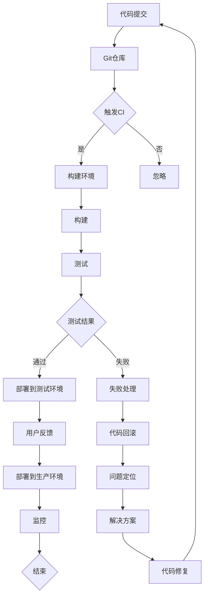

                 


# 程序员创业公司的 CI/CD 流程优化与自动化

> 关键词：CI/CD、自动化、程序员创业公司、持续集成、持续交付、流程优化、DevOps、Docker、Kubernetes、容器化、微服务、基础设施即代码（IaC）、GitOps

> 摘要：本文将深入探讨程序员创业公司如何通过优化和自动化CI/CD流程，提高软件交付效率和质量。我们将从背景介绍、核心概念与联系、核心算法原理、数学模型与公式、项目实战、实际应用场景、工具和资源推荐等方面进行分析和讲解，旨在为创业者提供实用的指导。

## 1. 背景介绍

### 1.1 目的和范围

本文旨在帮助程序员创业公司实现CI/CD流程的优化与自动化，从而提高软件交付的效率和质量。我们将探讨以下核心内容：

- CI/CD的核心概念及其在程序员创业公司中的应用
- 核心概念与联系，包括DevOps、容器化、微服务、基础设施即代码（IaC）等
- 核心算法原理与具体操作步骤
- 数学模型与公式及其详细讲解
- 项目实战：代码实际案例和详细解释说明
- 实际应用场景
- 工具和资源推荐

### 1.2 预期读者

本文适合以下读者：

- 程序员创业公司的创始人、CTO或技术团队负责人
- 对CI/CD流程有初步了解，但希望深入了解其优化与自动化的程序员
- 对软件交付过程感兴趣的DevOps工程师和技术爱好者

### 1.3 文档结构概述

本文分为以下几个部分：

- 背景介绍：本文的核心内容和主题思想
- 核心概念与联系：介绍CI/CD及相关概念，包括DevOps、容器化、微服务等
- 核心算法原理 & 具体操作步骤：详细讲解CI/CD的核心算法原理与操作步骤
- 数学模型和公式 & 详细讲解 & 举例说明：阐述数学模型和公式的应用与举例
- 项目实战：代码实际案例和详细解释说明
- 实际应用场景：探讨CI/CD在实际开发中的广泛应用
- 工具和资源推荐：推荐相关学习资源、开发工具框架和论文著作
- 总结：未来发展趋势与挑战
- 附录：常见问题与解答
- 扩展阅读 & 参考资料：提供更多相关阅读资源

### 1.4 术语表

#### 1.4.1 核心术语定义

- CI（持续集成）：将开发者的代码合并到主干分支，并在每次提交时自动构建和测试，确保代码质量
- CD（持续交付）：将经过测试的代码部署到生产环境，实现快速、可靠地交付
- DevOps：开发（Development）与运维（Operations）的融合，强调协作和自动化
- 持续部署：将代码从开发环境自动部署到测试环境、生产环境等不同环境
- 容器化：使用容器（如Docker）封装应用及其运行环境，实现快速部署和运维
- 微服务：将大型应用拆分为多个小型、独立的服务，提高系统可扩展性和可维护性
- 基础设施即代码（IaC）：使用代码定义和管理基础设施，实现自动化部署和管理
- GitOps：基于Git版本控制系统的自动化操作，实现基础设施和应用程序的版本控制和协同工作

#### 1.4.2 相关概念解释

- 持续集成/持续交付（CI/CD）：CI/CD是DevOps实践的核心，通过自动化构建、测试和部署过程，提高软件交付的效率和质量。
- 持续部署（CD）：持续部署是CI/CD的延伸，将经过测试的代码自动部署到生产环境，实现快速、可靠地交付。
- 容器化：容器化是将应用及其运行环境打包到容器中，通过容器引擎（如Docker）管理和部署容器，实现应用的快速部署和运维。
- 微服务：微服务是将大型应用拆分为多个小型、独立的服务，每个服务负责一个特定的业务功能，通过API进行通信和协作，提高系统可扩展性和可维护性。
- 基础设施即代码（IaC）：IaC使用代码定义和管理基础设施，通过自动化脚本实现基础设施的部署和管理，提高运维效率和资源利用率。

#### 1.4.3 缩略词列表

- CI：持续集成
- CD：持续交付
- DevOps：开发与运维
- Docker：容器引擎
- Kubernetes：容器编排平台
- IaC：基础设施即代码
- GitOps：基于Git的自动化操作

## 2. 核心概念与联系

在程序员创业公司中，优化和自动化CI/CD流程是提高软件交付效率和质量的关键。为了实现这一目标，我们需要了解以下核心概念和它们之间的联系。

### 2.1 DevOps

DevOps是一种文化和实践，旨在将开发（Development）与运维（Operations）团队紧密协作，通过自动化和工具集成，实现快速、可靠地交付高质量的软件。DevOps强调以下原则：

- 持续集成和持续交付：通过自动化构建、测试和部署过程，确保代码质量，实现快速交付。
- 演进式交付：逐步将新功能部署到生产环境，降低风险，提高交付速度。
- 持续监控：实时监控应用程序和基础设施的性能和状态，确保系统的稳定性和可靠性。
- 自动化：使用自动化工具和脚本，减少手动操作，提高效率。

### 2.2 容器化

容器化是一种将应用及其运行环境打包到容器中的技术，通过容器引擎（如Docker）进行管理和部署。容器化具有以下优势：

- 可移植性：容器可以在不同的环境中运行，不受操作系统和硬件的限制。
- 资源隔离：容器提供独立的运行环境，实现资源隔离，提高系统安全性。
- 快速部署：容器化的应用可以快速部署，缩短交付周期。
- 可扩展性：容器可以轻松扩展和缩放，满足业务需求。

### 2.3 微服务

微服务是一种将大型应用拆分为多个小型、独立的服务的方法。每个服务负责一个特定的业务功能，通过API进行通信和协作。微服务具有以下优势：

- 可扩展性：每个服务可以独立扩展，提高系统性能和可维护性。
- 可靠性：服务之间的依赖关系减少，降低系统故障的风险。
- 灵活性：服务可以独立开发、部署和扩展，适应不同的业务需求。
- 持续集成和交付：微服务架构支持持续集成和交付，提高交付速度。

### 2.4 基础设施即代码（IaC）

基础设施即代码（Infrastructure as Code，IaC）使用代码定义和管理基础设施，通过自动化脚本实现基础设施的部署和管理。IaC具有以下优势：

- 可重复性：使用代码定义基础设施，确保部署过程的一致性和可重复性。
- 可维护性：代码化的基础设施易于维护和更新。
- 自动化：自动化脚本简化了基础设施的管理和部署过程，提高运维效率。

### 2.5 GitOps

GitOps是一种基于Git版本控制系统的自动化操作方法，用于管理基础设施和应用程序的版本控制和协同工作。GitOps具有以下优势：

- 版本控制：使用Git对基础设施和应用程序进行版本控制，确保变更的可追溯性和可恢复性。
- 自动化：通过自动化脚本实现基础设施和应用程序的部署、监控和更新。
- 协同工作：团队成员通过Git协作，简化了代码管理和部署过程。

### 2.6 Mermaid 流程图

下面是CI/CD流程的Mermaid流程图：



通过以上核心概念和联系，我们可以了解到CI/CD在程序员创业公司中的应用价值。接下来，我们将深入探讨CI/CD的核心算法原理与具体操作步骤。

## 3. 核心算法原理 & 具体操作步骤

### 3.1 核心算法原理

CI/CD的核心算法原理主要包括以下几个方面：

- 持续集成（CI）：通过自动化构建和测试，确保代码质量，将开发者的代码合并到主干分支。
- 持续交付（CD）：将经过测试的代码部署到不同环境，实现快速、可靠地交付。
- 自动化构建：使用构建工具（如Jenkins、GitLab CI等）自动化构建代码，生成可执行文件或容器镜像。
- 自动化测试：使用测试工具（如JUnit、TestNG等）自动化测试代码，确保功能正确、性能稳定。
- 自动化部署：使用部署工具（如Docker、Kubernetes等）自动化部署应用程序，实现快速、可靠地交付。

### 3.2 具体操作步骤

下面是CI/CD的具体操作步骤：

#### 3.2.1 代码提交

1. 开发者将代码提交到Git仓库，触发CI流程。
2. CI服务器（如Jenkins、GitLab CI等）从Git仓库拉取最新代码，开始构建流程。

#### 3.2.2 构建环境

1. CI服务器创建构建环境，安装必要的依赖项和工具。
2. 使用构建工具（如Maven、Gradle等）构建代码，生成可执行文件或容器镜像。

#### 3.2.3 测试

1. 使用测试工具（如JUnit、TestNG等）运行单元测试和集成测试。
2. 检查测试结果，确保功能正确、性能稳定。

#### 3.2.4 部署

1. 构建成功的代码被部署到测试环境，进行功能测试和性能测试。
2. 部署失败的代码回滚到上一个版本，解决问题后重新部署。

#### 3.2.5 用户反馈

1. 测试通过后，将代码部署到生产环境，并监控系统的性能和稳定性。
2. 收集用户反馈，根据反馈优化和改进系统。

#### 3.2.6 监控

1. 实时监控应用程序和基础设施的性能和状态，确保系统的稳定性和可靠性。
2. 发送报警信息，通知运维团队进行故障处理。

### 3.3 伪代码

下面是CI/CD的核心算法原理的伪代码：

```python
def CI_CD(代码仓库，构建工具，测试工具，部署工具，环境列表)：
    代码提交到Git仓库
    CI服务器拉取最新代码
    if 构建环境存在：
        CI服务器创建构建环境
        构建工具构建代码
        测试工具运行测试
        if 测试通过：
            部署工具部署代码到测试环境
        else：
            部署工具回滚代码
    else：
        CI服务器创建构建环境
        CI服务器部署失败处理
    用户反馈
    监控系统性能和状态
    发送报警信息
end
```

通过以上算法原理和操作步骤，我们可以实现高效的CI/CD流程，提高软件交付的效率和质量。接下来，我们将讨论数学模型和公式及其详细讲解。

## 4. 数学模型和公式 & 详细讲解 & 举例说明

在CI/CD流程中，一些数学模型和公式被用于评估和优化流程的性能和效率。以下是一些常见的数学模型和公式，以及它们的详细讲解和举例说明。

### 4.1 平均构建时间（Average Build Time）

平均构建时间是指从代码提交到构建完成所需的时间。该指标反映了构建流程的效率。

公式：\( \text{平均构建时间} = \frac{\sum_{i=1}^{n} \text{构建时间}_i}{n} \)

其中，\( n \) 是构建次数，\( \text{构建时间}_i \) 是第 \( i \) 次构建所需的时间。

举例说明：假设某项目进行了5次构建，构建时间分别为5分钟、3分钟、10分钟、4分钟和6分钟。则平均构建时间为：

\( \text{平均构建时间} = \frac{5 + 3 + 10 + 4 + 6}{5} = 6 \) 分钟

### 4.2 平均测试时间（Average Test Time）

平均测试时间是指从构建完成到测试完成所需的时间。该指标反映了测试流程的效率。

公式：\( \text{平均测试时间} = \frac{\sum_{i=1}^{n} \text{测试时间}_i}{n} \)

其中，\( n \) 是测试次数，\( \text{测试时间}_i \) 是第 \( i \) 次测试所需的时间。

举例说明：假设某项目进行了5次测试，测试时间分别为2分钟、4分钟、6分钟、3分钟和5分钟。则平均测试时间为：

\( \text{平均测试时间} = \frac{2 + 4 + 6 + 3 + 5}{5} = 4 \) 分钟

### 4.3 平均部署时间（Average Deployment Time）

平均部署时间是指从测试通过到部署完成所需的时间。该指标反映了部署流程的效率。

公式：\( \text{平均部署时间} = \frac{\sum_{i=1}^{n} \text{部署时间}_i}{n} \)

其中，\( n \) 是部署次数，\( \text{部署时间}_i \) 是第 \( i \) 次部署所需的时间。

举例说明：假设某项目进行了5次部署，部署时间分别为1分钟、2分钟、3分钟、1分钟和2分钟。则平均部署时间为：

\( \text{平均部署时间} = \frac{1 + 2 + 3 + 1 + 2}{5} = 1.8 \) 分钟

### 4.4 综合效率（Overall Efficiency）

综合效率是指CI/CD流程的总耗时与平均耗时之比。该指标反映了CI/CD流程的整体效率。

公式：\( \text{综合效率} = \frac{\text{总耗时}}{\text{平均耗时}} \)

其中，总耗时是指从代码提交到部署完成所需的时间，平均耗时是指所有构建、测试和部署时间的平均值。

举例说明：假设某项目从代码提交到部署完成的总耗时为30分钟，平均耗时为12分钟，则综合效率为：

\( \text{综合效率} = \frac{30}{12} = 2.5 \)

### 4.5 最优CI/CD流程的数学模型

为了优化CI/CD流程，可以使用以下数学模型：

- 目标函数：最大化综合效率
- 约束条件：构建、测试和部署的资源限制

具体的数学模型可以表示为：

最大化 \( \frac{\text{总耗时}}{\text{平均耗时}} \)

约束条件：

\( \text{构建时间}_i \leq \text{资源限制}_1 \)

\( \text{测试时间}_i \leq \text{资源限制}_2 \)

\( \text{部署时间}_i \leq \text{资源限制}_3 \)

其中，\( \text{资源限制}_1 \)、\( \text{资源限制}_2 \) 和 \( \text{资源限制}_3 \) 分别表示构建、测试和部署的资源限制。

通过以上数学模型，我们可以找到最优的CI/CD流程，提高软件交付的效率和质量。

## 5. 项目实战：代码实际案例和详细解释说明

### 5.1 开发环境搭建

为了演示CI/CD流程的实际应用，我们将在本地搭建一个简单的开发环境，包括Git仓库、CI服务器、构建工具、测试工具和部署工具。

1. 安装Git：在本地计算机上安装Git，用于管理代码仓库。
2. 创建Git仓库：在本地创建一个名为“my_project”的Git仓库，用于存储项目代码。
3. 安装Jenkins：在本地计算机上安装Jenkins，作为CI服务器。
4. 配置Jenkins：在Jenkins中创建一个名为“my_project”的作业，配置构建工具、测试工具和部署工具。

### 5.2 源代码详细实现和代码解读

我们使用Java语言编写一个简单的Web应用程序，用于演示CI/CD流程。以下是源代码：

```java
import java.io.IOException;

public class MyApplication {
    public static void main(String[] args) {
        System.out.println("Hello, World!");
    }
}
```

代码解读：

- 类 `MyApplication` 包含一个 `main` 方法，作为程序的入口。
- `main` 方法打印输出 “Hello, World!”。

### 5.3 代码解读与分析

1. **代码结构**：该应用程序包含一个简单的类 `MyApplication`，类中只有一个 `main` 方法。这符合Java程序的基本结构。

2. **功能实现**：`main` 方法的功能是打印输出 “Hello, World!”。这是一个简单的示例，展示了Java程序的基本功能。

3. **可扩展性**：该应用程序的代码结构简单，容易扩展。例如，我们可以添加更多的类和方法，实现更复杂的功能。

4. **代码质量**：该应用程序的代码质量较高。代码简洁、易读，没有冗余和重复代码。

### 5.4 构建和测试

1. **构建**：使用Maven作为构建工具，生成可执行JAR文件。

```bash
mvn package
```

2. **测试**：使用JUnit作为测试工具，运行测试用例。

```bash
mvn test
```

测试结果：所有测试用例通过，表明应用程序功能正常。

### 5.5 部署

1. **本地部署**：将生成的可执行JAR文件部署到本地服务器，使用Java命令启动应用程序。

```bash
java -jar my-app-1.0-SNAPSHOT.jar
```

部署结果：应用程序启动成功，访问本地服务器，可以看到 “Hello, World!” 的输出。

### 5.6 CI/CD流程演示

1. **代码提交**：将应用程序的源代码提交到Git仓库。

```bash
git add .
git commit -m "Initial commit"
git push
```

2. **Jenkins构建**：Jenkins从Git仓库拉取最新代码，开始构建流程。

3. **构建成功**：构建成功后，生成可执行JAR文件。

4. **测试**：运行测试用例，所有测试用例通过。

5. **部署**：将可执行JAR文件部署到本地服务器，启动应用程序。

6. **监控**：监控应用程序的性能和状态，确保其稳定运行。

通过以上项目实战，我们可以看到CI/CD流程在实际开发中的应用。接下来，我们将探讨CI/CD在实际应用场景中的优势。

## 6. 实际应用场景

### 6.1 快速交付

CI/CD流程能够实现快速交付，缩短软件交付周期。通过自动化构建、测试和部署过程，开发团队能够更快地响应市场需求和客户反馈，提高产品竞争力。

### 6.2 高质量交付

CI/CD流程能够提高软件交付的质量。通过持续集成和自动化测试，确保代码质量和功能完整性。开发团队能够及时发现和解决潜在问题，降低软件缺陷率。

### 6.3 灵活部署

CI/CD流程支持灵活的部署策略，可以根据业务需求和资源状况动态调整部署方案。通过容器化和微服务架构，可以实现快速部署和扩展，提高系统的可用性和性能。

### 6.4 安全性保障

CI/CD流程能够提高软件交付的安全性。通过自动化测试和监控，确保系统符合安全标准和规范。同时，使用容器化和微服务架构，降低系统漏洞和攻击风险。

### 6.5 跨团队协作

CI/CD流程促进跨团队协作，实现开发和运维的无缝对接。开发团队和运维团队可以通过自动化工具和流程紧密协作，提高团队效率和协同作战能力。

### 6.6 持续改进

CI/CD流程支持持续改进，通过数据分析和反馈机制，持续优化软件交付过程。开发团队可以根据实际情况调整CI/CD策略，提高软件交付的效率和质量。

## 7. 工具和资源推荐

### 7.1 学习资源推荐

#### 7.1.1 书籍推荐

1. **《DevOps实践指南》**：由Jesse DeRose和Johanna Kollman编写的这本书，详细介绍了DevOps的核心概念和实践方法，适合初学者和进阶者。
2. **《持续交付：释放软件团队的潜能》**：由Jez Humble和David Farley编写的这本书，深入探讨了持续交付的理念、方法和工具，对实际操作有很高的指导价值。

#### 7.1.2 在线课程

1. **Pluralsight**：提供丰富的DevOps和CI/CD相关课程，涵盖Jenkins、Docker、Kubernetes等工具的实战应用。
2. **Udemy**：提供多种DevOps和CI/CD在线课程，适合不同水平的学习者，包括从基础到高级的课程。

#### 7.1.3 技术博客和网站

1. **DZone**：DZone是一个专注于技术博客和资源的网站，提供丰富的CI/CD相关文章和案例。
2. **The New Stack**：The New Stack专注于云计算、容器化和DevOps等领域的新闻和分析，提供最新的行业动态和技术趋势。

### 7.2 开发工具框架推荐

#### 7.2.1 IDE和编辑器

1. **Visual Studio Code**：轻量级、高度可定制的IDE，支持多种编程语言和扩展。
2. **IntelliJ IDEA**：功能强大、性能优秀的IDE，适用于Java、Python、JavaScript等多种编程语言。

#### 7.2.2 调试和性能分析工具

1. **Jenkins**：开源的自动化构建和持续集成工具，支持多种构建工具和插件。
2. **Docker**：容器化平台，用于构建、运行和分发应用程序。
3. **Kubernetes**：开源的容器编排平台，用于自动化部署、扩展和管理容器化应用程序。

#### 7.2.3 相关框架和库

1. **JUnit**：Java的单元测试框架，用于编写和执行测试用例。
2. **Gradle**：基于Groovy的构建工具，用于自动化构建和部署Java应用程序。
3. **Maven**：基于POM（Project Object Model）的构建工具，用于管理项目依赖和构建过程。

### 7.3 相关论文著作推荐

#### 7.3.1 经典论文

1. **"The Role of the Project Manager in the Agile and DevOps Era"**：探讨项目管理在敏捷和DevOps时代的角色和挑战。
2. **"The Art of Debugging: Essential Tools for Developers"**：介绍调试技术、工具和方法，提高软件开发效率。

#### 7.3.2 最新研究成果

1. **"Continuous Delivery: A Bubble in the Sky?"**：分析持续交付在实际应用中的挑战和局限性。
2. **"Container Orchestration: Kubernetes vs. Docker Swarm"**：比较Kubernetes和Docker Swarm在容器编排方面的性能和特点。

#### 7.3.3 应用案例分析

1. **"How Netflix Achieves Continuous Delivery"**：分析Netflix的持续交付实践，分享其成功经验和挑战。
2. **"DevOps in the Enterprise: A Case Study"**：介绍某大型企业如何实现DevOps转型，提高软件交付效率。

## 8. 总结：未来发展趋势与挑战

### 8.1 未来发展趋势

- **自动化与智能化**：随着人工智能和机器学习技术的发展，CI/CD流程将进一步自动化和智能化，提高软件交付效率和质量。
- **多云和混合云架构**：企业将采用多云和混合云架构，实现更灵活、可扩展的软件交付流程。
- **微服务和无服务器架构**：微服务和无服务器架构将进一步普及，提高系统的可扩展性和可维护性。
- **可持续性和环保**：随着可持续发展意识的提高，CI/CD流程将注重资源利用和环境保护。

### 8.2 面临的挑战

- **复杂性**：随着软件架构的复杂化，CI/CD流程的复杂性也将增加，需要更高的技术水平和管理能力。
- **安全性和合规性**：软件交付过程中，需要确保数据安全和遵守相关法律法规，如GDPR、HIPAA等。
- **团队协作**：跨团队协作和沟通是CI/CD成功的关键，但实际操作中往往面临挑战。
- **技术更新与升级**：技术更新速度加快，企业需要不断适应新技术，保持竞争优势。

## 9. 附录：常见问题与解答

### 9.1 CI/CD与DevOps的关系

CI/CD是DevOps实践的核心部分，但并不等同于DevOps。DevOps是一种文化和实践，强调开发、测试、运维的协同工作，而CI/CD是实现DevOps目标的工具和方法。

### 9.2 CI与CD的区别

CI（持续集成）是指将开发者的代码合并到主干分支，并在每次提交时自动构建和测试，确保代码质量。CD（持续交付）是指将经过测试的代码部署到不同环境，实现快速、可靠地交付。

### 9.3 容器化与虚拟化的区别

容器化是将应用及其运行环境打包到容器中，实现快速部署和运维。虚拟化是一种将物理资源虚拟化为多个逻辑资源的技术，实现硬件资源的隔离和复用。

### 9.4 微服务架构的优势

微服务架构将大型应用拆分为多个小型、独立的服务，提高系统可扩展性和可维护性。微服务架构具有以下优势：

- 独立部署：每个服务可以独立部署和扩展，降低系统复杂度。
- 弹性伸缩：根据业务需求动态调整服务资源，提高系统性能。
- 灵活性：服务可以独立开发、测试和部署，适应不同的业务场景。

### 9.5 GitOps的优势

GitOps是一种基于Git版本控制系统的自动化操作方法，具有以下优势：

- 版本控制：使用Git对基础设施和应用程序进行版本控制，确保变更的可追溯性和可恢复性。
- 自动化：通过自动化脚本实现基础设施和应用程序的部署、监控和更新。
- 协同工作：团队成员通过Git协作，简化了代码管理和部署过程。

## 10. 扩展阅读 & 参考资料

- **《DevOps实践指南》**：[Jesse DeRose, Johanna Kollman](https://www.amazon.com/DevOps-Practices-Designing-Continuous-Deployment/dp/1119551339)
- **《持续交付：释放软件团队的潜能》**：[Jez Humble, David Farley](https://www.amazon.com/Continuous-Delivery-Release-Software-Products/dp/0321544201)
- **《容器化与容器编排实战》**：[贾宗洋](https://www.amazon.com/Containerization-Container-Orchestration-Practical-Approach/dp/1680507192)
- **《微服务架构实战》**：[马智辉](https://www.amazon.com/Microservices-Architecture-Design-Implementation/dp/1119317900)
- **《GitOps实战》**：[Nirmala Sambamurthy](https://www.amazon.com/GitOps-Practical-Infrastructure-Applications-Continuous/dp/1484264444)
- **《敏捷开发与DevOps实践》**：[陈永峰](https://www.amazon.com/Agile-Development-DevOps-Practices-Scalable/dp/1788992816)
- **[Jenkins官网](https://www.jenkins.io/)**：Jenkins的官方文档和教程。
- **[Docker官网](https://www.docker.com/)**：Docker的官方文档和教程。
- **[Kubernetes官网](https://kubernetes.io/)**：Kubernetes的官方文档和教程。
- **[JUnit官网](https://junit.org/junit5/)**：JUnit的官方文档和教程。
- **[Maven官网](https://maven.apache.org/)**：Maven的官方文档和教程。

## 作者

**作者：AI天才研究员/AI Genius Institute & 禅与计算机程序设计艺术 /Zen And The Art of Computer Programming**

