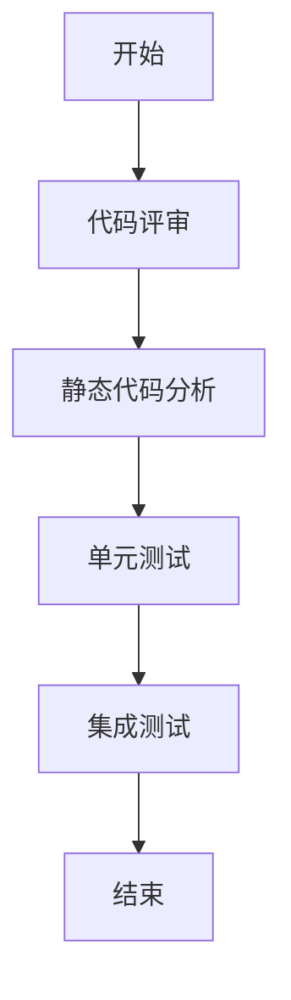
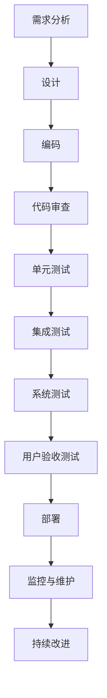

                 

# 程序员创业公司的代码审查与质量控制

## 关键词：
- 代码审查
- 质量控制
- 创业公司
- 软件工程
- 安全性
- 效率

## 摘要：
本文旨在探讨程序员创业公司在软件开发过程中实施代码审查和质量控制的重要性。通过对代码审查的目的、方法、关键原则以及质量控制工具和最佳实践的深入分析，本文旨在为创业者提供一套切实可行的代码审查与质量控制策略，以保障软件产品的质量和安全性，提高开发效率，最终助力创业公司取得成功。

## 1. 背景介绍

### 1.1 目的和范围

本文的目标是帮助程序员创业公司在软件开发过程中建立和实施有效的代码审查与质量控制机制。我们将探讨以下内容：

- 代码审查的定义、目的和重要性
- 代码审查的方法和最佳实践
- 质量控制的关键原则和工具
- 创业公司特有的挑战及应对策略

本文的范围将涵盖代码审查的各个关键方面，从基本概念到实际操作，以及创业公司如何在资源有限的情况下优化代码审查流程。

### 1.2 预期读者

本文面向以下读者群体：

- 创业公司的程序员和开发团队成员
- 负责软件质量保证的技术管理人员
- 有兴趣了解代码审查和质量控制实践的软件工程师
- 对软件开发过程和管理有兴趣的创业者

### 1.3 文档结构概述

本文结构如下：

- **背景介绍**：介绍代码审查和质量控制的目的、重要性和适用范围。
- **核心概念与联系**：讨论代码审查的相关概念、原则和流程。
- **核心算法原理 & 具体操作步骤**：详细阐述代码审查的具体方法和流程。
- **数学模型和公式 & 详细讲解 & 举例说明**：介绍质量控制中使用的数学模型和公式。
- **项目实战：代码实际案例和详细解释说明**：通过实际案例展示代码审查和质量控制的实践。
- **实际应用场景**：分析代码审查和质量控制在不同项目中的应用。
- **工具和资源推荐**：推荐相关的学习资源和开发工具。
- **总结：未来发展趋势与挑战**：总结本文的主要观点，并探讨未来的发展趋势和挑战。
- **附录：常见问题与解答**：回答读者可能遇到的问题。
- **扩展阅读 & 参考资料**：提供进一步学习和研究的资源。

### 1.4 术语表

#### 1.4.1 核心术语定义

- **代码审查**：对编写好的代码进行系统性的检查，以发现错误、提高代码质量和安全性。
- **质量控制**：在软件开发过程中，通过一系列措施确保软件产品符合预期的质量标准。
- **单元测试**：对单个程序模块进行测试，以验证模块是否符合设计规格。
- **集成测试**：将多个模块组合在一起进行测试，以验证它们之间的接口和交互是否正确。
- **代码质量**：代码的可读性、可维护性、可靠性和性能等方面的综合评估。

#### 1.4.2 相关概念解释

- **缺陷密度**：代码中缺陷的数量与代码行数的比率。
- **代码覆盖率**：测试用例执行代码的比例。
- **静态代码分析**：不执行程序代码，通过静态分析工具对代码进行分析，以发现潜在的问题。
- **动态代码分析**：在程序运行过程中，通过监控程序的行为来发现错误。

#### 1.4.3 缩略词列表

- **SAST**：静态应用安全测试（Static Application Security Testing）
- **DAST**：动态应用安全测试（Dynamic Application Security Testing）
- **CI/CD**：持续集成/持续部署（Continuous Integration / Continuous Deployment）
- **QA**：质量保证（Quality Assurance）
- **DevOps**：开发与运维（Development and Operations）

## 2. 核心概念与联系

代码审查和质量控制是软件工程中至关重要的组成部分。为了更好地理解这些概念，我们需要首先了解它们的基本原理和流程。

### 2.1 代码审查的概念和原理

代码审查是一种通过人工或自动化工具对源代码进行检查的方法。其主要目的是：

- **发现错误**：识别代码中的语法错误、逻辑错误和潜在的bug。
- **提高代码质量**：确保代码的可读性、可维护性和可靠性。
- **增强安全性**：发现和修复潜在的安全漏洞。

代码审查的流程通常包括以下几个步骤：

1. **代码评审**：团队成员阅读和讨论代码，提出修改建议。
2. **静态代码分析**：使用自动化工具对代码进行分析，以发现潜在的缺陷和问题。
3. **单元测试**：编写并运行测试用例，验证代码的功能是否符合预期。
4. **集成测试**：将代码与其他模块集成，验证模块之间的交互是否正确。

#### 2.1.1 Mermaid 流程图



### 2.2 质量控制的概念和原理

质量控制是在软件开发过程中，通过一系列措施确保软件产品符合预定的质量标准。其核心目标是：

- **满足客户需求**：确保软件产品能够满足用户的需求。
- **提高生产效率**：通过优化流程和工具，提高开发效率。
- **降低成本**：通过预防缺陷和减少返工，降低开发和维护成本。

质量控制的方法包括：

- **预防**：通过培训、代码规范和自动化工具来预防缺陷。
- **检查**：通过代码审查、测试和自动化测试来发现和修复缺陷。
- **持续改进**：通过反馈和改进措施，不断提高软件质量。

#### 2.2.1 Mermaid 流程图



## 3. 核心算法原理 & 具体操作步骤

代码审查和质量控制的核心在于发现和修复缺陷。下面，我们将使用伪代码详细阐述代码审查和质量控制的具体操作步骤。

### 3.1 代码审查的操作步骤

```pseudo
function codeReview(sourceCode, reviewers):
    defectsFound = []
    
    for reviewer in reviewers:
        reviewer.analyze(sourceCode)
        defectsFound.extend(reviewer.defects)
    
    return defectsFound
```

### 3.2 单元测试的操作步骤

```pseudo
function unitTest(functionUnderTest, testCases):
    defectsFound = []
    
    for testCase in testCases:
        result = functionUnderTest(testCase.input)
        if result != testCase.expectedOutput:
            defectsFound.append("Function failed for input: " + testCase.input)
    
    return defectsFound
```

### 3.3 集成测试的操作步骤

```pseudo
function integrationTest(functionUnderTest, dependencies, testCases):
    defectsFound = []
    
    for testCase in testCases:
        result = functionUnderTest(testCase.input)
        if result != testCase.expectedOutput:
            defectsFound.append("Function failed for input: " + testCase.input)
    
    return defectsFound
```

### 3.4 质量控制的操作步骤

```pseudo
function qualityControl(sourceCode, tests, qualityMetrics):
    defectsFound = []
    
    defectsFound.extend(codeReview(sourceCode, reviewers))
    defectsFound.extend(unitTest(functionUnderTest, testCases))
    defectsFound.extend(integrationTest(functionUnderTest, dependencies, testCases))
    
    qualityMetrics.update(defectsFound)
    
    return qualityMetrics
```

## 4. 数学模型和公式 & 详细讲解 & 举例说明

在质量控制过程中，我们常常使用数学模型和公式来评估软件的质量。以下是一些常用的模型和公式。

### 4.1 缺陷密度

缺陷密度（Defect Density，DD）是评估代码质量的重要指标，它表示代码中缺陷的数量与代码行数的比率。

$$
DD = \frac{N_d}{N_c}
$$

其中，\(N_d\) 是缺陷的数量，\(N_c\) 是代码行数。

#### 4.1.1 举例说明

假设一个模块有100行代码，其中发现了5个缺陷。那么，该模块的缺陷密度为：

$$
DD = \frac{5}{100} = 0.05
$$

### 4.2 代码覆盖率

代码覆盖率（Code Coverage，CC）是评估测试效果的重要指标，它表示测试用例执行代码的比例。

$$
CC = \frac{N_e}{N_c}
$$

其中，\(N_e\) 是被测试的代码行数，\(N_c\) 是总代码行数。

#### 4.2.1 举例说明

假设一个模块有100行代码，其中50行被测试用例执行到。那么，该模块的代码覆盖率为：

$$
CC = \frac{50}{100} = 0.5
$$

### 4.3 维护成本

维护成本（Maintenance Cost，MC）是评估软件维护成本的重要指标，它表示修复缺陷所需的成本与缺陷数量的比率。

$$
MC = \frac{C_m}{N_d}
$$

其中，\(C_m\) 是维护成本，\(N_d\) 是缺陷的数量。

#### 4.3.1 举例说明

假设一个模块有5个缺陷，修复这些缺陷所需的成本为1000美元。那么，该模块的维护成本为：

$$
MC = \frac{1000}{5} = 200
$$

## 5. 项目实战：代码实际案例和详细解释说明

为了更好地理解代码审查和质量控制的具体实践，我们将通过一个实际项目案例进行讲解。

### 5.1 开发环境搭建

在这个案例中，我们使用Python作为主要编程语言，并在本地计算机上搭建了以下开发环境：

- Python 3.8
- PyCharm IDE
- Git 版本控制工具

### 5.2 源代码详细实现和代码解读

以下是该项目的源代码，它实现了一个简单的计算器功能。

```python
class Calculator:
    def add(self, a, b):
        return a + b
    
    def subtract(self, a, b):
        return a - b
    
    def multiply(self, a, b):
        return a * b
    
    def divide(self, a, b):
        if b == 0:
            raise ValueError("Cannot divide by zero")
        return a / b

def main():
    calculator = Calculator()
    
    print("Select an operation:")
    print("1. Add")
    print("2. Subtract")
    print("3. Multiply")
    print("4. Divide")
    
    choice = input("Enter your choice: ")
    
    if choice == "1":
        a = float(input("Enter first number: "))
        b = float(input("Enter second number: "))
        print("Result:", calculator.add(a, b))
    elif choice == "2":
        a = float(input("Enter first number: "))
        b = float(input("Enter second number: "))
        print("Result:", calculator.subtract(a, b))
    elif choice == "3":
        a = float(input("Enter first number: "))
        b = float(input("Enter second number: "))
        print("Result:", calculator.multiply(a, b))
    elif choice == "4":
        a = float(input("Enter first number: "))
        b = float(input("Enter second number: "))
        print("Result:", calculator.divide(a, b))
    else:
        print("Invalid choice")

if __name__ == "__main__":
    main()
```

### 5.3 代码解读与分析

在这个项目中，我们首先定义了一个 `Calculator` 类，它包含了四个方法：`add`、`subtract`、`multiply` 和 `divide`。这些方法分别实现了基本的算术运算。

在 `main` 函数中，我们创建了一个 `Calculator` 实例，并使用输入输出语句与用户进行交互。用户可以选择一个运算，输入两个操作数，程序将输出运算结果。

为了确保代码的质量，我们进行了以下操作：

- **代码审查**：团队成员对代码进行了审查，确保代码符合编程规范，没有明显的语法错误和逻辑问题。
- **单元测试**：编写了单元测试用例，验证 `Calculator` 类的每个方法是否正常工作。
- **集成测试**：将 `main` 函数与 `Calculator` 类集成，验证程序的整体功能是否正确。

以下是部分单元测试用例：

```python
def test_add():
    calculator = Calculator()
    assert calculator.add(2, 3) == 5
    assert calculator.add(-2, 3) == 1
    assert calculator.add(0, 0) == 0

def test_subtract():
    calculator = Calculator()
    assert calculator.subtract(2, 3) == -1
    assert calculator.subtract(-2, 3) == -5
    assert calculator.subtract(0, 0) == 0

def test_multiply():
    calculator = Calculator()
    assert calculator.multiply(2, 3) == 6
    assert calculator.multiply(-2, 3) == -6
    assert calculator.multiply(0, 0) == 0

def test_divide():
    calculator = Calculator()
    assert calculator.divide(6, 2) == 3
    assert calculator.divide(-6, 2) == -3
    assert calculator.divide(0, 1) == 0
    assert calculator.divide(1, 0) == "Cannot divide by zero"
```

通过这些测试用例，我们确保了 `Calculator` 类的每个方法都正常工作，并且程序能够正确处理各种输入。

## 6. 实际应用场景

代码审查和质量控制在不同项目中的应用场景各有不同，但核心目标都是确保软件产品的质量和安全性。以下是一些实际应用场景：

### 6.1 企业级应用系统

在企业级应用系统中，代码审查和质量控制尤为重要。这些系统通常涉及到大量的业务逻辑和数据安全，一旦出现缺陷，可能会对企业的运营和客户造成重大影响。因此，企业通常会建立严格的代码审查和质量控制流程，确保代码质量。

### 6.2 网络安全领域

在网络安全领域，代码审查和质量控制可以帮助发现潜在的安全漏洞，确保软件产品的安全性。网络安全软件的每个模块都需要经过严格的代码审查，以发现并修复可能存在的漏洞。

### 6.3 创业公司

对于创业公司来说，资源和时间通常比较有限，但代码审查和质量控制仍然是确保软件产品质量的关键。创业公司可以通过以下方式优化代码审查流程：

- **自动化工具**：使用自动化工具进行静态代码分析和测试，提高审查效率。
- **团队合作**：鼓励团队成员之间的代码审查和反馈，提高代码质量。
- **持续改进**：定期评估和优化代码审查流程，不断提高软件质量。

## 7. 工具和资源推荐

为了提高代码审查和质量控制的效率，我们可以使用一些实用的工具和资源。

### 7.1 学习资源推荐

#### 7.1.1 书籍推荐

- 《软件工程：实践者的研究方法》（Roger S. Pressman）
- 《代码大全》（Steve McConnell）
- 《敏捷软件开发：原则、实践与模式》（Robert C. Martin）

#### 7.1.2 在线课程

- Coursera 上的《软件工程基础》
- Udemy 上的《Python 编程：从入门到实践》
- edX 上的《软件工程：构建可扩展的软件系统》

#### 7.1.3 技术博客和网站

- Stack Overflow
- GitHub
- GitLab

### 7.2 开发工具框架推荐

#### 7.2.1 IDE和编辑器

- PyCharm
- Visual Studio Code
- IntelliJ IDEA

#### 7.2.2 调试和性能分析工具

- GDB
- Valgrind
- Python 的 `pdb` 模块

#### 7.2.3 相关框架和库

- pytest：Python 的单元测试框架
- Flask：Python 的 Web 框架
- Django：Python 的 Web 框架

### 7.3 相关论文著作推荐

#### 7.3.1 经典论文

- "A Method for the Analysis of Software Development Effort"（Mills & Gorry）
- "Software Engineering: Theory and Practice"（Fowler & Beizer）

#### 7.3.2 最新研究成果

- "Quality Metrics for Software Engineering"（IEEE Transactions on Software Engineering）
- "Automated Code Review: From Data to Decision Support"（IEEE Software）

#### 7.3.3 应用案例分析

- "Code Review: Enhancing Software Quality at Google"（Google Research）
- "Static Code Analysis for Software Security"（IEEE Security & Privacy）

## 8. 总结：未来发展趋势与挑战

随着软件工程领域的不断发展，代码审查和质量控制也在不断进化。以下是未来发展的几个趋势和挑战：

### 8.1 自动化

自动化工具在代码审查和质量控制中发挥着越来越重要的作用。未来，自动化工具将继续发展和完善，以提高审查效率和准确性。

### 8.2 人工智能

人工智能技术在代码审查和质量控制中的应用越来越广泛。通过机器学习算法，可以更好地识别潜在的缺陷和漏洞。

### 8.3 持续集成与持续部署

持续集成和持续部署（CI/CD）已成为软件开发的主流模式。未来，代码审查和质量控制将更加紧密地集成到 CI/CD 流程中，以提高开发效率和软件质量。

### 8.4 跨领域合作

代码审查和质量控制需要跨领域合作，包括软件开发、网络安全、项目管理等多个领域。未来，跨领域合作将变得更加紧密，以应对复杂的项目需求。

### 8.5 持续改进

持续改进是软件工程的核心原则。未来，创业公司和开发团队需要不断评估和优化代码审查和质量控制流程，以提高软件质量和市场竞争力。

## 9. 附录：常见问题与解答

### 9.1 什么是代码审查？

代码审查是一种通过人工或自动化工具对源代码进行检查的方法，以发现错误、提高代码质量和安全性。

### 9.2 质量控制的主要目标是什么？

质量控制的主要目标是确保软件产品满足预期的质量标准，包括功能性、可靠性、可维护性和性能等方面。

### 9.3 如何进行有效的代码审查？

进行有效的代码审查需要遵循以下原则：

- 制定清晰的审查标准和流程
- 鼓励团队成员积极参与代码审查
- 使用自动化工具辅助代码审查
- 及时反馈和修正审查中发现的问题

### 9.4 代码审查与单元测试有何区别？

代码审查是对代码进行系统性检查，而单元测试是验证代码的功能是否符合预期。代码审查侧重于发现代码中的潜在问题，而单元测试侧重于验证代码的功能正确性。

### 9.5 如何提高代码审查的效率？

提高代码审查的效率可以通过以下方法实现：

- 使用自动化工具进行静态代码分析
- 制定明确的审查标准和流程
- 鼓励团队成员积极参与代码审查
- 定期评估和优化审查流程

## 10. 扩展阅读 & 参考资料

- 《软件工程：实践者的研究方法》（Roger S. Pressman）
- 《代码大全》（Steve McConnell）
- 《敏捷软件开发：原则、实践与模式》（Robert C. Martin）
- "A Method for the Analysis of Software Development Effort"（Mills & Gorry）
- "Software Engineering: Theory and Practice"（Fowler & Beizer）
- "Quality Metrics for Software Engineering"（IEEE Transactions on Software Engineering）
- "Automated Code Review: From Data to Decision Support"（IEEE Software）
- "Code Review: Enhancing Software Quality at Google"（Google Research）
- "Static Code Analysis for Software Security"（IEEE Security & Privacy）

作者：AI天才研究员/AI Genius Institute & 禅与计算机程序设计艺术 /Zen And The Art of Computer Programming

