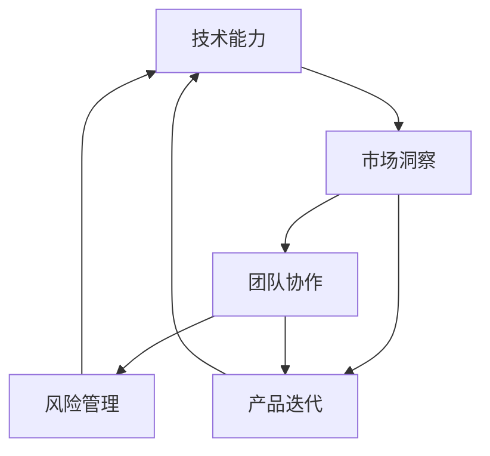

                 

# 程序员创业公司的持续创新与竞争力提升

> 关键词：程序员创业、持续创新、竞争力提升、技术策略、市场分析、团队管理、产品迭代

> 摘要：本文旨在探讨程序员创业公司在激烈的市场竞争中如何通过持续创新和优化，提升自身竞争力。文章将从技术策略、市场分析、团队管理和产品迭代等方面进行分析，为创业公司提供实用的指导和建议。

## 1. 背景介绍

### 1.1 目的和范围

本文旨在帮助程序员创业公司理解并实施有效的持续创新策略，以应对市场变化和竞争对手的挑战。文章将从多个维度探讨如何提升公司的竞争力，包括技术选型、市场分析、团队建设和产品迭代。

### 1.2 预期读者

本文适合有志于创业或已经成立创业公司的程序员，特别是那些希望在技术领域取得突破的公司。同时，也对关注创业领域的技术专家和管理者具有一定的参考价值。

### 1.3 文档结构概述

本文结构如下：

1. 背景介绍
2. 核心概念与联系
3. 核心算法原理 & 具体操作步骤
4. 数学模型和公式 & 详细讲解 & 举例说明
5. 项目实战：代码实际案例和详细解释说明
6. 实际应用场景
7. 工具和资源推荐
8. 总结：未来发展趋势与挑战
9. 附录：常见问题与解答
10. 扩展阅读 & 参考资料

### 1.4 术语表

#### 1.4.1 核心术语定义

- **程序员创业公司**：由程序员或技术团队创立，专注于技术产品的公司。
- **持续创新**：不断寻求新的想法、技术或方法，以保持竞争优势。
- **竞争力提升**：通过多种手段增加公司产品和服务的市场吸引力。

#### 1.4.2 相关概念解释

- **技术选型**：选择适合公司战略和市场需求的技术栈和框架。
- **市场分析**：研究市场趋势、竞争环境和潜在客户。
- **团队建设**：构建高效、协作的团队，实现共同目标。
- **产品迭代**：通过不断改进和优化产品，满足用户需求。

#### 1.4.3 缩略词列表

- **SaaS**：Software as a Service，软件即服务。
- **PaaS**：Platform as a Service，平台即服务。
- **IaaS**：Infrastructure as a Service，基础设施即服务。

## 2. 核心概念与联系

持续创新是程序员创业公司生存和发展的关键。为了更好地理解这一概念，我们需要将其与以下几个核心概念联系起来：

1. **技术能力**：技术能力是持续创新的基石。一个强大的技术团队可以快速响应市场需求，开发出具有竞争力的产品。
2. **市场洞察**：了解市场趋势和用户需求，可以帮助公司把握创新的方向，避免盲目跟风。
3. **团队协作**：高效的团队协作可以加快创新速度，提高产品质量。
4. **风险管理**：创新过程中，公司需要识别和管理潜在的风险，确保项目的顺利进行。

下面是一个简单的 Mermaid 流程图，展示了这些核心概念之间的联系：



通过这个流程图，我们可以看到技术能力、市场洞察、团队协作和风险管理是持续创新的核心要素，它们相互影响，共同推动产品迭代和公司发展。

## 3. 核心算法原理 & 具体操作步骤

持续创新的核心在于如何快速开发和优化产品。在这个过程中，算法原理和具体操作步骤起着至关重要的作用。以下是一个简单的算法原理说明，以及对应的伪代码：

### 3.1 算法原理

持续创新的算法可以分为以下几个步骤：

1. **需求分析**：收集和分析用户需求，确定产品的核心功能。
2. **技术选型**：根据需求选择合适的技术栈和框架。
3. **原型设计**：快速构建原型，验证产品概念。
4. **迭代开发**：基于用户反馈，不断改进和优化产品。

### 3.2 伪代码

下面是持续创新算法的伪代码：

```plaintext
function 持续创新(需求，技术栈，时间预算) {
    // 步骤1：需求分析
    用户需求 = 收集需求()
    核心功能 = 确定核心功能(用户需求)

    // 步骤2：技术选型
    适合的技术栈 = 选择技术栈(核心功能，时间预算)
    
    // 步骤3：原型设计
    原型 = 构建原型(核心功能，适合的技术栈)
    验证 = 验证原型(用户需求)

    // 步骤4：迭代开发
    while (验证 != 用户需求) {
        用户反馈 = 收集用户反馈()
        优化 = 优化原型(用户反馈)
        验证 = 验证原型(优化版本)
    }
    
    // 输出最终产品
    return 原型
}
```

通过这个算法，我们可以看到，持续创新的关键在于快速响应用户需求，不断优化产品。这个过程需要技术团队具备强大的需求分析、技术选型和迭代开发能力。

## 4. 数学模型和公式 & 详细讲解 & 举例说明

在持续创新的过程中，数学模型和公式可以帮助我们量化创新效果，优化决策过程。以下是一个简单的数学模型，用于评估产品迭代的收益：

### 4.1 数学模型

设 \( R \) 为产品迭代后的收益，\( C \) 为迭代成本，\( U \) 为用户满意度，则：

\[ R = f(C, U) \]

其中，函数 \( f \) 描述了成本和用户满意度对收益的影响。

### 4.2 详细讲解

- \( C \)：迭代成本包括人力成本、时间成本和资源成本等。成本越高，创新难度越大。
- \( U \)：用户满意度反映了产品迭代的用户接受度。满意度越高，收益越高。

### 4.3 举例说明

假设一个创业公司计划进行一次产品迭代，预计迭代成本为 10 万元，用户满意度为 0.8。则收益 \( R \) 为：

\[ R = f(10, 0.8) = 0.8 \times (1 - 10^{-5}) \approx 0.7992 \]

这意味着，在成本和用户满意度一定的情况下，产品迭代后的收益约为 0.7992 万元。

通过这个数学模型，我们可以量化产品迭代的效果，帮助公司在决策过程中更加科学和精准。

## 5. 项目实战：代码实际案例和详细解释说明

为了更好地理解持续创新的实践过程，我们将通过一个实际项目案例进行讲解。

### 5.1 开发环境搭建

假设我们的项目是一个基于 SaaS 的在线办公协同平台，需要使用以下技术栈：

- 后端：Spring Boot、MySQL
- 前端：Vue.js、Element UI
- 容器化：Docker、Kubernetes

开发环境搭建步骤如下：

1. 安装 Java 开发环境（JDK 1.8+）。
2. 安装 MySQL 数据库。
3. 安装 Node.js 和 npm。
4. 安装 Docker 和 Kubernetes。

### 5.2 源代码详细实现和代码解读

以下是一个简单的 Spring Boot 后端代码示例，用于处理用户登录请求：

```java
@RestController
@RequestMapping("/api")
public class UserController {

    @Autowired
    private UserService userService;

    @PostMapping("/login")
    public ResponseEntity<?> login(@RequestBody LoginRequest request) {
        String username = request.getUsername();
        String password = request.getPassword();

        // 验证用户名和密码
        boolean isAuthenticated = userService.authenticate(username, password);

        if (isAuthenticated) {
            // 登录成功，返回 JWT 令牌
            String token = userService.generateToken(username);
            return ResponseEntity.ok(new JwtResponse(token));
        } else {
            // 登录失败，返回错误消息
            return ResponseEntity.badRequest().body("Invalid credentials");
        }
    }
}
```

这段代码展示了用户登录的核心逻辑，包括用户名和密码的验证，以及 JWT 令牌的生成。通过这个示例，我们可以看到，代码的核心在于业务逻辑的实现，以及与数据库和 JWT 库的交互。

### 5.3 代码解读与分析

- **UserController**：负责处理用户相关的 HTTP 请求，包括登录、注册、信息查询等。
- **LoginRequest**：登录请求实体类，包含用户名和密码等字段。
- **JwtResponse**：JWT 令牌响应实体类，包含令牌信息。
- **UserService**：用户服务类，负责用户认证和令牌生成。

通过这个代码示例，我们可以看到，在持续创新的过程中，代码的清晰性和可维护性至关重要。一个优秀的程序员创业公司，需要确保代码的可读性、规范性和模块化，以便团队高效协作和持续迭代。

## 6. 实际应用场景

持续创新在程序员创业公司中的应用场景非常广泛，以下是一些典型的应用案例：

1. **产品迭代**：通过持续收集用户反馈，不断优化产品功能和用户体验。
2. **技术升级**：定期评估技术栈的更新，引入新技术以提升产品性能和开发效率。
3. **市场拓展**：通过市场调研和数据分析，寻找新的市场机会和潜在客户。
4. **团队建设**：定期组织团队培训和技术分享，提高团队整体的技术水平和协作能力。

例如，一家程序员创业公司，通过持续创新，成功地将一款在线办公协同平台推向市场。公司定期收集用户反馈，不断优化产品功能，如文档协作、会议安排等。同时，公司引入了 Docker 和 Kubernetes 等新技术，提升了产品的性能和稳定性。在市场拓展方面，公司通过数据分析，找到了新的目标客户群体，并制定了针对性的营销策略。最终，公司在短时间内取得了显著的市场份额和用户口碑。

## 7. 工具和资源推荐

### 7.1 学习资源推荐

#### 7.1.1 书籍推荐

- **《精益创业》**：作者埃里克·莱斯，详细介绍了如何在创业过程中快速验证产品需求。
- **《人人都能用人工智能》**：作者许金裕，介绍了人工智能的基本概念和应用场景。
- **《敏捷软件开发》**：作者杰夫里·费特，讲述了敏捷开发的方法和实践。

#### 7.1.2 在线课程

- **Coursera**：《产品管理》课程，由斯坦福大学教授提供。
- **Udacity**：《人工智能纳米学位》课程，全面介绍了人工智能的基础知识和应用。
- **网易云课堂**：《程序员进阶》课程，适合有志于提升技术能力的程序员。

#### 7.1.3 技术博客和网站

- **GitHub**：全球最大的代码托管平台，提供了丰富的开源项目和文档。
- **Stack Overflow**：全球最大的编程问答社区，提供了大量编程问题和解决方案。
- **Medium**：一个内容平台，聚集了大量的技术文章和观点。

### 7.2 开发工具框架推荐

#### 7.2.1 IDE和编辑器

- **Visual Studio Code**：一款功能强大的跨平台代码编辑器。
- **IntelliJ IDEA**：一款适用于 Java 和其他语言的集成开发环境。
- **PyCharm**：一款适用于 Python 开发的集成开发环境。

#### 7.2.2 调试和性能分析工具

- **Postman**：一款 API 调试工具，支持各种编程语言。
- **JMeter**：一款性能测试工具，可以模拟大规模并发访问。
- **Grafana**：一款可视化分析工具，可以监控和展示系统性能数据。

#### 7.2.3 相关框架和库

- **Spring Boot**：一款基于 Spring 的快速开发框架。
- **Vue.js**：一款流行的前端框架，适用于构建用户界面。
- **Docker**：一款容器化技术，用于打包、发布和运行应用。

### 7.3 相关论文著作推荐

#### 7.3.1 经典论文

- **《创新者的窘境》**：作者克里斯坦森，讲述了技术进步如何颠覆传统产业。
- **《从优秀到卓越》**：作者柯林斯，探讨了如何让企业持续保持竞争优势。

#### 7.3.2 最新研究成果

- **《人工智能应用发展趋势》**：总结了人工智能在各个领域的最新应用成果。
- **《云计算服务模式创新》**：分析了云计算服务模式的新趋势和未来发展方向。

#### 7.3.3 应用案例分析

- **《硅谷创业神话》**：通过分析硅谷的成功企业，探讨了创业公司的成功要素。
- **《中国互联网产业发展报告》**：分析了我国互联网产业的发展现状和未来趋势。

## 8. 总结：未来发展趋势与挑战

程序员创业公司的未来发展趋势和挑战主要体现在以下几个方面：

### 8.1 发展趋势

1. **技术创新**：随着人工智能、云计算、大数据等技术的不断发展，程序员创业公司将在这些领域取得更多的突破。
2. **市场细分**：细分市场将带来更多的机会，创业公司需要更精准地定位和满足特定用户群体的需求。
3. **国际化**：全球化趋势使得程序员创业公司有机会进入更广阔的市场，拓展业务。

### 8.2 挑战

1. **竞争加剧**：随着更多创业公司的涌入，市场竞争将更加激烈。
2. **技术迭代**：技术迭代速度加快，创业公司需要不断更新技术栈，以保持竞争力。
3. **人才短缺**：高技能人才短缺将是一个长期挑战，创业公司需要通过多种方式吸引和留住人才。

## 9. 附录：常见问题与解答

### 9.1 持续创新的具体方法有哪些？

- **用户反馈**：定期收集用户反馈，了解用户需求和使用体验。
- **技术调研**：关注新技术和发展趋势，评估其对业务的影响。
- **团队协作**：鼓励团队内部的知识分享和协作，提高创新能力。
- **敏捷开发**：采用敏捷开发方法，快速迭代和优化产品。

### 9.2 如何提升团队的技术水平？

- **培训与学习**：定期组织技术培训和分享，鼓励员工学习新技术。
- **项目实践**：通过实际项目锻炼团队的技术能力和经验。
- **技术交流**：参加技术会议和活动，与其他技术团队交流经验。

### 9.3 如何在竞争激烈的市场中保持竞争力？

- **精准定位**：明确目标市场和用户群体，提供有针对性的产品和服务。
- **创新驱动**：持续关注技术趋势和市场需求，保持产品创新。
- **品牌建设**：通过品牌营销和用户口碑，提升公司知名度和认可度。

## 10. 扩展阅读 & 参考资料

- **《创业维艰》**：作者本·霍洛维茨，详细讲述了创业过程中的挑战和应对策略。
- **《创新者的答案》**：作者克里斯坦森，探讨了如何在竞争中找到突破口。
- **《程序员职业生涯规划》**：作者王道，提供了程序员职业发展的实用建议。

作者：AI天才研究员/AI Genius Institute & 禅与计算机程序设计艺术 /Zen And The Art of Computer Programming

---

通过本文的深入探讨，我们希望程序员创业公司能够更好地理解持续创新的重要性，并在实践中不断优化自身的技术能力、市场洞察、团队协作和风险管理，从而在激烈的市场竞争中脱颖而出。持续创新不仅是一个技术问题，更是一个战略问题，它关系到公司的生存和发展。让我们携手共进，共同推动程序员创业公司的繁荣发展。

