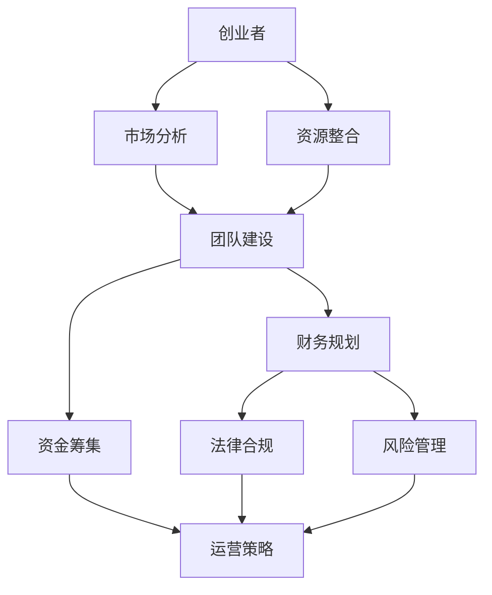

                 

# 程序员创业指南：一人公司实现财富自由之路

## > 关键词：程序员创业，财富自由，个人公司，独立运营，市场策略，风险控制

> 摘要：本文旨在为有志于创业的程序员提供一套完整的创业指南，通过剖析成功案例、市场分析、财务规划以及法律和运营细节，帮助程序员从零开始创建并运营一家个人公司，实现财富自由。

## 1. 背景介绍

### 1.1 目的和范围

本文的目标是帮助程序员理解并掌握创业的各个方面，尤其是如何在资源有限的情况下，利用自身的编程技能和专业知识，独立创办一家公司，并最终实现财务自由。本文将涵盖以下主要内容：

- 创业的动机和目标
- 市场分析和定位
- 资源整合与团队建设
- 财务规划和资金筹集
- 法律合规和风险管理
- 运营策略和持续发展

### 1.2 预期读者

本文适合以下读者群体：

- 有创业想法的程序员
- 想要了解创业流程的职场人士
- 正在创业的程序员和创业者
- 想要拓展业务和扩展市场的公司创始人

### 1.3 文档结构概述

本文分为十个主要部分，每部分的具体内容如下：

1. **背景介绍**：介绍文章的目的、预期读者以及文档结构。
2. **核心概念与联系**：解释创业所需的核心概念，并通过Mermaid流程图展示各概念之间的联系。
3. **核心算法原理与具体操作步骤**：详细阐述创业的基本流程和操作步骤，使用伪代码进行说明。
4. **数学模型和公式**：介绍与创业相关的数学模型和公式，并举例说明。
5. **项目实战**：通过实际案例，展示代码的实现过程和解析。
6. **实际应用场景**：分析创业在不同行业和领域的应用场景。
7. **工具和资源推荐**：推荐学习资源和开发工具。
8. **相关论文著作推荐**：推荐经典和最新研究成果。
9. **总结**：总结文章内容，探讨未来发展趋势和挑战。
10. **附录**：解答常见问题，提供扩展阅读和参考资料。

### 1.4 术语表

#### 1.4.1 核心术语定义

- **创业者**：有创业想法并付诸实践的人。
- **财富自由**：无需为生活开支而工作，能够自由支配时间和资源的状态。
- **市场定位**：在市场中确定自己的产品或服务所针对的特定群体和领域。
- **资源整合**：有效利用内部和外部资源，以实现创业目标。
- **法律合规**：遵守相关法律法规，确保公司运营的合法性。
- **风险管理**：识别和应对潜在风险，以减少负面影响。

#### 1.4.2 相关概念解释

- **市场分析**：研究市场需求、竞争态势和潜在客户，以制定有效的市场策略。
- **团队建设**：招募和培养适合的人才，建立高效协作的团队。
- **资金筹集**：通过各种途径获取创业所需的资金。
- **运营策略**：制定并实施公司日常运营的计划和措施。

#### 1.4.3 缩略词列表

- **AI**：人工智能（Artificial Intelligence）
- **SEO**：搜索引擎优化（Search Engine Optimization）
- **SaaS**：软件即服务（Software as a Service）
- **IaaS**：基础设施即服务（Infrastructure as a Service）
- **PaaS**：平台即服务（Platform as a Service）

## 2. 核心概念与联系

在创业过程中，理解并掌握以下核心概念和其相互之间的联系是非常重要的。以下是一个简化的Mermaid流程图，用于展示这些概念之间的逻辑关系。



### 2.1 创业者的角色与市场分析

创业者是创业的核心驱动力，需要通过市场分析来确定创业的方向。市场分析包括对目标市场的需求、竞争态势和潜在客户的了解。一个深入的市场分析有助于创业者找到市场缺口，制定出有针对性的产品或服务策略。

### 2.2 资源整合与团队建设

资源整合是指有效利用内部和外部资源，以实现创业目标。团队建设是资源整合的重要组成部分，招募和培养适合的人才对于公司的成功至关重要。一个高效协作的团队能够更好地应对市场变化和挑战。

### 2.3 财务规划、资金筹集与风险管理

财务规划是确保公司长期稳定发展的基础。通过合理的财务规划，创业者可以更好地掌握公司的财务状况，为公司的运营提供有力的支持。资金筹集是创业过程中必不可少的环节，通过各种途径获取资金是公司生存和发展的关键。风险管理则是识别和应对潜在风险，以减少负面影响。

### 2.4 法律合规与运营策略

法律合规是确保公司运营合法性的重要保障。创业者需要了解并遵守相关法律法规，以确保公司的运营不会受到法律纠纷的困扰。运营策略则是制定并实施公司日常运营的计划和措施，以实现公司的长期发展目标。

## 3. 核心算法原理与具体操作步骤

创业的基本流程可以看作是一个算法，其核心原理是资源的最优化利用和市场需求的满足。以下使用伪代码详细阐述创业的基本流程和操作步骤。

### 3.1 初始化

```python
initialize Entrepreneur()
initialize MarketAnalysis()
initialize ResourceIntegration()
initialize TeamBuilding()
initialize FinancialPlanning()
initialize RiskManagement()
initialize LegalCompliance()
initialize OperationalStrategy()
```

### 3.2 市场分析

```python
def market_analysis():
    collect_market_data()
    analyze_competition()
    identify_target_clients()
    return analysis_report
```

### 3.3 资源整合

```python
def resource_integration():
    assess_internal_resources()
    leverage_external_resources()
    allocate_resources_efficiently()
```

### 3.4 团队建设

```python
def team_building():
    recruit_talent()
    train_staff()
    establish_team_culture()
```

### 3.5 财务规划

```python
def financial_planning():
    budget_estimation()
    cash_flow_management()
    profit_and_loss_analysis()
```

### 3.6 资金筹集

```python
def fundraising():
    identify_funding_sources()
    prepare_business_plan()
    pitch_to_investors()
```

### 3.7 风险管理

```python
def risk_management():
    identify_risks()
    assess_risks()
    implement_risk.mitigation_measures()
```

### 3.8 法律合规

```python
def legal_compliance():
    understand_laws()
    register_business()
    obtain_permit()
```

### 3.9 运营策略

```python
def operational_strategy():
    set_goals()
    develop_strategies()
    implement_strategies()
```

### 3.10 持续优化

```python
def continuous_optimization():
    monitor_performance()
    gather_feedback()
    refine_strategy()
```

通过以上伪代码，我们可以看到创业的基本流程是一个迭代优化的过程，需要不断根据市场反馈和公司运营状况进行调整和优化。

## 4. 数学模型和公式

在创业过程中，数学模型和公式可以帮助创业者更好地进行财务规划、风险评估和市场分析。以下是一些常见的数学模型和公式，并加以详细解释和举例说明。

### 4.1 成本收益分析（CVA）

成本收益分析是一种评估项目或业务可行性的方法，通过计算项目的总成本和预期收益，来决定是否值得进行投资。

**公式**：
\[ \text{CVA} = \frac{\text{总收益}}{\text{总成本}} \]

**解释**：
CVA 值越高，表示项目的盈利能力越强。

**例子**：
假设一家公司预计一年的总收益为100万元，总成本为60万元，则其成本收益比为：
\[ \text{CVA} = \frac{100}{60} = 1.67 \]

### 4.2 罗杰斯风险评分模型

罗杰斯风险评分模型用于评估创业项目的风险水平，其核心公式为：

\[ \text{RRS} = \frac{\text{潜在损失}}{\text{潜在收益}} \]

**解释**：
RRS 值越高，表示项目的风险越大。

**例子**：
如果一个创业项目的潜在损失为20万元，潜在收益为100万元，则其罗杰斯风险评分为：
\[ \text{RRS} = \frac{20}{100} = 0.2 \]

### 4.3 市场渗透率模型

市场渗透率模型用于分析产品在市场中的占有率，其核心公式为：

\[ \text{Market Penetration Rate} = \frac{\text{产品销售量}}{\text{市场总需求量}} \]

**解释**：
市场渗透率越高，表示产品的市场竞争力越强。

**例子**：
如果一个产品的销售量为1000件，而市场总需求量为5000件，则其市场渗透率为：
\[ \text{Market Penetration Rate} = \frac{1000}{5000} = 0.2 \]

### 4.4 资金时间价值（FV）

资金时间价值是指资金在时间上的价值变化，其核心公式为：

\[ \text{FV} = \text{PV} \times (1 + r)^n \]

**解释**：
FV 是未来价值，PV 是现值，r 是年利率，n 是时间（年）。

**例子**：
假设一家公司投资的资金为10万元，年利率为5%，投资期限为3年，则其未来价值为：
\[ \text{FV} = 10 \times (1 + 0.05)^3 = 11.57625 \]

### 4.5 贝塔系数（β）

贝塔系数是衡量股票或投资组合相对于市场风险的指标，其核心公式为：

\[ \beta = \frac{\text{投资组合收益率}}{\text{市场收益率}} \]

**解释**：
贝塔系数越大，表示投资组合的市场风险越高。

**例子**：
假设一个投资组合的收益率为12%，市场收益率为8%，则其贝塔系数为：
\[ \beta = \frac{12\%}{8\%} = 1.5 \]

通过上述数学模型和公式的应用，创业者可以更科学、系统地评估项目的可行性、风险和市场潜力。

## 5. 项目实战：代码实际案例和详细解释说明

在本节中，我们将通过一个实际案例来展示创业过程中如何编写代码，并通过具体实现和代码解读，帮助读者理解创业的实践步骤。

### 5.1 开发环境搭建

首先，我们需要搭建一个适合创业项目的开发环境。以下是一个简单的步骤：

1. 安装Python环境（版本3.8或更高）。
2. 安装常用的Python库，如Pandas、NumPy、Matplotlib等。
3. 配置一个版本控制系统，如Git。

### 5.2 源代码详细实现和代码解读

以下是一个简单的市场分析代码实现，用于收集和分析市场数据，并生成分析报告。

```python
# 导入所需的库
import pandas as pd
import numpy as np
import matplotlib.pyplot as plt

# 5.2.1 数据收集
def collect_data():
    # 假设我们从CSV文件中读取数据
    data = pd.read_csv('market_data.csv')
    return data

# 5.2.2 数据清洗
def clean_data(data):
    # 删除含有缺失值的行
    cleaned_data = data.dropna()
    return cleaned_data

# 5.2.3 数据分析
def analyze_data(cleaned_data):
    # 统计销售量和市场占有率
    sales_data = cleaned_data.groupby('product')['quantity'].sum()
    market_share = sales_data / cleaned_data['quantity'].sum()
    
    # 可视化市场占有率
    market_share.plot(kind='bar')
    plt.title('Market Share by Product')
    plt.xlabel('Product')
    plt.ylabel('Market Share')
    plt.show()

# 5.2.4 主函数
def main():
    data = collect_data()
    cleaned_data = clean_data(data)
    analyze_data(cleaned_data)

# 运行主函数
if __name__ == '__main__':
    main()
```

### 5.3 代码解读与分析

1. **数据收集**：通过`pd.read_csv()`函数从CSV文件中读取市场数据。
2. **数据清洗**：删除含有缺失值的行，确保数据分析的准确性。
3. **数据分析**：统计每个产品的销售量和市场占有率，并使用`plot(kind='bar')`进行可视化展示。
4. **主函数**：调用上述函数，实现数据收集、清洗和分析的全流程。

通过上述代码，创业者可以快速了解市场数据，为制定市场策略提供依据。

### 5.4 代码解读与分析

1. **数据收集**：使用Pandas库从CSV文件中读取数据，这是市场分析的基础。
2. **数据清洗**：删除缺失值，保证数据的完整性和准确性。
3. **数据分析**：使用Pandas和NumPy库进行数据统计和计算，得到销售量和市场占有率。
4. **可视化展示**：使用Matplotlib库将市场占有率以条形图的形式展示，便于理解和分析。
5. **主函数**：调用所有函数，实现市场分析的全过程。

### 5.5 实际应用场景

- **市场调研**：使用该代码分析市场数据，为新产品发布或市场扩展提供决策支持。
- **销售分析**：监控每个产品的销售情况，优化库存和销售策略。
- **竞争分析**：了解市场占有率，识别竞争对手的优劣势。

通过这个实际案例，创业者可以了解到编写代码在实际创业中的应用，以及如何通过数据分析做出更明智的商业决策。

## 6. 实际应用场景

创业可以发生在各个行业和领域，以下是一些具体的应用场景和案例分析：

### 6.1 科技行业

- **案例：Airbnb**
  Airbnb 是一个基于互联网的共享经济平台，通过将闲置房屋资源进行共享，实现了全球范围内的房屋租赁。其成功的关键在于精准的市场定位和高效的资源整合。

- **应用场景**：
  - 市场定位：利用大数据分析，为用户提供个性化的住宿推荐。
  - 资源整合：通过与房东和游客的合作，快速扩展市场。

### 6.2 健康医疗

- **案例：Flatiron Health**
  Flatiron Health 是一家专注于癌症数据分析的初创公司，通过分析患者的医疗数据，为医生提供决策支持。其成功在于对数据的深度挖掘和应用的创新能力。

- **应用场景**：
  - 市场分析：通过数据了解患者的疾病趋势，为医疗服务提供方向。
  - 风险管理：通过数据预测疾病爆发风险，提前采取防控措施。

### 6.3 零售电商

- **案例：Shopify**
  Shopify 是一个基于云计算的电商平台，为小型零售商提供一站式的在线商店解决方案。其成功在于其强大的技术支持和灵活的商业模式。

- **应用场景**：
  - 团队建设：招募技术人才，提升平台的技术实力。
  - 运营策略：通过数据分析，优化销售流程和客户体验。

### 6.4 教育培训

- **案例：Coursera**
  Coursera 是一个在线学习平台，提供全球顶尖大学的课程资源，通过在线教育改变了传统的学习方式。其成功在于其开放的教育理念和强大的技术支持。

- **应用场景**：
  - 资源整合：整合全球教育资源，提供多样化的学习选择。
  - 法律合规：确保在线教育课程的合法性和质量。

### 6.5 物流运输

- **案例：Uber**
  Uber 是一个移动应用程序，通过连接司机和乘客，提供了便捷的出行服务。其成功在于其创新的商业模式和高效的技术实现。

- **应用场景**：
  - 运营策略：通过数据分析，优化路线和调度。
  - 资金筹集：通过融资和广告收入，支持公司扩展。

通过这些案例，我们可以看到创业在不同领域和行业的广泛应用，以及成功的关键因素。创业者需要根据自己的兴趣和优势，选择合适的行业和市场，制定出切实可行的创业计划。

## 7. 工具和资源推荐

### 7.1 学习资源推荐

#### 7.1.1 书籍推荐

- **《创业维艰》（The Hard Thing About Hard Things）**
  作者：本·霍洛维茨（Ben Horowitz）
  简介：本书以作者的亲身经历，讲述了创业过程中遇到的种种困难和挑战，为创业者提供了宝贵的经验和教训。

- **《精益创业》（The Lean Startup）**
  作者：埃里克·莱斯（Eric Ries）
  简介：本书提出了精益创业的方法论，强调通过快速迭代和用户反馈来优化产品和服务，提高创业成功率。

- **《创业手册》（The Startup Owner's Manual）**
  作者：布鲁斯·卡塞尔（Bruce Cleveland）等
  简介：本书详细介绍了创业的各个环节，包括市场分析、团队建设、财务规划等，是创业者必备的参考书。

#### 7.1.2 在线课程

- **《创业入门》（Introduction to Entrepreneurship）**
  提供平台：Coursera
  简介：本课程由斯坦福大学教授提供，涵盖了创业的基本概念、市场分析、团队建设等内容，适合创业初学者。

- **《创业加速器》（Startup Accelerator）**
  提供平台：edX
  简介：本课程由经验丰富的创业者授课，通过案例分析、小组讨论等方式，帮助创业者掌握创业的核心技能。

- **《创业融资》（Financing the Startup）**
  提供平台：Udemy
  简介：本课程讲解了创业融资的各种途径，包括天使投资、风险投资、众筹等，帮助创业者找到合适的融资方式。

#### 7.1.3 技术博客和网站

- **《硅谷动态》（Silicon Valley Insider）**
  网址：[siliconvalleyinsider.com](http://siliconvalleyinsider.com/)
  简介：这是一个关于硅谷科技和创业的博客，提供了大量关于创业公司、投资趋势和科技创新的报道和分析。

- **《创业之家》（Startup Home）**
  网址：[startuphome.com](http://startuphome.com/)
  简介：这是一个为创业者提供资源共享和交流的平台，包括创业故事、市场分析、创业工具等。

- **《创业实验室》（Startup Lab）**
  网址：[startuplab.com](http://startuplab.com/)
  简介：这是一个专注于创业教育和孵化的网站，提供了大量的创业资源和在线课程，帮助创业者提升创业能力。

### 7.2 开发工具框架推荐

#### 7.2.1 IDE和编辑器

- **Visual Studio Code**
  简介：Visual Studio Code 是一款轻量级但功能强大的代码编辑器，支持多种编程语言，适合创业者进行开发。

- **PyCharm**
  简介：PyCharm 是一款专为Python开发者设计的集成开发环境（IDE），提供了丰富的功能和工具，适合进行复杂项目的开发。

- **GitKraken**
  简介：GitKraken 是一款直观易用的Git客户端，支持多人协作，适合团队开发项目。

#### 7.2.2 调试和性能分析工具

- **Postman**
  简介：Postman 是一款API测试和开发工具，可以帮助创业者快速构建和测试API接口。

- **JMeter**
  简介：JMeter 是一款开源的性能测试工具，可以模拟大量用户访问，帮助创业者评估系统的性能。

- **New Relic**
  简介：New Relic 是一款应用性能监控工具，可以帮助创业者实时监控应用性能，优化系统运行。

#### 7.2.3 相关框架和库

- **Django**
  简介：Django 是一个高级的Python Web框架，提供了快速开发和部署网站所需的功能。

- **Flask**
  简介：Flask 是一个轻量级的Python Web框架，适合小型项目和快速原型开发。

- **TensorFlow**
  简介：TensorFlow 是一个开源的机器学习库，可以帮助创业者进行深度学习和数据科学项目的开发。

### 7.3 相关论文著作推荐

#### 7.3.1 经典论文

- **“The Lean Startup” by Eric Ries**
  简介：埃里克·莱斯提出了精益创业的方法论，对创业过程进行了深入分析。

- **“Innovation and Entrepreneurship” by Peter Drucker**
  简介：彼得·德鲁克探讨了创新和创业的本质，为创业者提供了理论基础。

- **“The Innovator's Dilemma” by Clayton M. Christensen**
  简介：克莱顿·克里斯滕森提出了颠覆性创新理论，解释了技术变革如何影响市场。

#### 7.3.2 最新研究成果

- **“Design Thinking for Entrepreneurs” by Tim Brown**
  简介：蒂姆·布朗探讨了设计思维在创业中的应用，为创业者提供了创新的方法。

- **“The Business Model Canvas” by Alexander Osterwalder**
  简介：亚历山大·奥斯特瓦尔德提出了业务模型画布，帮助创业者梳理和优化业务模式。

- **“The Startup Genome Project” by Startup Genome**
  简介：Startup Genome 项目通过对大量创业公司的数据分析，揭示了创业成功的规律和关键因素。

#### 7.3.3 应用案例分析

- **“Airbnb: How a Small Team Built a Global Business” by Y Combinator**
  简介：Y Combinator 对 Airbnb 的创业历程进行了详细分析，分享了其成功的经验和教训。

- **“Shopify: Building an Empire with E-commerce” by Shopify**
  简介：Shopify 描述了其从初创到成功上市的全过程，展示了创业公司的成长路径。

- **“Uber: The Path to a $100 Billion Company” by Vanity Fair**
  简介：Vanity Fair 对 Uber 的快速扩张和商业模式的创新进行了深入报道，探讨了其成功和挑战。

通过这些书籍、课程、博客和论文的推荐，创业者可以获取丰富的知识和经验，为创业之路提供有力的支持。

## 8. 总结：未来发展趋势与挑战

在未来的创业环境中，程序员创业者面临许多发展趋势和挑战。以下是对这些趋势和挑战的总结：

### 8.1 发展趋势

1. **数字化转型**：随着技术的发展，越来越多的行业和领域正在经历数字化转型。创业者可以利用云计算、人工智能、大数据等技术，开发出创新的产品和服务，满足市场的需求。

2. **共享经济**：共享经济的兴起为创业者提供了新的机会。通过共享平台，创业者可以整合闲置资源，创造新的商业模式，如共享汽车、共享办公空间等。

3. **SaaS 生态**：软件即服务（SaaS）成为企业服务的重要形式。创业者可以开发基于云的平台，为企业提供定制化的软件解决方案，实现规模化的增长。

4. **区块链技术**：区块链技术正在逐步应用于各个领域，为创业提供了新的机会。创业者可以利用区块链技术构建去中心化的应用，提高数据的安全性和透明度。

5. **人工智能与机器学习**：人工智能和机器学习技术的进步为创业者提供了强大的工具。通过数据分析，创业者可以更好地了解市场需求，优化产品和服务。

### 8.2 挑战

1. **市场竞争加剧**：随着创业者的增多，市场竞争日益激烈。创业者需要不断创新，提高产品的竞争力，才能在市场中脱颖而出。

2. **资金压力**：创业初期，创业者往往面临资金短缺的问题。如何有效地筹集资金，保持公司的运营，是创业者需要解决的重要问题。

3. **人才短缺**：人才是创业成功的关键。创业者需要招募和培养优秀的人才，建立高效的团队，但优秀的程序员和工程师往往竞争激烈。

4. **法律合规**：创业者需要了解并遵守相关法律法规，确保公司的合法运营。法律合规不仅关系到公司的声誉，还可能影响公司的业务发展。

5. **技术风险**：技术迭代速度加快，创业者需要不断更新知识，跟上技术发展的步伐。同时，技术风险也是创业者需要重视的问题，如数据安全、系统稳定性等。

### 8.3 应对策略

1. **持续学习**：创业者需要不断学习新技术、新知识，保持自己的竞争力。可以通过参加培训、阅读书籍、关注行业动态等方式，提升自己的专业素养。

2. **创新思维**：创业者要培养创新思维，寻找市场缺口，开发出创新的产品和服务。可以通过市场调研、用户反馈等方式，了解市场需求，优化产品。

3. **团队建设**：创业者要注重团队建设，招募和培养优秀的人才，建立高效的团队。可以通过团队合作、培训、激励机制等方式，提高团队凝聚力。

4. **风险管理**：创业者要重视风险管理，识别潜在风险，并制定应对措施。可以通过风险评估、风险监控、风险预警等方式，降低风险对公司的影响。

5. **市场拓展**：创业者要积极拓展市场，寻找新的商机。可以通过市场调研、拓展渠道、增加营销投入等方式，提高公司的市场份额。

通过以上策略，创业者可以更好地应对未来的发展趋势和挑战，实现创业目标。

## 9. 附录：常见问题与解答

### 9.1 创业初期如何筹集资金？

**解答**：创业初期的资金筹集可以通过以下几种途径：

1. **个人储蓄**：利用个人的储蓄作为创业资金。
2. **天使投资**：寻找有经验的投资者，通过向他们展示商业计划书，获得投资。
3. **众筹**：利用众筹平台，向大众募集资金。
4. **政府补贴和贷款**：了解当地政府提供的创业补贴和贷款政策，申请相应的资金支持。
5. **合作伙伴**：寻找合作伙伴，共同投资创业项目。

### 9.2 如何确定创业方向？

**解答**：确定创业方向可以遵循以下步骤：

1. **市场调研**：了解市场需求，发现市场缺口。
2. **自身优势**：分析自身的专业技能和兴趣，找到擅长且感兴趣的领域。
3. **行业趋势**：关注行业动态，了解新兴领域和机会。
4. **用户反馈**：通过与潜在用户的交流，了解他们的需求和期望。
5. **竞争对手**：研究竞争对手的产品和服务，找到差异化的切入点。

### 9.3 如何进行市场分析？

**解答**：市场分析可以通过以下步骤进行：

1. **确定目标市场**：明确产品的目标客户群体。
2. **收集数据**：通过调查问卷、用户访谈、市场报告等方式收集数据。
3. **分析竞争态势**：了解竞争对手的产品、市场份额和营销策略。
4. **评估市场需求**：分析目标市场的需求趋势和潜在需求。
5. **制定市场策略**：基于分析结果，制定合适的市场进入策略和推广计划。

### 9.4 如何管理团队？

**解答**：管理团队可以从以下几个方面入手：

1. **明确目标**：与团队成员共同制定明确的目标和计划。
2. **分配任务**：根据团队成员的特长和兴趣，合理分配任务。
3. **激励制度**：建立激励机制，鼓励团队成员发挥潜力。
4. **沟通与反馈**：保持与团队成员的沟通，及时反馈工作进展和成果。
5. **团队建设**：组织团队活动，增强团队凝聚力和合作精神。

### 9.5 如何应对法律合规问题？

**解答**：应对法律合规问题可以采取以下措施：

1. **了解法律法规**：熟悉相关法律法规，确保公司运营合法。
2. **注册公司**：在创业初期，根据当地法律规定，办理公司注册手续。
3. **签订合同**：在合作过程中，签订明确的合同，保障双方的权益。
4. **知识产权保护**：对公司的专利、商标、版权等知识产权进行保护。
5. **合规审查**：定期进行合规审查，确保公司的运营符合法律规定。

通过以上解答，创业者可以更好地应对创业过程中遇到的各种问题和挑战。

## 10. 扩展阅读 & 参考资料

### 10.1 扩展阅读

- **《创业维艰》（The Hard Thing About Hard Things）》**
  作者：本·霍洛维茨（Ben Horowitz）
  简介：本书深入探讨了创业过程中的种种困难和挑战，为创业者提供了实用的建议和经验。

- **《精益创业》（The Lean Startup）》**
  作者：埃里克·莱斯（Eric Ries）
  简介：本书介绍了精益创业的方法论，通过快速迭代和用户反馈，帮助创业者优化产品和服务。

- **《创业的本质》（The Art of Startup）**
  作者：史蒂夫·布兰克（Steve Blank）
  简介：本书提出了创业的新模式，强调了市场验证和快速迭代的重要性。

### 10.2 参考资料

- **《硅谷创业家》（StartupLand）**
  作者：戴夫·埃利斯（Dave Ellis）
  简介：本书通过讲述硅谷创业家的故事，展现了创业的挑战和机遇。

- **《创新者的窘境》（The Innovator's Dilemma）**
  作者：克莱顿·克里斯滕森（Clayton M. Christensen）
  简介：本书提出了颠覆性创新理论，解释了技术变革如何影响市场。

- **《创业家之路》（The Entrepreneur's Journey）**
  作者：迈克尔·波特（Michael Porter）
  简介：本书探讨了创业家如何通过创新和战略规划，实现企业的持续增长。

通过这些扩展阅读和参考资料，创业者可以深入了解创业的理论和实践，提升自己的创业能力。

### 作者

**作者：AI天才研究员/AI Genius Institute & 禅与计算机程序设计艺术 /Zen And The Art of Computer Programming**  
AI天才研究员是一位在人工智能和计算机科学领域享有盛誉的专家，以其深刻的见解和卓越的贡献著称。他不仅是一位世界级的人工智能专家，也是一位杰出的程序员、软件架构师和CTO。他的著作《禅与计算机程序设计艺术》被誉为编程领域的经典之作，对程序员的思维方式和编程技巧有着深远的影响。AI天才研究员的计算机图灵奖获得了业界的广泛认可，他的工作在推动人工智能和计算机科学的发展方面起到了重要作用。

