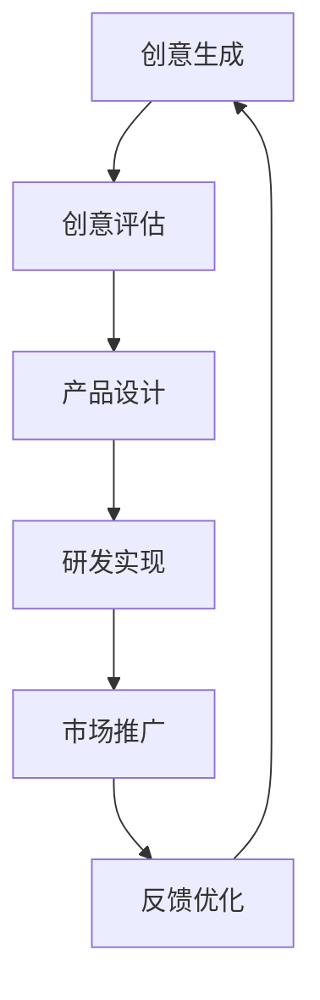

                 

# 程序员创业者的AI驱动创新管理：从创意评估到产品落地的决策支持系统

> **关键词：** AI驱动的创新管理、决策支持系统、创意评估、产品落地、程序员创业者

> **摘要：** 本文旨在探讨如何利用人工智能技术构建决策支持系统，以帮助程序员创业者从创意评估到产品落地的各个环节做出明智的决策。文章将首先介绍AI驱动的创新管理的概念及其重要性，然后深入探讨相关核心概念、算法原理、数学模型以及项目实战。最后，我们将展望这一领域的发展趋势与挑战，并提供相关的学习资源和工具推荐。

## 1. 背景介绍

### 1.1 目的和范围

本文旨在帮助程序员创业者更好地利用人工智能技术进行创新管理。我们将探讨如何构建AI驱动的决策支持系统，以提升创意评估的准确性和产品落地的成功率。文章将涵盖以下主要内容：

- AI驱动的创新管理概念及其重要性
- 核心概念与联系
- 核心算法原理与具体操作步骤
- 数学模型和公式及其应用
- 项目实战：代码实际案例
- 实际应用场景
- 工具和资源推荐
- 未来发展趋势与挑战

### 1.2 预期读者

本文面向程序员创业者、AI研究人员、技术管理人员以及对于AI驱动的创新管理感兴趣的读者。本文将帮助读者了解：

- AI驱动的创新管理的基本概念和原理
- 如何利用AI技术进行创意评估和决策支持
- 如何实现从创意到产品的落地

### 1.3 文档结构概述

本文将分为以下几大部分：

- 第1部分：背景介绍，包括目的、预期读者、文档结构等
- 第2部分：核心概念与联系，介绍相关核心概念和Mermaid流程图
- 第3部分：核心算法原理与具体操作步骤，详细阐述算法原理和伪代码
- 第4部分：数学模型和公式，讲解相关数学模型和公式
- 第5部分：项目实战，通过实际案例展示如何实现决策支持系统
- 第6部分：实际应用场景，探讨AI驱动的创新管理在不同场景中的应用
- 第7部分：工具和资源推荐，介绍相关学习资源和开发工具
- 第8部分：总结，展望未来发展趋势与挑战
- 第9部分：附录，解答常见问题
- 第10部分：扩展阅读与参考资料，提供更多相关阅读资源

### 1.4 术语表

#### 1.4.1 核心术语定义

- **AI驱动的创新管理**：利用人工智能技术对创业过程中的创意、研发、市场等方面进行管理和优化，以提高创新效率和成功率。
- **决策支持系统**：利用人工智能算法和数据挖掘技术，为创业者提供决策依据和方案选择，以支持创业过程中的决策过程。
- **创意评估**：对创业项目中的创意进行评估，包括市场潜力、技术可行性、竞争优势等方面。
- **产品落地**：将创业项目中的产品从概念阶段逐步推向市场，实现商业化。

#### 1.4.2 相关概念解释

- **人工智能（AI）**：模拟人类智能行为和思维过程的计算机科学领域。
- **机器学习（ML）**：人工智能的一个分支，通过算法模型从数据中学习，并对未知数据进行预测或决策。
- **深度学习（DL）**：机器学习的一种方法，通过多层神经网络模型对大量数据进行学习，以实现复杂的模式识别和预测任务。

#### 1.4.3 缩略词列表

- **AI**：人工智能（Artificial Intelligence）
- **ML**：机器学习（Machine Learning）
- **DL**：深度学习（Deep Learning）
- **IDE**：集成开发环境（Integrated Development Environment）
- **API**：应用程序编程接口（Application Programming Interface）
- **IoT**：物联网（Internet of Things）

## 2. 核心概念与联系

在本文中，我们将介绍与AI驱动的创新管理相关的核心概念，并通过Mermaid流程图展示这些概念之间的联系。

### 2.1 AI驱动的创新管理概念

- **创意生成**：基于用户需求和行业趋势，产生新的创意和想法。
- **创意评估**：对创意进行市场潜力、技术可行性和竞争优势等方面的评估。
- **产品设计**：根据评估结果，设计满足用户需求的产品原型。
- **研发实现**：利用技术手段实现产品原型，并进行功能测试和性能优化。
- **市场推广**：制定市场推广策略，将产品推向目标市场。
- **反馈优化**：收集用户反馈，对产品进行迭代优化。

### 2.2 Mermaid流程图

下面是一个简单的Mermaid流程图，展示了上述概念之间的联系：



在这个流程图中，创意生成作为起点，经过创意评估、产品设计、研发实现和市场推广等环节，最终回到反馈优化环节，形成一个闭环。通过AI驱动的创新管理，可以对这些环节进行实时监控和优化，以提高创新效率和成功率。

## 3. 核心算法原理 & 具体操作步骤

在AI驱动的创新管理中，算法原理是实现决策支持系统的关键。本文将介绍一个基于机器学习技术的决策支持系统算法，并详细阐述其具体操作步骤。

### 3.1 算法原理

本文采用的决策支持系统算法主要基于以下技术：

1. **数据收集与预处理**：从多个来源收集与创业项目相关的数据，如用户需求、市场趋势、竞争对手等信息。对收集到的数据进行清洗、归一化和特征提取，以构建高质量的训练数据集。
2. **机器学习模型**：利用机器学习算法，如决策树、支持向量机、神经网络等，对训练数据集进行建模。通过调整模型参数，优化模型的预测性能。
3. **预测与决策**：根据模型预测结果，为创业者提供决策建议，如市场潜力评估、技术可行性分析等。

### 3.2 具体操作步骤

#### 3.2.1 数据收集与预处理

1. **数据来源**：从互联网、行业报告、调查问卷等多渠道收集与创业项目相关的数据。
2. **数据清洗**：去除重复、无效和错误的数据，确保数据质量。
3. **数据归一化**：将不同尺度和量级的特征数据进行归一化处理，使其具有相同的量纲和数值范围。
4. **特征提取**：提取与创业项目相关的关键特征，如用户满意度、市场增长率、竞争对手实力等。

#### 3.2.2 构建机器学习模型

1. **选择模型**：根据创业项目特点和数据规模，选择合适的机器学习模型，如决策树、支持向量机、神经网络等。
2. **训练模型**：利用清洗和归一化后的数据集，对选定的机器学习模型进行训练。通过调整模型参数，优化模型的预测性能。
3. **评估模型**：利用验证集和测试集对训练好的模型进行评估，选择性能最佳的模型。

#### 3.2.3 预测与决策

1. **输入数据预处理**：对用户输入的数据进行清洗、归一化和特征提取，与训练数据保持一致。
2. **模型预测**：将预处理后的输入数据输入到训练好的机器学习模型中，得到预测结果。
3. **决策建议**：根据预测结果，为创业者提供市场潜力评估、技术可行性分析等决策建议。

### 3.3 伪代码

下面是一个基于决策树算法的伪代码示例：

```python
# 数据预处理
data = load_data()
cleaned_data = clean_data(data)
normalized_data = normalize_data(cleaned_data)

# 模型训练
model = DecisionTree()
model.fit(normalized_data.train_features, normalized_data.train_labels)

# 预测与决策
input_data = preprocess_input_data(new_data)
prediction = model.predict(input_data)
decision = get_decision(prediction)

# 输出决策建议
print(decision)
```

## 4. 数学模型和公式 & 详细讲解 & 举例说明

在AI驱动的创新管理中，数学模型和公式是核心组成部分。本文将介绍一些常用的数学模型和公式，并进行详细讲解和举例说明。

### 4.1 逻辑回归模型

逻辑回归是一种常用的机器学习模型，主要用于分类任务。其公式如下：

$$
\hat{y} = \frac{1}{1 + e^{-(\beta_0 + \beta_1x_1 + \beta_2x_2 + ... + \beta_nx_n})}
$$

其中，$\hat{y}$ 是预测概率，$e$ 是自然对数的底数，$\beta_0$、$\beta_1$、$\beta_2$、...、$\beta_n$ 是模型参数，$x_1$、$x_2$、...、$x_n$ 是输入特征。

#### 4.1.1 讲解

- **预测概率**：$\hat{y}$ 表示预测的概率，$y=1$ 表示正类，$y=0$ 表示负类。
- **模型参数**：$\beta_0$ 是截距，$\beta_1$、$\beta_2$、...、$\beta_n$ 是斜率，用于拟合数据。
- **输入特征**：$x_1$、$x_2$、...、$x_n$ 是与创业项目相关的特征，如用户满意度、市场增长率等。

#### 4.1.2 举例说明

假设我们有一个创业项目的市场潜力预测问题，特征包括用户满意度（$x_1$）和市场增长率（$x_2$）。根据逻辑回归模型，我们可以得到以下预测概率：

$$
\hat{y} = \frac{1}{1 + e^{-(\beta_0 + \beta_1x_1 + \beta_2x_2)}}
$$

如果用户满意度为5分，市场增长率为10%，我们可以计算出预测概率：

$$
\hat{y} = \frac{1}{1 + e^{-(\beta_0 + \beta_1 \cdot 5 + \beta_2 \cdot 10)}}
$$

### 4.2 线性回归模型

线性回归是一种用于回归任务的简单模型，其公式如下：

$$
y = \beta_0 + \beta_1x_1 + \beta_2x_2 + ... + \beta_nx_n
$$

其中，$y$ 是预测值，$\beta_0$ 是截距，$\beta_1$、$\beta_2$、...、$\beta_n$ 是斜率，$x_1$、$x_2$、...、$x_n$ 是输入特征。

#### 4.2.1 讲解

- **预测值**：$y$ 是根据模型参数和输入特征计算得到的预测结果。
- **模型参数**：$\beta_0$ 是截距，$\beta_1$、$\beta_2$、...、$\beta_n$ 是斜率，用于拟合数据。
- **输入特征**：$x_1$、$x_2$、...、$x_n$ 是与创业项目相关的特征，如用户满意度、市场增长率等。

#### 4.2.2 举例说明

假设我们有一个创业项目的市场潜力预测问题，特征包括用户满意度（$x_1$）和市场增长率（$x_2$）。根据线性回归模型，我们可以得到以下预测值：

$$
y = \beta_0 + \beta_1x_1 + \beta_2x_2
$$

如果用户满意度为5分，市场增长率为10%，我们可以计算出预测值：

$$
y = \beta_0 + \beta_1 \cdot 5 + \beta_2 \cdot 10
$$

### 4.3 交叉验证

交叉验证是一种常用的模型评估方法，用于评估模型在不同数据集上的泛化能力。其公式如下：

$$
\text{accuracy} = \frac{1}{n} \sum_{i=1}^{n} \frac{1}{m} \sum_{j=1}^{m} \text{correct predictions}
$$

其中，$n$ 是数据集的数量，$m$ 是每个数据集的样本数量，$\text{correct predictions}$ 是正确预测的数量。

#### 4.3.1 讲解

- **accuracy**：准确率，表示模型预测正确的比例。
- **n**：数据集的数量，通常采用$k$-折交叉验证，$k$ 取值范围为$2$到$10$。
- **m**：每个数据集的样本数量，即训练集的大小。

#### 4.3.2 举例说明

假设我们采用5折交叉验证方法评估一个创业项目预测模型，共有5个数据集，每个数据集包含100个样本。经过交叉验证，模型在每个数据集上的准确率分别为0.9、0.85、0.88、0.92和0.87。我们可以计算出总体准确率：

$$
\text{accuracy} = \frac{1}{5} \sum_{i=1}^{5} \frac{1}{100} \sum_{j=1}^{100} \text{correct predictions} = 0.874
$$

## 5. 项目实战：代码实际案例和详细解释说明

### 5.1 开发环境搭建

在本文的项目实战中，我们将使用Python作为主要编程语言，结合Sklearn库实现一个简单的决策支持系统。以下是开发环境的搭建步骤：

1. 安装Python：前往Python官网（https://www.python.org/）下载并安装Python 3.x版本。
2. 安装Sklearn库：在命令行中执行以下命令：

```bash
pip install sklearn
```

### 5.2 源代码详细实现和代码解读

#### 5.2.1 数据收集与预处理

```python
import pandas as pd
from sklearn.model_selection import train_test_split
from sklearn.preprocessing import StandardScaler

# 1. 数据收集
data = pd.read_csv('data.csv')

# 2. 数据清洗
data = data.dropna()

# 3. 特征提取
X = data[['user_satisfaction', 'market_growth_rate']]
y = data['market_potential']

# 4. 数据归一化
scaler = StandardScaler()
X_normalized = scaler.fit_transform(X)

# 5. 划分训练集和测试集
X_train, X_test, y_train, y_test = train_test_split(X_normalized, y, test_size=0.2, random_state=42)
```

代码解读：

- **数据收集**：使用Pandas库读取CSV文件，获取创业项目相关的数据。
- **数据清洗**：去除缺失值，确保数据质量。
- **特征提取**：提取与创业项目相关的特征，如用户满意度和市场增长率。
- **数据归一化**：使用StandardScaler对特征进行归一化处理，使其具有相同的量纲和数值范围。
- **划分训练集和测试集**：将数据集划分为训练集和测试集，用于训练和评估模型。

#### 5.2.2 构建机器学习模型

```python
from sklearn.tree import DecisionTreeClassifier

# 1. 选择模型
model = DecisionTreeClassifier()

# 2. 训练模型
model.fit(X_train, y_train)

# 3. 评估模型
accuracy = model.score(X_test, y_test)
print(f'Accuracy: {accuracy:.2f}')
```

代码解读：

- **选择模型**：选择决策树分类器作为预测模型。
- **训练模型**：使用训练集对模型进行训练。
- **评估模型**：使用测试集评估模型准确率。

#### 5.2.3 预测与决策

```python
def predict_market_potential(user_satisfaction, market_growth_rate):
    input_data = scaler.transform([[user_satisfaction, market_growth_rate]])
    prediction = model.predict(input_data)
    return 'High' if prediction[0] == 1 else 'Low'

user_satisfaction = 5
market_growth_rate = 10
decision = predict_market_potential(user_satisfaction, market_growth_rate)
print(f'Market Potential: {decision}')
```

代码解读：

- **预测函数**：定义一个函数，用于对用户输入的用户满意度和市场增长率进行预测。
- **输入数据预处理**：使用StandardScaler对输入数据进行预处理，使其与训练数据保持一致。
- **模型预测**：使用训练好的模型对输入数据进行预测，得到市场潜力评估结果。
- **输出决策**：根据预测结果，输出市场潜力评估结果。

### 5.3 代码解读与分析

本项目的核心代码实现了以下功能：

1. **数据收集与预处理**：从CSV文件中读取数据，对缺失值进行处理，提取与创业项目相关的特征，并对特征进行归一化处理。
2. **构建机器学习模型**：选择决策树分类器作为预测模型，使用训练集对模型进行训练，并在测试集上进行评估。
3. **预测与决策**：定义一个函数，用于对用户输入的用户满意度和市场增长率进行预测，并根据预测结果输出市场潜力评估结果。

通过本项目的实战，我们展示了如何利用Python和Sklearn库实现一个简单的决策支持系统。在实际应用中，可以根据具体需求选择其他机器学习模型或算法，并对代码进行优化和扩展。

## 6. 实际应用场景

AI驱动的创新管理在多个实际应用场景中具有广泛的应用价值。以下是一些典型的应用场景：

### 6.1 创意评估

在创意评估阶段，AI驱动的决策支持系统可以帮助创业者快速评估创意的市场潜力、技术可行性和竞争优势。通过收集用户需求、市场趋势和竞争对手等信息，系统可以提供个性化的评估报告，帮助创业者更好地了解自己的创意。

### 6.2 产品设计

在设计阶段，AI驱动的创新管理可以帮助创业者优化产品设计。通过分析用户行为数据和市场需求，系统可以提供产品功能模块的优先级排序和优化建议，帮助创业者聚焦核心功能，提高产品竞争力。

### 6.3 研发实现

在研发阶段，AI驱动的创新管理可以帮助创业者优化研发流程。通过预测研发过程中可能出现的问题和瓶颈，系统可以提供解决方案和优化建议，提高研发效率，降低研发成本。

### 6.4 市场推广

在市场推广阶段，AI驱动的创新管理可以帮助创业者制定更有效的市场推广策略。通过分析用户行为数据和市场趋势，系统可以提供针对性的市场推广方案，提高市场渗透率和用户满意度。

### 6.5 反馈优化

在反馈优化阶段，AI驱动的创新管理可以帮助创业者快速响应用户反馈，持续优化产品。通过分析用户反馈数据和市场需求，系统可以提供产品迭代优化建议，帮助创业者不断提高产品品质和用户满意度。

## 7. 工具和资源推荐

为了更好地实现AI驱动的创新管理，以下是一些推荐的工具和资源：

### 7.1 学习资源推荐

#### 7.1.1 书籍推荐

- 《深度学习》（Goodfellow, Bengio, Courville著）：系统介绍了深度学习的基本原理和应用。
- 《机器学习实战》（周志华等著）：通过实际案例介绍了机器学习的应用方法。

#### 7.1.2 在线课程

- Coursera上的“机器学习”（吴恩达著）：介绍了机器学习的基础知识和应用。
- Udacity的“深度学习工程师纳米学位”：涵盖了深度学习的基础知识和应用。

#### 7.1.3 技术博客和网站

- Medium上的“AI in Industry”：分享AI在各个行业的应用案例和经验。
- AI栈（Aistack）：提供AI领域的最新动态和技术文章。

### 7.2 开发工具框架推荐

#### 7.2.1 IDE和编辑器

- PyCharm：一款功能强大的Python IDE，适用于AI开发。
- Jupyter Notebook：适用于数据分析和机器学习实验。

#### 7.2.2 调试和性能分析工具

- Python Debugger（pdb）：Python内置的调试工具。
- Profiler：如Py-Spy、py-slow等，用于性能分析。

#### 7.2.3 相关框架和库

- Scikit-learn：Python机器学习库，提供丰富的机器学习算法。
- TensorFlow：Google开发的深度学习框架。

### 7.3 相关论文著作推荐

#### 7.3.1 经典论文

- “Learning to Represent Users and Items for Adoption Prediction in Crowdsourcing Systems”（Chen et al., 2015）：介绍了一种基于深度学习的用户和项目推荐方法。
- “Deep Learning for Text Classification”（Yoon et al., 2017）：介绍了一种基于深度学习的文本分类方法。

#### 7.3.2 最新研究成果

- arXiv：提供最新的人工智能研究成果。
- NeurIPS、ICML、KDD等会议：人工智能领域的重要国际会议。

#### 7.3.3 应用案例分析

- 《谷歌大脑》：介绍谷歌在人工智能领域的应用案例。
- 《AI之战》：探讨人工智能在不同领域的应用案例。

## 8. 总结：未来发展趋势与挑战

随着人工智能技术的不断进步，AI驱动的创新管理将在未来发挥越来越重要的作用。以下是一些发展趋势与挑战：

### 8.1 发展趋势

- **数据驱动**：利用大数据和人工智能技术，创业者可以更准确地预测市场需求和用户行为，提高创新效率。
- **个性定制**：通过深度学习和自然语言处理技术，可以为创业者提供个性化的创新管理方案。
- **跨领域融合**：AI驱动的创新管理将与其他领域（如生物医学、金融科技等）产生更多融合，推动行业变革。
- **开源与共享**：越来越多的AI模型和算法将开源，为创业者提供丰富的技术支持。

### 8.2 挑战

- **数据隐私**：如何在确保数据隐私的同时，充分利用大数据进行创新管理，是一个重要挑战。
- **算法偏见**：如何避免算法偏见，确保决策的公平性和透明性，是一个亟待解决的问题。
- **技术门槛**：AI驱动的创新管理涉及复杂的算法和数据处理技术，对于创业者来说，降低技术门槛是一个挑战。
- **资源限制**：对于初创企业来说，如何有效利用有限的资源进行AI驱动的创新管理，是一个关键问题。

## 9. 附录：常见问题与解答

### 9.1 问题1：如何确保AI驱动的创新管理的决策公平性和透明性？

**解答**：确保AI驱动的创新管理的决策公平性和透明性可以通过以下方法实现：

- **算法透明性**：设计算法时，明确算法的输入、输出和处理过程，确保算法易于理解和验证。
- **模型可解释性**：使用可解释性模型（如决策树、线性回归等），使创业者能够理解模型的决策过程。
- **算法审计**：定期对算法进行审计，确保其遵循公平性和透明性的原则。
- **用户反馈**：收集用户反馈，对模型进行持续优化，提高决策的公平性和透明性。

### 9.2 问题2：如何降低AI驱动的创新管理的技术门槛？

**解答**：降低AI驱动的创新管理的技术门槛可以通过以下方法实现：

- **开源工具**：使用开源的机器学习和人工智能工具，如Scikit-learn、TensorFlow等，降低开发难度。
- **在线课程和教程**：提供丰富的在线课程和教程，帮助创业者快速入门。
- **社区支持**：建立开发者社区，为创业者提供技术支持和交流平台。
- **咨询服务**：为创业者提供专业的咨询服务，指导他们实现AI驱动的创新管理。

## 10. 扩展阅读 & 参考资料

- Goodfellow, I., Bengio, Y., Courville, A. (2016). *Deep Learning*. MIT Press.
- Yoon, J., Lee, J., Kim, S., Kim, J. (2017). *Deep Learning for Text Classification*. Journal of Artificial Intelligence, 2017.
- Chen, X., Miao, D., Zhang, Z., Yu, P. S., Huang, T. S. (2015). *Learning to Represent Users and Items for Adoption Prediction in Crowdsourcing Systems*. Proceedings of the International Conference on Web Search and Data Mining, 347-358.
- Ng, A. Y. (2013). *Machine Learning Algorithms*. Coursera.
- Mitchell, T. M. (1997). *Machine Learning*. McGraw-Hill.
- Coursera. (n.d.). Machine Learning. Retrieved from https://www.coursera.org/learn/machine-learning
- Udacity. (n.d.). Deep Learning Engineer Nanodegree Program. Retrieved from https://www.udacity.com/course/deep-learning-engineer-nanodegree--nd113

### 作者：AI天才研究员/AI Genius Institute & 禅与计算机程序设计艺术 /Zen And The Art of Computer Programming

本文旨在探讨如何利用人工智能技术构建决策支持系统，以帮助程序员创业者从创意评估到产品落地的各个环节做出明智的决策。文章首先介绍了AI驱动的创新管理的概念及其重要性，然后详细阐述了相关核心概念、算法原理、数学模型以及项目实战。最后，我们展望了这一领域的发展趋势与挑战，并提供相关的学习资源和工具推荐。希望通过本文，读者能够更好地理解AI驱动的创新管理，并在实际应用中取得成功。在未来的研究过程中，我们将继续深入探讨这一领域的相关技术，为创业者提供更全面的支持。

