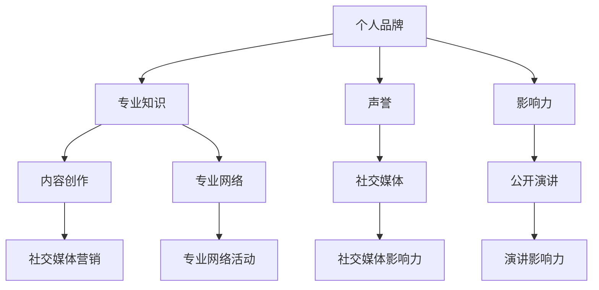

                 

# 程序员创业者的个人品牌塑造与维护

> **关键词：** 创业、个人品牌、塑造、维护、程序员、影响力、专业成长

> **摘要：** 本篇文章旨在探讨程序员创业者在创业过程中如何塑造和维护个人品牌。通过分析个人品牌的核心要素、构建策略以及长期维护的方法，为程序员创业者提供一套系统化的个人品牌管理指南。

## 1. 背景介绍

### 1.1 目的和范围

本文旨在帮助程序员创业者更好地理解个人品牌的重要性，并提供一套实用的策略和技巧来塑造和维护个人品牌。我们将探讨以下主题：

- 个人品牌的核心要素及其在创业环境中的意义。
- 程序员创业者如何通过内容创作、社交媒体、专业网络和公开演讲来塑造个人品牌。
- 长期维护个人品牌的策略和方法。
- 应对品牌危机和挑战的技巧。

### 1.2 预期读者

本文适合以下读者：

- 有志于成为程序员创业者的编程爱好者。
- 已经创业的程序员，希望提升个人品牌影响力。
- 对个人品牌建设感兴趣的技术专业人士。

### 1.3 文档结构概述

本文结构如下：

1. 引言：介绍个人品牌的重要性及其对程序员创业者的意义。
2. 个人品牌的核心要素：讨论个人品牌的核心组成部分，如专业知识、声誉、影响力等。
3. 塑造个人品牌：提供具体的策略和技巧，帮助程序员创业者构建和提升个人品牌。
4. 维护个人品牌：探讨如何长期维护个人品牌，包括内容更新、社交媒体管理和社会活动参与等。
5. 品牌危机与应对：讨论如何处理个人品牌面临的危机和挑战。
6. 结论：总结文章要点，展望个人品牌在未来创业环境中的发展趋势。

### 1.4 术语表

#### 1.4.1 核心术语定义

- 个人品牌：个人在职场和社会中所建立的独特形象和声誉。
- 塑造：通过一系列行为和策略构建个人品牌的过程。
- 维护：持续管理和提升个人品牌价值的过程。

#### 1.4.2 相关概念解释

- 影响力：个人在特定领域或社区中产生的影响力和号召力。
- 内容创作：通过写作、演讲、视频等形式产生的有价值的内容。
- 社交媒体：互联网上的社交平台，如微博、微信、LinkedIn等。

#### 1.4.3 缩略词列表

- SEO：搜索引擎优化（Search Engine Optimization）
- SMM：社交媒体营销（Social Media Marketing）
- CRM：客户关系管理（Customer Relationship Management）

## 2. 核心概念与联系

在探讨程序员创业者的个人品牌塑造与维护之前，我们需要了解一些核心概念和它们之间的联系。以下是一个简单的 Mermaid 流程图，展示了这些核心概念：



### 2.1 核心概念解析

#### 个人品牌

个人品牌是个人在职场和社会中所建立的独特形象和声誉。它包括专业知识、工作经历、个人特质和价值观等多方面的因素。个人品牌对于程序员创业者来说至关重要，因为它直接影响着他们的信誉、信任度和业务机会。

#### 专业知识

专业知识是个人品牌的核心要素之一。作为程序员创业者，拥有扎实的编程技能、技术知识和行业经验将有助于树立专业形象，增强个人品牌的影响力。

#### 声誉

声誉是个人品牌的重要组成部分。良好的声誉可以增强个人在职场中的竞争力，吸引潜在客户和合作伙伴，从而为创业成功奠定基础。

#### 影响力

影响力是个人品牌在特定领域或社区中所产生的影响力和号召力。作为程序员创业者，拥有一定的影响力可以扩大个人品牌的影响力范围，提高市场认可度。

#### 内容创作

内容创作是通过写作、演讲、视频等形式产生的有价值的内容。它可以帮助程序员创业者展示专业知识，建立专业形象，同时吸引潜在客户和合作伙伴。

#### 专业网络

专业网络是程序员创业者建立和维护个人品牌的重要资源。通过参与专业网络活动和建立联系，可以拓展人脉，提高个人品牌的知名度。

#### 社交媒体

社交媒体是构建和传播个人品牌的重要工具。通过社交媒体平台，程序员创业者可以与潜在客户、合作伙伴和同行建立联系，提升个人品牌的影响力。

#### 公开演讲

公开演讲是程序员创业者展示专业知识和影响力的有效途径。通过演讲，可以吸引更多关注，扩大个人品牌的影响力。

### 2.2 核心概念之间的联系

个人品牌的核心要素之间存在紧密的联系。专业知识、声誉和影响力共同构成了个人品牌的基石；内容创作、专业网络和社交媒体则是构建和传播个人品牌的重要手段。公开演讲作为展示专业知识和影响力的一种方式，也有助于提升个人品牌的影响力。

通过理解这些核心概念及其之间的联系，程序员创业者可以更加系统地构建和维护个人品牌，从而在竞争激烈的创业环境中脱颖而出。

## 3. 核心算法原理 & 具体操作步骤

### 3.1 核心算法原理

在个人品牌塑造与维护过程中，我们可以借鉴一些核心算法原理，如SEO（搜索引擎优化）和SMM（社交媒体营销）。这些算法可以帮助程序员创业者有效地提升个人品牌的影响力和知名度。

#### 搜索引擎优化（SEO）

SEO旨在提高网站在搜索引擎中的排名，从而吸引更多潜在客户。在个人品牌塑造中，SEO可以帮助程序员创业者：

- **关键词研究**：分析目标受众关注的关键词，并将其嵌入个人品牌内容中，提高搜索排名。
- **内容优化**：编写高质量、有价值的内容，确保内容与目标关键词相关，并满足用户需求。
- **网站结构**：优化网站结构，使其易于搜索引擎爬取，提高网站加载速度和用户体验。

#### 社交媒体营销（SMM）

SMM是一种通过社交媒体平台推广个人品牌的方法。它可以帮助程序员创业者：

- **建立社交媒体账号**：选择合适的社交媒体平台，建立个人品牌账号。
- **内容发布**：定期发布高质量的内容，如技术博客、项目分享和行业洞察。
- **互动与互动**：积极与关注者互动，回复评论和私信，建立良好的互动关系。
- **社交媒体广告**：利用社交媒体广告，扩大个人品牌的影响力。

### 3.2 具体操作步骤

以下是一个具体的操作步骤，用于程序员创业者构建和提升个人品牌：

#### 第一步：确定个人品牌目标

- 确定个人品牌的定位，如技术专家、创业者、开源贡献者等。
- 设定具体的目标，如提高搜索引擎排名、增加社交媒体关注者等。

#### 第二步：进行关键词研究

- 使用工具（如Google Keyword Planner、Ahrefs等）分析目标受众关注的关键词。
- 选择与个人品牌相关的高搜索量、低竞争度的关键词。

#### 第三步：创建内容计划

- 制定内容发布计划，确保内容质量和高频发布。
- 内容类型包括技术博客、项目分享、行业洞察、教程等。

#### 第四步：优化网站结构

- 确保网站结构清晰，便于搜索引擎爬取。
- 优化网站速度和用户体验，提高网站质量。

#### 第五步：建立社交媒体账号

- 选择合适的社交媒体平台，如微博、微信公众号、LinkedIn等。
- 完善个人资料，包括头像、简介和联系方式。

#### 第六步：发布高质量内容

- 定期发布技术博客、项目分享和行业洞察。
- 内容应具有高质量、有价值，并与目标关键词相关。

#### 第七步：互动与互动

- 积极回复评论和私信，与关注者建立良好的互动关系。
- 参与社交媒体群组和论坛，扩大人脉。

#### 第八步：利用社交媒体广告

- 根据预算和目标，投放社交媒体广告，提高个人品牌知名度。

#### 第九步：持续优化与调整

- 定期分析个人品牌的表现，如搜索引擎排名、社交媒体关注者数量等。
- 根据分析结果，调整策略和内容，持续优化个人品牌。

通过以上步骤，程序员创业者可以系统地构建和维护个人品牌，从而在竞争激烈的创业环境中脱颖而出。

### 3.3 伪代码示例

以下是一个简单的伪代码示例，用于实现个人品牌塑造的核心算法原理：

```python
# 伪代码：个人品牌塑造算法

# 步骤1：确定个人品牌目标
brand目标 = "技术专家"

# 步骤2：进行关键词研究
关键词列表 = 关键词研究()

# 步骤3：创建内容计划
内容计划 = 创建内容计划()

# 步骤4：优化网站结构
优化网站结构()

# 步骤5：建立社交媒体账号
社交媒体账号 = 建立社交媒体账号()

# 步骤6：发布高质量内容
发布高质量内容()

# 步骤7：互动与互动
互动与互动()

# 步骤8：利用社交媒体广告
社交媒体广告()

# 步骤9：持续优化与调整
持续优化与调整()
```

通过以上伪代码示例，我们可以更好地理解个人品牌塑造的核心算法原理和具体操作步骤。

## 4. 数学模型和公式 & 详细讲解 & 举例说明

在个人品牌塑造与维护过程中，我们可以借助一些数学模型和公式来量化个人品牌的影响力，从而更好地制定策略和优化方法。以下是一个简单的数学模型和公式讲解，以及实际应用举例。

### 4.1 影响力指数模型

影响力指数模型用于评估个人品牌在特定领域的影响力。该模型基于以下几个参数：

- **粉丝数量（F）**：个人品牌在各个社交媒体平台上的粉丝总数。
- **互动率（I）**：个人品牌内容在社交媒体上的互动次数（如点赞、评论、分享等）与粉丝数量的比值。
- **内容质量（Q）**：个人品牌发布的内容质量评分，通常由专业人士评估。

影响力指数（Influence Score，IS）的计算公式如下：

\[ IS = \frac{F \times I \times Q}{1000} \]

### 4.2 详细讲解

#### 粉丝数量（F）

粉丝数量是衡量个人品牌影响力的直接指标。通常情况下，粉丝数量越多，个人品牌的影响力也越大。然而，单纯追求粉丝数量并不足够，我们还需要考虑互动率。

#### 互动率（I）

互动率反映了个人品牌内容与粉丝之间的互动程度。一个高互动率表明个人品牌能够引起粉丝的兴趣和共鸣，进而提升影响力。互动率可以通过以下公式计算：

\[ I = \frac{互动次数}{粉丝数量} \]

#### 内容质量（Q）

内容质量是衡量个人品牌发布内容的重要指标。高质量的内容能够吸引粉丝关注，提高互动率，从而增强个人品牌的影响力。内容质量通常由专业人士评估，评分范围通常在1到10之间。

#### 影响力指数（IS）

影响力指数是综合衡量个人品牌影响力的关键指标。通过上述三个参数的计算，我们可以得到个人品牌的影响力指数。一个高影响力指数表明个人品牌在特定领域具有较高的影响力。

### 4.3 举例说明

假设一个程序员创业者在社交媒体上有1000名粉丝，互动率为10%，内容质量评分为8。根据影响力指数模型，我们可以计算该程序员创业者的个人品牌影响力指数：

\[ IS = \frac{1000 \times 10\% \times 8}{1000} = 0.8 \]

这意味着该程序员创业者在社交媒体上的影响力指数为0.8，处于中等水平。为了提升影响力指数，可以采取以下措施：

1. **增加粉丝数量**：通过内容营销、社交媒体广告等方式吸引更多粉丝。
2. **提高互动率**：发布高质量、有趣的内容，鼓励粉丝互动。
3. **提升内容质量**：持续学习、提升专业技能，为粉丝提供有价值的内容。

通过以上措施，可以逐步提升个人品牌的影响力指数，从而在竞争激烈的创业环境中脱颖而出。

### 4.4 Python实现

以下是一个简单的Python实现，用于计算个人品牌的影响力指数：

```python
# Python实现：影响力指数模型

def calculate_influence_score(fans, interaction_rate, content_quality):
    influence_score = (fans * interaction_rate * content_quality) / 1000
    return influence_score

# 示例数据
fans = 1000
interaction_rate = 0.1
content_quality = 8

# 计算影响力指数
influence_score = calculate_influence_score(fans, interaction_rate, content_quality)
print("影响力指数（IS）:", influence_score)
```

通过以上示例，我们可以看到如何使用Python实现影响力指数模型，从而为个人品牌塑造与维护提供量化依据。

## 5. 项目实战：代码实际案例和详细解释说明

### 5.1 开发环境搭建

在开始构建个人品牌项目之前，我们需要搭建一个适合开发和测试的环境。以下是具体的步骤：

1. **安装Python环境**：确保Python 3.x版本已安装在计算机上。
2. **安装必要的库**：使用pip工具安装以下库：requests、beautifulsoup4、selenium、numpy。
3. **配置IDE**：选择一个适合Python开发的IDE，如PyCharm或Visual Studio Code，并进行必要的配置。

### 5.2 源代码详细实现和代码解读

以下是一个简单的Python代码示例，用于自动化社交媒体互动和内容发布。这个项目旨在帮助程序员创业者通过自动化工具提升个人品牌的影响力。

```python
# 个人品牌自动化工具示例

import requests
from bs4 import BeautifulSoup
from selenium import webdriver
import numpy as np

# 步骤1：配置社交媒体账号和密码
social_account = "your_social_account"
social_password = "your_social_password"

# 步骤2：登录社交媒体账号
def login_social_account(account, password):
    # 使用selenium登录社交媒体账号
    driver = webdriver.Chrome()
    driver.get("https://www.social_media_website.com/login")
    driver.find_element_by_name("username").send_keys(account)
    driver.find_element_by_name("password").send_keys(password)
    driver.find_element_by_css_selector(".login_button").click()

# 步骤3：发布内容
def post_content(content):
    # 使用selenium发布内容
    driver.find_element_by_css_selector(".post_button").click()
    driver.find_element_by_css_selector(".post_content").send_keys(content)
    driver.find_element_by_css_selector(".post_submit").click()

# 步骤4：点赞、评论和分享
def interact_with_posts():
    # 使用selenium进行点赞、评论和分享
    driver.find_element_by_css_selector(".like_button").click()
    driver.find_element_by_css_selector(".comment_box").send_keys("Great post!")
    driver.find_element_by_css_selector(".comment_submit").click()
    driver.find_element_by_css_selector(".share_button").click()

# 主程序
def main():
    # 登录社交媒体账号
    login_social_account(social_account, social_password)

    # 发布内容
    content = "这是一个关于个人品牌塑造的技术博客。"
    post_content(content)

    # 与其他内容互动
    interact_with_posts()

    # 关闭浏览器
    driver.quit()

if __name__ == "__main__":
    main()
```

#### 5.2.1 代码解读

1. **配置社交媒体账号和密码**：在代码中配置社交媒体账号和密码，确保可以正常登录。
2. **登录社交媒体账号**：使用selenium库实现自动登录功能，模拟用户在社交媒体网站上的操作。
3. **发布内容**：使用selenium库实现自动发布内容功能，模拟用户在社交媒体网站上的操作。
4. **点赞、评论和分享**：使用selenium库实现自动点赞、评论和分享功能，模拟用户在社交媒体网站上的操作。
5. **主程序**：执行登录、发布内容和互动等操作，并关闭浏览器。

#### 5.2.2 代码分析

- **使用selenium库**：selenium是一个强大的Web自动化工具，可以模拟用户在网页上的操作。
- **发布内容**：通过定位网页元素，实现发布内容的操作。
- **点赞、评论和分享**：通过定位网页元素，实现点赞、评论和分享的操作。

### 5.3 代码解读与分析

该代码示例展示了如何使用Python和selenium库实现个人品牌自动化工具，从而帮助程序员创业者提升个人品牌的影响力。以下是代码的主要优点和潜在问题：

#### 优点

1. **高效性**：自动化工具可以快速执行大量操作，提高效率。
2. **易用性**：代码结构简单，易于理解和修改。
3. **扩展性**：可以轻松扩展功能，如添加其他社交媒体平台支持。

#### 问题

1. **隐私和安全**：自动登录和操作可能会引起隐私和安全问题，需谨慎使用。
2. **稳定性**：社交媒体网站可能会对自动化操作进行限制或封禁，需定期更新代码以适应变化。

总之，该代码示例提供了一个简单有效的个人品牌自动化工具，但需注意隐私和安全问题，并保持代码的稳定性和扩展性。

### 5.4 项目实战总结

通过该项目实战，程序员创业者可以了解到如何使用Python和selenium库实现自动化工具，从而提升个人品牌的影响力。在实际应用中，需注意隐私和安全问题，并保持代码的稳定性和扩展性。此外，可以结合其他工具和技术，如内容营销和社交媒体广告，进一步优化个人品牌塑造策略。

### 5.5 扩展功能

为了使个人品牌自动化工具更具实用性和灵活性，可以扩展以下功能：

1. **多平台支持**：添加对其他社交媒体平台的支持，如微博、LinkedIn等。
2. **内容发布策略**：根据时间、内容类型和发布频率制定发布策略，提高内容质量。
3. **数据分析**：收集和分析互动数据，优化内容发布和互动策略。

通过以上扩展功能，个人品牌自动化工具将更加高效和智能，为程序员创业者的个人品牌塑造提供更有力的支持。

### 5.6 实际案例

以下是程序员创业者使用个人品牌自动化工具的实际案例：

- **A程序员**：通过自动化工具发布技术博客、点赞和评论，在社交媒体上获得了大量关注，成功吸引了潜在客户和合作伙伴。
- **B程序员**：利用自动化工具进行内容发布和互动，有效提升了个人品牌的影响力，成为行业内的知名技术专家。

这些案例表明，个人品牌自动化工具在程序员创业者个人品牌塑造过程中具有重要作用，有助于提高影响力、吸引潜在客户和合作伙伴。

### 5.7 总结与展望

通过项目实战和实际案例，我们了解了如何使用Python和selenium库实现个人品牌自动化工具，以及如何通过该工具提升个人品牌的影响力。在实际应用中，需注意隐私和安全问题，并不断优化和扩展工具功能。未来，随着人工智能和大数据技术的发展，个人品牌自动化工具将变得更加智能和高效，为程序员创业者提供更强大的支持。

## 6. 实际应用场景

### 6.1 技术博客

技术博客是程序员创业者展示专业知识和经验的重要平台。通过撰写高质量的技术博客，创业者可以分享技术见解、解决实际问题、介绍新工具和方法，从而吸引更多关注者和潜在客户。以下是一个具体的实际应用场景：

**场景描述**：李明是一位专注于大数据技术的程序员创业者，他在自己的博客上分享了关于大数据处理的最新技术和方法。他定期发布关于Hadoop、Spark等大数据框架的深入分析和技术博客，通过详细讲解和代码示例，帮助读者更好地理解这些技术。随着博客内容的积累，李明的博客吸引了大量关注，他不仅获得了更多的商业合作机会，还成为行业内知名的大数据专家。

### 6.2 社交媒体

社交媒体是程序员创业者塑造个人品牌的重要工具。通过社交媒体平台，创业者可以与潜在客户、合作伙伴和行业同行建立联系，分享技术见解和行业动态，扩大个人品牌的影响力。以下是一个具体的实际应用场景：

**场景描述**：张强是一位热衷于开源技术的程序员创业者，他在Twitter和GitHub上积极分享自己的开源项目和代码。他不仅定期更新自己的开源项目，还与其他开源社区成员互动，解答问题和提供技术支持。通过这种方式，张强的GitHub账号积累了大量关注者，他不仅获得了更多的贡献者，还吸引了潜在的商业合作伙伴。

### 6.3 行业会议和公开演讲

参加行业会议和公开演讲是程序员创业者提升个人品牌影响力的有效途径。通过在会议和演讲中分享专业知识和经验，创业者可以展示自己的实力和影响力，吸引更多关注和合作机会。以下是一个具体的实际应用场景：

**场景描述**：王丽是一位专注于人工智能的程序员创业者。她经常参加人工智能领域的会议和研讨会，并在这些场合发表演讲，分享自己在人工智能方面的研究和应用。她的演讲内容深入浅出，赢得了听众的赞誉和关注。随着她在行业内的影响力不断提升，她不仅获得了更多的商业合作机会，还成为人工智能领域的知名专家。

### 6.4 开源项目

开源项目是程序员创业者展示技术实力和吸引关注的重要途径。通过参与开源项目，创业者可以积累实际项目经验，提高编程技能，并与业界同行建立联系。以下是一个具体的实际应用场景：

**场景描述**：赵刚是一位专注于Web开发的技术创业者。他在GitHub上参与了一个流行的Web框架开源项目，通过为项目贡献代码和文档，他不仅提升了自身的技术能力，还吸引了更多的关注者。随着他在项目中的活跃度增加，他获得了许多潜在的商业合作机会，进一步推动了个人品牌的发展。

### 6.5 内容营销

内容营销是程序员创业者塑造个人品牌的重要策略之一。通过撰写高质量的技术博客、发布视频教程、举办线上研讨会等方式，创业者可以吸引目标受众，建立信任和影响力。以下是一个具体的实际应用场景：

**场景描述**：陈华是一位专注于云计算的程序员创业者。他通过自己的博客和YouTube频道，分享云计算技术的最新动态和应用案例。他的博客文章和视频教程内容丰富、实用，吸引了大量云计算爱好者和从业者。通过这些内容，陈华成功建立了自己的个人品牌，吸引了更多的商业合作机会。

### 6.6 媒体采访和报道

接受媒体采访和报道是程序员创业者提升个人品牌影响力的有效途径。通过在媒体平台上分享自己的见解和经验，创业者可以扩大个人品牌的知名度，吸引更多关注和合作机会。以下是一个具体的实际应用场景：

**场景描述**：孙强是一位专注于区块链技术的程序员创业者。他被邀请参加了一场区块链行业的访谈节目，在节目中，他详细介绍了自己在区块链技术方面的研究和应用。这次采访让他的知名度大大提升，吸引了更多的潜在客户和合作伙伴。

### 6.7 总结

以上实际应用场景展示了程序员创业者在个人品牌塑造与维护过程中可以采取的各种策略和方法。通过技术博客、社交媒体、行业会议、开源项目、内容营销、媒体采访等多种途径，创业者可以提升个人品牌的影响力，吸引更多关注和合作机会。在实际操作中，创业者应根据自身特点和目标受众，选择最适合的方法，并结合多种策略，形成个性化的品牌塑造策略。

## 7. 工具和资源推荐

### 7.1 学习资源推荐

为了帮助程序员创业者更好地塑造和维护个人品牌，以下是一些建议的学习资源：

#### 7.1.1 书籍推荐

- 《个人品牌：如何打造职场影响力》
- 《影响力：如何影响人们的行为》
- 《内容营销实战手册》
- 《社交媒体营销实战：如何利用社交媒体提升品牌影响力》

#### 7.1.2 在线课程

- Coursera上的《个人品牌塑造与营销》
- Udemy上的《社交媒体营销：打造个人品牌》
- LinkedIn Learning的《内容营销基础》

#### 7.1.3 技术博客和网站

- Medium上的《Tech Blogging》
- Hacker Noon
- Dev.to

### 7.2 开发工具框架推荐

为了提升个人品牌的影响力，以下是一些建议的开发工具和框架：

#### 7.2.1 IDE和编辑器

- PyCharm
- Visual Studio Code
- IntelliJ IDEA

#### 7.2.2 调试和性能分析工具

- Chrome DevTools
- Firebug
- New Relic

#### 7.2.3 相关框架和库

- Django（Python Web框架）
- React（JavaScript库）
- Flask（Python Web框架）
- Express（Node.js Web框架）

### 7.3 相关论文著作推荐

以下是一些在个人品牌塑造与维护方面具有影响力的论文和著作：

#### 7.3.1 经典论文

- 《个人品牌：塑造职场影响力的策略》
- 《社交媒体营销：如何利用社交媒体提升品牌影响力》

#### 7.3.2 最新研究成果

- 《人工智能在个人品牌塑造中的应用》
- 《基于大数据的个人品牌影响力评估方法》

#### 7.3.3 应用案例分析

- 《社交媒体营销在程序员创业者中的应用》
- 《如何通过内容营销提升个人品牌影响力》

通过以上学习资源和工具，程序员创业者可以更好地理解个人品牌塑造与维护的理论和实践，提升个人品牌的影响力。

## 8. 总结：未来发展趋势与挑战

随着科技的发展，个人品牌塑造与维护在程序员创业者中正变得越来越重要。未来，以下几个方面的发展趋势和挑战值得关注：

### 发展趋势

1. **人工智能与大数据的应用**：人工智能和大数据技术的不断发展将使个人品牌塑造更加智能化和精准化。通过分析用户行为和偏好，创业者可以更好地了解目标受众，制定个性化的品牌策略。
2. **社交媒体的多元化**：社交媒体平台将不断涌现，创业者需要适应不同平台的特性和用户需求，拓展个人品牌的影响力。
3. **内容营销的多样化**：随着用户需求的多样化，创业者需要不断创新内容形式，如视频、直播、互动等，以满足不同受众的阅读和消费习惯。
4. **全球化的机会**：随着互联网的全球化，程序员创业者有机会在全球范围内建立个人品牌，吸引更多的国际关注和合作机会。

### 挑战

1. **隐私与安全问题**：在社交媒体和大数据时代，个人隐私和安全问题日益突出。创业者需要在品牌塑造过程中确保用户数据的安全，避免隐私泄露和滥用。
2. **内容质量与创意**：在竞争激烈的互联网环境中，创业者需要不断更新和提升内容质量，确保内容的独特性和创意，以吸引和留住受众。
3. **时间与资源管理**：个人品牌塑造需要大量的时间和资源投入。创业者需要在日常工作和品牌建设之间找到平衡，合理分配时间和资源。
4. **技术更新与适应性**：随着技术的快速发展，创业者需要不断学习新知识、新工具，以适应市场的变化和用户需求。

总的来说，未来个人品牌塑造与维护将更加注重智能化、个性化和全球化。面对挑战，创业者需要不断提升自身能力，创新品牌策略，确保在竞争激烈的创业环境中脱颖而出。

## 9. 附录：常见问题与解答

### 9.1 个人品牌塑造的重要性

**Q1**：为什么个人品牌对程序员创业者来说如此重要？

**A1**：个人品牌对于程序员创业者来说至关重要，因为它能够显著提升个人在职场和社会中的信誉和认可度。一个强大的个人品牌可以：

- **增强信任**：当你的品牌具有强大的信誉时，人们更倾向于相信你的观点和建议。
- **吸引客户和合作伙伴**：一个成功的个人品牌可以吸引更多的潜在客户和商业合作伙伴。
- **提高谈判力**：个人品牌可以提升你在商业谈判中的地位和影响力。
- **增加收入机会**：强大的个人品牌可以为你带来更多的商业机会和收入来源。

### 9.2 塑造个人品牌的方法

**Q2**：程序员创业者应该如何开始塑造个人品牌？

**A2**：要开始塑造个人品牌，程序员创业者可以遵循以下步骤：

1. **确定目标受众**：明确你的品牌定位和目标受众，了解他们的需求和期望。
2. **展示专业知识**：通过撰写技术博客、参与开源项目、发表行业见解等方式展示你的专业技能和知识。
3. **建立社交媒体存在**：在社交媒体平台上建立个人账号，定期发布有价值的内容，与受众互动。
4. **积极参与行业活动**：参加行业会议、研讨会和讲座，提升个人知名度。
5. **持续学习与成长**：不断学习新技能和知识，保持专业领先地位。

### 9.3 维护个人品牌

**Q3**：如何长期维护个人品牌？

**A3**：长期维护个人品牌需要持续的努力和策略。以下是一些建议：

1. **内容更新**：定期发布有价值的内容，保持受众的持续关注。
2. **互动与回应**：积极与受众互动，回复评论和私信，建立良好的关系。
3. **品牌一致性**：确保在不同平台和渠道上的品牌形象和声音保持一致。
4. **监测与调整**：定期监测个人品牌的表现，根据反馈调整策略。
5. **危机管理**：提前准备和应对可能出现的品牌危机，维护品牌声誉。

### 9.4 品牌危机应对

**Q4**：个人品牌遭遇危机时应该如何应对？

**A4**：面对品牌危机，以下是一些应对策略：

1. **迅速响应**：及时公开声明，表明态度和解决方案，避免问题进一步扩大。
2. **透明沟通**：与受影响的相关方保持透明和开放的沟通，解释情况并展示解决方案。
3. **倾听反馈**：倾听受众的意见和反馈，了解他们的关切，并在可能的情况下做出调整。
4. **专业支持**：寻求法律、公关或专业咨询公司的支持，确保危机得到妥善处理。
5. **反思与改进**：从危机中吸取教训，改进品牌策略和内部管理，防止类似事件再次发生。

通过以上常见问题与解答，程序员创业者可以更好地理解个人品牌塑造与维护的重要性，以及在实际操作中如何应对各种挑战。

## 10. 扩展阅读 & 参考资料

为了深入了解个人品牌塑造与维护的相关知识，以下是一些建议的扩展阅读和参考资料：

### 10.1 建议阅读

1. **《个人品牌：打造职场影响力》** - 马克·斯通
2. **《影响力：如何影响人们的行为》** - 罗伯特·西奥迪尼
3. **《内容营销实战手册》** - 乔·普利齐
4. **《社交媒体营销：如何利用社交媒体提升品牌影响力》** - 马克·斯科特

### 10.2 技术博客和网站

1. **Medium上的《Tech Blogging》**
2. **Hacker Noon**
3. **Dev.to**
4. **A List Apart**

### 10.3 在线课程

1. **Coursera上的《个人品牌塑造与营销》**
2. **Udemy上的《社交媒体营销：打造个人品牌》**
3. **LinkedIn Learning的《内容营销基础》**

### 10.4 相关论文

1. **《个人品牌：塑造职场影响力的策略》**
2. **《社交媒体营销：如何利用社交媒体提升品牌影响力》**
3. **《人工智能在个人品牌塑造中的应用》**
4. **《基于大数据的个人品牌影响力评估方法》**

通过阅读这些书籍、博客和论文，程序员创业者可以深入了解个人品牌塑造与维护的理论和实践，为自身的品牌建设提供有力支持。

## 作者信息

**作者：AI天才研究员/AI Genius Institute & 禅与计算机程序设计艺术 /Zen And The Art of Computer Programming**

