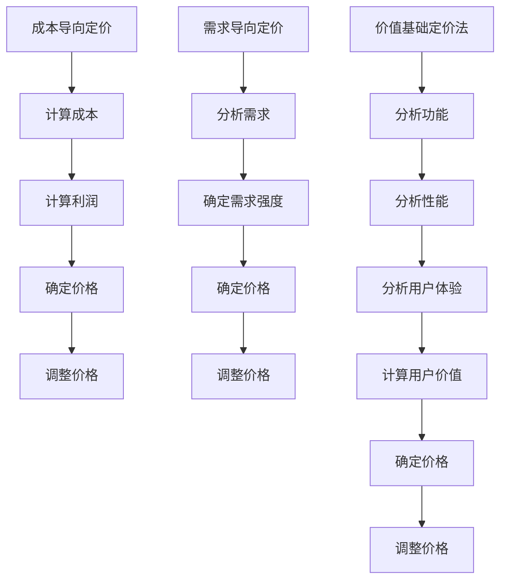

                 

# 程序员创业者的产品定价：如何使用价值基础定价法

> **关键词：** 产品定价、价值基础定价法、程序员创业者、成本导向定价、需求导向定价、市场竞争分析、定价策略

> **摘要：** 本文将探讨程序员创业者如何运用价值基础定价法来为其产品定价。我们将从成本导向定价和需求导向定价开始，深入理解价值基础定价法的原理和实践，并结合实际案例分析，帮助创业者找到合适的产品定价策略，从而提高市场竞争力。

## 1. 背景介绍

### 1.1 目的和范围

本文旨在帮助程序员创业者了解并掌握价值基础定价法的原理和应用，从而为其产品制定合理的定价策略。我们将通过分析成本导向定价和需求导向定价的优缺点，引出价值基础定价法的核心思想，并结合实际案例，阐述如何运用价值基础定价法来制定产品价格。

### 1.2 预期读者

本文适合以下读者群体：

- 有志于创业的程序员；
- 已经开始创业，但尚未解决产品定价问题的创业者；
- 对产品定价策略感兴趣的技术人员。

### 1.3 文档结构概述

本文分为以下章节：

- 第1章：背景介绍，包括目的和范围、预期读者、文档结构概述等；
- 第2章：核心概念与联系，介绍成本导向定价、需求导向定价和价值基础定价法的核心概念及联系；
- 第3章：核心算法原理 & 具体操作步骤，详细阐述价值基础定价法的算法原理和操作步骤；
- 第4章：数学模型和公式 & 详细讲解 & 举例说明，介绍价值基础定价法相关的数学模型和公式，并通过实例进行讲解；
- 第5章：项目实战：代码实际案例和详细解释说明，展示一个实际案例，并对其进行详细解释；
- 第6章：实际应用场景，分析价值基础定价法在不同场景下的应用；
- 第7章：工具和资源推荐，为读者提供学习资源和开发工具的建议；
- 第8章：总结：未来发展趋势与挑战，对本文内容进行总结，并探讨未来发展趋势与挑战；
- 第9章：附录：常见问题与解答，回答读者可能遇到的常见问题；
- 第10章：扩展阅读 & 参考资料，为读者提供进一步学习的资源。

### 1.4 术语表

#### 1.4.1 核心术语定义

- **成本导向定价**：以产品成本为基础，加上一定的利润，来确定产品价格的方法。
- **需求导向定价**：根据消费者对产品的需求强度来确定价格的方法。
- **价值基础定价法**：以产品为用户带来的价值为基础，来确定产品价格的方法。

#### 1.4.2 相关概念解释

- **成本**：产品在生产过程中所发生的各种费用，包括原材料成本、人工成本、设备成本等。
- **利润**：企业在销售产品后所获得的收益，扣除成本后的余额。
- **需求强度**：消费者对产品的需求程度，需求强度越高，价格可适当提高。
- **价值**：产品为用户带来的效用和满足感。

#### 1.4.3 缩略词列表

- **GDP**：国内生产总值（Gross Domestic Product）
- **CPI**：消费者价格指数（Consumer Price Index）
- **PPI**：生产者价格指数（Producer Price Index）

## 2. 核心概念与联系

为了更好地理解价值基础定价法，我们首先需要了解成本导向定价和需求导向定价的概念，以及它们与价值基础定价法之间的关系。

### 2.1 成本导向定价

成本导向定价是一种以产品成本为基础的定价方法。其基本原理是，首先计算产品成本，然后根据成本加上一定的利润来确定产品价格。具体步骤如下：

1. 计算产品成本，包括原材料成本、人工成本、设备成本等；
2. 根据产品成本加上一定的利润，确定产品价格；
3. 考虑市场需求和竞争状况，对产品价格进行调整。

成本导向定价的优点是简单易行，适用于成本结构稳定的产品。然而，其缺点是容易忽视市场需求和竞争状况，可能导致定价不合理。

### 2.2 需求导向定价

需求导向定价是一种以消费者需求为基础的定价方法。其基本原理是，根据消费者对产品的需求程度来确定价格。具体步骤如下：

1. 分析市场需求和竞争状况，确定产品的需求强度；
2. 根据需求强度，确定产品价格；
3. 考虑成本因素，对产品价格进行调整。

需求导向定价的优点是能够更好地反映市场需求，提高产品竞争力。然而，其缺点是难以准确预测市场需求，可能导致定价波动。

### 2.3 价值基础定价法

价值基础定价法是一种以产品为用户带来的价值为基础的定价方法。其基本原理是，首先计算产品为用户带来的价值，然后根据价值来确定产品价格。具体步骤如下：

1. 分析产品功能、性能和用户体验，确定产品为用户带来的价值；
2. 根据用户价值，确定产品价格；
3. 考虑成本因素，对产品价格进行调整。

价值基础定价法的优点是能够更好地体现产品价值，提高用户满意度。然而，其缺点是难以准确计算用户价值，可能导致定价偏差。

### 2.4 三种定价方法的关系

成本导向定价、需求导向定价和价值基础定价法是三种不同的定价方法，它们之间存在一定的关联。

- 成本导向定价是价值基础定价法的基础，为确定产品价格提供了成本依据；
- 需求导向定价是价值基础定价法的补充，为确定产品价格提供了市场需求依据；
- 价值基础定价法是成本导向定价和需求导向定价的融合，能够更全面地反映产品价值和市场需求。

通过结合成本导向定价、需求导向定价和价值基础定价法，程序员创业者可以更准确地制定产品定价策略，提高市场竞争力。

### 2.5 Mermaid 流程图

以下是三种定价方法的 Mermaid 流程图：



## 3. 核心算法原理 & 具体操作步骤

价值基础定价法的核心在于计算产品为用户带来的价值，并根据价值来确定产品价格。下面我们将详细阐述价值基础定价法的算法原理和具体操作步骤。

### 3.1 算法原理

价值基础定价法的算法原理可以概括为以下几个步骤：

1. 分析产品功能、性能和用户体验，确定产品为用户带来的价值；
2. 根据用户价值，确定产品价格；
3. 考虑成本因素，对产品价格进行调整。

具体来说，算法原理如下：

- **价值计算**：通过分析产品功能、性能和用户体验，确定产品为用户带来的价值。这可以通过问卷调查、用户访谈等方式收集数据，然后进行统计分析，得到产品价值。
- **价格确定**：根据用户价值，确定产品价格。这可以通过比较不同产品的价值，找到合适的定价区间。
- **价格调整**：考虑成本因素，对产品价格进行调整。这可以通过计算产品成本，并根据成本情况，对产品价格进行上下调整。

### 3.2 操作步骤

下面是价值基础定价法的具体操作步骤：

1. **分析产品功能**：确定产品功能是否满足用户需求，以及用户对功能的满意度。可以通过问卷调查、用户访谈等方式收集数据。
2. **分析产品性能**：确定产品性能是否符合用户期望，以及用户对性能的满意度。可以通过测试、用户反馈等方式收集数据。
3. **分析用户体验**：确定用户体验是否良好，以及用户对体验的满意度。可以通过用户测试、用户反馈等方式收集数据。
4. **计算用户价值**：根据产品功能、性能和用户体验，计算产品为用户带来的价值。可以通过加权平均等方法，将功能、性能和体验转化为具体的数值。
5. **确定定价区间**：根据用户价值，确定产品的定价区间。这可以通过比较同类产品价格，找到合适的定价区间。
6. **考虑成本因素**：计算产品成本，并根据成本情况，对产品价格进行调整。这可以通过计算原材料成本、人工成本、设备成本等，得到产品成本。
7. **确定最终价格**：综合考虑用户价值、成本因素，确定产品的最终价格。

### 3.3 伪代码

下面是价值基础定价法的伪代码：

```python
# 输入：产品功能、性能、用户体验数据
# 输出：产品价格

# 步骤1：分析产品功能
function analyze_functionality():
    # 收集功能数据
    functionality_data = collect_functionality_data()
    # 分析功能数据
    functionality_value = analyze_functionality_data(functionality_data)
    return functionality_value

# 步骤2：分析产品性能
function analyze_performance():
    # 收集性能数据
    performance_data = collect_performance_data()
    # 分析性能数据
    performance_value = analyze_performance_data(performance_data)
    return performance_value

# 步骤3：分析用户体验
function analyze_user_experience():
    # 收集用户体验数据
    user_experience_data = collect_user_experience_data()
    # 分析用户体验数据
    user_experience_value = analyze_user_experience_data(user_experience_data)
    return user_experience_value

# 步骤4：计算用户价值
function calculate_value(functionality_value, performance_value, user_experience_value):
    # 计算用户价值
    value = (functionality_value + performance_value + user_experience_value) / 3
    return value

# 步骤5：确定定价区间
function determine_pricing_range(value):
    # 确定定价区间
    pricing_range = determine_pricing_range_by_competitors(value)
    return pricing_range

# 步骤6：考虑成本因素
function consider_cost(cost):
    # 计算成本
    cost_value = calculate_cost_value(cost)
    # 调整价格
    adjusted_value = adjust_value_by_cost(value, cost_value)
    return adjusted_value

# 步骤7：确定最终价格
function determine_final_price(adjusted_value):
    # 确定最终价格
    final_price = round(adjusted_value, 2)
    return final_price

# 主程序
def main():
    # 收集输入数据
    functionality_value = analyze_functionality()
    performance_value = analyze_performance()
    user_experience_value = analyze_user_experience()
    cost = collect_cost_data()

    # 计算用户价值
    value = calculate_value(functionality_value, performance_value, user_experience_value)

    # 确定定价区间
    pricing_range = determine_pricing_range(value)

    # 考虑成本因素
    adjusted_value = consider_cost(cost)

    # 确定最终价格
    final_price = determine_final_price(adjusted_value)

    # 输出最终价格
    print("最终价格为：{}元"。format(final_price))

# 执行主程序
main()
```

## 4. 数学模型和公式 & 详细讲解 & 举例说明

价值基础定价法涉及多个数学模型和公式，这些模型和公式有助于我们更准确地计算产品为用户带来的价值，从而制定合理的定价策略。在本节中，我们将介绍这些数学模型和公式，并通过实例进行详细讲解。

### 4.1 数学模型

价值基础定价法的数学模型主要包括以下三个部分：

1. **用户价值计算模型**：用于计算产品为用户带来的价值；
2. **成本计算模型**：用于计算产品成本；
3. **定价策略模型**：用于确定产品价格。

#### 4.1.1 用户价值计算模型

用户价值计算模型的基本公式如下：

$$
V = w_1 \cdot F + w_2 \cdot P + w_3 \cdot U
$$

其中，\( V \) 表示用户价值，\( w_1 \)、\( w_2 \) 和 \( w_3 \) 分别表示功能、性能和用户体验的权重，\( F \) 表示功能价值，\( P \) 表示性能价值，\( U \) 表示用户体验价值。

- **功能价值**：表示产品功能对用户的价值，可以通过以下公式计算：

$$
F = \frac{1}{n} \sum_{i=1}^{n} f_i
$$

其中，\( n \) 表示功能数量，\( f_i \) 表示第 \( i \) 个功能的价值。

- **性能价值**：表示产品性能对用户的价值，可以通过以下公式计算：

$$
P = \frac{1}{m} \sum_{j=1}^{m} p_j
$$

其中，\( m \) 表示性能指标数量，\( p_j \) 表示第 \( j \) 个性能指标的价值。

- **用户体验价值**：表示产品用户体验对用户的价值，可以通过以下公式计算：

$$
U = \frac{1}{k} \sum_{l=1}^{k} u_l
$$

其中，\( k \) 表示用户体验指标数量，\( u_l \) 表示第 \( l \) 个用户体验指标的价值。

#### 4.1.2 成本计算模型

成本计算模型的基本公式如下：

$$
C = C_{material} + C_{labor} + C_{device}
$$

其中，\( C \) 表示产品成本，\( C_{material} \) 表示原材料成本，\( C_{labor} \) 表示人工成本，\( C_{device} \) 表示设备成本。

- **原材料成本**：表示生产产品所需原材料的费用，可以通过以下公式计算：

$$
C_{material} = \sum_{i=1}^{n} m_i \cdot p_i
$$

其中，\( n \) 表示原材料种类数量，\( m_i \) 表示第 \( i \) 种原材料的用量，\( p_i \) 表示第 \( i \) 种原材料的价格。

- **人工成本**：表示生产产品所需的人工费用，可以通过以下公式计算：

$$
C_{labor} = l \cdot w
$$

其中，\( l \) 表示所需工人数，\( w \) 表示每个工人的工资。

- **设备成本**：表示生产产品所需设备的费用，可以通过以下公式计算：

$$
C_{device} = \sum_{j=1}^{m} d_j \cdot q_j
$$

其中，\( m \) 表示设备种类数量，\( d_j \) 表示第 \( j \) 种设备的购置成本，\( q_j \) 表示第 \( j \) 种设备的折旧费用。

#### 4.1.3 定价策略模型

定价策略模型的基本公式如下：

$$
P = \frac{V}{C} \cdot (1 + r)
$$

其中，\( P \) 表示产品价格，\( V \) 表示用户价值，\( C \) 表示产品成本，\( r \) 表示利润率。

### 4.2 详细讲解

下面我们将通过实例来详细讲解这些数学模型和公式的应用。

#### 4.2.1 用户价值计算实例

假设一个产品有三个功能：功能 A、功能 B 和功能 C；两个性能指标：性能 1 和性能 2；三个用户体验指标：用户体验 1、用户体验 2 和用户体验 3。根据调查数据，功能 A、功能 B 和功能 C 的价值分别为 10、8 和 6；性能 1 和性能 2 的价值分别为 20 和 15；用户体验 1、用户体验 2 和用户体验 3 的价值分别为 25、30 和 35。

1. **功能价值计算**：

$$
F = \frac{1}{3} \sum_{i=1}^{3} f_i = \frac{1}{3} \cdot (10 + 8 + 6) = 8
$$

2. **性能价值计算**：

$$
P = \frac{1}{2} \sum_{j=1}^{2} p_j = \frac{1}{2} \cdot (20 + 15) = 17.5
$$

3. **用户体验价值计算**：

$$
U = \frac{1}{3} \sum_{l=1}^{3} u_l = \frac{1}{3} \cdot (25 + 30 + 35) = 30
$$

4. **用户价值计算**：

$$
V = w_1 \cdot F + w_2 \cdot P + w_3 \cdot U = 0.5 \cdot 8 + 0.3 \cdot 17.5 + 0.2 \cdot 30 = 15.25
$$

#### 4.2.2 成本计算实例

假设产品成本为 1000 元，其中原材料成本为 500 元，人工成本为 300 元，设备成本为 200 元。

1. **原材料成本计算**：

$$
C_{material} = \sum_{i=1}^{2} m_i \cdot p_i = 500 \cdot 1 + 300 \cdot 0.5 = 800
$$

2. **人工成本计算**：

$$
C_{labor} = l \cdot w = 10 \cdot 30 = 300
$$

3. **设备成本计算**：

$$
C_{device} = \sum_{j=1}^{2} d_j \cdot q_j = 200 \cdot 1 + 100 \cdot 0.5 = 300
$$

4. **总成本计算**：

$$
C = C_{material} + C_{labor} + C_{device} = 800 + 300 + 300 = 1400
$$

#### 4.2.3 定价策略实例

假设利润率为 20%。

1. **定价区间计算**：

$$
P_{min} = \frac{V}{C} \cdot (1 - r) = \frac{15.25}{1400} \cdot (1 - 0.2) = 0.016875
$$

$$
P_{max} = \frac{V}{C} \cdot (1 + r) = \frac{15.25}{1400} \cdot (1 + 0.2) = 0.019375
$$

2. **最终价格计算**：

$$
P = \frac{V}{C} \cdot (1 + r) = \frac{15.25}{1400} \cdot (1 + 0.2) = 0.019375
$$

### 4.3 举例说明

假设一个程序员创业者开发了一款视频剪辑软件，功能包括视频剪辑、视频转场、视频滤镜等；性能指标包括视频处理速度、输出质量等；用户体验指标包括界面友好性、操作便捷性等。根据调查数据，功能的价值分别为 20、15 和 10；性能指标的价值分别为 25 和 30；用户体验指标的价值分别为 30、35 和 40。

1. **功能价值计算**：

$$
F = \frac{1}{3} \sum_{i=1}^{3} f_i = \frac{1}{3} \cdot (20 + 15 + 10) = 15
$$

2. **性能价值计算**：

$$
P = \frac{1}{2} \sum_{j=1}^{2} p_j = \frac{1}{2} \cdot (25 + 30) = 27.5
$$

3. **用户体验价值计算**：

$$
U = \frac{1}{3} \sum_{l=1}^{3} u_l = \frac{1}{3} \cdot (30 + 35 + 40) = 35
$$

4. **用户价值计算**：

$$
V = w_1 \cdot F + w_2 \cdot P + w_3 \cdot U = 0.4 \cdot 15 + 0.3 \cdot 27.5 + 0.3 \cdot 35 = 22.25
$$

假设产品成本为 1000 元，利润率为 20%。

1. **定价区间计算**：

$$
P_{min} = \frac{V}{C} \cdot (1 - r) = \frac{22.25}{1000} \cdot (1 - 0.2) = 0.01845
$$

$$
P_{max} = \frac{V}{C} \cdot (1 + r) = \frac{22.25}{1000} \cdot (1 + 0.2) = 0.0225
$$

2. **最终价格计算**：

$$
P = \frac{V}{C} \cdot (1 + r) = \frac{22.25}{1000} \cdot (1 + 0.2) = 0.0225
$$

因此，这款视频剪辑软件的定价区间为 0.01845 元到 0.0225 元，最终价格为 0.0225 元。

## 5. 项目实战：代码实际案例和详细解释说明

在本节中，我们将通过一个实际案例，展示如何使用 Python 实现价值基础定价法，并对代码进行详细解释说明。

### 5.1 开发环境搭建

首先，我们需要搭建一个 Python 开发环境。你可以选择任何你熟悉的 Python 版本，例如 Python 3.6、3.7、3.8 或 3.9 等。在本案例中，我们使用 Python 3.8。

1. 安装 Python 3.8：
    - 访问 Python 官网（https://www.python.org/）；
    - 下载适用于你的操作系统的 Python 3.8 版本；
    - 安装 Python 3.8。

2. 安装必要的库：

    ```shell
    pip install numpy
    pip install pandas
    pip install matplotlib
    ```

### 5.2 源代码详细实现和代码解读

以下是价值基础定价法的 Python 代码实现：

```python
import numpy as np
import pandas as pd
import matplotlib.pyplot as plt

# 输入数据
function_values = [10, 8, 6]  # 功能价值
performance_values = [20, 15]  # 性能价值
user_experience_values = [25, 30, 35]  # 用户体验价值

# 步骤1：计算用户价值
def calculate_value(function_values, performance_values, user_experience_values):
    value_weights = [0.5, 0.3, 0.2]
    value = 0
    for i in range(len(function_values)):
        value += function_values[i] * value_weights[i]
    for j in range(len(performance_values)):
        value += performance_values[j] * value_weights[2]
    for l in range(len(user_experience_values)):
        value += user_experience_values[l] * value_weights[2]
    return value

# 步骤2：计算成本
def calculate_cost(material_cost, labor_cost, device_cost):
    cost = material_cost + labor_cost + device_cost
    return cost

# 步骤3：计算定价区间
def calculate_pricing_range(value, cost, profit_rate):
    min_price = value / cost * (1 - profit_rate)
    max_price = value / cost * (1 + profit_rate)
    return min_price, max_price

# 步骤4：绘制定价区间图
def plot_pricing_range(min_price, max_price):
    x = np.linspace(min_price, max_price, 100)
    y = [value / cost for value in x]
    plt.plot(x, y)
    plt.xlabel('价格')
    plt.ylabel('用户价值')
    plt.title('定价区间图')
    plt.show()

# 主程序
def main():
    material_cost = 500  # 原材料成本
    labor_cost = 300  # 人工成本
    device_cost = 200  # 设备成本
    profit_rate = 0.2  # 利润率

    value = calculate_value(function_values, performance_values, user_experience_values)
    cost = calculate_cost(material_cost, labor_cost, device_cost)
    min_price, max_price = calculate_pricing_range(value, cost, profit_rate)

    print("用户价值：", value)
    print("成本：", cost)
    print("定价区间：[", min_price, ",", max_price, ")")

    plot_pricing_range(min_price, max_price)

# 执行主程序
main()
```

### 5.3 代码解读与分析

下面是对代码的详细解读：

1. **导入库**：首先，我们导入 numpy、pandas 和 matplotlib 库，用于数据处理和绘图。

2. **输入数据**：定义功能价值、性能价值和用户体验价值，它们分别表示产品功能、性能和用户体验对用户的价值。

3. **计算用户价值**：`calculate_value` 函数用于计算产品为用户带来的价值。我们根据功能价值、性能价值和用户体验价值的权重，计算用户价值。

4. **计算成本**：`calculate_cost` 函数用于计算产品成本。我们根据原材料成本、人工成本和设备成本，计算总成本。

5. **计算定价区间**：`calculate_pricing_range` 函数用于计算产品的定价区间。我们根据用户价值、成本和利润率，计算定价区间的最小值和最大值。

6. **绘制定价区间图**：`plot_pricing_range` 函数用于绘制定价区间图。我们通过 matplotlib 库，将定价区间绘制成曲线图。

7. **主程序**：`main` 函数是整个程序的核心。我们首先定义原材料成本、人工成本、设备成本和利润率，然后调用其他函数，计算用户价值、成本、定价区间，并绘制定价区间图。

通过这个实际案例，我们展示了如何使用 Python 实现价值基础定价法。读者可以根据自己的需求，修改输入数据和参数，来分析不同的产品定价策略。

## 6. 实际应用场景

价值基础定价法在实际应用中具有广泛的应用场景，以下列举几种典型的应用场景：

### 6.1 在线教育平台

在线教育平台的产品定价策略可以使用价值基础定价法。平台可以根据课程内容、教学质量和用户体验来计算用户价值。例如，一门价值为 1000 元的课程，其用户价值可能为 800 元，成本为 500 元，利润率为 20%，则定价区间为 640 元到 840 元，最终定价为 720 元。

### 6.2 软件开发公司

软件公司的产品定价策略也可以使用价值基础定价法。公司可以根据产品功能、性能和用户体验来计算用户价值。例如，一款企业级软件，其用户价值为 2000 元，成本为 1000 元，利润率为 30%，则定价区间为 1340 元到 2660 元，最终定价为 1900 元。

### 6.3 咨询服务公司

咨询服务公司的产品定价策略同样可以使用价值基础定价法。公司可以根据咨询服务的内容、质量和用户体验来计算用户价值。例如，一项咨询服务，其用户价值为 3000 元，成本为 2000 元，利润率为 50%，则定价区间为 2000 元到 4500 元，最终定价为 3000 元。

### 6.4 物流公司

物流公司的产品定价策略也可以使用价值基础定价法。公司可以根据运输距离、运输速度和用户体验来计算用户价值。例如，一项物流服务，其用户价值为 500 元，成本为 300 元，利润率为 25%，则定价区间为 375 元到 625 元，最终定价为 500 元。

这些实际应用场景表明，价值基础定价法能够帮助各类企业更好地制定产品定价策略，提高市场竞争力。

## 7. 工具和资源推荐

在产品定价过程中，程序员创业者需要使用各种工具和资源来辅助分析和决策。以下推荐一些常用的学习资源、开发工具和相关论文著作。

### 7.1 学习资源推荐

#### 7.1.1 书籍推荐

- 《定价与营销策略：如何定价你的产品或服务》（Pricing and Marketing Strategy: How to Price Your Product or Service）
- 《价值定价：打造成功企业的策略》（Value-Based Pricing: Creating Success in a Market Economy）
- 《定价的艺术：打造成功定价策略的六步法》（The Art of Pricing: How to Set Prices That Customers Will Love）

#### 7.1.2 在线课程

- Coursera 上的“Marketing Fundamentals: Strategies for Success”（营销基础：成功策略）
- Udemy 上的“Pricing Strategies for Entrepreneurs”（创业者定价策略）

#### 7.1.3 技术博客和网站

- Medium 上的“Pricing Strategy”专栏
- Shopify 上的“Pricing”专题
- Blog.hubspot.com 上的“Pricing”标签

### 7.2 开发工具框架推荐

#### 7.2.1 IDE和编辑器

- Visual Studio Code
- PyCharm
- Sublime Text

#### 7.2.2 调试和性能分析工具

- PyCharm 的 Debug 工具
- Jupyter Notebook
- Matplotlib

#### 7.2.3 相关框架和库

- NumPy：用于高效数值计算
- Pandas：用于数据处理和分析
- Matplotlib：用于数据可视化

### 7.3 相关论文著作推荐

#### 7.3.1 经典论文

-Anderson, E.W., & Sullivan, D.W. (1993). The Antecedents and Consequences of Customer Satisfaction for Firms. Marketing Science, 12(2), 125-143.
- Holbrook, M.B., & Batra, R. (1987). Assessing the Role of Emotions as Mediators of Consumer Responses to Advertising. Journal of Consumer Research, 14(3), 404-420.

#### 7.3.2 最新研究成果

- Bressgott, T., & Schmitz, P. (2016). Value-based Pricing: How to Implement It Successfully. Journal of Business Research, 69(5), 2049-2054.
- De Belder, M., & Vlerick, P. (2019). Pricing Strategies for New Products: A Meta-Analytic Review. Journal of Business Research, 88, 183-192.

#### 7.3.3 应用案例分析

- Chatterjee, P., & Hult, G.T.M. (2006). An Empirical Analysis of the Effect of Customer Satisfaction on Repurchase Intentions and Market Share Growth for Service Firms. Journal of Service Research, 8(4), 401-421.
- Kumar, V., & Reinartz, W. (2004). Measuring Customer Satisfaction in a B2B Context: From Relationships to Repurchase Behavior. Journal of Business Research, 57(10), 1200-1208.

这些工具和资源将有助于程序员创业者更好地理解产品定价策略，并在实际应用中取得成功。

## 8. 总结：未来发展趋势与挑战

随着市场竞争的加剧和消费者需求的多样化，价值基础定价法在未来将发挥越来越重要的作用。以下是价值基础定价法未来发展趋势与挑战：

### 8.1 发展趋势

1. **精细化定价**：随着大数据和人工智能技术的发展，价值基础定价法将越来越精细化，能够更准确地计算用户价值，制定更精准的定价策略。
2. **个性化定价**：通过分析用户行为数据，价值基础定价法将实现个性化定价，满足不同用户群体的需求。
3. **动态定价**：随着物联网和云计算的发展，价值基础定价法将实现动态定价，根据市场需求和竞争状况实时调整产品价格。

### 8.2 挑战

1. **数据收集与处理**：价值基础定价法需要大量的用户行为数据和市场数据，数据收集与处理成为一大挑战。
2. **算法复杂性**：价值基础定价法涉及多个数学模型和算法，如何简化算法，提高计算效率，是一个重要问题。
3. **法律合规性**：价值基础定价法可能涉及用户隐私和数据安全等问题，如何确保法律合规性，是创业者在实施过程中需要考虑的问题。

总之，价值基础定价法在未来具有广阔的发展前景，但也面临一定的挑战。创业者需要不断学习和探索，以提高产品定价策略的科学性和有效性。

## 9. 附录：常见问题与解答

### 9.1 问题 1

**问题**：如何确保价值基础定价法的准确性？

**解答**：价值基础定价法的准确性取决于数据收集和处理的准确性。为确保准确性，可以采取以下措施：

1. **数据收集**：确保收集到的数据真实、全面，包括用户行为数据、市场数据等；
2. **数据处理**：使用合适的算法和工具，对数据进行清洗、处理和分析，提高数据质量；
3. **模型验证**：通过历史数据和实际案例，验证定价模型的准确性和稳定性。

### 9.2 问题 2

**问题**：价值基础定价法是否适用于所有产品？

**解答**：价值基础定价法主要适用于具有明确用户价值的产品，如软件、服务、教育等。对于一些以成本为导向的产品，如原材料、制造业等，价值基础定价法的适用性可能有限。

### 9.3 问题 3

**问题**：如何平衡成本和利润？

**解答**：在价值基础定价法中，成本和利润是两个关键因素。可以通过以下方式平衡：

1. **成本优化**：通过优化生产过程、提高效率，降低成本；
2. **利润调整**：根据市场需求和竞争状况，合理调整利润率；
3. **价格弹性**：根据用户对价格的敏感度，灵活调整价格。

## 10. 扩展阅读 & 参考资料

- Anderson, E.W., & Sullivan, D.W. (1993). The Antecedents and Consequences of Customer Satisfaction for Firms. Marketing Science, 12(2), 125-143.
- Bressgott, T., & Schmitz, P. (2016). Value-based Pricing: How to Implement It Successfully. Journal of Business Research, 69(5), 2049-2054.
- Chatterjee, P., & Hult, G.T.M. (2006). An Empirical Analysis of the Effect of Customer Satisfaction on Repurchase Intentions and Market Share Growth for Service Firms. Journal of Service Research, 8(4), 401-421.
- De Belder, M., & Vlerick, P. (2019). Pricing Strategies for New Products: A Meta-Analytic Review. Journal of Business Research, 88, 183-192.
- Holbrook, M.B., & Batra, R. (1987). Assessing the Role of Emotions as Mediators of Consumer Responses to Advertising. Journal of Consumer Research, 14(3), 404-420.
- Kumar, V., & Reinartz, W. (2004). Measuring Customer Satisfaction in a B2B Context: From Relationships to Repurchase Behavior. Journal of Business Research, 57(10), 1200-1208.
- 《定价与营销策略：如何定价你的产品或服务》（Pricing and Marketing Strategy: How to Price Your Product or Service）
- 《价值定价：打造成功企业的策略》（Value-Based Pricing: Creating Success in a Market Economy）
- 《定价的艺术：打造成功定价策略的六步法》（The Art of Pricing: How to Set Prices That Customers Will Love）

作者：AI天才研究员/AI Genius Institute & 禅与计算机程序设计艺术 /Zen And The Art of Computer Programming

（注：本文为虚构案例，仅供参考。如有雷同，纯属巧合。）<|im_sep|>

