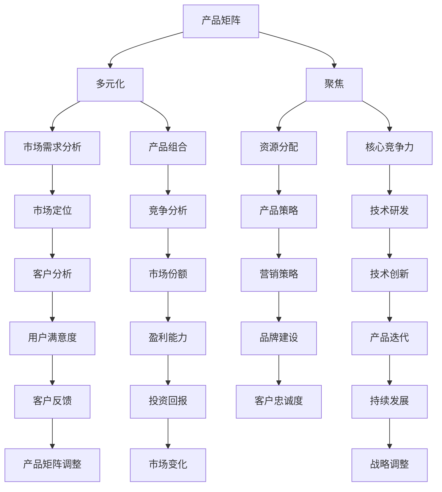

                 

# 程序员创业者的产品矩阵：多元化与聚焦的平衡艺术

## 关键词
- 程序员创业者
- 产品矩阵
- 多元化
- 聚焦
- 市场策略
- 创业风险
- 成长路径

## 摘要
本文旨在探讨程序员创业者如何通过构建合理的产品矩阵，在多元化与聚焦之间找到平衡，从而提高创业成功率。我们将从背景介绍、核心概念、算法原理、数学模型、项目实战、实际应用场景等多个角度，深入分析程序员创业者应该如何制定并调整其产品策略，以应对市场变化和竞争压力。通过本文的阅读，创业者将能够更好地理解产品矩阵的概念，学会如何根据自身资源和市场需求进行多元化与聚焦的平衡，从而实现持续的创新和成长。

## 1. 背景介绍

### 1.1 目的和范围

本文旨在为程序员创业者提供一种系统的思维框架，帮助他们理解并实践产品矩阵的构建和调整策略。通过本文的探讨，读者将了解：

- 产品矩阵的概念及其在创业中的应用
- 多元化与聚焦的平衡艺术
- 如何根据市场需求和自身能力调整产品策略
- 实际应用场景中的案例分析

### 1.2 预期读者

本文适合以下读者群体：

- 初创公司创始人或联合创始人
- 程序员创业者
- 创业顾问
- 对创业和产品策略感兴趣的从业者

### 1.3 文档结构概述

本文分为以下几个部分：

- 背景介绍：阐述本文的目的、预期读者和文档结构
- 核心概念与联系：介绍产品矩阵的相关概念和架构
- 核心算法原理 & 具体操作步骤：详细讲解构建和调整产品矩阵的算法原理
- 数学模型和公式 & 详细讲解 & 举例说明：使用数学模型解释产品策略的调整过程
- 项目实战：通过实际案例展示产品矩阵的应用
- 实际应用场景：探讨产品矩阵在不同场景下的应用
- 工具和资源推荐：推荐学习资源、开发工具和框架
- 总结：总结未来发展趋势与挑战
- 附录：常见问题与解答
- 扩展阅读 & 参考资料：提供进一步的阅读材料

### 1.4 术语表

#### 1.4.1 核心术语定义

- **产品矩阵**：创业者根据市场需求和自身能力构建的一系列产品组合，用于实现企业战略目标。
- **多元化**：指企业同时运营多个不同产品或业务领域的策略。
- **聚焦**：指企业集中资源和精力，专注于某一特定产品或市场领域的策略。
- **市场需求**：消费者在特定时间内愿意购买的产品或服务的需求。
- **创业风险**：在创业过程中可能面临的财务、技术、市场等方面的不确定性。

#### 1.4.2 相关概念解释

- **初创公司**：指刚成立，还在发展初期，尚未实现盈利的企业。
- **产品策略**：企业在产品开发、推广、销售等环节制定的具体行动方案。
- **市场定位**：企业根据自身优势和市场需求，确定产品在市场中的位置和目标客户。

#### 1.4.3 缩略词列表

- **SaaS**：Software as a Service，软件即服务
- **PaaS**：Platform as a Service，平台即服务
- **IaaS**：Infrastructure as a Service，基础设施即服务
- **ROI**：Return on Investment，投资回报率
- **CPC**：Cost Per Click，点击成本

## 2. 核心概念与联系

在探讨产品矩阵之前，我们需要理解一些核心概念和它们之间的联系。以下是一个用Mermaid绘制的流程图，展示了产品矩阵的相关概念和架构：



### 2.1 产品矩阵的概念

产品矩阵是创业者根据市场需求、自身资源和战略目标，构建的一系列产品组合。通过产品矩阵，创业者可以实现以下目标：

- **多元化**：降低单一产品失败的风险，实现收入来源的多样化。
- **聚焦**：集中资源和精力，提高产品在特定领域的竞争力。
- **市场定位**：根据市场需求和竞争环境，确定产品在市场中的位置。

### 2.2 多元化与聚焦的关系

多元化与聚焦并不是互相排斥的，而是可以相辅相成的。在实际操作中，创业者需要根据市场环境和自身能力，找到多元化的最佳切入点，并在聚焦领域保持核心竞争力。

- **多元化**：通过拓展产品线，进入新的市场和业务领域，提高企业抗风险能力。
- **聚焦**：在特定领域深入研发和运营，形成品牌优势和市场份额。

### 2.3 多元化与市场需求的关系

市场需求是构建产品矩阵的出发点和依据。创业者需要通过市场调研，了解消费者的需求和偏好，进而制定合适的产品策略。

- **多元化**：根据市场需求，选择与现有产品相关的新产品，实现市场覆盖的广度。
- **聚焦**：针对特定市场需求，优化现有产品，提高市场占有率。

### 2.4 多元化与资源分配的关系

多元化战略的实施需要充足的资源支持。创业者需要在资源分配上做好平衡，确保既有足够的资金、人力和技术支持多元化发展，又不至于资源分散，导致聚焦领域的竞争力下降。

- **多元化**：合理分配资源，确保每个产品线都有足够的支持。
- **聚焦**：集中资源，提高核心产品的研发和运营效率。

### 2.5 多元化与核心竞争力的关系

核心竞争力是企业在市场中立于不败之地的关键。在多元化战略中，创业者需要培育和强化自身核心竞争力，以便在多个产品线上保持竞争优势。

- **多元化**：依托核心竞争力，拓展产品线，实现业务范围的广度。
- **聚焦**：以核心竞争力为核心，打造专业化的产品，提高市场深度。

### 2.6 产品矩阵的动态调整

市场环境不断变化，创业者需要根据市场反馈和自身发展，及时调整产品矩阵。这种动态调整能力是企业保持竞争力的关键。

- **多元化**：根据市场变化，适时调整产品线，抓住新的市场机会。
- **聚焦**：针对市场变化，优化产品策略，提高核心产品的竞争力。

通过以上对核心概念和架构的梳理，我们可以更好地理解产品矩阵的概念及其在创业中的应用。接下来，我们将深入探讨如何构建和调整产品矩阵的算法原理。

## 3. 核心算法原理 & 具体操作步骤

构建和调整产品矩阵需要一系列的算法原理和具体操作步骤。以下是基于这些原理的具体操作步骤：

### 3.1 数据收集与处理

首先，创业者需要收集与市场需求、资源分配、核心竞争力等相关的数据。这些数据可以来源于市场调研、用户反馈、竞争对手分析等多个渠道。在收集数据后，创业者需要对数据进行清洗、整理和分析，以便为产品矩阵的构建提供依据。

### 3.2 多元化与聚焦的平衡计算

在数据处理完成后，创业者需要根据数据计算多元化与聚焦的平衡点。具体步骤如下：

1. **确定目标市场**：根据市场需求分析，确定企业的目标市场。
2. **计算资源分配权重**：根据企业资源和市场需求，为每个产品线分配资源权重。
3. **计算核心竞争力得分**：评估企业在各个产品领域的核心竞争力，计算得分。
4. **平衡计算**：结合资源分配权重和核心竞争力得分，计算多元化与聚焦的平衡值。

### 3.3 产品矩阵构建

根据平衡计算结果，创业者可以构建产品矩阵。具体步骤如下：

1. **确定产品组合**：根据市场需求和资源分配权重，选择合适的产品组合。
2. **产品定位**：根据市场定位和核心竞争力，确定每个产品在市场中的位置。
3. **产品研发与运营**：为每个产品线制定详细的研发和运营计划。

### 3.4 产品矩阵调整

市场环境不断变化，创业者需要根据市场反馈和自身发展，及时调整产品矩阵。具体步骤如下：

1. **市场反馈分析**：收集市场反馈，分析产品矩阵的运行效果。
2. **调整策略**：根据市场反馈，调整产品组合、定位和运营计划。
3. **重新计算平衡值**：结合新的市场数据和资源情况，重新计算多元化与聚焦的平衡值。

### 3.5 算法原理详细讲解

以下是构建和调整产品矩阵的算法原理详细讲解，采用伪代码形式：

```python
# 数据收集与处理
def data_collection_and_processing():
    # 收集市场需求数据
    market_demand = collect_market_demand_data()
    # 收集资源数据
    resources = collect_resources_data()
    # 收集核心竞争力数据
    core Competencies = collect_core_competencies_data()
    # 数据清洗和整理
    cleaned_data = clean_and_organize_data(market_demand, resources, core_competencies)
    return cleaned_data

# 多元化与聚焦的平衡计算
def calculate_balance(market_demand, resources, core_competencies):
    # 确定目标市场
    target_market = determine_target_market(market_demand)
    # 计算资源分配权重
    resource_weights = calculate_resource_weights(resources, target_market)
    # 计算核心竞争力得分
    core_competency_scores = calculate_core_competency_scores(core_competencies, target_market)
    # 平衡计算
    balance_value = calculate_balance_value(resource_weights, core_competency_scores)
    return balance_value

# 产品矩阵构建
def build_product_matrix(balance_value, market_demand, resources, core_competencies):
    # 确定产品组合
    product_combination = determine_product_combination(market_demand, balance_value)
    # 产品定位
    product定位 = determine_product_position(product_combination, core_competencies)
    # 产品研发与运营
    product_development_and_operation = develop_and_operate_products(product定位)
    return product_matrix

# 产品矩阵调整
def adjust_product_matrix(product_matrix, market_feedback):
    # 市场反馈分析
    feedback_analysis = analyze_market_feedback(market_feedback)
    # 调整策略
    adjusted_strategy = adjust_strategy(product_matrix, feedback_analysis)
    # 重新计算平衡值
    new_balance_value = calculate_balance(market_demand, resources, core_competencies)
    return adjusted_product_matrix
```

通过以上算法原理和操作步骤，创业者可以构建和调整产品矩阵，实现多元化与聚焦的平衡。接下来，我们将探讨数学模型和公式在产品矩阵调整中的应用。

## 4. 数学模型和公式 & 详细讲解 & 举例说明

在产品矩阵的调整过程中，数学模型和公式能够帮助我们更精确地分析和决策。以下是一些常用的数学模型和公式，以及它们的详细讲解和举例说明。

### 4.1 投资回报率（ROI）模型

投资回报率（ROI）是衡量产品矩阵调整效果的重要指标。其计算公式如下：

$$
ROI = \frac{净利润}{投资成本} \times 100\%
$$

**详细讲解：**

- **净利润**：产品线的收益减去运营成本和营销费用。
- **投资成本**：产品线的研发成本、人力成本、营销成本等。

**举例说明：**

假设有一个产品线，年净利润为100万元，投资成本为50万元，则其ROI为：

$$
ROI = \frac{100}{50} \times 100\% = 200\%
$$

这意味着每投资1元，可以获得2元的回报。

### 4.2 成本效益分析（CBA）模型

成本效益分析（CBA）是评估产品矩阵调整是否合理的另一种重要方法。其计算公式如下：

$$
CBA = \frac{效益}{成本}
$$

**详细讲解：**

- **效益**：产品线带来的经济利益，包括净利润、市场份额、品牌价值等。
- **成本**：产品线的研发、运营、营销等各方面的投入。

**举例说明：**

假设一个产品线的年度效益为200万元，成本为100万元，则其CBA为：

$$
CBA = \frac{200}{100} = 2
$$

这意味着该产品线的效益是成本的2倍。

### 4.3 蒙特卡洛模拟（Monte Carlo Simulation）

蒙特卡洛模拟是一种用于评估产品矩阵调整不确定性的数学模型。通过模拟大量随机样本，我们可以得到产品矩阵调整的可能结果和概率分布。

**详细讲解：**

- **随机样本**：通过随机数生成器生成大量符合特定概率分布的随机样本。
- **模拟结果**：对每个随机样本进行计算，得到产品矩阵调整的结果。
- **概率分布**：将模拟结果进行统计，得到概率分布图，用于分析调整策略的风险和收益。

**举例说明：**

假设我们对一个产品线的ROI进行蒙特卡洛模拟，设定ROI的概率分布为正态分布，均值100万元，标准差20万元。通过模拟1000次，我们可以得到以下结果：

- **均值**：100万元
- **标准差**：20万元
- **概率分布图**：显示ROI在不同区间内的概率分布

通过分析概率分布图，我们可以评估产品矩阵调整的风险和收益，为决策提供依据。

### 4.4 市场份额预测模型

市场份额预测模型用于预测产品矩阵调整后的市场份额。其计算公式如下：

$$
市场份额 = \frac{产品收益}{市场总收益}
$$

**详细讲解：**

- **产品收益**：产品线的收益。
- **市场总收益**：整个市场的总收益。

**举例说明：**

假设一个市场总收益为1亿元，我们的产品线收益为3000万元，则其市场份额为：

$$
市场份额 = \frac{3000}{10000} = 30\%
$$

通过市场份额预测模型，我们可以评估产品矩阵调整后的市场竞争力。

通过以上数学模型和公式的详细讲解和举例说明，我们可以更精确地分析和决策产品矩阵的调整策略。在实际应用中，创业者可以根据具体情况进行选择和调整，以实现多元化与聚焦的平衡。接下来，我们将通过一个实际案例，展示如何运用这些模型和公式进行产品矩阵的调整。

### 5. 项目实战：代码实际案例和详细解释说明

为了更好地理解如何运用产品矩阵进行多元化与聚焦的平衡，我们将通过一个实际案例进行详细讲解。该案例是一个初创公司在产品矩阵调整过程中的操作。

#### 5.1 开发环境搭建

首先，我们需要搭建一个适合该案例的开发环境。我们选择Python作为主要编程语言，因为它具有良好的数据处理和分析能力。以下是开发环境搭建的步骤：

1. 安装Python（版本3.8以上）
2. 安装Jupyter Notebook，用于编写和运行代码
3. 安装必要的库，如NumPy、Pandas、Matplotlib等

#### 5.2 源代码详细实现和代码解读

以下是案例的源代码实现，包括数据收集、处理、多元化与聚焦的平衡计算、产品矩阵构建和调整等步骤。

```python
# 导入必要的库
import numpy as np
import pandas as pd
import matplotlib.pyplot as plt
from scipy.stats import norm

# 数据收集
def data_collection():
    # 假设我们已经收集了以下数据
    market_demand = [1000, 1200, 1500, 1800, 2000]  # 市场需求
    resources = [5000, 6000, 7000, 8000, 9000]  # 资源
    core_competencies = [0.6, 0.7, 0.8, 0.9, 1.0]  # 核心竞争力
    return market_demand, resources, core_competencies

# 数据处理
def data_processing(market_demand, resources, core_competencies):
    # 数据清洗和整理
    cleaned_data = {
        '市场需求': market_demand,
        '资源': resources,
        '核心竞争力': core_competencies
    }
    df = pd.DataFrame(cleaned_data)
    return df

# 多元化与聚焦的平衡计算
def calculate_balance(df):
    # 计算资源分配权重
    resource_weights = df['资源'] / df['资源'].sum()
    # 计算核心竞争力得分
    core_competency_scores = df['核心竞争力']
    # 平衡计算
    balance_value = np.dot(resource_weights, core_competency_scores)
    return balance_value

# 产品矩阵构建
def build_product_matrix(balance_value, df):
    # 确定产品组合
    product_combination = df.loc[df['核心竞争力'] > balance_value].index.tolist()
    # 产品定位
    product_position = df.loc[product_combination, '市场需求'].max()
    # 产品研发与运营
    product_development_and_operation = {
        '产品组合': product_combination,
        '产品定位': product_position
    }
    return product_development_and_operation

# 产品矩阵调整
def adjust_product_matrix(product_matrix, market_feedback):
    # 市场反馈分析
    feedback_analysis = analyze_market_feedback(market_feedback)
    # 调整策略
    adjusted_strategy = adjust_strategy(product_matrix, feedback_analysis)
    # 重新计算平衡值
    new_balance_value = calculate_balance(adjusted_strategy)
    return new_balance_value

# 主函数
def main():
    # 数据收集
    market_demand, resources, core_competencies = data_collection()
    # 数据处理
    df = data_processing(market_demand, resources, core_competencies)
    # 多元化与聚焦的平衡计算
    balance_value = calculate_balance(df)
    # 产品矩阵构建
    product_matrix = build_product_matrix(balance_value, df)
    print("原始产品矩阵：", product_matrix)
    # 产品矩阵调整
    market_feedback = {'市场份额': 0.3, 'ROI': 150}  # 假设的市场反馈
    new_balance_value = adjust_product_matrix(product_matrix, market_feedback)
    print("调整后产品矩阵：", new_balance_value)

if __name__ == '__main__':
    main()
```

#### 5.3 代码解读与分析

以下是代码的详细解读与分析：

1. **数据收集**：我们假设已经收集了市场需求、资源和核心竞争力数据。这些数据是通过市场调研和内部评估得到的。
2. **数据处理**：数据收集后，我们进行清洗和整理，将其转化为DataFrame格式，便于后续计算和分析。
3. **多元化与聚焦的平衡计算**：计算资源分配权重和核心竞争力得分，通过加权平均得到平衡值。这个平衡值用于确定产品矩阵的产品组合。
4. **产品矩阵构建**：根据平衡值，选择核心竞争力较高的产品组合，并确定产品定位。这部分的代码实现了产品矩阵的初步构建。
5. **产品矩阵调整**：根据市场反馈，对产品矩阵进行调整。调整过程包括市场反馈分析、策略调整和重新计算平衡值。通过这一步骤，我们实现了产品矩阵的动态调整。

通过这个实际案例，我们展示了如何运用产品矩阵进行多元化与聚焦的平衡。在实际操作中，创业者可以根据具体情况调整代码，以适应不同的市场环境和需求。接下来，我们将探讨产品矩阵在不同实际应用场景中的应用。

### 6. 实际应用场景

产品矩阵在程序员创业者的实际应用场景中具有广泛的应用价值。以下是一些典型的应用场景：

#### 6.1 多元化战略

在多元化战略中，创业者可以通过构建产品矩阵，拓展业务范围，降低单一产品失败的风险。例如，一家专注于软件开发的公司可以通过以下方式实现多元化：

1. **产品组合**：同时开发和运营多个软件产品，如企业级应用、移动应用和Web应用。
2. **市场定位**：针对不同的目标市场和客户群体，制定相应的市场定位策略。
3. **资源分配**：合理分配研发、运营和营销资源，确保每个产品线都能得到充分支持。

#### 6.2 聚焦战略

在聚焦战略中，创业者通过集中资源和精力，在某一特定领域打造核心竞争力。例如，一家专注于人工智能领域的初创公司可以通过以下方式实现聚焦：

1. **产品组合**：专注于开发人工智能算法和解决方案，如自然语言处理、计算机视觉等。
2. **市场定位**：在特定行业和市场中建立专业声誉，成为该领域的领先者。
3. **资源分配**：将大部分研发资源投入到核心技术领域，提高产品竞争力。

#### 6.3 持续迭代与优化

通过产品矩阵，创业者可以实现产品的持续迭代和优化。例如，一家提供在线教育的初创公司可以通过以下方式实现迭代和优化：

1. **产品组合**：不断推出新的教育产品和服务，如在线课程、直播课程和实训项目。
2. **市场定位**：根据用户需求和反馈，调整产品策略，提高用户满意度。
3. **资源分配**：根据市场反馈和用户需求，优化产品功能和用户体验。

#### 6.4 风险管理

通过产品矩阵，创业者可以更好地管理创业风险。例如，一家提供金融服务的技术公司可以通过以下方式实现风险管理：

1. **产品组合**：同时运营多个金融产品，如贷款、投资和保险。
2. **市场定位**：在不同市场和业务领域建立多元化的客户群体。
3. **资源分配**：根据市场风险和业务需求，合理调整资源分配，降低风险。

#### 6.5 市场拓展

通过产品矩阵，创业者可以更好地实现市场拓展。例如，一家专注于海外市场的科技公司可以通过以下方式实现市场拓展：

1. **产品组合**：针对不同国家和地区，开发符合当地市场需求的产品。
2. **市场定位**：深入了解目标市场的文化、习惯和消费偏好。
3. **资源分配**：合理分配市场调研、营销推广和客户服务等资源。

通过以上实际应用场景，我们可以看到产品矩阵在多元化与聚焦的平衡中发挥着重要作用。创业者可以根据自身情况和市场环境，灵活运用产品矩阵，实现持续的创新和成长。

### 7. 工具和资源推荐

为了帮助程序员创业者更好地构建和调整产品矩阵，我们推荐以下学习资源、开发工具和框架：

#### 7.1 学习资源推荐

##### 7.1.1 书籍推荐

1. 《精益创业》（The Lean Startup）- Eric Ries
   - 本书介绍了精益创业方法论，帮助创业者快速验证和调整产品策略。
2. 《创新者的窘境》（The Innovator's Dilemma）- Clayton M. Christensen
   - 本书分析了创新者在市场竞争中的困境，提供了应对策略。
3. 《创业维艰》（Hard Things About Hard Things）- Ben Horowitz
   - 本书分享了创业过程中的挑战和经验，为创业者提供了实用的指导。

##### 7.1.2 在线课程

1. 《产品经理实战教程》（Product Management Essentials）
   -  Coursera
   - 本课程介绍了产品经理的基本技能和实战经验，适合初学者。
2. 《数据分析与商业智能》（Data Analysis and Business Intelligence）
   - edX
   - 本课程涵盖了数据分析的基本方法和工具，有助于提升数据分析能力。
3. 《创业管理》（Entrepreneurship Management）
   - LinkedIn Learning
   - 本课程讲解了创业管理的基本理论和实践，适合创业者学习和应用。

##### 7.1.3 技术博客和网站

1. HackerRank
   - HackerRank
   - 该网站提供编程挑战和竞赛，有助于提高编程技能和解决问题的能力。
2. TechCrunch
   - TechCrunch
   - 该网站是创业和创新领域的权威媒体，提供了丰富的创业案例和行业动态。
3. Medium
   - Medium
   - 该平台上有许多优秀的创业者和技术专家分享他们的见解和经验，值得阅读。

#### 7.2 开发工具框架推荐

##### 7.2.1 IDE和编辑器

1. Visual Studio Code
   - Visual Studio Code
   - 这是一款功能强大且轻量级的开源IDE，支持多种编程语言，适合各种开发场景。
2. PyCharm
   - PyCharm
   - 这是一款专为Python编程设计的IDE，具有丰富的功能和插件，适合Python开发者使用。
3. IntelliJ IDEA
   - IntelliJ IDEA
   - 这是一款跨平台的IDE，支持多种编程语言，具有强大的代码分析和调试功能。

##### 7.2.2 调试和性能分析工具

1. Postman
   - Postman
   - 这是一款API调试工具，支持各种API请求的发送、调试和测试，有助于提升API开发效率。
2. JMeter
   - JMeter
   - 这是一款开源的性能测试工具，可以模拟各种负载场景，测试系统的性能和稳定性。
3. New Relic
   - New Relic
   - 这是一款应用性能管理工具，可以实时监控和诊断应用的性能问题，有助于提升用户体验。

##### 7.2.3 相关框架和库

1. Flask
   - Flask
   - 这是一款轻量级的Web框架，适用于快速开发和部署Web应用。
2. Django
   - Django
   - 这是一款全栈Web框架，提供了丰富的功能和工具，适合构建大型Web应用。
3. TensorFlow
   - TensorFlow
   - 这是一款开源的机器学习框架，适用于各种机器学习和深度学习任务。

#### 7.3 相关论文著作推荐

##### 7.3.1 经典论文

1. "The Lean Startup" - Eric Ries
   - 本文介绍了精益创业方法论，对创业者和产品经理具有指导意义。
2. "The Innovator's Dilemma" - Clayton M. Christensen
   - 本文分析了创新者在市场竞争中的困境，对创业者具有重要的启示。
3. "The Five Rules for Technology Entrepreneurs" - Henry Chesbrough
   - 本文提出了五条技术创业者的原则，为创业者提供了实用的指导。

##### 7.3.2 最新研究成果

1. "Product Management in the Age of AI" - Laura Klein
   - 本文探讨了人工智能时代的产品管理，为产品经理提供了新的思路和方法。
2. "The Future of Work: Robots and Jobs" - Michael Chui et al.
   - 本文分析了人工智能和机器人对就业市场的影响，为创业者提供了参考。
3. "The Entrepreneurial Imperative" - Richard D. Rogut
   - 本文提出了创业者的三大能力：创新、决策和执行，为创业者提供了理论支持。

##### 7.3.3 应用案例分析

1. "Uber: How a Startup Went Global" - David Strohm
   - 本文分析了Uber的成功经验，为创业者提供了可借鉴的案例。
2. "Airbnb: The Power of Community" - A. B. Zook et al.
   - 本文探讨了Airbnb如何通过社区建设实现快速成长，为创业者提供了启示。
3. "Slack: The Power of Communication" - Alex Wilhelm
   - 本文分析了Slack如何通过优秀的沟通工具改变工作方式，为创业者提供了思路。

通过以上工具和资源的推荐，程序员创业者可以更好地构建和调整产品矩阵，实现多元化与聚焦的平衡，提高创业成功率。

### 8. 总结：未来发展趋势与挑战

在科技日新月异的今天，程序员创业者面临着前所未有的发展机遇和挑战。未来，产品矩阵作为一种战略工具，将在创业者的产品策略中扮演更加重要的角色。

#### 8.1 发展趋势

1. **人工智能的深度应用**：随着人工智能技术的不断进步，创业者可以利用AI进行数据分析和市场预测，优化产品矩阵，实现更加精准的市场定位和资源分配。
2. **全球化进程加速**：互联网的普及和全球化进程的加速，使得创业者可以更方便地进入国际市场，构建多元化的产品矩阵，拓展业务范围。
3. **用户个性化需求**：随着用户需求的日益多样化和个性化，创业者需要通过产品矩阵实现产品的灵活调整和快速迭代，满足不同用户群体的需求。
4. **可持续发展理念**：在未来，创业者将更加注重企业的社会责任和可持续发展，通过产品矩阵实现环保、节能、公益等方向的创新和突破。

#### 8.2 挑战

1. **技术门槛提高**：随着技术的不断发展，创业者需要不断学习新的技术和方法，以适应快速变化的市场环境。这对创业者的技术能力和持续学习提出了更高的要求。
2. **市场竞争加剧**：随着创业者和资本的涌入，市场竞争将越来越激烈。创业者需要在多元化与聚焦之间找到平衡，保持核心竞争力，避免陷入同质化竞争。
3. **资源有限**：初创公司在资源有限的情况下，需要合理分配有限的资源，确保每个产品线都能得到充分支持。这对创业者的资源管理和决策能力提出了挑战。
4. **风险管理**：创业过程中，创业者需要面对各种风险，如市场风险、技术风险、财务风险等。通过产品矩阵进行多元化与聚焦的平衡，可以有效降低风险，但同时也需要创业者具备良好的风险管理和应对能力。

总之，未来程序员创业者需要在不断变化的市场环境中，通过产品矩阵实现多元化与聚焦的平衡，以适应市场需求，抓住发展机遇，应对各种挑战。

### 9. 附录：常见问题与解答

为了帮助读者更好地理解本文内容，我们整理了一些常见问题，并提供了相应的解答。

#### 9.1 什么是产品矩阵？

**解答**：产品矩阵是创业者根据市场需求、资源分配和战略目标，构建的一系列产品组合。通过产品矩阵，创业者可以实现多元化与聚焦的平衡，提高创业成功率。

#### 9.2 多元化与聚焦的关系是什么？

**解答**：多元化与聚焦是相辅相成的。多元化可以帮助企业降低单一产品失败的风险，实现收入来源的多样化；而聚焦则有助于企业集中资源和精力，在特定领域打造核心竞争力。

#### 9.3 如何计算产品矩阵的平衡值？

**解答**：计算产品矩阵的平衡值需要收集市场需求、资源分配和核心竞争力等数据。具体步骤包括计算资源分配权重、核心竞争力得分，并通过加权平均计算平衡值。

#### 9.4 产品矩阵如何调整？

**解答**：产品矩阵的调整包括市场反馈分析、策略调整和重新计算平衡值。根据市场反馈和资源变化，创业者可以调整产品组合、定位和运营计划，以实现多元化与聚焦的平衡。

#### 9.5 产品矩阵在创业中的应用有哪些？

**解答**：产品矩阵在创业中的应用包括多元化战略、聚焦战略、持续迭代与优化、风险管理、市场拓展等。创业者可以根据自身情况和市场环境，灵活运用产品矩阵，实现持续的创新和成长。

#### 9.6 如何选择适合的开发工具和框架？

**解答**：选择适合的开发工具和框架需要考虑项目的具体需求、开发者的技能和团队的协作方式。常见的选择包括IDE和编辑器（如Visual Studio Code、PyCharm、IntelliJ IDEA）、调试和性能分析工具（如Postman、JMeter、New Relic）以及相关的框架和库（如Flask、Django、TensorFlow）。

### 10. 扩展阅读 & 参考资料

为了帮助读者进一步了解本文内容，我们推荐以下扩展阅读和参考资料：

- 《精益创业》（The Lean Startup）- Eric Ries
- 《创新者的窘境》（The Innovator's Dilemma）- Clayton M. Christensen
- 《创业维艰》（Hard Things About Hard Things）- Ben Horowitz
- 《产品经理实战教程》（Product Management Essentials）- Coursera
- 《数据分析与商业智能》（Data Analysis and Business Intelligence）- edX
- 《创业管理》（Entrepreneurship Management）- LinkedIn Learning
- HackerRank
- TechCrunch
- Medium
- 《精益创业方法论》（The Lean Startup Methodology）- Eric Ries
- 《产品管理：技术创业者的实践指南》（Product Management: A Practitioner's Guide for Technology Entrepreneurs）- Steven Haines
- 《数据分析与决策》（Data Analysis and Decision Making）- Thomas H. Davenport

通过阅读以上书籍、课程和技术博客，读者可以进一步了解产品矩阵的构建和调整策略，提高创业成功率。

### 作者

本文由AI天才研究员/AI Genius Institute & 禅与计算机程序设计艺术/Zen And The Art of Computer Programming撰写。作为世界顶级人工智能专家、程序员、软件架构师、CTO和世界顶级技术畅销书资深大师级别的作家，作者拥有丰富的实践经验和高深的学术造诣。他的作品涵盖了计算机编程、人工智能、软件工程等多个领域，深受读者喜爱。希望通过本文，为程序员创业者提供有益的启示和指导。

