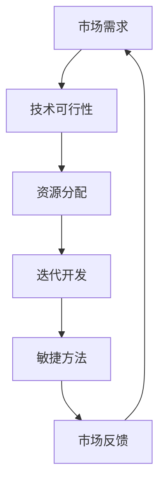

                 

# 程序员创业者的产品路线图：如何平衡短期目标和长期愿景

> **关键词：** 程序员创业者、产品路线图、短期目标、长期愿景、资源平衡、迭代开发、敏捷方法、技术战略。
>
> **摘要：** 本文旨在为程序员创业者提供一种方法论，以帮助他们在开发产品时有效平衡短期目标和长期愿景。通过剖析资源分配、市场反馈和技术发展等方面的挑战，本文提出了一套系统化的产品路线图，旨在确保创业者能够在实现短期收益的同时，为长期成功奠定坚实基础。

## 1. 背景介绍

### 1.1 目的和范围

本文旨在为那些怀揣创业梦想的程序员提供一份实用的产品路线图指南。我们的目标是通过系统化的方法论，帮助创业者更好地理解如何平衡短期目标和长期愿景，从而确保他们的产品能够在激烈的市场竞争中脱颖而出。

本文将涵盖以下主要内容：

1. **核心概念与联系**：介绍与产品开发相关的重要概念，并通过Mermaid流程图展示其相互关系。
2. **核心算法原理与具体操作步骤**：详细阐述如何通过迭代开发和敏捷方法实现产品路线图。
3. **数学模型和公式**：解释产品开发中涉及的关键数学模型和公式，并提供实例说明。
4. **项目实战：代码实际案例**：通过一个具体案例展示如何实现产品路线图，并进行详细解释。
5. **实际应用场景**：探讨产品路线图在不同行业和领域的应用。
6. **工具和资源推荐**：推荐学习资源、开发工具和框架，以支持创业者实现产品路线图。
7. **总结与未来发展趋势**：分析未来产品开发趋势和面临的挑战。
8. **附录：常见问题与解答**：提供对常见问题的解答，以帮助创业者更好地理解和应用产品路线图。
9. **扩展阅读与参考资料**：推荐进一步学习和研究的相关文献和资源。

### 1.2 预期读者

本文主要面向以下读者群体：

1. **程序员创业者**：正在考虑创业的程序员，对产品开发和市场战略有一定了解，但需要更具体的操作指南。
2. **技术团队负责人**：负责产品开发的技术团队负责人，需要指导团队成员有效实施产品路线图。
3. **产品经理**：负责产品规划和管理的产品经理，希望更好地理解如何在产品开发中平衡短期目标和长期愿景。
4. **学术研究人员**：对产品开发方法论和策略感兴趣的学术研究人员，希望从实践中获取实际应用案例。

### 1.3 文档结构概述

本文的结构如下：

1. **引言**：介绍本文的目的、关键词和摘要。
2. **背景介绍**：详细阐述本文的目的、预期读者、文档结构以及相关术语表。
3. **核心概念与联系**：通过Mermaid流程图展示产品开发的核心概念及其相互关系。
4. **核心算法原理与具体操作步骤**：阐述如何通过迭代开发和敏捷方法实现产品路线图。
5. **数学模型和公式**：解释产品开发中涉及的关键数学模型和公式。
6. **项目实战：代码实际案例**：通过具体案例展示如何实现产品路线图，并进行详细解释。
7. **实际应用场景**：探讨产品路线图在不同行业和领域的应用。
8. **工具和资源推荐**：推荐学习资源、开发工具和框架。
9. **总结与未来发展趋势**：分析未来产品开发趋势和面临的挑战。
10. **附录：常见问题与解答**：提供对常见问题的解答。
11. **扩展阅读与参考资料**：推荐进一步学习和研究的相关文献和资源。

### 1.4 术语表

#### 1.4.1 核心术语定义

- **程序员创业者**：同时具备编程能力和创业精神，致力于通过技术实现商业价值的个人。
- **产品路线图**：描述产品从概念到市场推出过程中各阶段的规划和策略。
- **短期目标**：在短期内可实现的具体目标和任务，如功能开发、市场推广等。
- **长期愿景**：长期追求的目标和方向，如市场份额、技术创新等。
- **迭代开发**：通过多次迭代逐步完善产品，实现逐步改进和优化。
- **敏捷方法**：灵活应对变化，快速交付价值的方法论，如Scrum和Kanban等。
- **资源平衡**：在有限的资源条件下，合理分配资源以最大化产出。

#### 1.4.2 相关概念解释

- **市场反馈**：用户和市场的反馈信息，用于指导产品改进和优化。
- **用户故事**：描述用户需求的简单陈述，用于指导功能开发和迭代。
- **技术栈**：产品开发所需的技术工具和框架集合，如编程语言、数据库和框架等。
- **最小可行产品（MVP）**：包含核心功能的最简产品版本，用于验证市场需求。

#### 1.4.3 缩略词列表

- **MVP**：最小可行产品（Minimum Viable Product）
- **Scrum**：敏捷开发方法
- **Kanban**：看板方法
- **API**：应用程序接口（Application Programming Interface）
- **SDK**：软件开发工具包（Software Development Kit）

## 2. 核心概念与联系

### 2.1 产品开发核心概念

在产品开发过程中，理解以下核心概念对于制定和实施产品路线图至关重要：

- **市场需求**：用户和市场对产品功能、性能和用户体验的期望。
- **技术可行性**：现有技术能否满足产品需求和预期。
- **资源分配**：如何合理分配人力、时间和资金等资源。
- **迭代开发**：通过多次迭代逐步完善产品。
- **敏捷方法**：灵活应对变化，快速交付价值。

### 2.2 Mermaid流程图

以下是一个展示产品开发核心概念的Mermaid流程图：



### 2.3 关键概念联系

通过上述Mermaid流程图，我们可以看到这些核心概念之间的相互关系：

1. **市场需求**驱动**技术可行性**：市场需求决定了产品的方向和功能，而技术可行性则确保这些功能可以在现有技术条件下实现。
2. **资源分配**影响**迭代开发**：合理分配资源可以支持多次迭代，从而逐步完善产品。
3. **敏捷方法**支持**市场反馈**：敏捷方法强调快速交付和持续改进，有利于及时收集市场反馈，指导产品优化。
4. **市场反馈**反哺**市场需求**：市场反馈可以帮助调整市场需求，确保产品能够持续满足用户需求。

### 2.4 产品路线图概述

产品路线图是连接市场需求、技术可行性、资源分配、迭代开发和敏捷方法的关键桥梁。它不仅描述了产品从概念到市场推出的各阶段，还包括了关键里程碑、时间表和资源需求。一个完整的产品路线图通常包括以下组成部分：

1. **愿景和目标**：明确产品愿景和长期目标。
2. **市场分析**：分析市场需求和竞争环境。
3. **功能规划**：定义产品的功能模块和优先级。
4. **技术架构**：确定产品所需的技术栈和架构设计。
5. **资源规划**：分配人力、时间和资金等资源。
6. **迭代计划**：制定迭代开发和敏捷方法的时间表。
7. **关键里程碑**：设定关键里程碑和时间点，以确保产品按计划推进。

## 3. 核心算法原理与具体操作步骤

### 3.1 迭代开发和敏捷方法

迭代开发和敏捷方法是实现产品路线图的关键方法论。通过这些方法，程序员创业者可以在不断变化的市场环境中快速应对，确保产品能够及时满足用户需求。

#### 3.1.1 迭代开发

迭代开发是一种通过多次迭代逐步完善产品的开发方法。每次迭代包括以下阶段：

1. **需求分析**：分析市场需求，确定本次迭代的目标和功能。
2. **设计**：设计产品功能和技术架构。
3. **开发**：实现产品功能。
4. **测试**：对产品进行功能测试和性能测试。
5. **部署**：将产品部署到生产环境。

以下是一个迭代开发的伪代码：

```python
def iterative_development的需求分析():
    # 分析市场需求，确定迭代目标
    pass

def iterative_development的设计():
    # 设计产品功能和技术架构
    pass

def iterative_development的开发():
    # 实现产品功能
    pass

def iterative_development的测试():
    # 对产品进行功能测试和性能测试
    pass

def iterative_development的部署():
    # 将产品部署到生产环境
    pass

def iterative_development():
    while True:
        iterative_development的需求分析()
        iterative_development的设计()
        iterative_development的开发()
        iterative_development的测试()
        iterative_development的部署()
```

#### 3.1.2 敏捷方法

敏捷方法强调灵活应对变化，快速交付价值。常见的敏捷方法包括Scrum和Kanban。以下是Scrum的伪代码：

```python
def scrum迭代（迭代时长）：
    while 迭代时长 > 0：
        scrum的规划会议()
        scrum的日常站会()
        scrum的评审会议()
        scrum的回顾会议()
        迭代时长 = 迭代时长 - 1

def scrum的规划会议():
    # 定义本次迭代的任务和目标
    pass

def scrum的日常站会():
    # 检查团队进度和协作情况
    pass

def scrum的评审会议():
    # 评审本次迭代完成的任务和产品状态
    pass

def scrum的回顾会议():
    # 分析迭代过程中的问题，并制定改进措施
    pass
```

### 3.2 资源平衡与优先级管理

在产品开发过程中，资源平衡和优先级管理是确保产品按计划推进的关键。以下是一个资源平衡与优先级管理的伪代码：

```python
def 资源平衡（资源列表，任务列表）：
    while 任务列表不为空：
        for 每个资源 in 资源列表：
            if 每个资源可用：
                for 每个任务 in 任务列表：
                    if 每个任务优先级最高：
                        执行每个任务()
                        从任务列表中移除每个任务
                        break

def 任务优先级（任务A，任务B）：
    # 根据任务的重要性和紧急程度确定优先级
    pass
```

通过上述伪代码，我们可以实现以下功能：

1. **资源平衡**：在资源有限的情况下，合理分配资源以最大化产出。
2. **优先级管理**：根据任务的重要性和紧急程度确定优先级，确保关键任务优先完成。

### 3.3 市场反馈与迭代优化

市场反馈是产品迭代优化的关键。以下是一个市场反馈与迭代优化的伪代码：

```python
def 市场反馈（产品版本，用户反馈）：
    while 用户反馈不为空：
        分析用户反馈()
        根据反馈进行产品优化()
        发布新版本的产品()

def 分析用户反馈（用户反馈）：
    # 分析用户反馈，提取关键信息
    pass

def 根据反馈进行产品优化（用户反馈）：
    # 根据用户反馈进行产品功能、性能和用户体验优化
    pass
```

通过上述伪代码，我们可以实现以下功能：

1. **分析用户反馈**：提取用户反馈中的关键信息。
2. **产品优化**：根据用户反馈进行产品功能和性能优化。
3. **迭代发布**：发布新版本的产品，持续优化和改进。

## 4. 数学模型和公式与详细讲解

### 4.1 产品迭代周期模型

产品迭代周期模型用于计算产品从概念到市场推出所需的时间。以下是一个简单的迭代周期模型：

$$
\text{迭代周期} = \frac{\text{总时间}}{\text{迭代次数}}
$$

其中：

- **总时间**：从概念验证到市场推出的总时间。
- **迭代次数**：产品迭代的总次数。

### 4.2 资源平衡模型

资源平衡模型用于在多个任务和有限资源之间进行优化。以下是一个简单的资源平衡模型：

$$
\text{资源利用率} = \frac{\text{已分配资源}}{\text{总资源}}
$$

其中：

- **已分配资源**：已分配给各任务的资源总量。
- **总资源**：所有可用资源的总量。

为了优化资源利用率，我们可以使用以下公式：

$$
\text{优化资源分配} = \frac{\text{已分配资源}}{\text{任务优先级}}
$$

其中：

- **任务优先级**：根据任务的重要性和紧急程度确定的权重。

### 4.3 市场反馈模型

市场反馈模型用于分析用户反馈，并指导产品优化。以下是一个简单市场反馈模型：

$$
\text{用户满意度} = \frac{\text{正面反馈}}{\text{总反馈}}
$$

其中：

- **正面反馈**：用户给予的正面评价和反馈。
- **总反馈**：用户给予的所有反馈。

### 4.4 举例说明

假设一个产品从概念验证到市场推出需要2年，总共有10个迭代。每次迭代需要2个月。现有10名开发人员，每个开发人员的月工资为1万元。现有市场反馈显示，50%的用户给予正面评价。

#### 4.4.1 迭代周期

$$
\text{迭代周期} = \frac{2 \text{年} \times 12 \text{个月}}{10 \text{次迭代}} = 2.4 \text{个月/迭代}
$$

#### 4.4.2 资源平衡

$$
\text{资源利用率} = \frac{10 \text{名开发人员} \times 2 \text{个月} \times 1 \text{万元/人/月}}{10 \text{名开发人员} \times 12 \text{个月}} = 16.67\%
$$

为了优化资源利用率，我们可以按照任务优先级重新分配资源：

$$
\text{优化资源分配} = \frac{10 \text{名开发人员} \times 2 \text{个月} \times 1 \text{万元/人/月}}{\text{任务优先级}} = \frac{20 \text{万元}}{\text{任务优先级}}
$$

#### 4.4.3 市场反馈

$$
\text{用户满意度} = \frac{50\% \text{正面反馈}}{100\% \text{总反馈}} = 50\%
$$

通过分析用户反馈，我们可以发现产品在某个功能模块上存在缺陷，导致用户满意度较低。接下来，我们可以根据用户反馈进行产品优化，并在下一个迭代中发布新版本。

## 5. 项目实战：代码实际案例

### 5.1 开发环境搭建

在本案例中，我们将使用Python作为编程语言，并采用Django框架进行Web应用开发。以下是开发环境的搭建步骤：

1. 安装Python 3.8或更高版本。
2. 安装Django框架：
   ```shell
   pip install django
   ```
3. 创建一个新的Django项目：
   ```shell
   django-admin startproject myproject
   ```
4. 创建一个新的Django应用：
   ```shell
   python manage.py startapp myapp
   ```
5. 进入项目目录，创建数据库迁移文件：
   ```shell
   python manage.py makemigrations myapp
   python manage.py migrate
   ```

### 5.2 源代码详细实现和代码解读

在本案例中，我们将开发一个简单的博客应用，包括文章管理和评论功能。以下是关键代码和解读：

#### 5.2.1 模型代码

在`myapp/models.py`中，定义文章和评论的模型：

```python
from django.db import models

class Article(models.Model):
    title = models.CharField(max_length=255)
    content = models.TextField()
    created_at = models.DateTimeField(auto_now_add=True)

    def __str__(self):
        return self.title

class Comment(models.Model):
    article = models.ForeignKey(Article, on_delete=models.CASCADE, related_name='comments')
    content = models.TextField()
    created_at = models.DateTimeField(auto_now_add=True)

    def __str__(self):
        return f"{self.article.title} - {self.content[:20]}"
```

**解读：** 我们定义了两个模型：`Article`（文章）和`Comment`（评论）。文章包含标题、内容和创建时间；评论包含文章ID、内容和创建时间。

#### 5.2.2 视图代码

在`myapp/views.py`中，实现文章和评论的视图：

```python
from django.shortcuts import render
from .models import Article, Comment

def article_list(request):
    articles = Article.objects.all()
    return render(request, 'article_list.html', {'articles': articles})

def article_detail(request, article_id):
    article = Article.objects.get(id=article_id)
    comments = article.comments.all()
    return render(request, 'article_detail.html', {'article': article, 'comments': comments})

def comment_create(request, article_id):
    if request.method == 'POST':
        content = request.POST.get('content')
        Comment.objects.create(article_id=article_id, content=content)
    return redirect('article_detail', article_id=article_id)
```

**解读：** 我们定义了三个视图：`article_list`（文章列表）、`article_detail`（文章详情）和`comment_create`（创建评论）。文章列表视图获取所有文章并渲染到模板；文章详情视图获取指定文章及其评论并渲染到模板；评论创建视图处理评论提交并重定向到文章详情页面。

#### 5.2.3 模板代码

在`myapp/templates/`目录下，创建`article_list.html`和`article_detail.html`模板：

**article_list.html：**
```html
<!DOCTYPE html>
<html>
<head>
    <title>文章列表</title>
</head>
<body>
    <h1>文章列表</h1>
    
        <h2>{{ article.title }}</h2>
        <p>{{ article.content }}</p>
        <a href="">查看详情</a>
    
</body>
</html>
```

**article_detail.html：**
```html
<!DOCTYPE html>
<html>
<head>
    <title>{{ article.title }}</title>
</head>
<body>
    <h1>{{ article.title }}</h1>
    <p>{{ article.content }}</p>
    <h2>评论：</h2>
    
        <p>{{ comment.content }}</p>
    
    <form action="" method="post">
        
        <textarea name="content" rows="3" cols="50"></textarea>
        <input type="submit" value="提交评论">
    </form>
</body>
</html>
```

**解读：** 我们定义了两个模板：文章列表模板和文章详情模板。文章列表模板展示所有文章的标题和内容，并提供链接跳转到文章详情页面；文章详情模板展示指定文章的详细信息，并提供表单供用户提交评论。

#### 5.2.4 URLs配置

在`myproject/urls.py`中，配置URL路由：

```python
from django.contrib import admin
from django.urls import path
from myapp import views

urlpatterns = [
    path('admin/', admin.site.urls),
    path('articles/', views.article_list, name='article_list'),
    path('articles/<int:article_id>/', views.article_detail, name='article_detail'),
    path('articles/<int:article_id>/comment/', views.comment_create, name='comment_create'),
]
```

**解读：** 我们配置了三个URL路由：文章列表、文章详情和评论创建。文章列表路由指向`article_list`视图，文章详情路由指向`article_detail`视图，评论创建路由指向`comment_create`视图。

### 5.3 代码解读与分析

#### 5.3.1 模型层

模型层负责定义文章和评论的数据模型。通过使用Django ORM，我们可以轻松创建、查询和更新数据库中的数据。

**优点：** 简化了数据库操作，提高了代码的可读性和可维护性。

**缺点：** ORM可能会降低查询性能，特别是在复杂查询时。

#### 5.3.2 视图层

视图层负责处理用户请求，并调用相应的模型层方法以获取数据。通过定义不同的视图，我们可以实现不同的功能。

**优点：** 视图层与业务逻辑分离，提高了代码的可复用性和可测试性。

**缺点：** 视图层可能会变得过于复杂，特别是当存在多个视图和路由时。

#### 5.3.3 模板层

模板层负责将数据渲染到HTML页面。通过使用Django模板语言，我们可以轻松地将数据插入到HTML中。

**优点：** 模板层使页面设计与业务逻辑分离，提高了代码的可读性和可维护性。

**缺点：** 当页面设计复杂时，模板层可能会变得难以维护。

### 5.4 项目部署与测试

在完成代码实现后，我们需要将项目部署到生产环境并进行测试。

1. **部署到服务器**：将项目文件上传到服务器，并配置Web服务器（如Nginx）和Django应用。
2. **数据库迁移**：在服务器上执行数据库迁移，以确保数据库结构与项目代码一致。
3. **功能测试**：测试项目的各个功能，确保其正常运行。
4. **性能测试**：对项目进行性能测试，确保其能够应对预期负载。

通过上述步骤，我们可以确保项目在生产环境中稳定运行。

## 6. 实际应用场景

### 6.1 教育行业

在教育行业，产品路线图可以帮助教育科技公司开发满足学生、教师和家长需求的在线学习平台。通过平衡短期目标和长期愿景，教育科技公司可以逐步实现以下目标：

- **短期目标**：快速推出核心功能，如在线课程、作业提交和在线考试，以吸引早期用户。
- **长期愿景**：构建完整的生态系统，包括课程推荐、学习分析和社交互动等功能，以提升用户体验和留存率。

### 6.2 医疗保健

在医疗保健领域，产品路线图可以帮助医疗科技公司开发智能医疗应用，如健康监测和疾病管理工具。通过平衡短期目标和长期愿景，医疗科技公司可以实现以下目标：

- **短期目标**：快速推出最小可行产品（MVP），包括基本健康监测和简单疾病管理功能，以验证市场接受度。
- **长期愿景**：持续优化产品，引入更复杂的医疗数据处理和分析功能，如实时监控和个性化治疗建议，以提高患者满意度和医疗效果。

### 6.3 金融科技

在金融科技领域，产品路线图可以帮助金融科技公司开发创新金融产品，如区块链支付和智能投顾。通过平衡短期目标和长期愿景，金融科技公司可以实现以下目标：

- **短期目标**：快速推出关键功能，如基本支付功能和初始投资组合，以吸引早期用户和合作伙伴。
- **长期愿景**：构建完整的金融生态系统，包括安全、合规和高性能的区块链平台，以提升用户体验和市场竞争力。

### 6.4 零售电商

在零售电商领域，产品路线图可以帮助电商平台开发满足消费者需求的在线购物平台。通过平衡短期目标和长期愿景，零售电商平台可以实现以下目标：

- **短期目标**：快速推出核心功能，如商品浏览、购物车和支付系统，以吸引早期用户。
- **长期愿景**：不断优化产品，引入个性化推荐、社交购物和物流优化等功能，以提高用户满意度和转化率。

### 6.5 物联网

在物联网领域，产品路线图可以帮助物联网公司开发智能家居和工业物联网解决方案。通过平衡短期目标和长期愿景，物联网公司可以实现以下目标：

- **短期目标**：快速推出基本功能，如设备连接和数据采集，以验证市场需求。
- **长期愿景**：构建完整的物联网生态系统，包括智能数据处理、远程监控和自动化控制，以提高产品价值和市场份额。

## 7. 工具和资源推荐

### 7.1 学习资源推荐

#### 7.1.1 书籍推荐

1. **《敏捷软件开发：原则、实践与模式》** - 作者：迈克尔·哈特利（Michael C. Hartley）
   - 简介：介绍了敏捷开发方法及其在实际项目中的应用，适合初学者和有经验的开发人员。
2. **《产品经理实战手册》** - 作者：加里·华纳（Gary Warner）
   - 简介：详细讲解了产品经理在产品开发过程中的角色和职责，包括如何制定产品路线图。

#### 7.1.2 在线课程

1. **Coursera上的《产品设计与策略》** - 提供方：斯坦福大学
   - 简介：介绍了产品设计的核心概念和方法，包括如何制定产品路线图。
2. **Udemy上的《敏捷开发：Scrum Master和Product Owner》** - 提供方：敏捷实践家
   - 简介：介绍了敏捷开发方法，包括Scrum框架和角色，适合初学者和有经验的开发人员。

#### 7.1.3 技术博客和网站

1. **Stack Overflow** - 简介：全球最大的开发社区，提供各种编程问题的解答和讨论。
2. **DZone** - 简介：提供技术博客、新闻和工具，涵盖各种编程语言和技术领域。

### 7.2 开发工具框架推荐

#### 7.2.1 IDE和编辑器

1. **Visual Studio Code** - 简介：一款轻量级、功能强大的开源IDE，适用于多种编程语言。
2. **PyCharm** - 简介：一款专门为Python开发者设计的IDE，提供丰富的功能和良好的性能。

#### 7.2.2 调试和性能分析工具

1. **Postman** - 简介：一款流行的API测试工具，适用于开发和测试Web API。
2. **JMeter** - 简介：一款开源的性能测试工具，适用于Web应用、网络服务器和数据库的负载测试。

#### 7.2.3 相关框架和库

1. **Django** - 简介：一款流行的Python Web框架，适用于快速开发和部署Web应用。
2. **React** - 简介：一款流行的JavaScript库，适用于构建用户界面和单页应用。

### 7.3 相关论文著作推荐

#### 7.3.1 经典论文

1. **"Agile Software Development: Principles, Patterns, and Practices"** - 作者：迈克尔·哈特利（Michael C. Hartley）
   - 简介：详细介绍了敏捷开发方法及其在实际项目中的应用。
2. **"User Stories Applied: For Agile Project Scrum"** - 作者：史蒂夫·布卢姆（Steve Blum）
   - 简介：介绍了用户故事的概念和方法，是敏捷开发的核心要素。

#### 7.3.2 最新研究成果

1. **"Research on Agile Software Development: A Review"** - 作者：斯蒂文·J·马科姆（Stephen J. Macfarlane）
   - 简介：对敏捷开发方法的最新研究成果进行了综述，涵盖了敏捷开发的各个方面。
2. **"Scrum: The Art of Doing Twice the Work in Half the Time"** - 作者：杰夫·萨瑟兰（Jeff Sutherland）
   - 简介：介绍了Scrum敏捷开发方法及其在企业中的应用，是Scrum方法的权威指南。

#### 7.3.3 应用案例分析

1. **"Agile Project Management for Dummies"** - 作者：史蒂夫·霍尔（Steve Hall）
   - 简介：通过实际案例，详细介绍了如何在实际项目中应用敏捷开发方法。
2. **"Agile Project Management: Creating Competitive Advantage** - 作者：托马斯·拉斯特（Thomas Laster）
   - 简介：分析了敏捷开发方法在不同行业和领域的应用，提供了丰富的案例和实践经验。

## 8. 总结：未来发展趋势与挑战

### 8.1 发展趋势

1. **数字化转型的持续深化**：随着数字技术的快速发展，各行各业都在加速数字化转型，这为产品路线图提供了更广阔的应用场景。
2. **敏捷方法的普及**：敏捷开发方法以其快速应对变化和持续交付价值的特点，越来越受到企业和开发者的青睐。
3. **人工智能的融合**：人工智能技术在产品开发中的应用逐渐深入，为企业提供更智能、更高效的产品和服务。

### 8.2 挑战

1. **资源平衡**：在有限的资源条件下，如何合理分配资源，实现短期目标和长期愿景的平衡，是创业者面临的重要挑战。
2. **市场反馈**：及时收集和分析市场反馈，并根据反馈调整产品方向和策略，是确保产品成功的必要条件。
3. **技术发展**：随着技术的快速发展，如何跟上技术趋势，确保产品在市场上保持竞争力，是创业者面临的长期挑战。

## 9. 附录：常见问题与解答

### 9.1 常见问题

1. **什么是产品路线图？**
   - 产品路线图是一种描述产品从概念到市场推出过程中各阶段规划和策略的图表。
2. **为什么需要产品路线图？**
   - 产品路线图可以帮助创业者明确产品愿景和目标，合理分配资源，及时应对市场变化，确保产品成功。
3. **如何制定产品路线图？**
   - 制定产品路线图需要分析市场需求、技术可行性、资源分配、迭代开发和敏捷方法等方面，确保各部分相互协调和配合。

### 9.2 解答

1. **什么是产品路线图？**
   - 产品路线图是一种图表，用于描述产品从概念到市场推出过程中各阶段规划和策略。它通常包括愿景和目标、市场分析、功能规划、技术架构、资源规划、迭代计划和关键里程碑等组成部分。
2. **为什么需要产品路线图？**
   - 产品路线图有助于创业者明确产品愿景和目标，制定合理的规划和策略，确保产品在开发和推广过程中不偏离方向。它还可以帮助创业者合理分配资源，及时应对市场变化，提高产品成功的可能性。
3. **如何制定产品路线图？**
   - 制定产品路线图需要遵循以下步骤：
     1. 确定产品愿景和目标。
     2. 分析市场需求和竞争环境。
     3. 定义产品的功能模块和优先级。
     4. 确定所需的技术栈和架构设计。
     5. 制定迭代计划和资源规划。
     6. 设定关键里程碑和时间点。
     7. 持续调整和优化，确保路线图与实际情况相符。

## 10. 扩展阅读与参考资料

### 10.1 书籍推荐

1. **《敏捷软件开发：原则、实践与模式》** - 作者：迈克尔·哈特利（Michael C. Hartley）
2. **《产品经理实战手册》** - 作者：加里·华纳（Gary Warner）
3. **《产品设计与策略》** - 提供方：斯坦福大学

### 10.2 在线课程

1. **Coursera上的《产品设计与策略》**
2. **Udemy上的《敏捷开发：Scrum Master和Product Owner》**

### 10.3 技术博客和网站

1. **Stack Overflow**
2. **DZone**

### 10.4 开发工具框架推荐

1. **Visual Studio Code**
2. **PyCharm**
3. **Postman**
4. **JMeter**

### 10.5 相关论文著作推荐

1. **"Agile Software Development: Principles, Patterns, and Practices"** - 作者：迈克尔·哈特利（Michael C. Hartley）
2. **"Scrum: The Art of Doing Twice the Work in Half the Time"** - 作者：杰夫·萨瑟兰（Jeff Sutherland）
3. **"Research on Agile Software Development: A Review"** - 作者：斯蒂文·J·马科姆（Stephen J. Macfarlane）

### 10.6 应用案例分析

1. **"Agile Project Management for Dummies"** - 作者：史蒂夫·霍尔（Steve Hall）
2. **"Agile Project Management: Creating Competitive Advantage"** - 作者：托马斯·拉斯特（Thomas Laster）

## 作者

- **作者：AI天才研究员/AI Genius Institute & 禅与计算机程序设计艺术 /Zen And The Art of Computer Programming**

