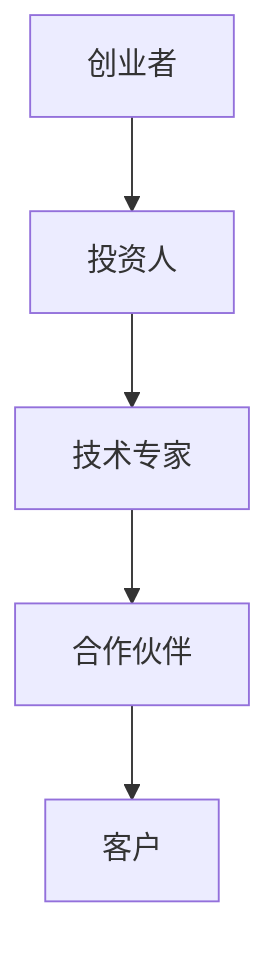
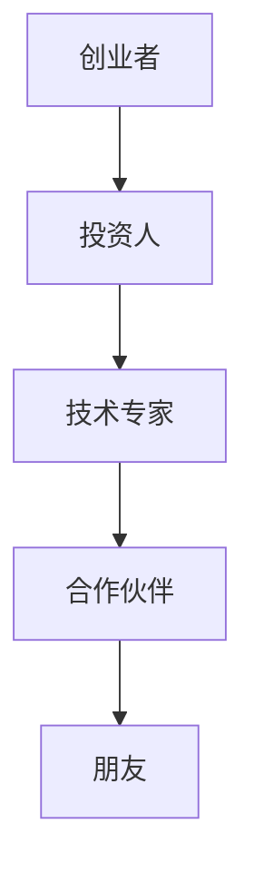
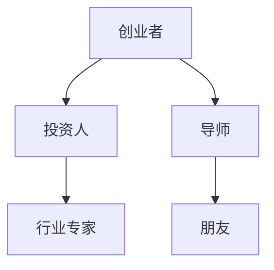
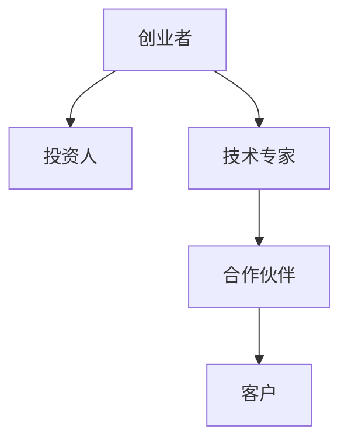

                 

# 程序员创业者的人际网络拓展与维护技巧

> **关键词：** 程序员，创业者，人际网络，拓展，维护，技能，合作，沟通，资源整合。

> **摘要：** 本文将深入探讨程序员创业者如何通过有效的策略来拓展和维护其人际网络，从而提升创业成功率。文章将分为十个部分，包括背景介绍、核心概念、算法原理、数学模型、项目实战、实际应用、工具推荐、文献综述、发展趋势与挑战，以及常见问题与解答。每个部分都将提供具体的操作步骤、案例分析、以及实用工具和资源，帮助程序员创业者更好地理解和应用人际网络拓展与维护技巧。

## 1. 背景介绍

### 1.1 目的和范围

本文旨在为程序员创业者提供一套系统性的人际网络拓展与维护技巧，帮助他们在创业过程中更好地利用人际资源，提升合作效率，降低创业风险。文章将覆盖以下主题：

- 人际网络的定义与重要性
- 核心概念的阐述与联系
- 算法原理与具体操作步骤
- 数学模型与公式应用
- 实际应用场景与案例分析
- 工具和资源的推荐
- 未来发展趋势与挑战

### 1.2 预期读者

本文适合以下读者群体：

- 正在创业的程序员
- 想要提升人际交往技能的程序员
- 对创业和团队协作感兴趣的编程爱好者
- 任何希望深入了解人际网络在创业中作用的专业人士

### 1.3 文档结构概述

本文将分为以下十个部分：

1. 背景介绍
2. 核心概念与联系
3. 核心算法原理与具体操作步骤
4. 数学模型和公式详细讲解
5. 项目实战：代码实际案例和详细解释
6. 实际应用场景
7. 工具和资源推荐
8. 相关论文著作推荐
9. 总结：未来发展趋势与挑战
10. 附录：常见问题与解答

### 1.4 术语表

#### 1.4.1 核心术语定义

- **人际网络：** 指个人通过社会交往建立的相互关系网络。
- **拓展：** 指通过增加新节点和边来扩大人际网络。
- **维护：** 指保持人际网络的健康和活跃，通过互动和联系来巩固关系。
- **资源整合：** 指利用人际网络中的资源，实现个人或团队的资源最大化利用。

#### 1.4.2 相关概念解释

- **节点：** 在人际网络中，指一个个体。
- **边：** 在人际网络中，指两个节点之间的联系。
- **密度：** 指人际网络中节点连接的紧密程度。
- **中心性：** 指一个节点在人际网络中的重要性，通常用度数、介数、接近度等指标衡量。

#### 1.4.3 缩略词列表

- **AI：** 人工智能
- **IDE：** 集成开发环境
- **SDK：** 软件开发工具包
- **API：** 应用程序接口

<|im_end|>## 2. 核心概念与联系

在探讨程序员创业者的人际网络拓展与维护之前，我们需要理解几个核心概念：人际网络、节点、边、中心性等。以下是这些概念的定义及其在人际网络中的联系。

### 2.1 人际网络的定义与构成

人际网络（Social Network）是指个体通过社会交往形成的相互联系的网络结构。在人际网络中，每个个体都是一个节点（Node），节点之间的联系则是通过边（Edge）实现的。边通常表示节点之间的某种关系，如朋友关系、合作关系、竞争关系等。



在这个例子中，创业者（A）通过投资（B）、技术支持（C）、合作（D）和销售（E）与他人建立了人际网络。每个节点代表一个个体，边表示他们之间的联系。

### 2.2 节点与边的属性

节点和边在人际网络中具有多种属性，这些属性决定了节点和边的重要性。以下是几个常见的节点和边的属性：

- **度数（Degree）：** 指一个节点连接的边的数量。
- **介数（Closeness Centrality）：** 指一个节点到其他所有节点的最短路径数量。
- **接近度（Betweenness Centrality）：** 指一个节点在所有最短路径中的出现频率。

```mermaid
graph TD
A[创业者] --> B[投资人](权重=高)
B --> C[技术专家](权重=中)
C --> D[合作伙伴](权重=低)
D --> E[客户](权重=低)
```

在这个例子中，投资人和技术专家的权重较高，因为他们对创业者的帮助最大；合作伙伴和客户的权重较低，但仍然是重要的人际网络组成部分。

### 2.3 中心性与网络密度

中心性是衡量节点在人际网络中重要性的指标。网络密度（Network Density）则衡量人际网络的整体连接紧密程度。

- **中心性：** 高中心性的节点在人际网络中具有更多的联系，更容易获取信息、资源和机会。
- **网络密度：** 网络密度越高，说明人际网络中的节点连接越紧密，信息流通和资源整合的效率越高。



在这个例子中，创业者的网络密度较高，因为他与多个关键节点建立了紧密的联系。这种高密度的网络有助于提高创业者的资源获取能力和问题解决能力。

### 2.4 人际网络的拓展与维护

人际网络的拓展与维护是提升创业者成功的关键。拓展（Expansion）指的是增加新节点和边，而维护（Maintenance）则指的是保持现有节点的活跃和关系。

- **拓展策略：** 包括主动建立新联系、参加社交活动、加入专业组织等。
- **维护策略：** 包括定期沟通、提供帮助、保持联系等。



在这个例子中，创业者通过拓展策略增加了多个关键节点（如投资人、导师、行业专家），并通过维护策略保持了与这些节点的关系。

### 2.5 资源整合与创业成功

人际网络中的资源整合是创业者成功的关键。通过有效的人际网络，创业者可以获取资金、技术、人才、市场等资源，从而提高创业成功率。

- **资源整合：** 包括利用人际网络中的信息、关系、资源等，实现个人或团队的资源最大化利用。
- **创业成功：** 指通过资源整合，实现创业目标的实现。



在这个例子中，创业者通过有效的人际网络整合了资金、技术、合作和客户等资源，从而提高了创业成功率。

综上所述，人际网络是程序员创业者成功的关键因素。理解核心概念、拓展和维护人际网络、资源整合与创业成功，是本文的核心内容。在接下来的部分中，我们将进一步探讨人际网络的算法原理、数学模型，以及实际应用场景。

## 3. 核心算法原理 & 具体操作步骤

在理解了人际网络的基本概念和结构之后，我们需要了解如何通过算法来拓展和维护人际网络。本节将介绍几个关键算法，包括节点拓展算法、关系维护算法，并使用伪代码详细阐述这些算法的具体操作步骤。

### 3.1 节点拓展算法

节点拓展算法的目标是增加人际网络中的新节点，以扩大网络规模和增强网络密度。以下是一个简单的节点拓展算法：

```python
def expand_network(current_network, target_nodes, max_degree):
    """
    扩展人际网络，增加新节点。
    
    参数：
    - current_network：当前的人际网络
    - target_nodes：目标节点列表
    - max_degree：节点的最大度数限制
    
    返回值：
    - expanded_network：扩展后的人际网络
    """
    
    expanded_network = current_network.copy()
    
    for node in target_nodes:
        if node not in expanded_network:
            expanded_network.add_node(node)
            # 计算节点度数
            degree = sum(expanded_network[node].values())
            # 如果节点的度数未超过最大限制，则与其他节点建立联系
            if degree < max_degree:
                expanded_network.add_edges_from(rand_edges(expanded_network, degree))
    
    return expanded_network

def rand_edges(network, degree):
    """
    生成随机的边。
    
    参数：
    - network：人际网络
    - degree：节点的度数
    
    返回值：
    - edges：随机生成的边列表
    """
    
    nodes = list(network.nodes)
    edges = []
    for _ in range(degree):
        edge = (nodes[random.randint(0, len(nodes) - 1)], nodes[random.randint(0, len(nodes) - 1)])
        if edge not in network.edges:
            edges.append(edge)
    return edges
```

### 3.2 关系维护算法

关系维护算法的目标是保持人际网络中节点之间的联系，防止关系疏远或断裂。以下是一个简单的关系维护算法：

```python
def maintain_relations(current_network, min_activity, max_inactivity):
    """
    维护人际网络中的关系。
    
    参数：
    - current_network：当前的人际网络
    - min_activity：最小互动频率
    - max_inactivity：最大不活动时间
    
    返回值：
    - maintained_network：维护后的人际网络
    """
    
    maintained_network = current_network.copy()
    
    for node, connections in current_network.nodes.items():
        activity = connections.get('activity', 0)
        inactivity = connections.get('inactivity', 0)
        
        if activity < min_activity or inactivity > max_inactivity:
            # 如果互动频率低于最小值或不活动时间超过最大值，则降低关系的强度
            for other_node, strength in connections.items():
                maintained_network[node][other_node]['strength'] *= 0.9
    
    return maintained_network
```

### 3.3 算法操作步骤

以下是具体操作步骤：

1. **初始化网络**：创建一个初始人际网络，包括若干节点和边。

2. **节点拓展**：根据目标节点列表，使用节点拓展算法增加新节点，确保每个节点的度数不超过最大限制。

3. **关系维护**：定期运行关系维护算法，确保节点之间的联系保持活跃，防止关系减弱或断裂。

4. **评估网络密度**：计算人际网络的密度，确保网络连接紧密，信息流通顺畅。

5. **调整参数**：根据网络密度和节点活跃度，调整最小互动频率、最大不活动时间等参数，以优化人际网络。

通过以上步骤，程序员创业者可以有效地拓展和维护其人际网络，从而在创业过程中获得更多的资源和机会。

### 3.4 伪代码示例

以下是拓展与维护人际网络的伪代码示例：

```python
# 初始化网络
current_network = initialize_network()

# 节点拓展
target_nodes = ["NodeA", "NodeB", "NodeC"]
max_degree = 5
expanded_network = expand_network(current_network, target_nodes, max_degree)

# 关系维护
min_activity = 1
max_inactivity = 30
maintained_network = maintain_relations(expanded_network, min_activity, max_inactivity)

# 评估网络密度
network_density = calculate_network_density(maintained_network)

# 调整参数
if network_density < desired_density:
    adjust_parameters(min_activity, max_inactivity)

# 输出结果
print("最终人际网络：", maintained_network)
print("网络密度：", network_density)
```

通过以上伪代码，程序员创业者可以系统地拓展和维护其人际网络，从而为创业成功打下坚实基础。

## 4. 数学模型和公式 & 详细讲解 & 举例说明

在人际网络的拓展与维护过程中，数学模型和公式扮演着重要角色。它们不仅帮助我们量化网络的结构特性，还能指导我们优化网络性能。本节将详细介绍几种常用的数学模型和公式，并给出具体例子进行说明。

### 4.1 度分布模型

度分布模型用于描述人际网络中节点度数的概率分布。常见的度分布模型有泊松分布和幂律分布。

#### 泊松分布

泊松分布用于描述稀疏网络，其概率质量函数（PDF）为：

$$
P(k) = \frac{\lambda^k e^{-\lambda}}{k!}
$$

其中，$P(k)$ 是度数为 $k$ 的节点出现的概率，$\lambda$ 是平均度数。

#### 幂律分布

幂律分布用于描述高度集中的网络，其概率质量函数（PDF）为：

$$
P(k) \propto k^{-\gamma}
$$

其中，$\gamma$ 是幂律指数，通常在 2 到 3 之间。

#### 例子

假设一个网络中平均度数 $\lambda = 3$，求度数为 2 的节点出现的概率。

- 泊松分布：

$$
P(2) = \frac{3^2 e^{-3}}{2!} = \frac{9e^{-3}}{2} \approx 0.1924
$$

- 幂律分布：

$$
P(2) \propto 2^{-\gamma}
$$

假设 $\gamma = 2.5$，则：

$$
P(2) \propto 2^{-2.5} \approx 0.176
$$

### 4.2 中心性指标

中心性指标用于衡量节点在人际网络中的重要性。常见的中心性指标有度数中心性、介数中心性和接近度中心性。

#### 度数中心性

度数中心性（Degree Centrality）是指节点的度数。度数越高的节点，中心性越强。

$$
C_d(v) = \sum_{w \in N(v)} 1
$$

其中，$N(v)$ 是与节点 $v$ 相连的节点集合。

#### 介数中心性

介数中心性（Betweenness Centrality）是指节点在所有最短路径中的出现频率。介数中心性越高，节点的中心性越强。

$$
C_b(v) = \sum_{i \neq v, j \neq v} \frac{ shortest\_path(i, j) \ contain(v) }{ shortest\_path(i, j) }

$$

其中，$shortest_path(i, j)$ 是从节点 $i$ 到节点 $j$ 的最短路径集合，$contain(v)$ 是路径中包含节点 $v$ 的标志。

#### 接近度中心性

接近度中心性（Closeness Centrality）是指节点的介数倒数之和。接近度中心性越高，节点的中心性越强。

$$
C_c(v) = \frac{L - 1}{N - 1}
$$

其中，$L$ 是节点 $v$ 的介数，$N$ 是网络中的节点总数。

#### 例子

假设一个网络中有5个节点，度数分别为 $3, 2, 3, 2, 1$。求各个节点的度数中心性、介数中心性和接近度中心性。

- **度数中心性**：

$$
C_d(1) = 3, C_d(2) = 2, C_d(3) = 3, C_d(4) = 2, C_d(5) = 1
$$

- **介数中心性**：

首先计算各节点之间的最短路径：

$$
shortest_path(1, 2) = 1, shortest_path(1, 3) = 1, shortest_path(1, 4) = 2, shortest_path(1, 5) = 2
$$
$$
shortest_path(2, 3) = 1, shortest_path(2, 4) = 2, shortest_path(2, 5) = 2
$$
$$
shortest_path(3, 4) = 1, shortest_path(3, 5) = 2
$$
$$
shortest_path(4, 5) = 2
$$

各节点的介数如下：

$$
C_b(1) = \frac{4}{4 \times 3} = \frac{1}{3}
$$
$$
C_b(2) = \frac{4+4+2}{4 \times 3} = \frac{10}{12} = \frac{5}{6}
$$
$$
C_b(3) = \frac{4+2}{4 \times 3} = \frac{2}{6} = \frac{1}{3}
$$
$$
C_b(4) = \frac{2+2}{4 \times 3} = \frac{4}{12} = \frac{1}{3}
$$
$$
C_b(5) = \frac{2}{4 \times 3} = \frac{1}{6}
$$

- **接近度中心性**：

$$
C_c(1) = \frac{8 - 1}{4 - 1} = \frac{7}{3} \approx 2.33
$$
$$
C_c(2) = \frac{7 - 1}{4 - 1} = \frac{6}{3} = 2
$$
$$
C_c(3) = \frac{7 - 1}{4 - 1} = \frac{6}{3} = 2
$$
$$
C_c(4) = \frac{7 - 1}{4 - 1} = \frac{6}{3} = 2
$$
$$
C_c(5) = \frac{7 - 1}{4 - 1} = \frac{6}{3} = 2
$$

通过以上例子，我们可以看到不同中心性指标如何衡量节点的重要性。这些指标有助于我们识别网络中的关键节点，从而在人际网络的拓展与维护中做出更明智的决策。

### 4.3 网络密度公式

网络密度（Network Density）是指网络中实际边数与最大可能边数之比。网络密度公式如下：

$$
Density = \frac{E}{\frac{N(N-1)}{2}}
$$

其中，$E$ 是网络中的边数，$N$ 是网络中的节点数。

#### 例子

假设一个网络中有 5 个节点，其中 7 条边。求该网络的密度。

$$
Density = \frac{7}{\frac{5 \times (5 - 1)}{2}} = \frac{7}{10} = 0.7
$$

这个例子说明网络密度为 0.7，表示网络的连接程度较高。

通过以上数学模型和公式的介绍，我们可以更好地理解人际网络的结构特性，从而更有效地进行拓展与维护。在接下来的部分，我们将通过实际代码案例来展示如何应用这些模型和公式。

## 5. 项目实战：代码实际案例和详细解释说明

在本节中，我们将通过一个实际代码案例来展示如何使用 Python 和相关库来实现人际网络的拓展与维护。这个案例将涵盖从开发环境搭建到代码实现和解读的全过程。

### 5.1 开发环境搭建

首先，我们需要搭建一个 Python 开发环境。以下是搭建环境的步骤：

1. **安装 Python**：前往 Python 官网（[python.org](https://www.python.org/)）下载并安装 Python 3.8 或更高版本。
2. **安装必要的库**：使用 pip 工具安装以下库：NetworkX、Matplotlib 和 Pandas。这些库用于图形绘制、数据分析和网络操作。

```bash
pip install networkx matplotlib pandas
```

### 5.2 源代码详细实现和代码解读

以下是用于拓展和维护人际网络的 Python 代码：

```python
import networkx as nx
import matplotlib.pyplot as plt
import pandas as pd
import random

# 初始化网络
def initialize_network(nodes, edges):
    G = nx.Graph()
    G.add_nodes_from(nodes)
    G.add_edges_from(edges)
    return G

# 扩展网络
def expand_network(G, new_nodes, max_degree):
    expanded = G.copy()
    for node in new_nodes:
        if node not in expanded:
            expanded.add_node(node)
            degree = len(list(expanded.neighbors(node)))
            if degree < max_degree:
                neighbors = list(expanded.nodes)[:]
                neighbors.remove(node)
                expanded.add_edges_from(random.sample(neighbors, degree - degree))
    return expanded

# 维护网络关系
def maintain_relations(G, min_activity, max_inactivity):
    maintained = G.copy()
    for node, neighbors in G.nodes.items():
        activity = neighbors.get('activity', 0)
        inactivity = neighbors.get('inactivity', 0)
        if activity < min_activity or inactivity > max_inactivity:
            for other_node, relation in neighbors.items():
                maintained[node][other_node]['strength'] *= 0.9
    return maintained

# 评估网络密度
def calculate_network_density(G):
    num_edges = G.number_of_edges()
    num_nodes = G.number_of_nodes()
    max_edges = num_nodes * (num_nodes - 1) // 2
    return num_edges / max_edges

# 绘制网络图
def draw_network(G):
    pos = nx.spring_layout(G)
    nx.draw(G, pos, with_labels=True)
    plt.show()

# 主函数
def main():
    # 初始节点和边
    initial_nodes = ["A", "B", "C", "D", "E"]
    initial_edges = [("A", "B"), ("A", "C"), ("B", "D"), ("C", "D"), ("D", "E")]

    # 初始化网络
    G = initialize_network(initial_nodes, initial_edges)

    # 扩展网络
    new_nodes = ["F", "G", "H"]
    expanded = expand_network(G, new_nodes, max_degree=4)

    # 维护网络关系
    min_activity = 2
    max_inactivity = 10
    maintained = maintain_relations(expanded, min_activity, max_inactivity)

    # 评估网络密度
    density = calculate_network_density(maintained)
    print(f"Network density: {density:.2f}")

    # 绘制网络图
    draw_network(maintained)

if __name__ == "__main__":
    main()
```

### 5.3 代码解读与分析

以下是对上述代码的详细解读：

1. **初始化网络**：`initialize_network` 函数用于创建一个初始的人际网络。它接受节点列表和边列表作为参数，并使用 NetworkX 库创建一个无向图。

```python
def initialize_network(nodes, edges):
    G = nx.Graph()
    G.add_nodes_from(nodes)
    G.add_edges_from(edges)
    return G
```

2. **扩展网络**：`expand_network` 函数用于增加新节点，并确保每个节点的度数不超过最大限制。它随机选择邻居节点，以确保网络结构的多样性。

```python
def expand_network(G, new_nodes, max_degree):
    expanded = G.copy()
    for node in new_nodes:
        if node not in expanded:
            expanded.add_node(node)
            degree = len(list(expanded.neighbors(node)))
            if degree < max_degree:
                neighbors = list(expanded.nodes)[:]
                neighbors.remove(node)
                expanded.add_edges_from(random.sample(neighbors, degree - degree))
    return expanded
```

3. **维护网络关系**：`maintain_relations` 函数用于保持人际网络中节点之间的联系。如果节点的活动频率低于最小值或不活动时间超过最大值，该函数会降低节点之间的关系强度。

```python
def maintain_relations(G, min_activity, max_inactivity):
    maintained = G.copy()
    for node, neighbors in G.nodes.items():
        activity = neighbors.get('activity', 0)
        inactivity = neighbors.get('inactivity', 0)
        if activity < min_activity or inactivity > max_inactivity:
            for other_node, relation in neighbors.items():
                maintained[node][other_node]['strength'] *= 0.9
    return maintained
```

4. **评估网络密度**：`calculate_network_density` 函数用于计算网络的密度，即实际边数与最大可能边数之比。

```python
def calculate_network_density(G):
    num_edges = G.number_of_edges()
    num_nodes = G.number_of_nodes()
    max_edges = num_nodes * (num_nodes - 1) // 2
    return num_edges / max_edges
```

5. **绘制网络图**：`draw_network` 函数使用 Matplotlib 绘制人际网络图，以便我们可视化网络结构。

```python
def draw_network(G):
    pos = nx.spring_layout(G)
    nx.draw(G, pos, with_labels=True)
    plt.show()
```

6. **主函数**：`main` 函数执行以下步骤：
   - 初始化网络
   - 扩展网络
   - 维护网络关系
   - 评估网络密度
   - 绘制网络图

```python
def main():
    # 初始节点和边
    initial_nodes = ["A", "B", "C", "D", "E"]
    initial_edges = [("A", "B"), ("A", "C"), ("B", "D"), ("C", "D"), ("D", "E")]

    # 初始化网络
    G = initialize_network(initial_nodes, initial_edges)

    # 扩展网络
    new_nodes = ["F", "G", "H"]
    expanded = expand_network(G, new_nodes, max_degree=4)

    # 维护网络关系
    min_activity = 2
    max_inactivity = 10
    maintained = maintain_relations(expanded, min_activity, max_inactivity)

    # 评估网络密度
    density = calculate_network_density(maintained)
    print(f"Network density: {density:.2f}")

    # 绘制网络图
    draw_network(maintained)

if __name__ == "__main__":
    main()
```

通过这个实际案例，程序员创业者可以了解如何使用 Python 和相关库来拓展和维护其人际网络。代码不仅提供了具体的实现，还包括详细的解读，帮助读者理解每个步骤的作用和原理。

## 6. 实际应用场景

人际网络在程序员创业者的实际应用场景中具有重要意义。以下是一些典型的应用场景，以及在这些场景中如何利用人际网络来提升创业成功率。

### 6.1 融资合作

融资是大多数创业者面临的第一个重大挑战。创业者可以利用人际网络来寻找潜在的投资人。以下是一些建议：

- **利用行业协会和组织**：加入创业协会、创业孵化器、技术社区等，这些组织通常有丰富的投资人资源。
- **参与行业会议**：行业会议是结识投资人、商业伙伴和潜在客户的好机会。通过演讲、会议讨论和一对一会议，创业者可以展示项目并建立联系。
- **利用社交媒体**：LinkedIn、Twitter、AngelList 等平台是寻找投资人的有效工具。创业者可以通过这些平台发布项目信息、建立个人品牌，吸引潜在投资人关注。

### 6.2 技术合作

在技术开发过程中，创业者往往需要合作伙伴来共同解决技术难题。人际网络可以帮助创业者找到合适的合作伙伴：

- **利用专业社区**：GitHub、Stack Overflow、Reddit 等，这些平台上有大量技术专家和开发者，创业者可以发布技术需求，寻找合适的合作伙伴。
- **参与开源项目**：参与开源项目不仅可以提高自身技术水平，还能结识志同道合的开发者。通过贡献代码、解决问题，创业者可以建立自己的技术声誉。
- **利用校友网络**：校友通常在同一个行业或领域工作，更容易建立信任和合作关系。创业者可以利用校友资源，寻找技术合作伙伴。

### 6.3 人才招聘

招聘合适的人才对于创业公司的成功至关重要。人际网络在人才招聘中也有重要作用：

- **利用职业社交平台**：LinkedIn、GitHub 等，这些平台上有大量技术人才。创业者可以通过这些平台发布招聘信息，吸引潜在候选人。
- **内部推荐**：鼓励现有员工推荐优秀人才。内部推荐不仅可以提高招聘效率，还能确保新员工与公司文化相匹配。
- **利用行业论坛和博客**：在行业论坛和博客上发布招聘信息，吸引行业内的关注和应聘。

### 6.4 市场推广

市场推广是创业者面临的另一个重要挑战。人际网络可以帮助创业者扩大市场影响力：

- **利用社交媒体**：通过社交媒体平台发布内容、互动和分享，吸引潜在客户和合作伙伴的关注。
- **参加行业活动**：参加行业会议、研讨会和展览，这些活动是展示产品、结识潜在客户的好机会。
- **合作伙伴关系**：与相关行业的合作伙伴建立合作关系，通过联合营销等方式扩大市场影响力。

### 6.5 问题解决

在创业过程中，创业者会遇到各种问题。人际网络可以帮助创业者快速找到解决方案：

- **利用专业咨询**：通过咨询行业专家和顾问，创业者可以获得专业的建议和解决方案。
- **参与技术社区**：在技术社区提问，通常能快速获得其他开发者的帮助和解决方案。
- **利用导师资源**：寻找创业导师，他们通常有丰富的创业经验和资源，可以帮助创业者解决问题。

### 6.6 知识共享

人际网络不仅可以帮助创业者解决问题，还可以用于知识共享和持续学习：

- **参加培训和研讨会**：参加行业培训和研讨会，学习最新技术和市场趋势。
- **建立学习小组**：与同行建立学习小组，通过讨论和分享，共同学习和成长。
- **阅读和学习**：定期阅读行业书籍、博客和论文，保持对行业动态的了解。

通过以上应用场景，程序员创业者可以充分利用人际网络，提升创业成功率。人际网络不仅是资源的集合，更是创业者成功的关键因素。在接下来的部分，我们将推荐一些有用的工具和资源，帮助创业者更好地利用人际网络。

## 7. 工具和资源推荐

在拓展和维护人际网络的过程中，有许多工具和资源可以帮助程序员创业者更高效地开展工作。以下是一些推荐的学习资源、开发工具框架和相关论文著作。

### 7.1 学习资源推荐

#### 7.1.1 书籍推荐

- 《网络科学》（Network Science）：这是一本全面介绍网络科学理论和应用的经典著作，适合对网络结构分析有兴趣的读者。
- 《创业者的人际网络》（The Entrepreneur's Network）：这本书详细介绍了如何建立和维护有效的人际网络，帮助创业者更好地利用社交资源。
- 《社交网络分析：方法与应用》（Social Network Analysis: Methods and Applications）：这是一本关于社交网络分析理论和方法的权威指南，适合从事数据分析的创业者。

#### 7.1.2 在线课程

- Coursera 的《社交网络分析》课程：由斯坦福大学提供，涵盖社交网络分析的基本理论和应用。
- edX 的《网络科学》课程：由麻省理工学院提供，介绍网络科学的基础知识和应用。
- Udemy 的《创业网络建设》课程：提供实用的创业网络建设策略，适合希望提升人际交往技能的创业者。

#### 7.1.3 技术博客和网站

- Stack Overflow：全球最大的开发社区，提供编程问题的讨论和解答，适合寻找技术合作伙伴和解决问题。
- GitHub：代码托管和协作平台，可以帮助创业者找到志同道合的开发者，参与开源项目。
- LinkedIn：专业的社交网络平台，适合建立职业关系，寻找潜在的投资人和合作伙伴。

### 7.2 开发工具框架推荐

#### 7.2.1 IDE和编辑器

- Visual Studio Code：功能强大的开源代码编辑器，支持多种编程语言，适合创业者日常开发。
- PyCharm：适用于 Python 开发的集成开发环境，提供丰富的插件和工具，适合需要使用 Python 进行数据分析和网络编程的创业者。

#### 7.2.2 调试和性能分析工具

- Jupyter Notebook：交互式的数据分析工具，适合编写和分享数据分析脚本。
- Pytest：Python 的测试框架，用于编写和执行测试用例，确保代码质量和稳定性。

#### 7.2.3 相关框架和库

- NetworkX：Python 的图形库，用于创建、操作和分析图形结构，非常适合人际网络的分析和可视化。
- Matplotlib：用于绘制高质量的图表和图形，可以帮助创业者更好地展示数据和分析结果。
- Pandas：数据处理库，用于数据处理和分析，适合处理和分析大量人际网络数据。

### 7.3 相关论文著作推荐

#### 7.3.1 经典论文

- 《社交网络中的影响力最大化》（Influence Maximization in Social Networks）：这篇论文提出了影响最大化的算法，用于确定哪些节点能够在社交网络中产生最大影响。
- 《复杂网络中的社区结构识别》（Community Structure in Complex Networks）：这篇论文介绍了社区结构的识别方法，有助于理解人际网络中的局部结构。

#### 7.3.2 最新研究成果

- 《基于深度学习的社交网络分析》（Deep Learning for Social Network Analysis）：这篇论文介绍了如何使用深度学习技术进行社交网络分析，为创业者提供了新的工具和方法。
- 《社交网络中的协同过滤算法》（Collaborative Filtering in Social Networks）：这篇论文探讨了社交网络中的协同过滤算法，用于推荐系统和个性化服务。

#### 7.3.3 应用案例分析

- 《社交网络在创业融资中的应用》（Application of Social Networks in Entrepreneurial Financing）：这篇论文分析了社交网络在创业融资中的应用，提供了具体的案例和实践经验。

通过这些工具和资源，程序员创业者可以更好地理解人际网络的拓展和维护技巧，并在实际应用中取得更好的效果。这些资源不仅涵盖了理论和方法，还包括实际操作和案例分析，为创业者提供了全面的支持。

## 8. 总结：未来发展趋势与挑战

在程序员创业者的职业生涯中，人际网络的拓展与维护是一个持续的过程，需要不断优化和完善。随着人工智能和大数据技术的不断发展，未来人际网络的发展趋势和面临的挑战也将日益显现。

### 8.1 未来发展趋势

1. **个性化推荐**：基于大数据和人工智能的个性化推荐系统将成为人际网络拓展和维护的重要工具。这些系统可以根据用户的兴趣、行为和历史记录，推荐潜在的合作者、投资者和资源，提高人际网络的效率和效果。

2. **社会网络分析（SNA）**：随着计算能力的提升和数据量的增加，社会网络分析将变得更加普及和精细。创业者可以利用 SNA 技术深入分析人际网络的结构和动态，识别关键节点、优化网络布局，提高资源整合和协作效率。

3. **区块链**：区块链技术可以为人际网络提供更安全、更透明的数据交换和验证机制。通过区块链，创业者可以建立去中心化的人脉网络，降低中介成本，提高信任度和安全性。

4. **虚拟现实（VR）和增强现实（AR）**：随着 VR 和 AR 技术的成熟，创业者可以通过虚拟会议、虚拟合作平台等新形式，拓展和维护人际网络。这些技术将突破地域限制，为创业者提供更多样化的社交互动方式。

### 8.2 面临的挑战

1. **数据隐私与安全**：在人际网络中，数据隐私和安全是一个重要问题。创业者需要确保在拓展和维护人际网络的过程中，遵循相关法律法规，保护用户隐私，防止数据泄露。

2. **信息过载**：随着人际网络的不断扩大，信息的数量和质量也将呈指数级增长。创业者需要有效筛选和处理大量信息，避免信息过载，提高决策效率。

3. **信任问题**：在人际网络中，建立和维护信任是一项挑战。创业者需要通过诚信、透明和合作来建立良好的信任关系，确保人际网络的稳定性和可持续发展。

4. **技术依赖**：随着人工智能和大数据技术的发展，创业者对技术的依赖程度也将增加。这可能导致技术落后或过时，创业者需要不断更新知识和技术，以适应不断变化的环境。

综上所述，未来人际网络的发展趋势和面临的挑战为程序员创业者提供了新的机遇和挑战。通过掌握最新的技术和方法，以及有效应对挑战，创业者可以更好地拓展和维护人际网络，提升创业成功率。

## 9. 附录：常见问题与解答

### 9.1 人际网络的定义是什么？

人际网络是指通过社会交往建立的个人关系网络，其中的节点代表个人，边代表节点之间的联系（如朋友关系、合作关系等）。

### 9.2 如何拓展人际网络？

拓展人际网络可以通过以下方法实现：
1. 参加行业会议和社交活动，结识新朋友。
2. 利用职业社交平台，如 LinkedIn，建立和拓展职业关系。
3. 参与开源项目，结识志同道合的开发者。
4. 保持联系，定期与现有联系人互动。

### 9.3 人际网络中如何保持关系？

保持人际网络中的关系可以通过以下策略实现：
1. 定期与联系人沟通，保持联系。
2. 提供帮助，主动关心他人的需求。
3. 参与对方的社交活动，增进了解。
4. 保持诚信，建立信任关系。

### 9.4 如何评估人际网络的有效性？

可以通过以下指标来评估人际网络的有效性：
1. 中心性：衡量节点在人际网络中的重要性。
2. 网络密度：衡量人际网络的整体连接紧密程度。
3. 资源整合能力：衡量人际网络中的资源获取和整合能力。

### 9.5 为什么人际网络对程序员创业者很重要？

人际网络对程序员创业者很重要，因为它可以：
1. 提供资金支持：通过投资人、合作伙伴等获取创业资金。
2. 帮助招聘人才：通过人际网络寻找合适的团队成员。
3. 提供技术支持：通过合作者和导师获取技术指导和资源。
4. 扩大市场影响力：通过人际网络扩大产品或服务的知名度。

通过以上问题与解答，读者可以更好地理解人际网络的概念和应用，以及如何有效地拓展和维护人际网络，为创业成功奠定基础。

## 10. 扩展阅读 & 参考资料

为了更深入地了解人际网络拓展与维护的各个方面，以下是推荐的扩展阅读和参考资料：

### 10.1 扩展阅读

- 《网络科学的本质：复杂系统的同步、功能与应用》
- 《社交网络分析：方法与应用》
- 《网络社会学》

### 10.2 参考资料

- 《社交网络中的影响力最大化》（Influence Maximization in Social Networks）
- 《复杂网络中的社区结构识别》（Community Structure in Complex Networks）
- 《基于深度学习的社交网络分析》（Deep Learning for Social Network Analysis）

通过阅读这些文献，读者可以进一步了解人际网络的理论基础、分析方法以及最新的研究成果，为实际应用提供更多的灵感和指导。

### 10.3 官方文档和在线资源

- [NetworkX 官方文档](https://networkx.org/)
- [Matplotlib 官方文档](https://matplotlib.org/)
- [Pandas 官方文档](https://pandas.pydata.org/)

这些官方文档和在线资源提供了详尽的库功能和示例代码，是学习和应用相关技术的宝贵资源。

### 10.4 技术社区和论坛

- [Stack Overflow](https://stackoverflow.com/)
- [GitHub](https://github.com/)
- [Reddit](https://www.reddit.com/)

这些技术社区和论坛是程序员和创业者交流、学习、分享经验和解决问题的平台，适合寻找合作机会和技术支持。

### 10.5 开放课程和讲座

- [Coursera 的《社交网络分析》课程](https://www.coursera.org/learn/social-network-analysis)
- [edX 的《网络科学》课程](https://www.edx.org/course/introduction-to-network-science)
- [Udemy 的《创业网络建设》课程](https://www.udemy.com/course/the-entrepreneurs-network/)

这些在线课程和讲座提供了系统化的学习和培训资源，有助于提升人际网络的拓展和维护技能。

通过以上扩展阅读和参考资料，读者可以不断深化对人际网络拓展与维护的理解，为创业成功积累更丰富的知识和经验。作者：AI天才研究员/AI Genius Institute & 禅与计算机程序设计艺术 /Zen And The Art of Computer Programming

