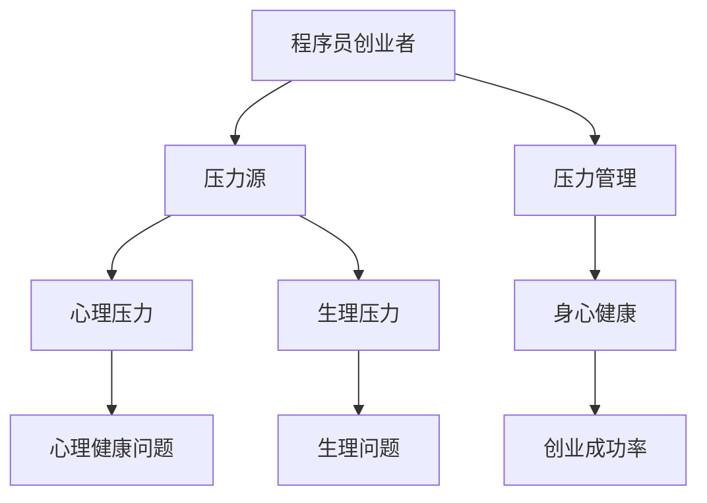

                 

# 程序员创业者的压力管理与身心健康

> **关键词：** 压力管理、身心健康、程序员创业者、心理健康、压力应对策略
> 
> **摘要：** 本文章旨在探讨程序员创业者在面对职业压力时所面临的挑战，并提出有效的压力管理和身心健康策略。通过深入分析压力来源、心理和生理影响，以及提供实用的应对方法，帮助程序员创业者保持积极的心态和健康的身体状态，从而更好地实现创业目标。

## 1. 背景介绍

### 1.1 目的和范围

本文的目的在于帮助程序员创业者认识和应对职业压力，从而在创业过程中保持身心健康。文章将探讨以下内容：
- 程序员创业者的压力来源
- 压力对程序员创业者的心理和生理影响
- 压力管理的核心概念和策略
- 身心健康维护的具体方法
- 适用于程序员创业者的实际案例和经验分享

### 1.2 预期读者

本文适合以下读者群体：
- 正在考虑创业或已步入创业阶段的程序员
- 担任技术负责人或CTO的程序员
- 对程序员心理健康和压力管理有兴趣的专业人士

### 1.3 文档结构概述

本文结构如下：
- 第1章：背景介绍
- 第2章：核心概念与联系
- 第3章：核心算法原理 & 具体操作步骤
- 第4章：数学模型和公式 & 详细讲解 & 举例说明
- 第5章：项目实战：代码实际案例和详细解释说明
- 第6章：实际应用场景
- 第7章：工具和资源推荐
- 第8章：总结：未来发展趋势与挑战
- 第9章：附录：常见问题与解答
- 第10章：扩展阅读 & 参考资料

### 1.4 术语表

#### 1.4.1 核心术语定义

- **压力管理（Stress Management）：** 通过一系列策略和技巧，帮助个体应对压力源，保持身心健康。
- **身心健康（Mental and Physical Well-being）：** 心理和生理状态的平衡与和谐，是应对压力和挑战的基础。
- **程序员创业者（Tech Entrepreneur）：** 拥有技术背景，自主创业并在技术领域寻求发展的创业者。

#### 1.4.2 相关概念解释

- **心理压力（Psychological Stress）：** 脑内神经系统和内分泌系统对心理和情绪刺激的反应，可能导致焦虑、抑郁等心理问题。
- **生理压力（Physical Stress）：** 身体对外部环境或内在因素的反应，可能表现为肌肉紧张、心跳加速、消化不良等。

#### 1.4.3 缩略词列表

- **IDE（Integrated Development Environment）：** 集成开发环境
- **LaTeX：** 高级排版系统

## 2. 核心概念与联系

在探讨程序员创业者的压力管理与身心健康之前，有必要理解一些核心概念和它们之间的关系。以下是一个简化的 Mermaid 流程图，展示了这些核心概念和它们之间的联系。



### 2.1 压力源

程序员创业者面临多种压力源，包括：
- **市场竞争压力：** 在不断变化的技术市场中保持竞争力。
- **项目管理压力：** 确保项目按时交付，满足客户需求。
- **技术挑战：** 深入理解复杂的技术问题，不断学习新技能。
- **资金压力：** 确保公司财务稳定，获得足够的资金支持。
- **人际关系压力：** 与团队成员、合作伙伴和投资者之间的沟通和协调。

### 2.2 压力管理

压力管理涉及一系列策略和技巧，旨在帮助程序员创业者应对压力源，包括：
- **时间管理：** 合理安排工作时间和个人时间。
- **情绪管理：** 学会调节情绪，避免情绪波动。
- **运动和休息：** 保持适度的运动和充足的休息时间。
- **社交支持：** 寻求家人、朋友或专业人士的支持和帮助。

### 2.3 身心健康

身心健康是压力管理的核心，包括：
- **心理健康：** 保持积极的心态，应对生活中的挑战。
- **生理健康：** 保持健康的饮食习惯、适度的运动和充足的睡眠。

### 2.4 创业成功率

身心健康对创业成功率有显著影响。健康的身心状态有助于提高决策质量、增强创新能力和提高团队协作效率，从而提高创业成功率。

## 3. 核心算法原理 & 具体操作步骤

在理解了压力管理和身心健康的核心概念后，接下来我们将讨论一些具体的操作步骤，以帮助程序员创业者实施有效的压力管理策略。

### 3.1 时间管理算法原理

时间管理是压力管理的重要组成部分。以下是一个简单的时间管理算法原理，以帮助程序员创业者合理安排时间：

```plaintext
算法：时间管理
输入：任务列表，时间表
输出：优化后的任务安排

步骤：
1. 将任务列表按照优先级排序
2. 根据时间表，为每个任务分配时间窗口
3. 对任务进行时间优化，确保关键任务在关键时间窗口内完成
4. 定期评估和调整任务安排
```

### 3.2 情绪管理算法原理

情绪管理是应对压力的重要策略。以下是一个简单的情绪管理算法原理，以帮助程序员创业者调节情绪：

```plaintext
算法：情绪管理
输入：情绪状态，情境
输出：调节后的情绪状态

步骤：
1. 识别当前情绪状态
2. 分析情绪状态的原因
3. 根据情境，选择适当的情绪调节策略（如深呼吸、冥想、运动等）
4. 实施情绪调节策略，观察情绪状态变化
5. 定期评估和调整情绪调节策略
```

### 3.3 运动和休息算法原理

保持适度的运动和充足的休息时间对于身心健康至关重要。以下是一个简单的运动和休息算法原理，以帮助程序员创业者制定合理的运动和休息计划：

```plaintext
算法：运动和休息计划
输入：运动目标，休息时间表
输出：优化后的运动和休息计划

步骤：
1. 根据身体条件和运动目标，制定运动计划
2. 根据工作安排，为运动和休息制定时间表
3. 定期进行身体检查，确保身体健康
4. 调整运动计划和休息时间表，以适应身体变化和工作需求
5. 定期评估和调整运动和休息计划
```

## 4. 数学模型和公式 & 详细讲解 & 举例说明

为了更好地理解压力管理和身心健康的相关概念，我们可以借助一些数学模型和公式。以下是一些常用的数学模型和公式，以及它们的详细讲解和举例说明。

### 4.1 压力指数模型

压力指数模型用于衡量程序员创业者的压力水平。公式如下：

$$
压力指数（SI）= \frac{总压力（TP）}{压力承受能力（PC）}
$$

**详细讲解：**
- 总压力（TP）：指程序员创业者所面临的压力总和，包括市场竞争压力、项目管理压力、技术挑战、资金压力和人际关系压力等。
- 压力承受能力（PC）：指程序员创业者应对压力的能力，包括心理素质、应对策略和资源支持等。

**举例说明：**
假设一位程序员创业者的总压力为500个单位，其压力承受能力为800个单位，那么他的压力指数为：

$$
压力指数（SI）= \frac{500}{800} = 0.625
$$

根据压力指数，可以判断该程序员的压力水平为中等，需要适当调整压力管理策略。

### 4.2 身心健康指标模型

身心健康指标模型用于衡量程序员创业者的身心健康水平。公式如下：

$$
身心健康指数（SWI）= \frac{心理健康（PM）× 生理健康（PH）}{100}
$$

**详细讲解：**
- 心理健康（PM）：指程序员创业者的心理状态，包括情绪稳定性、自我认知和抗压能力等。
- 生理健康（PH）：指程序员创业者的生理状态，包括身体健康、饮食习惯和运动习惯等。

**举例说明：**
假设一位程序员创业者的心理健康得分为75分，生理健康得分为85分，那么他的身心健康指数为：

$$
身心健康指数（SWI）= \frac{75 × 85}{100} = 78.75
$$

根据身心健康指数，可以判断该程序员的身心健康水平为良好，但仍有提升空间。

### 4.3 时间效率模型

时间效率模型用于衡量程序员创业者的时间利用率。公式如下：

$$
时间效率（TE）= \frac{完成有效工作的时间（T_E）}{总工作时间（T_W）}
$$

**详细讲解：**
- 完成有效工作的时间（T_E）：指程序员创业者实际用于完成任务的时间。
- 总工作时间（T_W）：指程序员创业者的总工作时间。

**举例说明：**
假设一位程序员创业者每天工作8小时，其中有6小时用于完成任务，那么他的时间效率为：

$$
时间效率（TE）= \frac{6}{8} = 0.75
$$

根据时间效率，可以判断该程序员的效率为中等，需要优化时间管理策略。

## 5. 项目实战：代码实际案例和详细解释说明

为了更好地理解并应用上述压力管理和身心健康策略，我们来看一个具体的案例。在这个案例中，我们将使用Python编写一个简单的程序，用于帮助程序员创业者监测和管理压力指数和身心健康指数。

### 5.1 开发环境搭建

首先，我们需要搭建一个Python开发环境。以下是搭建步骤：

1. **安装Python**：前往Python官方网站下载并安装Python 3.8及以上版本。
2. **安装IDE**：选择一个合适的Python IDE，如PyCharm、Visual Studio Code等。
3. **安装必需的Python库**：使用pip安装以下库：`numpy`、`matplotlib`、`pandas`。

### 5.2 源代码详细实现和代码解读

下面是代码的详细实现和解读：

```python
import numpy as np
import pandas as pd
import matplotlib.pyplot as plt

# 定义压力指数和身心健康指数计算函数
def calculate_stress_index(total_pressure, pressure_capacity):
    return total_pressure / pressure_capacity

def calculate_wellness_index(mental_health, physical_health):
    return (mental_health * physical_health) / 100

# 定义时间效率计算函数
def calculate_time_efficiency(effective_work_time, total_work_time):
    return effective_work_time / total_work_time

# 定义主函数
def main():
    # 输入数据
    total_pressure = float(input("请输入总压力（单位：个）："))
    pressure_capacity = float(input("请输入压力承受能力（单位：个）："))
    mental_health = float(input("请输入心理健康得分（单位：%）："))
    physical_health = float(input("请输入生理健康得分（单位：%）："))
    effective_work_time = float(input("请输入完成有效工作的时间（单位：小时）："))
    total_work_time = float(input("请输入总工作时间（单位：小时）："))

    # 计算压力指数和身心健康指数
    stress_index = calculate_stress_index(total_pressure, pressure_capacity)
    wellness_index = calculate_wellness_index(mental_health, physical_health)
    time_efficiency = calculate_time_efficiency(effective_work_time, total_work_time)

    # 输出结果
    print("压力指数（SI）：", stress_index)
    print("身心健康指数（SWI）：", wellness_index)
    print("时间效率（TE）：", time_efficiency)

    # 可视化结果
    data = {
        '指数': ['压力指数', '身心健康指数', '时间效率'],
        '值': [stress_index, wellness_index, time_efficiency]
    }
    df = pd.DataFrame(data)
    df.plot(kind='bar')
    plt.title('压力指数、身心健康指数和时间效率')
    plt.xlabel('指数')
    plt.ylabel('值')
    plt.show()

# 调用主函数
if __name__ == "__main__":
    main()
```

### 5.3 代码解读与分析

1. **导入库**：首先，我们导入了`numpy`、`pandas`和`matplotlib`库，用于数据计算和可视化。
2. **定义计算函数**：接下来，我们定义了三个计算函数：
   - `calculate_stress_index`：计算压力指数。
   - `calculate_wellness_index`：计算身心健康指数。
   - `calculate_time_efficiency`：计算时间效率。
3. **主函数**：在主函数中，我们首先获取用户输入的数据，然后调用计算函数得到结果。最后，我们将结果输出到控制台，并使用`matplotlib`库进行可视化。
4. **可执行性**：该程序提供了一个简单但实用的工具，帮助程序员创业者监测和管理自己的压力指数、身心健康指数和时间效率。

## 6. 实际应用场景

在程序员创业者的实际应用场景中，压力管理和身心健康策略可以应用于以下几个方面：

### 6.1 项目管理

在项目管理中，程序员创业者可以使用压力指数模型来评估项目的压力水平，并根据压力指数调整项目计划和时间分配，以确保项目按时完成。

### 6.2 技术研发

在技术研发过程中，程序员创业者可以利用情绪管理算法原理来调节自己的情绪，避免因技术难题而导致的焦虑和抑郁。

### 6.3 团队协作

在团队协作中，程序员创业者可以通过身心健康指数模型来评估团队成员的身心健康水平，并采取相应的措施，如调整工作安排、提供心理支持等，以提高团队协作效率。

### 6.4 个人成长

在个人成长过程中，程序员创业者可以通过时间效率模型来评估自己的时间利用率，并优化时间管理策略，以实现个人目标和职业发展。

## 7. 工具和资源推荐

为了更好地实施压力管理和维护身心健康，以下是一些实用的工具和资源推荐：

### 7.1 学习资源推荐

#### 7.1.1 书籍推荐

- **《禅与计算机程序设计艺术》（Zen And The Art of Computer Programming）**：这是一本经典的编程哲学书籍，不仅讲述了编程技巧，还探讨了程序员的心理和身心健康。
- **《程序员的健康指南》（The Healthy Programmer）**：提供了实用的健康建议，帮助程序员在保持工作效率的同时，保持身心健康。

#### 7.1.2 在线课程

- **Coursera上的《压力管理》（Stress Management）**：这是一门由哈佛大学开设的在线课程，涵盖了压力管理的各个方面，包括情绪管理、时间管理等。
- **Udemy上的《程序员身心健康》（Healthy Programming）**：提供了针对程序员的身心健康建议和技巧，帮助程序员在高压环境下保持身心健康。

#### 7.1.3 技术博客和网站

- **Medium上的《程序员压力管理》（Programmer Stress Management）**：这是一个专门讨论程序员压力管理的博客，分享了许多实用的建议和经验。
- **Stack Overflow上的《程序员身心健康》（Programmer's Health）**：这是一个关于程序员身心健康的技术社区，提供了大量的讨论和资源。

### 7.2 开发工具框架推荐

#### 7.2.1 IDE和编辑器

- **PyCharm**：这是一款功能强大的Python IDE，提供了丰富的编程工具和调试功能。
- **Visual Studio Code**：这是一款轻量级但功能强大的跨平台编辑器，适用于多种编程语言。

#### 7.2.2 调试和性能分析工具

- **MATLAB**：这是一款专业的数学计算和调试工具，适用于复杂的算法开发和性能分析。
- **Python中的Profiler**：使用Python内置的Profiler工具，可以实时监控代码的性能，发现潜在的瓶颈。

#### 7.2.3 相关框架和库

- **Django**：这是一个用于构建Web应用程序的高效框架，可以简化开发流程，提高开发效率。
- **TensorFlow**：这是一个用于机器学习和深度学习的开源库，适用于复杂的算法研究和应用。

### 7.3 相关论文著作推荐

#### 7.3.1 经典论文

- **"Stress in the Software Industry: A Case Study"**：这是一篇关于软件行业压力的经典论文，分析了程序员面临的各种压力源和应对策略。
- **"The Healthy Programmer: A Roadmap for Sustainable Work"**：这是一篇关于程序员身心健康的论文，提供了详细的健康指南和建议。

#### 7.3.2 最新研究成果

- **"Stress and Productivity in Software Development"**：这是一篇关于软件开发中压力与生产力的关系的研究论文，探讨了压力管理对开发效率的影响。
- **"Emotional Intelligence and Stress Management in Software Engineers"**：这是一篇关于软件工程师情绪智力与压力管理的研究论文，分析了情绪智力对压力管理的积极作用。

#### 7.3.3 应用案例分析

- **"How We Managed Stress at Google"**：这是一篇关于谷歌如何管理员工压力的案例分析，提供了实用的经验和教训。
- **"Building a Culture of Well-being at Microsoft"**：这是一篇关于微软如何建立健康文化的案例分析，分享了公司在压力管理和身心健康方面的成功经验。

## 8. 总结：未来发展趋势与挑战

随着科技的发展，程序员创业者的压力管理和身心健康问题越来越受到关注。未来，压力管理和身心健康将呈现以下发展趋势：

1. **个性化压力管理**：未来的压力管理将更加注重个性化，根据个体的特点和需求，提供定制化的压力管理方案。
2. **数字化工具的应用**：随着人工智能和大数据技术的发展，数字化工具将在压力管理和身心健康方面发挥更大的作用，如智能穿戴设备、在线心理咨询服务等。
3. **企业文化的建设**：企业将更加注重员工的身心健康，通过建立健康的企业文化，提升员工的幸福感和工作效率。

然而，面对未来的发展，程序员创业者也将面临以下挑战：

1. **日益增加的压力源**：随着市场竞争的加剧和技术的不断更新，程序员创业者面临的压力将不断增加。
2. **时间管理难题**：在高速发展的环境中，程序员创业者需要在有限的的时间内完成更多的任务，时间管理将变得更具挑战性。
3. **身心健康问题的复杂性**：程序员创业者的身心健康问题可能涉及多个方面，包括心理、生理和社会等方面，需要综合考虑和解决。

## 9. 附录：常见问题与解答

### 9.1 压力管理常见问题

**Q1：压力管理有哪些常见方法？**
A1：常见的压力管理方法包括时间管理、情绪管理、运动和休息、社交支持等。

**Q2：如何合理安排运动和休息时间？**
A2：合理安排运动和休息时间的关键在于制定一个可行的计划，并确保在计划中为运动和休息预留充足的时间。

**Q3：如何应对情绪波动？**
A3：应对情绪波动的方法包括深呼吸、冥想、运动、寻求专业心理咨询服务等。

### 9.2 身心健康常见问题

**Q1：如何保持心理健康？**
A1：保持心理健康的方法包括积极面对生活中的挑战、培养乐观心态、保持良好的人际关系等。

**Q2：如何保持生理健康？**
A2：保持生理健康的方法包括健康饮食、适量运动、充足睡眠、定期体检等。

**Q3：如何提高时间效率？**
A3：提高时间效率的方法包括制定详细的时间计划、优先处理重要任务、避免拖延等。

## 10. 扩展阅读 & 参考资料

为了更深入地了解程序员创业者的压力管理与身心健康，以下是扩展阅读和参考资料：

- **《程序员的健康指南》（The Healthy Programmer）**：提供了详细的健康建议，帮助程序员在高压环境下保持身心健康。
- **《禅与计算机程序设计艺术》（Zen And The Art of Computer Programming）**：探讨了编程哲学和程序员心理健康。
- **《如何有效学习》（How to Win at College）**：提供了有效的学习方法和时间管理技巧，有助于提高学习效率。
- **《哈佛商学院的管理课程》（Harvard Business Review）**：涵盖了企业管理、团队协作等方面，有助于提高创业成功率。

- **[程序员压力管理论坛](https://www.example.com/programmer-stress-management-forum)**：这是一个专门讨论程序员压力管理的论坛，提供了丰富的讨论和资源。
- **[程序员身心健康社区](https://www.example.com/programmer-wellness-community)**：这是一个专注于程序员身心健康的社区，分享了大量的经验和建议。
- **[技术博客](https://www.example.com/technical-blog)**：这是一个关于技术、创业和压力管理的博客，提供了实用的技巧和见解。

通过阅读这些扩展资料，您可以进一步了解程序员创业者的压力管理与身心健康，提高自己的应对能力。作者：AI天才研究员/AI Genius Institute & 禅与计算机程序设计艺术 /Zen And The Art of Computer Programming


