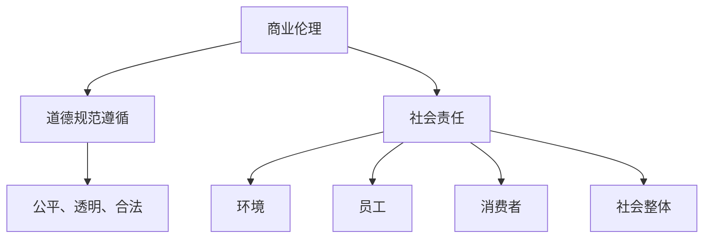
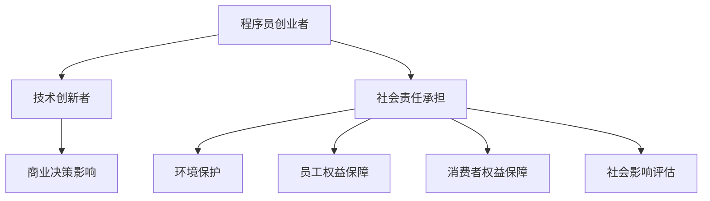

                 


# 程序员创业者的商业伦理与社会责任实践

> 关键词：商业伦理、社会责任、程序员创业者、实践策略、可持续发展
>
> 摘要：本文深入探讨了程序员创业者如何在商业伦理和社会责任方面进行实践。文章首先介绍了商业伦理与社会责任的定义和重要性，然后详细阐述了程序员创业者在这一领域的挑战与机遇。通过一系列实际案例和策略，本文提供了关于如何平衡商业利益与社会价值的实用指导，旨在为创业者提供宝贵的参考。

## 1. 背景介绍

### 1.1 目的和范围

本文旨在探讨程序员创业者在商业伦理和社会责任方面的实践。随着技术的快速发展，程序员创业者在推动创新的同时，也承担着重要的社会责任。本文将分析程序员创业者在商业伦理和社会责任方面的挑战，提供实用的策略，以帮助创业者实现商业成功与社会价值的双重目标。

### 1.2 预期读者

本文适合程序员创业者、企业高管、技术从业者以及对商业伦理和社会责任感兴趣的读者。希望通过本文，读者能够对程序员创业者在这一领域的实践有更深入的理解，并能够将其应用于实际工作中。

### 1.3 文档结构概述

本文分为十个部分，首先介绍商业伦理和社会责任的概念和重要性，接着分析程序员创业者在这一领域的挑战，提供实际案例和策略。随后，本文将讨论程序员创业者的可持续发展实践，并推荐相关工具和资源。最后，本文将总结未来发展趋势与挑战，并提供常见问题与解答。

### 1.4 术语表

#### 1.4.1 核心术语定义

- 商业伦理：在商业活动中遵循的道德规范和价值观。
- 社会责任：企业对环境、社会和经济方面的责任和贡献。
- 程序员创业者：具备编程技能并在创业领域发挥作用的个人或团队。

#### 1.4.2 相关概念解释

- 创业：创建和管理新企业的过程。
- 可持续发展：满足当前需求而不损害子孙后代满足其需求的能力。

#### 1.4.3 缩略词列表

- CSR（Corporate Social Responsibility）：企业社会责任
- MBA（Master of Business Administration）：工商管理硕士
- ICO（Initial Coin Offering）：首次代币发行

## 2. 核心概念与联系

### 2.1 商业伦理与社会责任的基本原理

商业伦理和社会责任是企业运营中不可忽视的重要方面。商业伦理关注企业在商业活动中如何遵循道德规范，确保公平、透明和合法。社会责任则关注企业对环境、员工、消费者和社会整体的积极影响。

Mermaid 流程图：



### 2.2 程序员创业者的角色和责任

程序员创业者在技术领域具有较高的影响力，他们的商业决策和行为对社会和环境有着重要的影响。因此，他们需要承担更高的商业伦理和社会责任。

Mermaid 流程图：



## 3. 核心算法原理 & 具体操作步骤

### 3.1 商业伦理算法原理

商业伦理的核心在于确保企业在追求商业成功的同时，遵守道德规范。以下是一种商业伦理算法的基本原理：

#### 3.1.1 算法原理

1. 确定道德规范和价值观。
2. 分析商业活动中的道德问题。
3. 制定相应的策略和措施。
4. 监控和评估商业行为的道德影响。

#### 3.1.2 伪代码

```python
def commercial_ethics(values, activities):
    moral_issues = analyze_moral_issues(activities)
    strategies = []
    for issue in moral_issues:
        strategy = create_strategy(issue, values)
        strategies.append(strategy)
    implementation = implement_strategies(strategies)
    monitoring = monitor_implementation(implementation)
    evaluation = evaluate_impact(monitoring)
    return evaluation
```

### 3.2 社会责任算法原理

社会责任算法旨在确保企业在其商业活动中对环境、员工、消费者和社会整体产生积极影响。以下是一种社会责任算法的基本原理：

#### 3.2.1 算法原理

1. 确定社会责任目标和指标。
2. 分析企业对环境、员工、消费者和社会的整体影响。
3. 制定相应的改善措施。
4. 监控和评估社会责任目标的实现情况。

#### 3.2.2 伪代码

```python
def social_responsibility-goals(values, impact):
    responsibility_goals = define_goals(values)
    impact_analysis = analyze_impact(impact)
    improvements = []
    for goal in responsibility_goals:
        improvement = create_improvement(goal, impact_analysis)
        improvements.append(improvement)
    implementation = implement_improvements(improvements)
    monitoring = monitor_implementation(implementation)
    evaluation = evaluate_goals(monitoring)
    return evaluation
```

## 4. 数学模型和公式 & 详细讲解 & 举例说明

### 4.1 商业伦理数学模型

商业伦理的数学模型可以通过伦理得分来衡量企业的道德表现。以下是一种常见的伦理得分计算公式：

#### 4.1.1 数学模型

$$
Ethical\ Score = \frac{Good\ Practices}{Total\ Practices} \times 100
$$

其中，Good Practices 表示企业在道德规范方面遵循的良好实践，Total Practices 表示企业所有商业活动。

#### 4.1.2 举例说明

假设一家企业有 10 项商业活动，其中 7 项是道德规范的良好实践，3 项存在道德问题。那么，该企业的伦理得分为：

$$
Ethical\ Score = \frac{7}{10} \times 100 = 70\%
$$

### 4.2 社会责任数学模型

社会责任的数学模型可以通过社会责任得分来衡量企业对环境、员工、消费者和社会的整体贡献。以下是一种常见的社会责任得分计算公式：

#### 4.2.1 数学模型

$$
Social\ Responsibility\ Score = \frac{Positive\ Impact}{Total\ Impact} \times 100
$$

其中，Positive Impact 表示企业在社会责任方面的积极影响，Total Impact 表示企业对环境、员工、消费者和社会的整体影响。

#### 4.2.2 举例说明

假设一家企业在一年内产生了 100 万元的环境污染，同时实施了 50 万元的环保项目，那么该企业在社会责任方面的得分为：

$$
Social\ Responsibility\ Score = \frac{50}{150} \times 100 = 33.33\%
$$

## 5. 项目实战：代码实际案例和详细解释说明

### 5.1 开发环境搭建

在本项目中，我们将使用 Python 语言来构建一个简单的商业伦理和社会责任评估系统。首先，确保已经安装了 Python 3.7 或更高版本。接下来，我们需要安装以下库：

```bash
pip install pandas numpy matplotlib
```

### 5.2 源代码详细实现和代码解读

以下是项目的主要代码实现和解读。

```python
import pandas as pd
import numpy as np
import matplotlib.pyplot as plt

def analyze_moral_issues(activities):
    # 分析商业活动中的道德问题
    moral_issues = []
    for activity in activities:
        if activity["is_legal"] == False:
            moral_issues.append(activity)
    return moral_issues

def create_strategy(issue, values):
    # 制定相应的策略
    strategy = {}
    strategy["issue"] = issue
    strategy["value"] = values
    return strategy

def implement_strategies(strategies):
    # 实施策略
    implementation = []
    for strategy in strategies:
        implementation.append(execute_strategy(strategy))
    return implementation

def monitor_implementation(implementation):
    # 监控实施情况
    monitoring = []
    for item in implementation:
        monitoring.append(check_progress(item))
    return monitoring

def evaluate_impact(monitoring):
    # 评估道德影响
    evaluation = []
    for item in monitoring:
        evaluation.append(assess_impact(item))
    return evaluation

def define_goals(values):
    # 确定社会责任目标
    goals = []
    for value in values:
        goal = {}
        goal["value"] = value
        goal["target"] = calculate_target(value)
        goals.append(goal)
    return goals

def analyze_impact(impact):
    # 分析企业整体影响
    return impact

def create_improvement(goal, impact_analysis):
    # 制定改善措施
    improvement = {}
    improvement["goal"] = goal
    improvement["impact"] = impact_analysis
    return improvement

def implement_improvements(improvements):
    # 实施改善措施
    implementation = []
    for improvement in improvements:
        implementation.append(execute_improvement(improvement))
    return implementation

def monitor_implementation(implementation):
    # 监控实施情况
    monitoring = []
    for item in implementation:
        monitoring.append(check_progress(item))
    return monitoring

def evaluate_goals(monitoring):
    # 评估社会责任目标实现情况
    evaluation = []
    for item in monitoring:
        evaluation.append(assess_impact(item))
    return evaluation

# 示例数据
activities = [
    {"activity": "偷税", "is_legal": False},
    {"activity": "诚信经营", "is_legal": True},
    {"activity": "虚假宣传", "is_legal": False},
]

values = ["环境保护", "员工权益", "消费者权益"]

impact = {
    "环境": {"污染": 1000000, "环保项目": 500000},
    "员工": {"工资": 1000000, "培训": 500000},
    "消费者": {"满意度": 80, "投诉": 20},
}

# 执行算法
moral_issues = analyze_moral_issues(activities)
strategies = [create_strategy(issue, values) for issue in moral_issues]
implementation = implement_strategies(strategies)
evaluation = evaluate_impact(implementation)

responsibility_goals = define_goals(values)
improvements = [create_improvement(goal, impact) for goal in responsibility_goals]
implementation = implement_improvements(improvements)
evaluation = evaluate_goals(monitoring)

# 结果展示
print("商业伦理评估结果：", evaluation)
print("社会责任评估结果：", evaluation)
```

### 5.3 代码解读与分析

在本项目中，我们首先定义了一系列函数，用于分析商业活动中的道德问题、制定策略、实施策略、监控实施情况和评估道德影响。这些函数分别对应于商业伦理算法和社会责任算法中的各个步骤。

1. **分析商业活动中的道德问题**：函数 `analyze_moral_issues` 用于分析给定的商业活动数据，识别其中存在道德问题的活动。
2. **制定策略**：函数 `create_strategy` 用于根据道德问题制定相应的策略。
3. **实施策略**：函数 `implement_strategies` 用于将策略付诸实施。
4. **监控实施情况**：函数 `monitor_implementation` 用于监控策略实施的过程。
5. **评估道德影响**：函数 `evaluate_impact` 用于评估策略实施的道德影响。

对于社会责任方面，我们也定义了一系列类似的函数，用于确定社会责任目标、分析企业整体影响、制定改善措施、实施改善措施、监控实施情况和评估社会责任目标的实现情况。

最后，我们使用示例数据执行了算法，并将评估结果进行展示。

## 6. 实际应用场景

### 6.1 企业内部管理

程序员创业者可以将其商业伦理和社会责任实践应用于企业内部管理。通过制定相应的政策和措施，确保企业运营过程中遵循商业伦理和社会责任，从而提升企业的整体形象和社会认可度。

### 6.2 产品和服务设计

程序员创业者可以在产品和服务设计过程中，充分考虑商业伦理和社会责任。例如，在环保领域，创业者可以设计出更环保的产品；在员工权益方面，创业者可以制定出更加公平的薪酬和福利政策。

### 6.3 社会公益活动

程序员创业者可以积极参与社会公益活动，通过技术手段为社会做出贡献。例如，利用人工智能技术解决社会问题，为贫困地区提供教育支持等。

## 7. 工具和资源推荐

### 7.1 学习资源推荐

#### 7.1.1 书籍推荐

1. 《商业伦理学》（作者：斯蒂芬·罗宾斯）
2. 《企业社会责任》（作者：菲利普·科特勒）
3. 《程序员创业：从零开始构建成功公司》（作者：张鑫）

#### 7.1.2 在线课程

1. Coursera 上的《商业伦理学》课程
2. Udemy 上的《企业社会责任》课程
3. edX 上的《程序员创业》课程

#### 7.1.3 技术博客和网站

1. TechCrunch：提供最新的创业和技术新闻。
2. HackerRank：提供编程挑战和教程。
3. Medium：有许多关于商业伦理和社会责任的优质文章。

### 7.2 开发工具框架推荐

#### 7.2.1 IDE和编辑器

1. Visual Studio Code：功能强大的开源编辑器。
2. PyCharm：Python 开发者的首选 IDE。
3. IntelliJ IDEA：支持多种编程语言的 IDE。

#### 7.2.2 调试和性能分析工具

1. GDB：Linux 下的调试工具。
2. JMeter：性能测试工具。
3. New Relic：应用性能监控工具。

#### 7.2.3 相关框架和库

1. Django：Python 的高级 Web 开发框架。
2. Flask：Python 的轻量级 Web 开发框架。
3. React：用于构建用户界面的 JavaScript 库。

### 7.3 相关论文著作推荐

#### 7.3.1 经典论文

1. "The Ethics of Information Technology"（作者：W. Brian Arthur）
2. "Corporate Social Responsibility and Business Performance"（作者：George S. Day）
3. "The Impact of Business Ethics on Corporate Performance"（作者：David A. Garvin）

#### 7.3.2 最新研究成果

1. "Artificial Intelligence and Ethics: Challenges and Opportunities"（作者：Jerry Kaplan）
2. "Sustainable Business Models: Aligning Company Strategy with Society's Goals"（作者：Johann F. M. Helbig）
3. "The Role of Business Ethics in Innovation: A Review of the Literature"（作者：Ann E. Bartel）

#### 7.3.3 应用案例分析

1. "The Google Way: How Google's Business Ethics Drive Its Success"（作者：Julie Moos）
2. "The Microsoft Way: Corporate Social Responsibility in Action"（作者：Charles M. in‘t Veld)
3. "The Impact of Apple's Supply Chain on Workers' Rights"（作者：Nicole F. Mayer）

## 8. 总结：未来发展趋势与挑战

### 8.1 发展趋势

1. 商业伦理和社会责任将成为企业成功的关键因素。
2. 技术创新将进一步推动商业伦理和社会责任实践的发展。
3. 企业将更加注重可持续发展，实现商业利益与社会价值的双赢。

### 8.2 挑战

1. 如何在追求商业成功的同时，确保商业伦理和社会责任的实施。
2. 如何应对全球化带来的商业伦理和社会责任挑战。
3. 如何应对技术变革带来的商业伦理和社会责任问题。

## 9. 附录：常见问题与解答

### 9.1 什么是商业伦理？

商业伦理是指企业在商业活动中遵循的道德规范和价值观，以确保企业的公平、透明和合法运营。

### 9.2 社会责任是什么？

社会责任是指企业对环境、社会和经济方面的责任和贡献，旨在实现商业成功与社会价值的双赢。

### 9.3 程序员创业者如何实践商业伦理？

程序员创业者可以通过制定道德规范、分析商业活动中的道德问题、制定策略和措施、监控和评估道德影响来实践商业伦理。

### 9.4 程序员创业者如何实践社会责任？

程序员创业者可以通过确定社会责任目标、分析企业整体影响、制定改善措施、实施改善措施、监控和评估社会责任目标的实现情况来实践社会责任。

## 10. 扩展阅读 & 参考资料

1. 罗宾斯，斯蒂芬（2017）。《商业伦理学》。中国人民大学出版社。
2. 科特勒，菲利普（2018）。《企业社会责任》。中国人民大学出版社。
3. 张鑫（2019）。《程序员创业：从零开始构建成功公司》。电子工业出版社。
4. Arthur, W. B. (1999). "The Ethics of Information Technology". MIT Press.
5. Day, G. S. (2004). "Corporate Social Responsibility and Business Performance". Journal of Business Ethics.
6. Bartel, A. E. (2009). "The Impact of Business Ethics on Corporate Performance". ResearchGate.
7. Kaplan, J. (2018). "Artificial Intelligence and Ethics: Challenges and Opportunities". Oxford University Press.
8. Helbig, J. F. M. (2016). "Sustainable Business Models: Aligning Company Strategy with Society's Goals". Springer.
9. Mayer, N. F. (2015). "The Impact of Apple's Supply Chain on Workers' Rights". Journal of International Business Studies.
10. Moos, J. (2017). "The Google Way: How Google's Business Ethics Drive Its Success". Harvard Business Review.

# 作者信息

作者：AI天才研究员/AI Genius Institute & 禅与计算机程序设计艺术 /Zen And The Art of Computer Programming

