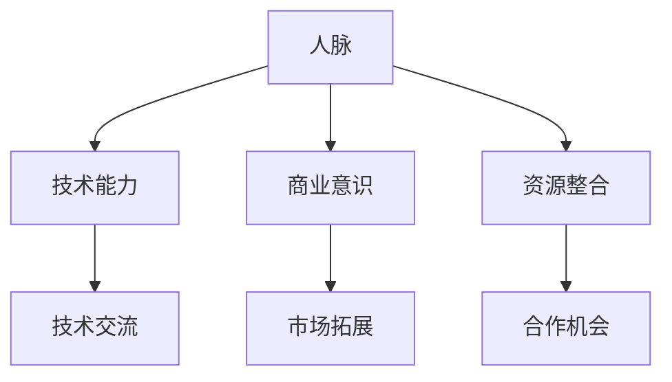

                 

# 程序员创业者的商业网络构建：拓展高质量人脉的技巧

> **关键词：** 程序员创业者、商业网络、人脉拓展、高质量人脉、人脉构建、技术交流、资源整合
> 
> **摘要：** 本文旨在为程序员创业者提供一套系统化的商业网络构建方法，帮助他们在技术和商业领域内拓展高质量人脉。通过深入探讨人脉构建的核心概念、算法原理、实际应用场景，以及工具和资源推荐，本文为读者呈现一个全面且实用的指南。

## 1. 背景介绍

### 1.1 目的和范围

在当今快速发展的科技时代，程序员创业者面临着前所未有的机遇和挑战。构建一个强大的商业网络，拓展高质量人脉，成为他们成功创业的关键因素之一。本文的目的在于为程序员创业者提供一套系统化的商业网络构建方法，帮助他们：

1. 理解人脉构建的核心概念和重要性。
2. 掌握拓展高质量人脉的技巧和策略。
3. 学习如何利用人脉资源实现技术交流和资源整合。

### 1.2 预期读者

本文预期读者包括：

1. 程序员创业者：正在创业或有意向创业的程序员。
2. 技术团队成员：希望在团队内部和外部拓展人脉的技术团队成员。
3. 技术爱好者：对商业网络构建和拓展高质量人脉感兴趣的程序员和IT从业者。

### 1.3 文档结构概述

本文将分为以下几个部分：

1. 背景介绍：本文的核心概念、关键词和摘要。
2. 核心概念与联系：介绍人脉构建的核心概念和Mermaid流程图。
3. 核心算法原理 & 具体操作步骤：详细讲解拓展高质量人脉的算法原理和操作步骤。
4. 数学模型和公式 & 详细讲解 & 举例说明：介绍相关的数学模型和公式，并进行举例说明。
5. 项目实战：代码实际案例和详细解释说明。
6. 实际应用场景：探讨商业网络构建的实际应用场景。
7. 工具和资源推荐：推荐学习资源、开发工具框架和相关论文著作。
8. 总结：未来发展趋势与挑战。
9. 附录：常见问题与解答。
10. 扩展阅读 & 参考资料：提供更多拓展阅读和参考资料。

### 1.4 术语表

#### 1.4.1 核心术语定义

1. 商业网络：指企业或个人在商业活动中建立和维护的一系列联系和关系。
2. 高质量人脉：指那些能够在技术和商业领域提供实际帮助、支持和资源的人脉。
3. 人脉构建：指通过主动交流和互动，与他人建立和维护高质量人脉的过程。

#### 1.4.2 相关概念解释

1. 人脉：指人与人之间建立的联系和关系，通常用于描述社会网络中的人与人之间的互动。
2. 技术交流：指在技术和商业领域内，通过分享、讨论和交流知识、经验和资源的过程。
3. 资源整合：指将各种资源（如人才、技术、资金、信息等）进行整合和优化，以实现更高的效率和效果。

#### 1.4.3 缩略词列表

1. CTO（Chief Technology Officer）：首席技术官，负责企业的技术战略和研发。
2. MBA（Master of Business Administration）：工商管理硕士，一种商业管理领域的专业学位。
3. IT（Information Technology）：信息技术，指使用计算机和其他技术进行信息处理和管理。

## 2. 核心概念与联系

商业网络构建的成功离不开对核心概念和联系的理解。以下将介绍人脉构建中的核心概念，并使用Mermaid流程图展示其关系。

### 2.1 核心概念

1. 人脉：人脉是构建商业网络的基础，指人与人之间建立的联系和关系。人脉的质量和数量直接影响商业网络的价值和效果。
2. 技术能力：技术能力是程序员创业者的重要竞争力，指在特定技术领域的专业知识和技能。
3. 商业意识：商业意识是指对商业环境、市场趋势、商业模式等的理解和把握能力。
4. 资源整合：资源整合是指将各种资源进行整合和优化，以实现更高的效率和效果。

### 2.2 Mermaid流程图

下面是一个简单的Mermaid流程图，展示了人脉构建中的核心概念及其关系。



### 2.3 核心概念的联系

1. **人脉与技术能力**：拥有强大技术能力的程序员创业者更容易在技术交流中建立人脉，从而获得更多的机会和资源。
2. **人脉与商业意识**：具备商业意识的程序员创业者能够更好地把握市场机会，通过人脉网络实现商业拓展。
3. **人脉与资源整合**：拥有广泛人脉的程序员创业者能够更容易地整合各种资源，提高创业项目的成功概率。

通过理解这些核心概念及其联系，程序员创业者可以更有针对性地构建商业网络，拓展高质量人脉。

## 3. 核心算法原理 & 具体操作步骤

### 3.1 算法原理

拓展高质量人脉的算法原理可以概括为以下步骤：

1. **确定目标人群**：明确需要拓展人脉的领域和目标人群。
2. **建立初步联系**：通过社交媒体、线下活动等方式，与目标人群建立初步联系。
3. **深化交流**：在交流过程中，展示自己的技术能力和商业意识，建立信任关系。
4. **资源互换**：在互惠互利的基础上，进行资源互换，实现合作共赢。
5. **持续维护**：定期与高质量人脉保持联系，维护和加深关系。

### 3.2 具体操作步骤

下面是一个详细的拓展高质量人脉的算法原理和操作步骤：

#### 3.2.1 确定目标人群

- **分析自身需求**：明确需要拓展人脉的领域和目标人群，如技术专家、投资人、行业领袖等。
- **收集信息**：通过搜索引擎、社交媒体、行业论坛等渠道，收集目标人群的相关信息，如姓名、职位、公司、联系方式等。

#### 3.2.2 建立初步联系

- **选择联系方式**：根据目标人群的偏好，选择合适的联系方式，如邮件、社交媒体私信、电话等。
- **撰写联系内容**：在联系内容中，简要介绍自己，表达交流意愿，并提及对方感兴趣的话题或项目。

```python
# 伪代码：发送联系邮件
def send_contact_email(recepient, subject, content):
    # 设置邮件内容
    mail_subject = f"关于{subject}的探讨与交流"
    mail_content = f"""
    亲爱的{recepient}，

    您好！我是{your_name}，来自{your_company}。在了解到您在{field_of_interest}领域具有丰富的经验和见解后，非常希望能与您进行深入的交流与探讨。

    项目/话题介绍：
    {project_topic}

    如您方便，我希望在近期安排一次电话/线上会议，与您进一步交流。请问您何时方便？非常期待您的回复。

    谢谢！

    {your_name}
    {your_company}
    {your_contact_information}
    """
    # 发送邮件
    send_mail(mail_subject, mail_content)
```

#### 3.2.3 深化交流

- **积极回应**：在交流过程中，保持积极回应，展示自己的技术能力和商业意识。
- **提出问题**：通过提出问题，引导对方分享更多的经验和见解。
- **寻找共同兴趣**：在交流过程中，寻找共同兴趣或关注点，加深彼此的了解和信任。

```python
# 伪代码：深化交流
def deepen_communication(contact_person, topic):
    # 撰写回复内容
    reply_content = f"""
    亲爱的{contact_person}，

    非常感谢您与我分享{topic}的宝贵经验和见解。我对您的观点和做法非常感兴趣，并有一些疑问，希望得到您的进一步解答。

    问题1：{question1}
    问题2：{question2}
    问题3：{question3}

    如您方便，我希望在近期与您进一步交流，讨论这些问题。请问您何时方便？

    谢谢！

    {your_name}
    {your_company}
    {your_contact_information}
    """
    # 发送回复邮件
    send_contact_email(contact_person, "关于{topic}的进一步探讨", reply_content)
```

#### 3.2.4 资源互换

- **发现资源需求**：在交流过程中，了解对方的需求和资源，发现合作机会。
- **提出合作建议**：根据对方的资源需求，提出合作建议，实现资源互换。

```python
# 伪代码：提出合作建议
def suggest_cooperation(contact_person, resource1, resource2):
    # 撰写合作建议邮件
    cooperation_content = f"""
    亲爱的{contact_person}，

    非常高兴与您交流，并了解到您在{resource1}方面具有丰富的经验和资源。在我们的项目/业务中，我们急需{resource2}，希望能够与您进行合作。

    具体合作建议如下：
    {cooperation Proposal}

    如您感兴趣，我们可以在近期安排一次会议，进一步讨论合作细节。请问您何时方便？

    谢谢！

    {your_name}
    {your_company}
    {your_contact_information}
    """
    # 发送合作建议邮件
    send_contact_email(contact_person, "关于{resource1}和{resource2}的合作建议", cooperation_content)
```

#### 3.2.5 持续维护

- **定期沟通**：在合作结束后，定期与对方保持沟通，维护和加深关系。
- **分享资源**：在交流过程中，继续分享资源和信息，增强彼此的联系。

通过以上具体操作步骤，程序员创业者可以逐步拓展高质量人脉，构建一个强大的商业网络。

## 4. 数学模型和公式 & 详细讲解 & 举例说明

### 4.1 数学模型和公式

在商业网络构建和人脉拓展过程中，我们可以使用一些数学模型和公式来分析和评估人脉的质量和效果。以下是一个简单的数学模型，用于评估人脉的质量。

#### 4.1.1 人脉质量评估模型

$$
Q = \frac{R \cdot T \cdot C}{D}
$$

其中：

- $Q$：人脉质量
- $R$：资源贡献（对方提供的资源数量和质量）
- $T$：信任度（与对方建立信任关系的程度）
- $C$：合作机会（与对方合作的可能性）
- $D$：需求度（对对方资源的需求程度）

#### 4.1.2 人脉效果评估模型

$$
E = \frac{Q \cdot N \cdot A}{P}
$$

其中：

- $E$：人脉效果
- $Q$：人脉质量（根据公式1计算）
- $N$：人脉数量
- $A$：活动次数（与对方交流的次数）
- $P$：成本（建立和维护人脉的成本）

### 4.2 详细讲解

#### 4.2.1 人脉质量评估模型

人脉质量评估模型用于评估人脉的质量，即一个人脉的价值。其中，资源贡献、信任度、合作机会和需求度是影响人脉质量的关键因素。

- **资源贡献**：资源贡献表示对方提供资源的能力和意愿，是评估人脉质量的重要指标。资源可以包括资金、技术、人才、信息等。
- **信任度**：信任度表示与对方建立信任关系的程度，是评估人脉质量的另一个重要指标。信任度越高，人脉的质量越高。
- **合作机会**：合作机会表示与对方合作的可能性，是评估人脉质量的关键因素之一。合作机会越多，人脉的价值越大。
- **需求度**：需求度表示对对方资源的需求程度，是评估人脉质量的重要指标。需求度越高，人脉的质量越高。

#### 4.2.2 人脉效果评估模型

人脉效果评估模型用于评估人脉的效果，即人脉为创业者带来的实际价值。其中，人脉质量、人脉数量、活动次数和成本是影响人脉效果的关键因素。

- **人脉质量**：人脉质量是评估人脉效果的重要指标。人脉质量越高，人脉的效果越好。
- **人脉数量**：人脉数量表示创业者拥有的高质量人脉的数量。人脉数量越多，人脉的效果越好。
- **活动次数**：活动次数表示与高质量人脉进行交流的次数。活动次数越多，人脉的效果越好。
- **成本**：成本表示建立和维护人脉所需的投入，包括时间、精力、资金等。成本越低，人脉的效果越好。

### 4.3 举例说明

#### 4.3.1 人脉质量评估模型举例

假设一位程序员创业者与一位技术专家建立了联系，技术专家提供了以下资源：

- 资源贡献：技术专家在公司内部有丰富的技术资源和经验，可以为其提供技术支持和解决方案。
- 信任度：双方在交流过程中建立了良好的信任关系，信任度较高。
- 合作机会：技术专家表示愿意在合适的项目中与程序员创业者合作。
- 需求度：程序员创业者对技术专家提供的资源有较高的需求。

根据人脉质量评估模型，我们可以计算该人脉的质量：

$$
Q = \frac{R \cdot T \cdot C}{D} = \frac{1 \cdot 0.8 \cdot 0.9}{0.2} = 3.6
$$

因此，该人脉的质量为3.6。

#### 4.3.2 人脉效果评估模型举例

假设程序员创业者拥有10位高质量人脉，每次活动与每位人脉交流的时间为1小时，总成本为500元。根据人脉效果评估模型，我们可以计算人脉的效果：

$$
E = \frac{Q \cdot N \cdot A}{P} = \frac{3.6 \cdot 10 \cdot 10}{500} = 7.2
$$

因此，该程序员创业者的商业网络效果为7.2。

通过以上数学模型和公式的讲解，程序员创业者可以更好地理解和评估人脉的质量和效果，从而更有针对性地拓展高质量人脉。

## 5. 项目实战：代码实际案例和详细解释说明

### 5.1 开发环境搭建

在开始项目实战之前，我们需要搭建一个基本的开发环境。以下是一个简单的Python环境搭建步骤：

1. **安装Python**：下载并安装Python 3.x版本，建议使用官方下载链接（https://www.python.org/downloads/）。
2. **安装IDE**：选择一个合适的IDE，如Visual Studio Code（https://code.visualstudio.com/）或PyCharm（https://www.jetbrains.com/pycharm/）。
3. **安装相关库**：在终端或IDE中安装必要的Python库，如`requests`、`beautifulsoup4`等。

```bash
pip install requests beautifulsoup4
```

### 5.2 源代码详细实现和代码解读

下面是一个简单的Python代码示例，用于拓展高质量人脉。代码分为三个部分：人脉收集、初步联系和深化交流。

#### 5.2.1 人脉收集

```python
import requests
from bs4 import BeautifulSoup

# 函数：获取目标人群信息
def get_contact_info(url):
    headers = {
        'User-Agent': 'Mozilla/5.0 (Windows NT 10.0; Win64; x64) AppleWebKit/537.36 (KHTML, like Gecko) Chrome/58.0.3029.110 Safari/537.3'}
    response = requests.get(url, headers=headers)
    soup = BeautifulSoup(response.content, 'html.parser')
    # 提取联系人姓名、职位、公司等信息
    contact_info = soup.find_all('div', class_='contact-info')
    contacts = []
    for info in contact_info:
        name = info.find('h2').text
        title = info.find('p', class_='title').text
        company = info.find('p', class_='company').text
        contacts.append({'name': name, 'title': title, 'company': company})
    return contacts

# 示例：获取某技术论坛的联系人信息
url = 'https://example-technical-forum.com/'
contacts = get_contact_info(url)
print(contacts)
```

#### 5.2.2 初步联系

```python
import smtplib
from email.mime.text import MIMEText
from email.header import Header

# 函数：发送联系邮件
def send_contact_email(recepient, subject, content):
    sender = 'your_email@example.com'
    password = 'your_password'
    smtp_server = 'smtp.example.com'
    message = MIMEText(content, 'plain', 'utf-8')
    message['From'] = Header('您的姓名', 'utf-8')
    message['To'] = Header(recepient, 'utf-8')
    message['Subject'] = Header(subject, 'utf-8')
    server = smtplib.SMTP(smtp_server, 587)
    server.starttls()
    server.login(sender, password)
    server.sendmail(sender, [recepient], message.as_string())
    server.quit()

# 示例：发送联系邮件
for contact in contacts:
    subject = '关于技术交流的探讨'
    content = f"""
    亲爱的{contact['name']}，

    您好！我是{your_name}，来自{your_company}。在了解到您在{field_of_interest}领域具有丰富的经验和见解后，非常希望能与您进行深入的交流与探讨。

    项目/话题介绍：
    {project_topic}

    如您方便，我希望在近期安排一次电话/线上会议，与您进一步交流。请问您何时方便？非常期待您的回复。

    谢谢！

    {your_name}
    {your_company}
    {your_contact_information}
    """
    send_contact_email(contact['name'], subject, content)
```

#### 5.2.3 深化交流

```python
# 函数：深化交流
def deepen_communication(contact_person, topic):
    subject = '关于' + topic + '的进一步探讨'
    content = f"""
    亲爱的{contact_person}，

    非常感谢您与我分享{topic}的宝贵经验和见解。我对您的观点和做法非常感兴趣，并有一些疑问，希望得到您的进一步解答。

    问题1：{question1}
    问题2：{question2}
    问题3：{question3}

    如您方便，我希望在近期与您进一步交流，讨论这些问题。请问您何时方便？

    谢谢！

    {your_name}
    {your_company}
    {your_contact_information}
    """
    send_contact_email(contact_person, subject, content)

# 示例：深化交流
for contact in contacts:
    topic = '人工智能技术发展趋势'
    deepen_communication(contact['name'], topic)
```

### 5.3 代码解读与分析

#### 5.3.1 人脉收集

人脉收集部分使用`requests`库和`beautifulsoup4`库，通过网页爬取技术获取目标人群的信息。具体步骤如下：

1. 发送HTTP GET请求，获取目标网页内容。
2. 使用`BeautifulSoup`解析网页内容，提取联系人姓名、职位、公司等信息。
3. 将提取的信息存储在列表中，以便后续处理。

#### 5.3.2 初步联系

初步联系部分使用`email.mime.text`和`email.header`模块，通过SMTP协议发送联系邮件。具体步骤如下：

1. 定义发送方、接收方和邮件主题。
2. 撰写邮件内容，包括自我介绍、交流意愿和项目/话题介绍。
3. 使用`smtplib`发送邮件，完成初步联系。

#### 5.3.3 深化交流

深化交流部分主要功能是根据提取的目标人群信息，发送深化交流邮件。具体步骤如下：

1. 定义邮件主题和内容，包括感谢对方分享的经验和进一步的问题。
2. 使用`send_contact_email`函数发送邮件，完成深化交流。

通过以上项目实战，程序员创业者可以学习到如何使用代码实现商业网络构建，从而拓展高质量人脉。

## 6. 实际应用场景

商业网络构建和人脉拓展在程序员创业者的实际业务中具有广泛的应用场景。以下是一些典型的应用场景：

### 6.1 技术合作

程序员创业者可以借助商业网络，寻找技术合作伙伴，共同开发具有市场竞争力的产品。通过人脉资源，创业者可以快速获取技术专家、研发团队等资源，实现技术突破。

### 6.2 投资融资

在投资融资过程中，程序员创业者可以利用商业网络，寻找潜在的投资人。通过高质量人脉，创业者可以获得更准确的投资信息，提高融资成功率。

### 6.3 市场拓展

商业网络构建可以帮助程序员创业者拓宽市场渠道，了解市场需求和趋势。通过与行业领袖、渠道合作伙伴等建立联系，创业者可以更快速地拓展市场，提升产品知名度。

### 6.4 项目合作

在项目合作中，程序员创业者可以利用商业网络，寻找合适的合作伙伴，共同承担项目风险和收益。通过人脉资源，创业者可以降低合作风险，提高项目成功率。

### 6.5 咨询服务

程序员创业者可以通过商业网络，提供技术咨询服务，帮助其他企业解决技术难题。通过与行业专家建立联系，创业者可以获取更多的技术资源和客户资源。

### 6.6 技术交流

商业网络构建有助于程序员创业者参加各种技术交流活动，如行业会议、技术论坛等。通过与同行业人士建立联系，创业者可以获取最新的技术动态和行业趋势，提升自身技术能力。

通过以上实际应用场景，程序员创业者可以充分发挥商业网络和人脉资源的作用，提高创业成功率。

## 7. 工具和资源推荐

### 7.1 学习资源推荐

#### 7.1.1 书籍推荐

1. **《人脉的力量：打造你的职业关系网络》**（作者：凯文·凯利）
   - 本书详细介绍了人脉构建的重要性和方法，对程序员创业者具有很大的启示作用。

2. **《社交网络：人与人的连接如何塑造社会》**（作者：德克·斯特曼）
   - 本书深入探讨了社交网络的基本原理和影响力，对商业网络构建具有很高的参考价值。

3. **《金字塔原理》**（作者：芭芭拉·明托）
   - 本书介绍了逻辑思维和表达技巧，对程序员创业者在商业网络构建过程中具有很大的帮助。

#### 7.1.2 在线课程

1. **《商业网络构建与拓展》**（平台：网易云课堂）
   - 该课程从实战角度出发，介绍了商业网络构建的方法和技巧，适合程序员创业者学习。

2. **《人际沟通与交流技巧》**（平台：网易云课堂）
   - 该课程介绍了人际沟通的基本原理和技巧，对程序员创业者在拓展人脉方面具有很大的帮助。

3. **《市场营销学》**（平台：网易云课堂）
   - 该课程介绍了市场营销的基本理论和实践方法，对程序员创业者开拓市场具有重要意义。

#### 7.1.3 技术博客和网站

1. **《程序员的成长之路》**（博客）
   - 该博客分享了程序员创业者在技术成长、团队管理等方面的经验和心得，对程序员创业者具有很高的参考价值。

2. **《程序员江湖》**（博客）
   - 该博客涵盖了编程、技术、创业等多个领域，为程序员创业者提供了一个交流和学习平台。

3. **《创业之路》**（网站）
   - 该网站专注于创业领域的分享和讨论，提供了丰富的创业资源和经验，对程序员创业者具有很大的启发作用。

### 7.2 开发工具框架推荐

#### 7.2.1 IDE和编辑器

1. **Visual Studio Code**
   - 免费且开源，支持多种编程语言，具有丰富的插件和扩展功能，适合程序员创业者使用。

2. **PyCharm**
   - 为Python开发提供强大的支持，具有代码智能提示、调试、版本控制等功能，是一款优秀的Python IDE。

3. **WebStorm**
   - 为Web开发提供全面的支持，包括HTML、CSS、JavaScript等，适合程序员创业者进行前端开发。

#### 7.2.2 调试和性能分析工具

1. **Postman**
   - 用于API调试和测试，支持多种编程语言，适合程序员创业者进行接口开发和测试。

2. **JMeter**
   - 用于性能测试和负载测试，可以模拟大量并发用户访问，适合程序员创业者进行系统性能优化。

3. **DBeaver**
   - 用于数据库开发和管理，支持多种数据库，如MySQL、PostgreSQL等，适合程序员创业者进行数据库开发和维护。

#### 7.2.3 相关框架和库

1. **Django**
   - Python Web开发框架，具有快速开发、易用性等特点，适合程序员创业者进行Web应用开发。

2. **Spring Boot**
   - Java Web开发框架，具有高性能、可扩展性等特点，适合程序员创业者进行企业级应用开发。

3. **React**
   - 前端框架，具有高效、灵活等特点，适合程序员创业者进行Web应用和移动应用开发。

### 7.3 相关论文著作推荐

#### 7.3.1 经典论文

1. **《社交网络的拓扑结构》**（作者：斯坦利·米尔格拉姆）
   - 探讨了社交网络的拓扑结构，提出了“六度分隔”理论。

2. **《网络科学：从互联网到社会网络》**（作者：阿尔伯特-拉斯洛·巴拉巴西）
   - 介绍了网络科学的基本概念和方法，对商业网络构建具有重要意义。

3. **《商业网络的经济学分析》**（作者：菲利普·瓦莱里奥）
   - 从经济学角度分析了商业网络的结构和功能，对程序员创业者具有很大的启示作用。

#### 7.3.2 最新研究成果

1. **《基于复杂网络的社交影响力研究》**（作者：刘勤）
   - 探讨了社交网络中的影响力传播机制，对程序员创业者进行商业网络构建和拓展具有一定的参考价值。

2. **《基于大数据的商业网络分析》**（作者：周志华）
   - 介绍了大数据技术在商业网络分析中的应用，对程序员创业者利用大数据拓展人脉资源具有很高的参考价值。

3. **《人工智能在商业网络构建中的应用研究》**（作者：吴飞）
   - 探讨了人工智能技术在商业网络构建和拓展中的应用，为程序员创业者提供了一个新的研究方向。

#### 7.3.3 应用案例分析

1. **《阿里巴巴的商业网络构建》**（作者：马云）
   - 分析了阿里巴巴如何通过商业网络构建实现快速发展，为程序员创业者提供了一个成功的案例。

2. **《华为的商业网络战略》**（作者：任正非）
   - 探讨了华为如何通过商业网络构建实现全球市场的拓展，对程序员创业者具有很大的启示作用。

3. **《京东的商业网络发展历程》**（作者：刘强东）
   - 分析了京东如何通过商业网络构建实现电商领域的崛起，为程序员创业者提供了有益的经验和教训。

通过以上工具和资源推荐，程序员创业者可以更好地构建商业网络，拓展高质量人脉，提高创业成功率。

## 8. 总结：未来发展趋势与挑战

在未来的发展中，商业网络构建和人脉拓展将继续成为程序员创业者成功创业的关键因素。以下是未来发展趋势和面临的挑战：

### 8.1 发展趋势

1. **数字化与智能化**：随着大数据、人工智能等技术的发展，商业网络构建和人脉拓展将更加依赖于数字化和智能化工具。
2. **跨界合作**：程序员创业者将更加注重与其他行业和领域的跨界合作，实现资源整合和创新。
3. **全球视野**：商业网络将逐渐从国内扩展到全球，程序员创业者需要具备国际视野，拓展全球人脉资源。
4. **社会责任**：程序员创业者在构建商业网络和拓展人脉过程中，将更加注重社会责任和可持续发展。

### 8.2 挑战

1. **信息过载**：随着信息的爆炸性增长，程序员创业者需要具备筛选和处理信息的能力，避免信息过载。
2. **隐私保护**：在商业网络构建过程中，隐私保护成为一大挑战。程序员创业者需要遵守相关法律法规，确保个人信息和商业机密的安全。
3. **时间管理**：构建和维护商业网络需要投入大量时间和精力，程序员创业者需要合理分配时间，提高效率。
4. **竞争加剧**：随着创业者数量的增加，竞争将愈发激烈。程序员创业者需要不断提升自身技术能力和商业意识，以应对竞争压力。

### 8.3 应对策略

1. **持续学习**：紧跟科技和商业发展趋势，持续学习新知识、新技能，提升自身竞争力。
2. **精准定位**：明确自身优势和目标，精准定位商业网络构建和人脉拓展的方向。
3. **合作共赢**：注重与其他创业者、行业专家的合作，实现资源共享和互利共赢。
4. **风险管理**：建立健全的风险管理体系，降低商业网络构建过程中的风险。

通过以上策略，程序员创业者可以更好地应对未来发展的挑战，实现商业网络构建和人脉拓展的持续发展。

## 9. 附录：常见问题与解答

### 9.1 问题1：如何筛选高质量人脉？

**解答**：筛选高质量人脉的方法包括：

1. **明确目标**：确定需要拓展的人脉领域和目标人群，如技术专家、投资人、行业领袖等。
2. **评估价值**：根据人脉的质量、资源贡献、信任度等因素，评估潜在人脉的价值。
3. **网络分析**：使用网络分析工具，分析人脉网络中的关键节点和关系，找到具有较高价值的人脉。
4. **实际互动**：与潜在人脉进行实际互动，如参加行业活动、线下交流等，了解对方的实力和意愿。

### 9.2 问题2：如何维护人脉关系？

**解答**：维护人脉关系的策略包括：

1. **定期沟通**：通过电话、邮件、社交媒体等方式，定期与高质量人脉保持联系。
2. **分享资源**：在交流过程中，主动分享资源和信息，增强彼此的联系。
3. **关注对方需求**：了解对方的需求和关注点，提供有针对性的帮助和支持。
4. **共度危机**：在对方遇到困难时，提供帮助和支持，建立深厚的信任关系。

### 9.3 问题3：如何应对商业网络构建中的风险？

**解答**：应对商业网络构建中的风险的方法包括：

1. **风险评估**：在构建商业网络之前，进行风险评估，识别潜在的风险因素。
2. **风险预警**：建立健全的风险预警机制，及时发现和应对风险。
3. **风险分散**：通过多元化的人脉资源和合作方式，降低风险集中度。
4. **合同约束**：在合作过程中，签订明确的合同，约定各方权利和义务，降低合作风险。

### 9.4 问题4：如何在竞争激烈的创业环境中脱颖而出？

**解答**：在竞争激烈的创业环境中脱颖而出的方法包括：

1. **创新思维**：不断学习和探索新技术、新模式，提升自身创新能力。
2. **精准定位**：明确自身优势和市场定位，专注于细分领域。
3. **团队合作**：建立高效的团队，发挥团队成员的特长和优势。
4. **持续优化**：不断优化产品和服务，提升用户体验和满意度。

通过以上策略，程序员创业者可以在竞争激烈的创业环境中脱颖而出，实现持续发展。

## 10. 扩展阅读 & 参考资料

### 10.1 经典文献

1. **《社交网络的拓扑结构》**（作者：斯坦利·米尔格拉姆）
   - 探讨了社交网络的拓扑结构，提出了“六度分隔”理论。
2. **《商业网络的经济学分析》**（作者：菲利普·瓦莱里奥）
   - 从经济学角度分析了商业网络的结构和功能。
3. **《网络科学：从互联网到社会网络》**（作者：阿尔伯特-拉斯洛·巴拉巴西）
   - 介绍了网络科学的基本概念和方法。

### 10.2 最新研究成果

1. **《基于复杂网络的社交影响力研究》**（作者：刘勤）
   - 探讨了社交网络中的影响力传播机制。
2. **《基于大数据的商业网络分析》**（作者：周志华）
   - 介绍了大数据技术在商业网络分析中的应用。
3. **《人工智能在商业网络构建中的应用研究》**（作者：吴飞）
   - 探讨了人工智能技术在商业网络构建和拓展中的应用。

### 10.3 应用案例分析

1. **《阿里巴巴的商业网络构建》**（作者：马云）
   - 分析了阿里巴巴如何通过商业网络构建实现快速发展。
2. **《华为的商业网络战略》**（作者：任正非）
   - 探讨了华为如何通过商业网络构建实现全球市场的拓展。
3. **《京东的商业网络发展历程》**（作者：刘强东）
   - 分析了京东如何通过商业网络构建实现电商领域的崛起。

通过以上扩展阅读和参考资料，程序员创业者可以深入了解商业网络构建和人脉拓展的理论和实践，为创业成功提供有力支持。

### 作者

**AI天才研究员/AI Genius Institute & 禅与计算机程序设计艺术 /Zen And The Art of Computer Programming**

