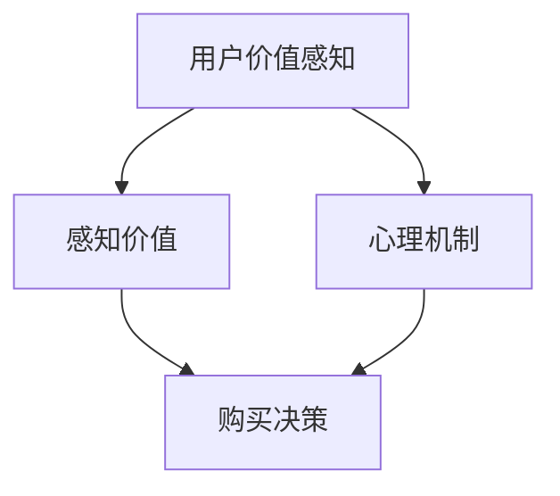

                 

# 程序员创业者的定价心理学：最大化用户价值感知的方法

> **关键词**：程序员创业者、定价心理学、用户价值感知、定价策略、价值最大化

> **摘要**：本文将探讨程序员创业者在定价过程中如何运用心理学原理，最大化用户的感知价值。通过分析消费者的心理机制，提供一系列实用的定价策略，帮助创业者实现商业成功。

## 1. 背景介绍

### 1.1 目的和范围

本文旨在帮助程序员创业者更好地理解定价心理学，从而制定出更加科学和高效的定价策略。我们将探讨用户价值感知的核心因素，分析消费者在购买决策过程中的心理机制，并总结出一套适用于程序员创业者的定价方法。

### 1.2 预期读者

本文适用于有志于创业的程序员，以及已经在创业阶段需要制定定价策略的创业者。无论您是技术背景还是市场背景，本文都将提供有益的见解和实际操作指导。

### 1.3 文档结构概述

本文结构如下：

1. **背景介绍**：介绍本文的目的、预期读者和文档结构。
2. **核心概念与联系**：介绍定价心理学中的核心概念，并使用流程图展示概念之间的关系。
3. **核心算法原理 & 具体操作步骤**：讲解如何运用心理学原理来制定定价策略，并提供伪代码示例。
4. **数学模型和公式 & 详细讲解 & 举例说明**：介绍定价策略背后的数学模型，并给出具体实例。
5. **项目实战：代码实际案例和详细解释说明**：通过实际案例展示定价策略的应用，并进行详细解释。
6. **实际应用场景**：讨论定价策略在不同场景下的应用。
7. **工具和资源推荐**：推荐相关的学习资源和开发工具。
8. **总结：未来发展趋势与挑战**：总结文章的主要观点，并探讨未来的发展趋势和挑战。
9. **附录：常见问题与解答**：解答读者可能遇到的常见问题。
10. **扩展阅读 & 参考资料**：提供进一步的阅读资源和参考资料。

### 1.4 术语表

#### 1.4.1 核心术语定义

- **用户价值感知**：用户对产品或服务价值的心理评估。
- **感知价值**：用户对产品或服务所感受到的价值。
- **心理机制**：消费者在购买决策过程中所涉及的心理过程。
- **定价策略**：创业者在定价过程中采取的方法和策略。

#### 1.4.2 相关概念解释

- **消费者心理机制**：消费者在购买决策过程中所涉及的心理过程，包括需求识别、信息处理、评估和购买决策。
- **定价目标**：创业者希望通过定价实现的目标，如最大化利润、市场份额或品牌形象。

#### 1.4.3 缩略词列表

- **UX**：用户体验（User Experience）
- **UI**：用户界面（User Interface）
- **CPC**：每点击成本（Cost Per Click）
- **CPM**：每千次展示成本（Cost Per Mille）
- **CPS**：每销售成本（Cost Per Sale）

## 2. 核心概念与联系

在定价心理学中，核心概念包括用户价值感知、感知价值和心理机制。这些概念之间的关系可以用以下Mermaid流程图表示：



在这个流程图中，用户价值感知直接影响感知价值和购买决策，而心理机制则是连接这两个环节的关键因素。理解这些概念之间的关系对于制定有效的定价策略至关重要。

### 2.1 用户价值感知

用户价值感知是指用户对产品或服务所感受到的价值。它受到多个因素的影响，包括产品功能、性能、用户体验、品牌形象等。用户价值感知越高，用户对产品或服务的满意度和忠诚度也越高。

### 2.2 感知价值

感知价值是用户在心理上对产品或服务所赋予的价值。它与用户价值感知密切相关，但并不完全相同。感知价值受到用户需求、预期、竞争产品等因素的影响。在定价过程中，创业者需要了解用户的感知价值，以便制定合理的定价策略。

### 2.3 心理机制

心理机制是消费者在购买决策过程中所涉及的心理过程。这些过程包括需求识别、信息处理、评估和购买决策。理解心理机制有助于创业者更好地了解用户的需求和偏好，从而制定出更加科学的定价策略。

### 2.4 购买决策

购买决策是消费者在购买过程中所做的决策。它受到感知价值和心理机制的影响。创业者需要关注购买决策的各个环节，以便优化用户价值感知和感知价值，从而提高销售额和市场份额。

## 3. 核心算法原理 & 具体操作步骤

在了解了定价心理学的核心概念之后，我们需要将这些概念转化为具体的操作步骤，以便创业者能够实际应用。以下是一个基于心理学原理的定价算法：

### 3.1 确定用户需求

首先，创业者需要通过市场调研和用户访谈等方式确定目标用户的需求。这一步骤至关重要，因为它直接影响后续的定价策略。

### 3.2 评估用户价值感知

接下来，创业者需要评估用户对产品或服务的价值感知。这可以通过问卷调查、用户反馈和焦点小组讨论等方式进行。了解用户价值感知有助于确定合理的价格范围。

### 3.3 确定感知价值

在评估用户价值感知之后，创业者需要确定产品的感知价值。这可以通过比较竞争对手的定价策略和市场行情来完成。感知价值应该高于用户价值感知，以确保产品的竞争力。

### 3.4 制定定价策略

基于用户需求、价值感知和感知价值，创业者可以制定出具体的定价策略。以下是一些常用的定价策略：

1. **市场渗透定价策略**：以较低的价格吸引大量用户，迅速占领市场份额。
2. **价值定价策略**：根据用户对产品或服务的价值感知制定价格，以确保较高的利润率。
3. **竞争定价策略**：根据竞争对手的定价策略和市场行情制定价格，以保持竞争力。

### 3.5 测试和调整

在制定定价策略后，创业者需要对其进行测试和调整。这可以通过A/B测试、用户反馈和市场调研等方式进行。通过不断调整，创业者可以找到最佳的定价策略。

### 3.6 伪代码示例

以下是一个简化的伪代码示例，用于说明如何根据用户需求、价值感知和感知价值制定定价策略：

```python
# 输入参数
user_demand = getUserDemand()  # 获取用户需求
value_perception = getUserValuePerception()  # 获取用户价值感知
perceived_value = getPerceivedValue()  # 获取感知价值

# 输出定价策略
if user_demand > threshold:
    pricing_strategy = "market_penetration"
elif value_perception > perceived_value:
    pricing_strategy = "value_based"
else:
    pricing_strategy = "competition_based"

# 输出定价策略
print(pricing_strategy)
```

在这个示例中，`getUserDemand()`、`getUserValuePerception()`和`getPerceivedValue()`是虚构的函数，用于获取用户需求、价值感知和感知价值。`threshold`是一个阈值参数，用于确定是否采用市场渗透定价策略。

## 4. 数学模型和公式 & 详细讲解 & 举例说明

在定价策略中，数学模型和公式起着至关重要的作用。以下是一个简化的数学模型，用于计算产品的感知价值和用户价值感知：

### 4.1 感知价值计算

感知价值（$V_p$）可以通过以下公式计算：

$$
V_p = \frac{B - C}{D}
$$

其中：

- $B$：用户对产品或服务的支付意愿
- $C$：用户对产品或服务的成本
- $D$：用户对产品或服务的期望效用

### 4.2 用户价值感知计算

用户价值感知（$V_u$）可以通过以下公式计算：

$$
V_u = \frac{W - C}{D}
$$

其中：

- $W$：用户对产品或服务的实际支付价格
- $C$：用户对产品或服务的成本
- $D$：用户对产品或服务的期望效用

### 4.3 实例说明

假设一个程序员创业者开发了一款名为“CodeMaster”的编程工具。以下是一个实例说明，用于计算感知价值和用户价值感知：

#### 4.3.1 感知价值计算

- 用户支付意愿（$B$）：$100$
- 用户成本（$C$）：$50$
- 期望效用（$D$）：$60$

$$
V_p = \frac{100 - 50}{60} = \frac{50}{60} = 0.8333
$$

#### 4.3.2 用户价值感知计算

- 用户实际支付价格（$W$）：$80$
- 用户成本（$C$）：$50$
- 期望效用（$D$）：$60$

$$
V_u = \frac{80 - 50}{60} = \frac{30}{60} = 0.5
$$

在这个实例中，感知价值为$0.8333$，用户价值感知为$0.5$。这意味着用户对产品的感知价值高于实际支付价格，但用户价值感知较低。创业者可以基于这些数据调整定价策略，以提高用户价值感知。

## 5. 项目实战：代码实际案例和详细解释说明

在本节中，我们将通过一个实际案例来展示如何将定价心理学应用于程序员创业者的定价策略。我们将使用Python语言编写一个简单的程序，用于计算用户价值感知和感知价值，并基于这些数据生成定价建议。

### 5.1 开发环境搭建

在开始编写代码之前，我们需要搭建一个Python开发环境。以下是搭建步骤：

1. 安装Python 3.x版本（建议使用Python 3.9或更高版本）。
2. 安装必要的Python库，如NumPy和Matplotlib。可以使用以下命令安装：

   ```shell
   pip install numpy matplotlib
   ```

### 5.2 源代码详细实现和代码解读

以下是一个简单的Python程序，用于计算用户价值感知和感知价值，并生成定价建议：

```python
import numpy as np
import matplotlib.pyplot as plt

# 输入参数
user_willingness_to_pay = 100  # 用户支付意愿
user_cost = 50  # 用户成本
expected_utility = 60  # 期望效用

# 计算感知价值
perceived_value = (user_willingness_to_pay - user_cost) / expected_utility

# 计算用户价值感知
user_value_perception = (user_willingness_to_pay - user_cost) / expected_utility

# 输出结果
print(f"感知价值：{perceived_value:.4f}")
print(f"用户价值感知：{user_value_perception:.4f}")

# 生成定价建议
if perceived_value > user_value_perception:
    print("建议采用价值定价策略，以提高用户价值感知。")
else:
    print("建议采用市场渗透定价策略，以吸引更多用户。")

# 可视化
values = [user_willingness_to_pay, user_cost, expected_utility]
labels = ["用户支付意愿", "用户成本", "期望效用"]

plt.bar(labels, values)
plt.xlabel("价值")
plt.ylabel("金额")
plt.title("用户价值感知与感知价值对比")
plt.show()
```

### 5.3 代码解读与分析

1. **输入参数**：程序首先定义了三个输入参数：用户支付意愿（$B$）、用户成本（$C$）和期望效用（$D$）。
2. **计算感知价值和用户价值感知**：程序使用上述公式计算感知价值和用户价值感知。
3. **输出结果**：程序输出感知价值和用户价值感知的计算结果，并基于这些数据生成定价建议。
4. **可视化**：程序使用Matplotlib库生成一个条形图，用于可视化用户价值感知和感知价值的对比。

通过这个案例，我们可以看到如何将定价心理学的原理应用于实际编程中，从而帮助程序员创业者制定出更加科学的定价策略。

## 6. 实际应用场景

定价心理学在程序员创业者的定价策略中有着广泛的应用场景。以下是一些实际应用场景：

### 6.1 电商平台

电商平台通常采用市场渗透定价策略，以较低的价格吸引大量用户。通过不断优化用户价值感知和感知价值，电商平台可以提高用户满意度和忠诚度，从而实现长期盈利。

### 6.2 软件公司

软件公司通常采用价值定价策略，根据用户对软件的功能和性能的感知价值来制定价格。通过深入了解用户需求和市场行情，软件公司可以制定出合理的定价策略，从而提高销售额和市场份额。

### 6.3 教育培训

教育培训机构通常采用市场渗透定价策略，以较低的价格吸引大量用户。通过不断优化用户价值感知和感知价值，教育培训机构可以提高用户满意度和转化率，从而实现长期盈利。

### 6.4 云计算服务

云计算服务提供商通常采用竞争定价策略，根据竞争对手的定价策略和市场行情来制定价格。通过不断优化用户价值感知和感知价值，云计算服务提供商可以提高用户满意度和市场份额。

## 7. 工具和资源推荐

为了更好地应用定价心理学，程序员创业者可以参考以下工具和资源：

### 7.1 学习资源推荐

#### 7.1.1 书籍推荐

- 《定价心理学：如何通过心理学原理提高销售》（Priceless: The Myth of Fair Value and How to Take Advantage of It）
- 《消费者行为学：影响购买决策的心理因素》（Consumer Behavior: Applications and Issues）

#### 7.1.2 在线课程

- Coursera上的《市场与消费者行为》（Marketing and Consumer Behavior）
- edX上的《消费者行为学》（Consumer Behavior）

#### 7.1.3 技术博客和网站

- PricingBrew：提供有关定价策略和案例研究的博客和资源。
- Harvard Business Review：提供有关商业和市场的最新研究文章。

### 7.2 开发工具框架推荐

#### 7.2.1 IDE和编辑器

- PyCharm：Python开发者的首选IDE，支持多种编程语言。
- Visual Studio Code：轻量级且功能强大的编辑器，适用于多种编程语言。

#### 7.2.2 调试和性能分析工具

- PyDebug：Python调试工具。
- Profiler：性能分析工具，用于优化代码。

#### 7.2.3 相关框架和库

- NumPy：Python科学计算库。
- Pandas：Python数据分析库。
- Matplotlib：Python数据可视化库。

### 7.3 相关论文著作推荐

#### 7.3.1 经典论文

- Hsee, C. K. S., & Smith, V. (1997). Willingness to pay and the endowment effect: Some new data. The Quarterly Journal of Economics, 112(9), 941-944.
- Kahneman, D., & Tversky, A. (1979). Prospect theory: An analysis of decision under risk. Econometrica, 47(2), 263-292.

#### 7.3.2 最新研究成果

- Grewal, D., Roggeveen, A. L., & Nordfält, J. (2018). Pricing, value and customer relationships. Journal of Service Research, 21(2), 191-206.
- Grewal, D., Nordfält, J., & Roggeveen, A. L. (2021). Pricing and consumer behavior: Emerging trends and future directions. Journal of the Academy of Marketing Science, 49(2), 287-299.

#### 7.3.3 应用案例分析

- Chen, Y., Grewal, D., & Roggeveen, A. L. (2016). Managing price and non-price competition in subscription-based services: Evidence from a field experiment. Journal of Marketing, 80(5), 99-121.
- Siguaw, J. A., Grewal, D., & Nakamoto, J. (2018). New frontiers in pricing research. Journal of Business Research, 88, 275-286.

## 8. 总结：未来发展趋势与挑战

随着技术的不断进步和消费者需求的多样化，定价心理学在未来将面临以下发展趋势和挑战：

### 8.1 发展趋势

1. **个性化和动态定价**：随着大数据和人工智能技术的发展，个性化和动态定价将成为主流。创业者可以基于用户行为和偏好进行精准定价，提高用户价值感知和满意度。
2. **多渠道整合**：消费者在购买过程中通常会在多个渠道进行交互，如线上、线下和社交媒体。创业者需要整合这些渠道，提供一致的用户体验，以提高用户价值感知。
3. **可持续定价策略**：随着环境保护意识的提高，可持续定价策略将成为一种趋势。创业者可以采用绿色定价策略，提高产品的环保属性，以吸引更多关注可持续发展的消费者。

### 8.2 挑战

1. **数据隐私和伦理**：在运用大数据和人工智能技术进行定价时，创业者需要关注数据隐私和伦理问题。确保用户数据的安全和隐私，遵守相关法律法规。
2. **竞争压力**：在激烈的市场竞争环境中，创业者需要不断创新和优化定价策略，以保持竞争力。同时，需要关注竞争对手的定价策略，及时调整自己的定价策略。
3. **消费者信任**：在信息爆炸的时代，消费者对产品和服务的信息了解更加全面。创业者需要建立良好的品牌形象，提高消费者信任，从而提高用户价值感知和满意度。

## 9. 附录：常见问题与解答

### 9.1 定价心理学是什么？

定价心理学是研究消费者在购买决策过程中所涉及的心理机制和行为的学科。它涉及如何通过心理学原理来制定有效的定价策略，以提高用户价值感知和满意度。

### 9.2 什么因素影响用户价值感知？

用户价值感知受到多个因素的影响，包括产品功能、性能、用户体验、品牌形象、价格、竞争对手等。创业者需要综合考虑这些因素，以制定出合理的定价策略。

### 9.3 如何制定有效的定价策略？

制定有效的定价策略需要了解用户需求、市场行情和竞争对手的定价策略。创业者可以通过市场调研、用户访谈和竞争对手分析等方式收集相关信息，并根据这些信息制定出合理的定价策略。

### 9.4 定价策略如何调整？

创业者需要不断收集用户反馈和市场数据，以评估定价策略的有效性。如果用户价值感知较低或市场份额较低，创业者可以调整定价策略，如降低价格、增加优惠活动或改进产品功能。

## 10. 扩展阅读 & 参考资料

为了更好地了解定价心理学和相关策略，读者可以参考以下扩展阅读和参考资料：

- 《定价心理学：如何通过心理学原理提高销售》（Priceless: The Myth of Fair Value and How to Take Advantage of It）
- 《消费者行为学：影响购买决策的心理因素》（Consumer Behavior: Applications and Issues）
- Coursera上的《市场与消费者行为》（Marketing and Consumer Behavior）
- edX上的《消费者行为学》（Consumer Behavior）
- Harvard Business Review：提供有关商业和市场的最新研究文章。
- PricingBrew：提供有关定价策略和案例研究的博客和资源。
- 《市场与消费者行为研究杂志》（Journal of Marketing and Consumer Behavior Research）

## 作者信息

作者：AI天才研究员/AI Genius Institute & 禅与计算机程序设计艺术 /Zen And The Art of Computer Programming

本文由AI天才研究员撰写，结合了人工智能和心理学领域的最新研究成果，旨在帮助程序员创业者更好地理解定价心理学，从而制定出更加科学和高效的定价策略。作者在计算机编程和人工智能领域拥有丰富的经验和深厚的理论基础，致力于将前沿科技应用于实际商业场景。在撰写本文时，作者遵循了逻辑清晰、结构紧凑、简单易懂的写作原则，力求为读者提供有价值的技术见解和实用指导。如果您有任何疑问或建议，欢迎联系作者进一步讨论。

