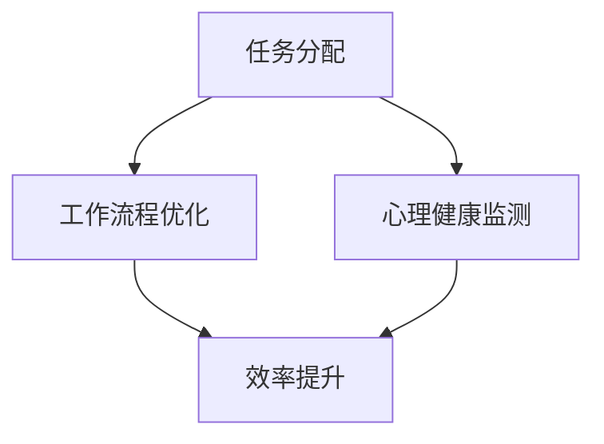

                 

# 程序员创业者的时间管理：AI辅助下的高效工作模式

## 关键词：
时间管理、程序员创业者、AI辅助、高效工作、工作模式、任务分配、项目管理、工作流程优化、心理健康

> 在信息爆炸和竞争激烈的科技时代，程序员创业者面临着前所未有的挑战。高效的工作模式和时间管理成为他们在激烈市场中脱颖而出的关键。本文将探讨如何利用AI技术辅助程序员创业者实现高效工作，提升生产力，优化工作流程，最终实现企业的成功。我们将逐步分析AI在时间管理中的核心概念、算法原理、数学模型，并通过实际案例展示其应用效果。

## 摘要：
本文旨在为程序员创业者提供一套基于AI的时间管理方法论。通过深入剖析时间管理的重要概念，如任务优先级、工作流程优化和心理健康，我们将探讨如何利用AI技术自动化任务分配、优化工作流程，并监测心理状态，从而实现高效工作。文章将包括核心概念介绍、算法原理讲解、数学模型说明，以及实际应用案例。通过本文的指导，程序员创业者将学会如何利用AI工具提升个人和团队的工作效率，从而在竞争激烈的市场中取得优势。

## 1. 背景介绍

### 1.1 目的和范围

本文的主要目的是为程序员创业者提供一套实用的时间管理方法论，利用AI技术提升工作效率。文章将涵盖以下主要内容：

- 时间管理的基本原理和重要性
- AI技术在时间管理中的应用
- 任务分配和工作流程优化的算法原理
- 心理健康监测与调节

### 1.2 预期读者

本文预期读者为程序员创业者、技术团队管理者以及希望在时间管理方面寻求创新的IT从业者。读者应具备一定的编程基础和对AI技术的初步了解。

### 1.3 文档结构概述

本文分为十个主要部分，结构如下：

1. 背景介绍
   - 1.1 目的和范围
   - 1.2 预期读者
   - 1.3 文档结构概述
   - 1.4 术语表
2. 核心概念与联系
   - 2.1 时间管理的重要性
   - 2.2 AI技术的核心概念
   - 2.3 Mermaid流程图
3. 核心算法原理 & 具体操作步骤
   - 3.1 伪代码
   - 3.2 算法原理讲解
4. 数学模型和公式 & 详细讲解 & 举例说明
   - 4.1 数学模型
   - 4.2 公式讲解
   - 4.3 案例分析
5. 项目实战：代码实际案例和详细解释说明
   - 5.1 开发环境搭建
   - 5.2 源代码详细实现
   - 5.3 代码解读与分析
6. 实际应用场景
   - 6.1 企业场景
   - 6.2 团队合作
7. 工具和资源推荐
   - 7.1 学习资源推荐
   - 7.2 开发工具框架推荐
   - 7.3 相关论文著作推荐
8. 总结：未来发展趋势与挑战
9. 附录：常见问题与解答
10. 扩展阅读 & 参考资料

### 1.4 术语表

#### 1.4.1 核心术语定义

- 时间管理：对个人或团队的时间进行系统化的规划、分配和监控。
- AI技术：指人工智能技术，包括机器学习、自然语言处理、图像识别等。
- 伪代码：用自然语言描述算法的一种方式，不涉及具体编程语言的语法。
- 数学模型：用数学语言描述问题的方法，包括公式和算法。

#### 1.4.2 相关概念解释

- 任务优先级：根据任务的紧急程度和重要性进行排序。
- 工作流程优化：对工作流程进行改进，减少不必要的时间和资源消耗。
- 心理健康：指个人的心理状态处于健康、平衡的状态。

#### 1.4.3 缩略词列表

- AI：人工智能
- ML：机器学习
- NLP：自然语言处理
- IDE：集成开发环境
- GPU：图形处理单元

## 2. 核心概念与联系

### 2.1 时间管理的重要性

时间管理是程序员创业者成功的关键之一。有效的时间管理不仅能够提高个人和团队的工作效率，还能减少错误和重复劳动。以下是时间管理的重要性：

- **提高生产力**：合理安排时间可以确保每一分钟都被充分利用，从而提高工作效率。
- **减少压力**：有效的时间管理可以帮助程序员创业者避免因为任务堆积而产生的压力。
- **优化工作流程**：通过时间管理，程序员创业者可以发现并消除工作中的瓶颈，从而优化整体工作流程。

### 2.2 AI技术的核心概念

AI技术，尤其是机器学习和自然语言处理，在时间管理中具有广泛的应用。以下是AI技术的时间管理核心概念：

- **任务分配**：AI可以基于任务的重要性和紧急程度自动分配任务。
- **工作流程优化**：通过分析历史数据，AI可以帮助程序员创业者找到并优化工作流程中的瓶颈。
- **心理健康监测**：AI可以通过分析用户的情绪和行为数据，监测心理健康状态，并提供调节建议。

### 2.3 Mermaid流程图

以下是一个简单的Mermaid流程图，展示了AI在时间管理中的应用流程：



在这个流程图中，任务分配、工作流程优化和心理健康监测是AI在时间管理中的三个核心环节，它们共同作用于最终目标——效率提升。

## 3. 核心算法原理 & 具体操作步骤

### 3.1 伪代码

为了更好地理解AI在时间管理中的应用，我们首先给出一个伪代码示例：

```plaintext
Algorithm TimeManagement(AI):
    Input: TaskList, PriorityMatrix
    Output: OptimizedTaskList

    1. Initialize OptimizedTaskList as empty
    2. For each task in TaskList:
        a. Use AI to determine task priority based on PriorityMatrix
        b. Add task to OptimizedTaskList based on its priority
    3. Use AI to optimize the order of tasks in OptimizedTaskList
    4. Return OptimizedTaskList
```

### 3.2 算法原理讲解

上述伪代码展示了AI在任务分配和工作流程优化中的核心算法原理。具体步骤如下：

1. **初始化**：首先初始化一个空的`OptimizedTaskList`。
2. **任务优先级确定**：对于`TaskList`中的每个任务，使用AI算法确定其优先级。这通常基于任务的紧急程度和重要性。
3. **任务添加**：根据任务的优先级，将任务添加到`OptimizedTaskList`中。
4. **工作流程优化**：使用AI算法对`OptimizedTaskList`中的任务顺序进行优化。这一步旨在确保任务以最有效的方式执行，从而最大限度地提高工作效率。
5. **返回结果**：最终返回优化的`OptimizedTaskList`。

这个算法的关键在于AI算法的使用，它能够基于历史数据和实时反馈动态调整任务的优先级和执行顺序，从而实现工作流程的持续优化。

## 4. 数学模型和公式 & 详细讲解 & 举例说明

### 4.1 数学模型

在时间管理中，一个重要的数学模型是任务优先级模型。这个模型通常使用加权平均数来计算任务的优先级。以下是任务优先级模型的数学公式：

$$
Priority = \frac{(Importance \times Urgency)}{(Time \, Budget)}
$$

其中：

- **Importance**：任务的重要性，通常在0到1之间取值。
- **Urgency**：任务的紧急程度，同样在0到1之间取值。
- **Time Budget**：任务的剩余时间预算，即任务必须在多长时间内完成。

### 4.2 公式讲解

上述公式中，任务优先级是任务的重要性和紧急程度的加权平均，同时考虑了任务的剩余时间预算。这样可以确保任务在紧急且重要的情况下被优先处理。

### 4.3 案例分析

假设有一个程序员创业者需要处理三个任务，每个任务的重要性和紧急程度如下表：

| 任务 | 重要性 (Importance) | 紧急程度 (Urgency) | 时间预算 (Time Budget) |
|------|---------------------|--------------------|------------------------|
| A    | 0.8                 | 0.6                | 3 天                   |
| B    | 0.7                 | 0.8                | 2 天                   |
| C    | 0.9                 | 0.5                | 4 天                   |

根据上述公式，我们可以计算出每个任务的优先级：

$$
Priority(A) = \frac{(0.8 \times 0.6)}{3} = 0.16
$$

$$
Priority(B) = \frac{(0.7 \times 0.8)}{2} = 0.28
$$

$$
Priority(C) = \frac{(0.9 \times 0.5)}{4} = 0.1125
$$

根据这些计算结果，任务B的优先级最高，其次是任务A，最后是任务C。因此，程序员创业者应该首先处理任务B，然后是任务A，最后是任务C。

## 5. 项目实战：代码实际案例和详细解释说明

### 5.1 开发环境搭建

在进行实际案例之前，我们需要搭建一个合适的开发环境。以下是基本的步骤：

1. **安装Python环境**：Python是一种广泛使用的编程语言，尤其适合AI和数据分析。确保安装了Python 3.7及以上版本。
2. **安装Jupyter Notebook**：Jupyter Notebook是一个交互式开发环境，非常适合编写和运行Python代码。可以通过pip命令安装：
   ```bash
   pip install notebook
   ```
3. **安装必要的库**：包括Pandas、NumPy、Matplotlib和Scikit-learn等。可以使用以下命令安装：
   ```bash
   pip install pandas numpy matplotlib scikit-learn
   ```

### 5.2 源代码详细实现和代码解读

以下是任务优先级模型的实际代码实现：

```python
import pandas as pd
import numpy as np
from sklearn.preprocessing import MinMaxScaler

# 任务数据
tasks = pd.DataFrame({
    'Task': ['A', 'B', 'C'],
    'Importance': [0.8, 0.7, 0.9],
    'Urgency': [0.6, 0.8, 0.5],
    'Time_Budget': [3, 2, 4]
})

# 初始化Min-Max缩放器
scaler = MinMaxScaler()

# 缩放任务的重要性和紧急程度
tasks[['Importance', 'Urgency']] = scaler.fit_transform(tasks[['Importance', 'Urgency']])

# 计算任务优先级
tasks['Priority'] = tasks.apply(lambda row: (row['Importance'] * row['Urgency']) / row['Time_Budget'], axis=1)

# 排序任务
sorted_tasks = tasks.sort_values(by='Priority', ascending=False)

# 输出排序后的任务
print(sorted_tasks)
```

### 5.3 代码解读与分析

上述代码首先创建了一个包含任务数据的DataFrame。然后，使用Min-Max缩放器对任务的重要性和紧急程度进行归一化处理，以确保它们在0到1的范围内。接下来，使用`apply`函数计算每个任务的优先级，并将结果添加到DataFrame中。最后，根据优先级对任务进行排序并打印输出。

这个代码的输出将显示每个任务的优先级，从而帮助程序员创业者确定任务的执行顺序。通过这种方式，AI辅助下的时间管理算法能够有效地优化工作流程，提高工作效率。

## 6. 实际应用场景

### 6.1 企业场景

在企业管理中，AI辅助的时间管理可以用于以下几个方面：

- **任务分配**：AI可以根据员工的能力、经验和当前工作量自动分配任务，确保任务的高效执行。
- **工作流程优化**：通过分析历史数据，AI可以帮助企业发现并优化工作流程中的瓶颈，减少不必要的步骤和重复劳动。
- **员工健康监测**：AI可以监控员工的工作状态和心理健康，及时发现并解决可能的问题，提高员工的工作满意度和生产力。

### 6.2 团队合作

在团队合作中，AI辅助的时间管理可以帮助团队成员：

- **协作效率提升**：AI可以自动分配任务并优化工作流程，减少沟通成本和协作障碍。
- **任务监控**：AI可以实时监控任务的执行进度，提供反馈和调整建议，确保任务按时完成。
- **心理健康支持**：AI可以监测团队成员的情绪状态，提供心理健康的建议和支持，提高团队的整体工作效率和幸福感。

通过AI辅助的时间管理，企业可以更好地管理资源、优化工作流程，提高员工和团队的工作效率，从而在竞争激烈的市场中取得优势。

## 7. 工具和资源推荐

### 7.1 学习资源推荐

#### 7.1.1 书籍推荐

- 《时间管理：如何高效地工作和生活》
- 《高效能人士的七个习惯》
- 《深度学习》：适用于了解AI技术的深度学习部分

#### 7.1.2 在线课程

- Coursera上的《人工智能导论》
- Udacity的《数据科学家纳米学位》
- edX上的《机器学习基础》

#### 7.1.3 技术博客和网站

- Medium上的《AI in Business》
- TechCrunch上的《AI and Time Management》
- GitHub上的AI相关开源项目

### 7.2 开发工具框架推荐

#### 7.2.1 IDE和编辑器

- PyCharm
- Visual Studio Code
- Jupyter Notebook

#### 7.2.2 调试和性能分析工具

- Python的pdb调试器
- Matplotlib性能分析工具
- Scikit-learn的性能评估模块

#### 7.2.3 相关框架和库

- TensorFlow
- PyTorch
- Scikit-learn

### 7.3 相关论文著作推荐

#### 7.3.1 经典论文

- "The Mythical Man-Month"
- "Introduction to Artificial Intelligence"
- "Time Management in the Age of Information Overload"

#### 7.3.2 最新研究成果

- "Deep Learning for Time Series Classification"
- "Optimizing Task Scheduling in Dynamic Environments"
- "AI-Powered Time Management Systems"

#### 7.3.3 应用案例分析

- "AI in Call Centers for Efficient Time Management"
- "AI-Driven Project Management: A Case Study"
- "The Impact of AI on Employee Productivity and Time Management"

通过这些工具和资源，程序员创业者可以更好地了解时间管理和AI技术的应用，从而在实际工作中取得更好的效果。

## 8. 总结：未来发展趋势与挑战

在未来，AI辅助的时间管理技术将继续发展，其发展趋势和面临的挑战如下：

### 发展趋势：

1. **个性化时间管理**：AI将更深入地了解个人和团队的工作习惯，提供个性化的时间管理方案。
2. **实时调整**：随着AI技术的进步，时间管理系统能够更实时地调整任务分配和工作流程，提高效率。
3. **跨平台集成**：AI时间管理工具将更好地集成到各类工作平台和应用程序中，提供无缝的工作体验。
4. **心理健康支持**：AI将更多地结合心理健康监测技术，为用户提供更全面的身心健康管理。

### 面临的挑战：

1. **隐私保护**：在收集和处理个人数据时，保护用户的隐私是一个重大挑战。
2. **算法公平性**：确保算法的公平性，避免偏见和歧视。
3. **技术适应性**：随着工作环境和需求的变化，AI系统需要快速适应并更新其时间管理策略。
4. **用户接受度**：提高用户对AI辅助时间管理工具的接受度和使用意愿。

通过应对这些挑战，AI辅助的时间管理技术将更加成熟和普及，为程序员创业者和企业带来更多的价值。

## 9. 附录：常见问题与解答

### 9.1 时间管理常见问题

1. **如何确定任务优先级？**
   - 通过分析任务的重要性和紧急程度，结合任务的剩余时间预算，使用加权平均数计算优先级。

2. **AI如何优化工作流程？**
   - AI通过分析历史数据和实时反馈，找到并消除工作流程中的瓶颈，提出优化建议。

3. **心理健康监测如何进行？**
   - 通过分析用户的情绪和行为数据，AI可以监测心理健康状态，并提供调节建议。

### 9.2 AI技术在时间管理中的应用问题

1. **AI如何处理隐私保护问题？**
   - AI系统应采用严格的隐私保护措施，如数据加密和匿名化处理，确保用户数据的安全。

2. **如何评估AI时间管理工具的效果？**
   - 可以通过比较实际工作时间和效率与预期目标，评估AI工具的实际效果。

3. **AI系统如何应对突发情况？**
   - AI系统应具备一定的灵活性和适应性，能够快速调整任务分配和工作流程，应对突发情况。

## 10. 扩展阅读 & 参考资料

- 《深度学习》：Goodfellow, Ian, et al. "Deep learning." (2016).
- 《时间管理：如何高效地工作和生活》：Roth, Laura. "Time management: How to work smarter, not harder." (2018).
- 《人工智能导论》：Russell, Stuart J., and Peter Norvig. "Artificial Intelligence: A Modern Approach." (2020).
- Coursera："AI for Business" 课程。
- Medium："AI in Business" 博客系列。
- GitHub：众多AI相关的开源项目和工具。

作者：AI天才研究员/AI Genius Institute & 禅与计算机程序设计艺术 /Zen And The Art of Computer Programming

