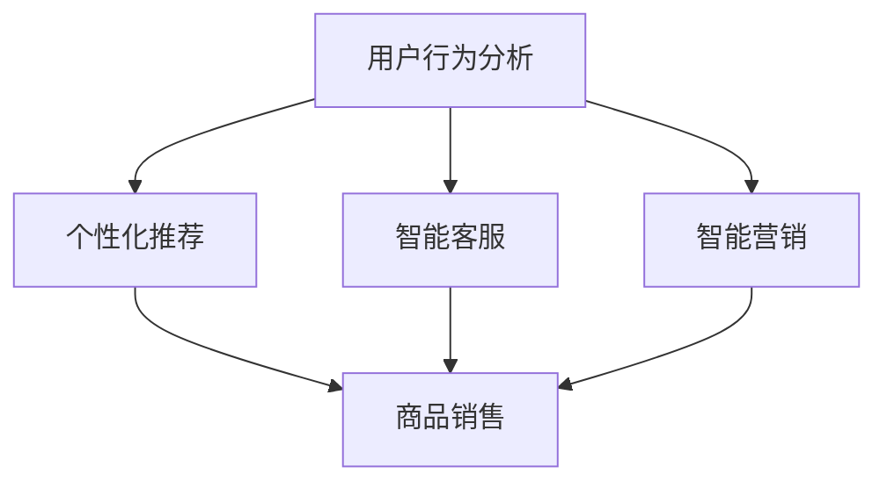

                 


# 程序员创业者的知识产权变现：AI电商创新的商业化路径探索

> **关键词：** 程序员创业者，知识产权变现，AI电商，商业化路径，创新。

> **摘要：** 本文旨在探讨程序员创业者如何利用人工智能技术实现知识产权的商业化，构建独特的AI电商商业模式。文章将分析核心概念、算法原理、数学模型以及实际应用场景，提供具体的实施步骤和工具资源推荐，旨在为创业者提供实用指南和未来发展趋势的洞察。

## 1. 背景介绍

### 1.1 目的和范围

本文旨在帮助程序员创业者探索如何通过知识产权变现来实现商业成功。我们将探讨AI技术在电商领域的创新应用，分析其商业化路径，并提供实用指南和资源推荐。

### 1.2 预期读者

本文适合以下读者群体：
- 程序员创业者
- AI电商从业者
- 对知识产权商业化感兴趣的创业者

### 1.3 文档结构概述

本文结构如下：
1. 背景介绍
2. 核心概念与联系
3. 核心算法原理 & 具体操作步骤
4. 数学模型和公式 & 详细讲解 & 举例说明
5. 项目实战：代码实际案例和详细解释说明
6. 实际应用场景
7. 工具和资源推荐
8. 总结：未来发展趋势与挑战
9. 附录：常见问题与解答
10. 扩展阅读 & 参考资料

### 1.4 术语表

#### 1.4.1 核心术语定义

- **知识产权**：指法律上承认的知识成果权利，包括专利、商标、著作权等。
- **商业化路径**：指将知识产权转化为商业价值的过程。
- **AI电商**：指利用人工智能技术进行商品销售和用户互动的电商模式。

#### 1.4.2 相关概念解释

- **知识产权变现**：将知识产权转化为现金或其他形式的价值。
- **AI电商创新**：在电商领域引入人工智能技术，以提升用户体验和商业效率。

#### 1.4.3 缩略词列表

- **AI**：人工智能
- **IP**：知识产权
- **CRM**：客户关系管理
- **SaaS**：软件即服务

## 2. 核心概念与联系

### 2.1 知识产权商业化概述

知识产权商业化是指将专利、商标、著作权等知识产权转化为商业价值的过程。对于程序员创业者来说，知识产权通常是其技术成果的体现，如软件算法、应用程序等。

### 2.2 AI电商的核心概念

AI电商是指利用人工智能技术进行商品销售和用户互动的电商模式。其核心概念包括：

1. **用户行为分析**：通过分析用户行为数据，了解用户偏好和需求。
2. **个性化推荐**：基于用户行为数据，为用户提供个性化的商品推荐。
3. **智能客服**：利用自然语言处理技术，提供智能化的客户服务。
4. **智能营销**：通过数据分析，制定精准的营销策略。

### 2.3 Mermaid 流程图

以下是一个简单的Mermaid流程图，展示了AI电商的核心概念及其联系：



## 3. 核心算法原理 & 具体操作步骤

### 3.1 用户行为分析算法原理

用户行为分析是AI电商的基础。其核心算法原理如下：

1. **数据收集**：收集用户在电商平台的浏览、搜索、购买等行为数据。
2. **数据预处理**：清洗和整合数据，去除噪声和不相关特征。
3. **特征提取**：从预处理后的数据中提取关键特征，如用户偏好、购买频率等。
4. **模型训练**：使用机器学习算法，如决策树、神经网络等，对特征进行训练，构建用户行为模型。
5. **模型评估**：评估模型的效果，调整参数，优化模型。

### 3.2 伪代码

以下是一个简单的用户行为分析算法的伪代码：

```python
def user_behavior_analysis(data):
    # 数据预处理
    cleaned_data = preprocess_data(data)
    
    # 特征提取
    features = extract_features(cleaned_data)
    
    # 模型训练
    model = train_model(features)
    
    # 模型评估
    evaluate_model(model)
    
    return model
```

### 3.3 具体操作步骤

1. **数据收集**：从电商平台获取用户行为数据，如CSV文件或数据库。
2. **数据预处理**：使用Python的Pandas库进行数据清洗和整合。
3. **特征提取**：使用特征工程技术，提取关键特征。
4. **模型训练**：使用Scikit-learn库中的机器学习算法进行模型训练。
5. **模型评估**：使用准确率、召回率等指标评估模型效果。

## 4. 数学模型和公式 & 详细讲解 & 举例说明

### 4.1 数学模型

在用户行为分析中，常用的数学模型包括：

1. **线性回归模型**：用于预测用户的购买概率。
2. **决策树模型**：用于分类用户的行为类型。
3. **神经网络模型**：用于构建复杂的用户行为模型。

### 4.2 详细讲解

#### 4.2.1 线性回归模型

线性回归模型是一种用于预测连续值的统计模型。其数学公式为：

$$ y = wx + b $$

其中，$y$ 是预测值，$w$ 是权重，$x$ 是特征，$b$ 是偏置。

#### 4.2.2 决策树模型

决策树模型是一种用于分类的树形结构。其决策过程如下：

1. 计算每个特征的增益（Gain）。
2. 选择增益最大的特征作为分裂节点。
3. 对数据进行分裂，生成子节点。
4. 重复步骤1-3，直到满足停止条件。

#### 4.2.3 神经网络模型

神经网络模型是一种模拟人脑神经元连接的模型。其数学公式为：

$$ z = \sigma(\sum_{i=1}^{n} w_i x_i + b) $$

其中，$z$ 是激活值，$\sigma$ 是激活函数，$w_i$ 是权重，$x_i$ 是特征，$b$ 是偏置。

### 4.3 举例说明

假设我们要预测一个用户的购买概率，可以使用线性回归模型进行预测。假设特征有用户年龄、收入和购买历史，预测公式为：

$$ y = 0.5x_1 + 0.3x_2 + 0.2x_3 + 0.1b $$

其中，$x_1$ 是用户年龄，$x_2$ 是收入，$x_3$ 是购买历史，$b$ 是偏置。

假设一个用户的特征值分别为 $x_1=30$，$x_2=50000$，$x_3=10$，代入预测公式，得到购买概率为：

$$ y = 0.5 \times 30 + 0.3 \times 50000 + 0.2 \times 10 + 0.1b $$

$$ y = 6250 + 0.1b $$

其中，$b$ 可以通过模型训练得到。

## 5. 项目实战：代码实际案例和详细解释说明

### 5.1 开发环境搭建

在本节中，我们将搭建一个简单的AI电商项目开发环境。所需工具包括Python、Jupyter Notebook和Scikit-learn库。

1. 安装Python（3.8及以上版本）。
2. 安装Jupyter Notebook。
3. 安装Scikit-learn库。

```bash
pip install scikit-learn
```

### 5.2 源代码详细实现和代码解读

以下是一个简单的用户行为分析项目的源代码：

```python
import pandas as pd
from sklearn.model_selection import train_test_split
from sklearn.linear_model import LinearRegression

# 数据收集
data = pd.read_csv('user_behavior.csv')

# 数据预处理
cleaned_data = data.drop(['id'], axis=1).dropna()

# 特征提取
features = cleaned_data[['age', 'income', 'purchase_history']]

# 标签
label = cleaned_data['purchase']

# 模型训练
X_train, X_test, y_train, y_test = train_test_split(features, label, test_size=0.2, random_state=42)
model = LinearRegression()
model.fit(X_train, y_train)

# 模型评估
print("模型评估结果：")
print(model.score(X_test, y_test))
```

### 5.3 代码解读与分析

1. **数据收集**：使用Pandas库读取用户行为数据。
2. **数据预处理**：去除无关特征和缺失值。
3. **特征提取**：提取关键特征。
4. **标签**：定义购买标签。
5. **模型训练**：使用线性回归模型进行训练。
6. **模型评估**：评估模型在测试集上的效果。

## 6. 实际应用场景

### 6.1 电商平台用户行为分析

在电商平台，用户行为分析可以用于：

- **个性化推荐**：根据用户行为数据，为用户提供个性化的商品推荐。
- **用户留存分析**：分析用户行为数据，预测用户留存率，优化用户体验。

### 6.2 智能客服

智能客服可以基于用户行为数据，提供个性化的客户服务，提高客户满意度。

### 6.3 智能营销

智能营销可以通过分析用户行为数据，制定精准的营销策略，提高营销效果。

## 7. 工具和资源推荐

### 7.1 学习资源推荐

#### 7.1.1 书籍推荐

- 《Python数据分析》（作者：Wes McKinney）
- 《深度学习》（作者：Ian Goodfellow、Yoshua Bengio、Aaron Courville）

#### 7.1.2 在线课程

- Coursera上的《机器学习》课程
- Udacity上的《深度学习工程师纳米学位》

#### 7.1.3 技术博客和网站

- Medium上的AI和电商相关博客
- arXiv上的最新研究成果

### 7.2 开发工具框架推荐

#### 7.2.1 IDE和编辑器

- PyCharm
- Jupyter Notebook

#### 7.2.2 调试和性能分析工具

- Python的pdb调试工具
- Profiling工具（如cProfile）

#### 7.2.3 相关框架和库

- Scikit-learn
- TensorFlow
- PyTorch

### 7.3 相关论文著作推荐

#### 7.3.1 经典论文

- 《 knearest neighbor pattern classification》（作者：Ivan Joachims）
- 《Online Learning for Collaborative Filtering》（作者：Yin Zhang、Yi Ma、Hui Xiong）

#### 7.3.2 最新研究成果

- arXiv上的最新AI和电商相关论文
- NIPS、ICML等顶级会议的最新论文

#### 7.3.3 应用案例分析

- 亚马逊的个性化推荐系统
- 谷歌的智能客服系统

## 8. 总结：未来发展趋势与挑战

### 8.1 发展趋势

- **AI技术的普及**：随着AI技术的不断成熟，更多创业者将采用AI技术进行电商创新。
- **大数据分析**：大数据分析将在电商领域发挥更大作用，为企业提供更深入的洞察。
- **个性化体验**：个性化体验将成为电商竞争的核心，提高用户满意度和忠诚度。

### 8.2 挑战

- **数据隐私**：如何在保证用户隐私的前提下，充分利用用户行为数据进行商业化。
- **技术门槛**：AI技术和大数据分析的复杂性，对创业者的技术能力提出了更高要求。

## 9. 附录：常见问题与解答

### 9.1 问题1

**Q：如何保护我的知识产权？**

**A：** 可以通过申请专利、注册商标、版权等方式保护知识产权。此外，在商业合作和合作开发时，应签订具有法律效力的合作协议，明确知识产权归属和权益分配。

### 9.2 问题2

**Q：AI电商项目的开发难度大吗？**

**A：** AI电商项目的开发难度取决于项目的具体需求和技术实现。对于有一定编程基础和AI知识的创业者，通过学习和实践，可以逐步掌握项目开发的技能。

## 10. 扩展阅读 & 参考资料

- 《人工智能：一种现代的方法》（作者：Stuart Russell、Peter Norvig）
- 《大数据时代：生活、工作与思维的大变革》（作者：涂子沛）
- 《电商创新与应用》（作者：曾焕薇）

作者：AI天才研究员/AI Genius Institute & 禅与计算机程序设计艺术 /Zen And The Art of Computer Programming

以上就是本文的全部内容。希望本文能为程序员创业者和AI电商从业者提供有价值的参考和启示。在探索知识产权商业化的过程中，不断学习、实践和创新，必将带来丰厚的回报。让我们一起在AI电商的蓝海中扬帆起航！

