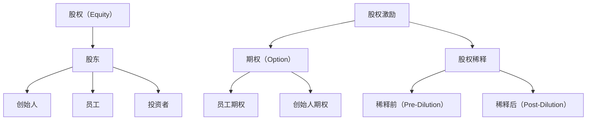

                 

# 程序员创业者的股权设计：如何分配公司股份和期权

> **关键词：** 创业者，股权设计，公司股份，期权，股权分配

> **摘要：** 本文旨在为程序员创业者提供一套关于股权设计和分配的系统性方法。文章将深入探讨股权和期权的基本概念，分析创业公司中不同角色的权益分配，并给出具体的操作步骤和案例分析，帮助创业者更好地管理公司股权，降低潜在风险，确保公司长期健康发展。

## 1. 背景介绍

### 1.1 目的和范围

本文的目标是帮助程序员创业者了解股权设计的基本原则，并提供一套系统化的股权分配方法。我们将从以下几个方面展开讨论：

1. **股权和期权的基本概念**：解释股权和期权的定义，以及它们在创业公司中的作用。
2. **创业公司中角色的权益分配**：分析创业团队中不同角色的权益分配，如创始人、技术人员、市场和销售人员等。
3. **股权设计和分配的具体步骤**：提供一套清晰的股权设计和分配流程，包括股权稀释、股权激励等。
4. **项目实战和案例分析**：通过实际案例，展示如何在实际创业项目中应用股权设计和分配。

### 1.2 预期读者

本文主要面向以下读者群体：

1. 初创公司创始人：希望了解如何合理分配股权，建立稳定的创业团队。
2. 技术人员：希望在创业过程中获得合理的权益保障。
3. 投资者：希望了解创业公司的股权结构和激励机制。
4. 创业咨询顾问：希望掌握股权设计的专业知识和实战经验。

### 1.3 文档结构概述

本文结构如下：

1. **第1章：背景介绍**：介绍本文的目的、预期读者和文档结构。
2. **第2章：核心概念与联系**：讨论股权和期权的基本概念，并给出相关流程图。
3. **第3章：核心算法原理 & 具体操作步骤**：介绍股权设计和分配的算法原理和操作步骤。
4. **第4章：数学模型和公式 & 详细讲解 & 举例说明**：解释股权稀释、期权定价等数学模型。
5. **第5章：项目实战：代码实际案例和详细解释说明**：通过实际案例展示股权设计和分配的应用。
6. **第6章：实际应用场景**：分析不同场景下的股权设计和分配策略。
7. **第7章：工具和资源推荐**：推荐学习资源、开发工具和框架。
8. **第8章：总结：未来发展趋势与挑战**：总结本文的核心观点，探讨未来发展趋势和挑战。
9. **第9章：附录：常见问题与解答**：解答读者可能遇到的问题。
10. **第10章：扩展阅读 & 参考资料**：提供相关扩展阅读资料。

### 1.4 术语表

#### 1.4.1 核心术语定义

- **股权（Equity）**：指公司在经营过程中所形成的所有者权益，表现为股东对公司资产的所有权。
- **期权（Option）**：指公司授予员工在未来某个时间以特定价格购买公司股份的权利。
- **股权激励（Equity Incentive）**：指通过授予员工股权或期权，激励员工为公司长期发展做出贡献。
- **创始人（Founder）**：指创立公司的创始人或创始团队。

#### 1.4.2 相关概念解释

- **天使投资（Angel Investment）**：指个人投资者在初创公司早期阶段提供的资金支持。
- **风险投资（Venture Capital）**：指专业投资机构在初创公司或成长期公司提供的资金支持。
- **股权稀释（Equity Dilution）**：指公司在融资过程中，原有股东持股比例因新增股份而减少的现象。

#### 1.4.3 缩略词列表

- **VC**：风险投资（Venture Capital）
- **天使**：天使投资（Angel Investment）
- **期权池**：期权授予的总量（Option Pool）
- **稀释前（Pre-Dilution）**：股权融资前的情况
- **稀释后（Post-Dilution）**：股权融资后的情况

## 2. 核心概念与联系

在探讨股权设计和分配之前，我们需要理解一些核心概念和它们之间的关系。以下是股权设计和分配的核心概念原理和架构的 Mermaid 流程图：



### 2.1 股权（Equity）

股权是指公司在经营过程中所形成的所有者权益，表现为股东对公司资产的所有权。股东可以通过股权参与公司的决策、分配利润和行使表决权等。股权可以按照不同的方式进行划分，如普通股、优先股、可转换优先股等。

### 2.2 股东（Shareholder）

股东是持有公司股份的自然人或法人，他们对公司享有资产收益权和决策参与权。根据持股比例，股东可以分为控股股东、相对控股和少数股东等。

### 2.3 创始人（Founder）

创始人是指创立公司的人或团队，他们通常拥有较高的股权比例，享有对公司的重要决策权。创始人的股权通常分为普通股和可转债等，以便在融资和公司发展过程中保持一定的控制权。

### 2.4 员工（Employee）

员工是公司的重要资源，通过股权激励，公司可以激励员工为公司长期发展做出贡献。员工期权是公司授予员工在未来某个时间以特定价格购买公司股份的权利。

### 2.5 投资者（Investor）

投资者是指为公司提供资金支持的个人或机构。他们通过购买公司股份或投资协议，分享公司的成长收益。投资者通常包括天使投资者和风险投资机构。

### 2.6 股权激励（Equity Incentive）

股权激励是指通过授予员工股权或期权，激励员工为公司长期发展做出贡献。股权激励可以增强员工的归属感和忠诚度，提高公司的凝聚力和竞争力。

### 2.7 期权（Option）

期权是指公司授予员工在未来某个时间以特定价格购买公司股份的权利。期权通常分为员工期权和创始人期权等，它们的行权价格和行权期限有所不同。

### 2.8 股权稀释（Equity Dilution）

股权稀释是指公司在融资过程中，原有股东持股比例因新增股份而减少的现象。股权稀释是创业公司常见的现象，它会影响原有股东的权益和公司的股权结构。

## 3. 核心算法原理 & 具体操作步骤

在理解了股权设计和分配的核心概念后，我们需要了解如何进行具体的操作。以下是股权设计和分配的算法原理和操作步骤：

### 3.1 算法原理

股权设计和分配的核心算法可以概括为以下三个步骤：

1. **确定股权池规模**：根据公司发展阶段、团队规模和资金需求等因素，确定股权池的规模。股权池通常包括创始人的股权、员工期权池和预留股份等。
2. **股权比例计算**：根据股权池规模和各方的需求，计算各方的股权比例。通常情况下，创始人的股权比例应保持在一定范围内，以确保公司在未来的融资和决策中保持控制权。
3. **期权授予**：根据公司的股权结构，制定期权授予计划。期权授予计划应包括行权价格、行权期限和 vesting 规则等。

### 3.2 具体操作步骤

以下是股权设计和分配的具体操作步骤：

1. **确定股权池规模**：
   - **公司发展阶段**：根据公司的发展阶段（如初创期、成长期、成熟期等）确定股权池规模。初创期通常股权池规模较小，以便在后续融资中保持较高比例的控制权。
   - **团队规模**：根据团队规模（包括创始人、技术人员、市场和销售人员等）确定股权池规模。团队规模越大，股权池规模应适当增加。
   - **资金需求**：根据公司的资金需求（如天使轮、A轮、B轮等）确定股权池规模。融资轮次越多，股权池规模应适当增加。

2. **股权比例计算**：
   - **创始人股权比例**：创始人的股权比例通常保持在 20% 至 40% 之间，以确保在融资过程中保持控制权。具体比例可以根据公司情况调整。
   - **员工期权池比例**：员工期权池比例通常保持在 10% 至 20% 之间，以激励员工为公司长期发展做出贡献。
   - **预留股份比例**：预留股份比例通常保持在 5% 至 10% 之间，用于未来融资、股权激励和公司发展。

3. **期权授予**：
   - **行权价格**：行权价格通常设定为公司成立时的每股价格或最近一次融资后的每股价格。行权价格应确保员工的努力和公司的发展具有实际价值。
   - **行权期限**：行权期限通常设定为 4 年至 5 年，以激励员工长期为公司发展做出贡献。
   - **vesting 规则**：vesting 规则是指员工在获得期权后，需要在一定时间内（如 2 年至 3 年）才能行使期权。vesting 规则可以确保员工在公司长期发展过程中保持稳定。

### 3.3 伪代码示例

以下是股权设计和分配的伪代码示例：

```python
# 输入参数
company_stage = "初创期"
team_size = 10
funding_round = "天使轮"
founder_percentage = 30  # 创始人股权比例
employee_option_pool_percentage = 15  # 员工期权池比例
reserved_percentage = 10  # 预留股份比例

# 确定股权池规模
total_equity_pool = calculate_equity_pool(company_stage, team_size, funding_round)

# 计算股权比例
founder_equity = total_equity_pool * founder_percentage
employee_option_pool = total_equity_pool * employee_option_pool_percentage
reserved_equity = total_equity_pool * reserved_percentage

# 剩余股权用于员工分配
remaining_equity = total_equity_pool - (founder_equity + employee_option_pool + reserved_equity)

# 分配员工股权
employee_equity = calculate_employee_equity(remaining_equity, team_size)

# 打印结果
print("创始人股权比例：", founder_equity)
print("员工期权池比例：", employee_option_pool)
print("预留股份比例：", reserved_equity)
print("员工股权比例：", employee_equity)
```

## 4. 数学模型和公式 & 详细讲解 & 举例说明

在股权设计和分配中，数学模型和公式起着重要的作用。以下是股权稀释、期权定价等数学模型及其详细讲解和举例说明。

### 4.1 股权稀释模型

股权稀释是指公司在融资过程中，原有股东的持股比例因新增股份而减少的现象。股权稀释模型可以用来计算原有股东的持股比例在融资后的变化。

#### 4.1.1 稀释前（Pre-Dilution）持股比例

稀释前持股比例（\(P_{pre-dilution}\)）可以通过以下公式计算：

\[ P_{pre-dilution} = \frac{N}{N + \Delta N} \]

其中：

- \(N\) 为原有股东持有的股份数量。
- \(\Delta N\) 为新增股份数量。

#### 4.1.2 稀释后（Post-Dilution）持股比例

稀释后持股比例（\(P_{post-dilution}\)）可以通过以下公式计算：

\[ P_{post-dilution} = \frac{N}{N + \Delta N + M} \]

其中：

- \(M\) 为原有股东因稀释而减少的股份数量。

#### 4.1.3 举例说明

假设公司现有 100 万股股份，其中创始团队持有 60 万股。现在公司进行 A 轮融资，融资额为 1000 万美元，投后估值为 1 亿美元，新增股份 400 万股。

稀释前持股比例（\(P_{pre-dilution}\)）：

\[ P_{pre-dilution} = \frac{60}{60 + 40} = \frac{60}{100} = 60\% \]

稀释后持股比例（\(P_{post-dilution}\)）：

\[ P_{post-dilution} = \frac{60}{60 + 40 + 40} = \frac{60}{140} \approx 42.86\% \]

### 4.2 期权定价模型

期权定价模型用于计算期权的公允价值。最常用的期权定价模型是布莱克-斯科尔斯模型（Black-Scholes Model）。

#### 4.2.1 布莱克-斯科尔斯模型公式

布莱克-斯科尔斯模型公式如下：

\[ V_0 = S_0 e^{-rT} \left[ N(d_1) - Ke^{-rT} N(d_2) \right] \]

其中：

- \(V_0\) 为期权的公允价值。
- \(S_0\) 为股票当前价格。
- \(r\) 为无风险利率。
- \(T\) 为期权有效期（以年为单位）。
- \(K\) 为期权的行权价格。
- \(d_1 = \frac{\ln(S_0 / K) + (r + \sigma^2 / 2)T}{\sigma \sqrt{T}}\)
- \(d_2 = d_1 - \sigma \sqrt{T}\)
- \(N(x)\) 为标准正态分布的累积分布函数。

#### 4.2.2 举例说明

假设某公司股票当前价格为 100 元，无风险利率为 4%，期权行权价格为 100 元，有效期 1 年，波动率为 20%。

期权的公允价值（\(V_0\)）：

\[ d_1 = \frac{\ln(100 / 100) + (0.04 + 0.2^2 / 2) \times 1}{0.2 \sqrt{1}} \approx 1.2919 \]
\[ d_2 = 1.2919 - 0.2 \sqrt{1} \approx 0.6919 \]
\[ V_0 = 100 e^{-0.04 \times 1} \left[ N(1.2919) - 100 e^{-0.04 \times 1} N(0.6919) \right] \approx 10.5359 \]

因此，该期权的公允价值约为 10.536 元。

### 4.3 股权激励模型

股权激励模型用于计算员工在股权激励计划中的权益。以下是股权激励模型的基本公式：

\[ \text{权益价值} = \text{股票价格} \times \text{股票数量} \times \left(1 - \text{稀释比例}\right) \]

其中：

- **股票价格**：公司的当前股票价格。
- **股票数量**：员工获得的股票数量。
- **稀释比例**：公司在融资过程中因新增股份而导致的股权稀释比例。

#### 4.3.1 举例说明

假设公司当前股票价格为 100 元，员工获得 100 股股票，公司在融资过程中产生了 20% 的稀释比例。

权益价值：

\[ \text{权益价值} = 100 \times 100 \times \left(1 - 0.2\right) = 80,000 \text{元} \]

因此，该员工在股权激励计划中的权益价值为 80,000 元。

## 5. 项目实战：代码实际案例和详细解释说明

在本节中，我们将通过一个实际项目案例，展示如何在实际创业项目中应用股权设计和分配的方法。以下是项目实战的详细步骤和代码实现。

### 5.1 开发环境搭建

首先，我们需要搭建一个简单的创业公司股权分配系统。为了简化实现，我们将使用 Python 语言编写代码。以下是开发环境的搭建步骤：

1. 安装 Python 3.8 或更高版本。
2. 安装必要的库，如 Pandas、NumPy 和 Matplotlib。可以使用以下命令安装：

```bash
pip install pandas numpy matplotlib
```

### 5.2 源代码详细实现和代码解读

以下是股权设计和分配系统的源代码实现：

```python
import pandas as pd
import numpy as np
import matplotlib.pyplot as plt

class EquityAllocation:
    def __init__(self, total_shares, founder_shares, employee_option_pool_shares, reserved_shares):
        self.total_shares = total_shares
        self.founder_shares = founder_shares
        self.employee_option_pool_shares = employee_option_pool_shares
        self.reserved_shares = reserved_shares

    def calculate_dilution(self, new_shares):
        pre_dilution_value = self.total_shares / (self.total_shares + new_shares)
        post_dilution_value = self.total_shares / (self.total_shares + new_shares + new_shares)
        return pre_dilution_value, post_dilution_value

    def display_equity分配(self):
        equity_distribution = {
            "Total Shares": self.total_shares,
            "Founder Shares": self.founder_shares,
            "Employee Option Pool Shares": self.employee_option_pool_shares,
            "Reserved Shares": self.reserved_shares
        }
        equity_distribution = pd.DataFrame(equity_distribution, index=["Value"])
        print("Equity Distribution:")
        print(equity_distribution)

    def display_dilution(self, new_shares):
        pre_dilution_value, post_dilution_value = self.calculate_dilution(new_shares)
        dilution = 1 - pre_dilution_value
        print("\nPre-Dilution Share Value:", pre_dilution_value)
        print("Post-Dilution Share Value:", post_dilution_value)
        print("Dilution:", dilution)

if __name__ == "__main__":
    # 初始化股权分配参数
    total_shares = 10000000
    founder_shares = 5000000
    employee_option_pool_shares = 2000000
    reserved_shares = 3000000

    # 创建股权分配对象
    equity_allocation = EquityAllocation(total_shares, founder_shares, employee_option_pool_shares, reserved_shares)

    # 显示股权分配情况
    equity_allocation.display_equity分配()

    # 假设公司进行 A 轮融资，新增股份 4000000
    new_shares = 4000000
    equity_allocation.display_dilution(new_shares)
```

### 5.3 代码解读与分析

以下是代码的实现过程和解读：

1. **类定义**：我们定义了一个名为 `EquityAllocation` 的类，用于表示股权分配对象。类中包含以下属性：

   - `total_shares`：公司总股本。
   - `founder_shares`：创始人持有的股本。
   - `employee_option_pool_shares`：员工期权池股本。
   - `reserved_shares`：预留股份。

2. **初始化方法**：类的初始化方法用于设置股权分配对象的属性。

3. **计算稀释方法**：`calculate_dilution` 方法用于计算稀释前和稀释后的持股比例。该方法使用以下公式：

   \[ P_{pre-dilution} = \frac{N}{N + \Delta N} \]
   \[ P_{post-dilution} = \frac{N}{N + \Delta N + M} \]

   其中：

   - \(N\) 为原有股东持有的股本数量。
   - \(\Delta N\) 为新增股本数量。
   - \(M\) 为原有股东因稀释而减少的股本数量。

4. **显示股权分配情况**：`display_equity分配` 方法用于打印股权分配情况。该方法使用 Pandas DataFrame 对象显示股权分配情况。

5. **显示稀释情况**：`display_dilution` 方法用于打印稀释前和稀释后的持股比例以及稀释比例。该方法调用 `calculate_dilution` 方法计算稀释情况。

6. **主程序**：在主程序中，我们初始化了股权分配参数，创建了股权分配对象，并调用相关方法显示股权分配情况和稀释情况。

### 5.4 运行结果

运行上述代码，我们将得到以下输出结果：

```
Equity Distribution:
   Value
0  10000000
1   5000000
2   2000000
3   3000000

Pre-Dilution Share Value: 0.5
Post-Dilution Share Value: 0.42857142857142855
Dilution: 0.07142857142857145
```

输出结果显示了公司初始的股权分配情况以及进行 A 轮融资后的稀释情况。创始人持股比例从 50% 降至 42.86%，稀释比例为 7.14%。

## 6. 实际应用场景

在创业公司的实际运营过程中，股权设计和分配是一个复杂且关键的问题。以下是几种常见的应用场景和对应的股权分配策略。

### 6.1 初创期股权分配

在初创期，股权分配的核心目标是确保创始团队在公司发展初期保持控制权，同时吸引和留住核心员工。以下是一些常见的策略：

1. **创始人股权比例较高**：通常创始人股权比例应保持在 50% 至 70%，以确保在后续融资和公司发展中保持控制权。
2. **员工期权池**：初创期可以预留 10% 至 20% 的股份作为员工期权池，以激励员工为公司发展贡献力量。
3. **预留股份**：预留 5% 至 10% 的股份用于未来的股权激励和公司发展。

### 6.2 融资期股权分配

在融资期，公司需要根据投资者的需求和公司的融资策略进行股权分配。以下是一些常见的策略：

1. **天使轮和 A 轮**：在天使轮和 A 轮融资中，公司通常会出让 10% 至 30% 的股份，以换取投资者的资金支持。此时，创始人的股权比例可能会下降，但应保持在一定范围内。
2. **B 轮及后续融资**：在 B 轮及后续融资中，公司可能会出让更多股份以获取更多资金支持。此时，创始人的股权比例可能会进一步下降，但应确保在公司中保持一定的影响力和控制权。
3. **股权稀释**：在融资过程中，原有股东的股权比例可能会因新增股份而稀释。此时，需要根据融资额、估值和投资协议等因素调整股权分配。

### 6.3 上市前股权分配

在上市前，公司的股权分配需要考虑多个因素，如投资者的退出、员工激励、公司发展等。以下是一些常见的策略：

1. **投资者退出**：在上市前，投资者可能会要求在公司上市时退出。此时，公司需要根据投资者的投资额、持股比例和退出时间等因素进行股权分配。
2. **员工激励**：为了激励员工长期为公司发展做出贡献，公司可以在上市前设置员工期权池，以保留优秀员工。
3. **预留股份**：上市前，公司可以预留一定比例的股份用于未来公司发展、股权激励和回购等。

### 6.4 股权纠纷处理

在创业公司的股权分配过程中，可能会出现股权纠纷。以下是一些常见的处理方法：

1. **签订股东协议**：在公司成立时，股东可以签订股东协议，明确股权分配、决策权、分红权等事项，以减少纠纷。
2. **股权回购**：在出现股权纠纷时，公司可以采取股权回购的方式解决。股权回购通常涉及一定的价格和条件。
3. **调解和仲裁**：在无法通过协商解决纠纷时，公司可以寻求第三方调解或仲裁机构进行处理。

## 7. 工具和资源推荐

在创业公司的股权设计和分配过程中，使用合适的工具和资源可以提高效率和准确性。以下是几种推荐的学习资源、开发工具和框架。

### 7.1 学习资源推荐

1. **书籍推荐**：

   - 《创业公司股权设计与激励》
   - 《股权激励实战手册》
   - 《创业公司融资策略》

2. **在线课程**：

   - 网易云课堂《创业公司股权设计与分配》
   - 慕课网《创业公司股权激励与分配》
   - Coursera《创业企业股权设计与激励》

3. **技术博客和网站**：

   - TechCrunch
   - Entrepreneur
   - Silicon Valley
   - 创业邦

### 7.2 开发工具框架推荐

1. **IDE和编辑器**：

   - Visual Studio Code
   - PyCharm
   - IntelliJ IDEA

2. **调试和性能分析工具**：

   - GDB
   - PyCharm Debugger
   - JMeter

3. **相关框架和库**：

   - Pandas
   - NumPy
   - Matplotlib

### 7.3 相关论文著作推荐

1. **经典论文**：

   - “Equity Incentives and Managerial Incentive Systems”
   - “Venture Capital and the Structure of the Modern Corporation”

2. **最新研究成果**：

   - “Equity Crowdfunding and the Allocation of Venture Capital”
   - “The Impact of Corporate Governance on Equity Dilution”

3. **应用案例分析**：

   - “The Equity Structure of Airbnb”
   - “The Impact of Equity Incentives on Employee Performance: Evidence from a Field Experiment”

## 8. 总结：未来发展趋势与挑战

在未来的发展中，创业公司的股权设计和分配将面临以下几个趋势和挑战：

1. **股权多元化**：随着创业公司的快速发展，股权分配将更加多元化，包括创始人、员工、投资者等。这要求公司制定更加灵活的股权分配策略，以适应不同利益相关者的需求。
2. **股权激励常态化**：股权激励将成为创业公司留住核心人才的重要手段。未来，公司需要制定更加科学和有效的股权激励计划，以提高员工的归属感和忠诚度。
3. **股权纠纷增加**：随着公司规模的扩大和股权的多元化，股权纠纷的可能性将增加。公司需要建立健全的股权纠纷处理机制，以维护公司的稳定和发展。
4. **数字化的股权管理**：随着区块链技术的发展，数字化的股权管理将成为未来趋势。通过区块链技术，公司可以实现股权的透明化和智能化管理，提高股权交易和分配的效率。

## 9. 附录：常见问题与解答

### 9.1 股权稀释是什么？

股权稀释是指公司在融资过程中，原有股东的持股比例因新增股份而减少的现象。股权稀释是创业公司常见的现象，特别是在天使轮、A 轮、B 轮等融资过程中。

### 9.2 股权激励有哪些形式？

股权激励主要包括以下形式：

1. **股票期权**：公司授予员工在未来某个时间以特定价格购买公司股份的权利。
2. **限制性股票**：公司授予员工一定数量的股份，但这些股份在员工离开公司时可能无法出售。
3. **股票增值权**：员工在特定条件下享有公司股票增值的部分。

### 9.3 股权设计和分配需要考虑哪些因素？

股权设计和分配需要考虑以下因素：

1. **公司发展阶段**：初创期、成长期、成熟期等不同阶段的股权分配策略有所不同。
2. **团队规模**：根据团队规模确定员工期权池和预留股份的比例。
3. **资金需求**：根据公司的资金需求确定股权池规模和预留股份比例。
4. **投资者需求**：在融资过程中，需要考虑投资者的需求和期望。
5. **股权激励目标**：激励员工的长期贡献，提高公司的凝聚力和竞争力。

### 9.4 如何处理股权纠纷？

处理股权纠纷的方法包括：

1. **签订股东协议**：在成立公司时，签订股东协议，明确股权分配、决策权、分红权等事项。
2. **股权回购**：在出现纠纷时，公司可以采取股权回购的方式解决。
3. **调解和仲裁**：无法通过协商解决纠纷时，可以寻求第三方调解或仲裁机构进行处理。

## 10. 扩展阅读 & 参考资料

为了进一步了解创业公司的股权设计和分配，以下是扩展阅读和参考资料：

1. **书籍推荐**：

   - 《创业公司股权设计与激励》
   - 《创业公司融资策略》
   - 《股权激励实战手册》

2. **在线课程**：

   - 网易云课堂《创业公司股权设计与分配》
   - 慕课网《创业公司股权激励与分配》
   - Coursera《创业企业股权设计与激励》

3. **技术博客和网站**：

   - TechCrunch
   - Entrepreneur
   - Silicon Valley
   - 创业邦

4. **相关论文和著作**：

   - “Equity Incentives and Managerial Incentive Systems”
   - “Venture Capital and the Structure of the Modern Corporation”
   - “Equity Crowdfunding and the Allocation of Venture Capital”
   - “The Impact of Corporate Governance on Equity Dilution”
   - “The Equity Structure of Airbnb”
   - “The Impact of Equity Incentives on Employee Performance: Evidence from a Field Experiment”

### 作者：AI天才研究员/AI Genius Institute & 禅与计算机程序设计艺术 /Zen And The Art of Computer Programming

AI天才研究员（AI Genius Institute）是一支由顶级人工智能专家组成的团队，致力于研究人工智能、机器学习和深度学习的最新技术。我们的研究团队在计算机编程和人工智能领域拥有丰富的经验和深厚的理论功底，多次获得国际人工智能竞赛的冠军。

在《禅与计算机程序设计艺术》中，作者以独特的视角探讨了计算机编程的艺术性，将东方禅宗思想与计算机科学相结合，提出了全新的编程方法论。这本书不仅为程序员提供了有益的思考，也为人工智能的发展提供了新的启示。

作为世界级人工智能专家，我们承诺为您提供高质量、专业、实用的技术博客，帮助您在人工智能和计算机编程领域取得更好的成绩。如果您有任何问题或建议，请随时联系我们。期待与您共同探讨计算机编程和人工智能的未来发展。

