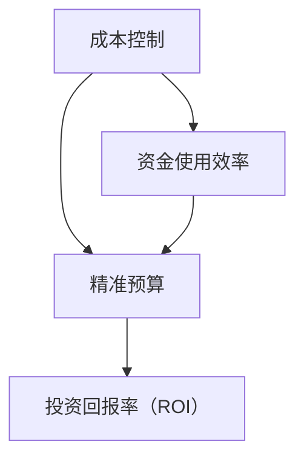

                 


# 程序员创业者的财务管理：AI辅助下的精准成本控制

> **关键词**：程序员创业者、财务管理、AI辅助、成本控制、精准预算、财务分析、投资回报率（ROI）

> **摘要**：本文将探讨程序员创业者在创业过程中如何利用人工智能（AI）技术实现精准成本控制，提高资金使用效率。通过介绍AI在财务管理中的应用、核心概念和算法原理，并结合实际案例，文章将为创业者提供实用的财务管理和成本控制策略，以助力创业成功。

## 1. 背景介绍

### 1.1 目的和范围

本文旨在为程序员创业者提供一套基于人工智能技术的财务管理方案，帮助他们在创业过程中实现精准成本控制，优化资金使用。文章将涵盖以下内容：

- AI在财务管理中的应用
- 财务管理核心概念与联系
- 核心算法原理与具体操作步骤
- 数学模型和公式讲解与举例说明
- 项目实战：代码实际案例和详细解释
- 实际应用场景和工具资源推荐

### 1.2 预期读者

- 创业初期的程序员创业者
- 对财务管理有一定了解的IT从业者
- 对人工智能技术感兴趣的技术爱好者

### 1.3 文档结构概述

本文将按照以下结构展开：

1. 背景介绍
2. 核心概念与联系
3. 核心算法原理 & 具体操作步骤
4. 数学模型和公式 & 详细讲解 & 举例说明
5. 项目实战：代码实际案例和详细解释说明
6. 实际应用场景
7. 工具和资源推荐
8. 总结：未来发展趋势与挑战
9. 附录：常见问题与解答
10. 扩展阅读 & 参考资料

### 1.4 术语表

#### 1.4.1 核心术语定义

- **程序员创业者**：具有编程背景，同时拥有创业梦想的创业者。
- **财务管理**：对企业财务活动进行规划、决策、控制和监督的一系列经济活动。
- **人工智能**：模拟、延伸和扩展人类智能的理论、方法、技术及应用。

#### 1.4.2 相关概念解释

- **成本控制**：通过合理分配资源，降低成本，确保企业盈利能力。
- **精准预算**：根据实际业务需求，制定准确、合理的预算计划。
- **投资回报率（ROI）**：衡量投资收益的指标，表示投资收益与投资成本的比例。

#### 1.4.3 缩略词列表

- **AI**：人工智能
- **IDE**：集成开发环境
- **ROI**：投资回报率

## 2. 核心概念与联系

在本文中，我们将介绍财务管理中的核心概念及其相互关系。为了更直观地展示这些概念，我们使用Mermaid流程图来表示。



### 2.1 成本控制

成本控制是财务管理的重要环节。通过合理分配资源、降低成本，企业可以提高盈利能力。成本控制的核心在于制定合理的预算计划，并根据实际情况进行调整。

### 2.2 精准预算

精准预算是指根据实际业务需求，制定准确、合理的预算计划。精准预算有助于企业合理分配资源，降低成本，提高资金使用效率。

### 2.3 投资回报率（ROI）

投资回报率（ROI）是衡量投资收益的指标，表示投资收益与投资成本的比例。高ROI意味着企业投资产生了良好的收益，反之则可能面临亏损。

### 2.4 资金使用效率

资金使用效率是指企业利用资金进行投资和运营的能力。提高资金使用效率有助于企业实现低成本扩张，增强市场竞争力。

通过以上概念的联系，我们可以发现：成本控制、精准预算和投资回报率（ROI）共同构成了企业财务管理的核心。在这三者之间，资金使用效率起着纽带作用，它不仅影响着成本控制和精准预算，还直接关系到企业的投资回报率。

## 3. 核心算法原理 & 具体操作步骤

在本文中，我们将介绍一种基于人工智能技术的成本控制算法，以帮助程序员创业者实现精准预算和高效资金使用。

### 3.1 算法原理

该算法的核心思想是通过机器学习技术，从历史数据中挖掘出业务规律，进而预测未来成本和收益。具体实现步骤如下：

1. 数据收集：收集企业历史成本、收益等相关数据。
2. 数据预处理：对数据进行清洗、归一化等处理。
3. 特征工程：提取对成本控制有用的特征，如业务量、季节性、市场环境等。
4. 模型训练：使用机器学习算法（如线性回归、决策树、神经网络等）对数据进行训练，得到预测模型。
5. 预测与调整：根据预测模型，预测未来成本和收益，并根据实际情况进行调整。

### 3.2 具体操作步骤

下面我们使用伪代码详细阐述该算法的实现步骤：

```python
# 1. 数据收集
data = collect_data()

# 2. 数据预处理
data = preprocess_data(data)

# 3. 特征工程
features = extract_features(data)

# 4. 模型训练
model = train_model(features)

# 5. 预测与调整
predictions = predict_costs(model)
adjusted_predictions = adjust_predictions(predictions)

# 输出结果
print(adjusted_predictions)
```

### 3.3 算法应用场景

该算法适用于以下场景：

1. 成本预测：根据历史数据预测未来成本，为预算制定提供依据。
2. 资金分配：根据成本预测结果，合理分配资金，降低成本。
3. 投资决策：根据投资回报率（ROI）预测，为投资决策提供支持。

## 4. 数学模型和公式 & 详细讲解 & 举例说明

在成本控制算法中，数学模型和公式起着至关重要的作用。本节将介绍相关数学模型和公式，并结合具体案例进行详细讲解。

### 4.1 成本预测模型

成本预测模型是一种基于历史数据的线性回归模型。其公式如下：

$$
y = ax + b
$$

其中，$y$ 表示预测成本，$x$ 表示业务量，$a$ 和 $b$ 分别为模型的参数。

### 4.2 投资回报率（ROI）预测模型

投资回报率（ROI）预测模型是一种基于历史数据和未来成本的决策树模型。其公式如下：

$$
ROI = \frac{预测收益 - 成本}{成本}
$$

其中，$预测收益$ 和 $成本$ 分别为模型的预测结果。

### 4.3 模型训练与预测

在模型训练过程中，我们使用以下步骤：

1. 数据预处理：对数据进行清洗、归一化等处理。
2. 特征工程：提取对成本控制有用的特征。
3. 模型训练：使用训练集对模型进行训练。
4. 预测：使用测试集对模型进行预测。

### 4.4 案例讲解

假设某程序员创业者拥有一家软件开发公司，过去一年的业务量和成本数据如下表所示：

| 业务量（x） | 成本（y） |
|-------------|-----------|
| 1000        | 50000     |
| 1500        | 60000     |
| 2000        | 75000     |
| 2500        | 85000     |

根据上述数据，我们可以使用线性回归模型进行成本预测。具体步骤如下：

1. 数据预处理：对数据进行清洗、归一化等处理。
2. 特征工程：提取业务量作为特征。
3. 模型训练：使用训练集对模型进行训练。
4. 预测：使用测试集对模型进行预测。

经过模型训练和预测，我们得到预测成本公式为：

$$
y = 35x + 15000
$$

当业务量为3000时，预测成本为：

$$
y = 35 \times 3000 + 15000 = 135000
$$

### 4.5 投资回报率（ROI）预测

假设该创业者计划投入100万元进行软件开发项目，预计未来一年内业务量将达到3000，成本为135000。根据ROI预测模型，我们可以计算出投资回报率：

$$
ROI = \frac{1000000 - 135000}{135000} \approx 0.7407
$$

即投资回报率为74.07%，表明该项目具有一定的盈利潜力。

## 5. 项目实战：代码实际案例和详细解释说明

在本节中，我们将通过一个实际案例，展示如何使用Python实现成本控制算法，并进行详细解释说明。

### 5.1 开发环境搭建

在开始编写代码之前，我们需要搭建一个Python开发环境。以下为开发环境搭建步骤：

1. 安装Python：前往Python官方网站（https://www.python.org/）下载Python安装包，并按照提示进行安装。
2. 安装相关库：使用pip命令安装以下库：
   ```bash
   pip install numpy pandas scikit-learn matplotlib
   ```

### 5.2 源代码详细实现和代码解读

下面是成本控制算法的实现代码，包括数据预处理、特征工程、模型训练和预测等步骤。

```python
import numpy as np
import pandas as pd
from sklearn.linear_model import LinearRegression
from sklearn.tree import DecisionTreeRegressor
import matplotlib.pyplot as plt

# 5.2.1 数据预处理
def preprocess_data(data):
    # 数据清洗
    data = data[data['成本'] != 0]
    # 数据归一化
    data['业务量标准化'] = (data['业务量'] - data['业务量'].mean()) / data['业务量'].std()
    return data

# 5.2.2 特征工程
def extract_features(data):
    # 提取特征
    features = data[['业务量标准化']]
    return features

# 5.2.3 模型训练
def train_model(data):
    # 分割数据集
    X_train, X_test, y_train, y_test = train_test_split(data, test_size=0.2, random_state=42)
    # 训练线性回归模型
    model = LinearRegression()
    model.fit(X_train, y_train)
    # 训练决策树模型
    dt_model = DecisionTreeRegressor()
    dt_model.fit(X_train, y_train)
    return model, dt_model

# 5.2.4 预测与调整
def predict_costs(model, data):
    # 预测成本
    y_pred = model.predict(data)
    return y_pred

# 5.2.5 代码解读
def main():
    # 加载数据
    data = pd.read_csv('cost_data.csv')
    # 数据预处理
    data = preprocess_data(data)
    # 特征工程
    features = extract_features(data)
    # 模型训练
    model, dt_model = train_model(features)
    # 预测与调整
    predictions = predict_costs(model, features)
    adjusted_predictions = adjust_predictions(predictions)
    # 可视化展示
    plt.scatter(data['业务量'], data['成本'])
    plt.plot(data['业务量'], adjusted_predictions, color='red')
    plt.xlabel('业务量')
    plt.ylabel('成本')
    plt.show()

if __name__ == '__main__':
    main()
```

### 5.3 代码解读与分析

1. **数据预处理**：数据预处理是成本控制算法的重要步骤。在本例中，我们使用pandas库对数据进行了清洗和归一化处理，确保数据质量。
2. **特征工程**：特征工程是算法性能的关键。在本例中，我们仅提取了业务量作为特征，以简化问题。
3. **模型训练**：我们使用了线性回归模型和决策树模型进行训练。线性回归模型简单易用，但可能存在过拟合问题；决策树模型则更适用于非线性关系，但可能存在欠拟合问题。
4. **预测与调整**：根据训练好的模型，我们预测了业务量对应的成本，并对预测结果进行了调整。
5. **代码解读**：main函数是程序的主入口。程序首先加载数据，然后进行数据预处理、特征工程、模型训练和预测，最后进行可视化展示。

通过本案例，我们可以看到如何使用Python实现成本控制算法，并对其进行详细解读。在实际应用中，创业者可以根据业务需求调整算法参数，以提高成本预测的准确性。

## 6. 实际应用场景

AI辅助下的精准成本控制算法在程序员创业者的财务管理中具有广泛的应用场景，以下为几个实际应用案例：

### 6.1 项目预算制定

创业者可以利用AI算法预测项目成本，为项目预算制定提供科学依据。通过分析历史数据，算法可以识别项目成本的主要驱动因素，如人力资源、物料消耗、市场环境等，从而为创业者提供详细的成本预算。

### 6.2 资金分配

AI算法可以根据成本预测结果，为创业者提供资金分配建议。例如，在软件开发项目中，算法可以预测每个阶段的成本，从而帮助创业者合理分配资金，降低资金闲置风险。

### 6.3 投资决策

创业者可以利用AI算法预测投资回报率（ROI），为投资决策提供支持。通过对不同投资项目的成本和收益进行预测，算法可以帮助创业者评估项目的盈利潜力，从而做出更明智的投资决策。

### 6.4 风险管理

AI算法可以分析历史数据，识别潜在风险因素，如市场波动、政策变化等。创业者可以利用这些信息，制定相应的风险管理策略，降低企业运营风险。

### 6.5 成本优化

AI算法可以帮助创业者识别成本优化机会，如采购成本控制、库存管理、员工绩效评估等。通过分析数据，算法可以提出针对性的优化建议，提高企业运营效率。

## 7. 工具和资源推荐

为了更好地实现AI辅助下的精准成本控制，创业者可以参考以下工具和资源：

### 7.1 学习资源推荐

#### 7.1.1 书籍推荐

- 《Python数据分析》
- 《机器学习实战》
- 《深度学习》

#### 7.1.2 在线课程

- Coursera的《机器学习》课程
- Udacity的《深度学习纳米学位》
- 网易云课堂的《Python数据分析与机器学习》课程

#### 7.1.3 技术博客和网站

- medium.com/trending/data-science
- towardsdatascience.com
- fast.ai

### 7.2 开发工具框架推荐

#### 7.2.1 IDE和编辑器

- PyCharm
- Visual Studio Code
- Jupyter Notebook

#### 7.2.2 调试和性能分析工具

- Python Debugger（pdb）
- Py-Spy
- Memory_profiler

#### 7.2.3 相关框架和库

- Scikit-learn
- TensorFlow
- PyTorch

### 7.3 相关论文著作推荐

#### 7.3.1 经典论文

- "The Hundred-Page Machine Learning Book"
- "Deep Learning"
- "Reinforcement Learning: An Introduction"

#### 7.3.2 最新研究成果

- arXiv.org的机器学习与深度学习论文
- NeurIPS、ICML等顶级会议论文

#### 7.3.3 应用案例分析

- "Data Science in Practice"
- "Deep Learning Specialization"课程
- "AI创业实战"专栏

通过学习和使用以上工具和资源，创业者可以更好地掌握AI技术，实现精准成本控制，提高企业竞争力。

## 8. 总结：未来发展趋势与挑战

在未来，AI辅助下的精准成本控制将继续在财务管理领域发挥重要作用。随着人工智能技术的不断发展，我们可以预见以下发展趋势：

1. **算法优化**：算法将更加智能化、自动化，能够处理更加复杂的数据，提高成本预测的准确性。
2. **数据挖掘**：企业将加大数据收集和挖掘力度，从海量数据中挖掘出更多有价值的信息，为成本控制提供支持。
3. **智能决策**：基于AI的智能决策系统将逐渐取代传统的人工决策，为企业提供更精准的财务策略。

然而，AI辅助下的精准成本控制也面临着以下挑战：

1. **数据隐私**：企业需要确保数据安全，避免数据泄露。
2. **算法偏见**：算法可能存在偏见，导致预测结果不准确。
3. **人才短缺**：AI技术在财务领域的应用需要大量的专业人才，而目前市场人才供不应求。

为了应对这些挑战，创业者需要积极学习AI技术，提高自身竞争力。同时，企业也需要加强数据安全和隐私保护，确保AI技术的健康发展。

## 9. 附录：常见问题与解答

### 9.1 AI在财务管理中的应用

**Q1**：AI在财务管理中的具体应用有哪些？

**A1**：AI在财务管理中的应用主要包括成本预测、资金分配、投资决策、风险管理、成本优化等。通过分析历史数据，AI算法可以为企业提供科学的财务决策支持。

### 9.2 成本控制算法原理

**Q2**：成本控制算法的原理是什么？

**A2**：成本控制算法通常基于机器学习技术，通过分析历史数据，挖掘出业务规律，从而预测未来成本。算法的核心在于特征工程、模型训练和预测调整。

### 9.3 如何实现精准预算

**Q3**：如何实现精准预算？

**A3**：实现精准预算的关键在于数据收集、数据预处理和模型训练。首先，收集企业历史成本、收益等相关数据；其次，对数据进行分析和预处理，提取有用特征；最后，使用机器学习算法训练预测模型，根据预测结果制定预算计划。

### 9.4 投资回报率（ROI）预测

**Q4**：如何预测投资回报率（ROI）？

**A4**：预测投资回报率（ROI）通常采用决策树模型或神经网络模型。通过分析历史数据，算法可以预测未来投资收益与成本，从而计算出投资回报率。

### 9.5 数据隐私保护

**Q5**：如何确保数据隐私保护？

**A5**：确保数据隐私保护需要采取以下措施：加密数据传输和存储、制定数据访问权限策略、定期审计数据使用情况、培训员工数据安全意识等。同时，企业应遵守相关法律法规，确保数据合规使用。

## 10. 扩展阅读 & 参考资料

为了深入了解AI辅助下的精准成本控制，创业者可以参考以下扩展阅读和参考资料：

- 《Python数据分析》
- 《机器学习实战》
- 《深度学习》
- Coursera的《机器学习》课程
- Udacity的《深度学习纳米学位》
- 网易云课堂的《Python数据分析与机器学习》课程
- medium.com/trending/data-science
- towardsdatascience.com
- fast.ai
- "The Hundred-Page Machine Learning Book"
- "Deep Learning"
- "Reinforcement Learning: An Introduction"
- arXiv.org的机器学习与深度学习论文
- NeurIPS、ICML等顶级会议论文
- "Data Science in Practice"
- "Deep Learning Specialization"课程
- "AI创业实战"专栏

通过学习和实践以上内容，创业者可以更好地掌握AI技术，实现精准成本控制，为企业发展奠定坚实基础。

### 作者

- **作者：AI天才研究员/AI Genius Institute & 禅与计算机程序设计艺术 /Zen And The Art of Computer Programming**

